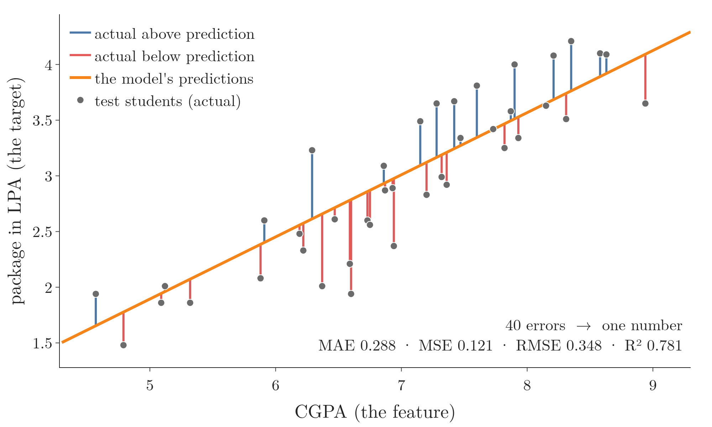
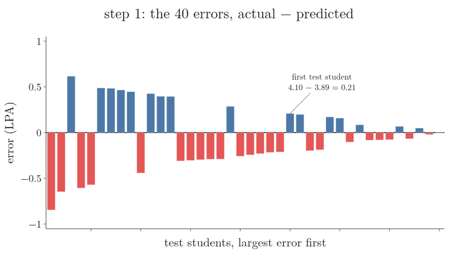
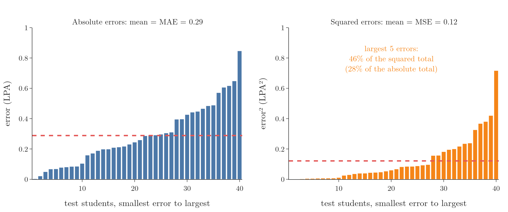
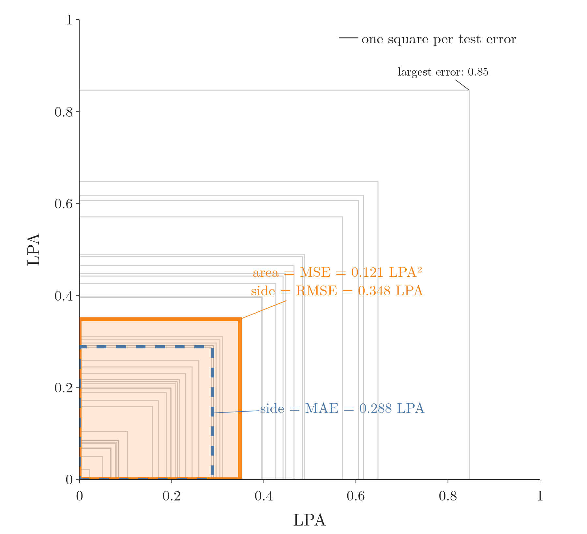
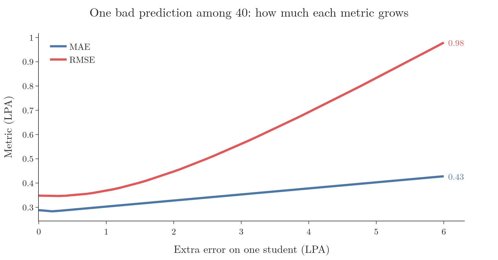
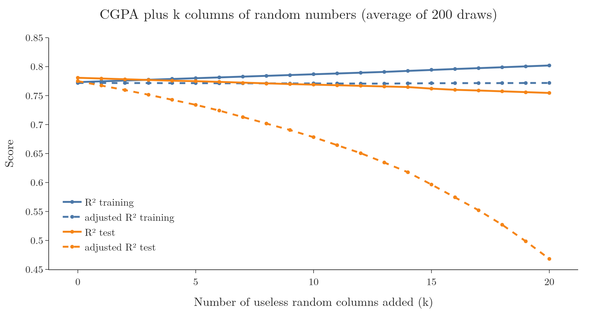

<!-- where-this-fits: generated by course_map/build_map.py; edit concepts.yaml, not this block -->
> **Where this fits:** Pipeline map step 9 (Evaluate). See the [Course map](../01-course-map/note.md).
>
> 
>
> - **Builds on:** Best-fit line and squared error ([Note 50](../50-simple-linear-regression/note.md)).
> - **Leads to:** Regression trees ([Note 99](../99-regression-trees/note.md)); ANN for regression ([Note 1013](../1013-graduate-admission-ann/note.md)).
> - **Compare with:** Loss functions in deep learning ([Note 1014](../1014-dl-loss-functions/note.md)).
<!-- /where-this-fits -->

## 1. Overview

> **Key point:** A regression metric turns all the errors on the test set into one number. Five are common: MAE, MSE, RMSE, R² and adjusted R².

After training a regression model, we need to know how good it is. A **regression metric** (G-1652) compares the model's predictions with the true values on the test set and summarises the errors as one number, like a report card that sums up a term's work in one grade.

Three words recur. A **feature** (G-772) is an input variable (one column of the data table), here CGPA. The **target** (G-1949) is the output we predict, here the package. An **observation** (G-1374) is one record (one row), here one student.

This Note covers five metrics, in order:

| Metric | Answers |
|---|---|
| MAE | How far off is a typical prediction, in the target's units? |
| MSE | The average squared error; what training minimises |
| RMSE | MSE brought back to the target's units |
| R² | How much better than guessing the average is the model? |
| Adjusted R² | R², but with a penalty for useless features |

No single metric is best for every problem, which is why several exist. All the numbers below come from the simple linear regression of the previous Notes: CGPA to package, tested on 40 students.

Throughout, $y_i$ is a student's actual package, $\hat y_i$ the model's prediction, and $n$ the number of test students.

Figure 1 shows what every metric starts from. Each test student has an error: the vertical stick between the actual package and the line's prediction. Each metric below is a different way to turn these 40 sticks into one number.



## 2. Mean absolute error (MAE)

> **Key point:** MAE is the average size of the errors, ignoring their sign. On the placement data it is 0.29 LPA.

The plain idea: measure how long each error stick of Figure 1 is, ignore whether it points up or down, and average the lengths. This average is the **mean absolute error (MAE)** (G-1194). Figure 2 does it step by step on the 40 test students.



In words: for each point, take the gap between the actual and the predicted value, drop its sign, and average these gaps.

$$\text{MAE} = \frac{1}{n}\sum_{i=1}^{n} |y_i - \hat y_i|$$

With numbers: the first test student has an actual package of 4.10 and a prediction of 3.89, an absolute error of 0.21. Averaging all 40 such errors gives

$$\text{MAE} = 0.288 \text{ LPA}$$

The sign is dropped because some points lie above the line and some below; without the absolute value, positive and negative errors would cancel. Step 2 of Figure 2 shows how badly: the signed errors average to $-0.041$, as if the model were almost perfect.

**Advantages:**

- **Same units as the target.** The model is off by about 0.29 lakh rupees per year on average, a statement anyone can understand.
- **Robust to outliers.** An **outlier** (G-1420) is an observation far from the rest. One very wrong prediction raises MAE only in proportion to its size (Section 5).

**Disadvantage:** the absolute value has a sharp corner at 0, so it cannot be differentiated there. The corner makes MAE awkward to use as the function that training minimises (the previous Note chose squares for exactly this reason).

## 3. Mean squared error (MSE)

> **Key point:** MSE averages the squared errors. MSE is smooth and punishes large errors heavily, but its units are squared. On the placement data it is 0.121.

In words: square each error and average the squares. The result is the **mean squared error (MSE)** (G-1201).

$$\text{MSE} = \frac{1}{n}\sum_{i=1}^{n} (y_i - \hat y_i)^2$$

With numbers: the first student's error of 0.21 becomes $0.21^2 = 0.044$. Averaging all 40 squares gives

$$\text{MSE} = 0.121$$

**Advantage:** the square is smooth everywhere, so MSE can be differentiated. Smoothness is why MSE is used as the **loss function** (G-706) that models minimise during training, as in the previous Note.

**Disadvantages:**

- **Squared units.** 0.121 is in LPA², which has no everyday meaning.
- **Sensitive to outliers.** Squaring makes a large error dominate: an error of 3 counts 9, while ten errors of 0.3 together count only 0.9.

Figure 3 shows the effect on the 40 test errors. Watch the right panel: squaring flattens the small errors and stretches the large ones.



The 5 largest errors make up 28% of the absolute total but 46% of the squared total.

## 4. Root mean squared error (RMSE)

> **Key point:** RMSE is the square root of MSE: back in the target's units, but still punishing large errors. On the placement data it is 0.35 LPA.

In words: compute the MSE, then take its square root. The result is the **root mean squared error (RMSE)** (G-1705).

$$\text{RMSE} = \sqrt{\text{MSE}} = \sqrt{\frac{1}{n}\sum_{i=1}^{n} (y_i - \hat y_i)^2}$$

With numbers:

$$\text{RMSE} = \sqrt{0.121} = 0.348 \text{ LPA}$$

RMSE is in LPA again, like MAE, so it is easy to report. RMSE is always at least as large as MAE (here 0.35 against 0.29), because the squares give extra weight to the larger errors. The two are equal only when every error has the same size.

Figure 4 makes both numbers into lengths. Draw each test error as a square with side equal to the error's size (grey). MSE is the average area of these squares, 0.121. The orange square has exactly that area, so its side is RMSE, 0.348. MAE is the average side, 0.288 (blue). The few big squares, such as the one with side 0.85, add a lot of area, so the square with the average area is longer than the average side.



> **Extra:** The proof. Write $a_i = |y_i - \hat y_i|$, so MAE is the average of the $a_i$. Then
>
> $$\text{MSE} - \text{MAE}^2 = \frac{1}{n}\sum a_i^2 - \text{MAE}^2 = \frac{1}{n}\sum (a_i - \text{MAE})^2 \ge 0$$
>
> so $\text{RMSE} = \sqrt{\text{MSE}} \ge \text{MAE}$. The gap is the spread of the error sizes.

> **Python:** The three error metrics.
>
> ```python
> from sklearn.metrics import (mean_absolute_error,
>     mean_squared_error, root_mean_squared_error)
>
> mean_absolute_error(y_test, y_pred)       # 0.288
> mean_squared_error(y_test, y_pred)        # 0.121
> root_mean_squared_error(y_test, y_pred)   # 0.348
> ```
>
> Older code computes RMSE as `np.sqrt(mean_squared_error(...))`; both give the same number.

## 5. MAE versus RMSE with an outlier

> **Key point:** One very wrong prediction barely moves MAE but pushes RMSE up sharply.

Figure 5 takes the 40 test predictions and makes one of them worse and worse.



With one prediction 6 LPA off, MAE rises from 0.29 to 0.43, while RMSE rises from 0.35 to 0.98. The squares let a single error dominate.

So the choice depends on the problem:

- If occasional large errors are what matters most (for example, a badly wrong price estimate is very costly), use RMSE: it makes them visible.
- If the data contains outliers that should not dominate the assessment, use MAE.

## 6. R² score

> **Key point:** R² compares the model with the simplest possible model, "always predict the average". R² is 1 for a perfect model and 0 for a model no better than the average. On the placement data it is 0.78.

### 6.1 The idea

> **Key point:** R² measures how much of the error of "guessing the average" the model removes.

MAE, MSE and RMSE have a weakness: their size depends on the units. An RMSE of 0.35 is small for packages in LPA but would be huge for a target measured in thousands. We need a comparison point.

The simplest model of all ignores the feature and predicts the average package, 2.96 LPA, for every test student: the flat line in the first frame of Figure 6. Each error is drawn as a square, so the total orange area is the sum of squared errors: 22.13. Watch the line turn into the regression line: the squares shrink until their total is only 4.85, and the R² bar fills.


### 6.2 The formula

> **Key point:** R² is 1 minus (squared errors of the model) divided by (squared errors of the average).

In words: divide the model's sum of squared errors by the average-only model's sum of squared errors, and subtract the result from 1.

$$R^2 = 1 - \frac{SS_{res}}{SS_{tot}} = 1 - \frac{\sum (y_i - \hat y_i)^2}{\sum (y_i - \bar{y})^2}$$

Here $SS_{res}$ (the **residual sum of squares**, G-1684) is the model's total squared error, and $SS_{tot}$ (the **total sum of squares**, G-1993) is the total squared error of always predicting the mean $\bar{y}$.

With numbers from Figure 6:

$$R^2 = 1 - \frac{4.85}{22.13} = 1 - 0.219 = 0.781$$

> **Python:** R² score.
>
> ```python
> from sklearn.metrics import r2_score
> r2_score(y_test, y_pred)    # 0.781
> ```

### 6.3 Reading R²

> **Key point:** 0.78 means the model removes 78% of the error of guessing the average; the CGPA explains 78% of the variation in packages.

- **$R^2 = 1$:** every prediction is exact ($SS_{res} = 0$).
- **$R^2 = 0$:** the model is no better than predicting the average.
- **$R^2 < 0$:** the model is worse than predicting the average, which can happen on a test set with a bad model.

Whether R² can be negative depends on which data it is computed on:

- **On the training data** of a least-squares line, R² is always between 0 and 1. The flat average line is itself one of the candidate lines, and least squares picks the line with the smallest squared error, so the fitted line can never do worse than the average line: $SS_{res} \le SS_{tot}$.
- **On test data** nothing guarantees this. The line was fitted to other observations, so it can miss the test observations by more than their own average does. Then $SS_{res} > SS_{tot}$ and R² is negative (scikit-learn `r2_score` docs).

Here, $R^2 = 0.78$: CGPA explains about 78% of the variation in packages; the remaining 22% comes from things not in the data, such as interviews (the stochastic errors of the earlier Note).

R² is also called the **coefficient of determination** (G-1717).

The name R² is no accident. For simple linear regression, R² on the training data equals the square of the correlation coefficient $r$ between the feature and the target (see the [linear regression maths Note](../51-linear-regression-maths/note.md), section 5.1). For CGPA and package on the 160 training students, $r = 0.879$ and $r^2 = 0.879^2 = 0.773$, exactly the training R² in the table of Section 7.1.

Squaring makes correlations easier to compare. A correlation of 0.7 gives $R^2 = 0.49$ and a correlation of 0.5 gives $R^2 = 0.25$: the first feature explains about twice as much of the variation as the second, which the raw values 0.7 and 0.5 do not show.

## 7. Adjusted R²

> **Key point:** Adding features can push R² up even when the new features are useless. Adjusted R² subtracts a penalty for each feature, so it only rises when a feature truly helps.

### 7.1 The problem with R²

> **Key point:** On the training data, R² never goes down when a feature is added, even a feature of random numbers.

Suppose we add a feature of random numbers to the placement data, one that has nothing to do with packages. On the training data, R² still creeps up. The new feature gives the model one more number to tune, and setting that number to 0 gives back the old model, so the fit on the training data can never get worse. A random feature almost always matches the leftover errors a little by chance, so R² usually rises.

Figure 7 adds 0 to 20 features of random numbers next to CGPA. The split is the same each time; only the random numbers change, and every score is the average over 200 draws of them.



| Random features added | 0 | 1 | 5 | 10 | 20 |
|---|---|---|---|---|---|
| R², training | 0.773 | 0.775 | 0.780 | 0.787 | 0.802 |
| Adjusted R², training | 0.772 | 0.772 | 0.772 | 0.771 | 0.772 |
| R², test | 0.781 | 0.779 | 0.775 | 0.769 | 0.755 |
| Adjusted R², test | 0.775 | 0.767 | 0.734 | 0.678 | 0.468 |

The training R² rises from 0.773 to 0.802, which looks like progress. The test R² shows the truth: it falls from 0.781 to 0.755, because the extra features are noise. Adjusted R² on the training data stays at 0.772, so it reports the true story without needing a test set.

### 7.2 The formula

> **Key point:** Adjusted R² scales the unexplained part by $(n-1)/(n-1-k)$, which grows with the number of features $k$.

In words: **adjusted R²** (G-177) takes the part R² leaves unexplained, $1 - R^2$, makes it larger according to how many features $k$ the model uses compared with the number of observations $n$, and subtracts that from 1 (ISLR §6.1.3).

$$R_{adj}^2 = 1 - \frac{(1 - R^2)(n - 1)}{n - 1 - k}$$

With numbers, for CGPA alone on the test set ($R^2 = 0.781$, $n = 40$, $k = 1$):

$$R_{adj}^2 = 1 - \frac{0.219 \times 39}{38} = 1 - 0.225 = 0.775$$

How it behaves:

- **A useless feature:** $k$ goes up by 1, which makes the fraction larger, while $R^2$ barely changes. Adjusted R² falls.
- **A useful feature:** $R^2$ rises enough to outweigh the penalty. Adjusted R² rises.

In Figure 7, adjusted R² on the training data stays flat at 0.772 however many random features are added: adjusted R² is not fooled. On the small test set (40 observations), the penalty is strong, and adjusted R² falls from 0.775 to 0.468 with 20 random features.

> **Extra:** A version of this demonstration sometimes builds a "useful" feature, such as an IQ score, by adding small noise to the package itself. Such a feature is made from the answer, so it would never exist in real data. It is **target leakage** (G-1948): information about the answer that the model should not have (Kaufman et al. 2012). The honest version of the lesson is the one above: useless features raise R² on the training data, and adjusted R² exposes them. Adjusted R² is most useful with multiple linear regression, the next Note.

> **Extra:** scikit-learn has no function for adjusted R²; we compute it from `r2_score` with the formula above. Here $n$ is the number of observations in the set being scored (40 for the test set) and $k$ the number of features.

## 8. Summary

| Metric | Formula | Placement data | Units | Outliers |
|---|---|---|---|---|
| MAE | $\frac{1}{n}\sum \lvert y_i - \hat y_i\rvert$ | 0.288 | LPA | robust |
| MSE | $\frac{1}{n}\sum (y_i - \hat y_i)^2$ | 0.121 | LPA² | sensitive |
| RMSE | $\sqrt{\text{MSE}}$ | 0.348 | LPA | sensitive |
| R² | $1 - SS_{res}/SS_{tot}$ | 0.781 | none | sensitive |
| Adjusted R² | $1 - (1 - R^2)\frac{n-1}{n-1-k}$ | 0.775 | none | sensitive |

- MAE and RMSE are in the target's units; RMSE is always at least as large as MAE and reacts more to large errors.
- MSE is the usual loss for training, because it can be differentiated.
- R² compares the model with always predicting the average: 1 is perfect, 0 is no better, below 0 is worse (possible on test data, never on the training data of a least-squares line).
- For one feature, training R² is the squared correlation $r^2$.
- R² never falls on the training data when features are added; adjusted R² penalises each feature and so detects useless ones.

## 9. Sources

**Built from**

- CampusX, "Regression Metrics | MSE, MAE & RMSE | R2 Score & Adjusted R2 Score", YouTube, https://www.youtube.com/watch?v=Ti7c-Hz7GSM
- StatQuest with Josh Starmer, "R-squared, Clearly Explained!!!", YouTube, https://www.youtube.com/watch?v=bMccdk8EdGo. The link between R² and the squared correlation (section 6.3), and the idea of comparing the variation around the mean line with the variation around the fitted line (Figure 6); drawing the errors as squares is our own.

**Other references**

- James, G., Witten, D., Hastie, T. and Tibshirani, R. (2021). *An Introduction to Statistical Learning* (ISLR), 2nd ed. Springer. §6.1.3 (adjusted R²).
- scikit-learn API reference, `sklearn.metrics.r2_score` (the score can be negative, because a model can be arbitrarily worse than predicting the mean). scikit-learn.org.
- Kaufman, S., Rosset, S., Perlich, C. and Stitelman, O. (2012). Leakage in Data Mining: Formulation, Detection, and Avoidance. *ACM Transactions on Knowledge Discovery from Data* 6(4).

## 10. Key terms

| Term | Meaning |
|---|---|
| Feature | An input variable: one column of the data table |
| Target | The output we predict |
| Observation | One record: one row of the data table |
| Regression metric | A number that summarises how close a regression model's predictions are to the true values |
| Mean absolute error (MAE) | The average absolute difference between actual and predicted values |
| Mean squared error (MSE) | The average squared difference between actual and predicted values |
| Root mean squared error (RMSE) | The square root of MSE, in the target's units |
| R² score (coefficient of determination) | 1 minus the model's squared error divided by the squared error of always predicting the mean |
| Residual sum of squares (G-1684) | The total squared error of the model's predictions |
| Total sum of squares | The total squared error of always predicting the mean |
| Adjusted R² | R² with a penalty for the number of features |
| Target leakage | Building a feature from the answer itself, so the model sees information it would not have in real use |
