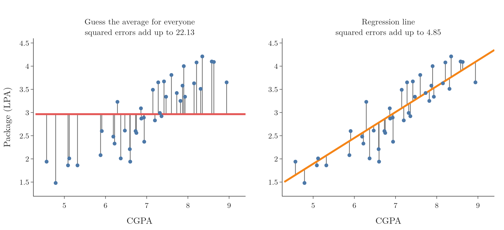

<!-- where-this-fits: generated by course_map/build_map.py; edit concepts.yaml, not this block -->
> **Where this fits:** Pipeline map step 9 (Evaluate). See the [Course map](../01-course-map/note.md).
>
> 
>
> - **Builds on:** Best-fit line and squared error ([Note 51](../51-linear-regression-maths/note.md)).
> - **Leads to:** Regression trees ([Note 99](../99-regression-trees/note.md)).
<!-- /where-this-fits -->

## 1. Overview

> **Key point:** A regression metric turns all the errors on the test set into one number. Five are common: MAE, MSE, RMSE, R² and adjusted R².

After training a regression model, we need to know how good it is. A **metric** compares the model's predictions with the true values on the test set and summarises the errors as one number.

This Note covers five metrics, in order:

| Metric | Answers |
|---|---|
| MAE | How far off is a typical prediction, in the output's units? |
| MSE | The average squared error; what training minimises |
| RMSE | MSE brought back to the output's units |
| R² | How much better than guessing the average is the model? |
| Adjusted R² | R², but with a penalty for useless input columns |

No single metric is best for every problem, which is why several exist. All the numbers below come from the simple linear regression of the previous Notes: CGPA to package, tested on 40 students.

Throughout, $y_i$ is a student's actual package, $\hat{y}_i$ the model's prediction, and $n$ the number of test students.

## 2. Mean absolute error (MAE)

> **Key point:** MAE is the average size of the errors, ignoring their sign. On the placement data it is 0.29 LPA.

In words: for each point, take the gap between the actual and the predicted value, drop its sign, and average these gaps.

$$\text{MAE} = \frac{1}{n}\sum_{i=1}^{n} |y_i - \hat{y}_i|$$

With numbers: the first test student has an actual package of 4.10 and a prediction of 3.89, an absolute error of 0.21. Averaging all 40 such errors gives

$$\text{MAE} = 0.288 \text{ LPA}$$

The sign is dropped because some points lie above the line and some below; without the absolute value, positive and negative errors would cancel.

**Advantages:**

- **Same units as the output.** The model is off by about 0.29 lakh rupees per year on average, a statement anyone can understand.
- **Robust to outliers.** One very wrong prediction raises MAE only in proportion to its size (Section 5).

**Disadvantage:** the absolute value has a sharp corner at 0, so it cannot be differentiated there. That makes MAE awkward to use as the function that training minimises (the previous Note chose squares for exactly this reason).

## 3. Mean squared error (MSE)

> **Key point:** MSE averages the squared errors. It is smooth and punishes large errors heavily, but its units are squared. On the placement data it is 0.121.

In words: square each error and average the squares.

$$\text{MSE} = \frac{1}{n}\sum_{i=1}^{n} (y_i - \hat{y}_i)^2$$

With numbers: the first student's error of 0.21 becomes $0.21^2 = 0.044$. Averaging all 40 squares gives

$$\text{MSE} = 0.121$$

**Advantage:** the square is smooth everywhere, so MSE can be differentiated. This is why it is used as the **loss function** that models minimise during training, as in the previous Note.

**Disadvantages:**

- **Squared units.** 0.121 is in LPA², which has no everyday meaning.
- **Sensitive to outliers.** Squaring makes a large error dominate: an error of 3 counts 9, while ten errors of 0.3 together count only 0.9.

## 4. Root mean squared error (RMSE)

> **Key point:** RMSE is the square root of MSE: back in the output's units, but still punishing large errors. On the placement data it is 0.35 LPA.

In words: compute the MSE, then take its square root.

$$\text{RMSE} = \sqrt{\text{MSE}} = \sqrt{\frac{1}{n}\sum_{i=1}^{n} (y_i - \hat{y}_i)^2}$$

With numbers:

$$\text{RMSE} = \sqrt{0.121} = 0.348 \text{ LPA}$$

RMSE is in LPA again, like MAE, so it is easy to report. It is always at least as large as MAE (here 0.35 against 0.29), because the squares give extra weight to the larger errors.

> **Python:** The three error metrics.
>
> ```python
> from sklearn.metrics import (mean_absolute_error,
>     mean_squared_error, root_mean_squared_error)
>
> mean_absolute_error(y_test, y_pred)       # 0.288
> mean_squared_error(y_test, y_pred)        # 0.121
> root_mean_squared_error(y_test, y_pred)   # 0.348
> ```
>
> Older code computes RMSE as `np.sqrt(mean_squared_error(...))`; both give the same number. Older scikit-learn also had `mean_squared_error(..., squared=False)`, which has since been removed.

## 5. MAE versus RMSE with an outlier

> **Key point:** One very wrong prediction barely moves MAE but pushes RMSE up sharply.

Figure 1 takes the 40 test predictions and makes one of them worse and worse.


With one prediction 6 LPA off, MAE rises from 0.29 to 0.43, while RMSE rises from 0.35 to 0.98. The squares let a single error dominate.

So the choice depends on the problem:

- If occasional large errors are what matters most (for example, a badly wrong price estimate is very costly), use RMSE: it makes them visible.
- If the data contains outliers that should not dominate the assessment, use MAE.

## 6. R² score

> **Key point:** R² compares the model with the simplest possible model, "always predict the average". It is 1 for a perfect model and 0 for a model no better than the average. On the placement data it is 0.78.

### 6.1 The idea

> **Key point:** R² measures how much of the error of "guessing the average" the model removes.

MAE, MSE and RMSE have a weakness: their size depends on the units. An RMSE of 0.35 is small for packages in LPA but would be huge for a target measured in thousands. We need a comparison point.

The simplest model of all ignores the input and predicts the average package, 2.96 LPA, for every test student: the flat red line in Figure 2 (left). Its squared errors add up to 22.13. The regression line (right) has squared errors adding up to only 4.85.



### 6.2 The formula

> **Key point:** R² is 1 minus (squared errors of the model) divided by (squared errors of the average).

In words: divide the model's sum of squared errors by the average-only model's sum of squared errors, and subtract the result from 1.

$$R^2 = 1 - \frac{SS_{res}}{SS_{tot}} = 1 - \frac{\sum (y_i - \hat{y}_i)^2}{\sum (y_i - \bar{y})^2}$$

Here $SS_{res}$ (the **residual sum of squares**) is the model's total squared error, and $SS_{tot}$ (the **total sum of squares**) is the total squared error of always predicting the mean $\bar{y}$.

With numbers from Figure 2:

$$R^2 = 1 - \frac{4.85}{22.13} = 1 - 0.219 = 0.781$$

> **Python:** R² score.
>
> ```python
> from sklearn.metrics import r2_score
> r2_score(y_test, y_pred)    # 0.781
> ```

### 6.3 Reading R²

> **Key point:** 0.78 means the model removes 78% of the error of guessing the average; the CGPA explains 78% of the variation in packages.

- **$R^2 = 1$:** every prediction is exact ($SS_{res} = 0$).
- **$R^2 = 0$:** the model is no better than predicting the average.
- **$R^2 < 0$:** the model is worse than predicting the average. This can happen on a test set with a bad model.

Here, $R^2 = 0.78$: CGPA explains about 78% of the variation in packages; the remaining 22% comes from things not in the data, such as interviews (the stochastic errors of the earlier Note).

R² is also called the **coefficient of determination**.

## 7. Adjusted R²

> **Key point:** Adding input columns can push R² up even when the new columns are useless. Adjusted R² subtracts a penalty for each column, so it only rises when a column truly helps.

### 7.1 The problem with R²

> **Key point:** On the training data, R² never goes down when a column is added, even a column of random numbers.

Suppose we add a column of random numbers to the placement data, a column that has nothing to do with packages. On the training data, R² still creeps up: with more columns, the model can always bend a little closer to the training points, even by chance.

Figure 3 adds 0 to 20 columns of random numbers next to CGPA.


| Random columns added | 0 | 1 | 5 | 10 | 20 |
|---|---|---|---|---|---|
| R², training | 0.773 | 0.777 | 0.783 | 0.790 | 0.807 |
| Adjusted R², training | 0.772 | 0.774 | 0.774 | 0.774 | 0.778 |
| R², test | 0.781 | 0.782 | 0.795 | 0.783 | 0.763 |
| Adjusted R², test | 0.775 | 0.770 | 0.758 | 0.697 | 0.486 |

The training R² rises from 0.773 to 0.807, which looks like progress. It is not: the extra columns are noise.

### 7.2 The formula

> **Key point:** Adjusted R² scales the unexplained part by $(n-1)/(n-1-k)$, which grows with the number of input columns $k$.

In words: take the part R² leaves unexplained, $1 - R^2$, make it larger according to how many input columns $k$ the model uses compared with the number of rows $n$, and subtract that from 1.

$$R^2_{adj} = 1 - \frac{(1 - R^2)(n - 1)}{n - 1 - k}$$

With numbers, for CGPA alone on the test set ($R^2 = 0.781$, $n = 40$, $k = 1$):

$$R^2_{adj} = 1 - \frac{0.219 \times 39}{38} = 1 - 0.225 = 0.775$$

How it behaves:

- **A useless column:** $k$ goes up by 1, which makes the fraction larger, while $R^2$ barely changes. Adjusted R² falls.
- **A useful column:** $R^2$ rises enough to outweigh the penalty. Adjusted R² rises.

In Figure 3, adjusted R² on the training data stays flat at about 0.77 however many random columns are added: it is not fooled. On the small test set (40 rows), the penalty is strong, and adjusted R² falls from 0.775 to 0.486 with 20 random columns.

> **Extra:** A version of this demonstration sometimes builds a "useful" column, such as an IQ score, by adding small noise to the package itself. Such a column is made from the answer, so it would never exist in real data: it is target leakage. The honest version of the lesson is the one above: useless columns raise R² on the training data, and adjusted R² exposes them. It is most useful with multiple linear regression, the next Note.

> **Extra:** scikit-learn has no function for adjusted R²; we compute it from `r2_score` with the formula above. Note that $n$ is the number of rows in the set being scored (40 for the test set) and $k$ the number of input columns.

## 8. Summary

| Metric | Formula | Placement data | Units | Outliers |
|---|---|---|---|---|
| MAE | $\frac{1}{n}\sum \lvert y_i - \hat{y}_i\rvert$ | 0.288 | LPA | robust |
| MSE | $\frac{1}{n}\sum (y_i - \hat{y}_i)^2$ | 0.121 | LPA² | sensitive |
| RMSE | $\sqrt{\text{MSE}}$ | 0.348 | LPA | sensitive |
| R² | $1 - SS_{res}/SS_{tot}$ | 0.781 | none | sensitive |
| Adjusted R² | $1 - (1 - R^2)\frac{n-1}{n-1-k}$ | 0.775 | none | sensitive |

- MAE and RMSE are in the output's units; RMSE is always at least as large as MAE and reacts more to large errors.
- MSE is the usual loss for training, because it can be differentiated.
- R² compares the model with always predicting the average: 1 is perfect, 0 is no better, below 0 is worse.
- R² never falls on the training data when columns are added; adjusted R² penalises each column and so detects useless ones.

## 9. Key terms

| Term | Meaning |
|---|---|
| Regression metric | A number that summarises how close a regression model's predictions are to the true values |
| Mean absolute error (MAE) | The average absolute difference between actual and predicted values |
| Mean squared error (MSE) | The average squared difference between actual and predicted values |
| Root mean squared error (RMSE) | The square root of MSE, in the output's units |
| R² score (coefficient of determination) | 1 minus the model's squared error divided by the squared error of always predicting the mean |
| Residual sum of squares | The total squared error of the model's predictions |
| Total sum of squares | The total squared error of always predicting the mean |
| Adjusted R² | R² with a penalty for the number of input columns |
| Target leakage | Building an input column from the answer itself, so the model sees information it would not have in real use |
