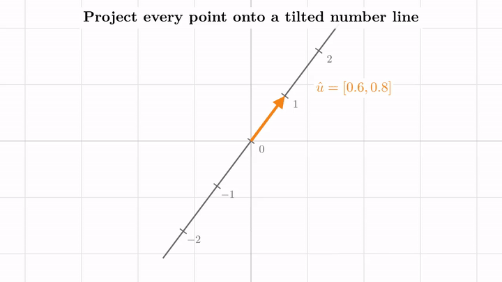
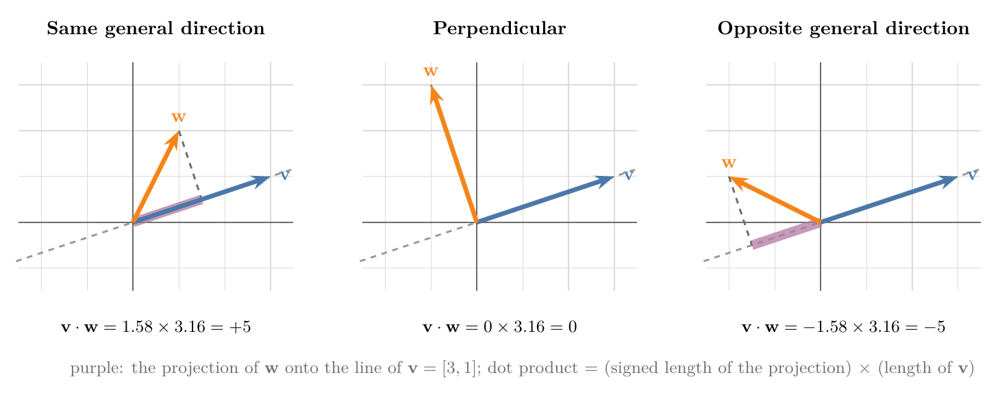

<!-- where-this-fits: generated by course_map/build_map.py; edit concepts.yaml, not this block -->
> **Where this fits:** Pipeline map step 0 (Foundations). See the [Course map](../01-course-map/note.md).
>
> 
>
> - **Builds on:** Vectors and feature vectors ([Note 360](../360-vectors-and-feature-vectors/note.md)).
<!-- /where-this-fits -->

## 1. Overview

> **Key point:** The dot product $\mathbf{v} \cdot \mathbf{w}$ is the length of $\mathbf{w}$'s shadow on the line of $\mathbf{v}$ times the length of $\mathbf{v}$; and every linear function that turns a vector into a number is a dot product with one particular vector.



The [dot product and cosine similarity Note](../362-dot-product-and-cosine-similarity/note.md) taught how to compute the dot product ("multiply matching components and add"), its two laws, and its geometric form $\lVert a \rVert \lVert b \rVert \cos\theta$. This Note adds two views that it does not cover:

- **Projection.** The dot product as "shadow length times length", and why that view does not depend on which vector casts the shadow (Sections 2 and 3).
- **Duality.** Why the component recipe has anything to do with projection: linear transformations from vectors to numbers are exactly dot products (Sections 4 to 6, and Figure 1).

It uses linear transformations and their matrices from the [linear transformations and matrices Note](../500-linear-transformations-and-matrices/note.md).

## 2. The dot product as a projection

> **Key point:** Project $\mathbf{w}$ onto the line through $\mathbf{v}$, then multiply the length of that projection by the length of $\mathbf{v}$; the result is negative when the projection points away from $\mathbf{v}$.

The PCA Notes use the **projection** (shadow) of a point onto a line, and the [PCA step by step Note](../48-pca-step-by-step/note.md) (section 2.1) showed that its length is $u^{\mathsf T}x$ when $u$ is a unit vector. Here the line's vector need not have length 1, and that gives a full picture of the dot product.

1. **In words:** drop $\mathbf{w}$ straight onto the line through the origin and $\mathbf{v}$. Measure the length of this shadow, with a minus sign if it points opposite to $\mathbf{v}$. Multiply by the length of $\mathbf{v}$.
2. **Formula:**
   $$\mathbf{v} \cdot \mathbf{w} = (\text{signed length of the projection of } \mathbf{w} \text{ onto } \mathbf{v}) \times \lVert \mathbf{v} \rVert$$
3. **Example:** for $\mathbf{v} = [3, 1]$ and $\mathbf{w} = [1, 2]$ (Figure 2, left), the shadow of $\mathbf{w}$ ends at $[1.5, 0.5]$, so its length is $\sqrt{1.5^2 + 0.5^2} \approx 1.58$; and $\lVert \mathbf{v} \rVert = \sqrt{10} \approx 3.16$.
   $$\mathbf{v} \cdot \mathbf{w} = 1.58 \times 3.16 = 5, \qquad \text{and by components: } 3 \times 1 + 1 \times 2 = 5$$



Figure 2 shows the three cases. These are the signs of the [dot product and cosine similarity Note](../362-dot-product-and-cosine-similarity/note.md) (section 5.2), now read as shadows:

- **Same general direction:** the shadow points along $\mathbf{v}$, so the dot product is positive.
- **Perpendicular:** the shadow is just the origin, the zero vector, so the dot product is 0.
- **Opposite general direction:** the shadow points away from $\mathbf{v}$, so the dot product is negative. With $\mathbf{w} = [-2, 1]$, the shadow ends at $[-1.5, -0.5]$ and $\mathbf{v} \cdot \mathbf{w} = -6 + 1 = -5$.

> **Extra:** This is the formula $\lVert a \rVert \lVert b \rVert \cos\theta$ of the dot product Note, regrouped. In a right triangle, $\lVert \mathbf{w} \rVert \cos\theta$ is the side along $\mathbf{v}$: exactly the signed length of the shadow.

## 3. Why the order does not matter

> **Key point:** Projecting $\mathbf{w}$ onto $\mathbf{v}$ and projecting $\mathbf{v}$ onto $\mathbf{w}$ look like different processes, but they give the same number.

The projection view treats the two vectors very differently: one casts the shadow, the other receives it. We could instead project $\mathbf{v}$ onto $\mathbf{w}$ and multiply by $\lVert \mathbf{w} \rVert$. The answer is the same, because $\mathbf{v} \cdot \mathbf{w} = \mathbf{w} \cdot \mathbf{v}$. Two steps explain why.

- **Equal lengths: symmetry.** If $\mathbf{v}$ and $\mathbf{w}$ have the same length, the picture is symmetric. Projecting $\mathbf{w}$ onto $\mathbf{v}$ is the mirror image of projecting $\mathbf{v}$ onto $\mathbf{w}$, across the line halfway between them, so both products are equal.
- **Scaling one vector.** Now stretch $\mathbf{v}$ to $2\mathbf{v}$, which breaks the symmetry. If $\mathbf{w}$ is projected onto $2\mathbf{v}$, the shadow is unchanged and the length we multiply by doubles. If $2\mathbf{v}$ is projected onto $\mathbf{w}$, the shadow doubles and $\lVert \mathbf{w} \rVert$ is unchanged. Either way the dot product doubles, so the two views still agree.

Any two vectors can be reached this way from two vectors of equal length, so the two views always agree.

## 4. Linear transformations from vectors to numbers

> **Key point:** A linear transformation from 2D to the number line is fixed by the two numbers where $\hat{\imath}$ and $\hat{\jmath}$ land, so its matrix is $1 \times 2$; applying it looks exactly like a dot product.

Why should "multiply matching components and add" have anything to do with projection? The answer, called duality, needs one more kind of linear transformation: one whose output is a single number, a point on the number line.

### 4.1 The visual test

> **Key point:** A transformation to the number line is linear when evenly spaced dots on any line land evenly spaced.

For a transformation to the number line, "grid lines stay parallel and evenly spaced" becomes: take any line of evenly spaced dots in the plane; after the transformation, the dots must still be evenly spaced on the number line (Figure 1, top). If some line of evenly spaced dots lands unevenly, the transformation is not linear.

### 4.2 The $1 \times 2$ matrix

> **Key point:** Each basis vector lands on a number, so each column of the matrix has one entry.

As always, the transformation is fixed by where $\hat{\imath}$ and $\hat{\jmath}$ land; now each lands on a single number. Written as columns, the two numbers make a $1 \times 2$ matrix.

1. **In words:** split the vector into its coordinates times $\hat{\imath}$ and $\hat{\jmath}$, and replace $\hat{\imath}$ and $\hat{\jmath}$ by the numbers they land on.
2. **Formula:** if $\hat{\imath}$ lands on $a$ and $\hat{\jmath}$ on $b$,
   $$\begin{bmatrix} a & b \end{bmatrix} \begin{bmatrix} x \\ y \end{bmatrix} = a\,x + b\,y$$
3. **Example:** if $\hat{\imath}$ lands on 1 and $\hat{\jmath}$ on $-2$, the vector $[4, 3] = 4\,\hat{\imath} + 3\,\hat{\jmath}$ lands on
   $$\begin{bmatrix} 1 & -2 \end{bmatrix} \begin{bmatrix} 4 \\ 3 \end{bmatrix} = 4 \times 1 + 3 \times (-2) = -2$$

That computation is the dot product $[1, -2] \cdot [4, 3]$. A $1 \times 2$ matrix looks just like a 2D vector tipped on its side, and multiplying it by a vector is the same arithmetic as the dot product with the upright vector. This is the row-times-column form $a^{\mathsf T}b$ of the [dot product and cosine similarity Note](../362-dot-product-and-cosine-similarity/note.md) (section 3.1), now read as a transformation.

## 5. Projection onto a tilted number line

> **Key point:** Projecting the plane onto a number line along the unit vector $\hat{u}$ is linear, and by symmetry its matrix is $[u_x \ \ u_y]$; so projecting is the dot product with $\hat{u}$.

Now forget that we already know the dot product relates to projection, and build it from scratch (Figure 1).

### 5.1 Projecting is linear

> **Key point:** Dropping every point straight onto a tilted line through the origin defines a linear transformation to numbers.

Place a copy of the number line diagonally in the plane, with 0 at the origin. Let $\hat{u}$ be the 2D unit vector whose tip sits at the number 1 on this line; in Figure 1, $\hat{u} = [0.6, 0.8]$. Projecting each point of the plane straight onto the line gives a number: its position on the line. This is a function from 2D vectors to numbers, and it passes the visual test: evenly spaced dots land evenly spaced (Figure 1, top right). So it is linear, and it has a $1 \times 2$ matrix.

### 5.2 Where $\hat{\imath}$ and $\hat{\jmath}$ land

> **Key point:** $\hat{\imath}$ lands on $u_x$ and $\hat{\jmath}$ on $u_y$, because projecting $\hat{\imath}$ onto $\hat{u}$ mirrors projecting $\hat{u}$ onto the x-axis.

To find the matrix, we ask where $\hat{\imath}$ and $\hat{\jmath}$ land (Figure 1, bottom left).

- **$\hat{\imath}$:** $\hat{\imath}$ and $\hat{u}$ are both unit vectors, so projecting $\hat{\imath}$ onto the line of $\hat{u}$ is the mirror image of projecting $\hat{u}$ onto the x-axis. The second is simply the x-coordinate of $\hat{u}$. So $\hat{\imath}$ lands on $u_x = 0.6$.
- **$\hat{\jmath}$:** by the same symmetry, with the y-axis, $\hat{\jmath}$ lands on $u_y = 0.8$.

So the matrix of the projection is $[u_x \ \ u_y] = [0.6 \ \ 0.8]$: the coordinates of $\hat{u}$, tipped on their side. Applying it to any vector is the dot product with $\hat{u}$.

1. **In words:** the position of a vector's shadow on the line of a unit vector $\hat{u}$ is the dot product with $\hat{u}$.
2. **Formula:**
   $$\begin{bmatrix} u_x & u_y \end{bmatrix} \begin{bmatrix} x \\ y \end{bmatrix} = u_x\,x + u_y\,y = \hat{u} \cdot \mathbf{x}$$
3. **Example:** for $\hat{u} = [0.6, 0.8]$ and $\mathbf{x} = [2, 1]$,
   $$\hat{u} \cdot \mathbf{x} = 0.6 \times 2 + 0.8 \times 1 = 2.0$$
   so $\mathbf{x}$ lands on the number 2.0 of the tilted line.

### 5.3 Non-unit vectors

> **Key point:** Scaling $\hat{u}$ by 3 multiplies every output by 3: the dot product with a non-unit vector is "project, then multiply by its length".

Scale $\hat{u}$ by 3, to $[1.8, 2.4]$. Its $1 \times 2$ matrix sends $\hat{\imath}$ and $\hat{\jmath}$ to 3 times their old numbers, so by linearity every vector lands on 3 times its old number. For $\mathbf{x} = [2, 1]$: $1.8 \times 2 + 2.4 \times 1 = 6.0 = 3 \times 2.0$.

So the dot product with a vector of any length is: project onto its line, then multiply by its length. That is the projection view of Section 2, now derived instead of assumed.

> **Python:** The three numbers of this section.
>
> ```python
> import numpy as np
>
> u = np.array([0.6, 0.8])            # unit vector
> x = np.array([2, 1])
> u @ x                               # 2.0: position of the shadow
> (3 * u) @ x                         # 6.0: three times as much
> np.array([[1, -2]]) @ [4, 3]        # array([-2]): a 1 x 2 matrix
> ```

## 6. Duality

> **Key point:** Every linear transformation from vectors to numbers is a dot product with one unique vector, and every vector defines such a transformation.

Look back at what happened. We defined a linear transformation from the plane to the number line by pure geometry, projection, with no dot product in sight. Because it is linear, it has a $1 \times 2$ matrix. And because a $1 \times 2$ matrix times a vector is the same arithmetic as a dot product, the transformation is a dot product with some vector, here $\hat{u}$.

The same holds for every linear transformation whose output is a number, however it was defined: there is exactly one vector $\mathbf{v}$ such that applying the transformation is the same as taking the dot product with $\mathbf{v}$. The vector is the transformation's matrix tipped upright.

This natural but surprising correspondence between two kinds of objects is an example of **duality**. For linear algebra:

- the dual of a vector is the linear transformation to numbers that it encodes, $\mathbf{x} \mapsto \mathbf{v} \cdot \mathbf{x}$;
- the dual of a linear transformation from a space to numbers is a vector in that space.

On the surface, the dot product is a tool for projections and for testing whether two vectors point the same way. Underneath, taking a dot product with $\mathbf{v}$ turns $\mathbf{v}$ into a transformation. A vector can be thought of as an arrow, or as a compact way of writing down a function that sends space to the number line.

## 7. Where ML uses duality

> **Key point:** A linear model's weight vector is the dual of its scoring function; each neuron is one such dual vector, and a weight matrix stacks them as rows.

### 7.1 The score of a linear model

> **Key point:** $w^{\mathsf T}x + w_0$ projects $x$ onto the direction of $w$, scales by $\lVert w \rVert$ and shifts.

Linear models score a feature vector $x$ with $w^{\mathsf T}x + w_0$, the left side of the hyperplane equation in the [equation of a hyperplane Note](../363-equation-of-a-hyperplane/note.md). The part $w^{\mathsf T}x$ is a linear transformation from feature vectors to numbers, and $w$ is its dual vector. Read as a projection: the score measures how far $x$ reaches along the direction of $w$, times $\lVert w \rVert$, plus the shift $w_0$. Points with equal shadows on the line of $w$ get equal scores; the hyperplane is the set of points whose score is 0.

> **Extra:** Dividing the score by $\lVert w \rVert$ removes the "times the length" and leaves the signed distance of $x$ from the hyperplane: $(w^{\mathsf T}x + w_0) / \lVert w \rVert$. For $w = [3, 4]$, $w_0 = -5$ and $x = [3, 1]$: the score is $9 + 4 - 5 = 8$, and the distance is $8 / 5 = 1.6$. This is the distance SVM's margin is built on (see the [SVM maths Note](../93-svm-maths/note.md)).

### 7.2 A matrix as stacked dual vectors

> **Key point:** Each row of a weight matrix is one linear function to numbers; $W\mathbf{x}$ computes all of them at once.

A $1 \times n$ matrix is one linear function from $n$ features to a number: one neuron's weighted sum, or one principal component's score. A matrix with $k$ rows stacks $k$ such functions, and each entry of $W\mathbf{x}$ is the dot product of one row with $\mathbf{x}$. This is the row-by-row reading of matrix multiplication, next to the column-by-column reading of the [matrix multiplication as composition Note](../510-matrix-multiplication-as-composition/note.md).

- **A layer of neurons:** row $j$ of the weight matrix is the dual vector of neuron $j$; the neuron's output before the activation is the projection of the input onto that row, scaled.
- **PCA:** each principal component is a unit vector $u$, and a point's score on it is $u^{\mathsf T}x$, the position of its shadow on the line of $u$ (see the [PCA step by step Note](../48-pca-step-by-step/note.md)).

> **Extra:** Recommender systems often give every user and every item a learned vector, an **embedding**, and predict a rating as their dot product. By duality, a user's vector is a linear scoring function over items: it projects each item's vector onto the user's taste direction.

## 8. Summary

| View | What $\mathbf{v} \cdot \mathbf{w}$ is | Example |
|---|---|---|
| Components (dot product Note) | multiply matching components, add | $3 \times 1 + 1 \times 2 = 5$ |
| Projection | signed shadow length $\times$ $\lVert \mathbf{v} \rVert$ | $1.58 \times 3.16 = 5$ |
| Transformation | $1 \times 2$ matrix $\mathbf{v}^{\mathsf T}$ applied to $\mathbf{w}$ | $[1 \ \ {-2}]\,[4, 3] = -2$ |
| Duality | every linear map to numbers is a dot product with one vector | projection onto $\hat{u}$ = dot with $[0.6, 0.8]$ |

- The dot product is positive, zero or negative as the shadow points along, vanishes, or points against $\mathbf{v}$.
- Which vector casts the shadow does not matter.
- Projection onto the line of a unit vector $\hat{u}$ is linear, and its matrix is $\hat{u}$ tipped on its side.
- A linear model's weights, a neuron's weights and a principal component are all dual vectors: linear functions to numbers written as arrows.

## 9. Key terms

| Term | Meaning |
|---|---|
| Projection view of the dot product | $\mathbf{v} \cdot \mathbf{w}$ = signed length of the projection of $\mathbf{w}$ onto $\mathbf{v}$, times $\lVert \mathbf{v} \rVert$ |
| Linear transformation to the number line | A function from vectors to numbers that keeps evenly spaced dots evenly spaced; its matrix is $1 \times n$ |
| Duality | The correspondence between vectors and linear transformations to numbers: each is a dot product with exactly one vector |
| Dual vector | The vector whose dot product computes a given linear transformation to numbers |
| Embedding | A learned vector representing a user, item or word, compared with others by dot products |
