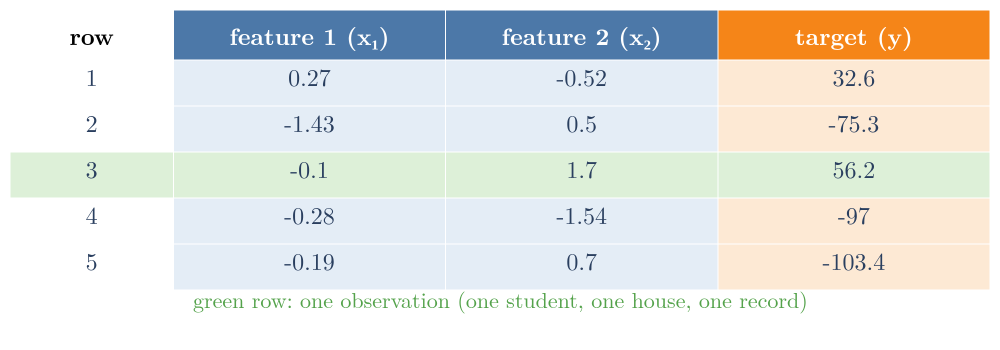
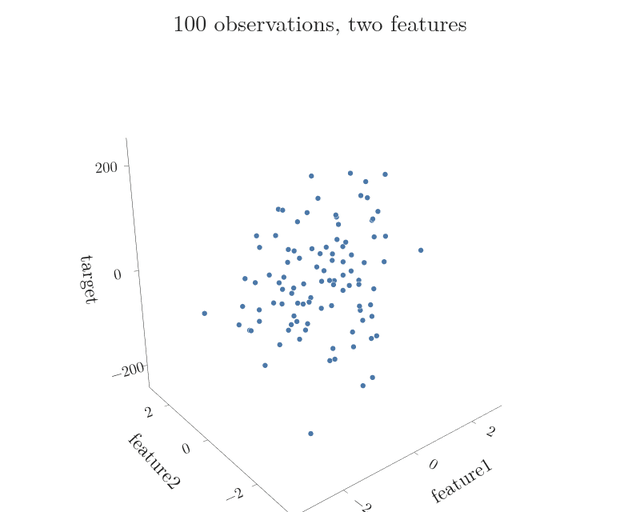
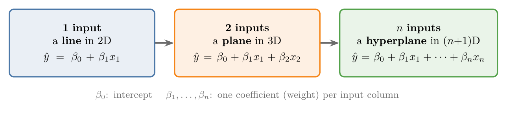
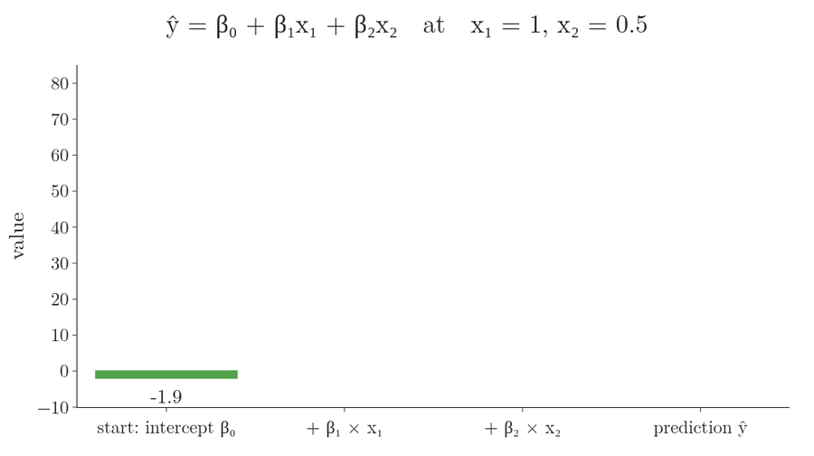
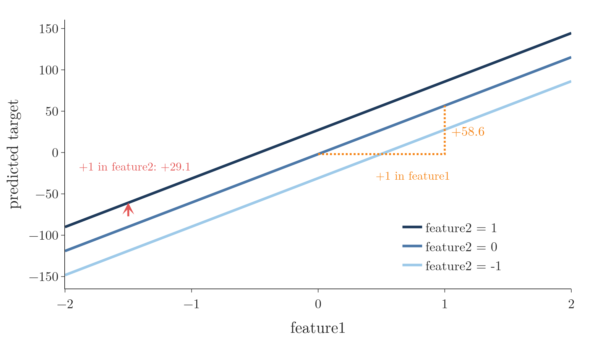
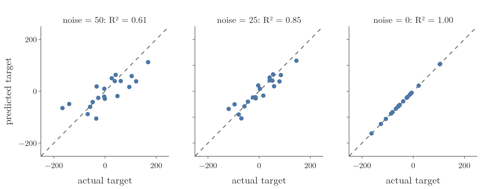

<!-- where-this-fits: generated by course_map/build_map.py; edit concepts.yaml, not this block -->
> **Where this fits:** Pipeline map steps 0 (Foundations), 8 (Model). See the [Course map](../01-course-map/note.md).
>
> 
>
> - **Builds on:** Regression problems ([Note 3](../03-types-of-ml/note.md)); Dot product ([Note 48](../48-pca-step-by-step/note.md)); Simple linear regression ([Note 51](../51-linear-regression-maths/note.md)).
> - **Leads to:** Polynomial regression ([Note 61](../61-polynomial-regression/note.md)); Ridge regression ([Note 63](../63-ridge-regression-intuition/note.md)); Perceptron trick ([Note 70](../70-perceptron-trick/note.md)); Support vector machines ([Note 92](../92-svm-intuition/note.md)); Perceptron ([Note 1004](../1004-perceptron/note.md)).
> - **Compare with:** ANN for regression ([Note 1013](../1013-graduate-admission-ann/note.md)).
<!-- /where-this-fits -->

## 1. Overview

> **Key point:** Multiple linear regression is simple linear regression with more than one feature. With two inputs it fits a plane; with more, a hyperplane.

A **feature** (G-772) is an input variable (one column of the data table), the **target** (G-1949) is the output we predict, and an **observation** (G-1374) is one record (one row). Figure 1 marks all three on the first rows of this Note's example data.



Simple linear regression used one feature, CGPA, to predict the package. Real data almost always has several features: CGPA, gender, IQ, 12th-grade marks, and so on. Linear regression with more than one feature is called **multiple linear regression** (G-1279).

Nothing new has to be learned for multiple linear regression: everything from simple linear regression carries over. **Simple linear regression** (G-1808) is just the special case with one feature. A recipe works the same way: the cake's taste depends on sugar, flour and butter together, each in its own amount, instead of on sugar alone. This Note covers the geometry and the code; the next two Notes derive the mathematics and code it from scratch.

## 2. From a line to a hyperplane

> **Key point:** One input: a line in 2D. Two inputs: a plane in 3D. n inputs: a hyperplane in n + 1 dimensions.

### 2.1 Two inputs: a plane

> **Key point:** With CGPA and IQ as inputs, the data lives in 3D, and the model is a flat plane through the cloud of points.

Take two inputs, CGPA ($x_1$) and IQ ($x_2$), and the package ($y$) as output. Each student is now a point in 3D: CGPA along one axis, IQ along another, package upwards.

In 2D we drew the line that passes closest to all points. In 3D we draw a flat **plane** (G-1502) that cuts through the cloud of points: some points lie above it, some below, and the plane keeps as close as possible to all of them (Figure 2).

{height=50%}

Watch the sticks as the view turns: about half the points sit above the plane (50 of 100) and half below, and from the side the plane cuts through the middle of the cloud. Fitting the plane means making these sticks, squared and added up, as small as possible, just as with the line.

### 2.2 More inputs: a hyperplane

> **Key point:** Beyond three dimensions we cannot draw the picture, but the equation keeps the same form.

With three inputs the data is 4-dimensional, and the model is the 4D version of a plane. A flat surface in more than three dimensions is called a **hyperplane** (G-911). We cannot draw it, but the mathematics works exactly the same (Figure 3).



## 3. The equation

> **Key point:** The prediction is the intercept plus one coefficient times each input: $\hat{y} = \beta_0 + \beta_1 x_1 + \dots + \beta_n x_n$.

For simple linear regression we wrote $y = mx + b$. With more inputs, letters run out, so we rename the numbers with the Greek letter beta: $\beta_0$ for the intercept and $\beta_1, \beta_2, \dots$ for the slopes.

In words: start from the intercept, then add each input multiplied by its own coefficient.

$$\hat{y} = \beta_0 + \beta_1 x_1 + \beta_2 x_2 + \dots + \beta_n x_n$$

With numbers, from the model in Figure 2:

$$\hat{y} = -1.9 + 58.6 x_1 + 29.1 x_2$$

For a point with $x_1 = 1$ and $x_2 = 0.5$: $\hat{y} = -1.9 + 58.6 + 14.6 = 71.3$. Figure 4 builds this prediction one term at a time: start at the intercept, then let each feature add its own share.



With $n$ features there are $n + 1$ numbers to find: one **coefficient** (G-407) per feature plus the **intercept** (G-960). Training the model means finding them.

### 3.1 What the coefficients mean

> **Key point:** Each coefficient is the change in the output when its feature rises by 1 and the other features stay the same: the feature's weight.

The meaning carries over from the slope $m$:

- $\beta_1$: how much the prediction changes when $x_1$ rises by 1 and every other input stays fixed.
- $\beta_2$: the same for $x_2$, and so on.
- $\beta_0$: the prediction when every input is 0.

Figure 5 slices the plane of Figure 2 at three fixed values of feature2. Each slice is a line with slope 58.6, and the slices sit 29.1 apart: one coefficient per direction.

{height=40%}

So the coefficients act as **weights** (G-2111): in Figure 2, the target depends about twice as strongly on feature 1 (58.6 per unit) as on feature 2 (29.1 per unit). In the placement example, $\beta_1$ would say how much the package depends on CGPA and $\beta_2$ how much on IQ. A coefficient near 0 means the target hardly depends on that feature.

> **Extra:** Comparing coefficients only makes sense when the inputs are on similar scales. A coefficient of 58.6 per unit of CGPA and 0.05 per IQ point says nothing about which matters more, because one IQ point is a much smaller step than one CGPA point. **Standardising** (G-1874) the inputs first puts all coefficients on the same footing (Gelman 2008). In Figure 2 the comparison is fair: both inputs from `make_regression` already have a standard deviation of about 1.

## 4. Multiple linear regression in scikit-learn

> **Key point:** The code is exactly the same as for one feature; LinearRegression simply returns one coefficient per feature.

The example data has 100 observations, 2 features and some noise, made with scikit-learn's `make_regression`.

> **Python:** Training on two features.
>
> ```python
> from sklearn.datasets import make_regression
> from sklearn.linear_model import LinearRegression
> from sklearn.model_selection import train_test_split
>
> X, y = make_regression(n_samples=100, n_features=2,
>     n_informative=2, noise=50, random_state=7)
> X_train, X_test, y_train, y_test = train_test_split(
>     X, y, test_size=0.2, random_state=3)
>
> lr = LinearRegression().fit(X_train, y_train)
> lr.coef_         # [58.6, 29.1]: one per feature
> lr.intercept_    # -1.9
> ```
>
> `make_regression` (G-1153) invents data that follows a linear pattern plus random noise; `random_state` fixes it so the numbers repeat.

The metrics of the [regression metrics Note](../52-regression-metrics/note.md) are computed exactly as before: the errors are now gaps to the plane instead of gaps to the line. With several features, adjusted R² (section 7 of that Note) is the fairer score, because it charges a penalty for each feature.

On the 20 test observations: MAE 40.1, MSE 2614.9 and $R^2 = 0.61$. The noise added to the data limits how good any plane can be: with less noise the same code scores higher, and with no noise it fits perfectly ($R^2$ of 0.85 at `noise=25`, 1.0 at `noise=0`; see the Notebook). Figure 6 shows the test predictions for all three: as the noise falls, the points close in on the diagonal of perfect predictions.



> **Extra:** To draw the plane, we predict on a grid of $(x_1, x_2)$ points and plot the predictions as a surface. The Notebook does this with Plotly, and the 3D plot can be turned with the mouse to see the points above and below the plane.

## 5. Summary

| | Simple linear regression | Multiple linear regression |
|---|---|---|
| Inputs | 1 | 2 or more |
| Shape of the model | line | plane (2 inputs), hyperplane (more) |
| Equation | $\hat{y} = mx + b$ | $\hat{y} = \beta_0 + \beta_1 x_1 + \dots + \beta_n x_n$ |
| Numbers to find | 2 | $n + 1$ |
| scikit-learn | `LinearRegression` | the same `LinearRegression` |

- Real data almost always has several inputs, so multiple linear regression is the version used in practice.
- Each coefficient is the change in the output per unit of its input, with the other inputs fixed: a weight.
- The intercept $\beta_0$ is the prediction when every input is 0.

## 6. Sources

**Built from**

- CampusX, "Multiple Linear Regression | Geometric Intuition & Code", YouTube, https://www.youtube.com/watch?v=ashGekqstl8
- StatQuest with Josh Starmer, "Multiple Regression, Clearly Explained!!!", YouTube, https://www.youtube.com/watch?v=EkAQAi3a4js (R² is computed as in simple regression; adjusted R² for the extra parameters)

**Other references**

- Gelman, A. (2008). Scaling regression inputs by dividing by two standard deviations. *Statistics in Medicine* 27(15): 2865–2873.

## 7. Key terms

| Term | Meaning |
|---|---|
| Feature | An input variable: one column of the data table |
| Target | The output we predict |
| Observation | One record: one row of the data table |
| Multiple linear regression | Linear regression with two or more features |
| Plane | A flat surface in 3D; the model for two features |
| Hyperplane | A flat surface in more than three dimensions; the model for three or more features |
| Coefficient ($\beta_i$) | The weight of one feature: the change in the output per unit of that input, others fixed |
| make_regression | scikit-learn function that generates data following a linear pattern plus noise |
