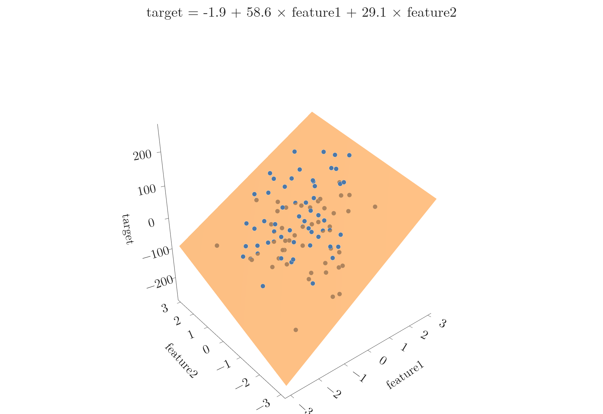

<!-- where-this-fits: generated by course_map/build_map.py; edit concepts.yaml, not this block -->
> **Where this fits:** Pipeline map steps 0 (Foundations), 8 (Model). See the [Course map](../01-course-map/note.md).
>
> 
>
> - **Builds on:** Regression problems ([Note 3](../03-types-of-ml/note.md)); Dot product ([Note 48](../48-pca-step-by-step/note.md)); Simple linear regression ([Note 51](../51-linear-regression-maths/note.md)).
> - **Leads to:** Polynomial regression ([Note 61](../61-polynomial-regression/note.md)); Ridge regression ([Note 63](../63-ridge-regression-intuition/note.md)); Perceptron trick ([Note 70](../70-perceptron-trick/note.md)); Support vector machines ([Note 92](../92-svm-intuition/note.md)).
<!-- /where-this-fits -->

## 1. Overview

> **Key point:** Multiple linear regression is simple linear regression with more than one input column. With two inputs it fits a plane; with more, a hyperplane.

Simple linear regression used one input, CGPA, to predict the package. Real data almost always has several input columns: CGPA, gender, IQ, 12th-grade marks, and so on. Linear regression with more than one input column is called **multiple linear regression**.

Nothing new has to be learned for it: everything from simple linear regression carries over. Simple linear regression is just the special case with one input column. This Note covers the geometry and the code; the next two Notes derive the mathematics and code it from scratch.

## 2. From a line to a hyperplane

> **Key point:** One input: a line in 2D. Two inputs: a plane in 3D. n inputs: a hyperplane in n + 1 dimensions.

### 2.1 Two inputs: a plane

> **Key point:** With CGPA and IQ as inputs, the data lives in 3D, and the model is a flat plane through the cloud of points.

Take two inputs, CGPA ($x_1$) and IQ ($x_2$), and the package ($y$) as output. Each student is now a point in 3D: CGPA along one axis, IQ along another, package upwards.

In 2D we drew the line that passes closest to all points. In 3D we draw a flat **plane** that cuts through the cloud of points: some points lie above it, some below, and the plane keeps as close as possible to all of them (Figure 1).

{height=50%}

In Figure 1, the blue points lie above the plane; the points seen through the orange plane lie below it.

### 2.2 More inputs: a hyperplane

> **Key point:** Beyond three dimensions we cannot draw the picture, but the equation keeps the same form.

With three inputs the data is 4-dimensional, and the model is the 4D version of a plane. A flat surface in more than three dimensions is called a **hyperplane**. We cannot draw it, but the mathematics works exactly the same (Figure 2).


## 3. The equation

> **Key point:** The prediction is the intercept plus one coefficient times each input: $\hat{y} = \beta_0 + \beta_1 x_1 + \dots + \beta_n x_n$.

For simple linear regression we wrote $y = mx + b$. With more inputs, letters run out, so we rename the numbers with the Greek letter beta: $\beta_0$ for the intercept and $\beta_1, \beta_2, \dots$ for the slopes.

In words: start from the intercept, then add each input multiplied by its own coefficient.

$$\hat{y} = \beta_0 + \beta_1 x_1 + \beta_2 x_2 + \dots + \beta_n x_n$$

With numbers, from the model in Figure 1:

$$\hat{y} = -1.9 + 58.6 x_1 + 29.1 x_2$$

For a point with $x_1 = 1$ and $x_2 = 0.5$: $\hat{y} = -1.9 + 58.6 + 14.6 = 71.3$.

With $n$ input columns there are $n + 1$ numbers to find: one **coefficient** per column plus the intercept. Training the model means finding them.

### 3.1 What the coefficients mean

> **Key point:** Each coefficient is the change in the output when its input rises by 1 and the other inputs stay the same. It acts as the input's weight.

The meaning carries over from the slope $m$:

- $\beta_1$: how much the prediction changes when $x_1$ rises by 1 and every other input stays fixed.
- $\beta_2$: the same for $x_2$, and so on.
- $\beta_0$: the prediction when every input is 0.

So the coefficients act as **weights**: in Figure 1, the target depends about twice as strongly on feature 1 (58.6 per unit) as on feature 2 (29.1 per unit). In the placement example, $\beta_1$ would say how much the package depends on CGPA and $\beta_2$ how much on IQ.

> **Extra:** Comparing coefficients only makes sense when the inputs are on similar scales. A coefficient of 58.6 per unit of CGPA and 0.05 per IQ point says nothing about which matters more, because one IQ point is a much smaller step than one CGPA point. Standardising the inputs first puts all coefficients on the same footing.

## 4. Multiple linear regression in scikit-learn

> **Key point:** The code is exactly the same as for one input; LinearRegression simply returns one coefficient per column.

The example data has 100 rows, 2 input columns and some noise, made with scikit-learn's `make_regression`.

> **Python:** Training on two input columns.
>
> ```python
> from sklearn.datasets import make_regression
> from sklearn.linear_model import LinearRegression
> from sklearn.model_selection import train_test_split
>
> X, y = make_regression(n_samples=100, n_features=2,
>     n_informative=2, noise=50, random_state=7)
> X_train, X_test, y_train, y_test = train_test_split(
>     X, y, test_size=0.2, random_state=3)
>
> lr = LinearRegression().fit(X_train, y_train)
> lr.coef_         # [58.6, 29.1]: one per input column
> lr.intercept_    # -1.9
> ```
>
> `make_regression` invents data that follows a linear pattern plus random noise; `random_state` fixes it so the numbers repeat.

On the 20 test rows: MAE 40.1, MSE 2614.9 and $R^2 = 0.61$. The noise added to the data limits how good any plane can be.

> **Extra:** To draw the plane, we predict on a grid of $(x_1, x_2)$ points and plot the predictions as a surface. The Notebook does this with Plotly, and the 3D plot can be turned with the mouse to see the points above and below the plane.

## 5. Summary

| | Simple linear regression | Multiple linear regression |
|---|---|---|
| Inputs | 1 | 2 or more |
| Shape of the model | line | plane (2 inputs), hyperplane (more) |
| Equation | $\hat{y} = mx + b$ | $\hat{y} = \beta_0 + \beta_1 x_1 + \dots + \beta_n x_n$ |
| Numbers to find | 2 | $n + 1$ |
| scikit-learn | `LinearRegression` | the same `LinearRegression` |

- Real data almost always has several inputs, so multiple linear regression is the version used in practice.
- Each coefficient is the change in the output per unit of its input, with the other inputs fixed: a weight.
- The intercept $\beta_0$ is the prediction when every input is 0.

## 6. Key terms

| Term | Meaning |
|---|---|
| Multiple linear regression | Linear regression with two or more input columns |
| Plane | A flat surface in 3D; the model for two input columns |
| Hyperplane | A flat surface in more than three dimensions; the model for three or more input columns |
| Coefficient ($\beta_i$) | The weight of one input column: the change in the output per unit of that input, others fixed |
| make_regression | scikit-learn function that generates data following a linear pattern plus noise |
