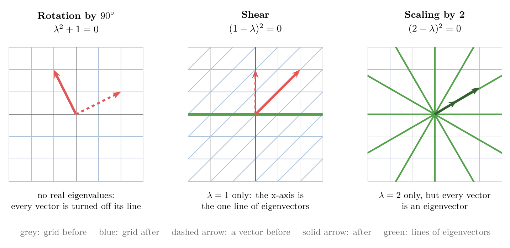

<!-- where-this-fits: generated by course_map/build_map.py; edit concepts.yaml, not this block -->
> **Where this fits:** Pipeline map step 0 (Foundations). See the [Course map](../01-course-map/note.md).
>
> 
>
> - **Builds on:** Linear transformations and matrices ([Note 500](../500-linear-transformations-and-matrices/note.md)).
> - **Leads to:** Hessian and multivariate Taylor ([Note 603](../603-hessian-and-multivariate-taylor/note.md)); Singular value decomposition ([Note 610](../610-svd-geometry/note.md)).
> - **Compare with:** Singular value decomposition ([Note 610](../610-svd-geometry/note.md)).
<!-- /where-this-fits -->

## 1. Overview

> **Key point:** The eigenvalues of a matrix $A$ are the numbers $\lambda$ that make $A - \lambda I$ squish space flat, $\det(A - \lambda I) = 0$; the eigenvectors are the vectors it squishes to zero; and when there are enough of them, they form a basis in which $A$ is just a diagonal matrix.


The [PCA step by step Note](../48-pca-step-by-step/note.md) (section 4) defined eigenvectors and eigenvalues: an **eigenvector** of a matrix is a vector the matrix only stretches or shrinks, without turning it, and its **eigenvalue** is the stretch factor, so $A\mathbf{v} = \lambda\mathbf{v}$. Its Figure 4 showed this for the matrix $A$ with columns $[3, 0]$ and $[1, 2]$: $[1, 0]$ is stretched by 3 and $[-1, 1]$ by 2. There, NumPy found them.

This Note goes deeper, with the same matrix:

- why eigenvectors come as whole lines, and what they tell us about a transformation (Section 2);
- how to find eigenvalues and eigenvectors by hand (Sections 3 and 4, and Figure 1);
- transformations with no eigenvectors, one line of them, or every vector (Section 5);
- the eigenbasis, which turns a matrix into a diagonal one and makes its powers easy (Section 6).

The Note reads matrices as transformations, as in the [linear transformations and matrices Note](../500-linear-transformations-and-matrices/note.md).

## 2. Eigenvectors stay on their own span

> **Key point:** An eigenvector is not knocked off its span: it stays on the line it spans. Every vector on that line is an eigenvector with the same eigenvalue.

Take any vector and look at its span, the line through the origin and its tip (see the [linear combinations, span and basis Note](../490-linear-combinations-span-and-basis/note.md)). During a transformation, most vectors are knocked off their span; it would be a coincidence for a vector to land on its own line. The eigenvectors are exactly the vectors that do stay on their span.

For $A$ with columns $[3, 0]$ and $[1, 2]$ (rows $[3, 1]$ and $[0, 2]$):

- **The x-axis.** $\hat{\imath}$ lands on $[3, 0]$ (the first column), 3 times itself. By linearity every vector on the x-axis is stretched by 3: $[2, 0]$ lands on $[6, 0]$.
- **The diagonal line through $[-1, 1]$.** $[-1, 1]$ lands on $[-2, 2]$, 2 times itself. Every vector on that line is stretched by 2: $[2, -2]$ lands on $[4, -4]$.
- **Every other vector** is turned off its line, like $[1, 1] \to [4, 2]$.

So "the eigenvectors" really means whole lines of them: any non-zero multiple of an eigenvector is an eigenvector with the same eigenvalue. The whole-line freedom is why NumPy returns them scaled to length 1, and why their sign can differ from what we expect.

Eigenvalues need not be positive. An eigenvalue of $-\tfrac{1}{2}$ means the eigenvector is flipped to point the other way and squished to half its length. What matters is that it stays on its line.

### 2.1 Why eigenvectors describe a transformation well

> **Key point:** The columns of a matrix depend on the coordinate system; the eigenvectors and eigenvalues describe what the transformation itself does.

Picture a rotation in 3D. Its $3 \times 3$ matrix is nine numbers that are hard to read. But a vector that stays on its own span during a rotation is the **axis of rotation**, and its eigenvalue must be 1, because a rotation never stretches anything. "Turn by some angle around this axis" is a far clearer description than nine numbers.

This pattern recurs across linear algebra. Reading the columns as landing spots of the basis vectors always works, but the eigenvectors and eigenvalues get at the heart of a transformation, independent of the coordinates we happen to use.

## 3. Finding eigenvalues

> **Key point:** $A\mathbf{v} = \lambda\mathbf{v}$ with a non-zero $\mathbf{v}$ is possible only when $A - \lambda I$ squishes space into a lower dimension, which means $\det(A - \lambda I) = 0$.

### 3.1 From $A\mathbf{v} = \lambda\mathbf{v}$ to $(A - \lambda I)\mathbf{v} = \mathbf{0}$

> **Key point:** Write $\lambda\mathbf{v}$ as the matrix $\lambda I$ times $\mathbf{v}$, then move everything to one side.

Finding eigenvectors means finding $\mathbf{v}$ and $\lambda$ with $A\mathbf{v} = \lambda\mathbf{v}$. The left side is a matrix times a vector, the right side a number times a vector. To compare them, we write the right side as a matrix too. The matrix that scales every vector by $\lambda$ sends $\hat{\imath}$ to $[\lambda, 0]$ and $\hat{\jmath}$ to $[0, \lambda]$:

$$\begin{bmatrix} \lambda & 0 \\ 0 & \lambda \end{bmatrix} = \lambda I$$

where $I$ is the identity matrix (1s on the diagonal). Now both sides are matrix-vector products:

$$A\mathbf{v} = (\lambda I)\mathbf{v} \quad\Longrightarrow\quad A\mathbf{v} - \lambda I\mathbf{v} = \mathbf{0} \quad\Longrightarrow\quad (A - \lambda I)\,\mathbf{v} = \mathbf{0}$$

$A - \lambda I$ is simply $A$ with $\lambda$ subtracted from each diagonal entry.

### 3.2 When can a matrix send a non-zero vector to zero?

> **Key point:** Only when it squishes space onto a line (or a point); that is exactly when its determinant is 0.

$\mathbf{v} = \mathbf{0}$ always solves $(A - \lambda I)\mathbf{v} = \mathbf{0}$, but the zero vector is not an eigenvector; we want a non-zero $\mathbf{v}$. A transformation can send a non-zero vector to the origin only if it squishes space into a lower dimension, like the dependent-columns case of the [linear transformations and matrices Note](../500-linear-transformations-and-matrices/note.md) (section 6). If it kept the plane two-dimensional, only the origin would land on the origin.

Squishing space into a lower dimension is measured by the determinant.

> **Extra:** The **determinant** of a $2 \times 2$ matrix is the factor by which its transformation scales areas: the unit square spanned by $\hat{\imath}$ and $\hat{\jmath}$ becomes a parallelogram with area $\lvert\det\rvert$. A negative determinant means the plane is also flipped over (MML §4.1).
>
> 1. **In words:** multiply the diagonal entries and subtract the product of the other two.
> 2. **Formula:**
>    $$\det \begin{bmatrix} a & b \\ c & d \end{bmatrix} = ad - bc$$
> 3. **Example:** for the matrix $A$ with rows $[3, 1]$ and $[0, 2]$, $\det A = 3 \times 2 - 1 \times 0 = 6$: the unit square becomes a parallelogram of area 6 (Figure 1, top left). For the squishing matrix with rows $[2, -1]$ and $[1, -0.5]$, $\det = 2 \times (-0.5) - (-1) \times 1 = 0$: zero area, the plane is flat.
>
> A determinant of 0 means the transformation squishes space into a lower dimension, and that is exactly when it has no inverse (see the [multiple linear regression maths Note](../54-multiple-lr-maths/note.md), section 7). In NumPy: `np.linalg.det(A)`.

So $\lambda$ is an eigenvalue exactly when

$$\det(A - \lambda I) = 0$$

Figure 1 shows this with a knob. As $\lambda$ turns from 0 upwards, $A - \lambda I$ changes, and so does the area of the parallelogram it makes from the unit square. The area hits 0, the square squished flat, at $\lambda = 2$ and again at $\lambda = 3$: the eigenvalues.

### 3.3 Two worked examples

> **Key point:** Subtract $\lambda$ from the diagonal, take the determinant, and solve the resulting quadratic.

1. **In words:** subtract $\lambda$ from each diagonal entry, compute the determinant as a polynomial in $\lambda$, and find where it is zero.
2. **Formula:**
   $$\det \begin{bmatrix} a - \lambda & b \\ c & d - \lambda \end{bmatrix} = (a - \lambda)(d - \lambda) - bc = 0$$
3. **Example:** for $A$ with rows $[3, 1]$ and $[0, 2]$,
   $$\det(A - \lambda I) = (3 - \lambda)(2 - \lambda) - 1 \times 0 = (3 - \lambda)(2 - \lambda)$$
   which is 0 only for $\lambda = 3$ and $\lambda = 2$, the two stretch factors of Section 2. This polynomial is the curve in Figure 1.

A second matrix, with columns $[2, 1]$ and $[2, 3]$:

$$\det \begin{bmatrix} 2 - \lambda & 2 \\ 1 & 3 - \lambda \end{bmatrix} = (2 - \lambda)(3 - \lambda) - 2 = \lambda^2 - 5\lambda + 4 = (\lambda - 1)(\lambda - 4)$$

So its eigenvalues are 1 and 4. An eigenvalue of 1 means its eigenvectors do not move at all: $[-2, 1]$ lands on $[2 \times (-2) + 2 \times 1,\ 1 \times (-2) + 3 \times 1] = [-2, 1]$. And $[1, 1]$ lands on $[4, 4]$, stretched by 4.

> **Extra:** The polynomial $\det(A - \lambda I)$ is called the **characteristic polynomial** of $A$. For an $n \times n$ matrix it has degree $n$, so there are at most $n$ eigenvalues. Real libraries do not solve this polynomial: finding polynomial roots is very sensitive to rounding errors, so eigenvalue routines use iterative methods instead (Trefethen and Bau, Lecture 25). The polynomial is the idea, not the algorithm.

## 4. Finding the eigenvectors

> **Key point:** Plug each eigenvalue back in and find all vectors that $A - \lambda I$ sends to zero: they form the line of eigenvectors.

Once we know an eigenvalue, the eigenvectors are the solutions of $(A - \lambda I)\mathbf{v} = \mathbf{0}$.

1. **In words:** put the eigenvalue into $A - \lambda I$ and solve for the vectors it sends to the zero vector.
2. **Formula:**
   $$(A - \lambda I)\begin{bmatrix} x \\ y \end{bmatrix} = \begin{bmatrix} 0 \\ 0 \end{bmatrix}$$
3. **Example:** for $A$ with rows $[3, 1]$ and $[0, 2]$, and $\lambda = 2$,
   $$A - 2I = \begin{bmatrix} 1 & 1 \\ 0 & 0 \end{bmatrix}, \qquad \begin{bmatrix} 1 & 1 \\ 0 & 0 \end{bmatrix}\begin{bmatrix} x \\ y \end{bmatrix} = \begin{bmatrix} x + y \\ 0 \end{bmatrix} = \begin{bmatrix} 0 \\ 0 \end{bmatrix}$$
   so $y = -x$: every vector on the line through $[-1, 1]$. For $\lambda = 3$, $A - 3I$ has rows $[0, 1]$ and $[0, -1]$, so $(A - 3I)[x, y] = [y, -y]$, which is zero only when $y = 0$: the x-axis.

In Figure 1 (bottom left), $A - 2I$ squishes the plane onto the x-axis, and the line $y = -x$ is what it crushes to the origin.

> **Python:** `np.linalg.eig` returns the eigenvalues and, as columns, unit-length eigenvectors.
>
> ```python
> import numpy as np
>
> A = np.array([[3, 1], [0, 2]])
> values, vectors = np.linalg.eig(A)
> values           # array([3., 2.])
> vectors[:, 1]    # [-0.707, 0.707]: the line through [-1, 1]
> ```
>
> $[-0.707, 0.707]$ is $[-1, 1]$ scaled to length 1. As the [PCA step by step Note](../48-pca-step-by-step/note.md) warns, the eigenvectors are the columns, not the rows.

## 5. Rotations, shears and uniform scaling

> **Key point:** A 2D transformation can have no real eigenvectors (rotation), only one line of them (shear), or every vector (uniform scaling).

Figure 2 shows three special cases, each checked with the determinant.



- **Rotation by 90°**, columns $[0, 1]$ and $[-1, 0]$. Every vector is turned off its span, so there is no eigenvector. The algebra agrees: $A - \lambda I$ has rows $[-\lambda, -1]$ and $[1, -\lambda]$, so its determinant is $\lambda^2 + 1$, which is never 0 for a real $\lambda$. Its only roots are the imaginary numbers $i$ and $-i$, and no real root means no real eigenvector.
- **Shear**, columns $[1, 0]$ and $[1, 1]$. Vectors on the x-axis stay fixed, so they are eigenvectors with eigenvalue 1. The polynomial $(1 - \lambda)^2$ has only the root $\lambda = 1$, and those are the only eigenvectors: one line.
- **Scaling everything by 2**, columns $[2, 0]$ and $[0, 2]$. The only eigenvalue is 2, but every vector in the plane is an eigenvector. One eigenvalue can come with more than a line of eigenvectors.

> **Python:** NumPy reports the rotation's eigenvalues as complex numbers.
>
> ```python
> np.linalg.eigvals(np.array([[0, -1], [1, 0]]))   # [0.+1.j, 0.-1.j]
> np.linalg.eigvals(np.array([[1, 1], [0, 1]]))    # [1., 1.]
> ```
>
> `1.j` is Python's way to write the imaginary number $i$.

## 6. The eigenbasis

> **Key point:** If the eigenvectors span the whole space, we can use them as basis vectors; in that basis the matrix is diagonal, with the eigenvalues on the diagonal.

### 6.1 Diagonal matrices

> **Key point:** When the basis vectors are themselves eigenvectors, the matrix has zeros off the diagonal and its eigenvalues on the diagonal.

Suppose $\hat{\imath}$ and $\hat{\jmath}$ happen to be eigenvectors: say $\hat{\imath}$ is scaled by $-1$ and $\hat{\jmath}$ by 2. Their landing spots, $[-1, 0]$ and $[0, 2]$, are the columns of

$$D = \begin{bmatrix} -1 & 0 \\ 0 & 2 \end{bmatrix}$$

a **diagonal matrix** (as in the [linear transformations and matrices Note](../500-linear-transformations-and-matrices/note.md), section 7.2). Read the other way round: in any diagonal matrix, every basis vector is an eigenvector, and the diagonal entries are the eigenvalues.

Diagonal matrices are easy to work with. Applying $D$ 100 times just scales each basis vector by its eigenvalue 100 times, so

$$D^{100} = \begin{bmatrix} (-1)^{100} & 0 \\ 0 & 2^{100} \end{bmatrix} = \begin{bmatrix} 1 & 0 \\ 0 & 2^{100} \end{bmatrix}$$

Computing the 100th power of a non-diagonal matrix by repeated multiplication, by contrast, is a nightmare by hand.

### 6.2 Changing to an eigenbasis

> **Key point:** Put the eigenvectors as the columns of $P$; then $P^{-1}AP$ is diagonal, and $A^k = P D^k P^{-1}$.

Usually the basis vectors are not eigenvectors. But if a matrix has enough eigenvectors to span the whole space, we can switch to a coordinate system whose basis vectors are eigenvectors. Such a basis is called an **eigenbasis**.

1. **In words:** put the eigenvectors as the columns of a **change of basis matrix** $P$. Sandwiching $A$ between $P^{-1}$ and $P$ gives the same transformation seen from the eigenbasis, and there it only scales each basis vector: a diagonal matrix of eigenvalues.
2. **Formula:**
   $$P^{-1} A P = D, \qquad\text{so}\qquad A = P D P^{-1} \quad\text{and}\quad A^k = P\,D^k\,P^{-1}$$
3. **Example:** for $A$ with rows $[3, 1]$ and $[0, 2]$, the eigenvectors $[1, 0]$ and $[-1, 1]$ give
   $$P = \begin{bmatrix} 1 & -1 \\ 0 & 1 \end{bmatrix}, \qquad P^{-1}AP = \begin{bmatrix} 3 & 0 \\ 0 & 2 \end{bmatrix}$$
   so the 10th power needs only $3^{10} = 59049$ and $2^{10} = 1024$:
   $$A^{10} = P \begin{bmatrix} 59049 & 0 \\ 0 & 1024 \end{bmatrix} P^{-1} = \begin{bmatrix} 59049 & 58025 \\ 0 & 1024 \end{bmatrix}$$

Reading $P D^k P^{-1}$ from right to left (as in the [matrix multiplication as composition Note](../510-matrix-multiplication-as-composition/note.md)): convert to eigenbasis coordinates, scale each coordinate $k$ times, convert back.

Not every matrix has an eigenbasis. The shear of Figure 2 has only one line of eigenvectors, not enough to span the plane, so it cannot be made diagonal this way. Writing a matrix as $PDP^{-1}$ is the **eigen-decomposition** listed among the factorisations of the [linear algebra roadmap Note](../350-linear-algebra-roadmap/note.md).

> **Python:** Checking the example.
>
> ```python
> P = np.array([[1, -1], [0, 1]])
> np.linalg.inv(P) @ A @ P                 # [[3, 0], [0, 2]]
> P @ np.diag([3**10, 2**10]) @ np.linalg.inv(P)
> np.linalg.matrix_power(A, 10)            # the same matrix
> ```

## 7. Where ML uses eigenvectors

> **Key point:** PCA is an eigen-decomposition of a covariance matrix, which always has an eigenbasis; repeated multiplication drifts towards the top eigenvector.

- **PCA.** The principal components are the eigenvectors of the covariance matrix, and the eigenvalues are the variances along them (see the [PCA step by step Note](../48-pca-step-by-step/note.md), section 4.3). A covariance matrix is symmetric, which guarantees a full eigenbasis of perpendicular eigenvectors (the spectral theorem, MML Thm 4.15): PCA never meets the shear problem. Projecting onto the top $k$ eigenvectors keeps the coordinates in the eigenbasis that carry the most variance.
- **Powers of a matrix.** Whenever a model applies the same matrix again and again, the eigenbasis explains the result: each step multiplies the eigenbasis coordinates by their eigenvalues, so the direction with the largest eigenvalue takes over.

> **Extra:** A small example of the second point. Suppose each day 90% of a website's users on page A stay there and 10% move to B, while B's users split 50/50. The matrix of one day, $T$, has columns $[0.9, 0.1]$ and $[0.5, 0.5]$ (each column says where one page's users go). Its eigenvalues are 1 and 0.4. Day after day, the 0.4 part shrinks to nothing ($0.4^{30}$ is about $10^{-12}$), and any starting split of users settles on the eigenvector of eigenvalue 1, scaled to sum to 1: $[0.833, 0.167]$. Google's original PageRank ranked web pages with exactly this kind of eigenvector (Page et al. 1999), and the trick of multiplying repeatedly to find the top eigenvector is called **power iteration**.

## 8. Summary

| Matrix | $\det(A - \lambda I)$ | Eigenvalues | Eigenvectors |
|---|---|---|---|
| columns $[3, 0]$, $[1, 2]$ | $(3 - \lambda)(2 - \lambda)$ | 3, 2 | x-axis; line through $[-1, 1]$ |
| columns $[2, 1]$, $[2, 3]$ | $(\lambda - 1)(\lambda - 4)$ | 1, 4 | line through $[-2, 1]$; line through $[1, 1]$ |
| rotation by 90° | $\lambda^2 + 1$ | none real | none |
| shear | $(1 - \lambda)^2$ | 1 | x-axis only |
| scaling by 2 | $(2 - \lambda)^2$ | 2 | every vector |

- An eigenvector stays on its own span; every vector on that line shares its eigenvalue.
- $\lambda$ is an eigenvalue exactly when $A - \lambda I$ squishes space flat: $\det(A - \lambda I) = 0$.
- Plug each eigenvalue back into $(A - \lambda I)\mathbf{v} = \mathbf{0}$ to get its line of eigenvectors.
- With an eigenbasis, $P^{-1}AP$ is diagonal and powers become easy: $A^k = PD^kP^{-1}$.
- Covariance matrices always have an eigenbasis, which is why PCA works for any data.

## 9. Sources

- Deisenroth, M. P., Faisal, A. A. and Ong, C. S. (2020). *Mathematics for Machine Learning*. Cambridge University Press. Section 4.1 (determinant as signed volume, Example 4.2) and Theorem 4.15 (spectral theorem) (MML).
- Page, L., Brin, S., Motwani, R. and Winograd, T. (1999). "The PageRank Citation Ranking: Bringing Order to the Web". Stanford InfoLab technical report.
- Trefethen, L. N. and Bau, D. (1997). *Numerical Linear Algebra*. SIAM. Lecture 25, overview of eigenvalue algorithms.

## 10. Key terms

| Term | Meaning |
|---|---|
| Determinant | The factor by which a matrix scales areas (volumes in 3D); 0 when it squishes space into a lower dimension |
| Characteristic polynomial | $\det(A - \lambda I)$; its roots are the eigenvalues |
| Axis of rotation | The line a 3D rotation leaves in place: an eigenvector with eigenvalue 1 |
| Eigenbasis | A basis made of eigenvectors of a matrix |
| Change of basis matrix | A matrix $P$ whose columns are the new basis vectors |
| Diagonalisation | Writing $A = PDP^{-1}$ with $D$ diagonal, using an eigenbasis |
| Power iteration | Finding the top eigenvector by multiplying a vector by the matrix again and again |
