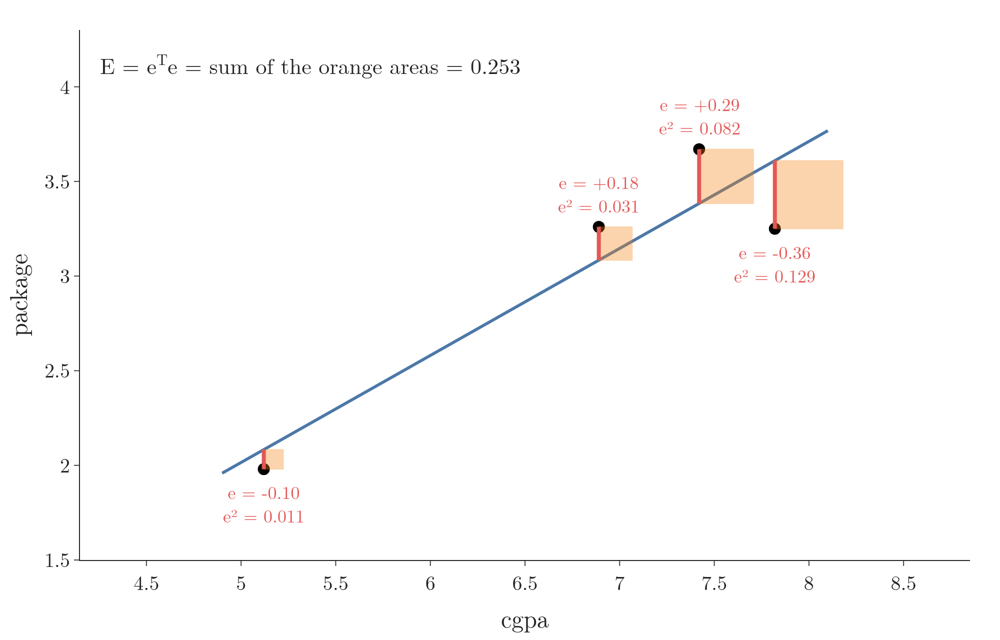

<!-- where-this-fits: generated by course_map/build_map.py; edit concepts.yaml, not this block -->
> **Where this fits:** Pipeline map step 8 (Model). See the [Course map](../01-course-map/note.md).
>
> 
>
> - **Builds on:** Regression problems ([Note 3](../03-types-of-ml/note.md)); Ordinary least squares (closed form) ([Note 51](../51-linear-regression-maths/note.md)); Simple linear regression ([Note 51](../51-linear-regression-maths/note.md)).
> - **Leads to:** Polynomial regression ([Note 61](../61-polynomial-regression/note.md)); Ridge regression ([Note 63](../63-ridge-regression-intuition/note.md)).
> - **Compare with:** Gradient descent ([Note 57](../57-gradient-descent/note.md)); Moore-Penrose pseudo-inverse ([Note 613](../613-svd-in-machine-learning/note.md)); ANN for regression ([Note 1013](../1013-graduate-admission-ann/note.md)).
<!-- /where-this-fits -->

## 1. Overview

> **Key point:** Written with matrices, the error of multiple linear regression has one formula for all the coefficients at once: $\beta = (X^{\mathsf T}X)^{-1}X^{\mathsf T}y$, the normal equation.

A **feature** (G-772) is an input variable (one column of the data table), the **target** (G-1949) $y$ is the output we predict, and an **observation** (G-1374) is one record (one row).

For **simple linear regression** (G-1808), with one feature, we found two formulas, one for the slope $m$ and one for the intercept $b$ ([Note 51](../51-linear-regression-maths/note.md)). **Multiple linear regression** (G-1279) has several features ([Note 53](../53-multiple-linear-regression/note.md)). With $m$ features there are $m + 1$ **coefficients** (G-407), one weight per feature plus the intercept, and writing a separate formula for each is hopeless.

Matrices solve the problem. Like a spreadsheet formula dragged down a whole column instead of typed into every cell, a matrix lets us write one equation for all observations at once. We write all the data, all the predictions and all the coefficients as matrices. Then the same three steps as before give one formula for every coefficient at once:

1. write the error;
2. differentiate it;
3. set the derivative to zero.

The result is

$$\beta = (X^{\mathsf T}X)^{-1}X^{\mathsf T}y$$

This Note builds it step by step. The next Note codes it from scratch. The derivation uses a few rules about matrices; each is stated where it is used.

## 2. The model in matrix form

> **Key point:** Put the data in a matrix X with an extra first column of 1s, and the coefficients in a vector $\beta$. Then all predictions at once are $\hat{y} = X\beta$.

### 2.1 One equation per student

> **Key point:** Every student gets the same equation with the same coefficients; only the feature values change.

Suppose we predict a student's package from three features: CGPA, IQ and gender. The model multiplies each feature by its coefficient and adds the intercept:

$$\hat y = \beta_0 + \beta_1 \cdot \text{cgpa} + \beta_2 \cdot \text{iq} + \beta_3 \cdot \text{gender}$$

Once the four numbers $\beta_0$ to $\beta_3$ are known, we can predict the package of any new student. Training means finding them.

With 100 students there are 100 such equations. To tell the values apart we give each one two indices: $x_{ij}$ is the value of feature $j$ for student $i$, so $x_{21}$ is the CGPA of student 2.

$$\hat y_1 = \beta_0 + \beta_1 x_{11} + \beta_2 x_{12} + \beta_3 x_{13}$$
$$\hat y_2 = \beta_0 + \beta_1 x_{21} + \beta_2 x_{22} + \beta_3 x_{23}$$

and so on, down to $\hat y_{100}$. The coefficients are the same in every line.

In general, with $n$ observations and $m$ features, observation $i$ has the prediction

$$\hat y_i = \beta_0 + \beta_1 x_{i1} + \beta_2 x_{i2} + \dots + \beta_m x_{im}$$

and there are $n$ such equations.

### 2.2 Stacking the equations

> **Key point:** The $n$ equations split into a table of numbers, $X$, times a column of coefficients, $\beta$.

A **matrix** (G-1180) is a table of numbers, and a **vector** (G-2081) is a single column of numbers. They let us write the $n$ equations as one.

Figure 1 does it for four students with one feature, CGPA (the students of Section 6.1). Watch three things move:

1. the four left sides stack into one vector, $\hat y$;
2. the numbers stack into one matrix, $X$: a column of 1s and a column of CGPAs;
3. the coefficients, which were repeated in every line, are written once, as the vector $\beta$.

Figure 2 shows the same split for $n$ observations and $m$ features.

- **$X$**, the **design matrix** (G-597), holds the data: one row per observation, one column per feature, plus a first column of 1s. The 1s multiply $\beta_0$, so the intercept is treated like any other coefficient.
- **$\beta$**, the **coefficient vector** (G-410), holds the $m + 1$ coefficients, $\beta_0$ to $\beta_m$.
- **$\hat{y}$** holds the $n$ predictions.

Multiplying a row of $X$ by $\beta$ gives exactly $\beta_0 \cdot 1 + \beta_1 x_{i1} + \dots + \beta_m x_{im}$, one prediction. So all predictions together are

$$\hat{y} = X\beta$$

With numbers: the first student of Figure 1 has the row $[1, 6.89]$. With the coefficients $\beta_0 = -0.811$ and $\beta_1 = 0.565$ that Section 6.1 finds, the row times $\beta$ is $1 \times (-0.811) + 6.89 \times 0.565 = 3.08$, the predicted package of that student.

> **Extra:** The shapes must fit: $X$ is $n \times (m+1)$ and $\beta$ is $(m+1) \times 1$. The inner sizes match, and the product is $n \times 1$, one prediction per row.

## 3. The error in matrix form

> **Key point:** The vector of errors is $e = y - X\beta$. The sum of squared errors is $e^{\mathsf T}e$.

For each student, the error is the real package minus the predicted one. This error on one observation is called a **residual** (G-1685). The residuals of all observations form a vector:

$$e = y - \hat{y} = y - X\beta$$

The **sum of squared errors** (G-1913), $E = e_1^2 + e_2^2 + \dots + e_n^2$, is a row times a column: the **transpose** (G-2012) $e^{\mathsf T}$ (the same numbers written as a row) multiplied by $e$.

$$E = e^{\mathsf T}e = (y - X\beta)^{\mathsf T}(y - X\beta)$$

With numbers: if $e = (0.2, -0.1, 0.3)$, then $e^{\mathsf T}e = 0.04 + 0.01 + 0.09 = 0.14$.

Figure 3 draws the same idea on the four students of Section 6.1 and their best line. Each red segment is one entry of $e$, and the orange square on it has area $e_i^2$. Watch the biggest square: the student with CGPA 7.82 and error $-0.36$ supplies half of $E = 0.253$, because squaring makes large errors count much more than small ones.

## 4. Expanding the error

> **Key point:** Multiplying out the brackets gives $E = y^{\mathsf T}y - 2y^{\mathsf T}X\beta + \beta^{\mathsf T}X^{\mathsf T}X\beta$.

In ordinary algebra, $(a - b)^2$ multiplies out to $a^2 - 2ab + b^2$. The error $E = (y - X\beta)^{\mathsf T}(y - X\beta)$ is the matrix version of a square, and it multiplies out to the same three-part shape.

Two rules about transposes are needed:

- **The transpose of a product reverses the order:** $(AB)^{\mathsf T} = B^{\mathsf T}A^{\mathsf T}$. So $(X\beta)^{\mathsf T} = \beta^{\mathsf T}X^{\mathsf T}$.
- **A single number is its own transpose.** The terms $y^{\mathsf T}X\beta$ and $\beta^{\mathsf T}X^{\mathsf T}y$ are each one number ($1 \times 1$), and each is the transpose of the other, so they are equal.

Multiplying out:

$$E = y^{\mathsf T}y - y^{\mathsf T}X\beta - \beta^{\mathsf T}X^{\mathsf T}y + \beta^{\mathsf T}X^{\mathsf T}X\beta$$

The two middle terms are equal, so they combine:

$$E = y^{\mathsf T}y - 2y^{\mathsf T}X\beta + \beta^{\mathsf T}X^{\mathsf T}X\beta$$

## 5. Setting the derivative to zero

> **Key point:** Differentiating E with respect to $\beta$ and setting it to zero gives $X^{\mathsf T}X\beta = X^{\mathsf T}y$.

As in simple linear regression, the best coefficients sit at the bottom of the error bowl, where the derivative is zero. Now the derivative is taken with respect to the whole vector $\beta$: it is a vector of $m + 1$ **partial derivatives** (G-1457), one per coefficient, called the **gradient** (G-865), and all its entries must be zero.

Two rules of **matrix calculus** (G-1176) do the work, the matrix versions of "the derivative of $ax$ is $a$" and "the derivative of $ax^2$ is $2ax$":

| Term | Derivative with respect to $\beta$ |
|---|---|
| $y^{\mathsf T}y$ (no $\beta$ in it) | $0$ |
| $2y^{\mathsf T}X\beta$ (like $a\beta$) | $2X^{\mathsf T}y$ |
| $\beta^{\mathsf T}X^{\mathsf T}X\beta$ (like $a\beta^2$) | $2X^{\mathsf T}X\beta$ |

The last rule gives $2X^{\mathsf T}X\beta$ because $X^{\mathsf T}X$ is a **symmetric matrix** (G-1932), equal to its own transpose (MML §5.5).

> **Extra:** The general rule is $\partial(x^{\mathsf T}Bx)/\partial x = x^{\mathsf T}(B + B^{\mathsf T})$ (MML eq. 5.107; the book writes gradients as rows, the table writes them as columns). With $B = X^{\mathsf T}X$, which equals its own transpose, $B + B^{\mathsf T} = 2X^{\mathsf T}X$.

So

$$\frac{\partial E}{\partial \beta} = -2X^{\mathsf T}y + 2X^{\mathsf T}X\beta = 0$$

Figure 4 shows the two entries of this gradient on the four students of Section 6.1. Each panel cuts the error bowl along one coefficient while the other is held fixed, and the orange tangent has the slope that the formula gives. Watch both slopes shrink as $\beta$ walks to $(-0.81, 0.57)$: there both tangents lie flat at the same moment, which is exactly the condition "gradient $= 0$".

Dividing by 2 and moving one term across:

$$X^{\mathsf T}X\beta = X^{\mathsf T}y$$

These are the **normal equations** (G-1345): $m + 1$ equations, one for each coefficient.

## 6. The normal equation

> **Key point:** Multiplying both sides by the inverse of $X^{\mathsf T}X$ isolates $\beta$.

To get $\beta$ alone we need to "divide" by $X^{\mathsf T}X$. Matrices have no division; instead we multiply by the **inverse** (G-968) $(X^{\mathsf T}X)^{-1}$, the matrix that undoes $X^{\mathsf T}X$ (their product is the **identity matrix** (G-915), which changes nothing).

$$\beta = (X^{\mathsf T}X)^{-1}X^{\mathsf T}y$$

The formula is the **normal equation** (G-1344). A formula that gives the answer directly is a **closed-form solution** (G-398); this one gives all coefficients of multiple linear regression at once, and the method is called **ordinary least squares**, OLS (G-1406). scikit-learn's `LinearRegression` reaches the same solution with a numerically safer method than a literal inverse (scikit-learn docs, LinearRegression; LAPACK, DGELSD).

### 6.1 A worked example

> **Key point:** On four students with one feature, the normal equation gives the same slope and intercept as the simple formulas.

Take the first four students of the placement data, with CGPA 6.89, 5.12, 7.82, 7.42 and packages 3.26, 1.98, 3.25, 3.67.

1. **Build $X$:** a column of four 1s next to the four CGPAs.
2. **Compute the pieces:**

   $$X^{\mathsf T}X = \begin{bmatrix} 4 & 27.25 \cr27.25 & 189.90 \end{bmatrix} \qquad X^{\mathsf T}y = \begin{bmatrix} 12.16 \cr85.25 \end{bmatrix}$$

   The top-left 4 counts the rows; 27.25 is the sum of the CGPAs; 189.90 is the sum of their squares; 12.16 is the sum of the packages.

3. **Invert and multiply:**

   $$\beta = \begin{bmatrix} 11.158 & -1.601 \cr-1.601 & 0.235 \end{bmatrix}\begin{bmatrix} 12.16 \cr85.25 \end{bmatrix} = \begin{bmatrix} -0.81 \cr0.57 \end{bmatrix}$$

So $\beta_0 = -0.81$, the **intercept** (G-960), and $\beta_1 = 0.57$, the **slope** (G-1823): exactly what the simple linear regression formulas give for these four points. The simple formulas are the normal equation with a single feature.

### 6.2 The picture: a projection

> **Extra:** This section goes beyond the derivation: a second, geometric way to see the same equation.

> **Key point:** Every prediction $X\beta$ lies in the plane spanned by the columns of $X$. The best one is the **projection** (G-1583) of $y$ onto that plane, the point of the plane closest to $y$, where the error $y - X\hat\beta$ is perpendicular to every column; that right angle is the normal equation.

The normal equation also has a geometric meaning (ESL §3.2, Figure 3.2; MML §3.8). Treat the $n$ targets as one vector $y$ with $n$ entries, and each column of $X$ the same way. A prediction $X\beta$ is a weighted sum of the columns, so all possible predictions fill the flat space the columns span, called the **column space** (G-414) of $X$. Unless the data lie exactly on a line, $y$ is not in it.

With three observations every vector has three entries, so we can draw it. Figure 5 uses the first three students of the worked example: $X$ has the columns $\mathbf 1 = [1, 1, 1]$ and cgpa $= [6.89, 5.12, 7.82]$, and $y = [3.26, 1.98, 3.25]$. Watch the error length as the green point moves through the plane, and the angle at the point where it stops.

- **Closest point:** the error $\lVert y - X\beta\rVert$ is the length of the dashed line, and its square is $E$ of Section 3. It is smallest, 0.36, at $\hat y = X\hat\beta = [2.97, 2.08, 3.44]$, with $\hat\beta = [-0.50, 0.50]$.
- **Right angle:** there the residual $y - X\hat\beta = [0.29, -0.10, -0.19]$ is perpendicular to both columns: its **dot product** (G-634) with $\mathbf 1$ and with cgpa is 0. Stacked as one equation, that is $X^{\mathsf T}(y - X\hat\beta) = 0$, which rearranges to the normal equations $X^{\mathsf T}X\hat\beta = X^{\mathsf T}y$ of Section 5.

So the calculus of Section 5 and the right angle of Figure 5 give the same equations. The figure draws the $\mathbf 1$ direction four times shorter so that the small residual is visible; shrinking a direction inside the plane does not change the right angle or which point is closest.

## 7. The cost of the inverse

> **Key point:** Inverting $X^{\mathsf T}X$ takes time that grows roughly with the cube of the number of features. With very many features, gradient descent is used instead.

The normal equation has one expensive step: the inverse. The more features, the bigger the matrix to invert. $X^{\mathsf T}X$ is a square matrix with one row and one column per coefficient, $(m+1) \times (m+1)$. Inverting an $m \times m$ matrix takes on the order of $m^3$ operations: doubling the features makes the work about 8 times larger.

Figure 6 measures it on this computer.

From 1,000 to 2,000 features, the time grows about 7 times, from 0.08 to 0.59 seconds. With tens of thousands of features, as with text or image data, the inverse becomes very slow and memory-hungry. With numbers: 20,000 features is 20 times 1,000, so the $m^3$ rule predicts about $20^3 = 8{,}000$ times the 0.08 seconds, roughly 11 minutes. And $X^{\mathsf T}X$ alone would hold $20{,}000^2$ numbers, about 3.2 GB of memory.

The cost of the inverse is why there is a second method, **gradient descent** (G-862): it does not compute any inverse, but approaches the best coefficients step by step. Its answer is very close to the normal equation's. In scikit-learn:

- `LinearRegression` uses the closed-form (OLS) solution;
- **`SGDRegressor`** (G-1783) uses gradient descent.

For most tabular data the number of features is small, and `LinearRegression` is the usual choice. Gradient descent gets its own Notes next.

> **Extra:** $X^{\mathsf T}X$ has no inverse when one feature can be built exactly from others (**multicollinearity**, G-1273, as in the dummy variable trap of the one-hot encoding Note). Then the normal equation has no unique answer. Libraries handle this with a "pseudo-inverse" or with regularisation, both covered later. scikit-learn's `LinearRegression` takes the first route (LAPACK, DGELSD).

## 8. Summary

| Step | Formula |
|---|---|
| Predictions | $\hat{y} = X\beta$ ($X$ has a first column of 1s) |
| Errors | $e = y - X\beta$ |
| Sum of squared errors | $E = e^{\mathsf T}e$ |
| Expanded | $E = y^{\mathsf T}y - 2y^{\mathsf T}X\beta + \beta^{\mathsf T}X^{\mathsf T}X\beta$ |
| Derivative set to zero | $X^{\mathsf T}X\beta = X^{\mathsf T}y$ |
| Normal equation | $\beta = (X^{\mathsf T}X)^{-1}X^{\mathsf T}y$ |

- A column of 1s in $X$ lets the intercept be treated like any other coefficient.
- One formula gives all $m + 1$ coefficients at once; with one feature it reduces to the simple formulas.
- The inverse costs about $m^3$ operations, so very wide data uses gradient descent instead.

## 9. Sources

**Built from**

- CampusX, "Multiple Linear Regression | Part 2 | Mathematical Formulation From Scratch", YouTube, https://www.youtube.com/watch?v=NU37mF5q8VE

**Other references**

- Deisenroth, M. P., Faisal, A. A. and Ong, C. S. (2020). *Mathematics for Machine Learning* (MML). Cambridge University Press. §3.8 Orthogonal Projections and §5.5 Useful Identities for Computing Gradients.
- Hastie, T., Tibshirani, R. and Friedman, J. (2009). *The Elements of Statistical Learning*, 2nd ed. (ESL). Springer. §3.2 and Figure 3.2 (the geometry of least squares: $y$ projected onto the column space of $X$).
- scikit-learn documentation, `sklearn.linear_model.LinearRegression`, Notes section (uses `scipy.linalg.lstsq`).
- LAPACK documentation, DGELSD: minimum-norm least-squares solution using the SVD, for a matrix that may be rank-deficient. netlib.org/lapack.

## 10. Key terms

| Term | Meaning |
|---|---|
| Feature | An input variable: one column of the data table |
| Target | The output we predict |
| Observation | One record: one row of the data table |
| Design matrix ($X$) | The data as a matrix, one row per observation, with a first column of 1s for the intercept |
| Coefficient vector ($\beta$) | All the coefficients of the model, $\beta_0$ to $\beta_m$, as one column |
| Matrix calculus | Rules for differentiating expressions with vectors and matrices |
| Normal equations | $X^{\mathsf T}X\beta = X^{\mathsf T}y$: the conditions that the best coefficients satisfy |
| Normal equation | $\beta = (X^{\mathsf T}X)^{-1}X^{\mathsf T}y$: the closed-form solution of linear regression |
| Inverse matrix | The matrix that undoes another: their product is the identity matrix |
| Residual | The error on one observation: actual minus predicted value |
| Closed-form solution | An answer given directly by a formula |
| Ordinary least squares (OLS) | The closed-form method for linear regression: the coefficients with the smallest sum of squared errors |
| Column space | All the vectors that can be built as weighted sums of a matrix's columns |
| Identity matrix | The square matrix with 1s on the diagonal and 0s elsewhere; multiplying by it changes nothing |
