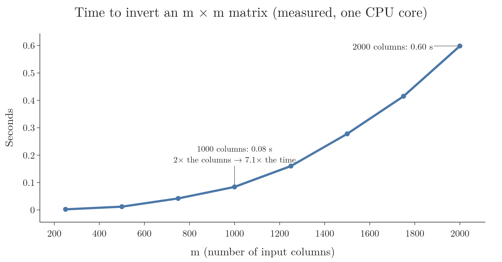

<!-- where-this-fits: generated by course_map/build_map.py; edit concepts.yaml, not this block -->
> **Where this fits:** Pipeline map step 8 (Model). See the [Course map](../01-course-map/note.md).
>
> 
>
> - **Builds on:** Regression problems ([Note 3](../03-types-of-ml/note.md)); Ordinary least squares (closed form) ([Note 51](../51-linear-regression-maths/note.md)); Simple linear regression ([Note 51](../51-linear-regression-maths/note.md)).
> - **Leads to:** Polynomial regression ([Note 61](../61-polynomial-regression/note.md)); Ridge regression ([Note 63](../63-ridge-regression-intuition/note.md)).
> - **Compare with:** Gradient descent ([Note 57](../57-gradient-descent/note.md)); Moore-Penrose pseudo-inverse ([Note 613](../613-svd-in-machine-learning/note.md)); ANN for regression ([Note 1013](../1013-graduate-admission-ann/note.md)).
<!-- /where-this-fits -->

## 1. Overview

> **Key point:** Written with matrices, the error of multiple linear regression has one formula for all the coefficients at once: $\beta = (X^{\mathsf T}X)^{-1}X^{\mathsf T}y$, the normal equation.

A **feature** is an input variable (one column of the data table), the **target** $y$ is the output we predict, and an **observation** is one record (one row).

For simple linear regression we found two formulas, one for $m$ and one for $b$. With $m$ features there are $m + 1$ coefficients, and writing a separate formula for each is hopeless.

Matrices solve the problem. Like a spreadsheet formula dragged down a whole column instead of typed into every cell, a matrix lets us write one equation for all observations at once. We write all the data, all the predictions and all the coefficients as matrices, and the same steps as before (write the error, differentiate, set to zero) give one formula for every coefficient at once:

$$\beta = (X^{\mathsf T}X)^{-1}X^{\mathsf T}y$$

This Note builds it step by step. The next Note codes it from scratch. The derivation uses a few rules about matrices; each is stated where it is used.

## 2. The model in matrix form

> **Key point:** Put the data in a matrix X with an extra first column of 1s, and the coefficients in a vector $\beta$. Then all predictions at once are $\hat{y} = X\beta$.

For one observation $i$ with feature values $x_{i1}, \dots, x_{im}$, the model predicts

$$\hat{y}_i = \beta_0 + \beta_1 x_{i1} + \beta_2 x_{i2} + \dots + \beta_m x_{im}$$

Writing this for every observation gives $n$ equations. Matrices write them all at once (Figure 1).

- **$X$** holds the data: one row per observation, one column per feature, plus a first column of 1s. The 1s multiply $\beta_0$, so the intercept is treated like any other coefficient.
- **$\beta$** holds the $m + 1$ coefficients, $\beta_0$ to $\beta_m$.
- **$\hat{y}$** holds the $n$ predictions.

Multiplying a row of $X$ by $\beta$ gives exactly $\beta_0 \cdot 1 + \beta_1 x_{i1} + \dots + \beta_m x_{im}$, one prediction. So all predictions together are

$$\hat{y} = X\beta$$

> **Extra:** The shapes must fit: $X$ is $n \times (m+1)$ and $\beta$ is $(m+1) \times 1$. The inner sizes match, and the product is $n \times 1$, one prediction per row.

## 3. The error in matrix form

> **Key point:** The vector of errors is $e = y - X\beta$. The sum of squared errors is $e^{\mathsf T}e$.

The errors of all points form a vector:

$$e = y - \hat{y} = y - X\beta$$

The sum of squared errors, $E = e_1^2 + e_2^2 + \dots + e_n^2$, is a row times a column: the transpose $e^{\mathsf T}$ (the same numbers written as a row) multiplied by $e$.

$$E = e^{\mathsf T}e = (y - X\beta)^{\mathsf T}(y - X\beta)$$

With numbers: if $e = (0.2, -0.1, 0.3)$, then $e^{\mathsf T}e = 0.04 + 0.01 + 0.09 = 0.14$.

## 4. Expanding the error

> **Key point:** Multiplying out the brackets gives $E = y^{\mathsf T}y - 2y^{\mathsf T}X\beta + \beta^{\mathsf T}X^{\mathsf T}X\beta$.

Two rules about transposes are needed:

- **The transpose of a product reverses the order:** $(AB)^{\mathsf T} = B^{\mathsf T}A^{\mathsf T}$. So $(X\beta)^{\mathsf T} = \beta^{\mathsf T}X^{\mathsf T}$.
- **A single number is its own transpose.** The terms $y^{\mathsf T}X\beta$ and $\beta^{\mathsf T}X^{\mathsf T}y$ are each one number ($1 \times 1$), and each is the transpose of the other, so they are equal.

Multiplying out:

$$E = y^{\mathsf T}y - y^{\mathsf T}X\beta - \beta^{\mathsf T}X^{\mathsf T}y + \beta^{\mathsf T}X^{\mathsf T}X\beta$$

The two middle terms are equal, so they combine:

$$E = y^{\mathsf T}y - 2y^{\mathsf T}X\beta + \beta^{\mathsf T}X^{\mathsf T}X\beta$$

## 5. Setting the derivative to zero

> **Key point:** Differentiating E with respect to $\beta$ and setting it to zero gives $X^{\mathsf T}X\beta = X^{\mathsf T}y$.

As in simple linear regression, the best coefficients sit at the bottom of the error bowl, where the derivative is zero. Now the derivative is taken with respect to the whole vector $\beta$: it is a vector of $m + 1$ partial derivatives, one per coefficient, and all must be zero.

Two rules of **matrix calculus** do the work, the matrix versions of "the derivative of $ax$ is $a$" and "the derivative of $ax^2$ is $2ax$":

| Term | Derivative with respect to $\beta$ |
|---|---|
| $y^{\mathsf T}y$ (no $\beta$ in it) | $0$ |
| $2y^{\mathsf T}X\beta$ (like $a\beta$) | $2X^{\mathsf T}y$ |
| $\beta^{\mathsf T}X^{\mathsf T}X\beta$ (like $a\beta^2$) | $2X^{\mathsf T}X\beta$ |

The last rule gives $2X^{\mathsf T}X\beta$ because $X^{\mathsf T}X$ is symmetric (MML §5.5).

> **Extra:** The general rule is $\partial(x^{\mathsf T}Bx)/\partial x = x^{\mathsf T}(B + B^{\mathsf T})$ (MML eq. 5.107; the book writes gradients as rows, the table writes them as columns). With $B = X^{\mathsf T}X$, which equals its own transpose, $B + B^{\mathsf T} = 2X^{\mathsf T}X$.

So

$$\frac{\partial E}{\partial \beta} = -2X^{\mathsf T}y + 2X^{\mathsf T}X\beta = 0$$

Dividing by 2 and moving one term across:

$$X^{\mathsf T}X\beta = X^{\mathsf T}y$$

These are the **normal equations**: $m + 1$ equations, one for each coefficient.

## 6. The normal equation

> **Key point:** Multiplying both sides by the inverse of $X^{\mathsf T}X$ isolates $\beta$.

To get $\beta$ alone we need to "divide" by $X^{\mathsf T}X$. Matrices have no division; instead we multiply by the **inverse** $(X^{\mathsf T}X)^{-1}$, the matrix that undoes $X^{\mathsf T}X$ (their product is the identity matrix, which changes nothing).

$$\beta = (X^{\mathsf T}X)^{-1}X^{\mathsf T}y$$

The formula is the **normal equation**: a closed-form solution for all coefficients of multiple linear regression at once. scikit-learn's `LinearRegression` reaches the same solution with a numerically safer method than a literal inverse (scikit-learn docs, LinearRegression; LAPACK, DGELSD).

### 6.1 A worked example

> **Key point:** On four students with one feature, the normal equation gives the same slope and intercept as the simple formulas.

Take the first four students of the placement data, with CGPA 6.89, 5.12, 7.82, 7.42 and packages 3.26, 1.98, 3.25, 3.67.

1. **Build $X$:** a column of four 1s next to the four CGPAs.
2. **Compute the pieces:**

$$X^{\mathsf T}X = \begin{bmatrix} 4 & 27.25 \\ 27.25 & 189.90 \end{bmatrix} \qquad X^{\mathsf T}y = \begin{bmatrix} 12.16 \\ 85.25 \end{bmatrix}$$

   The top-left 4 counts the rows; 27.25 is the sum of the CGPAs; 189.90 is the sum of their squares; 12.16 is the sum of the packages.

3. **Invert and multiply:**

$$\beta = \begin{bmatrix} 11.158 & -1.601 \\ -1.601 & 0.235 \end{bmatrix}\begin{bmatrix} 12.16 \\ 85.25 \end{bmatrix} = \begin{bmatrix} -0.81 \\ 0.57 \end{bmatrix}$$

So $\beta_0 = -0.81$ (intercept) and $\beta_1 = 0.57$ (slope): exactly what the simple linear regression formulas give for these four points. The simple formulas are the normal equation with a single feature.

## 7. The cost of the inverse

> **Key point:** Inverting $X^{\mathsf T}X$ takes time that grows roughly with the cube of the number of features. With very many features, gradient descent is used instead.

$X^{\mathsf T}X$ is a square matrix with one row and one column per coefficient, $(m+1) \times (m+1)$. Inverting an $m \times m$ matrix takes on the order of $m^3$ operations: doubling the features makes the work about 8 times larger.

Figure 2 measures it on this computer.

From 1,000 to 2,000 features, the time grows about 7 times, from 0.08 to 0.59 seconds. With tens of thousands of features, as with text or image data, the inverse becomes very slow and memory-hungry. With numbers: 20,000 features is 20 times 1,000, so the $m^3$ rule predicts about $20^3 = 8{,}000$ times the 0.08 seconds, roughly 11 minutes. And $X^{\mathsf T}X$ alone would hold $20{,}000^2$ numbers, about 3.2 GB of memory.

The cost of the inverse is why there is a second method, **gradient descent**: it does not compute any inverse, but approaches the best coefficients step by step. Its answer is very close to the normal equation's. In scikit-learn:

- `LinearRegression` uses the closed-form (OLS) solution;
- `SGDRegressor` uses gradient descent.

For most tabular data the number of features is small, and `LinearRegression` is the usual choice. Gradient descent gets its own Notes next.

> **Extra:** $X^{\mathsf T}X$ has no inverse when one feature can be built exactly from others (multicollinearity, as in the dummy variable trap of the one-hot encoding Note). Then the normal equation has no unique answer. Libraries handle this with a "pseudo-inverse" or with regularisation, both covered later. scikit-learn's `LinearRegression` takes the first route (LAPACK, DGELSD).

## 8. Summary

| Step | Formula |
|---|---|
| Predictions | $\hat{y} = X\beta$ ($X$ has a first column of 1s) |
| Errors | $e = y - X\beta$ |
| Sum of squared errors | $E = e^{\mathsf T}e$ |
| Expanded | $E = y^{\mathsf T}y - 2y^{\mathsf T}X\beta + \beta^{\mathsf T}X^{\mathsf T}X\beta$ |
| Derivative set to zero | $X^{\mathsf T}X\beta = X^{\mathsf T}y$ |
| Normal equation | $\beta = (X^{\mathsf T}X)^{-1}X^{\mathsf T}y$ |

- A column of 1s in $X$ lets the intercept be treated like any other coefficient.
- One formula gives all $m + 1$ coefficients at once; with one feature it reduces to the simple formulas.
- The inverse costs about $m^3$ operations, so very wide data uses gradient descent instead.

## 9. Sources

- Deisenroth, M. P., Faisal, A. A. and Ong, C. S. (2020). *Mathematics for Machine Learning* (MML). Cambridge University Press. §5.5 Useful Identities for Computing Gradients.
- scikit-learn documentation, `sklearn.linear_model.LinearRegression`, Notes section (uses `scipy.linalg.lstsq`).
- LAPACK documentation, DGELSD: minimum-norm least-squares solution using the SVD, for a matrix that may be rank-deficient. netlib.org/lapack.

## 10. Key terms

| Term | Meaning |
|---|---|
| Feature | An input variable: one column of the data table |
| Target | The output we predict |
| Observation | One record: one row of the data table |
| Design matrix ($X$) | The data as a matrix, one row per observation, with a first column of 1s for the intercept |
| Coefficient vector ($\beta$) | All the coefficients of the model, $\beta_0$ to $\beta_m$, as one column |
| Matrix calculus | Rules for differentiating expressions with vectors and matrices |
| Normal equations | $X^{\mathsf T}X\beta = X^{\mathsf T}y$: the conditions that the best coefficients satisfy |
| Normal equation | $\beta = (X^{\mathsf T}X)^{-1}X^{\mathsf T}y$: the closed-form solution of linear regression |
| Inverse matrix | The matrix that undoes another: their product is the identity matrix |
| Identity matrix | The square matrix with 1s on the diagonal and 0s elsewhere; multiplying by it changes nothing |
