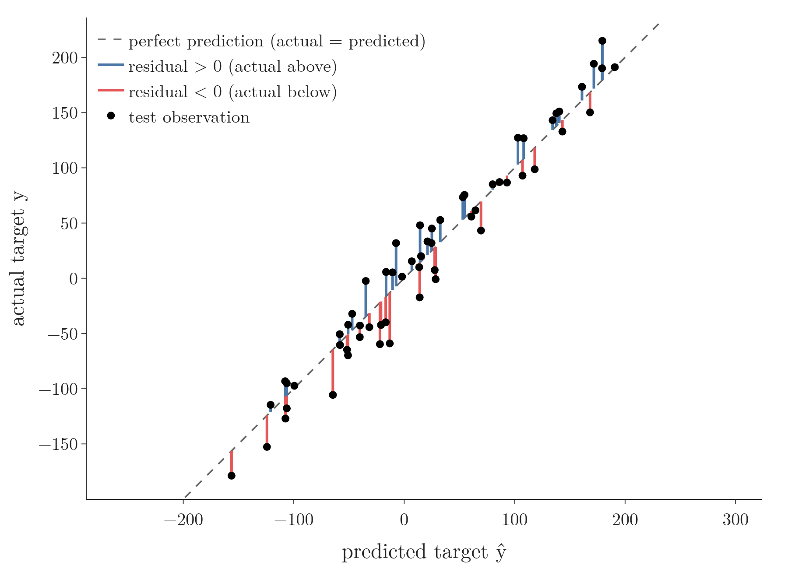
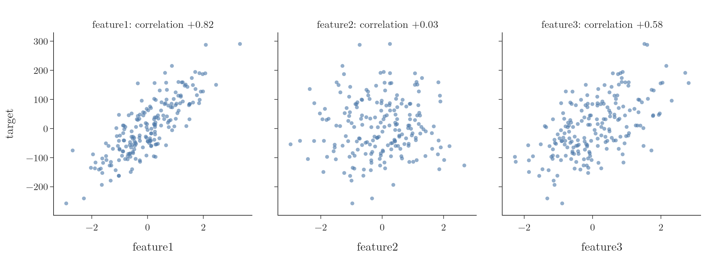
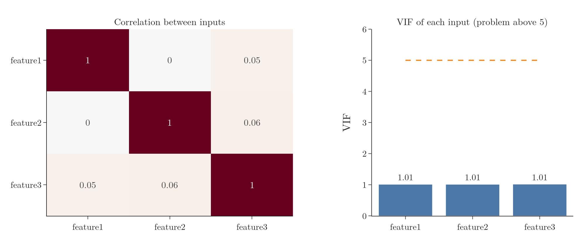
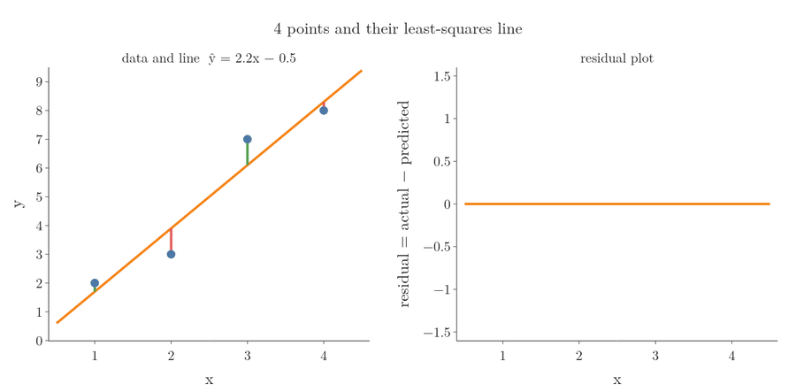
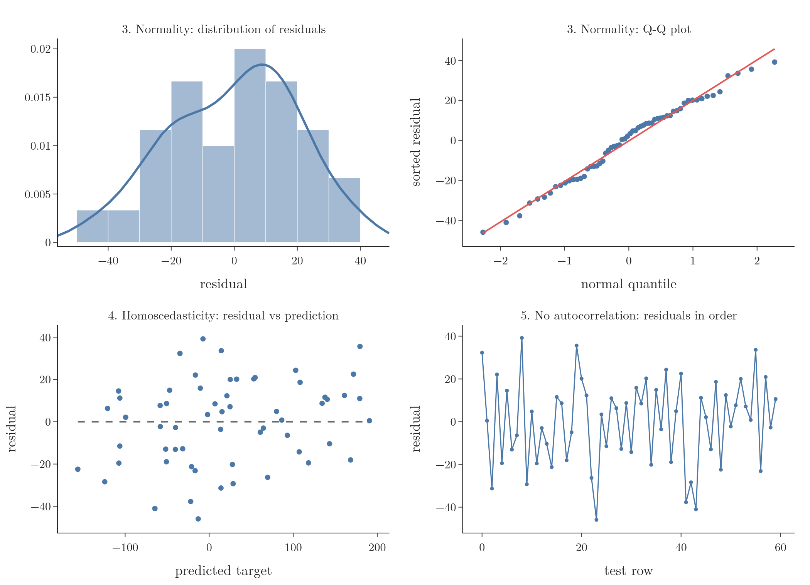
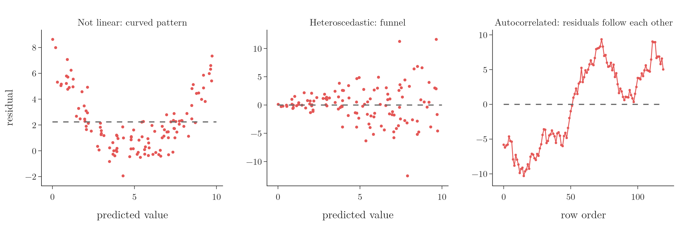
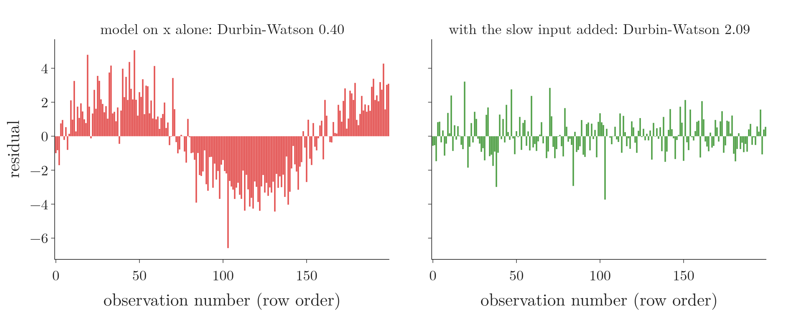

<!-- where-this-fits: generated by course_map/build_map.py; edit concepts.yaml, not this block -->
> **Where this fits:** Pipeline map step 8 (Model). See the [Course map](../01-course-map/note.md).
>
> 
>
> - **Builds on:** Multicollinearity ([Note 27](../27-one-hot-encoding/note.md)); Q-Q plot ([Note 30](../30-function-transformer/note.md)).
<!-- /where-this-fits -->

## 1. Overview

> **Key point:** Linear regression is reliable when five conditions hold: a linear relationship, no multicollinearity, normal residuals, constant spread of residuals, and no pattern in the residuals over the rows.

Linear regression always produces a line or hyperplane, whatever the data looks like. Whether that line can be trusted depends on a few conditions, called the **assumptions** (G-220) of linear regression. Like the rules of a game, they do not stop anyone from playing, but break them and the score means little.

Textbooks list them in slightly different ways; these five are the core ones (ISL §3.3.3; Kutner Ch. 3 and §7.6):

| | Assumption | Checked with |
|---|---|---|
| 1 | Linear relationship between each feature and the output | scatter plots |
| 2 | No multicollinearity between the features | VIF, correlation heatmap |
| 3 | Residuals are normally distributed | histogram, Q-Q plot |
| 4 | Homoscedasticity: residuals have the same spread everywhere | residuals against predictions |
| 5 | No autocorrelation of the residuals | residuals in row order |

Three words first. A **feature** (G-772) is an input variable (one column of the data table), an **observation** (G-1374) is one record (one row), and the **target** (G-1949) is the output we predict.

The first two assumptions concern the features; the last three concern the **residuals** (G-705), the errors $y_i - \hat y_i$ on each observation. Figure 1 draws them for the model below: each stick is the gap between an observation's actual target and the model's prediction.



The example data has 200 observations, three features and one target. A linear regression trained on 70% of it scores $R^2 = 0.96$ on the other 30% (60 observations); each check below uses those 60 test residuals.

> **Python:** The model whose assumptions we check.
>
> ```python
> df = pd.read_csv("data/data.csv")
> X, y = df.iloc[:, :3].to_numpy(), df["target"].to_numpy()
> X_train, X_test, y_train, y_test = train_test_split(
>     X, y, test_size=0.3, random_state=1)
> model = LinearRegression().fit(X_train, y_train)
> residual = y_test - model.predict(X_test)
> ```

## 2. Assumption 1: a linear relationship

> **Key point:** Each feature should relate to the output along a straight line, rising or falling. A curved relationship needs a different model.

Linear regression fits straight lines, so the relationship between each feature and the output should be roughly linear. Both directions are fine:

- **positive:** the output rises as the feature rises;
- **negative:** the output falls as the feature rises.

A curved relationship (for example, the output growing with the square of the feature) breaks this assumption, because a straight line then misses the pattern systematically.

The check is a scatter plot of the output against each feature (Figure 2).



- **feature1:** a clear rising line (**correlation** (G-490) 0.82).
- **feature3:** also rising, with more scatter (0.58).
- **feature2:** no visible relationship at all (0.03). Its fitted coefficient is only $-0.28$, against 72.7 and 53.3 for the other two: the model has learned to almost ignore it.

> **Extra:** A feature with no relationship, like feature2, does not break the assumption so much as add nothing; the model gives it a near-zero weight. When a feature has a curved relationship, a simple approach is to add non-linear transformations of that feature, such as $\log x$, $\sqrt{x}$ or $x^2$, to the model (ISL §3.3.3). Adding $x^2$ is polynomial regression, a later Note.

## 3. Assumption 2: no multicollinearity

> **Key point:** The features should not be strongly related to each other. If they are, the model cannot tell which one deserves the credit, and the coefficients become unreliable.

**Multicollinearity** (G-1273) means one feature can be (largely) predicted from the others. Multicollinearity was met in the one-hot encoding Note with the dummy variable trap.

### 3.1 Why it is a problem

> **Key point:** Each coefficient measures the effect of its feature with the others held fixed. Related features cannot be held fixed separately.

A coefficient $\beta_1$ is the change in the output when $x_1$ rises by 1 *and all other features stay the same*. If $x_1$ and $x_3$ always move together, "change $x_1$ and keep $x_3$ fixed" never happens in the data. The model then cannot separate their effects.

An analogy: two scientists finish a project together. If one is a physicist and the other a chemist, it is easy to say who contributed what. If both have identical skills, it is impossible. With related features the model faces the second case, so the coefficients become unreliable: a small change in the data can move them a long way (ISL §3.3.3). The predictions, on the other hand, usually stay good (Kutner §7.6).

Figure 3 tests this on our data. We refit the model on 20 **bootstrap** (G-320) resamples of the training data: each resample draws 140 observations from the 140 with replacement, so it differs a little from the original. With the Note's own features (left), feature1's coefficient stays between 69.9 and 78.0. Then we add a near-copy of feature1, feature1 plus a little noise (VIF 429, Section 3.2). Now feature1's coefficient swings from 21.5 to 102.5 and the copy's swings the opposite way, sometimes below 0. Their sum stays between 69.7 and 78.0: the model knows the pair's joint effect, but not how to split the credit.


### 3.2 Checking it

> **Key point:** A VIF near 1 means no multicollinearity; above 5 is a problem. All three features here have VIF 1.01.

The standard check is the **variance inflation factor (VIF)** (G-2075). For each feature, a regression predicts that feature from all the other features; if they predict it well (high $R^2$), the feature is redundant.

In words: the VIF of a feature is one divided by the part of it the other features cannot explain.

$$\text{VIF of feature } j = \frac{1}{1 - R_j^2}$$

where $R_j^2$ is the R² of predicting feature $j$ from the others. With numbers: if the others explain 80% of a feature ($R_j^2 = 0.8$), its VIF is $1 / 0.2 = 5$, the usual danger line. If they explain none of it, the VIF is 1.

> **Python:** VIF with statsmodels.
>
> ```python
> from statsmodels.stats.outliers_influence import (
>     variance_inflation_factor)
> from statsmodels.tools import add_constant
>
> Xc = add_constant(X_train)     # add an intercept column
> [variance_inflation_factor(Xc, i) for i in range(1, 4)]
> # [1.011, 1.010, 1.014]
> ```

A quicker, rougher check is a **heatmap** (G-886) of the correlations between the features (Figure 4). Here every correlation between different features is at most 0.06: no multicollinearity.



> **Extra:** If VIF is high, two simple fixes are to drop one of the related features, or to combine them into one feature, such as their average after scaling (ISL §3.3.3). Ridge regression, a later Note, was also designed for related features (Hoerl and Kennard).

## 4. The residual plot

> **Key point:** A residual plot puts every residual above or below a flat zero line. Random scatter around zero means the model fits; any shape means an assumption is broken.

The last three assumptions are all checked on one kind of picture, so we build it by hand first. Take four points, $(1, 2)$, $(2, 3)$, $(3, 7)$ and $(4, 8)$. Their least-squares line is $\hat y = 2.2x - 0.5$.

1. **Compute each residual,** actual minus predicted:

   | $x$ | actual $y$ | predicted $\hat y = 2.2x - 0.5$ | residual |
   |---|---|---|---|
   | 1 | 2 | 1.7 | $+0.3$ |
   | 2 | 3 | 3.9 | $-0.9$ |
   | 3 | 7 | 6.1 | $+0.9$ |
   | 4 | 8 | 8.3 | $-0.3$ |

2. **Draw a flat line at 0.** It stands for the fitted line.
3. **Plot each residual** at its $x$: above the zero line when the point lies above the fitted line, below when it lies below.

Figure 5 does these steps one point at a time. The result is the **residual plot** (G-2207): the fitted line laid flat, with only the errors left to look at.



How to read a residual plot:

- **Points scattered evenly above and below 0, with no shape:** the line describes the data well.
- **A curve,** for example above 0, then below, then above again: the relationship is not a straight line. Assumption 1 is broken, and a non-linear model such as [polynomial regression](../61-polynomial-regression/note.md) fits better (Figure 7, left).
- **A funnel or a wave:** assumptions 4 and 5 below.

With several features there is no single $x$ to put on the horizontal axis, so the predicted value $\hat y$ is used instead. The reading rules stay the same.

## 5. Assumption 3: normal residuals

> **Key point:** The residuals should follow a bell-shaped (normal) distribution centred on 0: most errors small, few large, positive and negative alike.

When the model is right on average, its errors should scatter around 0: many small errors and few large ones, as often too high as too low. Such a bell-shaped spread is a **normal distribution** (G-1343).

Two checks, both on the residuals (Figure 6, top):

- **Histogram or density plot:** roughly a bell centred on 0. Here it is, apart from a small bump.
- **Q-Q plot** (G-1596; from the function transformer Note): the points should lie on the straight line. Here they do, with small wiggles.

{height=62%}

> **Extra:** Formal tests exist as well. The **Shapiro-Wilk test** (G-1788) gives a **p-value** (G-1433); above 0.05 means no evidence against normality. Here $p = 0.51$, and the skewness of the residuals is $-0.23$, close to 0. With large samples these tests flag even small departures from normality, so look at the plots too (Ghasemi and Zahediasl 2012).

## 6. Assumption 4: homoscedasticity

> **Key point:** The residuals should have the same spread for small and large predictions. A funnel shape (heteroscedasticity) breaks the assumption.

**Homoscedasticity** (G-902) means "same scatter": the size of the errors does not depend on the size of the prediction. Its opposite, **heteroscedasticity** (G-889), is common (ISL §3.3.3): for example, a house-price model that is off by a few thousand on cheap houses and by much more on expensive ones.

The check is a scatter plot of residuals against predicted values (Figure 6, bottom left). The plot should look like an even band around 0, with no shape. Here it does: the spread is roughly the same from the lowest to the highest prediction.

Figure 7 (middle) shows what heteroscedasticity looks like: a funnel that widens to the right.



> **Extra:** Heteroscedasticity does not make the coefficients wrong on average, but it makes the model's uncertainty estimates wrong: the confidence intervals and p-values that statistics packages report (Wooldridge §8.1). One fix is to take the log or square root of the target. The log shrinks large values more than small ones, and can turn a funnel into an even band (ISL §3.3.3).

## 7. Assumption 5: no autocorrelation of the residuals

> **Key point:** One residual should not predict the next. Plotted in row order, the residuals should jump around randomly, not drift in waves.

**Autocorrelation** (G-230) means each residual is related to the one before it: if the model was too high on one observation, it is also too high on the next. Autocorrelation is common in **time series** (G-1975) data, measurements taken at points in time (ISL §3.3.3).

The check is to plot the residuals in row order (Figure 6, bottom right). They should jump up and down with no pattern. Here they do.

Figure 7 (right) shows positive autocorrelation: long runs above 0 followed by long runs below, like a slow wave. One cause is a missing feature that changes slowly from one observation to the next, such as a time trend: the model cannot see the trend, so the trend shows up in the residuals. Figure 8 shows this test (details in the Extra below): residuals of a model that misses a slow wave form the same wave; adding the wave as a feature leaves random jumps. Autocorrelation makes the model look more certain than it is: its confidence intervals come out too narrow (ISL §3.3.3).



> **Extra:** The **Durbin-Watson statistic** (G-649) puts a number on autocorrelation: about 2 means no autocorrelation, towards 0 means positive autocorrelation, towards 4 negative (statsmodels docs). Here it is 2.31, close to 2: no sign of autocorrelation. To test the missing-trend cause, the notebook makes data $y = 2x + 3\sin(t/25) + \text{noise}$, with $t$ the observation number. Fitting on $x$ alone gives Durbin-Watson 0.40; adding the slow wave $\sin(t/25)$ as a feature brings it back to 2.09. Figure 7 (left) also shows a residual plot when assumption 1 fails: a curve instead of a flat band.

## 8. Summary

| Assumption | What it means | How to check | This data |
|---|---|---|---|
| 1. Linearity | each feature relates to the output along a line | scatter plots | yes (feature2 unrelated) |
| 2. No multicollinearity | features not related to each other | VIF (problem above 5), correlation heatmap | VIF 1.01 |
| 3. Normal residuals | errors form a bell around 0 | histogram, Q-Q plot | yes |
| 4. Homoscedasticity | errors have the same spread everywhere | residuals vs predictions | yes |
| 5. No autocorrelation | errors do not follow each other | residuals in row order | yes |

- Assumptions 1 and 2 are about the features; 3 to 5 are about the residuals.
- A failed assumption does not stop the model from running; it makes its coefficients or uncertainty estimates untrustworthy.
- Residual plots should look like random noise; any shape (curve, funnel, wave) points to a broken assumption.

## 9. Sources

**Built from**

- CampusX, "What are the main Assumptions of Linear Regression? | Top 5 Assumptions of Linear Regression", YouTube, https://www.youtube.com/watch?v=EmSNAtcHLm8
- Khan Academy, "Residual plots", YouTube, https://www.youtube.com/watch?v=VamMrPZ-8fc (building a residual plot by hand and reading it, section 4)

**Other references**

- **ISL**: James, Witten, Hastie, Tibshirani, *An Introduction to Statistical Learning*, 2nd ed., Springer, 2021. §3.3.3, Potential Problems.
- **Kutner**: Kutner, Nachtsheim, Neter, Li, *Applied Linear Statistical Models*, 5th ed., McGraw-Hill, 2005. Ch. 3 (diagnostics and remedial measures), §7.6 (multicollinearity and its effects).
- **Hoerl and Kennard**: A. E. Hoerl and R. W. Kennard, "Ridge Regression: Biased Estimation for Nonorthogonal Problems", *Technometrics* 12(1), 55–67, 1970.
- **Ghasemi and Zahediasl**: A. Ghasemi and S. Zahediasl, "Normality Tests for Statistical Analysis: A Guide for Non-Statisticians", *International Journal of Endocrinology and Metabolism* 10(2), 486–489, 2012.
- **Wooldridge**: J. M. Wooldridge, *Introductory Econometrics: A Modern Approach*, Cengage. Chapter 8, Heteroskedasticity (§8.1, consequences for OLS).
- **statsmodels docs**: statsmodels documentation, `statsmodels.stats.stattools.durbin_watson`.

## 10. Key terms

| Term | Meaning |
|---|---|
| Feature | An input variable: one column of the data table |
| Observation | One record: one row of the data table |
| Target | The output we predict |
| Assumption (of a model) | A condition the data must meet for the model's results to be reliable |
| Residual (G-705) | The error on one data point: actual minus predicted value |
| Residual plot (G-2207) | The residuals plotted above and below a flat zero line, against a feature or the predicted value |
| Variance inflation factor (VIF) | $1 / (1 - R_j^2)$: how well the other features predict feature $j$; above 5 signals multicollinearity |
| Homoscedasticity | The residuals have the same spread for all predicted values |
| Heteroscedasticity | The spread of the residuals changes with the predicted value, often as a funnel |
| Autocorrelation | Each residual is related to the one before it in row order |
| Shapiro-Wilk test | A statistical test of whether data follows a normal distribution |
| Durbin-Watson statistic | A number from 0 to 4 measuring autocorrelation of residuals; about 2 means none |
| statsmodels | A Python library for statistical models and tests |
