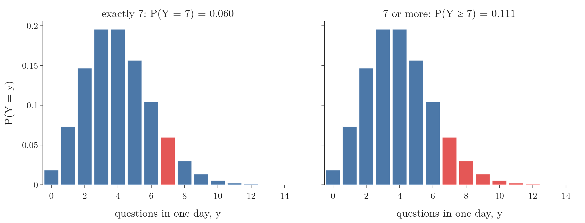
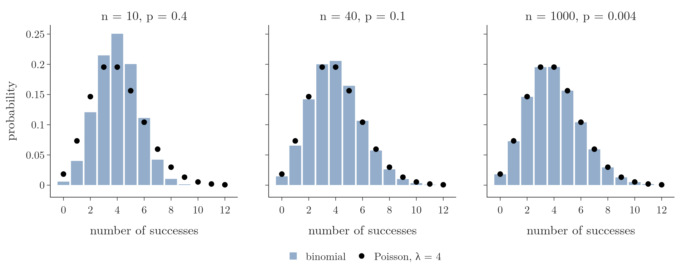

<!-- where-this-fits: generated by course_map/build_map.py; edit concepts.yaml, not this block -->
> **Where this fits:** Pipeline map step 0 (Foundations). See the [Course map](../01-course-map/note.md).
>
> 
>
> - **Builds on:** Probability mass function (PMF) ([Note 241](../241-pmf-and-discrete-cdf/note.md)); Expected value and variance of a random variable ([Note 332](../332-expected-value-and-variance/note.md)).
> - **Compare with:** Bernoulli and binomial distributions ([Note 270](../270-bernoulli-and-binomial/note.md)).
<!-- /where-this-fits -->

## 1. Overview

> **Key point:** The Poisson distribution gives the probability of each count of events (0, 1, 2, ...) in a fixed interval of time or space, when we know only the average count $\lambda$.


Figure 1 shows the kind of data the Poisson distribution describes. Events (here, questions from students) arrive at random moments; we cut time into equal intervals (days) and count the events in each. The counts vary from day to day, but their average, the **rate** $\lambda$, stays about the same.

The Poisson distribution was named in one line in the [PDF Note](../242-pdf-and-continuous-cdf/note.md): a discrete distribution of counts, with parameter $\lambda$. This Note teaches it in full:

- what kind of question it answers, and its notation;
- its PMF, with a worked example;
- the shape of its graph and how $\lambda$ moves it;
- its mean and variance, which are both $\lambda$;
- probabilities of a range of counts;
- its link to the binomial distribution, and where it is used.

The examples follow 365 Data Science.

## 2. What the Poisson distribution describes

> **Key point:** A Poisson variable counts how often an event happens in one interval; instead of a success probability, we need the average count per interval.

### 2.1 Counts in an interval

> **Key point:** The binomial distribution needs a number of trials and a probability; the Poisson distribution needs only a rate.

The binomial distribution counts successes in a fixed number $n$ of trials, each with success probability $p$ (see the [Bernoulli and binomial Note](../270-bernoulli-and-binomial/note.md)). Many counts have no trials to count:

- the questions students send in one day;
- the flashes of a firefly in 10 seconds;
- customers entering a shop in one hour;
- typing errors on one page of a book.

For these we know how **often** the event happens on average, its frequency in a standard interval of time or distance. The **Poisson distribution** turns that average into a probability for every possible count.

For example, a firefly lights up 3 times in 10 seconds on average. The Poisson distribution answers questions such as: how likely is it that it lights up 8 times in 20 seconds?

### 2.2 Notation

> **Key point:** $Y \sim \text{Po}(\lambda)$ reads "$Y$ follows a Poisson distribution with rate $\lambda$".

A distribution is often written as a short name with its parameters in brackets. The symbol $\sim$ reads "follows":

| Notation | Read as | Parameters |
|---|---|---|
| $X \sim \text{Bern}(p)$ | Bernoulli with success probability $p$ | $p$ |
| $X \sim B(n, p)$ | binomial with $n$ trials and success probability $p$ | $n$, $p$ |
| $Y \sim \text{Po}(\lambda)$ | Poisson with rate $\lambda$ | $\lambda$ |

For example, $X \sim B(10, 0.6)$ means 10 trials with success probability 0.6 each, and $Y \sim \text{Po}(4)$ means a count that is 4 on average. The Poisson distribution has a single parameter, $\lambda$ (lambda), the average number of events per interval.

### 2.3 The values a Poisson variable can take

> **Key point:** The count starts at 0 and has no upper limit.

A count can never be negative, so the possible values start at 0. Unlike the binomial count, which stops at $n$, a Poisson count has no cap: in principle the students could send 50 questions in one day. Such large counts are possible, only extremely unlikely.

## 3. The Poisson PMF

> **Key point:** $P(Y = y) = \dfrac{\lambda^{y} e^{-\lambda}}{y!}$, for $y = 0, 1, 2, \dots$

### 3.1 The example: a spike in questions

> **Key point:** Students usually ask 4 questions a day; yesterday they asked 7. How likely was exactly 7?

Suppose we run an online course on probability. Students usually ask around 4 questions per day, but yesterday they asked 7. To judge whether this spike is unusual, we want the probability of exactly 7 questions in one day.

The three ingredients:

- the interval is one working day;
- the average count per interval is 4, so $\lambda = 4$;
- the count we ask about is 7, so $y = 7$.

### 3.2 Two pieces of the formula

> **Key point:** $e \approx 2.718$ is a fixed number, and $e^{-\lambda}$ means $1 / e^{\lambda}$.

The formula uses two pieces of notation:

- **Euler's number** $e$, also called Napier's constant, is a fixed number, $e \approx 2.71828$. It turns up across mathematics, physics and nature; here we only need its value.
- A **negative power** means one over the positive power: $a^{-n} = 1 / a^{n}$. So $e^{-4} = 1 / e^{4} = 1 / 54.6 = 0.0183$.

The factorial $y!$ is the product $1 \times 2 \times \dots \times y$, with $0! = 1$ (as in the binomial coefficient of the [Bernoulli and binomial Note](../270-bernoulli-and-binomial/note.md)).

### 3.3 Exactly 7 questions

> **Key point:** $P(Y = 7) = 0.060$: about one day in 17 brings exactly 7 questions.

1. **In words:** raise the rate to the power of the count, multiply by $e$ to the power of minus the rate, and divide by the factorial of the count.
2. **Formula:**
   $$P(Y = y) = \frac{\lambda^{y}\, e^{-\lambda}}{y!}, \qquad y = 0, 1, 2, \dots$$
3. **Example:** with $\lambda = 4$ and $y = 7$:
   $$P(Y = 7) = \frac{4^{7}\, e^{-4}}{7!} = \frac{16384 \times 0.0183}{5040} = \frac{300.1}{5040} = 0.0595$$

So there was only about a 6% chance of exactly 7 questions. The bar at 7 in the left panel of Figure 2 has this height.

> **Extra:** A common slip is to read $e^{-4}$ as $0.183$. The correct value is $0.0183$; with $0.183$ the answer would come out as 0.595, ten times too large. The final answer 0.06 needs 0.0183.

> **Python:** `stats.poisson` gives the PMF in one call.
>
> ```python
> import math
> from scipy import stats
>
> 4 ** 7 * math.exp(-4) / math.factorial(7)   # 0.0595, by hand
> # scipy: pmf(y, lambda)
> stats.poisson.pmf(7, 4)                     # 0.0595
> ```



### 3.4 Scaling the rate to the interval

> **Key point:** $\lambda$ belongs to one interval length; for a longer or shorter interval, scale it in proportion.

The firefly flashes 3 times in 10 seconds on average, and we ask about 20 seconds. Twice the interval means twice the average, so $\lambda = 3 \times 20 / 10 = 6$.

1. **In words:** the probability of 8 flashes when 6 are expected.
2. **Formula:**
   $$P(Y = 8) = \frac{6^{8}\, e^{-6}}{8!}$$
3. **Example:**
   $$P(Y = 8) = \frac{1679616 \times 0.002479}{40320} = \frac{4163.4}{40320} = 0.103$$

> **Extra:** Using $\lambda = 3$ (the rate for 10 seconds) with a 20-second question is a common mistake. The rate and the interval must always match.

## 4. The graph of the Poisson distribution

> **Key point:** One bar per count, starting at 0 and running on to the right without end; the bars are tallest near $\lambda$.

The graph of a Poisson distribution plots each count $y$ against its probability. Figure 2 shows it for $\lambda = 4$:

- it starts at 0, since no event can happen a negative number of times;
- it peaks at 3 and 4 (both have probability 0.195);
- it has a tail to the right that never ends, though after about 12 the bars are too small to see.

The bars add to 1, as in every PMF (see the [PMF Note](../241-pmf-and-discrete-cdf/note.md)).


Figure 3 shows how $\lambda$ changes the shape:

- **$\lambda = 1$:** most days have 0 or 1 events; the distribution is strongly right-skewed (see the [skewness Note](../252-skewness/note.md)).
- **$\lambda = 4$:** the peak moves right and the bars spread out; a mild right skew remains.
- **$\lambda = 10$:** the peak sits at 9 and 10, the spread is wider, and the shape is close to a symmetric bell.

> **Extra:** For large $\lambda$ (about 20 or more) the Poisson distribution is close to a normal distribution with mean $\lambda$ and variance $\lambda$ (see the [normal distribution Note](../250-normal-distribution/note.md)). Its skewness is $1/\sqrt{\lambda}$: 1 for $\lambda = 1$, 0.5 for $\lambda = 4$, 0.32 for $\lambda = 10$.

## 5. Mean and variance

> **Key point:** A Poisson variable has mean $\lambda$ and variance $\lambda$: one number fixes both its centre and its spread.

The expected value is the sum of every value times its probability (see the [expected value Note](../332-expected-value-and-variance/note.md)). Applied to the Poisson PMF, this long sum simplifies to $\lambda$. The variance, from the same shortcut formula $E[Y^2] - (E[Y])^2$, is also $\lambda$.

1. **In words:** the average count is the rate, and so is the variance; the standard deviation is the square root of the rate.
2. **Formula:**
   $$E[Y] = \lambda, \qquad \mathrm{Var}(Y) = \lambda, \qquad \sigma = \sqrt{\lambda}$$
3. **Example:** for the questions, $\lambda = 4$: on average 4 questions per day, variance 4, standard deviation $\sqrt{4} = 2$. So 7 questions is $(7 - 4)/2 = 1.5$ standard deviations above the mean.

A simulation of 100,000 days with `rng.poisson(lam=4)` gives an average of 3.994 and a variance of 3.987, both close to 4.

> **Extra:** Why the mean is $\lambda$. Writing out the sum and cancelling one $y$ against $y!$:
> $$E[Y] = \sum_{y=0}^{\infty} y\,\frac{\lambda^{y} e^{-\lambda}}{y!} = \lambda \sum_{y=1}^{\infty} \frac{\lambda^{y-1} e^{-\lambda}}{(y-1)!} = \lambda \times 1 = \lambda$$
> The remaining sum is the Poisson PMF summed over all counts, which is 1. The same trick applied to $E[Y(Y-1)]$ gives $\lambda^2$, and from it $\mathrm{Var}(Y) = \lambda$.

> **Extra:** Mean equal to variance is a quick check on real count data. If the variance of the counts is much larger than their mean (**overdispersion**), the events are not independent or the rate is not constant, and the Poisson model will underestimate how often extreme counts happen.

## 6. Probability of a range of counts

> **Key point:** For "at least", "at most" or "between", add the probabilities of the single counts in the range.

The counts $0, 1, 2, \dots$ are separate outcomes: one day cannot have both exactly 6 and exactly 7 questions. So the probability of a range is the **sum** of the bars in it, as for any discrete distribution (see the [PMF Note](../241-pmf-and-discrete-cdf/note.md)).

1. **In words:** the probability of 7 or more questions is everything except 0 to 6.
2. **Formula:**
   $$P(Y \ge 7) = 1 - P(Y \le 6) = 1 - \sum_{y=0}^{6} \frac{4^{y}\, e^{-4}}{y!}$$
3. **Example:** the bars for 0 to 6 are 0.0183, 0.0733, 0.1465, 0.1954, 0.1954, 0.1563 and 0.1042:
   $$P(Y \le 6) = 0.8893, \qquad P(Y \ge 7) = 1 - 0.8893 = 0.111$$

The right panel of Figure 2 shows these red bars. A day with 7 or more questions happens about once in 9 days: unusual, but not rare.

More examples with $\lambda = 4$:

| Question | Probability |
|---|---|
| no questions at all, $P(Y = 0)$ | 0.018 |
| at most 2, $P(Y \le 2)$ | 0.238 |
| between 2 and 6, $P(2 \le Y \le 6)$ | 0.798 |

> **Python:** `cdf` adds the bars up to a count; `sf` adds the bars above it.
>
> ```python
> questions = stats.poisson(4)
> questions.sf(6)                          # 0.111: P(Y >= 7)
> questions.cdf(2)                         # 0.238: P(Y <= 2)
> questions.cdf(6) - questions.cdf(1)      # 0.798: P(2 <= Y <= 6)
> ```

## 7. The Poisson distribution as a limit of the binomial

> **Key point:** A binomial count with many trials and a small success probability is close to a Poisson count with $\lambda = np$.

> **Extra:** This whole section is extra material.

A website has 1000 visitors a day, and each visitor buys with probability 0.004. The number of buyers is binomial, $B(1000, 0.004)$, with mean $np = 4$. It is also, very nearly, $\text{Po}(4)$.



Figure 4 keeps $np = 4$ and lets $n$ grow:

| $n$ | $p$ | Largest gap between the two PMFs |
|---|---|---|
| 10 | 0.4 | 0.055 |
| 40 | 0.1 | 0.011 |
| 1000 | 0.004 | 0.0004 |

With 10 trials the binomial is narrower than the Poisson: its variance $np(1-p) = 2.4$ is below 4. With 1000 trials $1 - p$ is almost 1, the variance $np(1-p) = 3.98$ is almost $\lambda$, and the bars sit on the dots.

This is where the Poisson distribution comes from. Cut a day into many tiny moments; in each, a question arrives or not, with a tiny probability. The count is binomial with huge $n$ and tiny $p$, and in the limit it becomes Poisson. A rule of thumb: the approximation is good when $n \ge 20$ and $p \le 0.05$.

## 8. When a count is Poisson, and where it is used

> **Key point:** Events must happen one at a time, independently, at a constant average rate; then counts of arrivals, calls, clicks or defects are Poisson.

> **Extra:** This whole section is extra material.

A count follows a Poisson distribution when:

1. **Events are independent.** One question does not make the next more or less likely.
2. **The rate is constant.** The average count is the same for every interval of the same length; an exam week with more questions breaks this.
3. **Events happen one at a time.** Two events never happen at exactly the same moment.

Typical Poisson counts:

- customers arriving at a shop or a website per hour;
- calls to a support centre per minute;
- defects per metre of cable, typos per page;
- goals in a football match;
- rare-event counts, such as accidents at a crossing per month.

In machine learning, a target that is a count (bike rentals per hour, insurance claims per year) is often modelled with **Poisson regression**, which predicts $\lambda$ for each row; scikit-learn has it as `PoissonRegressor`. Counts of words in a document also appear in text models.

## 9. Summary

| | Binomial | Poisson |
|---|---|---|
| Counts | successes in $n$ trials | events in one interval |
| Notation | $B(n, p)$ | $\text{Po}(\lambda)$ |
| Parameters | $n$, $p$ | $\lambda$ |
| Values | $0$ to $n$ | $0, 1, 2, \dots$ without limit |
| PMF | $\binom{n}{y} p^y (1-p)^{n-y}$ | $\lambda^{y} e^{-\lambda} / y!$ |
| Mean, variance | $np$, $np(1-p)$ | $\lambda$, $\lambda$ |
| Example | 2 likes out of 3 viewers, $p = 0.5$: 3/8 | 7 questions when 4 are usual: 0.060 |

- The Poisson distribution needs only the average count per interval, $\lambda$; scale $\lambda$ when the interval changes.
- Its graph starts at 0, peaks near $\lambda$ and has an endless right tail; a larger $\lambda$ moves it right and spreads it out.
- Mean and variance are both $\lambda$.
- A range of counts has the sum of the single-count probabilities.
- A binomial with large $n$ and small $p$ is approximately Poisson with $\lambda = np$.

## 10. Key terms

| Term | Meaning |
|---|---|
| Poisson distribution | The distribution of the number of events in a fixed interval, given their average count $\lambda$ |
| Rate $\lambda$ | The average number of events per interval; the only parameter of the Poisson distribution |
| $Y \sim \text{Po}(\lambda)$ | Notation: $Y$ follows a Poisson distribution with rate $\lambda$; likewise $\text{Bern}(p)$ and $B(n, p)$ |
| Euler's number $e$ | A fixed number, about 2.71828, that appears in the Poisson PMF |
| Negative power | $a^{-n} = 1/a^{n}$ |
| Overdispersion | Count data whose variance is clearly larger than its mean, a sign that a Poisson model does not fit |
| Poisson regression | A model that predicts the rate $\lambda$ of a count target from the features |
