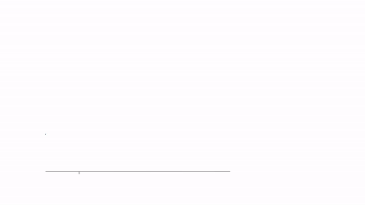
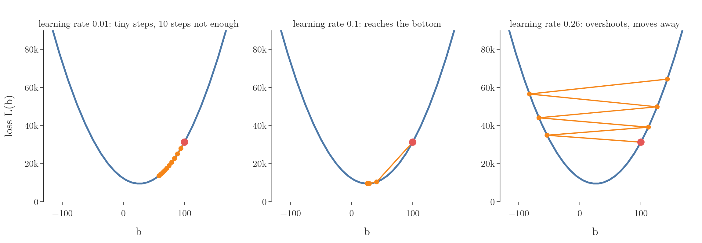
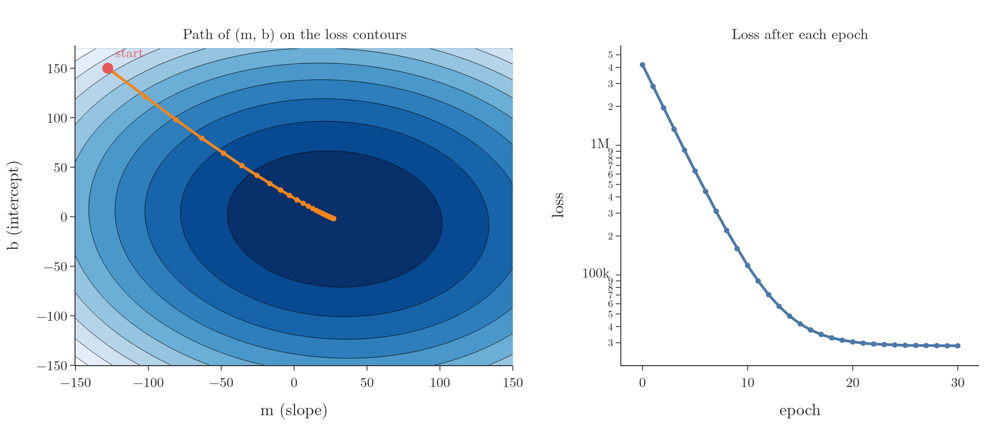
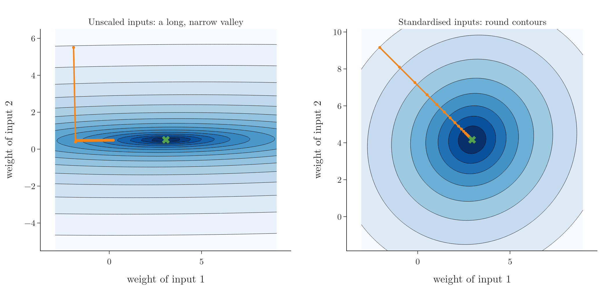

<!-- where-this-fits: generated by course_map/build_map.py; edit concepts.yaml, not this block -->
> **Where this fits:** Pipeline map steps 8 (Model), 10 (Tune). See the [Course map](../01-course-map/note.md).
>
> 
>
> - **Builds on:** Feature scaling ([Note 24](../24-standardization/note.md)); Best-fit line and squared error ([Note 51](../51-linear-regression-maths/note.md)).
> - **Leads to:** Batch gradient descent ([Note 58](../58-batch-gradient-descent/note.md)); Stochastic gradient descent ([Note 59](../59-stochastic-gradient-descent/note.md)); Mini-batch gradient descent ([Note 60](../60-mini-batch-gradient-descent/note.md)); Ridge regression ([Note 63](../63-ridge-regression-intuition/note.md)); Logistic regression (Video 70, coming); Gradient boosting (Video 120, coming).
> - **Compare with:** Ordinary least squares (closed form) ([Note 51](../51-linear-regression-maths/note.md)); Normal equation ([Note 55](../55-multiple-lr-code/note.md)).
<!-- /where-this-fits -->

## 1. Overview

> **Key point:** Gradient descent finds the minimum of a function by starting anywhere and repeatedly taking a small step downhill, against the slope.

**Gradient descent** is a first-order iterative optimisation algorithm for finding a local minimum of a differentiable function. In plainer words:

- **optimisation algorithm:** it finds the values of parameters that make some function as small as possible;
- **iterative:** it does this in many small steps instead of with one formula;
- **first-order:** each step uses only the first derivative (the slope);
- **differentiable function:** the function must have a slope everywhere.

In ML, the function is the **loss function** (for linear regression, the sum of squared errors) and the parameters are the model's coefficients. Gradient descent is one of the most widely used algorithms in ML and the main one in deep learning.

The normal equation already gives linear regression's coefficients directly, so why learn this? Because the normal equation becomes very slow with many columns (the inverse costs about $m^3$), and most models (logistic regression, neural networks) have no direct formula at all. Gradient descent works for all of them. Linear regression is just a convenient place to learn it, because we can check the answer against OLS.

## 2. The idea

> **Key point:** Standing on a curve with our eyes closed, the slope under our feet tells us which way is down. Step that way, and repeat.

### 2.1 Which way to move

> **Key point:** If the slope is positive, the minimum is to the left, so decrease the parameter. If the slope is negative, increase it.

Start with a single parameter, the intercept $b$, and keep the slope of the line fixed for now. The loss $L(b)$, as $b$ changes, is a U-shaped curve with its minimum at the best $b$.

Imagine standing somewhere on that curve, blindfolded. We cannot see where the bottom is. But we can feel the slope under our feet:

- **Slope positive** (the curve rises to the right): the bottom is to the left. Decrease $b$.
- **Slope negative** (the curve falls to the right): the bottom is to the right. Increase $b$.

In both cases, moving **against the sign of the slope** goes downhill. That is the whole idea.

### 2.2 How far to move

> **Key point:** The step is the slope times a small number, the learning rate: $b_{\text{new}} = b_{\text{old}} - \eta \cdot \text{slope}$.

In words: subtract from the current value the slope multiplied by a small constant $\eta$ (eta), the **learning rate**.

$$b_{\text{new}} = b_{\text{old}} - \eta \, \frac{\partial L}{\partial b}$$

Two things happen automatically:

- The minus sign handles the direction (Section 2.1).
- Far from the bottom the slope is steep, so the steps are big; near the bottom the slope flattens, so the steps shrink.

The learning rate keeps the steps from being too large. Without it, a slope of 590 would throw $b$ 590 units away in one jump.

### 2.3 When to stop

> **Key point:** Stop after a fixed number of steps (epochs), or when the steps become tiny.

Two common stopping rules:

1. **A fixed number of iterations**, called **epochs**: for example, 100 updates.
2. **The step size becomes negligible**: for example, when $b_{\text{new}} - b_{\text{old}}$ is below 0.0001, the algorithm has reached (almost) the bottom.

## 3. The slope of the loss with respect to b

> **Key point:** For the sum of squared errors, $\dfrac{\partial L}{\partial b} = -2\sum (y_i - m x_i - b)$.

Gradient descent needs the slope of the loss at the current $b$. For linear regression the loss is

$$L(m, b) = \sum_{i=1}^{n} (y_i - m x_i - b)^2$$

In words: differentiate each squared term with respect to $b$. The chain rule brings down a factor 2, and the inner derivative of $-b$ is $-1$.

$$\frac{\partial L}{\partial b} = -2\sum_{i=1}^{n} (y_i - m x_i - b)$$

This is the same derivative as in the OLS derivation. There we set it to zero and solved; here we only evaluate it at the current point and take a step.

## 4. A worked example: four points, b only

> **Key point:** Starting from b = 100 with learning rate 0.1, three steps give 40.93, 29.11 and 26.75, closing in on the OLS value 26.16.

The example data has 4 points. OLS gives slope $m = 78.35$ and intercept $b = 26.16$. To see gradient descent alone, we fix $m = 78.35$ and start $b$ deliberately far away, at $b = 100$, with learning rate $\eta = 0.1$.

{height=55%}

Figure 1 shows the loss curve $L(b)$ and the steps.

1. **Step 1:** at $b = 100$ the slope is $590.7$. The step is $0.1 \times 590.7 = 59.07$, so $b = 100 - 59.07 = 40.93$.
2. **Step 2:** at $b = 40.93$ the slope is $118.1$. The step is $11.81$, so $b = 29.11$.
3. **Step 3:** at $b = 29.11$ the slope is $23.6$. The step is $2.36$, so $b = 26.75$.
4. **Steps 4 and 5:** $b = 26.28$, then $26.18$, almost exactly the OLS value 26.16.

Each slope is about one fifth of the previous one, so each step shrinks too. Nothing in the rule tells the algorithm to slow down: the flattening curve does it.

## 5. The learning rate

> **Key point:** Too small and gradient descent crawls; too large and it overshoots and can run away. The right value is found by trying.

The learning rate is a **hyperparameter**: a setting we choose, not a value the algorithm learns. Figure 2 starts from the same $b = 100$ with three learning rates.



- **0.01, too small:** after 10 steps $b$ has only moved from 100 to 58. It would get there eventually, but slowly.
- **0.1, good:** the bottom is reached within about 5 steps.
- **0.26, too large:** each step jumps over the bottom to the other side, landing higher than before: $100 \to -53.6 \to 112.3 \to -66.9 \to \dots$. The loss grows with every step, and the algorithm never converges.

A common approach is to try a few values, such as 0.001, 0.01 and 0.1, and keep the one where the loss falls fastest without jumping around.

## 6. Both parameters: m and b together

> **Key point:** With two parameters, compute both slopes and update both at the same step. The point walks downhill across the loss bowl.

In practice both $m$ and $b$ are unknown. The loss $L(m, b)$ is then the bowl from the OLS Notes, and gradient descent needs one slope per parameter.

The slope with respect to $b$ is as before. With respect to $m$, the inner derivative of $-m x_i$ is $-x_i$:

$$\frac{\partial L}{\partial m} = -2\sum_{i=1}^{n} (y_i - m x_i - b)\, x_i$$

Each epoch updates both at once, using the current values of both:

$$m_{\text{new}} = m_{\text{old}} - \eta \frac{\partial L}{\partial m} \qquad b_{\text{new}} = b_{\text{old}} - \eta \frac{\partial L}{\partial b}$$

The vector of these partial derivatives is called the **gradient**; it points uphill, so stepping against it goes downhill. That is where the name comes from.

Figure 3 runs this on 100 points, starting far away at $m = -127.8$, $b = 150$, with learning rate 0.001 for 30 epochs.



The left panel is a **contour plot**: a map of the bowl seen from above, with each ring joining points of equal loss and the darkest region at the bottom. The path heads straight down the bowl and arrives at $m = 27.2$, $b = -1.9$. The right panel shows the loss falling from about 4.2 million to 28,400, quickly at first and then levelling off.

## 7. Gradient descent as a class

> **Key point:** A small class with fit (the update loop) and predict reproduces LinearRegression's answer to within a few hundredths.

> **Python:** Gradient descent for simple linear regression.
>
> ```python
> class GDRegressor:
>     def __init__(self, learning_rate, epochs):
>         self.m, self.b = 100.0, -120.0      # any start
>         self.lr, self.epochs = learning_rate, epochs
>
>     def fit(self, X, y):
>         x = X.ravel()
>         for _ in range(self.epochs):
>             slope_b = -2 * np.sum(y - self.m * x - self.b)
>             slope_m = -2 * np.sum((y - self.m * x - self.b) * x)
>             self.b -= self.lr * slope_b
>             self.m -= self.lr * slope_m
>         return self
>
>     def predict(self, X):
>         return self.m * X.ravel() + self.b
> ```

On 80 training points with learning rate 0.001 and 50 epochs:

| | Slope $m$ | Intercept $b$ | Test R² |
|---|---|---|---|
| OLS (`LinearRegression`) | 28.126 | $-2.271$ | 0.6345 |
| Gradient descent | 28.159 | $-2.300$ | 0.6344 |

Gradient descent gets within 0.03 of the exact answer: an approximation, but a very close one.

> **Extra:** Both slopes are computed from the old values before either is updated. Updating $b$ first and then using the new $b$ to compute the slope for $m$ is a different (and, here, slightly wrong) algorithm.

## 8. The shape of the loss function matters

> **Key point:** Linear regression's loss is convex: one bowl, one minimum, and gradient descent always finds it. Other losses can trap it in a local minimum or slow it on a flat stretch.

Gradient descent only follows the local slope, so the shape of the loss function decides how well it works (Figure 4).


- **Convex:** a function is **convex** when a straight line between any two points on its curve never goes below the curve. Such a function has exactly one minimum. The sum of squared errors of linear regression is convex, so gradient descent always reaches the best answer.
- **Non-convex, with a local minimum:** a straight line between two points can cut through the curve. Then there can be several dips: a **local minimum** (lowest only in its neighbourhood) and a **global minimum** (lowest of all). Started near the local one, gradient descent settles there and stops, unaware that a better answer exists.
- **A plateau:** a nearly flat stretch has a tiny slope, so the steps become tiny and progress almost stops. With too few epochs, the algorithm halts before leaving the plateau. In more dimensions, a related trouble spot is a **saddle point**, flat in one direction and curved in another.

> **Extra:** Non-convex losses are the norm in deep learning. Techniques such as random restarts, momentum and adaptive learning rates are designed to escape local minima and plateaus; they come with neural networks.

## 9. The effect of feature scaling

> **Key point:** When inputs are on very different scales, the loss bowl becomes a long, narrow valley and gradient descent zigzags slowly. Scaling the inputs makes it round and fast.

With two inputs, the shape of the loss depends on the scale of the inputs. Figure 5 compares the same made-up data, with input 2 eight times larger in scale than input 1, before and after standardising.



- **Unscaled:** the contours are long, narrow ellipses. The learning rate must be small to avoid blowing up in the steep direction, which makes progress along the flat direction very slow. After 40 steps the weights are still 2.8 away from the best values.
- **Standardised:** the contours are nearly circles, the slope points straight at the minimum, and 40 steps reach it.

This is why inputs should be scaled (standardisation or normalisation, from the feature scaling Notes) before using gradient descent.

## 10. Summary

| Idea | In one line |
|---|---|
| Update rule | parameter $\leftarrow$ parameter $- \eta \times$ slope |
| Slope for $b$ | $-2\sum (y_i - m x_i - b)$ |
| Slope for $m$ | $-2\sum (y_i - m x_i - b)\,x_i$ |
| Learning rate $\eta$ | too small: slow; too large: overshoots and diverges |
| Stopping | fixed number of epochs, or tiny steps |
| Convex loss | one minimum, always found (linear regression) |
| Non-convex loss | local minima, plateaus, saddle points can trap it |
| Feature scaling | round contours, faster convergence |

- Gradient descent works for any differentiable loss, which is why it powers most of ML.
- On linear regression it reproduces OLS closely: slope 28.16 against 28.13 here.
- The steps shrink by themselves near the minimum, because the slope shrinks.

## 11. Key terms

| Term | Meaning |
|---|---|
| Gradient descent | An iterative algorithm that finds a minimum by repeatedly stepping against the slope |
| Optimisation algorithm | A method for finding the parameter values that make a function as small (or large) as possible |
| Learning rate ($\eta$) | The number the slope is multiplied by to get the step size |
| Epoch | One full update of the parameters using the whole training set |
| Gradient | The vector of partial derivatives of the loss; it points in the direction of steepest increase |
| Converge | To settle at a minimum, with steps becoming negligible |
| Diverge | To move further away with each step, the loss growing instead of shrinking |
| Contour plot | A map of a surface seen from above, with lines joining points of equal height |
| Convex function | A function where a straight line between any two points of its curve never goes below the curve; it has a single minimum |
| Local minimum | A point lower than everything around it, but not the lowest overall |
| Global minimum | The lowest point of the whole function |
| Plateau | A nearly flat region of the loss, where steps become very small |
| Saddle point | A flat point that curves up in one direction and down in another |
