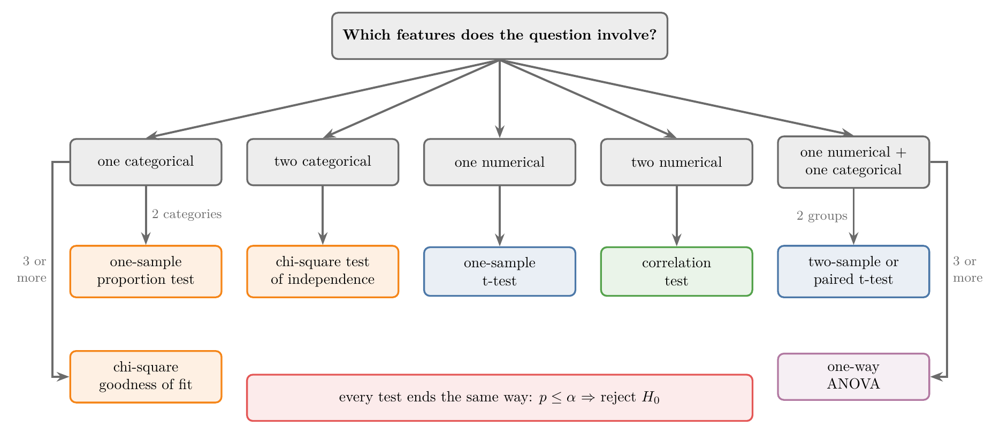

<!-- where-this-fits: generated by course_map/build_map.py; edit concepts.yaml, not this block -->
> **Where this fits:** Pipeline map steps 0 (Foundations), 3 (Understand data). See the [Course map](../01-course-map/note.md).
>
> 
>
> - **Builds on:** Correlation ([Note 231](../231-covariance-and-correlation/note.md)); Student's t-distribution ([Note 282](../282-t-procedure/note.md)); Hypothesis testing: null and alternative ([Note 291](../291-rejection-region-and-z-test/note.md)); Z-test and rejection regions ([Note 291](../291-rejection-region-and-z-test/note.md)).
> - **Compare with:** Chi-square tests ([Note 29](../29-pipelines/note.md)); One-way ANOVA ([Note 572](../572-one-way-anova/note.md)).
<!-- /where-this-fits -->

## 1. Overview

> **Key point:** The kinds of columns a question involves (categorical or numerical, one or two) decide which hypothesis test to run; every test then ends with the same rule, reject $H_0$ when $p \le \alpha$.



The earlier hypothesis-testing Notes built the z-test and three t-tests. Real questions come with data of many kinds: counts of men and women, heights, age groups. Figure 1 is the guide this Note follows: name the columns the question is about, and the test follows.

This Note covers:

- the decision logic shared by every test, with three common misreadings;
- a small dataset with two categorical and two numerical columns;
- one test for each kind of question: the one-sample proportion test, the chi-square test, the t-tests, the correlation test and ANOVA.

Two of these tests are new here and taught in full: the one-sample proportion test and the correlation test. The chi-square tests and ANOVA each get their own Note: the [chi-square tests Note](../571-chi-square-tests/note.md) and the [one-way ANOVA Note](../572-one-way-anova/note.md).

## 2. One logic for every test

> **Key point:** State $H_0$ ("no difference") and $H_1$, fix $\alpha$ before looking, compute the p-value assuming $H_0$, and reject $H_0$ when $p \le \alpha$.

Every test in this Note follows the eight steps of a hypothesis test (see the [null and alternative hypotheses Note](../290-null-and-alternative-hypotheses/note.md)). In short:

1. **Hypotheses.** $H_0$ says there is no difference or no relationship; $H_1$ says there is one.
2. **Significance level.** Fix $\alpha$, usually 0.05, before running the test (see the [rejection region Note](../291-rejection-region-and-z-test/note.md)).
3. **Test.** Choose the test from the columns involved (Figure 1) and compute its statistic.
4. **P-value.** The probability, if $H_0$ were true, of a result at least as extreme as ours (see the [p-values Note](../300-p-values/note.md)).
5. **Decision.** $p \le \alpha$: reject $H_0$. $p > \alpha$: fail to reject $H_0$.

With $\alpha = 0.05$ in a two-tailed test, the rejection region is the outer 2.5% at each end of the test statistic's distribution, 5% in total (see the [errors, power and tails Note](../292-errors-power-and-tails/note.md)).

### 2.1 Three misreadings to avoid

> **Key point:** $H_0$ is assumed, not known to be true; the p-value is not the probability that $H_1$ is true; and a large p-value does not let us "accept" $H_0$.

These three mix-ups are common enough to correct here; each is explained in the Note linked.

- **"$H_0$ is always true."** We **assume** $H_0$ while computing the p-value, as a starting point. The test exists because $H_0$ may be false.
- **"The p-value is the probability that $H_1$ is true."** It is the probability of data this extreme if $H_0$ were true (see the [p-values Note](../300-p-values/note.md)). It says nothing directly about how likely either hypothesis is.
- **"$p > 0.05$, so we accept $H_0$."** A large p-value means the sample gives too little evidence against $H_0$. We say we **fail to reject** $H_0$; absence of evidence is not proof (see the [null and alternative hypotheses Note](../290-null-and-alternative-hypotheses/note.md)).

## 3. The example dataset

> **Key point:** 60 people with two categorical columns (gender, age group) and two numerical columns (height, weight); each pair of column kinds leads to a different test.

We use one sample of 60 people with four columns:

| gender | age_group | height (m) | weight (kg) |
|---|---|---|---|
| male | adult | 1.67 | 71.0 |
| male | adult | 1.76 | 75.6 |
| female | elderly | 1.57 | 63.1 |
| female | child | 1.29 | 33.9 |
| female | child | 1.17 | 18.2 |

The data is simulated (`data/make_people.py` builds `data/people.csv` with a fixed seed), so that every test has clean, reproducible numbers. It has:

- **gender:** a categorical column with two categories, 34 female and 26 male;
- **age_group:** a categorical column with three categories, 20 child, 26 adult, 14 elderly;
- **height** and **weight:** numerical (continuous) columns.

It is a **sample**. A bar chart of gender shows the proportions in these 60 people; the test tells whether they say anything about the population the sample came from (see the [what is statistics Note](../220-what-is-statistics/note.md)).

## 4. One categorical column: the one-sample proportion test

> **Key point:** Does the share of one category differ from a claimed value? Compare the sample proportion with the claim, in standard errors.

### 4.1 The question

> **Key point:** Is the proportion of men in the population different from 0.5?

With one categorical column, the natural question is about proportions: is there a difference between the proportion of men and women? With two categories, the share of men $\pi$ settles the question:

$$H_0: \pi = 0.5, \qquad H_1: \pi \neq 0.5$$

Our sample has 26 men out of 60, a **sample proportion** $\hat{p} = 26/60 = 0.433$. It is below 0.5, but a sample of 60 can easily miss by that much.

### 4.2 The z statistic for a proportion

> **Key point:** $z = (\hat{p} - \pi_0) / \sqrt{\pi_0 (1 - \pi_0) / n}$: the distance of the sample proportion from the claim, in standard errors.

A proportion is the mean of a 0/1 column, with standard deviation $\sqrt{\pi(1 - \pi)}$ (the Bernoulli variance, see the [Bernoulli and binomial Note](../270-bernoulli-and-binomial/note.md)). By the central limit theorem the sample proportion is close to normal for large $n$ (see the [sampling distribution Note](../271-sampling-distribution-and-clt/note.md)). So the z-test of the [rejection region Note](../291-rejection-region-and-z-test/note.md) applies, with these pieces:

1. **In words:** the gap between the sample proportion and the claimed proportion, divided by the standard error the claim implies.
2. **Formula:**
   $$z = \frac{\hat{p} - \pi_0}{\sqrt{\pi_0 (1 - \pi_0) / n}}$$
3. **Example:** $\hat{p} = 0.433$, $\pi_0 = 0.5$, $n = 60$:
   $$SE = \sqrt{\frac{0.5 \times 0.5}{60}} = \sqrt{0.00417} = 0.0645, \qquad z = \frac{0.433 - 0.5}{0.0645} = \frac{-0.067}{0.0645} = -1.03$$

The standard error uses the claimed $\pi_0$, not $\hat{p}$: the test asks how the sample would behave if $H_0$ were true.

### 4.3 The decision

> **Key point:** $z = -1.03$ gives $p = 0.30 > 0.05$: we fail to reject $H_0$; the sample does not show that men and women occur in different proportions.

The test is two-tailed, so the p-value is both tails beyond $|z| = 1.03$:

$$p = 2\,P(Z \ge 1.03) = 2 \times 0.151 = 0.30$$

Since $0.30 > 0.05$, we fail to reject $H_0$. A 26-to-34 split in 60 people is well within what a 50/50 population produces by chance.

> **Python:** The z-test by hand, and scipy's exact version.
>
> ```python
> import numpy as np
> from scipy import stats
>
> p_hat, pi0, n = 26 / 60, 0.5, 60
> z = (p_hat - pi0) / np.sqrt(pi0 * (1 - pi0) / n)
> 2 * stats.norm.sf(abs(z))           # 0.30, z-test
> stats.binomtest(26, n=60, p=0.5)    # p = 0.37, exact
> ```

> **Extra:** The count of men is binomial, $B(60, \pi)$, so the p-value can also be computed exactly from binomial tail areas, as for the coin in the [p-values Note](../300-p-values/note.md); `stats.binomtest` does this. It gives 0.37 here. The z version is the normal approximation, good when $n\pi_0 \ge 10$ and $n(1 - \pi_0) \ge 10$ (here both are 30).

> **Extra:** With three or more categories (child, adult, elderly against claimed shares), one proportion no longer describes the column. The test for that case is the **chi-square goodness-of-fit test** (see the [chi-square tests Note](../571-chi-square-tests/note.md)).

## 5. Two categorical columns: the chi-square test

> **Key point:** Does the proportion of men differ between age groups? Two categorical columns are tested with the chi-square test of independence.

Adding a second categorical column changes the question: is there a difference between the proportion of men and women **across age groups**? Equivalently: are gender and age group related?

- $H_0$: gender and age group are independent (the share of men is the same in every age group);
- $H_1$: they are related.

The counts go in a contingency table, as in the [contingency tables Note](../340-venn-diagrams-and-contingency-tables/note.md); pandas builds it with `pd.crosstab` (see the [bivariate analysis Note](../21-bivariate-multivariate-analysis/note.md)):

| | child | adult | elderly |
|---|---|---|---|
| female | 12 | 12 | 10 |
| male | 8 | 14 | 4 |

The **chi-square test of independence** gives $\chi^2 = 2.50$ with $p = 0.29$. Since $0.29 > 0.05$, we fail to reject $H_0$: the sample does not show that the gender mix changes with age group. How the statistic is built is the subject of the [chi-square tests Note](../571-chi-square-tests/note.md).

## 6. One numerical column: the one-sample t-test

> **Key point:** Does the mean height differ from a known earlier value? One numerical column against a claimed mean is the one-sample t-test.

Our sample's mean height is 1.533 m. An earlier sample from the same population had a mean of 1.55 m. Is there a difference?

$$H_0: \mu = 1.55, \qquad H_1: \mu \neq 1.55$$

This is the one-sample t-test of the [one-sample t-test Note](../301-one-sample-t-test/note.md): $t = (\bar{x} - \mu_0)/(s/\sqrt{n})$ with $n - 1$ degrees of freedom. With $s = 0.211$ and $n = 60$:

$$t = \frac{1.5327 - 1.55}{0.211 / \sqrt{60}} = \frac{-0.0173}{0.0273} = -0.64, \qquad df = 59, \quad p = 0.53$$

We fail to reject $H_0$: the mean height is consistent with 1.55 m.

## 7. Two numerical columns: the correlation test

> **Key point:** Are height and weight related? Pearson's $r$ measures the relationship; the correlation test asks whether $r$ is far enough from 0 to rule out chance.

### 7.1 Correlation as a test

> **Key point:** $H_0$: the population correlation $\rho$ is 0, no linear relationship; $H_1$: $\rho \neq 0$.

Pearson's correlation coefficient $r$ runs from $-1$ to $+1$; a value near 0 means no linear relationship (see the [covariance and correlation Note](../231-covariance-and-correlation/note.md)). But $r$ comes from a sample. Two unrelated columns give a small non-zero $r$ in a sample by chance, so we test:

$$H_0: \rho = 0 \ \text{(no relationship)}, \qquad H_1: \rho \neq 0$$

Here $\rho$ (rho) is the correlation in the population, and $r$ is its estimate from the sample.

### 7.2 The test statistic

> **Key point:** $t = r\sqrt{n - 2}/\sqrt{1 - r^2}$, compared with a t-distribution with $n - 2$ degrees of freedom.

Under $H_0$ the statistic below follows Student's t-distribution (see the [t-procedure Note](../282-t-procedure/note.md)) with $n - 2$ degrees of freedom. So the correlation test is itself a t-test.

1. **In words:** scale $r$ by the square root of the sample size, and divide by the share of variation $r$ leaves unexplained.
2. **Formula:**
   $$t = \frac{r\sqrt{n - 2}}{\sqrt{1 - r^2}}, \qquad df = n - 2$$
3. **Example:** $r = 0.30$ from $n = 30$ pairs:
   $$t = \frac{0.30 \times \sqrt{28}}{\sqrt{1 - 0.09}} = \frac{0.30 \times 5.29}{0.954} = 1.66, \qquad df = 28, \quad p = 0.11$$

So $r = 0.30$ from 30 pairs is **not** significant at 5%. The same $r = 0.30$ from 100 pairs gives $t = 3.11$ and $p = 0.002$: significant. Sample size matters as much as the size of $r$.

### 7.3 Height and weight

> **Key point:** $r = 0.98$ from 60 people gives $p < 0.001$: height and weight are strongly related.

{height=32%}

Figure 2 shows a tight upward pattern. Here $r = 0.980$ and $n = 60$:

$$t = \frac{0.980 \times \sqrt{58}}{\sqrt{1 - 0.961}} = 37.9, \qquad p = 1.2 \times 10^{-42}$$

We reject $H_0$: taller people in this population are heavier.

> **Python:** `pearsonr` returns $r$ and the p-value of the correlation test.
>
> ```python
> result = stats.pearsonr(people["height"], people["weight"])
> result.statistic     # r = 0.980
> result.pvalue        # 1.2e-42
> ```

> **Extra:** Much of this $r$ comes from the gap between children and adults in Figure 2: two clouds far apart make a long line. Within adults alone $r = 0.92$, still strong. A significant correlation is also not causation (see the [covariance and correlation Note](../231-covariance-and-correlation/note.md)).

## 8. One numerical and one categorical column: t-test or ANOVA

> **Key point:** A numerical column compared across the groups of a categorical column: two groups need a t-test, three or more need ANOVA.

### 8.1 Two groups: the two-sample t-test

> **Key point:** Do adult men and adult women differ in mean height? Two independent groups: the two-sample t-test.

Gender has two categories, so comparing the height of adult men and women is the independent two-sample t-test (see the [two-sample and paired t-tests Note](../302-two-sample-and-paired-t-tests/note.md)). With 14 men (mean 1.758 m) and 12 women (mean 1.612 m):

$$t = 5.18, \qquad df = 24, \qquad p = 0.00003$$

We reject $H_0$: adult men and women differ in mean height. If the two measurements came from the same subjects (weight before and after a diet), the paired t-test of the same Note applies instead.

### 8.2 Three or more groups: ANOVA

> **Key point:** Does mean weight differ between children, adults and the elderly? Three groups: one-way ANOVA.

Age group has three categories. **One-way ANOVA** (analysis of variance) tests whether all three group means are equal:

$$H_0: \mu_{\text{child}} = \mu_{\text{adult}} = \mu_{\text{elderly}}, \qquad H_1: \text{at least one mean differs}$$

The mean weights are 28.5, 69.8 and 65.0 kg. ANOVA gives $F = 203$ and $p < 0.001$, so we reject $H_0$. The [one-way ANOVA Note](../572-one-way-anova/note.md) builds the F statistic and explains why three t-tests would not do.

> **Extra:** With one numerical column and **two** categorical columns (weight by gender and age group together), the test is **two-way ANOVA**. It asks about each categorical column and about their interaction.

## 9. Summary

| Columns in the question | Test | Result here |
|---|---|---|
| one categorical, 2 categories | one-sample proportion test | share of men: $z = -1.03$, $p = 0.30$ |
| one categorical, 3+ categories | chi-square goodness of fit | see the chi-square tests Note |
| two categorical | chi-square test of independence | gender by age group: $\chi^2 = 2.50$, $p = 0.29$ |
| one numerical | one-sample t-test | mean height: $t = -0.64$, $p = 0.53$ |
| two numerical | correlation test | height and weight: $r = 0.98$, $p < 0.001$ |
| numerical + 2 groups | two-sample t-test | adult height by gender: $p = 0.00003$ |
| numerical + 3+ groups | one-way ANOVA | weight by age group: $F = 203$, $p < 0.001$ |

- The kinds of columns decide the test; the decision rule is always $p \le \alpha$ $\Rightarrow$ reject $H_0$.
- $H_0$ is assumed while computing $p$; the p-value is not the probability of $H_1$; a large $p$ means "fail to reject", not "accept".
- The one-sample proportion test is a z-test on $\hat{p}$ with standard error $\sqrt{\pi_0(1 - \pi_0)/n}$.
- The correlation test is a t-test on $r$ with $n - 2$ degrees of freedom; a weak $r$ needs a large sample to be significant.

## 10. Key terms

| Term | Meaning |
|---|---|
| One-sample proportion test | A z-test of whether the proportion of one category in the population equals a claimed value $\pi_0$ |
| Sample proportion $\hat{p}$ | The share of a category in the sample, such as 26 men out of 60 |
| Correlation test | A t-test of $H_0: \rho = 0$, using $t = r\sqrt{n-2}/\sqrt{1-r^2}$ with $n - 2$ degrees of freedom |
| Population correlation $\rho$ | The correlation between two columns in the whole population; $r$ estimates it |
| Two-way ANOVA | ANOVA for one numerical column and two categorical columns |
