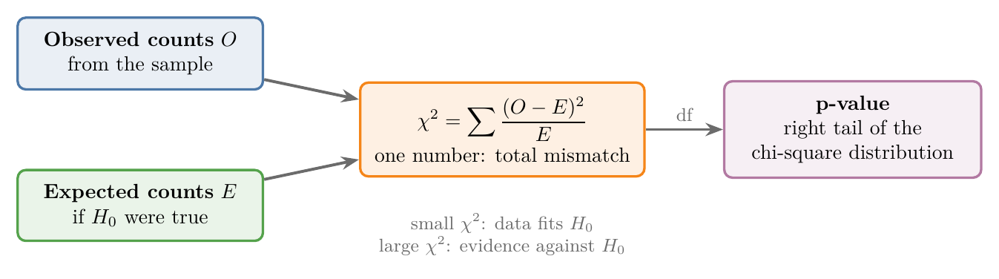
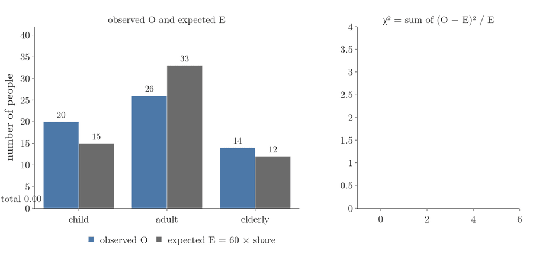
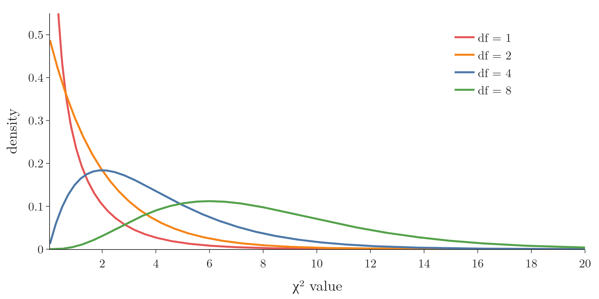
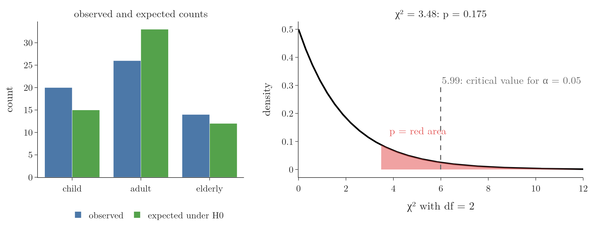
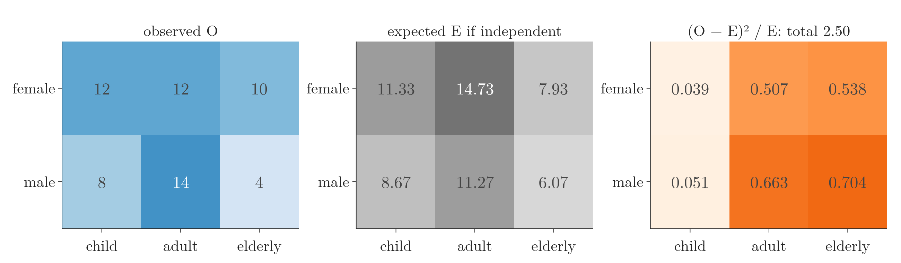
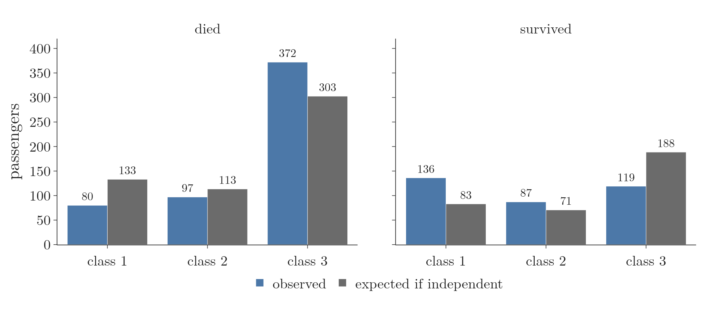
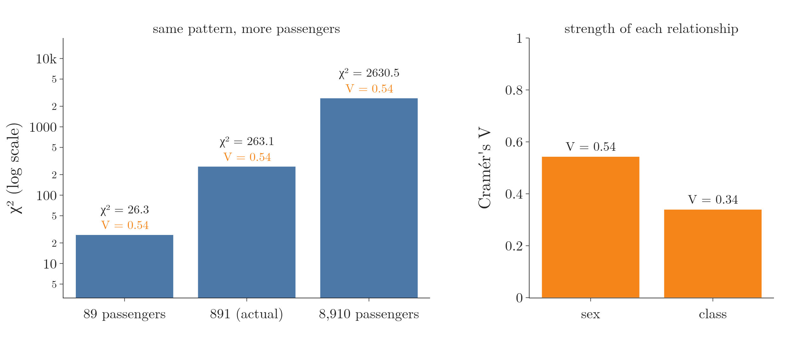

<!-- where-this-fits: generated by course_map/build_map.py; edit concepts.yaml, not this block -->
> **Where this fits:** Pipeline map step 0 (Foundations). See the [Course map](../01-course-map/note.md).
>
> 
>
> - **Builds on:** Hypothesis testing: null and alternative ([Note 291](../291-rejection-region-and-z-test/note.md)); Joint and marginal probability ([Note 341](../341-joint-marginal-conditional-probability/note.md)).
> - **Compare with:** One-sample proportion test ([Note 570](../570-choosing-a-hypothesis-test/note.md)).
<!-- /where-this-fits -->

## 1. Overview

> **Key point:** A chi-square test compares the counts we observe in each category with the counts we would expect if $H_0$ were true; the bigger the total mismatch $\chi^2$, the smaller the p-value.



The chi-square test was named in the [what is statistics Note](../220-what-is-statistics/note.md) as the test for categorical data. In the [choosing a hypothesis test Note](../570-choosing-a-hypothesis-test/note.md) the chi-square test is the test for two categorical **features** (G-772; a feature is a variable of the data, one column of the data table, such as gender). Figure 1 shows how every chi-square test works: observed counts and expected counts go into one number, $\chi^2$, and its tail area under the chi-square distribution is the p-value.

This Note covers:

- the chi-square statistic and the chi-square distribution;
- the **goodness-of-fit test**: does one categorical feature match claimed proportions?
- the **test of independence**: are two categorical features related?
- a case study on the Titanic, the conditions the test needs, and its strength measure, Cramér's V.

> **Extra:** All of this Note is extra material beyond the "which test when" guide; the guide only names the chi-square test.

## 2. The chi-square statistic

> **Key point:** $\chi^2 = \sum (O - E)^2 / E$ adds up, over all cells, the squared gap between observed and expected counts, each scaled by the expected count.

### 2.1 Observed and expected counts

> **Key point:** Observed counts come from the data; expected counts are what $H_0$ predicts for a sample of the same size.

A categorical feature is summarised by counts, one per category (see the [frequency tables Note](../223-frequency-tables-and-graphs/note.md)). For a chi-square test we need two sets of counts:

- **observed counts** $O$ (G-1375): how many **observations** (G-1374; records, one row of the data table each) of the sample fall in each category or cell;
- **expected counts** $E$ (G-723): how many would fall there, on average, if $H_0$ were true.

If $H_0$ is true, $O$ and $E$ differ only by chance. A large mismatch is evidence against $H_0$.

### 2.2 The formula

> **Key point:** Square each gap so that positive and negative gaps both count, divide by $E$ so that a gap of 5 matters more in a small cell than in a big one, and add.

1. **In words:** for each cell, take the gap between observed and expected, square it, divide by expected; add over all cells.
2. **Formula:**
   $$\chi^2 = \sum_{\text{cells}} \frac{(O - E)^2}{E}$$
3. **Example:** three cells with $O = 20, 26, 14$ and $E = 15, 33, 12$ (section 4):
   $$\chi^2 = \frac{(20 - 15)^2}{15} + \frac{(26 - 33)^2}{33} + \frac{(14 - 12)^2}{12} = 1.667 + 1.485 + 0.333 = 3.48$$

$\chi^2$ is 0 only when every observed count equals its expected count. $\chi^2$ can never be negative. This number is the **chi-square statistic** (G-379).

Figure 2 builds it for the example. Each category has its observed and expected bar; the gaps are $+5$, $-7$ and $+2$. Squaring and dividing by $E$ turns each gap into one block, and the blocks stack into $\chi^2 = 3.48$. The adult gap is the largest, but its block is smaller than the child block, because 7 out of an expected 33 is a smaller surprise than 5 out of an expected 15.



## 3. The chi-square distribution

> **Key point:** If $H_0$ is true, $\chi^2$ follows a chi-square distribution: never negative, skewed to the right, with one parameter, the degrees of freedom.

{height=35%}

The **chi-square distribution** (G-378) is a continuous distribution on the positive numbers. Like Student's t-distribution (see the [t-procedure Note](../282-t-procedure/note.md)), it has one parameter, the **degrees of freedom** (G-578; df). Figure 3 shows four of them:

- with 1 or 2 df, the density is highest at 0 and falls steadily;
- with more df, the peak moves right and the curve spreads out;
- the mean of a chi-square distribution equals its df (NIST Handbook §1.3.6.6.6).

Only large $\chi^2$ values count as evidence against $H_0$, so the p-value is always the **right-tail** area beyond our $\chi^2$ (a **right-tailed test**, G-1693). The 5% **critical values** (G-504) are 3.84 for 1 df, 5.99 for 2 df and 7.81 for 3 df.

> **Extra:** Where the distribution comes from: the sum of the squares of $k$ independent standard normal variables follows a chi-square distribution with $k$ df (this is its definition). Each $(O - E)/\sqrt{E}$ is roughly normal for large counts, but the terms are not independent, because the counts must add up to $n$. Pearson (1900) showed that $\chi^2$ still follows a chi-square distribution for large samples, with one df lost to that constraint. The notebook checks this: 200,000 samples of 60 people drawn with the census shares of section 4 true give a mean $\chi^2$ of 2.00, equal to $df = 2$, and 4.9% of them pass the 5% critical value 5.99.

## 4. The goodness-of-fit test

> **Key point:** One categorical feature against claimed proportions: expected count $=$ sample size $\times$ claimed proportion, and the degrees of freedom are the number of categories minus 1.

### 4.1 The question

> **Key point:** Do the age groups in our sample of 60 match a population that is 25% children, 55% adults and 20% elderly?

The **goodness-of-fit test** (G-853) asks whether the counts of one categorical feature fit a claimed distribution. We use the 60 people of the [choosing a hypothesis test Note](../570-choosing-a-hypothesis-test/note.md). Suppose a census says the population is 25% children, 55% adults and 20% elderly.

- $H_0$: the age groups occur in the claimed proportions 0.25, 0.55, 0.20;
- $H_1$: at least one proportion differs.

### 4.2 Expected counts and the statistic

> **Key point:** $E = 60 \times 0.25 = 15$ children, $60 \times 0.55 = 33$ adults, $60 \times 0.20 = 12$ elderly; $\chi^2 = 3.48$.

1. **In words:** the expected count of each category is the sample size times its claimed share.
2. **Formula:**
   $$E_i = n \times \pi_i, \qquad df = k - 1$$
   where $k$ is the number of categories.
3. **Example:**

| | child | adult | elderly | total |
|---|---|---|---|---|
| observed $O$ | 20 | 26 | 14 | 60 |
| claimed share $\pi$ | 0.25 | 0.55 | 0.20 | 1 |
| expected $E = 60\pi$ | 15 | 33 | 12 | 60 |
| $(O - E)^2 / E$ | 1.667 | 1.485 | 0.333 | $\chi^2 = 3.48$ |

The degrees of freedom are $k - 1 = 2$: once two expected counts are known, the third is fixed by the total of 60.

### 4.3 The decision

> **Key point:** $\chi^2 = 3.48$ with 2 df gives $p = 0.175 > 0.05$: we fail to reject $H_0$.



Figure 4 shows both halves of the test. On the left, more children and fewer adults were observed than expected. On the right, $\chi^2 = 3.48$ sits below the critical value 5.99, and the red tail area beyond it is $p = 0.175$.

Since $0.175 > 0.05$, we fail to reject $H_0$: the sample is consistent with the census proportions. The gaps on the left are within what chance produces in 60 people.

> **Python:** `chisquare` takes the observed and expected counts.
>
> ```python
> from scipy import stats
>
> stats.chisquare(f_obs=[20, 26, 14], f_exp=[15, 33, 12])
> # statistic = 3.48, pvalue = 0.175
> ```
>
> Without `f_exp`, scipy assumes equal proportions in all categories.

### 4.4 Two categories: the proportion test again

> **Key point:** With two categories, the goodness-of-fit $\chi^2$ equals $z^2$ of the one-sample proportion test, and the p-values are identical.

For gender (26 men, 34 women) against a 50/50 claim, the expected counts are 30 and 30:

$$\chi^2 = \frac{(26 - 30)^2}{30} + \frac{(34 - 30)^2}{30} = 0.533 + 0.533 = 1.067$$

With 1 df this gives $p = 0.302$. The proportion test in the [choosing a hypothesis test Note](../570-choosing-a-hypothesis-test/note.md) gave $z = -1.033$, and $(-1.033)^2 = 1.067$, with the same $p = 0.302$. The goodness-of-fit test is the proportion test extended to any number of categories.

> **Extra:** Goodness of fit also checks whether counts follow a named distribution, such as Poisson (see the [Poisson distribution Note](../560-poisson-distribution/note.md)). The expected counts then come from the PMF, and every parameter estimated from the data (such as $\lambda$ from the mean) removes one more degree of freedom: $df = k - 1 - (\text{number of estimated parameters})$. The notebook tests this: 5,000 samples of 200 Poisson counts in 5 categories, with $\lambda$ estimated each time, give a mean $\chi^2$ of 3.03, matching $df = 3$ rather than 4. Judged with the df = 4 critical value, only 2.2% of the samples are rejected instead of 5%; with df = 3 the rate is 5.1%.

## 5. The test of independence

> **Key point:** Two categorical features in a contingency table: if they are independent, each expected count is row total $\times$ column total $/$ grand total, and $df = (r - 1)(c - 1)$.

### 5.1 The question and the table

> **Key point:** Is the gender mix the same in every age group, or do gender and age group go together?

The **chi-square test of independence** (G-380) asks whether two categorical features are related. The counts go in a **contingency table** (G-464; see the [contingency tables Note](../340-venn-diagrams-and-contingency-tables/note.md)):

| | child | adult | elderly | row total |
|---|---|---|---|---|
| female | 12 | 12 | 10 | 34 |
| male | 8 | 14 | 4 | 26 |
| column total | 20 | 26 | 14 | 60 |

- $H_0$: gender and age group are independent;
- $H_1$: they are related.

### 5.2 Expected counts under independence

> **Key point:** Independence means $P(A \text{ and } B) = P(A)\thinspace P(B)$; multiplied by $n$, this gives $E = \text{row total} \times \text{column total} / n$.

Two events are independent when the probability of both is the product of their probabilities (see the [independent events Note](../83-independent-events/note.md)). The **marginal probabilities** (G-1165) come from the totals (see the [joint and marginal probability Note](../341-joint-marginal-conditional-probability/note.md)).

1. **In words:** the expected count of a cell is its row total times its column total, divided by the grand total.
2. **Formula:**
   $$E = n \times \frac{\text{row total}}{n} \times \frac{\text{column total}}{n} = \frac{\text{row total} \times \text{column total}}{n}$$
3. **Example:** female children: $P(\text{female}) = 34/60$, $P(\text{child}) = 20/60$, so
   $$E = \frac{34 \times 20}{60} = \frac{680}{60} = 11.33$$

All six expected counts:

| | child | adult | elderly | row total |
|---|---|---|---|---|
| female | 11.33 | 14.73 | 7.93 | 34 |
| male | 8.67 | 11.27 | 6.07 | 26 |
| column total | 20 | 26 | 14 | 60 |

The expected table has the same totals as the observed one; only the inside is spread out "as if independent".

Figure 5 sets the observed and expected tables side by side, with the third table holding each cell's contribution to $\chi^2$, computed in the next section. The darkest contribution cells are the elderly men (4 observed, 6.07 expected) and the adult men (14 observed, 11.27 expected).



### 5.3 The statistic and the decision

> **Key point:** $\chi^2 = 2.50$ with 2 df gives $p = 0.29$: no evidence that gender and age group are related.

The contribution $(O - E)^2/E$ of each cell; for female children the contribution is $(12 - 11.33)^2 / 11.33 = 0.039$:

| | child | adult | elderly |
|---|---|---|---|
| female | 0.039 | 0.507 | 0.538 |
| male | 0.051 | 0.663 | 0.704 |

1. **In words:** add the six contributions; the degrees of freedom are (rows $-$ 1) times (columns $-$ 1).
2. **Formula:**
   $$\chi^2 = \sum \frac{(O - E)^2}{E}, \qquad df = (r - 1)(c - 1)$$
3. **Example:**
   $$\chi^2 = 0.039 + 0.507 + 0.538 + 0.051 + 0.663 + 0.704 = 2.50, \qquad df = (2 - 1)(3 - 1) = 2$$

With 2 df, $p = P(\chi^2 \ge 2.50) = 0.29$. Since $0.29 > 0.05$, we fail to reject $H_0$. The elderly group has relatively few men (4 observed, 6.07 expected), but in a sample of 60 a gap like this is common by chance.

Why $(r - 1)(c - 1)$: with the row and column totals fixed, filling $(r - 1)(c - 1)$ cells freely determines all the others. In a 2 by 3 table, choosing 2 cells of the female row fixes the rest.

> **Python:** `chi2_contingency` takes the observed table and returns the statistic, p-value, df and expected counts.
>
> ```python
> import pandas as pd
>
> table = pd.crosstab(people["gender"], people["age_group"])
> result = stats.chi2_contingency(table)
> result.statistic, result.pvalue, result.dof    # 2.50, 0.29, 2
> result.expected_freq                           # the expected table
> ```

## 6. Case study: survival on the Titanic

> **Key point:** Sex and class were both strongly related to survival: $\chi^2 = 263$ ($p \approx 10^{-59}$) for sex, $\chi^2 = 103$ ($p \approx 10^{-23}$) for class.

### 6.1 Sex and survival

> **Key point:** 81 women died where independence predicts 194; 109 men survived where it predicts 222.

The Kaggle Titanic training file has 891 passengers. Survival against sex:

| | died | survived |
|---|---|---|
| female, observed | 81 | 233 |
| female, expected | 193.5 | 120.5 |
| male, observed | 468 | 109 |
| male, expected | 355.5 | 221.5 |

The four contributions are 65.4, 105.0, 35.6 and 57.1, so $\chi^2 = 263.1$ with $df = 1$ and $p = 3.7 \times 10^{-59}$. We reject $H_0$: survival depended on sex.

> **Extra:** For a 2 by 2 table, `chi2_contingency` applies **Yates' continuity correction** (G-2135) by default: it shrinks each $|O - E|$ by 0.5 before squaring (Yates 1934), which lowers $\chi^2$ and so makes the test slightly more cautious. Here it gives $\chi^2 = 260.7$ instead of 263.1; pass `correction=False` to get the plain statistic. With counts this large the choice does not matter.

### 6.2 Class and survival

> **Key point:** First class had 136 survivors where independence predicts 83; third class had 119 where it predicts 188.



The crosstab of class against survival was drawn as a heatmap in the [bivariate analysis Note](../21-bivariate-multivariate-analysis/note.md). Figure 6 compares its observed counts with the expected ones. First class has far more survivors than independence predicts, third class far fewer. The survival rates were 63%, 47% and 24% for the three classes, against 38% overall.

The test gives $\chi^2 = 102.9$ with $df = (3 - 1)(2 - 1) = 2$ and $p = 4.5 \times 10^{-23}$. We reject $H_0$: survival depended on class.

## 7. Conditions and limits

> **Key point:** Use raw counts, independent observations, and expected counts of at least 5 in every cell; a significant $\chi^2$ says that a relationship exists, not how strong it is.

### 7.1 Conditions

> **Key point:** Counts, independence, and large enough expected counts.

1. **Counts, not percentages.** The formula needs the number of observations in each cell. Percentages or means give a wrong $\chi^2$.
2. **Independent observations.** Each observation is counted in exactly one cell, and observations do not influence each other. The same person measured twice breaks this.
3. **Large enough expected counts.** The usual rule is that every expected count should be at least 5 (Cochran 1954), because the chi-square distribution is only a large-sample approximation. All six expected counts of section 5.2 are above 5 (the smallest is 6.07). For small 2 by 2 tables, **Fisher's exact test** (G-782) (`stats.fisher_exact`) avoids the approximation; for bigger tables, merging rare categories helps.

> **Extra:** What goes wrong below the rule. A ruler marked in metres is fine for a room but useless for a grain of rice; the chi-square curve is likewise only a good ruler for large counts. The notebook draws 200,000 samples with $H_0$ true, so a correct 5% test should reject 5% of them:
>
> | Claimed shares | $n$ | Smallest $E$ | Rejected at 5% |
> |---|---|---|---|
> | 0.25, 0.55, 0.20 | 60 | 12 | 4.9% |
> | 0.90, 0.05, 0.05 | 8 | 0.4 | 11.2% |
> | 0.90, 0.05, 0.05 | 10 | 0.5 | 2.7% |
>
> With large expected counts the test keeps its 5% promise. With two rare categories and tiny samples, the false-alarm rate drifts away from 5%, more than double in one case and about half in the other, so the p-value can no longer be trusted.

Figure 7 shows why. With large expected counts the simulated $\chi^2$ values spread smoothly along the chi-square curve. With expected counts below 1, only a few count patterns are possible, so $\chi^2$ can take only a few values: it piles up on a handful of spikes that the smooth curve cannot describe, and the share beyond the 5% line (dashed) is wrong.


### 7.2 Strength of a relationship: Cramér's V

> **Key point:** **Cramér's V** (G-500) rescales $\chi^2$ to a number between 0 (no relationship) and 1 (perfect relationship) (Cramér 1946).

$\chi^2$ grows with the sample size: the same pattern in 10 times as many observations gives a 10 times larger $\chi^2$. To measure strength, we divide the size out.

1. **In words:** divide $\chi^2$ by the sample size and by one less than the smaller table dimension, then take the square root.
2. **Formula:**
   $$V = \sqrt{\frac{\chi^2}{n \times (\min(r, c) - 1)}}$$
3. **Example:** Titanic sex and survival, $\chi^2 = 263.1$, $n = 891$, a 2 by 2 table:
   $$V = \sqrt{\frac{263.1}{891 \times 1}} = \sqrt{0.295} = 0.54$$

For class and survival, $V = \sqrt{102.9 / 891} = 0.34$. Both relationships are significant, but sex was the stronger predictor of survival. In scipy: `stats.contingency.association(table, method="cramer")`.

Figure 8 shows why the rescaling is needed. The Titanic sex-by-survival table is shrunk to a tenth and grown to ten times its size, keeping the same pattern. $\chi^2$ grows with the number of passengers, from 26.3 to 263.1 to 2,630.5, but $V$ stays at 0.54 every time.



### 7.3 Chi-square in machine learning

> **Key point:** Feature selection with `SelectKBest(chi2)` ranks categorical features by how strongly they are related to the target.

**Feature selection** (G-768) with **`SelectKBest`** (G-1762) `(score_func=chi2)` (see the [pipelines Note](../29-pipelines/note.md)) scores each feature against the **target** (G-1949; the output we predict) with a chi-square statistic: a feature whose counts differ strongly between the classes gets a high score. scikit-learn's version treats each feature's values as counts, which is why it needs values of 0 or more (scikit-learn docs, `chi2`). The score is not the same number as the test of independence. For a one-hot column it compares only the rows where the column is 1. In the notebook, Titanic sex one-hot encoded gets the scores 170.3 (female) and 92.7 (male); only their sum, 263.1, equals the $\chi^2$ of section 6.1.

## 8. Summary

| | Goodness of fit | Test of independence |
|---|---|---|
| Features | one categorical | two categorical |
| $H_0$ | the categories have the claimed proportions | the two features are independent |
| Expected count | $n \times \pi_i$ | row total $\times$ column total $/ n$ |
| Degrees of freedom | $k - 1$ | $(r - 1)(c - 1)$ |
| scipy | `chisquare` | `chi2_contingency` |
| Example here | age groups vs census: $\chi^2 = 3.48$, $p = 0.175$ | gender vs age group: $\chi^2 = 2.50$, $p = 0.29$ |

- Under $H_0$, $\chi^2 = \sum (O - E)^2/E$ follows a chi-square distribution; the p-value is the right-tail area.
- With two categories, goodness of fit is the one-sample proportion test: $\chi^2 = z^2$.
- The test needs raw counts, independent observations and expected counts of at least 5.

## 9. Sources

**Built from**

- Krish Naik, "Tutorial 32- All About P Value,T test,Chi Square Test, Anova Test and When to Use What?", YouTube, https://www.youtube.com/watch?v=YrhlQB3mQFI

**Other references**

- Cochran, W. G. (1954). "Some Methods for Strengthening the Common $\chi^2$ Tests". *Biometrics* 10(4).
- Cramér, H. (1946). *Mathematical Methods of Statistics*. Princeton University Press.
- NIST/SEMATECH (2012). *e-Handbook of Statistical Methods*. itl.nist.gov/div898/handbook. Section 1.3.6.6.6, chi-square distribution.
- Pearson, K. (1900). "On the criterion that a given system of deviations from the probable in the case of a correlated system of variables is such that it can be reasonably supposed to have arisen from random sampling". *Philosophical Magazine* 50(302).
- scikit-learn documentation. `sklearn.feature_selection.chi2`.
- Yates, F. (1934). "Contingency Tables Involving Small Numbers and the $\chi^2$ Test". *Supplement to the Journal of the Royal Statistical Society* 1(2).

## 10. Key terms

| Term | Meaning |
|---|---|
| Observed count $O$ | The number of observations in a category or table cell |
| Expected count $E$ | The number of observations a category or cell would hold on average if $H_0$ were true |
| Chi-square statistic $\chi^2$ | $\sum (O - E)^2 / E$: the total mismatch between observed and expected counts |
| Chi-square distribution | The distribution of $\chi^2$ under $H_0$: positive, right-skewed, with one parameter, the degrees of freedom |
| Goodness-of-fit test | A chi-square test of whether one categorical feature follows claimed proportions; $df = k - 1$ |
| Chi-square test of independence | A chi-square test of whether two categorical features are related; $df = (r - 1)(c - 1)$ |
| Yates' continuity correction | A small adjustment to $\chi^2$ for 2 by 2 tables, applied by default in `chi2_contingency` |
| Fisher's exact test | An exact test for small 2 by 2 tables, used when expected counts fall below 5 |
