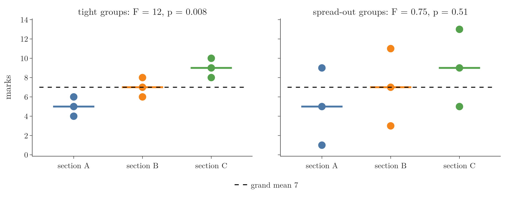
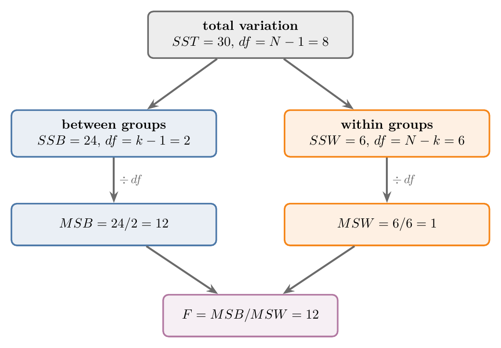
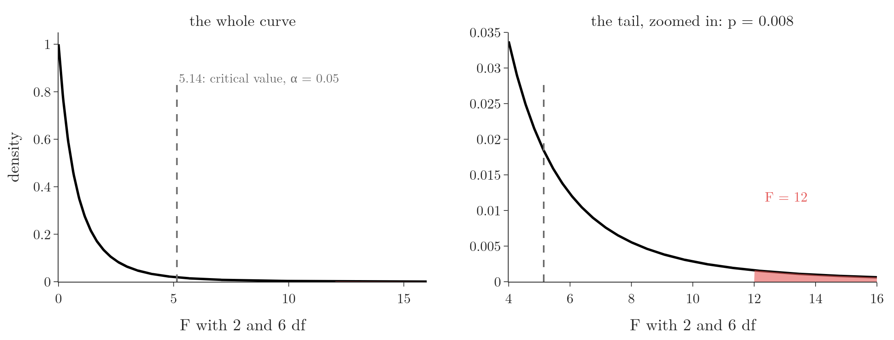
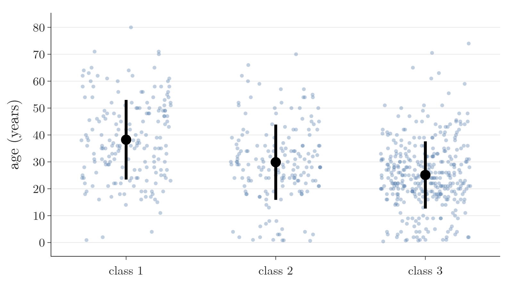

<!-- where-this-fits: generated by course_map/build_map.py; edit concepts.yaml, not this block -->
> **Where this fits:** Pipeline map step 0 (Foundations). See the [Course map](../01-course-map/note.md).
>
> 
>
> - **Builds on:** Variance ([Note 222](../222-measures-of-dispersion/note.md)); Hypothesis testing: null and alternative ([Note 291](../291-rejection-region-and-z-test/note.md)).
> - **Compare with:** T-tests: one-sample, two-sample, paired ([Note 570](../570-choosing-a-hypothesis-test/note.md)).
<!-- /where-this-fits -->

## 1. Overview

> **Key point:** One-way ANOVA tests whether three or more group means are equal by comparing two variances: how far the group means lie from each other, and how far the values lie from their own group mean.



ANOVA (**analysis of variance**) was named in the [what is statistics Note](../220-what-is-statistics/note.md) as the test that compares the means of several groups. In the [choosing a hypothesis test Note](../570-choosing-a-hypothesis-test/note.md) ANOVA is the test for one numerical **feature** against a categorical feature with three or more categories (a feature is a variable of the data, one column of the data table, such as age or class).

Figure 1 shows the whole idea. Both panels have the same group means, 5, 7 and 9. On the left the values sit close to their group mean, so the gaps between the means stand out. On the right the values are spread widely, and the same gaps could easily be chance. ANOVA turns this comparison into one number, the F statistic.

This Note covers:

- why we do not run a t-test for every pair of groups;
- the split of the total variation into between-group and within-group parts;
- the F statistic, the F distribution and a worked example;
- the assumptions, a Titanic case study, and the follow-up question "which groups differ?".

> **Extra:** All of this Note is extra material beyond the "which test when" guide; the guide only names ANOVA.

## 2. Why not several t-tests?

> **Key point:** Each t-test at $\alpha = 0.05$ has a 5% false-alarm risk; three of them together have about a 14% risk, ten of them about 40%.

A two-sample t-test compares two group means (see the [two-sample and paired t-tests Note](../302-two-sample-and-paired-t-tests/note.md)). With three groups A, B and C, we could run three t-tests: A against B, A against C, B against C.

The trouble is the Type I error (see the [errors, power and tails Note](../292-errors-power-and-tails/note.md)). Each test, run at $\alpha = 0.05$, wrongly rejects a true $H_0$ 5% of the time. Over several tests these risks add up.

1. **In words:** the chance of at least one false alarm is one minus the chance that every test stays quiet.
2. **Formula:** for $m$ independent tests,
   $$P(\text{at least one Type I error}) = 1 - (1 - \alpha)^{m}$$
3. **Example:** three groups need $m = 3$ tests:
   $$1 - 0.95^{3} = 1 - 0.857 = 0.143$$
   Five groups need $m = 10$ tests: $1 - 0.95^{10} = 0.40$.

So with five groups whose true means are all equal, pairwise t-tests "find" a difference far more often than 5% of the time. ANOVA asks one question about all groups at once, and its false-alarm rate stays at 5%.

> **Extra:** The formula assumes the tests are independent. Pairwise t-tests are not, since each group appears in several of them, so the real risk is a little lower. The notebook measures the real risk on 2,000 simulated datasets (20 values per group, all true means equal):
>
> | Groups | t-tests | At least one false alarm (simulated) | Formula | ANOVA false alarm (simulated) |
> |---|---|---|---|---|
> | 3 | 3 | 11.0% | 14.3% | 5.0% |
> | 5 | 10 | 29.0% | 40.1% | 5.0% |

## 3. The hypotheses

> **Key point:** $H_0$: all group means are equal; $H_1$: at least one group mean differs from the others.

With $k$ groups:

$$H_0: \mu_1 = \mu_2 = \dots = \mu_k, \qquad H_1: \text{at least one } \mu_i \text{ differs}$$

$H_1$ is not "all means differ". Rejecting $H_0$ tells us that some difference exists, not which groups differ; section 8 answers that.

"One-way" means one categorical feature defines the groups. The worked example uses $k = 3$ sections of a class, with the marks (out of 10) of 3 students each:

| Section A | Section B | Section C |
|---|---|---|
| 4, 5, 6 | 6, 7, 8 | 8, 9, 10 |
| mean 5 | mean 7 | mean 9 |

The **grand mean**, the mean of all $N = 9$ values, is 7. These are the left-hand groups of Figure 1.

## 4. Splitting the variation

> **Key point:** Total variation $=$ variation between the group means $+$ variation within the groups: $SST = SSB + SSW$.

{height=38%}

Variance is built from squared distances from a mean (see the [measures of dispersion Note](../222-measures-of-dispersion/note.md)). ANOVA works with the **sums of squares** before dividing, and splits them in two, as Figure 2 shows.

### 4.1 Total sum of squares

> **Key point:** $SST$ measures how far all values lie from the grand mean.

1. **In words:** square each value's distance from the grand mean and add over all values.
2. **Formula:**
   $$SST = \sum_{\text{all values}} (x - \bar{x})^2$$
   where $\bar{x}$ is the grand mean.
3. **Example:** distances from 7 are $-3, -2, -1$; $-1, 0, 1$; $1, 2, 3$:
   $$SST = 9 + 4 + 1 + 1 + 0 + 1 + 1 + 4 + 9 = 30$$

### 4.2 Between-group sum of squares

> **Key point:** $SSB$ measures how far the group means lie from the grand mean, each counted once per value in its group.

1. **In words:** square each group mean's distance from the grand mean, multiply by the group size, and add over groups.
2. **Formula:**
   $$SSB = \sum_{\text{groups}} n_i (\bar{x}_i - \bar{x})^2$$
3. **Example:**
   $$SSB = 3(5 - 7)^2 + 3(7 - 7)^2 + 3(9 - 7)^2 = 12 + 0 + 12 = 24$$

### 4.3 Within-group sum of squares

> **Key point:** $SSW$ measures how far the values lie from their own group mean: the noise inside the groups.

1. **In words:** square each value's distance from its own group mean and add over all values.
2. **Formula:**
   $$SSW = \sum_{\text{groups}} \ \sum_{\text{values in group}} (x - \bar{x}_i)^2$$
3. **Example:** each group gives $1 + 0 + 1 = 2$, so
   $$SSW = 2 + 2 + 2 = 6$$

The check: $SSB + SSW = 24 + 6 = 30 = SST$. Most of the variation here lies between the groups.

## 5. The F statistic

> **Key point:** $F = MSB / MSW$: the between-group variance divided by the within-group variance; a large $F$ means the group means differ by more than the noise explains.

### 5.1 Mean squares

> **Key point:** Dividing each sum of squares by its degrees of freedom turns it into a variance, a **mean square**.

The degrees of freedom are:

- between groups: $k - 1$ (here $3 - 1 = 2$), since $k$ group means vary around one grand mean;
- within groups: $N - k$ (here $9 - 3 = 6$), since each group loses one degree of freedom to its own mean, as in Bessel's correction (see the [measures of dispersion Note](../222-measures-of-dispersion/note.md)).

The two add to $N - 1 = 8$, the degrees of freedom of $SST$.

### 5.2 F

1. **In words:** divide each sum of squares by its degrees of freedom, then divide the between-group mean square by the within-group one.
2. **Formula:**
   $$MSB = \frac{SSB}{k - 1}, \qquad MSW = \frac{SSW}{N - k}, \qquad F = \frac{MSB}{MSW}$$
3. **Example:**
   $$MSB = \frac{24}{2} = 12, \qquad MSW = \frac{6}{6} = 1, \qquad F = \frac{12}{1} = 12$$

If $H_0$ is true, both mean squares estimate the same noise variance, and $F$ is close to 1 (Montgomery §3.3). Here the between-group variance is 12 times the within-group variance.

For the right-hand groups of Figure 1 (1, 5, 9; 3, 7, 11; 5, 9, 13) the means and so $SSB = 24$ are the same, but $SSW = 96$. Then $MSW = 96/6 = 16$ and $F = 12/16 = 0.75$: no evidence of a difference.

> **Extra:** The results are usually set out as an **ANOVA table**:
>
> | Source | SS | df | MS | F | p |
> |---|---|---|---|---|---|
> | between groups | 24 | 2 | 12 | 12 | 0.008 |
> | within groups | 6 | 6 | 1 | | |
> | total | 30 | 8 | | | |

## 6. The F distribution and the decision

> **Key point:** Under $H_0$, $F$ follows an F distribution with $k - 1$ and $N - k$ degrees of freedom; the p-value is its right-tail area beyond our $F$.



The **F distribution** is the distribution of a ratio of two independent variances (NIST Handbook §1.3.6.6.5). Like the chi-square distribution (see the [chi-square tests Note](../571-chi-square-tests/note.md)), it is never negative and is skewed to the right. The F distribution has two parameters: the degrees of freedom of the top and of the bottom variance.

Only a large $F$ counts against $H_0$ (group means further apart than noise explains), so the test is always right-tailed. Figure 3 shows the F distribution with 2 and 6 degrees of freedom:

- the 5% critical value is 5.14;
- our $F = 12$ lies far beyond it;
- the tail area beyond 12 is $p = 0.008$.

Since $0.008 \le 0.05$, we reject $H_0$: the three sections do not all have the same mean mark.

> **Python:** `f_oneway` takes one array per group.
>
> ```python
> from scipy import stats
>
> stats.f_oneway([4, 5, 6], [6, 7, 8], [8, 9, 10])
> # statistic = 12.0, pvalue = 0.008
> stats.f.ppf(0.95, 2, 6)     # 5.14, the critical value
> ```

> **Extra:** With exactly two groups, ANOVA and the equal-variance two-sample t-test are the same test: $F = t^2$ and the p-values match. For sections A and B alone, $t^2 = 6$ and $F = 6$.

## 7. Assumptions

> **Key point:** Independent observations, roughly normal values in each group, and equal variances across groups.

ANOVA makes the same assumptions as the two-sample t-test (see the [two-sample and paired t-tests Note](../302-two-sample-and-paired-t-tests/note.md)), for every group:

1. **Independence.** The groups are separate (no one is in two groups), and the observations do not influence each other.
2. **Normality.** The values in each group are roughly normal. With large groups, the central limit theorem makes the group means close to normal anyway (see the [sampling distribution Note](../271-sampling-distribution-and-clt/note.md), which gives $n \ge 30$ as the usual guide), so this matters less. Check with a Q-Q plot or the Shapiro-Wilk test (see the [one-sample t-test Note](../301-one-sample-t-test/note.md)).
3. **Equal variances.** The groups have about the same variance; Levene's test checks this, with $H_0$: "the variances are equal".

When the assumptions fail:

- unequal variances: **Welch's ANOVA** (Welch 1951), or scipy's `stats.alexandergovern`, drops the equal-variance assumption;
- strongly non-normal small groups: the **Kruskal-Wallis test** (`stats.kruskal`; Kruskal and Wallis 1952) compares the groups by ranks instead of means.

## 8. Case study: age by class on the Titanic

> **Key point:** Mean ages of 38.2, 29.9 and 25.1 years in the three classes give $F = 57.4$ and $p \approx 10^{-23}$; Tukey's test shows that every pair of classes differs.

### 8.1 The test

> **Key point:** Did the mean age of passengers differ between first, second and third class?

The Kaggle Titanic training file has 714 passengers with a known age.

{height=36%}

| Class | Passengers | Mean age | Standard deviation |
|---|---|---|---|
| 1 | 186 | 38.2 | 14.8 |
| 2 | 173 | 29.9 | 14.0 |
| 3 | 355 | 25.1 | 12.5 |

Figure 4 shows a clear downward step in the means, with much overlap between the classes.

1. **Hypotheses.** $H_0: \mu_1 = \mu_2 = \mu_3$; $H_1$: at least one class mean differs.
2. **Significance level.** $\alpha = 0.05$.
3. **Statistic.** $SSB = 20{,}930$ with 2 df, $SSW = 129{,}527$ with $714 - 3 = 711$ df:
   $$MSB = \frac{20{,}930}{2} = 10{,}465, \qquad MSW = \frac{129{,}527}{711} = 182.2, \qquad F = \frac{10{,}465}{182.2} = 57.4$$
4. **P-value.** $p = 7.5 \times 10^{-24}$, far below 0.05; the 5% critical value is only 3.01.
5. **Decide.** Reject $H_0$: mean age differed between the classes.

### 8.2 Checking the assumptions

> **Key point:** Levene's test rejects equal variances ($p = 0.004$), but the tests that drop that assumption agree: the classes differ.

- **Normality:** Shapiro-Wilk rejects normality for classes 2 and 3. With 173 and 355 passengers, the central limit theorem protects the means.
- **Equal variances:** Levene gives $p = 0.004$: the variances (standard deviations 14.8, 14.0, 12.5) differ.

Both checks raise doubts, so we confirm with the tests of section 7. Alexander-Govern gives $p = 4 \times 10^{-21}$ and Kruskal-Wallis gives $p = 1 \times 10^{-21}$. The conclusion stands.

### 8.3 Which classes differ? Tukey's test

> **Key point:** A post-hoc test compares every pair of groups after ANOVA rejects, while keeping the overall false-alarm risk at 5%.

ANOVA said that at least one mean differs. A **post-hoc test** finds which. The usual choice is **Tukey's HSD** (honestly significant difference), which compares every pair with the overall Type I error held at $\alpha$ (Tukey 1949):

| Pair | Difference in mean age | p-value |
|---|---|---|
| class 1 $-$ class 2 | 8.4 years | $2 \times 10^{-8}$ |
| class 1 $-$ class 3 | 13.1 years | below $10^{-9}$ |
| class 2 $-$ class 3 | 4.7 years | 0.0005 |

All three pairs differ: first-class passengers were the oldest, third-class the youngest.

> **Python:** ANOVA, the assumption checks and Tukey's test on the Titanic ages.
>
> ```python
> ages = [titanic.loc[titanic["Pclass"] == c, "Age"].dropna()
>         for c in (1, 2, 3)]
> stats.f_oneway(*ages)          # F = 57.4, p = 7.5e-24
> stats.levene(*ages)            # p = 0.004
> stats.alexandergovern(*ages)   # p = 4.4e-21
> stats.tukey_hsd(*ages)         # every pair
> ```

## 9. ANOVA in machine learning

> **Key point:** `f_classif` scores each numerical feature by its ANOVA F against the class labels, for feature selection.

`SelectKBest` can score features (the input variables of a model) with `f_classif` instead of `chi2` (see the [pipelines Note](../29-pipelines/note.md) and the [errors, power and tails Note](../292-errors-power-and-tails/note.md)). For each numerical feature, `f_classif` computes the one-way ANOVA F with the classes of the **target** (the output we predict) as groups (scikit-learn docs, `f_classif`). A feature whose mean differs strongly between the classes gets a large F, and is kept.

## 10. Summary

| | Several t-tests | One-way ANOVA |
|---|---|---|
| Question | is this pair different? | do any of the $k$ means differ? |
| Type I risk, 3 groups | about 14% | 5% |
| Statistic | $t$ per pair | $F = MSB / MSW$ |
| Distribution | t with $n_1 + n_2 - 2$ df | F with $k - 1$ and $N - k$ df |
| Follow-up | none needed | Tukey's HSD to find which pairs differ |

- $SST = SSB + SSW$: total variation splits into variation between and within groups.
- $F$ compares the between-group variance with the within-group variance; near 1 under $H_0$, large when the means differ.
- The test is right-tailed; reject $H_0$ when $p \le \alpha$.
- Assumptions: independence, normality in each group, equal variances; Welch's ANOVA or Kruskal-Wallis when they fail.
- Rejecting $H_0$ says some mean differs; Tukey's HSD says which.

## 11. Sources

- Kruskal, W. H. and Wallis, W. A. (1952). "Use of Ranks in One-Criterion Variance Analysis". *Journal of the American Statistical Association* 47(260).
- Montgomery, D. C. (2013). *Design and Analysis of Experiments*, 8th ed. Wiley. Section 3.3, analysis of the fixed effects model.
- NIST/SEMATECH (2012). *e-Handbook of Statistical Methods*. itl.nist.gov/div898/handbook. Section 1.3.6.6.5, F distribution.
- scikit-learn documentation. `sklearn.feature_selection.f_classif`.
- Tukey, J. W. (1949). "Comparing Individual Means in the Analysis of Variance". *Biometrics* 5(2).
- Welch, B. L. (1951). "On the Comparison of Several Mean Values: An Alternative Approach". *Biometrika* 38(3/4).

## 12. Key terms

| Term | Meaning |
|---|---|
| One-way ANOVA | A test of whether three or more group means are equal, with the groups defined by one categorical feature |
| Grand mean | The mean of all values from all groups together |
| Sum of squares (SST, SSB, SSW) | Total, between-group and within-group squared distances; $SST = SSB + SSW$ |
| Mean square (MSB, MSW) | A sum of squares divided by its degrees of freedom: a variance |
| F statistic | $MSB / MSW$: between-group variance over within-group variance |
| F distribution | The distribution of a ratio of two variances; two degrees-of-freedom parameters, right-skewed |
| ANOVA table | The table of SS, df, MS, F and p for each source of variation |
| Familywise error rate | The probability of at least one Type I error over several tests; $1 - (1 - \alpha)^m$ for $m$ independent tests |
| Post-hoc test | A test run after ANOVA rejects, to find which groups differ |
| Tukey's HSD | A post-hoc test comparing every pair of groups with the overall Type I error held at $\alpha$ |
| Welch's ANOVA | A version of ANOVA that does not assume equal variances |
| Kruskal-Wallis test | A rank-based alternative to one-way ANOVA that does not assume normality |
