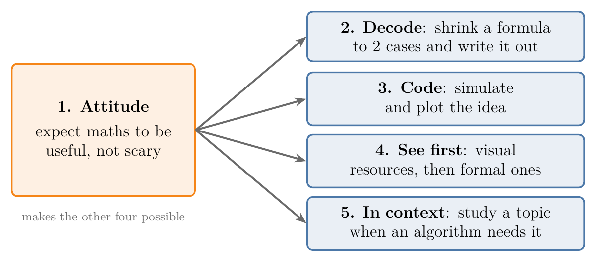

<!-- where-this-fits: generated by course_map/build_map.py; edit concepts.yaml, not this block -->
> **Where this fits:** Pipeline map step 0 (Foundations). See the [Course map](../01-course-map/note.md).
>
> 
>
> - **Builds on:** Role of mathematics in ML ([Note 440](../440-role-of-maths-in-ml/note.md)).
<!-- /where-this-fits -->

## 1. Overview

> **Key point:** The fear of mathematics fades with five habits: expect maths to be useful, decode notation on small cases, check ideas with code, learn visually first, and study each topic in the context where ML needs it.

Many learners want to work in ML but stop at the first equation. The maths ML needs is smaller and easier than it looks, and the right way of studying it matters more than talent.

{height=40%}

Figure 1 shows the five habits. The first one, the attitude, comes first because the others only work once we are willing to spend time with the maths.

Two earlier Notes already cover parts of this topic. The [role of mathematics in ML Note](../440-role-of-maths-in-ml/note.md) explains the job of each branch of maths in ML. The [statistics roadmap Note](../210-statistics-roadmap/note.md) and the [linear algebra roadmap Note](../350-linear-algebra-roadmap/note.md) list the topics of those two branches. This Note adds how to study them, and the calculus part of the map.

## 2. Habit 1: change the attitude

> **Key point:** Instead of quitting at the first equation, we expect it to explain the algorithm; two facts make this realistic: in ML we always know why a piece of maths is there, and only a small, easy part of maths is needed.

The usual pattern is: open an algorithm, meet an equation, decide it is too hard, and stop. The habit to build is the opposite reaction: an equation is where the algorithm is actually explained.

A practical trick is to picture a future version of ourselves who reads equations comfortably. Aiming at that picture makes it easier to stay with a formula for ten minutes instead of five, and to work through it with pen and paper. After a month or so of this, the maths of ML turns out to be far less hard than its reputation.

### 2.1 Reason 1: we always know why

> **Key point:** School maths feels dry because we rarely know what it is for; in ML every piece of maths has a visible purpose.

At school we solve hundreds of derivatives and integrals for the exam, without knowing where they are used. Maths without a purpose is boring, and boring maths feels hard.

In ML the purpose is always visible:

- **Derivatives** are there to minimise a loss function, which is how a spam filter learns to separate spam from normal mail (see the [gradient descent Note](../57-gradient-descent/note.md)).
- **Matrices** are there to transform data; a photo filter, for example, is a manipulation of the matrix of pixel values (see the [linear transformations and matrices Note](../500-linear-transformations-and-matrices/note.md)).

Because we know why each formula is there, it stays interesting, and interesting maths is easier to learn.

### 2.2 Reason 2: only a small subset is needed

> **Key point:** ML uses four topics: statistics, probability, linear algebra (mostly matrices) and a small part of calculus (differentiation, for optimisation).

We do not need all of mathematics. ML uses four topics, and only part of each:

| Topic | How much | Where the map of it is |
|---|---|---|
| Statistics | know it well | [statistics roadmap Note](../210-statistics-roadmap/note.md) |
| Probability | a fair idea | [events Note](../330-events-and-types-of-events/note.md) onward |
| Linear algebra | know it well, mostly matrices | [linear algebra roadmap Note](../350-linear-algebra-roadmap/note.md) |
| Calculus | a small part: differential calculus for optimisation | Section 6 of this Note |

Compared with a field such as theoretical physics, this maths is both smaller in scope and less abstract. Less to learn, easier to learn, and always with a reason: together these make the maths enjoyable, and enjoyment removes the fear.

## 3. Habit 2: decode the notation

> **Key point:** When a formula full of indices looks frightening, we shrink it to two or three cases and write every case out by hand.

The second source of fear is notation: Greek letters, indices and sums packed into one line. The notation will not go away, because it is the language of maths. What we can learn is to unpack it.

The method:

1. Read the sentence around the formula ("for each point $x_i$ and each component $k$").
2. Replace every index range by a tiny one: two points, two components.
3. Write out every case the formula stands for, with the indices filled in.

Figure 2 applies it to a formula from an algorithm we have not met yet, Gaussian mixture models. We do not need to know the algorithm; the point is the unpacking.

{height=40%}

- "For each point and each component" means one value $\gamma_k(x_i)$ per pair: four values for two points and two components.
- The sum $\sum_{j=1}^{K}$ in the denominator becomes two terms, because $K = 2$.
- Written out, each row has the same denominator, so the two values of a row add up to 1: the formula splits each point between the components.

Worked with numbers: take $\pi_1 = 0.6$, $\pi_2 = 0.4$, $p(x_1 \mid 1) = 0.5$ and $p(x_1 \mid 2) = 0.2$. Then

$$\gamma_1(x_1) = \frac{0.6 \times 0.5}{0.6 \times 0.5 + 0.4 \times 0.2} = \frac{0.30}{0.38} = 0.79, \qquad \gamma_2(x_1) = \frac{0.08}{0.38} = 0.21$$

and $0.79 + 0.21 = 1$, as the written-out form predicted. A line of compact notation became four plain fractions.

> **Python:** a loop is the same unpacking, done by the computer. Each line below is one box of Figure 2.
>
> ```python
> import numpy as np
>
> pi = np.array([0.6, 0.4])        # weight of each component
> p = np.array([0.5, 0.2])         # p(x1 | k) for k = 1, 2
> gamma = pi * p / (pi * p).sum()  # both gamma_k(x1) at once
> print(gamma.round(2))            # [0.79 0.21]
> ```

## 4. Habit 3: use code to see the maths

> **Key point:** A small simulation or interactive plot turns an abstract idea into something we can change and watch.

Once we can program a little, every concept can be checked by building a small tool around it: change an input, watch the output. Ideas that are hard to picture become concrete. Examples where this helps most:

- **Confidence intervals:** simulate many samples and count how often the interval contains the true mean (see the [interpreting confidence intervals Note](../281-interpreting-confidence-intervals/note.md)).
- **Matrices as transformations:** type in a matrix and watch the grid move (see the [linear transformations and matrices Note](../500-linear-transformations-and-matrices/note.md)).
- **The t distribution:** plot it next to the normal curve and raise the degrees of freedom until the two match (see the [t procedure Note](../282-t-procedure/note.md)).
- **Dividing by $n - 1$ in the sample variance:** simulate many samples and compare the averages of both versions (see the [measures of dispersion Note](../222-measures-of-dispersion/note.md)).

We do not need to be strong programmers for this. Many such tools are shared on GitHub, and an AI assistant can write one from a prompt such as "write a Streamlit app that plots the normal and t distributions side by side, with a slider for the degrees of freedom". We run it, then fix and extend it step by step.

## 5. Habit 4: learn visually first

> **Key point:** First get the picture from a visual resource, then read the formal treatment in lectures or books.

University lectures and textbooks are accurate, but most of them write equations and solve them, with few pictures. Starting with a visual explanation (diagrams, animation) and only then turning to the formal version makes both easier.

Three visual resources cover most of what ML needs:

- **Khan Academy.** The school mathematics chapters ML uses: statistics, probability, limits and derivatives, and vector algebra.
- **3Blue1Brown** (Sanderson, G., 3blue1brown.com). Two animated series: *Essence of Linear Algebra* (worth studying several times before deep learning) and *Essence of Calculus*.
- **StatQuest** (Starmer, J., statquest.org). A statistics series of about 60 lessons, picture first and definitions after.

After the picture, the formal sources: university lectures (for example NPTEL or Stanford) and books. The roadmap Notes list books for [statistics](../210-statistics-roadmap/note.md) and [linear algebra](../350-linear-algebra-roadmap/note.md).

## 6. Habit 5: learn in context

> **Key point:** We do not study a whole subject before starting ML; we study each topic knowing where ML uses it, and leave the rest until an algorithm needs it.

Even within four topics, a common mistake is to try to learn everything in each: all of statistics, then all of linear algebra. That takes months and loses the "why" of Habit 1.

A roadmap fixes this. For each topic it lists the parts ML uses and where each part is used, so we can find the best resource for exactly that part. The [statistics roadmap Note](../210-statistics-roadmap/note.md) and the [linear algebra roadmap Note](../350-linear-algebra-roadmap/note.md) are such roadmaps. The calculus part is short.

> **Extra:** The calculus and optimisation part of the roadmap, in the order this project teaches it:
>
> | Topic | Where ML uses it | Note |
> |---|---|---|
> | Derivatives of one variable | the slope of a loss | [Note 600](../600-derivatives-of-one-variable/note.md) |
> | Partial derivatives, gradients, chain rule | gradient descent, backpropagation | [Note 601](../601-partial-derivatives-and-gradients/note.md) |
> | Jacobian and matrix gradients | the gradient of a least-squares loss | [Note 602](../602-jacobian-and-matrix-gradients/note.md) |
> | Hessian and Taylor series | curvature, Newton steps, XGBoost | [Note 603](../603-hessian-and-multivariate-taylor/note.md) |
> | Gradient descent | training almost every model | [Note 57](../57-gradient-descent/note.md) |
> | Convex and non-convex cost functions | whether gradient descent finds the best answer | [Note 590](../590-convex-and-non-convex-cost-functions/note.md) |
> | Constrained optimisation, Lagrange multipliers | SVM, the constraint view of Ridge and Lasso | [Note 620](../620-lagrange-multipliers/note.md) |
> | Convex sets, functions and problems | knowing when a minimum is the global one | [Note 621](../621-convex-sets-and-functions/note.md) |
> | Linear and quadratic programming | SVM training, resource planning | [Note 622](../622-linear-and-quadratic-programming/note.md) |
>
> In these Notes, integration appears mainly as the area under a probability density (see the [PDF and continuous CDF Note](../242-pdf-and-continuous-cdf/note.md)).

## 7. Summary

| Habit | What we do | Why it works |
|---|---|---|
| 1. Attitude | treat an equation as the explanation, not an obstacle | ML maths is small, easy, and always has a purpose |
| 2. Decode | shrink indices to 2 cases and write each case out | compact notation becomes plain arithmetic |
| 3. Code | simulate and plot the idea | we can change inputs and watch |
| 4. See first | visual resources, then formal ones | the picture makes the formulas readable |
| 5. In context | study a topic when an algorithm needs it | saves months and keeps the purpose visible |

- ML needs four topics: statistics, probability, linear algebra (mostly matrices) and differential calculus for optimisation.
- The attitude comes first; without it the other four habits do not get used.

## 8. Key terms

| Term | Meaning |
|---|---|
| Decoding notation | Shrinking a formula's indices to two or three cases and writing every case out by hand |
| Contextual learning | Studying a maths topic together with the ML algorithm that uses it, instead of the whole subject up front |
