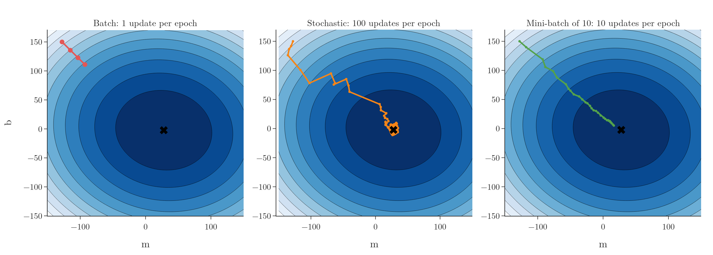
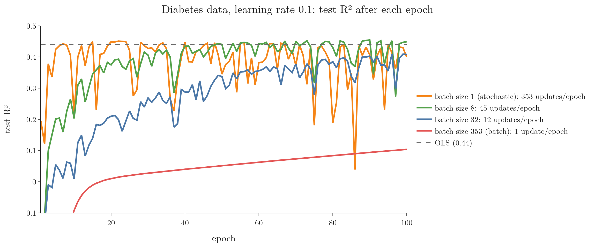

<!-- where-this-fits: generated by course_map/build_map.py; edit concepts.yaml, not this block -->
> **Where this fits:** Pipeline map step 8 (Model). See the [Course map](../01-course-map/note.md).
>
> 
>
> - **Builds on:** Gradient descent ([Note 57](../57-gradient-descent/note.md)).
> - **Leads to:** Batch size in Keras ([Note 1020](../1020-gradient-descent-in-neural-networks/note.md)).
> - **Compare with:** Stochastic gradient descent ([Note 59](../59-stochastic-gradient-descent/note.md)).
<!-- /where-this-fits -->

## 1. Overview

> **Key point:** Mini-batch gradient descent updates the coefficients after each small group of observations. Mini-batch sits between batch (stable, slow) and stochastic (fast, noisy) gradient descent, and is the version most used in practice.

A **feature** is an input variable (one column of the data table), an **observation** is one record (one row), and the **target** is the output we predict.

The three types of gradient descent differ only in how often they update the coefficients:

- **Batch:** once per epoch, after looking at all $n$ observations.
- **Stochastic:** $n$ times per epoch, after each single observation.
- **Mini-batch:** once after each **batch**: a small group of observations, typically 32 to 256, sometimes 16. Most deep-learning training works this way (Goodfellow §8.1.3).

With 1,000 observations and a batch size of 100, the data splits into 10 batches, so there are 10 updates per epoch. A batch size of 10 would give 100 updates per epoch.

## 2. A family that contains the other two

> **Key point:** Batch size n is batch gradient descent; batch size 1 is stochastic gradient descent; anything between is mini-batch.

The **batch size** is a hyperparameter. Read the table of the three types in the [batch gradient descent Note](../58-batch-gradient-descent/note.md) (section one) by batch size: batch gradient descent is batch size $n$, stochastic gradient descent is batch size 1, and mini-batch is everything between.

Mini-batch is therefore the general form, and the batch size tunes how it behaves between the two extremes.

## 3. How it works

> **Key point:** Each epoch: shuffle the observations, cut them into batches, and for each batch compute the derivatives from its observations only and update.

1. Start with any coefficients, for example $\beta_0 = 0$ and every $\beta_j = 1$.
2. For each epoch:
   - shuffle the observations into a random order;
   - cut them into consecutive batches of the chosen size (the last batch may be smaller);
   - for each batch, compute the predictions, the errors and the derivatives using only its observations, and update.

The derivatives are the batch ones, averaged over the observations $B$ of the current batch instead of all $n$ observations:

$$\frac{\partial L}{\partial \beta_j} = -\frac{2}{|B|}\sum_{i \in B}(y_i - \hat y_i)\thinspace x_{ij}$$

where $|B|$ is the number of observations in the batch.

> **Python:** Mini-batch gradient descent from scratch.
>
> ```python
> class MBGDRegressor:
>     def __init__(self, batch_size, learning_rate=0.01,
>                  epochs=100, seed=0):
>         self.bs, self.lr, self.epochs = (batch_size,
>             learning_rate, epochs)
>         self.rng = np.random.default_rng(seed)
>
>     def fit(self, X, y):
>         n = X.shape[0]
>         self.intercept_ = 0.0
>         self.coef_ = np.ones(X.shape[1])
>         for _ in range(self.epochs):
>             order = self.rng.permutation(n)        # shuffle
>             for start in range(0, n, self.bs):
>                 j = order[start:start + self.bs]   # one batch
>                 err = y[j] - (X[j] @ self.coef_ + self.intercept_)
>                 self.intercept_ -= self.lr * (-2 * err.mean())
>                 self.coef_ -= self.lr * (-2 * X[j].T @ err / len(j))
>         return self
> ```
>
> The derivative code is the same vectorised code as batch gradient descent, applied to the observations `X[j]` of one batch.

> **Extra:** Some implementations draw each batch at random from all observations, so observations can repeat within an epoch. Shuffling and slicing, as above, uses every observation exactly once per epoch. For very large datasets it is usually enough to shuffle the order once and keep it, while never shuffling at all can seriously hurt the result (Goodfellow §8.1.3).

## 4. Comparing the three paths

> **Key point:** In three epochs, batch barely moves, stochastic arrives but zigzags, and mini-batch arrives on a smoother path.

Figure 1 runs all three for 3 epochs on the 100-point example, with the same learning rate of 0.05.



- **Batch** (3 updates in total) has only just started.
- **Stochastic** (300 updates) reaches the minimum, then jumps around it.
- **Mini-batch of 10** (30 updates) follows a much smoother path and is almost there.

Averaging the derivative over 10 observations cancels much of the noise of a single observation, while still updating 10 times as often as batch. The noise of an average of $B$ values is $1/\sqrt{B}$ of the noise of one value (Goodfellow §8.1.3), so with $B = 10$ each step carries about a third ($0.32$) of a single observation's noise.

## 5. Choosing the batch size

> **Key point:** Smaller batches mean more updates per epoch but noisier ones; larger batches mean smoother but fewer updates. A small batch in between, here 8, gets both.

Think of asking for directions: asking one passer-by is quick but may mislead you, polling the whole town is reliable but takes all day, and asking a handful of people is quick and mostly right. Figure 2 trains on the diabetes data with learning rate 0.1 for 100 epochs and four batch sizes, on one train/test split.



The table averages 20 random splits; the last column is how much test R² jumps from epoch to epoch near the end (standard deviation over the last 20 epochs).

| Batch size | Updates per epoch | Test R² after 100 epochs | Epoch-to-epoch jumps |
|---|---|---|---|
| 1 (stochastic) | 353 | 0.43 | 0.076 |
| 8 | 45 | 0.45 | 0.031 |
| 32 | 12 | 0.40 | 0.031 |
| 353 (batch) | 1 | 0.11 | 0.006 |

- With batch size 1, test R² climbs fastest at first but then jumps from epoch to epoch, more than twice as much as with 8.
- With batch size 8, test R² gets close to OLS (0.44) early and stays there more steadily.
- With batch size 32, the curve is smooth but slower, with fewer updates per epoch.
- Full batch has made only 100 updates in total and is far from done.

Like the learning rate, the batch size is tuned by trying values, and the two settings interact. A very small batch gives a noisy derivative, so it may need a small learning rate to stay stable (Goodfellow §8.1.3).

> **Extra:** In deep learning, too, small batches often do well: one study got its best results with batch sizes between 2 and 32 (Masters and Luschi). Going the other way, one well-known large-batch method grows the learning rate with the batch size: twice the batch, twice the rate (Goyal et al.).

> **Extra:** Batch sizes are often powers of two (16, 32, 64, 128) because some hardware, especially GPUs, runs faster with arrays of these sizes. The memory needed grows with the batch size, not with the size of the dataset, so models can be trained on datasets far larger than memory (Goodfellow §8.1.3).

## 6. Mini-batch in scikit-learn

> **Key point:** SGDRegressor has no batch size option, but its partial_fit method trains on one batch at a time, so a short loop gives mini-batch training.

`SGDRegressor` (from the previous Note) always updates one observation at a time inside `fit`. Its `partial_fit` method, however, does one pass over whatever observations it is given, keeping the coefficients learned so far. Feeding it one batch at a time gives mini-batch-style training:

> **Python:** Mini-batch training with partial_fit.
>
> ```python
> from sklearn.linear_model import SGDRegressor
>
> sgd = SGDRegressor(learning_rate="constant", eta0=0.2,
>                    random_state=0)
> rng = np.random.default_rng(0)
> for epoch in range(100):
>     order = rng.permutation(n)
>     for start in range(0, n, 35):
>         j = order[start:start + 35]
>         sgd.partial_fit(X_train[j], y_train[j])
> sgd.score(X_test, y_test)      # R² 0.45
> ```
>
> `partial_fit` is also how scikit-learn models learn from data that arrives over time, the online learning of Note 5.

> **Extra:** Inside `partial_fit`, `SGDRegressor` still updates once per observation of the batch rather than once per batch. True mini-batch updates (one update from the batch's average derivative) are standard in deep-learning libraries, where the batch size is a basic setting.

## 7. Summary

| | Batch | Mini-batch | Stochastic |
|---|---|---|---|
| Observations per update | $n$ | a small batch | 1 |
| Updates per epoch | 1 | $n$ / batch size | $n$ |
| Path | smooth, slow | fairly smooth, fast | noisy, fast |
| Memory | whole dataset | one batch | one observation |
| Typical use | small data | most practice, deep learning | very large or streaming data |

- Mini-batch gradient descent includes the other two as batch sizes $n$ and 1.
- Each epoch: shuffle, cut into batches, update once per batch with the batch's average derivative.
- Batch size and learning rate are tuned together; batch size 8 worked best here (test R² 0.45, against 0.43 for 1 and 0.40 for 32, averaged over 20 splits).
- In scikit-learn, `partial_fit` on successive batches gives mini-batch-style training.

## 8. Sources

- **Goodfellow**: I. Goodfellow, Y. Bengio, A. Courville, *Deep Learning*, MIT Press, 2016 (deeplearningbook.org). §8.1.3 (batch and minibatch algorithms).
- **Masters and Luschi**: D. Masters and C. Luschi, "Revisiting Small Batch Training for Deep Neural Networks", arXiv:1804.07612, 2018.
- **Goyal et al.**: P. Goyal et al., "Accurate, Large Minibatch SGD: Training ImageNet in 1 Hour", arXiv:1706.02677, 2017.

## 9. Key terms

| Term | Meaning |
|---|---|
| Feature | An input variable: one column of the data table |
| Observation | One record: one row of the data table |
| Target | The output we predict |
| Mini-batch gradient descent | Gradient descent that updates after each small group of observations |
| Batch (mini-batch) | A small group of training observations used for one update |
| Batch size | The number of observations in each batch; a hyperparameter |
| Shuffling | Putting the observations in a new random order before each epoch |
| partial_fit | A scikit-learn method that continues training on new observations, keeping what was learned so far |
