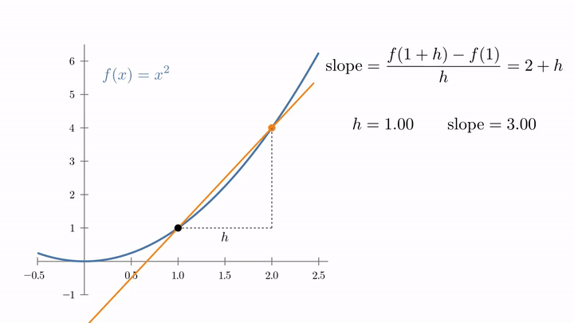

<!-- where-this-fits: generated by course_map/build_map.py; edit concepts.yaml, not this block -->
> **Where this fits:** Pipeline map step 0 (Foundations). See the [Course map](../01-course-map/note.md).
>
> 
>
> - **Leads to:** Partial derivatives and gradients ([Note 601](../601-partial-derivatives-and-gradients/note.md)); Backpropagation ([Note 1015](../1015-backpropagation-what/note.md)); Gradient descent ([Note 1017](../1017-backpropagation-why/note.md)).
<!-- /where-this-fits -->

## 1. Overview

> **Key point:** The derivative of $f$ at $x$ is the slope of the tangent line there: the limit of the slope of a secant line as its two points move together.

This Note follows Chapter 5 (Section 5.1) of *Mathematics for Machine Learning* (Deisenroth, Faisal and Ong, 2020).



Figure 1 shows the whole idea of this Note. We draw a straight line through two points of a curve, a **secant line**. As the second point slides towards the first, the secant line turns and settles on one line that only touches the curve: the tangent line. Its slope is the derivative.

Earlier Notes already used derivatives as tools:

- the derivative as the slope of a function at a point, set to zero in the [linear regression maths Note](../51-linear-regression-maths/note.md);
- stepping against the derivative in the [gradient descent Note](../57-gradient-descent/note.md);
- the chain rule in the [sigmoid derivative Note](../74-sigmoid-derivative/note.md);
- the Taylor series, built from derivatives in the [XGBoost maths Note](../126-xgboost-maths/note.md).

This Note explains where the derivative comes from (Sections 3 and 4), collects the rules for computing it (Section 5) and adds the Taylor polynomial (Section 6). The next Notes extend all of this to functions of many variables, which is what ML losses are.

## 2. Functions: one number in, one number out

> **Key point:** A function assigns exactly one output to every input; we write $f: \mathbb{R} \to \mathbb{R}$ for a function from numbers to numbers.

A **function** $f$ takes an input $x$ and gives exactly one output $f(x)$. In this Note the input and the output are single real numbers. We write this as

$$f: \mathbb{R} \to \mathbb{R}, \qquad x \mapsto f(x)$$

The first part says what goes in and what comes out ($\mathbb{R}$ is the set of real numbers). The second part, read "$x$ maps to $f(x)$", gives the rule. For example $f: x \mapsto x^2$ sends 3 to 9.

The set of allowed inputs is the **domain**; the set the outputs live in is the **codomain**. ML losses take many numbers in (all the parameters) and give one number out, written $f: \mathbb{R}^D \to \mathbb{R}$. The [partial derivatives and gradients Note](../601-partial-derivatives-and-gradients/note.md) handles that case; this Note stays with one input.

## 3. The difference quotient: slope of a secant line

> **Key point:** Rise over run between two points of the curve, $x$ and $x + h$, is the slope of the secant line through them: the average slope of $f$ over that stretch.

Pick a point $x$ on the curve and a second point a step $h$ further. The secant line through the two points has a slope we can compute from the two heights.

1. **In words:** the change in output divided by the change in input.
2. **Formula:** the **difference quotient** is
   $$\frac{\delta y}{\delta x} = \frac{f(x + h) - f(x)}{h}$$
3. **Example:** $f(x) = x^2$ at $x = 1$ with $h = 1$. The points are $(1, 1)$ and $(2, 4)$:
   $$\frac{f(2) - f(1)}{1} = \frac{4 - 1}{1} = 3$$

The secant line has slope 3 (top-left frame of Figure 1). The secant slope is the slope a straight line would need to get from the first point to the second, so it is the **average slope** of $f$ between $x$ and $x + h$. A curve that bends in between can be steeper or flatter than this at any single point.

## 4. The derivative: shrinking the step to zero

> **Key point:** As $h \to 0$, the secant slope approaches one number, the slope of the tangent line; that limit is the derivative $f'(x)$.

### 4.1 From secant to tangent

> **Key point:** Make $h$ smaller and smaller, and watch where the difference quotient settles.

For $f(x) = x^2$ at $x = 1$, smaller steps give:

| $h$ | 1 | 0.5 | 0.1 | 0.01 | 0.001 |
|---|---|---|---|---|---|
| $\dfrac{(1 + h)^2 - 1}{h}$ | 3 | 2.5 | 2.1 | 2.01 | 2.001 |

The slopes approach 2. Figure 1 shows the same thing as a picture: the secant line turns until, in the limit, it touches the curve at one point. That limiting line is the **tangent line**.

1. **In words:** the derivative of $f$ at $x$ is the value the difference quotient approaches as the step $h$ shrinks to zero.
2. **Formula:**
   $$f'(x) = \frac{df}{dx} = \lim_{h \to 0} \frac{f(x + h) - f(x)}{h}$$
   $\lim_{h \to 0}$, the **limit**, means "the value this approaches as $h$ gets as close to 0 as we like". We never set $h = 0$ itself, which would give $0/0$.
3. **Example:** the algebra explains the table. For $f(x) = x^2$,
   $$\frac{(x + h)^2 - x^2}{h} = \frac{x^2 + 2xh + h^2 - x^2}{h} = 2x + h \thickspace\longrightarrow\thickspace2x$$
   At $x = 1$ the difference quotient is $2 + h$: that is 3 for $h = 1$, 2.1 for $h = 0.1$, and the limit is $f'(1) = 2$.

The two names $f'(x)$ and $\dfrac{df}{dx}$ mean the same thing. A function whose derivative exists at a point is **differentiable** there. Gradient descent uses the derivative of the loss at every step, so it needs a loss that is differentiable.

### 4.2 The power rule from the definition

> **Key point:** Expanding $(x + h)^n$ shows that every term except one carries an $h$ and vanishes, leaving $(x^n)' = n x^{n-1}$.

The same method works for $x^3$. Multiplying out $(x + h)^3 = x^3 + 3x^2h + 3xh^2 + h^3$:

$$\frac{(x + h)^3 - x^3}{h} = \frac{3x^2h + 3xh^2 + h^3}{h} = 3x^2 + 3xh + h^2 \thickspace\longrightarrow\thickspace3x^2$$

The $x^3$ cancels, one $h$ divides out of every remaining term, and every term that still has an $h$ goes to 0. Only $3x^2$ is left.

1. **In words:** bring the power down in front and lower the power by one.
2. **Formula:**
   $$\frac{d}{dx}x^n = n\thinspace x^{n-1}$$
3. **Example:** $\dfrac{d}{dx}x^3 = 3x^2$, so at $x = 2$ the slope is $3 \times 4 = 12$.

> **Extra:** For a general $n$, the binomial theorem writes $(x + h)^n = x^n + n x^{n-1}h + (\text{terms with } h^2, h^3, \dots)$. Subtracting $x^n$ and dividing by $h$ leaves $n x^{n-1}$ plus terms that all still contain $h$, so the limit is $n x^{n-1}$, exactly as for $n = 3$.

### 4.3 What the sign of the derivative tells us

> **Key point:** A positive derivative means $f$ rises as $x$ grows; a negative one means it falls. So the derivative points uphill.

The derivative is the rate of change of the output per unit of input, near $x$. Its sign says which way is uphill:

- $f'(x) > 0$: increasing $x$ increases $f$;
- $f'(x) < 0$: increasing $x$ decreases $f$;
- $f'(x) = 0$: the tangent is flat, as at the bottom of a valley.

The sign is all [gradient descent](../57-gradient-descent/note.md) needs: to go downhill, move $x$ against the sign of the derivative. For $f(x) = x^2$ at $x = 1$, $f'(1) = 2 > 0$, so we move left, towards the minimum at 0.

> **Python:** A computer can estimate a derivative with a small $h$, straight from the definition. Such an estimate is a **numerical derivative** (or finite difference).
>
> ```python
> import numpy as np
>
> def f(x):
>     return x ** 3
>
> h = 0.1
> (f(1 + h) - f(1)) / h              # 3.31
> (f(1 + h) - f(1 - h)) / (2 * h)    # 3.01
> ```
>
> The exact answer is $f'(1) = 3$.

> **Extra:** The second line is the **central difference**: it uses one point on each side of $x$. Its error shrinks like $h^2$ instead of $h$, so with $h = 0.1$ it is off by 0.01 instead of 0.31. Making $h$ tiny (say $10^{-12}$) does not help: the two heights become almost equal and rounding errors in the computer take over. Balancing the two errors puts the best $h$ for the central difference near the cube root of the machine precision, $(2.2 \times 10^{-16})^{1/3} \approx 6 \times 10^{-6}$, so values near $h = 10^{-5}$ are a common choice (Nocedal and Wright §8.1).

## 5. Rules for computing derivatives

> **Key point:** We rarely take limits by hand: a short table of basic derivatives plus four rules (sum, product, quotient, chain) gives the derivative of any formula built from them.

### 5.1 Basic derivatives

> **Key point:** These few derivatives, combined by the rules below, cover the functions ML uses.

| $f(x)$ | $f'(x)$ | Where ML meets it |
|---|---|---|
| $c$ (a constant) | $0$ | terms that do not depend on the parameter |
| $x^n$ | $n x^{n-1}$ | squared error |
| $e^x$ | $e^x$ | sigmoid, softmax |
| $\ln x$ | $1/x$ | log loss |
| $\sin x$ | $\cos x$ | |
| $\cos x$ | $-\sin x$ | |

Each entry can be proved from the limit definition, as we did for $x^n$.

### 5.2 Sum, product and quotient rules

> **Key point:** Derivatives of a sum add up; a product and a quotient have their own fixed patterns.

Write $f'$ and $g'$ for the derivatives of two functions $f$ and $g$.

- **Sum rule:** the derivative of a sum is the sum of the derivatives.
  $$\big(f(x) + g(x)\big)' = f'(x) + g'(x)$$
  Example: $(x^2 + x^3)' = 2x + 3x^2$, which is 5 at $x = 1$.
- **Product rule:** differentiate one factor at a time, keep the other, and add.
  $$\big(f(x)\thinspace g(x)\big)' = f'(x)\thinspace g(x) + f(x)\thinspace g'(x)$$
  Example: $x^2(3x + 1)$ at $x = 1$ gives $2x(3x + 1) + x^2 \cdot 3 = 2 \cdot 4 + 1 \cdot 3 = 11$. Multiplying out first, $3x^3 + x^2$ has derivative $9x^2 + 2x = 11$: the same.
- **Quotient rule:** for a fraction,
  $$\left(\frac{f(x)}{g(x)}\right)' = \frac{f'(x)\thinspace g(x) - f(x)\thinspace g'(x)}{g(x)^2}$$
  Example: $\dfrac{x}{x^2 + 1}$ at $x = 2$ gives
  $$\frac{1 \cdot 5 - 2 \cdot 4}{5^2} = \frac{-3}{25} = -0.12$$

### 5.3 The chain rule

> **Key point:** For a function of a function, multiply the outer derivative (evaluated at the inside) by the inner derivative.

An earlier Note on the sigmoid ([sigmoid derivative Note](../74-sigmoid-derivative/note.md)) used the **chain rule**: to differentiate a function of a function, multiply the outer derivative by the inner derivative. We write it once more with the notation of **composition**: $g \circ f$ means "first $f$, then $g$", so $(g \circ f)(x) = g(f(x))$.

1. **In words:** differentiate the outer function, leaving the inside untouched, then multiply by the derivative of the inside.
2. **Formula:**
   $$(g \circ f)'(x) = g'\big(f(x)\big)\thinspace f'(x)$$
3. **Example:** $h(x) = (x^2 + 1)^3$. The inside is $f(x) = x^2 + 1$ with $f'(x) = 2x$; the outside is $g(u) = u^3$ with $g'(u) = 3u^2$. So
   $$h'(x) = 3(x^2 + 1)^2 \cdot 2x, \qquad h'(1) = 3 \cdot 2^2 \cdot 2 = 24$$

One way to read the chain rule: rates of change multiply. Near $x = 1$, the inside changes 2 times as fast as $x$, and the outside changes $3 \cdot 2^2 = 12$ times as fast as the inside, so $h$ changes $12 \times 2 = 24$ times as fast as $x$.

Most ML models are long chains of functions: a weighted sum, then a sigmoid, then a log loss. The chain rule is what turns their derivatives into a product of small, easy pieces. The [linear regression maths Note](../51-linear-regression-maths/note.md) already used it on $(y_i - m x_i - b)^2$, and the next Notes extend it to many variables.

> **Python:** Checking a rule numerically is a good habit.
>
> ```python
> h_fun = lambda x: (x ** 2 + 1) ** 3
> step = 1e-5
> (h_fun(1 + step) - h_fun(1 - step)) / (2 * step)   # 24.0000...
> ```

## 6. Taylor polynomials

> **Key point:** Near a point $x_0$, a function is approximated by a polynomial built from its derivatives at $x_0$; the degree-1 polynomial is the tangent line.

An earlier Note on boosting ([XGBoost maths Note](../126-xgboost-maths/note.md)) introduced the **Taylor series**: near a point, a smooth function is approximated by a polynomial built from its value and derivatives there. That Note worked through $e^x$ and stopped at the second-order term, a parabola. Here we name the pieces and add what is new.

### 6.1 The Taylor polynomial of degree n

> **Key point:** Keep the terms up to $(x - x_0)^n$ of the Taylor series: that finite sum is the Taylor polynomial $T_n$.

We write $f^{(k)}$ for the $k$-th derivative: $f^{(0)} = f$, $f^{(1)} = f'$, $f^{(2)} = f''$, and so on. The number $k! = 1 \cdot 2 \cdots k$ is "$k$ factorial", with $0! = 1$.

1. **In words:** for each $k$ from 0 to $n$, take the $k$-th derivative at $x_0$, divide by $k!$ and multiply by $(x - x_0)^k$; add these up.
2. **Formula:** the **Taylor polynomial** of degree $n$ at $x_0$ is
   $$T_n(x) = \sum_{k=0}^{n} \frac{f^{(k)}(x_0)}{k!}(x - x_0)^k$$
   Letting $n$ run to infinity gives the Taylor series $T_\infty$. With $x_0 = 0$ it is called the **Maclaurin series**.
3. **Example:** $f(x) = \sin x$ at $x_0 = 0$. The derivatives cycle $\sin, \cos, -\sin, -\cos$, which at 0 give $0, 1, 0, -1$. So only odd powers survive:
   $$T_5(x) = x - \frac{x^3}{3!} + \frac{x^5}{5!} = x - \frac{x^3}{6} + \frac{x^5}{120}$$
   At $x = 0.5$: $T_1 = 0.5$, $T_3 = 0.5 - 0.02083 = 0.47917$, $T_5 = 0.47917 + 0.00026 = 0.47943$. The true $\sin 0.5 = 0.47943$.

{height=38%}

Figure 2 shows the pattern. Near $x_0$ every polynomial is close to $\sin x$. Further away, the low-degree ones drift off, while $T_9$ stays on the curve for a whole wave. A Taylor polynomial is a **local** approximation: good near $x_0$, getting worse with distance.

### 6.2 Degree 1: the tangent line

> **Key point:** $T_1(x) = f(x_0) + f'(x_0)(x - x_0)$ is the tangent line at $x_0$; using it in place of $f$ is called linearisation.

The first two terms are

$$T_1(x) = f(x_0) + f'(x_0)\thinspace(x - x_0)$$

a straight line through $(x_0, f(x_0))$ with slope $f'(x_0)$: the tangent line of Figure 1. Replacing a function by its tangent line near a point is called **linearisation**.

1. **In words:** start at the known height and follow the slope for the distance moved.
2. **Formula:** $f(x) \approx f(x_0) + f'(x_0)(x - x_0)$ for $x$ near $x_0$.
3. **Example:** $f(x) = \sqrt{x}$ at $x_0 = 4$, where $f(4) = 2$ and $f'(x) = \tfrac{1}{2\sqrt{x}}$ gives $f'(4) = 0.25$.
   $$\sqrt{4.1} \approx 2 + 0.25 \times 0.1 = 2.025 \quad (\text{true: } 2.0248)$$
   $$\sqrt{5} \approx 2 + 0.25 \times 1 = 2.25 \quad (\text{true: } 2.2361)$$
   A step of 0.1 is almost exact; a step of 1 is already visibly off.

Linearisation is the picture behind [gradient descent](../57-gradient-descent/note.md). Each step trusts the tangent line, which is only reliable near the current point. A small learning rate keeps the step inside the region where the tangent line is a good guide; with a step that is too large, gradient descent can overshoot and fail to converge (MML §7.1.1).

### 6.3 A polynomial is its own Taylor polynomial

> **Key point:** For a polynomial of degree $k$, all derivatives beyond the $k$-th are zero, so $T_n$ with $n \geq k$ reproduces it exactly.

For a function that is not a polynomial, such as $\sin x$, a Taylor polynomial is only an approximation. For a polynomial it can be exact.

1. **In words:** a polynomial of degree 3 has a zero fourth derivative, so the Taylor series stops after the cube term and nothing is lost.
2. **Formula:** if $f$ is a polynomial of degree $k$, then $T_n = f$ for every $n \geq k$.
3. **Example:** $f(x) = x^3$ at $x_0 = 2$. The derivatives at 2 are $f = 8$, $f' = 3x^2 = 12$, $f'' = 6x = 12$, $f''' = 6$, and all higher ones are 0:
   $$T_3(x) = 8 + 12(x - 2) + \frac{12}{2!}(x - 2)^2 + \frac{6}{3!}(x - 2)^3 = 8 + 12(x - 2) + 6(x - 2)^2 + (x - 2)^3$$
   Multiplying out: $8 - 24 + 24 - 8 = 0$ for the constant, $12 - 24 + 12 = 0$ for $x$, $6 - 6 = 0$ for $x^2$, and $1 \cdot x^3$. So $T_3(x) = x^3$ exactly.

Exactness for polynomials explains a result of the [XGBoost maths Note](../126-xgboost-maths/note.md): its second-order approximation of the squared error was exact, because the squared error is already a polynomial of degree 2.

> **Extra:** A function equal to its Taylor series everywhere near $x_0$ is called **analytic**; $e^x$, $\sin x$ and $\cos x$ are, at every point. A Taylor series is one example of a **power series**, $\sum a_k (x - c)^k$, a polynomial with infinitely many terms. Functions such as `np.sin` and `np.exp` are computed with polynomial approximations too, though usually not Taylor polynomials: libraries use polynomials tuned to be accurate over a whole interval (Muller 2016).

> **Extra:** Degree 2 is where the curvature enters: $T_2$ is the parabola that matches the value, the slope and the second derivative at $x_0$. Jumping to the lowest point of that parabola is the **Newton step** of the [gradient boosting classification Note](../122-gradient-boosting-classification/note.md). The [Hessian and multivariate Taylor Note](../603-hessian-and-multivariate-taylor/note.md) does the same with many variables.

## 7. Summary

| Idea | Formula | Example ($f(x) = x^2$ at $x = 1$ unless stated) |
|---|---|---|
| Difference quotient | $(f(x + h) - f(x))/h$ | $h = 0.1$: 2.1 |
| Derivative | limit of the difference quotient as $h \to 0$ | $f'(1) = 2$ |
| Power rule | $(x^n)' = n x^{n-1}$ | $(x^3)' = 3x^2$ |
| Chain rule | $(g \circ f)' = g'(f(x))\thinspace f'(x)$ | $((x^2 + 1)^3)'$ at 1 = 24 |
| Taylor polynomial | sum of $f^{(k)}(x_0)(x - x_0)^k / k!$ up to $k = n$ | $\sin 0.5 \approx T_5 = 0.47943$ |
| Linearisation | $f(x_0) + f'(x_0)(x - x_0)$ | $\sqrt{4.1} \approx 2.025$ |

- The difference quotient is the slope of a secant line; its limit as $h \to 0$ is the slope of the tangent line, the derivative.
- The sign of the derivative says which way is uphill; gradient descent moves the other way.
- Sum, product, quotient and chain rules build the derivative of any formula from a short table.
- A Taylor polynomial approximates a function near a point; degree 1 is the tangent line, and a polynomial is reproduced exactly.

## 8. Sources

- Deisenroth, M. P., Faisal, A. A. and Ong, C. S. (2020). *Mathematics for Machine Learning*. Cambridge University Press. Sections 5.1 and 7.1.1 (MML).
- Muller, J.-M. (2016). *Elementary Functions: Algorithms and Implementation*, 3rd ed. Birkhäuser.
- Nocedal, J. and Wright, S. J. (2006). *Numerical Optimization*, 2nd ed. Springer. Section 8.1, finite-difference derivative approximations.

## 9. Key terms

| Term | Meaning |
|---|---|
| Function | A rule that assigns exactly one output to every input, written $f: \mathbb{R} \to \mathbb{R}$, $x \mapsto f(x)$ |
| Domain | The set of allowed inputs of a function |
| Codomain | The set in which a function's outputs lie |
| Secant line | A straight line through two points of a curve |
| Difference quotient | $(f(x + h) - f(x))/h$: the slope of the secant line, the average slope over a step $h$ |
| Limit | The value an expression approaches as a quantity (such as $h$) gets arbitrarily close to a target (such as 0) |
| Tangent line | The line that touches a curve at one point with the curve's slope there; the limit of secant lines |
| Differentiable | Having a derivative at a point (or at every point) |
| Power rule | $(x^n)' = n x^{n-1}$ |
| Numerical derivative | An estimate of a derivative from a difference quotient with a small step $h$ |
| Central difference | The numerical derivative $(f(x + h) - f(x - h))/(2h)$, more accurate than a one-sided step |
| Product rule | $(fg)' = f'g + fg'$ |
| Quotient rule | $(f/g)' = (f'g - fg')/g^2$ |
| Composition | $g \circ f$: apply $f$, then $g$; $(g \circ f)(x) = g(f(x))$ |
| Taylor polynomial | The Taylor series cut after the $(x - x_0)^n$ term |
| Maclaurin series | The Taylor series around $x_0 = 0$ |
| Linearisation | Replacing a function near a point by its tangent line (its first-order Taylor polynomial) |
| Analytic function | A function equal to its Taylor series near every point |
| Power series | An infinite sum $\sum a_k (x - c)^k$; the Taylor series is a special case |
