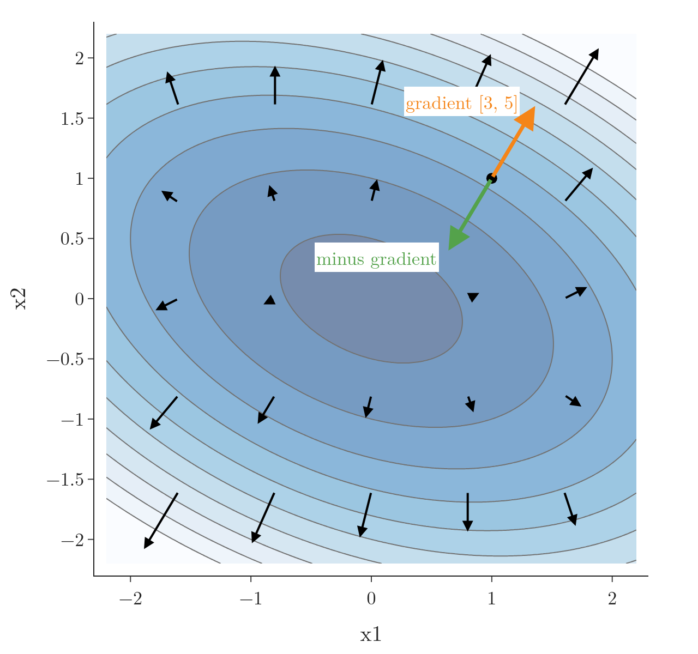
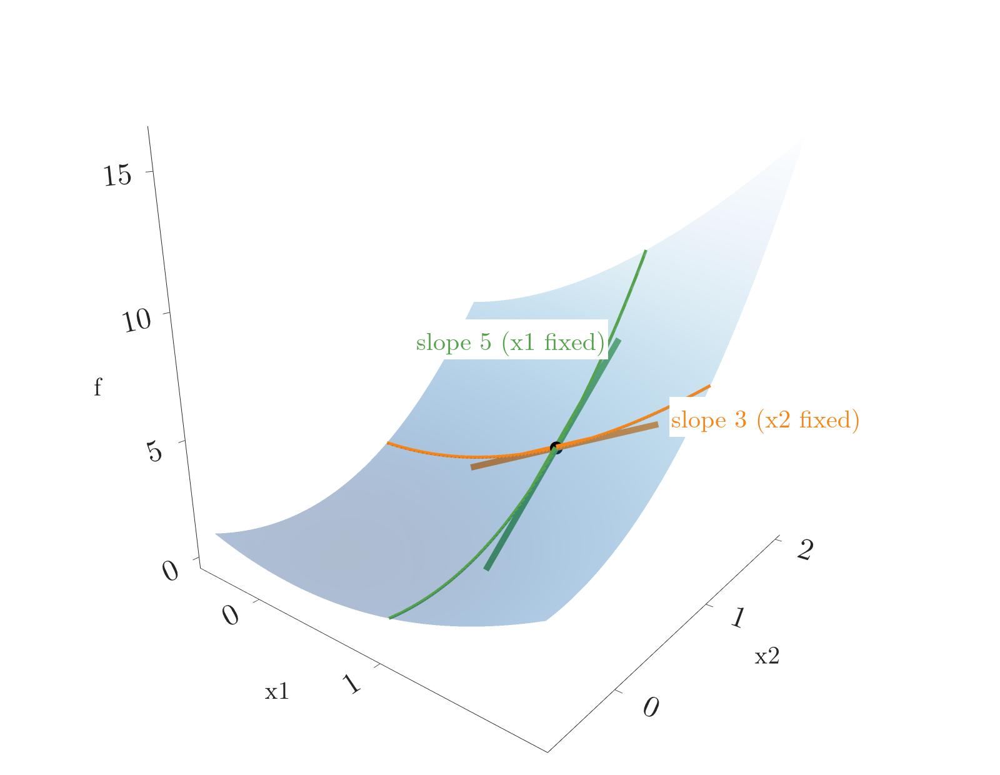
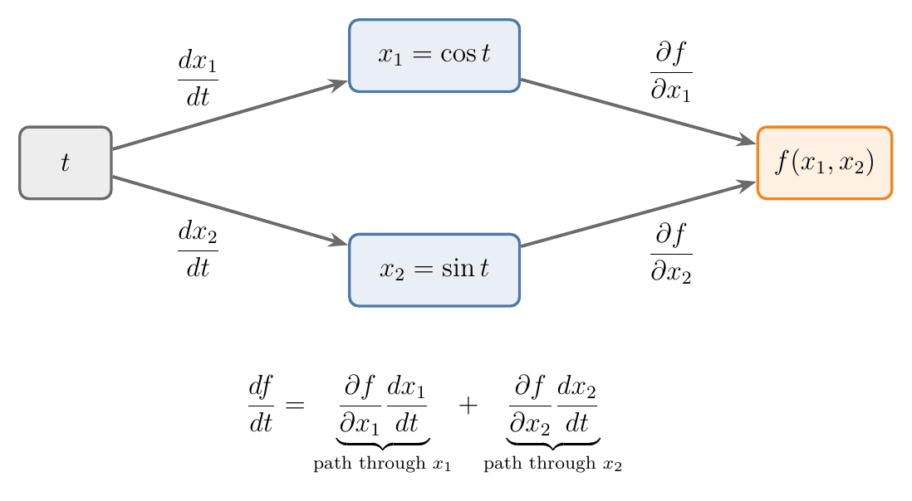

<!-- where-this-fits: generated by course_map/build_map.py; edit concepts.yaml, not this block -->
> **Where this fits:** Pipeline map step 0 (Foundations). See the [Course map](../01-course-map/note.md).
>
> 
>
> - **Builds on:** Derivatives of one variable ([Note 600](../600-derivatives-of-one-variable/note.md)).
> - **Leads to:** Jacobian and matrix gradients ([Note 602](../602-jacobian-and-matrix-gradients/note.md)); Lagrange multipliers, KKT and duality ([Note 620](../620-lagrange-multipliers/note.md)); Backpropagation ([Note 1015](../1015-backpropagation-what/note.md)); Gradient descent ([Note 1017](../1017-backpropagation-why/note.md)).
<!-- /where-this-fits -->

## 1. Overview

> **Key point:** For a function of many inputs, we take one derivative per input with the others held fixed; collected in a row, these partial derivatives form the gradient, an arrow that points straight uphill.

This Note follows Chapter 5 (Section 5.2) of *Mathematics for Machine Learning* (Deisenroth, Faisal and Ong, 2020).

{height=48%}

A loss depends on many parameters at once. Figure 1 shows such a function of two inputs as a contour map: each line joins points of equal height, and the lowest point is in the middle. At every point, the gradient is an arrow pointing in the steepest uphill direction. Its opposite, the green arrow, is the step gradient descent takes.

Earlier Notes already used these ideas:

- the partial derivative as a slope in one variable, from the [linear regression maths Note](../51-linear-regression-maths/note.md);
- the gradient as the vector of partial derivatives of the loss, from the [gradient descent Note](../57-gradient-descent/note.md).

This Note adds the definition as a limit, the geometry of the gradient, the rules for vectors and the chain rule with several variables. The Note builds on the one-variable derivative of the [derivatives of one variable Note](../600-derivatives-of-one-variable/note.md).

## 2. Functions of several variables

> **Key point:** $f: \mathbb{R}^n \to \mathbb{R}$ takes a vector of $n$ numbers in and gives one number out, just as a loss takes all the parameters and gives one error.

A function of several variables takes a vector $\mathbf{x} = [x_1, \dots, x_n]^{\mathsf T}$ and returns one number:

$$f: \mathbb{R}^n \to \mathbb{R}, \qquad \mathbf{x} \mapsto f(\mathbf{x})$$

Two examples we use throughout:

- the squared length of a vector, $f(\mathbf{x}) = \mathbf{x}^{\mathsf T}\mathbf{x} = x_1^2 + x_2^2$, the dot product of $\mathbf{x}$ with itself (see the [dot product and cosine similarity Note](../362-dot-product-and-cosine-similarity/note.md));
- our running example, a tilted bowl like a loss surface:
  $$f(x_1, x_2) = x_1^2 + x_1 x_2 + 2x_2^2$$
  At $(1, 1)$ its value is $1 + 1 + 2 = 4$.

## 3. Partial derivatives

> **Key point:** A partial derivative changes one input by a tiny step, keeps all the others fixed, and measures the slope; it is an ordinary one-variable derivative.

### 3.1 The definition

> **Key point:** Nudge only $x_i$ by $h$, take the difference quotient, and let $h \to 0$.

The [linear regression maths Note](../51-linear-regression-maths/note.md) defined the **partial derivative** as the slope of a function of several variables in one variable, holding the others fixed. Written with the limit of the [derivatives of one variable Note](../600-derivatives-of-one-variable/note.md):

1. **In words:** move only $x_i$ by a step $h$, divide the change in $f$ by $h$, and let $h$ shrink to 0.
2. **Formula:**
   $$\frac{\partial f}{\partial x_i} = \lim_{h \to 0} \frac{f(x_1, \dots, x_i + h, \dots, x_n) - f(\mathbf{x})}{h}$$
   The curly $\partial$ (read "partial") replaces $d$ to say that the other variables are held fixed.
3. **Example:** for our bowl at $(1, 1)$ with $h = 0.1$,
   $$\frac{f(1.1,\ 1) - f(1, 1)}{0.1} = \frac{1.21 + 1.1 + 2 - 4}{0.1} = 3.1$$
   Smaller $h$ brings this towards 3.

### 3.2 Computing partial derivatives

> **Key point:** Treat every other variable as a constant and use the one-variable rules.

Because the other variables are frozen, they behave like numbers. All the rules of the [derivatives of one variable Note](../600-derivatives-of-one-variable/note.md) apply unchanged.

1. **In words:** to differentiate with respect to $x_1$, read $x_2$ as a fixed number, and the other way round.
2. **Formula:** for $f(x_1, x_2) = x_1^2 + x_1 x_2 + 2x_2^2$,
   $$\frac{\partial f}{\partial x_1} = 2x_1 + x_2, \qquad \frac{\partial f}{\partial x_2} = x_1 + 4x_2$$
   In $\partial f / \partial x_1$, the term $x_1 x_2$ is "$x_1$ times a constant", so its derivative is that constant $x_2$; the term $2x_2^2$ is a constant, so its derivative is 0.
3. **Example:** at $(1, 1)$: $\partial f / \partial x_1 = 2 + 1 = 3$ and $\partial f / \partial x_2 = 1 + 4 = 5$.

The chain rule works the same way inside a partial derivative. For $g(x, y) = (x + y^2)^2$ at $(1, 2)$, where the inside is $x + y^2 = 5$:

$$\frac{\partial g}{\partial x} = 2(x + y^2) \cdot 1 = 10, \qquad \frac{\partial g}{\partial y} = 2(x + y^2) \cdot 2y = 40$$

### 3.3 The picture: slopes of two slices

> **Key point:** Fixing $x_2$ cuts the surface along a curve in the $x_1$ direction; $\partial f / \partial x_1$ is the slope of its tangent line.

Figure 2 shows the surface of our bowl. Fixing $x_2 = 1$ cuts it along the orange curve, a function of $x_1$ alone. Its tangent line at $(1, 1)$ has slope 3: that is $\partial f / \partial x_1$. Fixing $x_1 = 1$ instead gives the green curve, whose tangent line has slope 5: that is $\partial f / \partial x_2$.

{height=42%}

The two tangent lines together span a flat plane that touches the surface at $(1, 1)$, the tangent plane. The [Hessian and multivariate Taylor Note](../603-hessian-and-multivariate-taylor/note.md) uses it to approximate the surface.

## 4. The gradient

> **Key point:** The gradient collects all partial derivatives in one row vector; as an arrow, it points in the direction of steepest ascent and is perpendicular to the contour lines.

### 4.1 Collecting the partial derivatives

> **Key point:** One partial derivative per input, side by side: a $1 \times n$ row vector.

An earlier Note on descent ([gradient descent Note](../57-gradient-descent/note.md)) defined the **gradient** as the vector of partial derivatives of the loss, pointing in the direction of steepest increase. We write it as a row:

1. **In words:** list the partial derivatives in the order of the inputs.
2. **Formula:**
   $$\nabla_{\mathbf{x}} f = \frac{df}{d\mathbf{x}} = \begin{bmatrix} \dfrac{\partial f}{\partial x_1} & \dfrac{\partial f}{\partial x_2} & \cdots & \dfrac{\partial f}{\partial x_n} \end{bmatrix} \in \mathbb{R}^{1 \times n}$$
   $\nabla$ is read "nabla" or "grad".
3. **Example:** for our bowl,
   $$\nabla f = \begin{bmatrix} 2x_1 + x_2 & x_1 + 4x_2 \end{bmatrix}, \qquad \nabla f(1, 1) = \begin{bmatrix} 3 & 5 \end{bmatrix}, \qquad \nabla f(2, -1) = \begin{bmatrix} 3 & -2 \end{bmatrix}$$

**Row or column?** Many texts, and the update rules of the [gradient descent Note](../57-gradient-descent/note.md), treat the gradient as a column vector like the parameters. The book we follow uses a row: then the chain rule becomes ordinary matrix multiplication with no transposes (Section 6), and the next Note's Jacobian follows naturally. The numbers are the same either way; only the shape differs. In NumPy both are plain 1-D arrays, so code rarely notices.

### 4.2 The gradient as an arrow on the contour map

> **Key point:** Drawn at its point, the gradient arrow points the way $f$ rises fastest, crosses the contour line at a right angle, and is longer where the surface is steeper.

Figure 1 draws the gradient as an arrow at many points of the contour map. Three things are visible:

- **It points uphill.** Every arrow points away from the minimum, towards higher contour lines.
- **It crosses contour lines at right angles.** Along a contour line $f$ does not change at all, so the steepest direction is straight across it.
- **Its length is the steepness.** Arrows are long where contour lines are packed close together, and short near the flat bottom.

At $(1, 1)$ the gradient $[3, 5]$ (orange) points up and to the right. Its opposite, $[-3, -5]$ (green), points into the bowl: the direction [gradient descent](../57-gradient-descent/note.md) steps in, $\mathbf{x}_{\text{new}} = \mathbf{x} - \eta\thinspace  \nabla f(\mathbf{x})$.

> **Extra:** The slope in any direction follows from the gradient. For a unit vector $\mathbf{u}$ (length 1), the **directional derivative** is the dot product $\nabla f \cdot \mathbf{u}$. At $(1, 1)$:
>
> - along $\mathbf{u} = [1, 0]$ it is $3$, the partial derivative $\partial f / \partial x_1$;
> - along the gradient itself, $\mathbf{u} = [3, 5]/\sqrt{34}$, it is $\sqrt{34} = 5.83$, the largest possible;
> - along $\mathbf{u} = [5, -3]/\sqrt{34}$, at right angles to the gradient, it is $(15 - 15)/\sqrt{34} = 0$: we walk along the contour line.
>
> A dot product with a unit vector is largest when the two point the same way (see the [dot product and cosine similarity Note](../362-dot-product-and-cosine-similarity/note.md)). This alignment is why the gradient is the direction of steepest ascent.

## 5. Rules for gradients

> **Key point:** Sum, product and chain rules still hold with vectors, but the factors are now vectors and matrices, so their order matters.

The rules of the one-variable case carry over. For functions $f, g: \mathbb{R}^n \to \mathbb{R}$:

$$\text{Sum rule:}\quad \frac{\partial}{\partial \mathbf{x}}\big(f(\mathbf{x}) + g(\mathbf{x})\big) = \frac{\partial f}{\partial \mathbf{x}} + \frac{\partial g}{\partial \mathbf{x}}$$

$$\text{Product rule:}\quad \frac{\partial}{\partial \mathbf{x}}\big(f(\mathbf{x})\thinspace g(\mathbf{x})\big) = \frac{\partial f}{\partial \mathbf{x}}\thinspace g(\mathbf{x}) + f(\mathbf{x})\thinspace \frac{\partial g}{\partial \mathbf{x}}$$

$$\text{Chain rule:}\quad \frac{\partial}{\partial \mathbf{x}}\thinspace g\big(f(\mathbf{x})\big) = \frac{\partial g}{\partial f}\thinspace \frac{\partial f}{\partial \mathbf{x}}$$

With vectors and matrices, $AB$ and $BA$ are different things (see the [matrix multiplication as composition Note](../510-matrix-multiplication-as-composition/note.md)). So we keep the order written above and check that the shapes fit.

A building block we need: the gradient of a dot product with a fixed vector $\mathbf{a}$. Since $\mathbf{a}^{\mathsf T}\mathbf{x} = a_1x_1 + a_2x_2$, the partial derivatives are $a_1$ and $a_2$:

$$\frac{\partial}{\partial \mathbf{x}}\thinspace \mathbf{a}^{\mathsf T}\mathbf{x} = \mathbf{a}^{\mathsf T}$$

1. **In words (product rule):** differentiate one factor at a time, keep the other, add.
2. **Formula:** for $f(\mathbf{x}) = (\mathbf{a}^{\mathsf T}\mathbf{x})(\mathbf{b}^{\mathsf T}\mathbf{x})$,
   $$\nabla f = (\mathbf{b}^{\mathsf T}\mathbf{x})\thinspace \mathbf{a}^{\mathsf T} + (\mathbf{a}^{\mathsf T}\mathbf{x})\thinspace \mathbf{b}^{\mathsf T}$$
3. **Example:** $\mathbf{a} = [1, 2]$, $\mathbf{b} = [3, -1]$, $\mathbf{x} = [1, 1]$. Then $\mathbf{a}^{\mathsf T}\mathbf{x} = 3$ and $\mathbf{b}^{\mathsf T}\mathbf{x} = 2$:
   $$\nabla f = 2\thinspace [1, 2] + 3\thinspace [3, -1] = [11,\ 1]$$
   Check by multiplying out: $f = 3x_1^2 + 5x_1x_2 - 2x_2^2$ has partial derivatives $6x_1 + 5x_2 = 11$ and $5x_1 - 4x_2 = 1$.

## 6. The chain rule with several variables

> **Key point:** When an input affects $f$ through several intermediate variables, we multiply along each path and add up the paths; written with gradients, this is a matrix product.

### 6.1 One outer input, two paths

> **Key point:** The rate of change of $f$ with $t$ is the sum over both paths of (slope of $f$ along the path) times (rate of the intermediate variable): a row vector times a column vector.

Suppose $x_1$ and $x_2$ are themselves functions of one variable $t$, for example a point moving around a circle: $x_1 = \cos t$, $x_2 = \sin t$. How fast does $f(x_1, x_2)$ change as $t$ changes? A change in $t$ reaches $f$ along two paths (Figure 3).

{height=34%}

1. **In words:** for each intermediate variable, multiply "how $f$ responds to it" by "how it responds to $t$"; add the results.
2. **Formula:**
   $$\frac{df}{dt} = \begin{bmatrix} \dfrac{\partial f}{\partial x_1} & \dfrac{\partial f}{\partial x_2} \end{bmatrix} \begin{bmatrix} \dfrac{dx_1}{dt} \cr  \dfrac{dx_2}{dt} \end{bmatrix} = \frac{\partial f}{\partial x_1}\frac{dx_1}{dt} + \frac{\partial f}{\partial x_2}\frac{dx_2}{dt}$$
3. **Example:** our bowl on the circle. At $t = \pi/2$ the point is $(0, 1)$, where $\nabla f = [0 + 1,\ 0 + 4] = [1, 4]$. The point moves with velocity $[-\sin t, \cos t] = [-1, 0]$:
   $$\frac{df}{dt} = 1 \cdot (-1) + 4 \cdot 0 = -1$$
   At $t = 0$ the point is $(1, 0)$, $\nabla f = [2, 1]$, velocity $[0, 1]$, so $df/dt = 1$.

The first form is a $1 \times 2$ row times a $2 \times 1$ column, giving a $1 \times 1$ number. The chain rule is where the row-vector convention pays off: the gradient sits on the left and the shapes fit with no transposing.

### 6.2 Two outer inputs: a matrix of partial derivatives

> **Key point:** With inputs $s$ and $t$, the inner derivatives fill a $2 \times 2$ matrix, and the chain rule becomes (row gradient) times (matrix).

Now let $x_1$ and $x_2$ depend on two variables $s$ and $t$. Each of $\partial f/\partial s$ and $\partial f/\partial t$ follows the path rule:

$$\frac{\partial f}{\partial s} = \frac{\partial f}{\partial x_1}\frac{\partial x_1}{\partial s} + \frac{\partial f}{\partial x_2}\frac{\partial x_2}{\partial s}, \qquad \frac{\partial f}{\partial t} = \frac{\partial f}{\partial x_1}\frac{\partial x_1}{\partial t} + \frac{\partial f}{\partial x_2}\frac{\partial x_2}{\partial t}$$

1. **In words:** both equations at once are one row vector times one matrix.
2. **Formula:**
   $$\frac{df}{d(s, t)} = \underbrace{\begin{bmatrix} \dfrac{\partial f}{\partial x_1} & \dfrac{\partial f}{\partial x_2} \end{bmatrix}}_{\partial f / \partial \mathbf{x}} \underbrace{\begin{bmatrix} \dfrac{\partial x_1}{\partial s} & \dfrac{\partial x_1}{\partial t} \cr  \dfrac{\partial x_2}{\partial s} & \dfrac{\partial x_2}{\partial t} \end{bmatrix}}_{\partial \mathbf{x} / \partial (s, t)}$$
3. **Example:** our bowl with $x_1 = s + t$ and $x_2 = st$, at $s = 1$, $t = 2$. Then $x_1 = 3$, $x_2 = 2$, so $\nabla f = [2 \cdot 3 + 2,\ 3 + 4 \cdot 2] = [8, 11]$. The inner derivatives are $\partial x_1/\partial s = 1$, $\partial x_1/\partial t = 1$, $\partial x_2/\partial s = t = 2$, $\partial x_2/\partial t = s = 1$:
   $$\begin{bmatrix} 8 & 11 \end{bmatrix} \begin{bmatrix} 1 & 1 \cr  2 & 1 \end{bmatrix} = \begin{bmatrix} 8 + 22 & 8 + 11 \end{bmatrix} = \begin{bmatrix} 30 & 19 \end{bmatrix}$$

The matrix in the middle is the first example of a **Jacobian**, the subject of the [Jacobian Note](../602-jacobian-and-matrix-gradients/note.md). The chain rule as a product of matrices mirrors the [matrix multiplication as composition Note](../510-matrix-multiplication-as-composition/note.md): doing one function after another multiplies their matrices.

The notation also reads like fractions: $\partial \mathbf{x}$ appears "below" in the first factor and "above" in the second, and "cancels" to leave $\partial f/\partial(s, t)$. The fraction reading is a memory aid only; partial derivatives are not really fractions.

## 7. Checking a gradient numerically

> **Key point:** Nudge each input by a small $h$ and compare the finite-difference slope with the formula; a tiny relative error means the formula and code are probably right.

Hand-derived gradients are easy to get wrong, and a wrong gradient makes training fail quietly. The definition of the partial derivative gives a simple test, called **gradient checking**:

1. **In words:** estimate each partial derivative with a small step $h$ (say $10^{-4}$), then compare the whole estimated gradient with the formula's.
2. **Formula:** with $d_i^h$ the finite-difference estimate and $d_i$ the formula's value for input $i$,
   $$\text{relative error} = \sqrt{\frac{\sum_i (d_i^h - d_i)^2}{\sum_i (d_i^h + d_i)^2}}$$
   A value below about $10^{-6}$ means the formula is very probably correct (MML §5.2).
3. **Example:** the squared-error loss $L(m, b) = \sum (y_i - m x_i - b)^2$ of the [gradient descent Note](../57-gradient-descent/note.md), on three points $x = [1, 2, 3]$, $y = [2, 4, 5]$, at $m = 1$, $b = 0$. The residuals are $[1, 2, 2]$, so the formulas give
   $$\frac{\partial L}{\partial m} = -2\sum r_i x_i = -2(1 + 4 + 6) = -22, \qquad \frac{\partial L}{\partial b} = -2\sum r_i = -10$$
   Central differences with $h = 10^{-4}$ give $[-22.0000, -10.0000]$, a relative error of about $10^{-13}$.

> **Python:**
>
> ```python
> import numpy as np
>
> x = np.array([1.0, 2.0, 3.0])
> y = np.array([2.0, 4.0, 5.0])
>
> def loss(p):
>     m, b = p
>     return np.sum((y - m * x - b) ** 2)
>
> def grad(p):
>     r = y - p[0] * x - p[1]
>     return np.array([-2 * np.sum(r * x), -2 * np.sum(r)])
>
> p, h = np.array([1.0, 0.0]), 1e-4
> num = np.array([(loss(p + h * e) - loss(p - h * e)) / (2 * h)
>                 for e in np.eye(2)])
> rel = np.linalg.norm(num - grad(p)) / np.linalg.norm(num + grad(p))
> num, grad(p), rel     # [-22, -10], [-22, -10], about 2.5e-13
> ```
>
> `np.eye(2)` gives the rows $[1, 0]$ and $[0, 1]$, so `p + h * e` nudges one parameter at a time.

Deep learning libraries compute gradients automatically, and they ship the same test for checking them: PyTorch's `torch.autograd.gradcheck` compares the automatic gradients with finite differences (PyTorch docs, "Gradcheck mechanics").

## 8. Summary

| Object | Shape | Example for $f = x_1^2 + x_1x_2 + 2x_2^2$ at $(1, 1)$ |
|---|---|---|
| Function value $f(\mathbf{x})$ | number | 4 |
| Partial derivative $\partial f / \partial x_i$ | number | $3$ and $5$ |
| Gradient $\nabla f$ | $1 \times n$ row | $[3, 5]$ |
| Chain rule $\partial f / \partial(s, t)$ | $(1 \times 2)(2 \times 2) = 1 \times 2$ | $[30, 19]$ at $s = 1$, $t = 2$ |

- A partial derivative moves one input and holds the others fixed; it is the slope of one slice of the surface.
- The gradient collects all partial derivatives; it points straight uphill, at right angles to the contour lines, and gradient descent steps against it.
- Sum, product and chain rules carry over to vectors, with the order of factors kept.
- The multivariate chain rule adds the products along every path; with gradients as rows, it is matrix multiplication.
- Gradient checking compares a formula with finite differences.

## 9. Sources

- Deisenroth, M. P., Faisal, A. A. and Ong, C. S. (2020). *Mathematics for Machine Learning*. Cambridge University Press. Section 5.2, remark on verifying a gradient implementation (MML).
- PyTorch documentation. "Gradcheck mechanics" and `torch.autograd.gradcheck`.

## 10. Key terms

| Term | Meaning |
|---|---|
| Function of several variables | $f: \mathbb{R}^n \to \mathbb{R}$: a vector of $n$ numbers in, one number out |
| Gradient as a row vector | $\nabla f = [\partial f/\partial x_1, \dots, \partial f/\partial x_n] \in \mathbb{R}^{1 \times n}$, the convention that makes the chain rule a matrix product |
| Nabla ($\nabla$) | The symbol for the gradient |
| Directional derivative | The slope of $f$ along a unit vector $\mathbf{u}$: $\nabla f \cdot \mathbf{u}$ |
| Steepest ascent | The direction in which $f$ increases fastest: the direction of the gradient |
| Multivariate chain rule | The derivative through intermediate variables: multiply along each path and add the paths; a row gradient times a matrix of inner derivatives |
| Gradient checking | Testing a gradient formula against finite-difference estimates, using the relative error |
