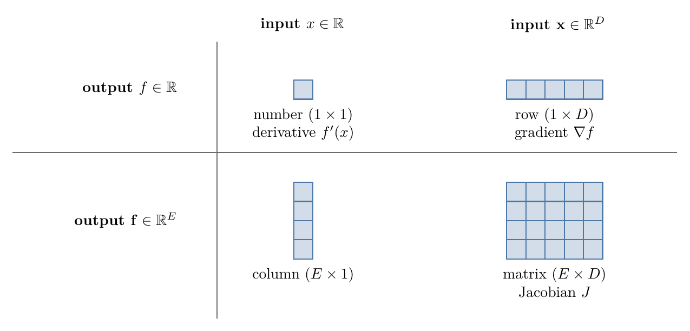
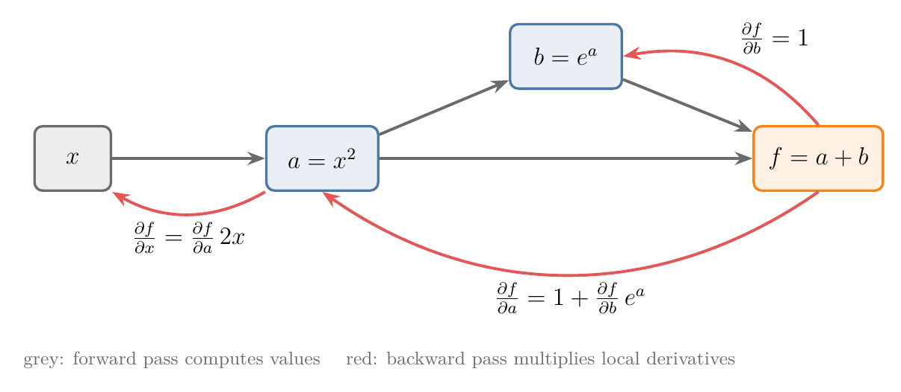

<!-- where-this-fits: generated by course_map/build_map.py; edit concepts.yaml, not this block -->
> **Where this fits:** Pipeline map step 0 (Foundations). See the [Course map](../01-course-map/note.md).
>
> 
>
> - **Builds on:** Linear transformations and matrices ([Note 500](../500-linear-transformations-and-matrices/note.md)); Matrix multiplication as composition ([Note 510](../510-matrix-multiplication-as-composition/note.md)); Partial derivatives and gradients ([Note 601](../601-partial-derivatives-and-gradients/note.md)).
<!-- /where-this-fits -->

## 1. Overview

> **Key point:** For a function with several outputs, the derivative is a matrix, the Jacobian: one row per output, one column per input. Near a point, the function acts like the linear map of that matrix.

This Note follows Chapter 5 (Sections 5.3 to 5.6) of *Mathematics for Machine Learning* (Deisenroth, Faisal and Ong, 2020).


Figure 1 shows the main idea. A function of several outputs moves points of the plane, like the linear transformations of the [linear transformations and matrices Note](../500-linear-transformations-and-matrices/note.md). But it bends the grid. Zoom in on one small cell, though, and the bending almost disappears: the cell lands on something very close to a parallelogram. That parallelogram is drawn by a matrix, the Jacobian.

The [partial derivatives and gradients Note](../601-partial-derivatives-and-gradients/note.md) handled functions with one output. Here we allow many outputs (Sections 2 to 6), apply this to the least-squares loss (Section 7), take a short look at derivatives with respect to matrices (Sections 8 and 9), and preview how deep learning libraries compute gradients (Section 10).

## 2. Functions with several outputs

> **Key point:** $\mathbf{f}: \mathbb{R}^n \to \mathbb{R}^m$ is a stack of $m$ ordinary functions $f_1, \dots, f_m$, each with $n$ inputs.

A **vector-valued function** takes $n$ numbers in and gives $m$ numbers out. We can always read it as $m$ separate functions stacked on top of each other:

$$\mathbf{f}(\mathbf{x}) = \begin{bmatrix} f_1(\mathbf{x}) \\ \vdots \\ f_m(\mathbf{x}) \end{bmatrix} \in \mathbb{R}^m, \qquad f_i: \mathbb{R}^n \to \mathbb{R}$$

Each $f_i$ has its own gradient, computed exactly as in the previous Note. Our running example is **polar coordinates**: a radius $r$ and an angle $\theta$ go in, a point $(x, y)$ of the plane comes out.

$$\mathbf{f}(r, \theta) = \begin{bmatrix} r\cos\theta \\ r\sin\theta \end{bmatrix}$$

At $r = 2$, $\theta = \pi/6$ (30°), the output is $(2 \times 0.866,\ 2 \times 0.5) = (1.732,\ 1)$, the black dot of Figure 1.

ML is full of such functions: a neural network layer turns a vector of inputs into a vector of outputs, and so does a prediction for all rows of a dataset at once.

## 3. The Jacobian

> **Key point:** The Jacobian is the $m \times n$ matrix of all first partial derivatives: row $i$ is the gradient of output $f_i$, column $j$ says how all outputs respond to input $x_j$.

### 3.1 Collecting all partial derivatives

> **Key point:** Put the gradients of $f_1, \dots, f_m$ as rows on top of each other.

The partial derivative of $\mathbf{f}$ with respect to one input $x_j$ is a column: how each of the $m$ outputs responds to a nudge in $x_j$. Placing these $n$ columns side by side gives a matrix.

1. **In words:** entry $(i, j)$ is the partial derivative of output $i$ with respect to input $j$. Row $i$ is the gradient of $f_i$.
2. **Formula:** the **Jacobian** is
   $$J = \frac{d\mathbf{f}}{d\mathbf{x}} = \begin{bmatrix} \dfrac{\partial f_1}{\partial x_1} & \cdots & \dfrac{\partial f_1}{\partial x_n} \\ \vdots & & \vdots \\ \dfrac{\partial f_m}{\partial x_1} & \cdots & \dfrac{\partial f_m}{\partial x_n} \end{bmatrix} \in \mathbb{R}^{m \times n}, \qquad J_{ij} = \frac{\partial f_i}{\partial x_j}$$
3. **Example:** for polar coordinates, differentiate each output with respect to $r$ and to $\theta$:
   $$J = \begin{bmatrix} \cos\theta & -r\sin\theta \\ \sin\theta & r\cos\theta \end{bmatrix}, \qquad J(2, \tfrac{\pi}{6}) = \begin{bmatrix} 0.866 & -1 \\ 0.5 & 1.732 \end{bmatrix}$$

This arrangement, outputs as rows and inputs as columns, is the **numerator layout**. Some texts use the transpose (the denominator layout); the numbers are the same, only flipped.

### 3.2 One picture of every shape

> **Key point:** Rows follow the outputs, columns follow the inputs; the derivative, the gradient and the Jacobian are all the same idea in different shapes.

The gradient of the previous Note is the special case of one output: a Jacobian with one row. Figure 2 sorts all four cases.

{height=32%}

Before computing any derivative, writing down its shape first catches most mistakes.

## 4. The Jacobian as the best local linear map

> **Key point:** Near a point $\mathbf{x}_0$, $\mathbf{f}(\mathbf{x}_0 + \boldsymbol{\delta}) \approx \mathbf{f}(\mathbf{x}_0) + J\boldsymbol{\delta}$: the function acts like the linear transformation $J$ on small steps.

### 4.1 Small steps are transformed by J

> **Key point:** A small step $\boldsymbol{\delta}$ in the input becomes, almost exactly, the step $J\boldsymbol{\delta}$ in the output.

The [linear transformations and matrices Note](../500-linear-transformations-and-matrices/note.md) read a matrix by its columns: where each basis vector lands. The Jacobian's columns say the same thing for small steps: column $j$ is where a small step along input $j$ lands, per unit of step.

1. **In words:** start from the output at $\mathbf{x}_0$ and add the Jacobian times the step.
2. **Formula:**
   $$\mathbf{f}(\mathbf{x}_0 + \boldsymbol{\delta}) \approx \mathbf{f}(\mathbf{x}_0) + J(\mathbf{x}_0)\,\boldsymbol{\delta}$$
3. **Example:** polar coordinates at $(2, \pi/6)$, step $\boldsymbol{\delta} = (0.1, 0.05)$:
   $$\begin{bmatrix} 1.732 \\ 1 \end{bmatrix} + \begin{bmatrix} 0.866 & -1 \\ 0.5 & 1.732 \end{bmatrix} \begin{bmatrix} 0.1 \\ 0.05 \end{bmatrix} = \begin{bmatrix} 1.732 + 0.037 \\ 1 + 0.137 \end{bmatrix} = \begin{bmatrix} 1.769 \\ 1.137 \end{bmatrix}$$
   The exact value $\mathbf{f}(2.1,\ \pi/6 + 0.05)$ is $(1.764,\ 1.140)$: off by only 0.005.

This is the tangent line of the [derivatives of one variable Note](../600-derivatives-of-one-variable/note.md), in several dimensions. Figure 1 shows it as a picture: the orange cell lands on a curved cell, and the green parallelogram spanned by the Jacobian's columns (each times the cell's side) almost covers it. The smaller the cell, the better the match.

### 4.2 For a linear function, the Jacobian is its matrix

> **Key point:** The Jacobian of $\mathbf{f}(\mathbf{x}) = A\mathbf{x}$ is $A$ itself, at every point.

1. **In words:** output $i$ is $f_i = A_{i1}x_1 + \dots + A_{in}x_n$, so its partial derivative with respect to $x_j$ is just the number $A_{ij}$.
2. **Formula:** for $A \in \mathbb{R}^{m \times n}$,
   $$\frac{d}{d\mathbf{x}}\,A\mathbf{x} = A$$
3. **Example:** for the matrix of the [linear transformations and matrices Note](../500-linear-transformations-and-matrices/note.md), $A$ with rows $[1, 3]$ and $[-2, 0]$, we have $f_1 = x_1 + 3x_2$ and $f_2 = -2x_1$, so
   $$J = \begin{bmatrix} 1 & 3 \\ -2 & 0 \end{bmatrix} = A$$

A linear map needs no approximation: the "best local linear map" is the map itself. This is the matrix version of "the derivative of $ax$ is $a$".

## 5. The Jacobian determinant: how areas scale

> **Key point:** $|\det J|$ is the factor by which the function stretches small areas (or volumes) near a point.

The [eigenvectors and eigenvalues Note](../530-eigenvectors-and-eigenvalues/note.md) introduced the **determinant**: the factor by which a linear transformation scales areas. Since the Jacobian is the local linear map, its determinant tells how much $\mathbf{f}$ scales small areas near a point.

1. **In words:** a tiny region of area $\Delta A$ around $\mathbf{x}_0$ lands on a region of area about $|\det J(\mathbf{x}_0)|\,\Delta A$.
2. **Formula:** the **Jacobian determinant** for polar coordinates is
   $$\det J = \cos\theta \cdot r\cos\theta - (-r\sin\theta)\sin\theta = r(\cos^2\theta + \sin^2\theta) = r$$
3. **Example:** the orange cell of Figure 1 has sides $\Delta r = 0.4$ and $\Delta\theta = 0.2$, area $0.08$ in the input. It sits around $r \approx 2.2$, so it lands on an area of about $2.2 \times 0.08 = 0.176$ (here the exact area is also 0.176).

So polar coordinates stretch cells more the further they are from the origin: in Figure 1, cells on the outer arcs are bigger. For a linear map, $\det J = \det A$ everywhere: $A$ above has $\det A = 1 \cdot 0 - 3 \cdot (-2) = 6$, so every area grows 6 times.

> **Extra:** The Jacobian determinant is how probability densities change under a change of variables. If $\mathbf{y} = \mathbf{f}(\mathbf{x})$, probability in a small region must be kept, so the density of $\mathbf{y}$ is the density of $\mathbf{x}$ divided by $|\det J|$: where $\mathbf{f}$ stretches area, the same probability is spread thinner. Its one-dimensional form, "density is a derivative", appears in the [PDF and continuous CDF Note](../242-pdf-and-continuous-cdf/note.md). Generative models called normalizing flows are built on exactly this rule.

## 6. The chain rule with Jacobians

> **Key point:** The derivative of a composition is the product of the Jacobians, in the same order as the functions: $J_{\mathbf{f} \circ \mathbf{g}} = J_{\mathbf{f}}\,J_{\mathbf{g}}$.

The [partial derivatives and gradients Note](../601-partial-derivatives-and-gradients/note.md) (Section 6) wrote the multivariate chain rule as a row gradient times a matrix of inner derivatives. That matrix was a Jacobian, and the rule holds for any shapes.

1. **In words:** multiply the Jacobian of the outer function (at the inner output) by the Jacobian of the inner function. The inner sizes must match, like any matrix product.
2. **Formula:** for $\mathbf{g}: \mathbb{R}^n \to \mathbb{R}^k$ and $\mathbf{f}: \mathbb{R}^k \to \mathbb{R}^m$,
   $$\underbrace{\frac{d\,\mathbf{f}(\mathbf{g}(\mathbf{x}))}{d\mathbf{x}}}_{m \times n} = \underbrace{\frac{\partial \mathbf{f}}{\partial \mathbf{g}}}_{m \times k}\ \underbrace{\frac{\partial \mathbf{g}}{\partial \mathbf{x}}}_{k \times n}$$
3. **Example:** $h(t) = f(\mathbf{g}(t))$ with $f(\mathbf{x}) = x_1 x_2^2$ and $\mathbf{g}(t) = [2t,\ t + 1]$. At $t = 1$, $\mathbf{x} = (2, 2)$. Shapes: $\partial f/\partial \mathbf{x}$ is $1 \times 2$, $\partial \mathbf{g}/\partial t$ is $2 \times 1$.
   $$\frac{dh}{dt} = \begin{bmatrix} x_2^2 & 2x_1x_2 \end{bmatrix} \begin{bmatrix} 2 \\ 1 \end{bmatrix} = \begin{bmatrix} 4 & 8 \end{bmatrix} \begin{bmatrix} 2 \\ 1 \end{bmatrix} = 16$$
   Directly: $h(t) = 2t(t + 1)^2$ has $h'(t) = 2(t + 1)^2 + 4t(t + 1)$, which is $8 + 8 = 16$ at $t = 1$.

This is the [matrix multiplication as composition Note](../510-matrix-multiplication-as-composition/note.md) again, zoomed in: near a point each function is a linear map, and doing one linear map after another multiplies their matrices.

## 7. Example: the gradient of the least-squares loss

> **Key point:** Splitting $L(\boldsymbol{\theta}) = \lVert \mathbf{y} - \Phi\boldsymbol{\theta} \rVert^2$ into an error vector and its squared length, the chain rule gives $\partial L/\partial \boldsymbol{\theta} = -2\mathbf{e}^{\mathsf T}\Phi$.

The [multiple linear regression maths Note](../54-multiple-lr-maths/note.md) differentiated the squared error by expanding it and applying two rules of **matrix calculus**. The chain rule gives the same result in three short steps, and the steps scale to models that are too deep to expand.

The model is $\hat{\mathbf{y}} = \Phi\boldsymbol{\theta}$, with $\Phi$ the $N \times D$ data matrix (one row per data point) and $\boldsymbol{\theta}$ the $D$ parameters. Define two functions:

$$\mathbf{e}(\boldsymbol{\theta}) = \mathbf{y} - \Phi\boldsymbol{\theta} \quad (N \text{ errors}), \qquad L(\mathbf{e}) = \lVert \mathbf{e} \rVert^2 = \mathbf{e}^{\mathsf T}\mathbf{e} \quad (\text{one number})$$

1. **In words:** first find the shapes, then the two pieces, then multiply.
   - $\partial L/\partial \boldsymbol{\theta}$ will be $1 \times D$ (one output, $D$ inputs).
   - $\partial L/\partial \mathbf{e} = 2\mathbf{e}^{\mathsf T}$, a $1 \times N$ row: the derivative of $e_1^2 + \dots + e_N^2$ with respect to each $e_n$ is $2e_n$.
   - $\partial \mathbf{e}/\partial \boldsymbol{\theta} = -\Phi$, an $N \times D$ matrix: the Jacobian of a linear function (Section 4.2), with a minus sign.
2. **Formula:**
   $$\frac{\partial L}{\partial \boldsymbol{\theta}} = \underbrace{\frac{\partial L}{\partial \mathbf{e}}}_{1 \times N}\ \underbrace{\frac{\partial \mathbf{e}}{\partial \boldsymbol{\theta}}}_{N \times D} = -2\,\mathbf{e}^{\mathsf T}\Phi = -2(\mathbf{y} - \Phi\boldsymbol{\theta})^{\mathsf T}\Phi$$
3. **Example:** the three points of the gradient checking example in the [partial derivatives and gradients Note](../601-partial-derivatives-and-gradients/note.md), with a column of ones for the intercept, $\boldsymbol{\theta} = [b, m] = [0, 1]$:
   $$\Phi = \begin{bmatrix} 1 & 1 \\ 1 & 2 \\ 1 & 3 \end{bmatrix}, \quad \mathbf{y} = \begin{bmatrix} 2 \\ 4 \\ 5 \end{bmatrix}, \quad \mathbf{e} = \begin{bmatrix} 1 \\ 2 \\ 2 \end{bmatrix}, \quad -2\,\mathbf{e}^{\mathsf T}\Phi = -2\,[5,\ 11] = [-10,\ -22]$$
   These are $\partial L/\partial b = -10$ and $\partial L/\partial m = -22$, exactly the values found there by hand.

Transposed, $-2\Phi^{\mathsf T}(\mathbf{y} - \Phi\boldsymbol{\theta}) = 2\Phi^{\mathsf T}\Phi\boldsymbol{\theta} - 2\Phi^{\mathsf T}\mathbf{y}$, the column form of the [multiple linear regression maths Note](../54-multiple-lr-maths/note.md). Setting it to zero gives the normal equation.

> **Python:**
>
> ```python
> import numpy as np
>
> Phi = np.array([[1.0, 1.0], [1.0, 2.0], [1.0, 3.0]])
> y = np.array([2.0, 4.0, 5.0])
> theta = np.array([0.0, 1.0])
>
> e = y - Phi @ theta          # [1, 2, 2]
> dL_de = 2 * e                # the 1 x N piece
> de_dtheta = -Phi             # the N x D piece
> dL_de @ de_dtheta            # [-10, -22]
> ```

## 8. Gradients of matrices

> **Key point:** A derivative of a matrix, or with respect to a matrix, has more than two indices: a tensor. In practice we flatten the matrices into long vectors so the Jacobian stays an ordinary matrix.

Some models need derivatives with respect to a whole weight matrix, such as a neural network layer's $W$. Counting indices shows the shape:

- an $m \times n$ matrix differentiated with respect to a vector of length $p$ gives an $m \times n \times p$ array;
- an $m \times n$ matrix differentiated with respect to a $p \times q$ matrix gives an $m \times n \times p \times q$ array, with entries $\partial A_{ij}/\partial B_{kl}$.

Arrays with more than two indices are **tensors** (see the [tensors Note](../11-tensors/note.md)).

There are two equivalent ways to handle them:

- **Collect partial derivatives into a tensor.** Each partial derivative is a matrix; stack them along a new axis.
- **Flatten first.** Reshape each matrix into one long vector (an $m \times n$ matrix becomes a vector of $mn$ numbers), compute an ordinary $mn \times pq$ Jacobian, and reshape back if needed. The chain rule is then plain matrix multiplication.

A small example: $\mathbf{f} = A\mathbf{x}$ with $A$ of size $2 \times 3$ and $\mathbf{x} = [1, 2, 3]$, differentiated with respect to $A$. Since $f_1 = A_{11}x_1 + A_{12}x_2 + A_{13}x_3$, the derivative of $f_1$ with respect to the entries of $A$ is $\mathbf{x}$ in the first row and zeros elsewhere:

$$\frac{\partial f_1}{\partial A} = \begin{bmatrix} 1 & 2 & 3 \\ 0 & 0 & 0 \end{bmatrix}, \qquad \frac{\partial f_2}{\partial A} = \begin{bmatrix} 0 & 0 & 0 \\ 1 & 2 & 3 \end{bmatrix}$$

Stacked, these form a $2 \times 2 \times 3$ tensor. Each output depends only on its own row of $A$; this is why the gradient of a layer's weights is built from its inputs $\mathbf{x}$.

## 9. Useful identities

> **Key point:** A handful of ready-made gradients cover most ML derivations, the same way a table of basic derivatives covers one-variable calculus.

Gradients in the row (numerator) layout, for a variable vector $\mathbf{x}$, a variable matrix $X$, and fixed $\mathbf{a}$, $\mathbf{b}$, $B$:

| Expression | Gradient | One-variable analogue |
|---|---|---|
| $\mathbf{a}^{\mathsf T}\mathbf{x}$ or $\mathbf{x}^{\mathsf T}\mathbf{a}$ | $\mathbf{a}^{\mathsf T}$ | $(ax)' = a$ |
| $A\mathbf{x}$ | $A$ | $(ax)' = a$ |
| $\mathbf{x}^{\mathsf T}B\mathbf{x}$ | $\mathbf{x}^{\mathsf T}(B + B^{\mathsf T})$ | $(bx^2)' = 2bx$ |
| $\mathbf{a}^{\mathsf T}X\mathbf{b}$ (with respect to $X$) | $\mathbf{a}\mathbf{b}^{\mathsf T}$ | $(axb)' = ab$ |
| $(\mathbf{x} - A\mathbf{s})^{\mathsf T}W(\mathbf{x} - A\mathbf{s})$ (with respect to $\mathbf{s}$, $W$ symmetric) | $-2(\mathbf{x} - A\mathbf{s})^{\mathsf T}WA$ | weighted least squares |

The third row deserves a worked check.

1. **In words:** a quadratic form behaves like $bx^2$, but $B$ and $B^{\mathsf T}$ both contribute; for symmetric $B$ the gradient is $2\mathbf{x}^{\mathsf T}B$.
2. **Formula:**
   $$\frac{\partial}{\partial \mathbf{x}}\,\mathbf{x}^{\mathsf T}B\mathbf{x} = \mathbf{x}^{\mathsf T}(B + B^{\mathsf T})$$
3. **Example:** $B$ with rows $[2, 1]$ and $[0, 3]$, at $\mathbf{x} = [1, 2]$. Then $B + B^{\mathsf T}$ has rows $[4, 1]$ and $[1, 6]$, so
   $$\mathbf{x}^{\mathsf T}(B + B^{\mathsf T}) = [1 \cdot 4 + 2 \cdot 1,\ \ 1 \cdot 1 + 2 \cdot 6] = [6,\ 13]$$
   Multiplied out, $\mathbf{x}^{\mathsf T}B\mathbf{x} = 2x_1^2 + x_1x_2 + 3x_2^2$ has partial derivatives $4x_1 + x_2 = 6$ and $x_1 + 6x_2 = 13$.

The bowl of the [partial derivatives and gradients Note](../601-partial-derivatives-and-gradients/note.md), $x_1^2 + x_1x_2 + 2x_2^2$, is $\mathbf{x}^{\mathsf T}B\mathbf{x}$ with the symmetric $B$ of rows $[1, 0.5]$ and $[0.5, 2]$; the rule gives $2\mathbf{x}^{\mathsf T}B = [2x_1 + x_2,\ x_1 + 4x_2]$, its gradient. The table of the [multiple linear regression maths Note](../54-multiple-lr-maths/note.md) holds the same rules written as columns.

> **Extra:** Reference tables also list rules for traces, determinants and inverses of matrices that depend on $X$, for example
>
> $$\frac{\partial}{\partial X}\det(X) = \det(X)\,(X^{-1})^{\mathsf T}, \qquad \frac{\partial}{\partial X}\,\mathbf{a}^{\mathsf T}X^{-1}\mathbf{b} = -(X^{-1})^{\mathsf T}\mathbf{a}\mathbf{b}^{\mathsf T}(X^{-1})^{\mathsf T}$$
>
> They appear when fitting covariance matrices, as in Gaussian models. The standard collection is *The Matrix Cookbook* (Petersen and Pedersen).

## 10. Preview: backpropagation and automatic differentiation

> **Key point:** A deep network is a long chain of functions, so its gradient is a long product of Jacobians; backpropagation computes that product from the loss backwards, reusing every intermediate result.

A neural network computes its output as a composition of layers, $\mathbf{f}_K(\cdots \mathbf{f}_2(\mathbf{f}_1(\mathbf{x})))$, each layer with its own weights. By Section 6, the gradient of the loss with respect to the weights of an early layer is a product of the Jacobians of all later layers. Writing that product as one formula quickly becomes enormous.

The practical method breaks the function into elementary steps, a **computation graph**, and applies the chain rule one step at a time. Figure 3 does this for $f(x) = x^2 + e^{x^2}$.

{height=30%}

1. **In words:** compute and keep every intermediate value going forward; then, starting from $\partial f/\partial f = 1$, multiply by each step's local derivative going backward, adding where two paths meet.
2. **Formula:** with $a = x^2$ and $b = e^a$,
   $$\frac{\partial f}{\partial b} = 1, \qquad \frac{\partial f}{\partial a} = 1 + \frac{\partial f}{\partial b}\,e^{a}, \qquad \frac{\partial f}{\partial x} = \frac{\partial f}{\partial a}\,2x$$
3. **Example:** at $x = 1$: forward, $a = 1$, $b = e = 2.718$, $f = 3.718$. Backward, $\partial f/\partial b = 1$, $\partial f/\partial a = 1 + 2.718 = 3.718$, $\partial f/\partial x = 3.718 \times 2 = 7.437$. The formula $f'(x) = 2x + 2x\,e^{x^2}$ gives $2 + 2e = 7.437$.

Each backward step costs about as much as the forward step it mirrors, so the whole gradient costs about as much as computing $f$ once. This backward pass is **backpropagation**; done automatically by software for any program, it is **automatic differentiation** (reverse mode). Backpropagation is taught in full with neural networks, in the Deep Learning Notes.

> **Extra:** Automatic differentiation is neither symbolic differentiation (which writes out a formula for $f'$) nor a numerical difference quotient (which only estimates it). It gives the exact derivative, up to rounding, by applying the chain rule to the actual operations a program runs. It has a **forward mode**, which multiplies the Jacobians from the input side, and a **reverse mode**, which starts from the output. With millions of inputs (weights) and one output (the loss), the reverse mode is far cheaper, which is why every deep learning library uses it.

## 11. Summary

| Object | Shape | Example |
|---|---|---|
| Jacobian $J = d\mathbf{f}/d\mathbf{x}$ of $\mathbf{f}: \mathbb{R}^n \to \mathbb{R}^m$ | $m \times n$ | polar at $(2, \pi/6)$: rows $[0.866, -1]$, $[0.5, 1.732]$ |
| Jacobian of $A\mathbf{x}$ | $m \times n$ | $A$ |
| Jacobian determinant | number | polar: $r$; linear: $\det A$ |
| Chain rule $J_{\mathbf{f} \circ \mathbf{g}} = J_{\mathbf{f}}J_{\mathbf{g}}$ | $(m \times k)(k \times n)$ | $[4, 8] \cdot [2, 1]^{\mathsf T} = 16$ |
| Least-squares gradient | $1 \times D$ | $-2\mathbf{e}^{\mathsf T}\Phi = [-10, -22]$ |
| Gradient with respect to a matrix | tensor | flatten to keep it a matrix |

- A vector-valued function is a stack of ordinary functions; its Jacobian stacks their gradients as rows.
- Near a point, the function acts like the linear map $J$: $\mathbf{f}(\mathbf{x}_0 + \boldsymbol{\delta}) \approx \mathbf{f}(\mathbf{x}_0) + J\boldsymbol{\delta}$.
- $|\det J|$ is the local area (volume) scaling factor.
- The chain rule multiplies Jacobians; checking shapes first prevents most mistakes.
- Backpropagation applies this chain rule backward through a computation graph.

## 12. Key terms

| Term | Meaning |
|---|---|
| Vector-valued function | $\mathbf{f}: \mathbb{R}^n \to \mathbb{R}^m$: several numbers in, several numbers out; a stack of $m$ ordinary functions |
| Jacobian | The $m \times n$ matrix of all first partial derivatives, $J_{ij} = \partial f_i/\partial x_j$ |
| Numerator layout | Writing derivatives with outputs as rows and inputs as columns |
| Polar coordinates | Describing a point by its distance $r$ from the origin and its angle $\theta$: $(r\cos\theta, r\sin\theta)$ |
| Local linear map | The linear transformation a smooth function behaves like near a point; its matrix is the Jacobian |
| Jacobian determinant | $\det J$: the factor by which a function scales small areas or volumes near a point |
| Chain rule with Jacobians | The Jacobian of a composition is the product of the Jacobians, in the same order |
| Least-squares loss | $\lVert \mathbf{y} - \Phi\boldsymbol{\theta} \rVert^2$; its gradient is $-2(\mathbf{y} - \Phi\boldsymbol{\theta})^{\mathsf T}\Phi$ |
| Flattening | Reshaping a matrix into one long vector so that derivatives stay matrices |
| Quadratic form | $\mathbf{x}^{\mathsf T}B\mathbf{x}$; its gradient is $\mathbf{x}^{\mathsf T}(B + B^{\mathsf T})$ |
| Computation graph | A function broken into elementary steps, each a node, with arrows for the flow of values |
| Backpropagation | Computing the gradient of a loss by applying the chain rule backward through the computation graph |
| Automatic differentiation | Software that computes exact derivatives of a program by the chain rule on its elementary operations; reverse mode is backpropagation |
