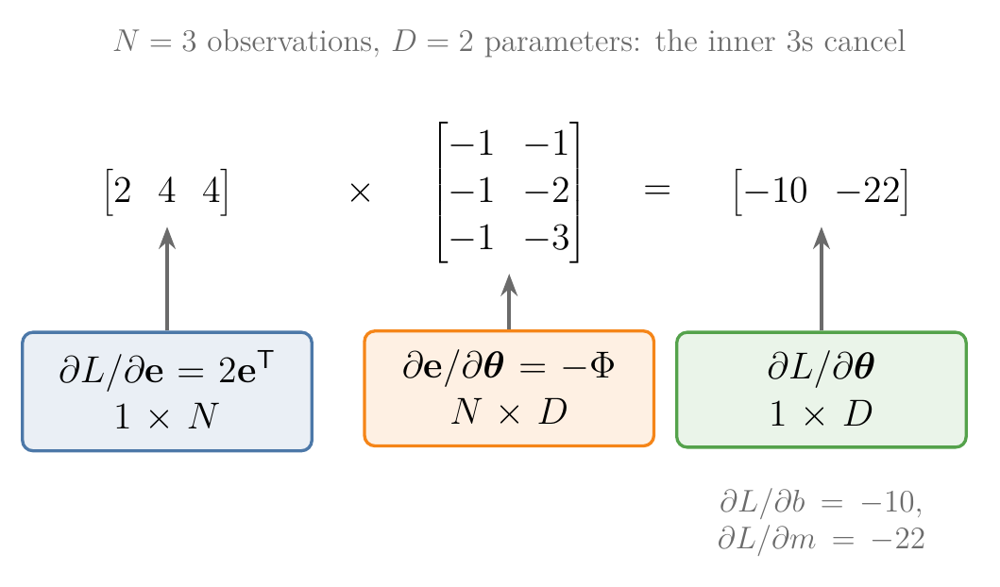

<!-- where-this-fits: generated by course_map/build_map.py; edit concepts.yaml, not this block -->
> **Where this fits:** Pipeline map step 0 (Foundations). See the [Course map](../01-course-map/note.md).
>
> 
>
> - **Builds on:** Linear transformations and matrices ([Note 500](../500-linear-transformations-and-matrices/note.md)); Matrix multiplication as composition ([Note 510](../510-matrix-multiplication-as-composition/note.md)); Partial derivatives and gradients ([Note 601](../601-partial-derivatives-and-gradients/note.md)).
> - **Leads to:** Memoization ([Note 1019](../1019-mlp-memoization/note.md)).
<!-- /where-this-fits -->

## 1. Overview

> **Key point:** For a function with several outputs, the derivative is a matrix, the Jacobian: one row per output, one column per input. Near a point, the function acts like the linear map of that matrix.


Figure 1 shows the main idea. A function of several outputs moves points of the plane, like the linear transformations of the [linear transformations and matrices Note](../500-linear-transformations-and-matrices/note.md). But it bends the grid. Zoom in on one small cell, though, and the bending almost disappears: the cell lands on something very close to a parallelogram. That parallelogram is drawn by a matrix, the Jacobian.

The [partial derivatives and gradients Note](../601-partial-derivatives-and-gradients/note.md) handled functions with one output. In this Note we:

- watch a function with several outputs bend a grid, and zoom in until it looks linear (Sections 2 and 3);
- build the matrix of that linear look, the Jacobian, from two tiny steps (Section 4);
- read its determinant as an area factor (Section 5) and chain Jacobians together (Section 6);
- apply this to the least-squares loss (Section 7);
- take a short look at derivatives with respect to matrices (Sections 8 and 9);
- preview how deep learning libraries compute gradients (Section 10).

## 2. Functions that bend the grid

> **Key point:** $\mathbf{f}: \mathbb{R}^n \to \mathbb{R}^m$ is a stack of $m$ ordinary functions $f_1, \dots, f_m$, each with $n$ inputs. With two inputs and two outputs, it moves every point of the plane, and usually bends the grid.

### 2.1 Recap: a matrix moves a grid

A $2 \times 2$ matrix moves every point of the plane so that grid lines stay straight, parallel and evenly spaced: a **linear transformation** (G-1097). Its first column is where $\hat{\imath}$ lands and its second column is where $\hat{\jmath}$ lands. The [linear transformations and matrices Note](../500-linear-transformations-and-matrices/note.md) teaches this picture; we use it throughout.

### 2.2 Functions with several outputs

A **vector-valued function** (G-2082) takes $n$ numbers in and gives $m$ numbers out. We can always read it as $m$ separate functions stacked on top of each other:

$$\mathbf{f}(\mathbf{x}) = \begin{bmatrix} f_1(\mathbf{x}) \cr\vdots \cr f_m(\mathbf{x}) \end{bmatrix} \in \mathbb{R}^m, \qquad f_i: \mathbb{R}^n \to \mathbb{R}$$

Each $f_i$ has its own gradient, computed exactly as in the previous Note. Our running example is **polar coordinates** (G-1511): a radius $r$ and an angle $\theta$ go in, a point $(x, y)$ of the plane comes out.

$$\mathbf{f}(r, \theta) = \begin{bmatrix} r\cos\theta \cr r\sin\theta \end{bmatrix}$$

At $r = 2$, $\theta = \pi/6$ (30°), the output is $(2 \times 0.866,\ 2 \times 0.5) = (1.732,\ 1)$, the black dot of Figure 1.

Like a matrix, $\mathbf{f}$ moves every point of a grid. Unlike a matrix, it bends the grid: in Figure 1 the straight lines of constant $\theta$ become rays, and the straight lines of constant $r$ become arcs of circles. So $\mathbf{f}$ is not linear, and no single $2 \times 2$ matrix describes it everywhere.

ML is full of such functions: a neural network layer turns a vector of inputs into a vector of outputs, and so does a prediction for all **observations** (G-1374) (records, one row of the data table each) of a dataset at once.

## 3. Zoom in: the function looks linear

> **Key point:** Around any one point, a smooth function looks more and more like a linear transformation the further we zoom in. That linear transformation is its **local linear map** (G-1108).

Follow one point while $\mathbf{f}$ moves the grid, and zoom in on a small cell around it. The rays and arcs are still curved, but over a tiny region they are almost straight, almost parallel and almost evenly spaced: the three signs of a linear transformation from Section 2.1. The smaller the region, the better the match. A function that behaves like this is called **locally linear** (G-2250).


In Figure 2, watch the gap between the orange and green outlines: at full size the curved cell sticks out, but with sides 20 times smaller the two outlines coincide. Zoomed in far enough, the function is a linear map. A linear map of the plane is a $2 \times 2$ matrix, which raises the question of the next section: which matrix?

## 4. The Jacobian

> **Key point:** The Jacobian is the $m \times n$ matrix of all first partial derivatives: column $j$ is where a tiny step along input $j$ lands, divided by the step's size; row $i$ is the gradient of output $f_i$.

### 4.1 Two tiny steps give the two columns

> **Key point:** Take a tiny step along each input, see where it lands, and divide by the step's size. The results are the matrix's columns.

A matrix is known once we know where $\hat{\imath}$ and $\hat{\jmath}$ land (Section 2.1). Near a point, the role of $\hat{\imath}$ is played by a tiny step along the first input, and the role of $\hat{\jmath}$ by a tiny step along the second.

1. **In words:** from the point $(r, \theta) = (2, \pi/6)$, take a step of size $h$ along $r$. It lands as a small step in the output plane. That step shrinks with $h$, so we divide it by $h$: the result keeps a normal size however far we zoom. Then do the same with a step along $\theta$.
2. **Example**, with the Note's numbers (Figure 3):
   - Step along $r$: $\mathbf{f}(2 + h, \pi/6) - \mathbf{f}(2, \pi/6) = h\thinspace(0.866,\ 0.5)$, because moving out along a ray is straight. Divided by $h$, it is $(0.866,\ 0.5)$ for every $h$. This is the first column.
   - Step along $\theta$: with $h = 0.6$, the step lands at $(-0.867,\ 0.803)$ from the dot; divided by $0.6$ that is $(-1.445,\ 1.339)$. The arc curves, so the answer depends on $h$. With $h = 0.01$ it is $(-1.009,\ 1.727)$, and as $h$ shrinks it settles on $(-1,\ 1.732)$. This is the second column.
3. **Formal version:** a step divided by its size, as the size shrinks to zero, is a derivative. For the first column it is $\partial\mathbf{f}/\partial r$, the partial derivatives of both outputs with respect to $r$; for the second, $\partial\mathbf{f}/\partial\theta$.


In Figure 3, watch the green arrow while $h$ shrinks. For the step along $r$ it never moves. For the step along $\theta$ it starts too short and too flat, then turns and grows until it stops at $(-1, 1.732)$.

### 4.2 The formula: every partial derivative in one grid

> **Key point:** Put the gradients of $f_1, \dots, f_m$ as rows on top of each other.

Each column of Section 4.1 holds the partial derivatives of all $m$ outputs with respect to one input. Placing the $n$ columns side by side gives a matrix.

1. **In words:** entry $(i, j)$ is the partial derivative of output $i$ with respect to input $j$. Row $i$ is the **gradient** (G-863) of $f_i$.
2. **Formula:** the **Jacobian** (G-980) is
   $$J = \frac{d\mathbf{f}}{d\mathbf{x}} = \begin{bmatrix} \dfrac{\partial f_1}{\partial x_1} & \cdots & \dfrac{\partial f_1}{\partial x_n} \cr\vdots & & \vdots \cr\dfrac{\partial f_m}{\partial x_1} & \cdots & \dfrac{\partial f_m}{\partial x_n} \end{bmatrix} \in \mathbb{R}^{m \times n}, \qquad J_{ij} = \frac{\partial f_i}{\partial x_j}$$
3. **Example:** for polar coordinates, differentiate each output with respect to $r$ and to $\theta$:
   $$J = \begin{bmatrix} \cos\theta & -r\sin\theta \cr\sin\theta & r\cos\theta \end{bmatrix}, \qquad J(2, \tfrac{\pi}{6}) = \begin{bmatrix} 0.866 & -1 \cr0.5 & 1.732 \end{bmatrix}$$
   The two columns are exactly the two green arrows of Figure 3.

This arrangement, outputs as rows and inputs as columns, is the **numerator layout** (G-1366). Some texts use the transpose (the denominator layout); the numbers are the same, only flipped.

### 4.3 One picture of every shape

> **Key point:** Rows follow the outputs, columns follow the inputs; the derivative, the gradient and the Jacobian are all the same idea in different shapes.

The gradient of the previous Note is the special case of one output: a Jacobian with one row. Figure 4 sorts all four cases.

{height=32%}

Before computing any derivative, we write down its shape: a chain-rule product whose shapes do not fit is certainly wrong.

### 4.4 Small steps are transformed by J

> **Key point:** Near a point $\mathbf x_0$, $\mathbf{f}(\mathbf x_0 + \boldsymbol{\delta}) \approx \mathbf{f}(\mathbf x_0) + J\boldsymbol{\delta}$: the function acts like the linear transformation $J$ on small steps.

Section 4.1 found where steps along each input land. A step in any direction is a mix of the two, so, as for any matrix, it lands on the same mix of the two columns: $J\boldsymbol{\delta}$.

1. **In words:** start from the output at $\mathbf x_0$ and add the Jacobian times the step.
2. **Formula:**
   $$\mathbf{f}(\mathbf x_0 + \boldsymbol{\delta}) \approx \mathbf{f}(\mathbf x_0) + J(\mathbf x_0)\thinspace\boldsymbol{\delta}$$
3. **Example:** polar coordinates at $(2, \pi/6)$, step $\boldsymbol{\delta} = (0.1, 0.05)$:
   $$\begin{bmatrix} 1.732 \cr1 \end{bmatrix} + \begin{bmatrix} 0.866 & -1 \cr0.5 & 1.732 \end{bmatrix} \begin{bmatrix} 0.1 \cr0.05 \end{bmatrix} = \begin{bmatrix} 1.732 + 0.037 \cr1 + 0.137 \end{bmatrix} = \begin{bmatrix} 1.769 \cr1.137 \end{bmatrix}$$
   The exact value $\mathbf{f}(2.1,\ \pi/6 + 0.05)$ is $(1.764,\ 1.140)$: off by only 0.005.

This **linearisation** (G-1099) is the **tangent line** (G-1945) of the [derivatives of one variable Note](../600-derivatives-of-one-variable/note.md), in several dimensions. Figure 1 shows it as a picture: the orange cell lands on a curved cell, and the green parallelogram spanned by the Jacobian's columns (each times the cell's side) almost covers it. The smaller the cell, the better the match, as Figure 2 showed.

### 4.5 For a linear function, the Jacobian is its matrix

> **Key point:** The Jacobian of $\mathbf{f}(\mathbf{x}) = A\mathbf{x}$ is $A$ itself, at every point.

1. **In words:** output $i$ is $f_i = A_{i1}x_1 + \dots + A_{in}x_n$, so its partial derivative with respect to $x_j$ is just the number $A_{ij}$.
2. **Formula:** for $A \in \mathbb{R}^{m \times n}$,
   $$\frac{d}{d\mathbf{x}}\thinspace A\mathbf{x} = A$$
3. **Example:** for the matrix of the [linear transformations and matrices Note](../500-linear-transformations-and-matrices/note.md), $A$ with rows $[1, 3]$ and $[-2, 0]$, we have $f_1 = x_1 + 3x_2$ and $f_2 = -2x_1$, so
   $$J = \begin{bmatrix} 1 & 3 \cr-2 & 0 \end{bmatrix} = A$$

A linear map needs no approximation: the "best local linear map" is the map itself. The statement is the matrix version of "the derivative of $ax$ is $a$".

## 5. The Jacobian determinant: how areas scale

> **Key point:** $|\det J|$ is the factor by which the function stretches small areas (or volumes) near a point. It can differ from point to point: more than 1 stretches, less than 1 squashes.

### 5.1 Recap: the determinant is an area factor

The [eigenvectors and eigenvalues Note](../530-eigenvectors-and-eigenvalues/note.md) introduced the **determinant** (G-598): the factor by which a linear transformation scales every area. A unit square becomes a parallelogram, and the parallelogram's area is $|\det|$. If $\hat{\jmath}$ ends up on the other side of $\hat{\imath}$, the plane has been flipped over like a sheet of paper; this reversed **orientation** (G-2251) makes the determinant negative.

![The unit square under $A$ (rows $[1, 3]$, $[-2, 0]$) becomes a parallelogram of area 6. Then $\hat{\imath}$ swings towards $\hat{\jmath}$: the area shrinks to 0 when they line up, and past that point the square flips over and the determinant turns negative (red). Idea after 3Blue1Brown, "The determinant | Chapter 6, Essence of linear algebra"](images/det_sign.gif)

In Figure 5, watch the readout as $\hat{\imath}$ swings: $\det = \cos$ of its angle falls from 1 to 0 as the square flattens into a line, then keeps falling below 0 as the square turns over. For the matrix $A$ of Section 4.5, $\det A = 1 \cdot 0 - 3 \cdot (-2) = 6$, so every area grows 6 times.

### 5.2 det J: how a function scales small areas

Since the Jacobian is the local linear map, its determinant tells how much $\mathbf{f}$ scales small areas near a point.

1. **In words:** a tiny region of area $\Delta A$ around $\mathbf x_0$ lands on a region of area about $|\det J(\mathbf x_0)|\thinspace\Delta A$.
2. **Formula:** the **Jacobian determinant** (G-979) for polar coordinates is
   $$\det J = \cos\theta \cdot r\cos\theta - (-r\sin\theta)\sin\theta = r(\cos^2\theta + \sin^2\theta) = r$$
3. **Example:** the orange cell of Figure 1 has sides $\Delta r = 0.4$ and $\Delta\theta = 0.2$, area $0.08$ in the input. The cell sits around $r \approx 2.2$, so it lands on an area of about $2.2 \times 0.08 = 0.176$ (here the exact area is also 0.176).


So polar coordinates stretch cells more the further they are from the origin. In Figure 6, watch the input cell keep its size while its image grows: from 0.032 at $r = 0.4$ to 0.224 at $r = 2.8$, seven times larger, because $r$ is seven times larger. Near the origin, where $r < 1$, the cells shrink instead. For a linear map, $\det J = \det A$ everywhere.

### 5.3 Stretched at one point, squashed at another

A second map shows both cases side by side. Take

$$\mathbf{g}(x, y) = \begin{bmatrix} x + \sin y \cr y + \sin x \end{bmatrix}, \qquad J = \begin{bmatrix} 1 & \cos y \cr\cos x & 1 \end{bmatrix}, \qquad \det J = 1 - \cos x\cos y$$

1. **In words:** compute $\det J$ at each point of interest; above 1 the map stretches small areas there, below 1 it squashes them.
2. **Example:**
   - at $(-2, 1)$: $\cos(-2) = -0.416$ and $\cos 1 = 0.540$, so $\det J = 1 - (-0.416)(0.540) = 1.22$: areas grow by about a fifth;
   - at $(0, 1)$: $\cos 0 = 1$, so $\det J = 1 - 0.540 = 0.46$: areas shrink to less than half.


In Figure 7, watch the two insets while the grid bends: the orange square ends slightly larger than its dashed outline, the purple one clearly smaller, and the area readouts stop at the two values of $\det J$.

> **Extra:** The Jacobian determinant is how probability densities change under a change of variables. If $\mathbf{y} = \mathbf{f}(\mathbf{x})$, probability in a small region must be kept, so the density of $\mathbf{y}$ is the density of $\mathbf{x}$ divided by $|\det J|$: where $\mathbf{f}$ stretches area, the same probability is spread thinner (MML §6.7). Its one-dimensional form, "density is a derivative", appears in the [PDF and continuous CDF Note](../242-pdf-and-continuous-cdf/note.md). Generative models called normalizing flows are built on exactly this rule (Rezende and Mohamed 2015).

## 6. The chain rule with Jacobians

> **Key point:** The derivative of a composition is the product of the Jacobians, in the same order as the functions: $J_{\mathbf{f} \circ \mathbf{g}} = J_{\mathbf{f}}\thinspace J_{\mathbf{g}}$.

Start with the simplest case. A point moves along a path $\mathbf{v}(t) = (x(t), y(t))$, and we watch the value of a one-output function $f$ at that point.

1. **In words:** the value of $f$ changes because $x$ changes and because $y$ changes. Add the two effects: $\dfrac{\partial f}{\partial x}\dfrac{dx}{dt} + \dfrac{\partial f}{\partial y}\dfrac{dy}{dt}$. These are two products added, which is a **dot product** (G-634) of the gradient of $f$ with the path's velocity $\mathbf{v}'(t) = (dx/dt,\ dy/dt)$.
2. **Formula:** this is the **multivariate chain rule** (G-1281) of the [partial derivatives and gradients Note](../601-partial-derivatives-and-gradients/note.md) (Section 6), in vector form:
   $$\frac{d}{dt}\thinspace f(\mathbf{v}(t)) = \nabla f(\mathbf{v}(t)) \cdot \mathbf{v}'(t)$$
   It has the shape of the one-variable **chain rule** (G-371), $\tfrac{d}{dt} f(g(t)) = f'(g(t))\thinspace g'(t)$: the outer derivative, taken at the inner output, times the inner derivative. The same rule holds with 100 inputs instead of 2.
3. **Example:** $h(t) = f(\mathbf{g}(t))$ with $f(\mathbf{x}) = x_1 x_2^2$ and $\mathbf{g}(t) = [2t,\ t + 1]$. At $t = 1$, $\mathbf{x} = (2, 2)$. Shapes: $\partial f/\partial \mathbf{x}$ is $1 \times 2$, $\partial \mathbf{g}/\partial t$ is $2 \times 1$.
   $$\frac{dh}{dt} = \begin{bmatrix} x_2^2 & 2x_1x_2 \end{bmatrix} \begin{bmatrix} 2 \cr1 \end{bmatrix} = \begin{bmatrix} 4 & 8 \end{bmatrix} \begin{bmatrix} 2 \cr1 \end{bmatrix} = 16$$
   Directly: $h(t) = 2t(t + 1)^2$ has $h'(t) = 2(t + 1)^2 + 4t(t + 1)$, which is $8 + 8 = 16$ at $t = 1$.

The row $[4, 8]$ is a one-row Jacobian and the column $[2, 1]$ is a one-column Jacobian, so the dot product is already a product of Jacobians. The rule holds for any shapes.

4. **Formal version:** the **chain rule with Jacobians** (G-370). Multiply the Jacobian of the outer function (at the inner output) by the Jacobian of the inner function; the inner sizes must match, like any matrix product. For $\mathbf{g}: \mathbb{R}^n \to \mathbb{R}^k$ and $\mathbf{f}: \mathbb{R}^k \to \mathbb{R}^m$,
   $$\underset{m \times n}{\underbrace{\frac{d\thinspace\mathbf{f}(\mathbf{g}(\mathbf{x}))}{d\mathbf{x}}}} = \underset{m \times k}{\underbrace{\frac{\partial \mathbf{f}}{\partial \mathbf{g}}}}\ \underset{k \times n}{\underbrace{\frac{\partial \mathbf{g}}{\partial \mathbf{x}}}}$$

The Jacobian chain rule is the [matrix multiplication as composition Note](../510-matrix-multiplication-as-composition/note.md) again, zoomed in: near a point each function is a linear map, and doing one linear map after another multiplies their matrices.

## 7. Example: the gradient of the least-squares loss

> **Key point:** Splitting $L(\boldsymbol{\theta}) = \lVert \mathbf{y} - \Phi\boldsymbol{\theta} \rVert^2$ into an error vector and its squared length, the chain rule gives $\partial L/\partial \boldsymbol{\theta} = -2\mathbf{e}^{\mathsf T}\Phi$.

The [multiple linear regression maths Note](../54-multiple-lr-maths/note.md) differentiated the squared error by expanding it and applying two rules of **matrix calculus** (G-1176). The chain rule gives the same result in three short steps, and the steps scale to models that are too deep to expand.

The model is $\hat{\mathbf{y}} = \Phi\boldsymbol{\theta}$, with $\Phi$ the $N \times D$ data matrix (one row per observation) and $\boldsymbol{\theta}$ the $D$ parameters. Define two functions:

$$\mathbf{e}(\boldsymbol{\theta}) = \mathbf{y} - \Phi\boldsymbol{\theta} \quad (N \text{ errors}), \qquad L(\mathbf{e}) = \lVert \mathbf{e} \rVert^2 = \mathbf{e}^{\mathsf T}\mathbf{e} \quad (\text{one number})$$

1. **In words:** first find the shapes, then the two pieces, then multiply.
   - $\partial L/\partial \boldsymbol{\theta}$ will be $1 \times D$ (one output, $D$ inputs).
   - $\partial L/\partial \mathbf{e} = 2\mathbf{e}^{\mathsf T}$, a $1 \times N$ row: the derivative of $e_1^2 + \dots + e_N^2$ with respect to each $e_n$ is $2e_n$.
   - $\partial \mathbf{e}/\partial \boldsymbol{\theta} = -\Phi$, an $N \times D$ matrix: the Jacobian of a linear function (Section 4.5), with a minus sign.
2. **Formula:**
   $$\frac{\partial L}{\partial \boldsymbol{\theta}} = \underset{1 \times N}{\underbrace{\frac{\partial L}{\partial \mathbf{e}}}}\ \underset{N \times D}{\underbrace{\frac{\partial \mathbf{e}}{\partial \boldsymbol{\theta}}}} = -2\thinspace\mathbf{e}^{\mathsf T}\Phi = -2(\mathbf{y} - \Phi\boldsymbol{\theta})^{\mathsf T}\Phi$$
3. **Example:** the three points of the gradient checking example in the [partial derivatives and gradients Note](../601-partial-derivatives-and-gradients/note.md), with a column of ones for the intercept, $\boldsymbol{\theta} = [b, m] = [0, 1]$:
   $$\Phi = \begin{bmatrix} 1 & 1 \cr1 & 2 \cr1 & 3 \end{bmatrix}, \quad \mathbf{y} = \begin{bmatrix} 2 \cr4 \cr5 \end{bmatrix}, \quad \mathbf{e} = \begin{bmatrix} 1 \cr2 \cr2 \end{bmatrix}, \quad -2\thinspace\mathbf{e}^{\mathsf T}\Phi = -2\thinspace[5,\ 11] = [-10,\ -22]$$
   These are $\partial L/\partial b = -10$ and $\partial L/\partial m = -22$, exactly the values found there by hand.

{height=30%}

In Figure 8, watch the shapes: the number of observations, $N = 3$, sits on the inside of the product and disappears, so the gradient has one entry per parameter whatever the size of the data.

Transposed, $-2\Phi^{\mathsf T}(\mathbf{y} - \Phi\boldsymbol{\theta}) = 2\Phi^{\mathsf T}\Phi\boldsymbol{\theta} - 2\Phi^{\mathsf T}\mathbf{y}$, the column form of the [multiple linear regression maths Note](../54-multiple-lr-maths/note.md). Setting it to zero gives the normal equation.

> **Python:**
>
> ```python
> import numpy as np
>
> Phi = np.array([[1.0, 1.0], [1.0, 2.0], [1.0, 3.0]])
> y = np.array([2.0, 4.0, 5.0])
> theta = np.array([0.0, 1.0])
>
> e = y - Phi @ theta          # [1, 2, 2]
> dL_de = 2 * e                # the 1 x N piece
> de_dtheta = -Phi             # the N x D piece
> dL_de @ de_dtheta            # [-10, -22]
> ```

## 8. Gradients of matrices

> **Key point:** A derivative of a matrix, or with respect to a matrix, has more than two indices: a tensor. In practice we flatten the matrices into long vectors so the Jacobian stays an ordinary matrix.

Some models need derivatives with respect to a whole weight matrix, such as a neural network layer's $W$. Counting indices shows the shape:

- an $m \times n$ matrix differentiated with respect to a vector of length $p$ gives an $m \times n \times p$ array;
- an $m \times n$ matrix differentiated with respect to a $p \times q$ matrix gives an $m \times n \times p \times q$ array, with entries $\partial A_{ij}/\partial B_{kl}$.

Arrays with more than two indices are **tensors** (G-1957) (see the [tensors Note](../11-tensors/note.md)).

There are two equivalent ways to handle them:

- **Collect partial derivatives into a tensor.** Each partial derivative is a matrix; stack them along a new axis.
- **Flatten first.** Reshape each matrix into one long vector (an $m \times n$ matrix becomes a vector of $mn$ numbers), compute an ordinary $mn \times pq$ Jacobian, and reshape back if needed. The chain rule is then plain matrix multiplication.

A small example: $\mathbf{f} = A\mathbf{x}$ with $A$ of size $2 \times 3$ and $\mathbf{x} = [1, 2, 3]$, differentiated with respect to $A$. Since $f_1 = A_{11}x_1 + A_{12}x_2 + A_{13}x_3$, the derivative of $f_1$ with respect to the entries of $A$ is $\mathbf{x}$ in the first row and zeros elsewhere:

$$\frac{\partial f_1}{\partial A} = \begin{bmatrix} 1 & 2 & 3 \cr0 & 0 & 0 \end{bmatrix}, \qquad \frac{\partial f_2}{\partial A} = \begin{bmatrix} 0 & 0 & 0 \cr1 & 2 & 3 \end{bmatrix}$$

Stacked, these form a $2 \times 2 \times 3$ tensor. Figure 9 shows both ways of holding it.

{height=28%}

In Figure 9, the flattened Jacobian holds the same twelve numbers as the two slices, only laid out in one row each. Each output depends only on its own row of $A$; this is why the gradient of a layer's weights is built from its inputs $\mathbf{x}$.

## 9. Useful identities

> **Key point:** A handful of ready-made gradients cover most ML derivations, the same way a table of basic derivatives covers one-variable calculus.

Gradients in the row (numerator) layout, for a variable vector $\mathbf{x}$, a variable matrix $X$, and fixed $\mathbf{a}$, $\mathbf{b}$, $B$:

| Expression | Gradient | One-variable analogue |
|---|---|---|
| $\mathbf{a}^{\mathsf T}\mathbf{x}$ or $\mathbf{x}^{\mathsf T}\mathbf{a}$ | $\mathbf{a}^{\mathsf T}$ | $(ax)' = a$ |
| $A\mathbf{x}$ | $A$ | $(ax)' = a$ |
| $\mathbf{x}^{\mathsf T}B\mathbf{x}$ | $\mathbf{x}^{\mathsf T}(B + B^{\mathsf T})$ | $(bx^2)' = 2bx$ |
| $\mathbf{a}^{\mathsf T}X\mathbf{b}$ (with respect to $X$) | $\mathbf{a}\mathbf{b}^{\mathsf T}$ | $(axb)' = ab$ |
| $(\mathbf{x} - A\mathbf{s})^{\mathsf T}W(\mathbf{x} - A\mathbf{s})$ (with respect to $\mathbf{s}$, $W$ symmetric) | $-2(\mathbf{x} - A\mathbf{s})^{\mathsf T}WA$ | weighted least squares |

The third row deserves a worked check.

1. **In words:** a quadratic form behaves like $bx^2$, but $B$ and $B^{\mathsf T}$ both contribute; for symmetric $B$ the gradient is $2\mathbf{x}^{\mathsf T}B$.
2. **Formula:**
   $$\frac{\partial}{\partial \mathbf{x}}\thinspace\mathbf{x}^{\mathsf T}B\mathbf{x} = \mathbf{x}^{\mathsf T}(B + B^{\mathsf T})$$
3. **Example:** $B$ with rows $[2, 1]$ and $[0, 3]$, at $\mathbf{x} = [1, 2]$. Then $B + B^{\mathsf T}$ has rows $[4, 1]$ and $[1, 6]$, so
   $$\mathbf{x}^{\mathsf T}(B + B^{\mathsf T}) = [1 \cdot 4 + 2 \cdot 1,\ \ 1 \cdot 1 + 2 \cdot 6] = [6,\ 13]$$
   Multiplied out, $\mathbf{x}^{\mathsf T}B\mathbf{x} = 2x_1^2 + x_1x_2 + 3x_2^2$ has partial derivatives $4x_1 + x_2 = 6$ and $x_1 + 6x_2 = 13$.

The bowl of the [partial derivatives and gradients Note](../601-partial-derivatives-and-gradients/note.md), $x_1^2 + x_1x_2 + 2x_2^2$, is $\mathbf{x}^{\mathsf T}B\mathbf{x}$ with the symmetric $B$ of rows $[1, 0.5]$ and $[0.5, 2]$; the rule gives $2\mathbf{x}^{\mathsf T}B = [2x_1 + x_2,\ x_1 + 4x_2]$, its gradient. The table of the [multiple linear regression maths Note](../54-multiple-lr-maths/note.md) holds the same rules written as columns.

> **Extra:** Reference tables also list rules for traces, determinants and inverses of matrices that depend on $X$, for example
>
> $$\frac{\partial}{\partial X}\det(X) = \det(X)\thinspace(X^{-1})^{\mathsf T}, \qquad \frac{\partial}{\partial X}\thinspace\mathbf{a}^{\mathsf T}X^{-1}\mathbf{b} = -(X^{-1})^{\mathsf T}\mathbf{a}\mathbf{b}^{\mathsf T}(X^{-1})^{\mathsf T}$$
>
> They appear when fitting covariance matrices, as in the maximum likelihood fit of a Gaussian (Bishop §2.3.4). The standard collection is *The Matrix Cookbook* (Petersen and Pedersen 2012).

## 10. Preview: backpropagation and automatic differentiation

> **Key point:** A deep network is a long chain of functions, so its gradient is a long product of Jacobians; backpropagation computes that product from the loss backwards, reusing every intermediate result.

A neural network computes its output as a composition of layers, $\mathbf f_K(\cdots \mathbf f_2(\mathbf f_1(\mathbf{x})))$, each layer with its own weights. By Section 6, the gradient of the loss with respect to the weights of an early layer is a product of the Jacobians of all later layers. Writing that product as one formula quickly becomes enormous.

The practical method breaks the function into elementary steps, a **computation graph** (G-434), and applies the chain rule one step at a time. Figure 10 does this for $f(x) = x^2 + e^{x^2}$.

{height=30%}

1. **In words:** compute and keep every intermediate value going forward; then, starting from $\partial f/\partial f = 1$, multiply by each step's local derivative going backward, adding where two paths meet.
2. **Formula:** with $a = x^2$ and $b = e^a$,
   $$\frac{\partial f}{\partial b} = 1, \qquad \frac{\partial f}{\partial a} = 1 + \frac{\partial f}{\partial b}\thinspace e^{a}, \qquad \frac{\partial f}{\partial x} = \frac{\partial f}{\partial a}\thinspace2x$$
3. **Example:** at $x = 1$: forward, $a = 1$, $b = e = 2.718$, $f = 3.718$. Backward, $\partial f/\partial b = 1$, $\partial f/\partial a = 1 + 2.718 = 3.718$, $\partial f/\partial x = 3.718 \times 2 = 7.437$. The formula $f'(x) = 2x + 2x\thinspace e^{x^2}$ gives $2 + 2e = 7.437$.

The backward pass has one step per forward step, each a multiplication by a local derivative, so computing the gradient takes work of the same order as computing $f$ itself (MML §5.6). This backward pass is **backpropagation** (G-247); done automatically by software for any program, it is **automatic differentiation** (G-232) (reverse mode). Backpropagation is taught in full with neural networks, in the Deep Learning Notes.

> **Extra:** Automatic differentiation is neither symbolic differentiation (which writes out a formula for $f'$) nor a numerical difference quotient (which only estimates it). Automatic differentiation gives the exact derivative, up to rounding, by applying the chain rule to the actual operations a program runs. The method has a **forward mode**, which multiplies the Jacobians from the input side, and a **reverse mode**, which starts from the output. With far more inputs (weights) than outputs (the loss), the reverse mode is significantly cheaper (MML §5.6; Baydin et al. 2018), which is why deep learning libraries use it for training.

## 11. Summary

| Object | Shape | Example |
|---|---|---|
| Jacobian $J = d\mathbf{f}/d\mathbf{x}$ of $\mathbf{f}: \mathbb{R}^n \to \mathbb{R}^m$ | $m \times n$ | polar at $(2, \pi/6)$: rows $[0.866, -1]$, $[0.5, 1.732]$ |
| Jacobian of $A\mathbf{x}$ | $m \times n$ | $A$ |
| Jacobian determinant | number | polar: $r$; linear: $\det A$ |
| Chain rule $J_{\mathbf{f} \circ \mathbf{g}} = J_{\mathbf{f}}J_{\mathbf{g}}$ | $(m \times k)(k \times n)$ | $[4, 8] \cdot [2, 1]^{\mathsf T} = 16$ |
| Least-squares gradient | $1 \times D$ | $-2\mathbf{e}^{\mathsf T}\Phi = [-10, -22]$ |
| Gradient with respect to a matrix | tensor | flatten to keep it a matrix |

- A vector-valued function is a stack of ordinary functions; its Jacobian stacks their gradients as rows.
- Near a point, the function acts like the linear map $J$: $\mathbf{f}(\mathbf x_0 + \boldsymbol{\delta}) \approx \mathbf{f}(\mathbf x_0) + J\boldsymbol{\delta}$.
- $|\det J|$ is the local area (volume) scaling factor.
- The chain rule multiplies Jacobians; checking shapes first prevents most mistakes.
- Backpropagation applies this chain rule backward through a computation graph.

## 12. Sources

**Built from**

- Khan Academy (Sanderson, G.), "Jacobian prerequisite knowledge", YouTube, https://www.youtube.com/watch?v=VmfTXVG9S0U
- Khan Academy (Sanderson, G.), "Local linearity for a multivariable function", YouTube, https://www.youtube.com/watch?v=Vnga_psnCAo
- Khan Academy (Sanderson, G.), "The Jacobian matrix", YouTube, https://www.youtube.com/watch?v=bohL918kXQk
- Khan Academy (Sanderson, G.), "Computing a Jacobian matrix", YouTube, https://www.youtube.com/watch?v=CGbBbH1e7Yw
- Khan Academy (Sanderson, G.), "The Jacobian Determinant", YouTube, https://www.youtube.com/watch?v=p46QWyHQE6M
- 3Blue1Brown (Sanderson, G.), "The determinant | Chapter 6, Essence of linear algebra", YouTube, https://www.youtube.com/watch?v=Ip3X9LOh2dk
- Khan Academy (Sanderson, G.), "Vector form of the multivariable chain rule", YouTube, https://www.youtube.com/watch?v=qZlBjnC3iro

**Other references**

- Deisenroth, M. P., Faisal, A. A. and Ong, C. S. (2020). *Mathematics for Machine Learning*. Cambridge University Press. Sections 5.3–5.6 and 6.7 (MML): the least-squares gradient, gradients of matrices, the identities and automatic differentiation (Sections 7 to 10).
- Baydin, A. G., Pearlmutter, B. A., Radul, A. A. and Siskind, J. M. (2018). "Automatic Differentiation in Machine Learning: a Survey". *Journal of Machine Learning Research* 18(153).
- Bishop, C. M. (2006). *Pattern Recognition and Machine Learning*. Springer. Section 2.3.4, maximum likelihood for the Gaussian.
- Petersen, K. B. and Pedersen, M. S. (2012). *The Matrix Cookbook*. Technical University of Denmark.
- Rezende, D. J. and Mohamed, S. (2015). "Variational Inference with Normalizing Flows". *ICML*.

## 13. Key terms

| Term | Meaning |
|---|---|
| Vector-valued function | $\mathbf{f}: \mathbb{R}^n \to \mathbb{R}^m$: several numbers in, several numbers out; a stack of $m$ ordinary functions |
| Jacobian | The $m \times n$ matrix of all first partial derivatives, $J_{ij} = \partial f_i/\partial x_j$ |
| Numerator layout | Writing derivatives with outputs as rows and inputs as columns |
| Polar coordinates | Describing a point by its distance $r$ from the origin and its angle $\theta$: $(r\cos\theta, r\sin\theta)$ |
| Local linear map | The linear transformation a smooth function behaves like near a point; its matrix is the Jacobian |
| Locally linear (G-2250) | Said of a function that looks more and more like a linear transformation as we zoom in on any point |
| Orientation (G-2251) | Which side of $\hat{\imath}$ the vector $\hat{\jmath}$ lies on; a transformation that swaps the sides flips the plane over and has a negative determinant |
| Jacobian determinant | $\det J$: the factor by which a function scales small areas or volumes near a point |
| Chain rule with Jacobians | The Jacobian of a composition is the product of the Jacobians, in the same order |
| Least-squares loss | $\lVert \mathbf{y} - \Phi\boldsymbol{\theta} \rVert^2$; its gradient is $-2(\mathbf{y} - \Phi\boldsymbol{\theta})^{\mathsf T}\Phi$ |
| Flattening | Reshaping a matrix into one long vector so that derivatives stay matrices |
| Quadratic form | $\mathbf{x}^{\mathsf T}B\mathbf{x}$; its gradient is $\mathbf{x}^{\mathsf T}(B + B^{\mathsf T})$ |
| Computation graph | A function broken into elementary steps, each a node, with arrows for the flow of values |
| Backpropagation | Computing the gradient of a loss by applying the chain rule backward through the computation graph |
| Automatic differentiation | Software that computes exact derivatives of a program by the chain rule on its elementary operations; reverse mode is backpropagation |
