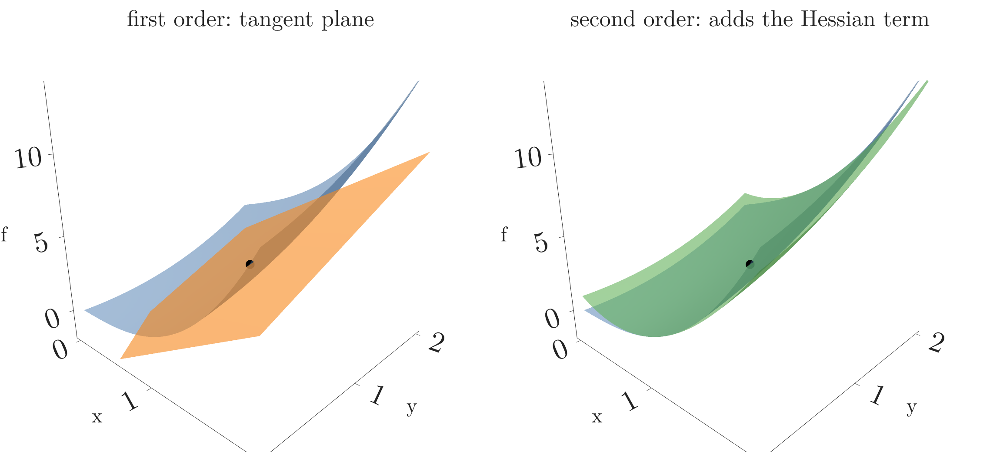
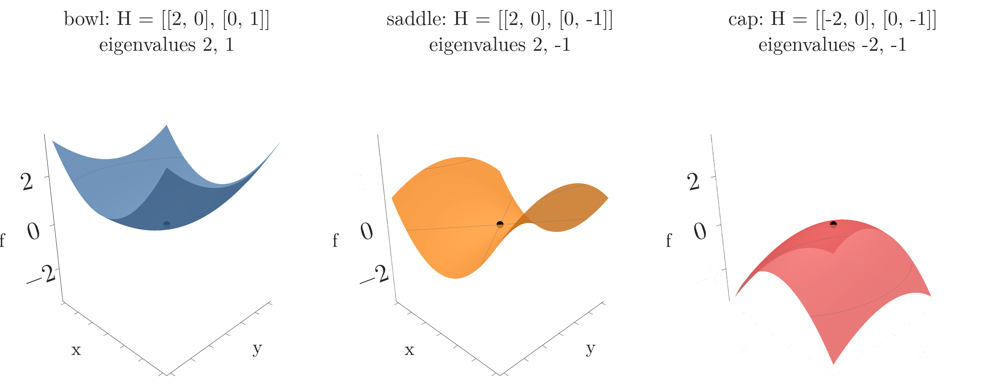

<!-- where-this-fits: generated by course_map/build_map.py; edit concepts.yaml, not this block -->
> **Where this fits:** Pipeline map step 0 (Foundations). See the [Course map](../01-course-map/note.md).
>
> 
>
> - **Builds on:** Eigenvectors and eigenvalues ([Note 530](../530-eigenvectors-and-eigenvalues/note.md)); Derivatives of one variable ([Note 600](../600-derivatives-of-one-variable/note.md)); Partial derivatives and gradients ([Note 601](../601-partial-derivatives-and-gradients/note.md)).
> - **Leads to:** Convex and non-convex loss ([Note 1017](../1017-backpropagation-why/note.md)).
<!-- /where-this-fits -->

## 1. Overview

> **Key point:** The Hessian collects all second partial derivatives and measures how a surface curves; together with the gradient it builds the multivariate Taylor polynomial, which approximates a function near a point by a plane, then a curved bowl, and so on.

This Note follows Chapter 5 (Sections 5.7 and 5.8) of *Mathematics for Machine Learning* (Deisenroth, Faisal and Ong, 2020).



Figure 1 shows the goal. Near a point, a surface is approximated first by a flat **tangent plane** (left), which only uses the gradient. Adding a term built from second derivatives, the Hessian, bends the approximation so that it follows the surface over a much wider area (right).

An earlier Note on boosting ([XGBoost maths Note](../126-xgboost-maths/note.md)) did this with one variable: it called the second derivative of one **observation**'s loss (an observation is one record, a row of the data table) its Hessian $h_i$ and stopped the Taylor series at the second-order term. This Note does the same with many variables. The Note uses the gradient of the [partial derivatives and gradients Note](../601-partial-derivatives-and-gradients/note.md) and the eigenvalues of the [eigenvectors and eigenvalues Note](../530-eigenvectors-and-eigenvalues/note.md).

## 2. Higher-order partial derivatives

> **Key point:** Differentiating a partial derivative again gives a second partial derivative; for smooth functions, the order of the two differentiations does not matter.

A partial derivative is itself a function of all the inputs, so we can differentiate it again. For a function $f(x, y)$ of two variables the notation is:

- $\partial^2 f/\partial x^2$: differentiate with respect to $x$ twice;
- $\partial^2 f/\partial y\thinspace\partial x$, the derivative with respect to $y$ of $\partial f/\partial x$: first with respect to $x$, then with respect to $y$ (read right to left);
- $\partial^n f/\partial x^n$: differentiate $n$ times with respect to $x$.

The ones that mix two different variables are **mixed partial derivatives**.

1. **In words:** for a function whose second derivatives are continuous, differentiating by $x$ then $y$ gives the same as by $y$ then $x$.
2. **Formula:**
   $$\frac{\partial^2 f}{\partial x\thinspace\partial y} = \frac{\partial^2 f}{\partial y\thinspace\partial x}$$
3. **Example:** $f(x, y) = x^3 + xy + y^2$, our running example. Its first partial derivatives are $\partial f/\partial x = 3x^2 + y$ and $\partial f/\partial y = x + 2y$. Then:
   $$\frac{\partial^2 f}{\partial x^2} = 6x, \qquad \frac{\partial^2 f}{\partial y^2} = 2, \qquad \frac{\partial^2 f}{\partial y\thinspace\partial x} = \frac{\partial}{\partial y}(3x^2 + y) = 1, \qquad \frac{\partial^2 f}{\partial x\thinspace\partial y} = \frac{\partial}{\partial x}(x + 2y) = 1$$
   The two mixed derivatives agree.

## 3. The Hessian

> **Key point:** The Hessian is the square, symmetric matrix of all second partial derivatives; it describes the curvature of $f$ near a point.

### 3.1 The Hessian matrix

> **Key point:** Entry $(i, j)$ is $\partial^2 f / \partial x_i \partial x_j$; for $n$ inputs the Hessian is $n \times n$.

1. **In words:** arrange all second partial derivatives in a grid, row $i$ and column $j$ holding the derivative with respect to $x_i$ and $x_j$.
2. **Formula:** for two variables,
   $$H = \nabla^2 f = \begin{bmatrix} \dfrac{\partial^2 f}{\partial x^2} & \dfrac{\partial^2 f}{\partial x\thinspace\partial y} \cr\dfrac{\partial^2 f}{\partial y\thinspace\partial x} & \dfrac{\partial^2 f}{\partial y^2} \end{bmatrix}$$
   For $f: \mathbb{R}^n \to \mathbb{R}$ it is an $n \times n$ matrix, symmetric because the mixed derivatives are equal.
3. **Example:** for $f(x, y) = x^3 + xy + y^2$,
   $$H = \begin{bmatrix} 6x & 1 \cr1 & 2 \end{bmatrix}, \qquad H(1, 1) = \begin{bmatrix} 6 & 1 \cr1 & 2 \end{bmatrix}$$

The Hessian is also the Jacobian of the gradient: the gradient is a function with $n$ outputs, and differentiating each of them by each input gives $n \times n$ numbers (see the [Jacobian Note](../602-jacobian-and-matrix-gradients/note.md)). With a single input, the Hessian is just the second derivative, the $h_i$ of the [XGBoost maths Note](../126-xgboost-maths/note.md).

> **Extra:** For a vector-valued function $\mathbf{f}: \mathbb{R}^n \to \mathbb{R}^m$, each of the $m$ outputs has its own $n \times n$ Hessian. Stacked, they form an $m \times n \times n$ tensor.

### 3.2 Two Hessians we already know

> **Key point:** The least-squares loss has the constant Hessian $2\Phi^{\mathsf T}\Phi$; the bowl of the gradient Note has the constant Hessian with rows $[2, 1]$ and $[1, 4]$.

Quadratic functions have a constant Hessian: the same at every point.

- **The bowl** $x_1^2 + x_1 x_2 + 2x_2^2$ of the [partial derivatives and gradients Note](../601-partial-derivatives-and-gradients/note.md) has gradient $[2x_1 + x_2,\ x_1 + 4x_2]$. Differentiating again:
  $$H = \begin{bmatrix} 2 & 1 \cr1 & 4 \end{bmatrix}$$
- **The least-squares loss** $\lVert \mathbf{y} - \Phi\boldsymbol{\theta} \rVert^2$ has gradient $2\boldsymbol{\theta}^{\mathsf T}\Phi^{\mathsf T}\Phi - 2\mathbf{y}^{\mathsf T}\Phi$ (the [Jacobian Note](../602-jacobian-and-matrix-gradients/note.md), Section 7). Its Jacobian is
  $$H = 2\Phi^{\mathsf T}\Phi$$
  For the three-point data there ($\Phi$ with rows $[1, 1]$, $[1, 2]$, $[1, 3]$), $\Phi^{\mathsf T}\Phi$ has rows $[3, 6]$ and $[6, 14]$, so $H$ has rows $[6, 12]$ and $[12, 28]$.

The matrix $X^{\mathsf T}X$ of the normal equation in the [multiple linear regression maths Note](../54-multiple-lr-maths/note.md) is, up to the factor 2, the Hessian of the loss.

### 3.3 Curvature: what the Hessian says about the shape

> **Key point:** The signs of the Hessian's eigenvalues give the shape near a flat point: all positive is a bowl (minimum), all negative a cap (maximum), mixed signs a saddle.

The second derivative of one variable says whether a curve bends up or down. The Hessian says the same for every direction at once. Its eigenvectors are the directions of strongest and weakest bending, and its eigenvalues measure how much (see the [eigenvectors and eigenvalues Note](../530-eigenvectors-and-eigenvalues/note.md)). Figure 2 shows the three basic shapes.



- **Bowl:** all eigenvalues positive. The surface curves up in every direction; a point with zero gradient is a minimum.
- **Saddle:** positive and negative eigenvalues. The surface curves up in some directions and down in others; a point with zero gradient is neither a minimum nor a maximum.
- **Cap:** all eigenvalues negative. The surface curves down everywhere; a point with zero gradient is a maximum.

For the bowl of the gradient Note, the eigenvalues of $H$ are $3 \pm \sqrt{2}$, that is $4.41$ and $1.59$. Both are positive, so the function is a bowl, as its contour map showed. The ratio $4.41/1.59 = 2.8$ says the bowl curves almost three times as steeply in one direction as in the other: its contour ellipses are stretched. The narrow valleys that slow down gradient descent in the [gradient descent Note](../57-gradient-descent/note.md) (Section 9) are Hessians with a large eigenvalue ratio.

> **Extra:** A function whose Hessian has no negative eigenvalues at any point is convex (Boyd and Vandenberghe §3.1.4): a single bowl with no local minima to get stuck in, the property the [gradient descent Note](../57-gradient-descent/note.md) (Section 8) asked of a loss. The least-squares Hessian $2\Phi^{\mathsf T}\Phi$ never has negative eigenvalues, because $\boldsymbol{\delta}^{\mathsf T}\Phi^{\mathsf T}\Phi\boldsymbol{\delta} = \lVert \Phi\boldsymbol{\delta} \rVert^2 \geq 0$ for every $\boldsymbol{\delta}$. This Hessian is why linear regression's loss is convex.

## 4. Linearisation: the tangent plane

> **Key point:** Near $\mathbf x_0$, $f(\mathbf{x}) \approx f(\mathbf x_0) + \nabla f(\mathbf x_0)(\mathbf{x} - \mathbf x_0)$: a flat plane that touches the surface at $\mathbf x_0$.

The [derivatives of one variable Note](../600-derivatives-of-one-variable/note.md) replaced a curve near a point by its tangent line. With several inputs, the gradient gives a tangent plane (Figure 1, left): the plane spanned by the tangent lines of the two slices in the [partial derivatives and gradients Note](../601-partial-derivatives-and-gradients/note.md).

1. **In words:** start from the value at $\mathbf x_0$ and add the gradient times the step. The gradient is a row and the step a column, so their product is one number.
2. **Formula:**
   $$f(\mathbf{x}) \approx f(\mathbf x_0) + \nabla_{\mathbf{x}} f(\mathbf x_0)\thinspace(\mathbf{x} - \mathbf x_0)$$
3. **Example:** $f(x, y) = x^3 + xy + y^2$ at $(1, 1)$: $f(1, 1) = 3$ and $\nabla f(1, 1) = [3 + 1,\ 1 + 2] = [4, 3]$. At $(1.1, 0.9)$, a step of $(0.1, -0.1)$:
   $$f(1.1, 0.9) \approx 3 + 4 \times 0.1 + 3 \times (-0.1) = 3.1 \qquad (\text{true: } 3.131)$$

The approximation is good close to $\mathbf x_0$ and gets worse further away, because a plane cannot bend. In Figure 1 (left), the orange plane touches the blue surface at the black dot and separates from it in every direction.

## 5. The multivariate Taylor series

> **Key point:** Add terms built from ever higher derivatives at $\mathbf x_0$, multiplied by ever more copies of the step $\boldsymbol{\delta} = \mathbf{x} - \mathbf x_0$; the second-order term is $\tfrac{1}{2}\boldsymbol{\delta}^{\mathsf T}H\boldsymbol{\delta}$.

### 5.1 The terms up to second order

> **Key point:** Value, plus gradient times step, plus half the step times Hessian times step.

The tangent plane is the start of a series, exactly as in one variable. With the step $\boldsymbol{\delta} = \mathbf{x} - \mathbf x_0$:

| Order $k$ | Term | Shapes | One-variable version |
|---|---|---|---|
| 0 | $f(\mathbf x_0)$ | number | $f(x_0)$ |
| 1 | $\nabla f(\mathbf x_0)\thinspace\boldsymbol{\delta}$ | $(1 \times D)(D \times 1)$ | $f'(x_0)\thinspace\delta$ |
| 2 | $\frac{1}{2}\boldsymbol{\delta}^{\mathsf T}H(\mathbf x_0)\thinspace\boldsymbol{\delta}$ | $(1 \times D)(D \times D)(D \times 1)$ | $\frac{1}{2}f''(x_0)\thinspace\delta^2$ |

1. **In words:** the second-order term weighs every pair of step components $\delta_i\delta_j$ by the matching Hessian entry, adds them up and halves the sum.
2. **Formula:** the second-order **multivariate Taylor polynomial** is
   $$T_2(\mathbf{x}) = f(\mathbf x_0) + \nabla f(\mathbf x_0)\thinspace\boldsymbol{\delta} + \frac{1}{2}\thinspace\boldsymbol{\delta}^{\mathsf T}H(\mathbf x_0)\thinspace\boldsymbol{\delta}, \qquad \boldsymbol{\delta}^{\mathsf T}H\boldsymbol{\delta} = \sum_{i}\sum_{j} H_{ij}\thinspace\delta_i\thinspace\delta_j$$
3. **Example:** at $(1, 1)$ with $\boldsymbol{\delta} = (0.1, -0.1)$ and $H$ with rows $[6, 1]$ and $[1, 2]$:
   $$\boldsymbol{\delta}^{\mathsf T}H\boldsymbol{\delta} = 6(0.1)^2 + 2 \cdot 1 \cdot (0.1)(-0.1) + 2(-0.1)^2 = 0.06 - 0.02 + 0.02 = 0.06$$
   so $T_2 = 3.1 + \tfrac{1}{2} \times 0.06 = 3.13$, against the true 3.131.

Figure 1 (right) shows $T_2$: a curved surface that follows $f$ far beyond the region where the tangent plane was good.

> **Python:** The three terms in NumPy.
>
> ```python
> import numpy as np
>
> f0 = 3.0
> g = np.array([4.0, 3.0])                 # gradient at (1, 1)
> H = np.array([[6.0, 1.0], [1.0, 2.0]])   # Hessian at (1, 1)
> d = np.array([0.1, -0.1])                # step to (1.1, 0.9)
>
> f0 + g @ d                    # 3.1   (first order)
> f0 + g @ d + 0.5 * d @ H @ d  # 3.13  (second order)
> ```

### 5.2 Higher orders: tensors and outer products

> **Key point:** The $k$-th term uses a $k$-index array of $k$-th derivatives and $k$ copies of the step; for $k = 2$ these are the Hessian and the outer product $\boldsymbol{\delta}\boldsymbol{\delta}^{\mathsf T}$.

The pattern continues. The $k$-th derivative at $\mathbf x_0$, written $D^k f(\mathbf x_0)$, has one entry for every choice of $k$ input indices: a $D \times \cdots \times D$ tensor with $k$ indices. The tensor is combined with $k$ copies of $\boldsymbol{\delta}$.

1. **In words:** multiply each $k$-th derivative entry by the matching product of step components, add them all, and divide by $k!$.
2. **Formula:** the **multivariate Taylor series** is
   $$f(\mathbf{x}) = \sum_{k=0}^{\infty} \frac{D^k f(\mathbf x_0)\thinspace\boldsymbol{\delta}^k}{k!}, \qquad D^k f(\mathbf x_0)\thinspace\boldsymbol{\delta}^k = \sum_{i_1=1}^{D}\cdots\sum_{i_k=1}^{D} D^k f(\mathbf x_0)[i_1, \dots, i_k]\thickspace\delta_{i_1}\cdots\delta_{i_k}$$
   Stopping after the $k = n$ term gives the Taylor polynomial $T_n$.
3. **Example:** for $k = 2$, $\boldsymbol{\delta}^2$ means the **outer product** $\boldsymbol{\delta}\boldsymbol{\delta}^{\mathsf T}$, the matrix with entries $\delta_i\delta_j$. With $\boldsymbol{\delta} = (0.1, -0.1)$:
   $$\boldsymbol{\delta}\boldsymbol{\delta}^{\mathsf T} = \begin{bmatrix} 0.01 & -0.01 \cr-0.01 & 0.01 \end{bmatrix}$$
   Multiplying entry by entry with $H$ and adding: $6(0.01) + 1(-0.01) + 1(-0.01) + 2(0.01) = 0.06$, the same $\boldsymbol{\delta}^{\mathsf T}H\boldsymbol{\delta}$ as before.

Each extra copy of $\boldsymbol{\delta}$ adds one index: $\boldsymbol{\delta}\boldsymbol{\delta}^{\mathsf T}$ is a matrix, and $\boldsymbol{\delta} \otimes \boldsymbol{\delta} \otimes \boldsymbol{\delta}$, with entries $\delta_i\delta_j\delta_k$, is a 3-index tensor (see the [tensors Note](../11-tensors/note.md)).

### 5.3 A complete example: the expansion is exact for a polynomial

> **Key point:** A polynomial of degree 3 needs exactly the terms up to third order; then the Taylor polynomial is the function itself.

As in one variable (the [derivatives of one variable Note](../600-derivatives-of-one-variable/note.md), Section 6.3), the Taylor series of a polynomial stops. For $f(x, y) = x^3 + xy + y^2$ at $(1, 1)$, write $\delta_x = x - 1$ and $\delta_y = y - 1$.

- **Order 0:** $f(1, 1) = 3$.
- **Order 1:** $\nabla f(1, 1) = [4, 3]$ gives $4\delta_x + 3\delta_y$.
- **Order 2:** $\tfrac{1}{2}\boldsymbol{\delta}^{\mathsf T}H\boldsymbol{\delta} = \tfrac{1}{2}(6\delta_x^2 + 2\delta_x\delta_y + 2\delta_y^2) = 3\delta_x^2 + \delta_x\delta_y + \delta_y^2$.
- **Order 3:** of all third partial derivatives only $\partial^3 f/\partial x^3 = 6$ is not zero, so the term is $6\delta_x^3/3! = \delta_x^3$.
- **Order 4 and up:** all derivatives are zero.

1. **In words:** add the four orders.
2. **Formula:**
   $$f(x, y) = 3 + 4\delta_x + 3\delta_y + 3\delta_x^2 + \delta_x\delta_y + \delta_y^2 + \delta_x^3$$
3. **Example:** at $(1.1, 0.9)$ the running totals are $T_1 = 3.1$, $T_2 = 3.13$, $T_3 = 3.13 + 0.1^3 = 3.131$, now exactly $f(1.1, 0.9) = 1.331 + 0.99 + 0.81 = 3.131$. Further away, at $(1.5, 0.5)$, they are $3.5$, $4.25$ and $4.375 = f(1.5, 0.5)$: the low orders are worse there, but the full expansion is still exact.

Multiplying out the brackets gives back $x^3 + xy + y^2$; we checked this symbolically.

## 6. Where ML uses second-order approximations

> **Key point:** Minimising the second-order Taylor polynomial instead of the function itself is Newton's method; XGBoost does this for every tree, and other methods use it to approximate distributions.

The second-order polynomial is a bowl (when $H$ has positive eigenvalues), and the bottom of a bowl has a formula. The formula makes $T_2$ a useful stand-in for a function that is hard to minimise directly.

> **Extra:** **Newton's method in several variables.** Setting the gradient of $T_2$ with respect to $\boldsymbol{\delta}$ to zero gives $\nabla f^{\mathsf T} + H\boldsymbol{\delta} = \mathbf{0}$, so the step to the bottom of the local bowl is
>
> $$\boldsymbol{\delta} = -H^{-1}\thinspace\nabla f^{\mathsf T}$$
>
> For the bowl of the gradient Note at $(1, 1)$, $\nabla f = [3, 5]$ and $H$ has rows $[2, 1]$ and $[1, 4]$. Solving $H\boldsymbol{\delta} = -[3, 5]^{\mathsf T}$ gives $\boldsymbol{\delta} = (-1, -1)$, landing exactly on the minimum $(0, 0)$ in one step: for a quadratic function $T_2$ is the function itself. Gradient descent, which only uses the tangent plane, needs many small steps for the same trip. With one variable this is the **Newton step** of the [gradient boosting classification Note](../122-gradient-boosting-classification/note.md), and XGBoost's leaf formula $-G/(H + \lambda)$ in the [XGBoost maths Note](../126-xgboost-maths/note.md) is a Newton step per leaf (Chen and Guestrin §2.2). The catch: with millions of parameters the Hessian has millions squared entries, which is why deep learning mostly stays with first-order methods (Goodfellow et al. §8.6.1).

> **Extra:** **Quasi-Newton methods: BFGS and L-BFGS.** These skip the Hessian and build a stand-in matrix $B$ from gradients alone. After each step $\mathbf{s} = \mathbf x_{k+1} - \mathbf x_k$, the gradient change $\mathbf{y} = \nabla f_{k+1} - \nabla f_k$ is measured, and $B$ is updated so that
>
> $$B_{k+1}\thinspace\mathbf{s} = \mathbf{y}$$
>
> The condition is the **secant equation**: the new $B$ must reproduce the gradient change just seen. With one variable it says $B = (f'(x_{k+1}) - f'(x_k))/(x_{k+1} - x_k)$, the slope between two gradient readings. For $f = x^3$ stepping from $x = 1$ to $x = 2$: $f'$ goes from 3 to 12, so $B = (12 - 3)/(2 - 1) = 9$, between the true curvatures $f''(1) = 6$ and $f''(2) = 12$. The step is then $\boldsymbol{\delta} = -B^{-1}\nabla f^{\mathsf T}$, as in Newton's method, usually shortened by a line search. **BFGS** (Broyden, Fletcher, Goldfarb, Shanno) is the most used update rule; it keeps $B$ symmetric and positive definite, so every step goes downhill. **L-BFGS** ("limited memory") stores only the last few $(\mathbf{s}, \mathbf{y})$ pairs instead of the full $n \times n$ matrix, which makes it usable with many parameters. L-BFGS is the default solver of `LogisticRegression` in the [logistic regression hyperparameters Note](../81-logistic-hyperparameters/note.md). (Nocedal and Wright, ch. 6 for BFGS, §7.2 for L-BFGS.)


Figure 3 shows the one-variable case: BFGS never computes the curvature (dashed), it reads the slope twice and takes the line through the two readings (orange).


Figure 4 races the three methods on the curved valley $f = (1 - x)^2 + 5(y - x^2)^2$, all with the same rule for the step length. Newton, with the true Hessian, needs 10 steps. BFGS, which only ever sees gradients, needs 17: its first steps wander while $B$ is still a guess, then it settles into the valley like Newton. The figure script checks this: for the first 7 steps $B$ is still 90% or more away from the true Hessian, and from step 7 on it is within about 30%. Gradient descent zig-zags across the narrow valley and needs 717 steps.

> **Extra:** Second-order Taylor expansions also approximate probability distributions. The **Laplace approximation** replaces a distribution near its peak by a normal distribution whose spread comes from the Hessian of its log there (Bishop §4.4). The **extended Kalman filter**, used to track moving objects, linearises a nonlinear system at every time step with the first-order expansion (Thrun et al. §3.3).

## 7. Summary

| Object | Formula | Example: $f = x^3 + xy + y^2$ at $(1, 1)$ |
|---|---|---|
| Mixed partial derivatives | $\partial^2 f/\partial x\partial y = \partial^2 f/\partial y\partial x$ | both equal 1 |
| Hessian | $H_{ij} = \partial^2 f/\partial x_i\partial x_j$, symmetric $n \times n$ | rows $[6, 1]$, $[1, 2]$ |
| Tangent plane (first order) | $f(\mathbf x_0) + \nabla f\thinspace\boldsymbol{\delta}$ | 3.1 at $(1.1, 0.9)$ |
| Second-order Taylor | $+\ \tfrac{1}{2}\boldsymbol{\delta}^{\mathsf T}H\boldsymbol{\delta}$ | 3.13 |
| Third-order Taylor | $+\ \tfrac{1}{3!}D^3 f\thinspace\boldsymbol{\delta}^3$ | 3.131 (exact) |
| Newton step | $\boldsymbol{\delta} = -H^{-1}\nabla f^{\mathsf T}$ | bowl: $(1, 1) \to (0, 0)$ |
| Secant equation (BFGS) | $B_{k+1}\mathbf{s} = \mathbf{y}$ | $x^3$, $1 \to 2$: $B = 9$ |

- Second partial derivatives can be taken in either order; the Hessian is therefore symmetric.
- The Hessian measures curvature; the signs of its eigenvalues separate bowls, saddles and caps.
- Linearisation replaces a surface by its tangent plane, good only near the point.
- The multivariate Taylor series adds terms with $k$ copies of the step and the $k$-th derivative tensor; the second-order term is $\tfrac{1}{2}\boldsymbol{\delta}^{\mathsf T}H\boldsymbol{\delta}$.
- A polynomial of degree $k$ is reproduced exactly by its Taylor polynomial of degree $k$.

## 8. Sources

**Built from**

- Deisenroth, M. P., Faisal, A. A. and Ong, C. S. (2020). *Mathematics for Machine Learning*. Cambridge University Press. Chapter 5.

**Other references**

- Bishop, C. M. (2006). *Pattern Recognition and Machine Learning*. Springer. Section 4.4, the Laplace approximation.
- Boyd, S. and Vandenberghe, L. (2004). *Convex Optimization*. Cambridge University Press. Section 3.1.4, second-order conditions.
- Chen, T. and Guestrin, C. (2016). "XGBoost: A Scalable Tree Boosting System". *KDD*. Section 2.2.
- Goodfellow, I., Bengio, Y. and Courville, A. (2016). *Deep Learning*. MIT Press. Section 8.6.1, Newton's method.
- Nocedal, J. and Wright, S. J. (2006). *Numerical Optimization*, 2nd ed. Springer. Chapter 6 and section 7.2.
- Thrun, S., Burgard, W. and Fox, D. (2005). *Probabilistic Robotics*. MIT Press. Section 3.3, the extended Kalman filter.

## 9. Key terms

| Term | Meaning |
|---|---|
| Second partial derivative | A partial derivative of a partial derivative, such as $\partial^2 f/\partial x^2$ |
| Mixed partial derivative | A second partial derivative with respect to two different variables, such as $\partial^2 f/\partial y\thinspace\partial x$ |
| Hessian matrix | The symmetric $n \times n$ matrix of all second partial derivatives of $f: \mathbb{R}^n \to \mathbb{R}$; it measures curvature |
| Curvature | How fast the slope of a surface changes; given in each direction by the Hessian |
| Saddle point | A flat point where the surface curves up in some directions and down in others (Hessian eigenvalues of both signs) |
| Tangent plane | The flat plane that touches a surface at a point with the same gradient; the first-order Taylor approximation |
| Multivariate Taylor series | $\sum_k D^k f(\mathbf x_0)\thinspace\boldsymbol{\delta}^k / k!$: approximation of $f$ near $\mathbf x_0$ from its derivatives there |
| Multivariate Taylor polynomial | The multivariate Taylor series cut after the $k = n$ term |
| Outer product | $\boldsymbol{\delta}\boldsymbol{\delta}^{\mathsf T}$, the matrix of all products $\delta_i\delta_j$; more copies give tensors |
| Newton's method | Repeatedly jumping to the minimum of the second-order Taylor polynomial: $\boldsymbol{\delta} = -H^{-1}\nabla f^{\mathsf T}$ |
| Quasi-Newton method | Newton's method with the Hessian replaced by a matrix built from gradient changes |
| Secant equation | $B_{k+1}\mathbf{s} = \mathbf{y}$: the Hessian stand-in must reproduce the last gradient change |
| BFGS | The most used quasi-Newton update; keeps the Hessian stand-in symmetric and positive definite |
| L-BFGS | Limited-memory BFGS: keeps only the last few step and gradient-change pairs; scikit-learn's default logistic regression solver |
| Laplace approximation | Approximating a distribution near its peak by a normal distribution built from the Hessian |
