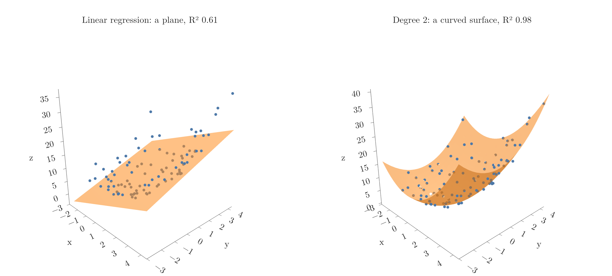

<!-- where-this-fits: generated by course_map/build_map.py; edit concepts.yaml, not this block -->
> **Where this fits:** Pipeline map steps 8 (Model), 9 (Evaluate). See the [Course map](../01-course-map/note.md).
>
> 
>
> - **Builds on:** Train-test split ([Note 13](../13-toy-project/note.md)); Multiple linear regression ([Note 55](../55-multiple-lr-code/note.md)).
> - **Leads to:** Bias-variance trade-off ([Note 62](../62-bias-variance/note.md)); Regularisation ([Note 63](../63-ridge-regression-intuition/note.md)); Logistic regression (Video 70, coming); Bagging (Video 105, coming).
<!-- /where-this-fits -->

## 1. Overview

> **Key point:** Polynomial regression fits curves by adding powers of the input ($x^2$, $x^3$, ...) as new columns and then running ordinary linear regression on them.

Linear regression fits a straight line (or flat plane). Real relationships are often curved: the output may first fall and then rise, or grow faster and faster. A straight line misses such patterns.

**Polynomial regression** handles curves without a new algorithm. It creates new input columns from powers of the existing ones and gives them to plain linear regression. The **degree** is the highest power used.

## 2. A curved pattern

> **Key point:** On data that follows a parabola, a straight line reaches only R² 0.38.

The example data has 200 points that follow

$$y = 0.8x^2 + 0.9x + 2 + \text{noise}$$

for $x$ between $-3$ and 3: a U-shaped curve with some random scatter. Fitted with ordinary linear regression, the best straight line scores only $R^2 = 0.38$ on the test points. It cannot bend, so it misses the low middle and both high ends (the red line in Figure 2, left).

## 3. Adding powers as new columns

> **Key point:** For degree 2, each row gets a new column holding $x^2$. Linear regression then finds one coefficient per column.

The trick: for each row, compute $x^2$ and add it as a new input column (Figure 1).


With the columns $x$ and $x^2$, linear regression fits

$$\hat{y} = \beta_0 + \beta_1 x + \beta_2 x^2$$

This is a curve in $x$, but it is still a straight-line combination of its coefficients: each coefficient just multiplies a column. So the usual linear regression machinery (OLS or gradient descent) finds $\beta_0$, $\beta_1$ and $\beta_2$ unchanged.

That is why polynomial regression is called "linear": **linear** refers to the coefficients, not to the shape of the curve in $x$.

> **Python:** Degree-2 polynomial regression.
>
> ```python
> from sklearn.preprocessing import PolynomialFeatures
> from sklearn.linear_model import LinearRegression
>
> poly = PolynomialFeatures(degree=2, include_bias=True)
> X_train_p = poly.fit_transform(X_train)   # [x] -> [1, x, x^2]
> X_test_p = poly.transform(X_test)
>
> lr = LinearRegression().fit(X_train_p, y_train)
> lr.score(X_test_p, y_test)     # R² 0.83
> lr.coef_, lr.intercept_        # [0, 1.04, 0.82], 1.92
> ```
>
> `include_bias=True` adds the column of 1s; `LinearRegression` fits its own intercept anyway, so that column gets coefficient 0 and either setting works.

With the $x^2$ column, the test R² jumps from 0.38 to 0.83. The learned equation, $\hat{y} = 1.92 + 1.04x + 0.82x^2$, is close to the true $2 + 0.9x + 0.8x^2$; the remaining difference is the noise.

## 4. Choosing the degree

> **Key point:** Too low a degree underfits; too high a degree bends to fit the noise and overfits. Training R² keeps rising with the degree, but test R² falls.

Higher degrees add more columns, $x^3$, $x^4$ and so on, and the curve can bend more. Figure 2 fits three degrees to only 25 training points, then scores them on 200 new test points.

{height=48%}

| Degree | Training R² | Test R² | |
|---|---|---|---|
| 1 | 0.48 | 0.28 | **underfits**: too simple to follow the curve |
| 2 | 0.94 | 0.86 | right shape: matches how the data was made |
| 6 | 0.97 | 0.81 | starting to fit noise |
| 10 | 0.98 | 0.28 | overfits |
| 15 | 0.99 | $-9.35$ | overfits badly: wild swings between and beyond the points |

The right panel shows the pattern. **Training R²** rises with every extra degree, because more columns always let the curve pass closer to the training points. **Test R²** peaks at degree 2 and then collapses: the high-degree curve has learned the noise of these 25 points, not the pattern (the challenges and fitting Notes called this overfitting).

The degree is a hyperparameter. It is chosen by comparing scores on data not used for training, as here, or with cross-validation (a later Note).

> **Extra:** A degree-15 polynomial has terms up to $x^{15}$; with $x = 3$ that is about 14 million. Columns on such different scales make the fit numerically unstable, which is why high-degree models are usually built as a pipeline of `PolynomialFeatures`, `StandardScaler` and `LinearRegression`, as in Figure 2. The wildness of the degree-15 curve near the edges is the overfitting, not a numerical error.

## 5. More than one input

> **Key point:** With several inputs, PolynomialFeatures also adds products of inputs, such as xy. The number of columns grows very fast with the degree.

With two inputs $x$ and $y$, degree 2 creates all terms of total power up to 2:

$$1,\ x,\ y,\ x^2,\ xy,\ y^2$$

The product $xy$ is an **interaction term**: it lets the effect of $x$ depend on the value of $y$. The fitted model is a curved surface instead of a flat plane.

Figure 3 shows data made from $z = x^2 + y^2 + 0.2x + 0.2y + 0.1xy + 2$ plus noise. A plane reaches $R^2 = 0.61$; a degree-2 surface reaches 0.98.

{height=45%}

The number of new columns grows quickly. With 2 inputs, degree 2 gives 6 columns; degree 30 gives 496. With many inputs and a high degree, the columns quickly outnumber the rows, and the model overfits.

> **Extra:** To put two 1-D arrays side by side as columns, use `np.c_[x, y]` or `np.column_stack([x, y])`. A shortcut sometimes seen, `np.array([x, y]).reshape(100, 2)`, does not do this: it fills the rows with 100 values of `x` first and then of `y`, so most rows pair unrelated numbers. The model still runs, but on scrambled data. Checking `X[:3]` against `x[:3]` and `y[:3]` catches it.

## 6. Summary

| Degree | Columns for one input | Behaviour on the example |
|---|---|---|
| 1 | $x$ | straight line, underfits (test R² 0.28) |
| 2 | $x$, $x^2$ | follows the curve (test R² 0.86) |
| 15 | $x$ to $x^{15}$ | overfits (test R² $-9.35$) |

- Polynomial regression = new power columns + ordinary linear regression.
- It is "linear" in the coefficients, so OLS and gradient descent work unchanged.
- `PolynomialFeatures(degree=d)` creates the columns; with several inputs it adds interaction terms too.
- The degree controls flexibility: too low underfits, too high overfits. Choose it on held-out data.

## 7. Key terms

| Term | Meaning |
|---|---|
| Polynomial regression | Linear regression on powers (and products) of the inputs, to fit curves |
| Degree | The highest power used in the polynomial |
| PolynomialFeatures | scikit-learn transformer that creates the power and product columns |
| include_bias | PolynomialFeatures setting that adds a column of 1s |
| Interaction term | A product of two inputs, such as $xy$, that lets one input's effect depend on another |
| Underfitting | A model too simple to capture the pattern; poor on training and test data |
| Overfitting | A model so flexible that it learns the noise; good on training data, poor on test data |
