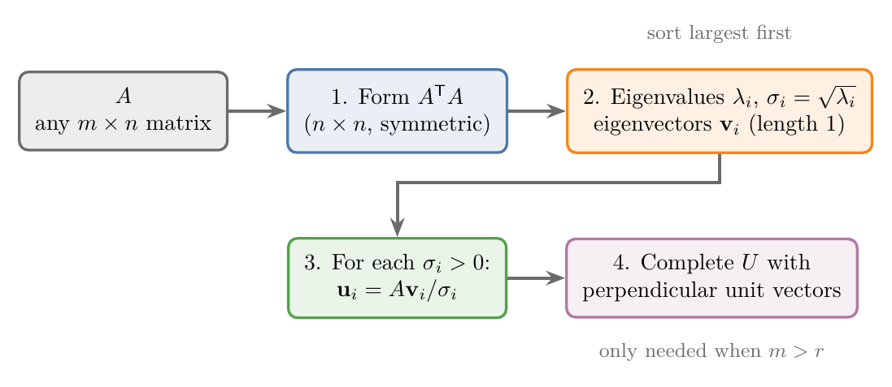

<!-- where-this-fits: generated by course_map/build_map.py; edit concepts.yaml, not this block -->
> **Where this fits:** Pipeline map step 0 (Foundations). See the [Course map](../01-course-map/note.md).
>
> 
>
> - **Builds on:** Linear transformations and matrices ([Note 500](../500-linear-transformations-and-matrices/note.md)); Eigenvectors and eigenvalues ([Note 530](../530-eigenvectors-and-eigenvalues/note.md)).
> - **Leads to:** Low-rank approximation (truncated SVD) ([Note 612](../612-low-rank-approximation/note.md)); Latent semantic analysis ([Note 613](../613-svd-in-machine-learning/note.md)); Moore-Penrose pseudo-inverse ([Note 613](../613-svd-in-machine-learning/note.md)).
> - **Compare with:** Eigenvectors and eigenvalues ([Note 530](../530-eigenvectors-and-eigenvalues/note.md)).
<!-- /where-this-fits -->

## 1. Overview

> **Key point:** Multiplying $A$ by its own transpose makes one of the two orthogonal matrices disappear. The eigenvectors of $A^{\mathsf T}A$ are the right singular vectors, its eigenvalues are the squared singular values, and $\mathbf{u}_i = A\mathbf{v}_i / \sigma_i$ gives the left singular vectors.

This Note follows Strang's *Introduction to Linear Algebra* (Strang §7.2) and *Mathematics for Machine Learning* (Deisenroth, Faisal, Ong, 2020), §4.5.2.



The first SVD Note, the [SVD geometry Note](../610-svd-geometry/note.md) showed what $A = U\Sigma V^{\mathsf T}$ means: rotate, stretch, rotate. It gave the factors of

$$A = \begin{bmatrix} 3 & 0 \\ 4 & 5 \end{bmatrix}$$

without saying where they came from. This Note finds them:

- why $A^{\mathsf T}A$ and $AA^{\mathsf T}$ hold the answer (Section 2);
- the four-step recipe of Figure 1, worked on $A$ (Section 3);
- a sign trap, and how $\mathbf{u}_i = A\mathbf{v}_i/\sigma_i$ avoids it (Section 4);
- a matrix of rank 1, where a singular value is 0 (Section 5);
- the four subspaces that the SVD gives bases for (Section 6);
- a matrix that is not square (Section 7);
- why computers do not use this recipe (Section 8).

Finding eigenvalues and eigenvectors by hand, with $\det(A - \lambda I) = 0$, is taught in the [eigenvectors and eigenvalues Note](../530-eigenvectors-and-eigenvalues/note.md); we use it here without repeating it.

## 2. Making one orthogonal matrix disappear

> **Key point:** In $A^{\mathsf T}A$ the two copies of $U$ meet as $U^{\mathsf T}U = I$ and vanish, leaving an eigen-decomposition of a symmetric matrix.

### 2.1 $A^{\mathsf T}A$ gives $V$ and the singular values

> **Key point:** $A^{\mathsf T}A = V\Sigma^{\mathsf T}\Sigma V^{\mathsf T}$: its eigenvectors are the $\mathbf{v}_i$, its eigenvalues are the $\sigma_i^2$.

$A = U\Sigma V^{\mathsf T}$ has two unknown orthogonal matrices. Finding both at once is hard, so we look for an expression in which one of them disappears.

1. **In words:** transpose $A$ (the transpose of a product is the product of the transposes in reverse order), multiply by $A$, and use $U^{\mathsf T}U = I$ (see the [SVD geometry Note](../610-svd-geometry/note.md), section 3.3).
2. **Formula:**
   $$A^{\mathsf T}A = (V\Sigma^{\mathsf T}U^{\mathsf T})(U\Sigma V^{\mathsf T}) = V\,\Sigma^{\mathsf T}\Sigma\,V^{\mathsf T} = V\begin{bmatrix} \sigma_1^2 & & \\ & \ddots & \\ & & \sigma_n^2 \end{bmatrix}V^{\mathsf T}$$
3. **Example:** for $A$ with rows $[3, 0]$ and $[4, 5]$,
   $$A^{\mathsf T}A = \begin{bmatrix} 3 & 4 \\ 0 & 5 \end{bmatrix}\begin{bmatrix} 3 & 0 \\ 4 & 5 \end{bmatrix} = \begin{bmatrix} 25 & 20 \\ 20 & 25 \end{bmatrix}$$

The right side of the formula is exactly an eigen-decomposition $PDP^{-1}$ (see the [eigenvectors and eigenvalues Note](../530-eigenvectors-and-eigenvalues/note.md), section 6.2), with $P = V$ and $P^{-1} = V^{\mathsf T}$. So:

- the right singular vectors $\mathbf{v}_i$ are the eigenvectors of $A^{\mathsf T}A$;
- the squared singular values $\sigma_i^2$ are its eigenvalues, so $\sigma_i = \sqrt{\lambda_i}$.

### 2.2 Why this always works

> **Key point:** $A^{\mathsf T}A$ is symmetric with eigenvalues $\ge 0$, so it always has orthonormal eigenvectors and real square roots.

$A$ itself may have no useful eigenvectors, but $A^{\mathsf T}A$ always does, for two reasons.

- **$A^{\mathsf T}A$ is symmetric.** Its transpose is $A^{\mathsf T}(A^{\mathsf T})^{\mathsf T} = A^{\mathsf T}A$, itself. A symmetric matrix always has a full set of perpendicular eigenvectors (the same fact that makes PCA work on a covariance matrix, see the [PCA step by step Note](../48-pca-step-by-step/note.md), section 4.3). So $V$ can always be built as an orthogonal matrix.
- **Its eigenvalues are never negative.** For a unit eigenvector $\mathbf{v}$ with eigenvalue $\lambda$, $\lambda = \mathbf{v}^{\mathsf T}A^{\mathsf T}A\mathbf{v} = \lVert A\mathbf{v}\rVert^2 \ge 0$. So the square root $\sigma = \sqrt\lambda$ is a real, non-negative number. The formula also says $\sigma$ is the length of $A\mathbf{v}$, as in the geometry Note.

So $A^{\mathsf T}A$ is symmetric and positive semi-definite, for every matrix $A$ of any shape.

### 2.3 $AA^{\mathsf T}$ gives $U$, with the same numbers

> **Key point:** Multiplying in the other order removes $V$ instead: $AA^{\mathsf T} = U\Sigma\Sigma^{\mathsf T}U^{\mathsf T}$.

By the same steps, $AA^{\mathsf T} = U\Sigma V^{\mathsf T}V\Sigma^{\mathsf T}U^{\mathsf T} = U\,\Sigma\Sigma^{\mathsf T}\,U^{\mathsf T}$. So the left singular vectors $\mathbf{u}_i$ are the eigenvectors of $AA^{\mathsf T}$, and its non-zero eigenvalues are the same $\sigma_i^2$.

For $A$: $AA^{\mathsf T}$ has rows $[9, 12]$ and $[12, 41]$, a different matrix from $A^{\mathsf T}A$. Yet both have the eigenvalues 45 and 5. The match is no accident: $AB$ and $BA$ always share their non-zero eigenvalues.

## 3. The recipe, worked on a $2 \times 2$ matrix

> **Key point:** Eigen-decompose $A^{\mathsf T}A$, take square roots, then get each $\mathbf{u}_i$ by applying $A$ to $\mathbf{v}_i$ and dividing by $\sigma_i$.

Figure 1 shows the four steps. We follow them for $A$ with rows $[3, 0]$ and $[4, 5]$.

**Step 1: form $A^{\mathsf T}A$.** As in Section 2.1, it has rows $[25, 20]$ and $[20, 25]$.

**Step 2: eigenvalues and eigenvectors of $A^{\mathsf T}A$.**

1. **In words:** subtract $\lambda$ from the diagonal and set the determinant to zero; then find the line of vectors each eigenvalue squishes to zero, and scale to length 1.
2. **Formula:**
   $$\det(A^{\mathsf T}A - \lambda I) = 0, \qquad \sigma_i = \sqrt{\lambda_i}$$
3. **Example:**
   $$\det\begin{bmatrix} 25 - \lambda & 20 \\ 20 & 25 - \lambda \end{bmatrix} = (25 - \lambda)^2 - 400 = 0 \quad\Longrightarrow\quad 25 - \lambda = \pm 20$$
   so $\lambda_1 = 45$ and $\lambda_2 = 5$ (largest first), and
   $$\sigma_1 = \sqrt{45} = 3\sqrt5 \approx 6.708, \qquad \sigma_2 = \sqrt5 \approx 2.236$$

For $\lambda_1 = 45$, $A^{\mathsf T}A - 45I$ has rows $[-20, 20]$ and $[20, -20]$, which sends $[x, y]$ to zero when $x = y$. For $\lambda_2 = 5$, $A^{\mathsf T}A - 5I$ has rows $[20, 20]$ and $[20, 20]$, which needs $y = -x$. Scaled to length 1:

$$\mathbf{v}_1 = \frac{1}{\sqrt2}\begin{bmatrix} 1 \\ 1 \end{bmatrix}, \qquad \mathbf{v}_2 = \frac{1}{\sqrt2}\begin{bmatrix} -1 \\ 1 \end{bmatrix}$$

The two vectors are perpendicular, as Section 2.2 promised.

**Step 3: $\mathbf{u}_i = A\mathbf{v}_i / \sigma_i$.** The step is the singular value equation $A\mathbf{v}_i = \sigma_i\mathbf{u}_i$ solved for $\mathbf{u}_i$.

1. **In words:** apply $A$ to each right singular vector and divide by its singular value. The result is automatically a unit vector.
2. **Formula:**
   $$\mathbf{u}_i = \frac{1}{\sigma_i}A\mathbf{v}_i$$
3. **Example:**
   $$\mathbf{u}_1 = \frac{1}{3\sqrt5}\cdot\frac{1}{\sqrt2}\begin{bmatrix} 3 \\ 9 \end{bmatrix} = \frac{1}{\sqrt{10}}\begin{bmatrix} 1 \\ 3 \end{bmatrix}, \qquad \mathbf{u}_2 = \frac{1}{\sqrt5}\cdot\frac{1}{\sqrt2}\begin{bmatrix} -3 \\ 1 \end{bmatrix} = \frac{1}{\sqrt{10}}\begin{bmatrix} -3 \\ 1 \end{bmatrix}$$

The $\mathbf{u}$'s come out perpendicular without any extra work. In symbols: $(A\mathbf{v}_1)^{\mathsf T}(A\mathbf{v}_2) = \mathbf{v}_1^{\mathsf T}(A^{\mathsf T}A\mathbf{v}_2) = \lambda_2\,\mathbf{v}_1^{\mathsf T}\mathbf{v}_2 = 0$.

**Step 4: complete $U$.** Here there are already two $\mathbf{u}$'s for a $2 \times 2$ matrix, so nothing is missing. Sections 5 and 7 need this step.

**Check.** Multiplying the factors back together:

$$U\Sigma = \frac{1}{\sqrt{10}}\begin{bmatrix} 1 & -3 \\ 3 & 1 \end{bmatrix}\begin{bmatrix} 3\sqrt5 & 0 \\ 0 & \sqrt5 \end{bmatrix} = \frac{1}{\sqrt2}\begin{bmatrix} 3 & -3 \\ 9 & 1 \end{bmatrix}$$

$$U\Sigma V^{\mathsf T} = \frac{1}{\sqrt2}\begin{bmatrix} 3 & -3 \\ 9 & 1 \end{bmatrix}\cdot\frac{1}{\sqrt2}\begin{bmatrix} 1 & 1 \\ -1 & 1 \end{bmatrix} = \frac{1}{2}\begin{bmatrix} 6 & 0 \\ 8 & 10 \end{bmatrix} = \begin{bmatrix} 3 & 0 \\ 4 & 5 \end{bmatrix} = A$$

> **Python:** Checking each step with NumPy.
>
> ```python
> import numpy as np
>
> A = np.array([[3, 0], [4, 5]])
> lam, V = np.linalg.eigh(A.T @ A)   # eigh: for symmetric
> lam, V = lam[::-1], V[:, ::-1]     # largest first
> sigma = np.sqrt(lam)               # [6.708, 2.236]
> U = A @ V / sigma                  # column i = A v_i / sigma_i
> U @ np.diag(sigma) @ V.T           # gives back A
> ```
>
> `A @ V / sigma` divides column $i$ of $AV$ by $\sigma_i$: NumPy matches the 1D array `sigma` with the columns.

## 4. The sign trap

> **Key point:** Finding $U$ and $V$ separately as eigenvectors can pick mismatched signs and give a wrong product; computing $\mathbf{u}_i = A\mathbf{v}_i/\sigma_i$ always matches them.

Section 2.3 suggests a shortcut: take the $\mathbf{u}$'s as the eigenvectors of $AA^{\mathsf T}$, found on their own. For $A$, $AA^{\mathsf T}$ has rows $[9, 12]$ and $[12, 41]$, with eigenvalues 45 and 5. Its eigenvectors are the lines through $[1, 3]$ and through $[3, -1]$.

Every non-zero multiple of an eigenvector is an eigenvector too, so $\frac{1}{\sqrt{10}}[3, -1]$ is as correct an eigenvector as $\frac{1}{\sqrt{10}}[-3, 1]$. But it is the negative of the $\mathbf{u}_2$ that belongs with our $\mathbf{v}_2$. Using it gives

$$\frac{1}{\sqrt{10}}\begin{bmatrix} 1 & 3 \\ 3 & -1 \end{bmatrix}\begin{bmatrix} 3\sqrt5 & 0 \\ 0 & \sqrt5 \end{bmatrix}\frac{1}{\sqrt2}\begin{bmatrix} 1 & 1 \\ -1 & 1 \end{bmatrix} = \begin{bmatrix} 0 & 3 \\ 5 & 4 \end{bmatrix} \ne A$$

Each piece is a valid eigenvector, yet the product is a different matrix. The pairs $(\mathbf{u}_i, \mathbf{v}_i)$ must match: flipping both signs is allowed, flipping one is not (see the [SVD geometry Note](../610-svd-geometry/note.md), section 5.1). The eigenvalue problem for $AA^{\mathsf T}$ knows nothing about $V$, so it cannot keep the pairs matched.

The fix is Step 3: compute $\mathbf{u}_i = A\mathbf{v}_i / \sigma_i$ from the $\mathbf{v}_i$ already chosen. Then $A\mathbf{v}_i = \sigma_i\mathbf{u}_i$ holds by construction, whatever sign each $\mathbf{v}_i$ was given.

## 5. A matrix of rank 1

> **Key point:** A rank-1 matrix has one non-zero singular value; the zero one has no $\mathbf{u}$ from $A\mathbf{v}/\sigma$, so we complete $U$ with a perpendicular unit vector.

Take

$$C = \begin{bmatrix} 2 & 1 \\ 4 & 2 \end{bmatrix}$$

The second row is twice the first, so the rank is 1: $C$ squishes the whole plane onto one line, the line through $[1, 2]$ (its columns $[2, 4]$ and $[1, 2]$ both lie on it).

**Step 1.**

$$C^{\mathsf T}C = \begin{bmatrix} 2 & 4 \\ 1 & 2 \end{bmatrix}\begin{bmatrix} 2 & 1 \\ 4 & 2 \end{bmatrix} = \begin{bmatrix} 20 & 10 \\ 10 & 5 \end{bmatrix}$$

**Step 2.** Its determinant is $20 \times 5 - 10 \times 10 = 0$, so one eigenvalue is 0. The eigenvalues of a $2 \times 2$ matrix add up to its diagonal sum, $20 + 5 = 25$, so the other is 25. So $\sigma_1 = 5$ and $\sigma_2 = 0$, and the eigenvectors are

$$\mathbf{v}_1 = \frac{1}{\sqrt5}\begin{bmatrix} 2 \\ 1 \end{bmatrix}, \qquad \mathbf{v}_2 = \frac{1}{\sqrt5}\begin{bmatrix} -1 \\ 2 \end{bmatrix}$$

$\mathbf{v}_2$ is the direction $C$ squishes to nothing: $C[-1, 2] = [-2 + 2, -4 + 4] = [0, 0]$.

**Step 3.** Only $\sigma_1$ is non-zero:

$$\mathbf{u}_1 = \frac{1}{5}C\mathbf{v}_1 = \frac{1}{5\sqrt5}\begin{bmatrix} 5 \\ 10 \end{bmatrix} = \frac{1}{\sqrt5}\begin{bmatrix} 1 \\ 2 \end{bmatrix}$$

**Step 4.** $\mathbf{u}_2 = C\mathbf{v}_2 / \sigma_2$ would divide zero by zero. Any unit vector perpendicular to $\mathbf{u}_1$ completes $U$ to an orthogonal matrix; we take $\mathbf{u}_2 = \frac{1}{\sqrt5}[-2, 1]$. This $\mathbf{u}_2$ is multiplied by $\sigma_2 = 0$, so it never affects the product.

**Result.**

$$C = \frac{1}{\sqrt5}\begin{bmatrix} 1 & -2 \\ 2 & 1 \end{bmatrix}\begin{bmatrix} 5 & 0 \\ 0 & 0 \end{bmatrix}\frac{1}{\sqrt5}\begin{bmatrix} 2 & 1 \\ -1 & 2 \end{bmatrix}$$

Only the first column of $U$ and the first row of $V^{\mathsf T}$ meet a non-zero number, so the product shrinks to

$$C = 5\cdot\frac{1}{\sqrt5}\begin{bmatrix} 1 \\ 2 \end{bmatrix}\cdot\frac{1}{\sqrt5}\begin{bmatrix} 2 & 1 \end{bmatrix} = \begin{bmatrix} 1 \\ 2 \end{bmatrix}\begin{bmatrix} 2 & 1 \end{bmatrix} = \begin{bmatrix} 2 & 1 \\ 4 & 2 \end{bmatrix}$$

A column times a row is a whole matrix of rank 1. The [low-rank approximation Note](../612-low-rank-approximation/note.md) builds every matrix out of such pieces.

> **Python:** NumPy reports the zero singular value.
>
> ```python
> C = np.array([[2, 1], [4, 2]])
> np.linalg.svd(C)[1]      # [5., 0.]
> np.linalg.matrix_rank(C) # 1
> ```
>
> `matrix_rank` from the [linear combinations, span and basis Note](../490-linear-combinations-span-and-basis/note.md) works exactly this way: it counts the singular values that are not (almost) zero.

## 6. The four subspaces

> **Key point:** The $\mathbf{v}$'s split the input space into the row space and the null space; the $\mathbf{u}$'s split the output space into the column space and the left null space. The SVD gives perpendicular bases for all four.

The rank-1 example shows a pattern that holds for every matrix. Figure 2 draws it for $C$.


For an $m \times n$ matrix of rank $r$ (there are $r$ non-zero singular values):

| Subspace | Where | Basis from the SVD | Dimension | For $C$ |
|---|---|---|---|---|
| **Row space** (span of the rows) | input $\mathbb{R}^n$ | $\mathbf{v}_1, \dots, \mathbf{v}_r$ | $r$ | line through $[2, 1]$ |
| **Null space** (vectors sent to $\mathbf{0}$) | input $\mathbb{R}^n$ | $\mathbf{v}_{r+1}, \dots, \mathbf{v}_n$ | $n - r$ | line through $[-1, 2]$ |
| **Column space** (span of the columns) | output $\mathbb{R}^m$ | $\mathbf{u}_1, \dots, \mathbf{u}_r$ | $r$ | line through $[1, 2]$ |
| **Left null space** (outputs never reached, perpendicular to them) | output $\mathbb{R}^m$ | $\mathbf{u}_{r+1}, \dots, \mathbf{u}_m$ | $m - r$ | line through $[-2, 1]$ |

The column space is the span of the columns from the [linear transformations and matrices Note](../500-linear-transformations-and-matrices/note.md) (section 6): every output lands in it. The null space is everything the matrix squishes to the origin.

What makes the SVD's bases special is that they line up in pairs: $A$ sends $\mathbf{v}_1$ to a multiple of $\mathbf{u}_1$, $\mathbf{v}_2$ to a multiple of $\mathbf{u}_2$, and so on, with no mixing. The null-space $\mathbf{v}$'s go to zero, which is where the zeros on the diagonal of $\Sigma$ come from. Any method of making perpendicular bases could give bases of the four subspaces; only the SVD's bases also make the matrix diagonal.

## 7. A matrix that is not square

> **Key point:** For a tall matrix, $A^{\mathsf T}A$ is small; the extra columns of $U$ come from completing it with perpendicular unit vectors.

Take the $3 \times 2$ matrix $B$ of the [SVD geometry Note](../610-svd-geometry/note.md) (section 6):

$$B = \begin{bmatrix} 1 & 1 \\ 0 & 1 \\ 1 & 0 \end{bmatrix}$$

**Steps 1 and 2.** $B^{\mathsf T}B$ is only $2 \times 2$:

$$B^{\mathsf T}B = \begin{bmatrix} 2 & 1 \\ 1 & 2 \end{bmatrix}, \qquad (2 - \lambda)^2 - 1 = 0 \ \Longrightarrow\ \lambda = 3,\ 1$$

So $\sigma_1 = \sqrt3 \approx 1.732$ and $\sigma_2 = 1$, with $\mathbf{v}_1 = \frac{1}{\sqrt2}[1, 1]$ and $\mathbf{v}_2 = \frac{1}{\sqrt2}[1, -1]$.

**Step 3.**

$$\mathbf{u}_1 = \frac{1}{\sqrt3}B\mathbf{v}_1 = \frac{1}{\sqrt6}\begin{bmatrix} 2 \\ 1 \\ 1 \end{bmatrix} \approx \begin{bmatrix} 0.816 \\ 0.408 \\ 0.408 \end{bmatrix}, \qquad \mathbf{u}_2 = \frac{1}{1}B\mathbf{v}_2 = \frac{1}{\sqrt2}\begin{bmatrix} 0 \\ -1 \\ 1 \end{bmatrix}$$

**Step 4.** $U$ is $3 \times 3$ and needs a third column, perpendicular to both. $\mathbf{u}_3 = \frac{1}{\sqrt3}[1, -1, -1]$ works: its dot products with $[2, 1, 1]$ and with $[0, -1, 1]$ are both 0. The vector $\mathbf{u}_3$ spans the left null space, the one direction in 3D that $B$ never reaches.

The other route, eigenvectors of $BB^{\mathsf T}$, would mean a $3 \times 3$ eigenvalue problem (eigenvalues 3, 1 and 0), and would still risk the sign trap of Section 4. For a tall data matrix with thousands of rows, $A^{\mathsf T}A$ is the small one, so we always start from it.

## 8. How computers compute the SVD

> **Key point:** Forming $A^{\mathsf T}A$ squares the singular values, and small ones get lost in rounding. Libraries compute the SVD directly from $A$.

The recipe is for understanding and for small examples. On a computer it has a flaw. Numbers are stored with about 16 significant digits. Squaring a singular value of $10^{-9}$ gives $10^{-18}$; next to an eigenvalue of 4, that is far below the 16th digit and disappears in rounding.

> **Python:** A nearly rank-1 matrix: its second singular value is tiny but not zero.
>
> ```python
> M = np.array([[1, 1], [1, 1 + 1e-9]])
> np.linalg.svd(M)[1]              # [2.0, 5.0e-10]: correct
> np.sqrt(np.linalg.eigvalsh(M.T @ M))
> # [0.0, 2.0]: the small one is lost
> ```

So `np.linalg.svd` never forms $A^{\mathsf T}A$; NumPy calls the LAPACK routine `gesdd` (NumPy docs, `numpy.linalg.svd`). That routine reduces $A$ itself step by step with orthogonal matrices, which do not magnify rounding errors, until the singular values can be read off (Trefethen and Bau, Lecture 31).

> **Extra:** The ratio $\sigma_1 / \sigma_n$ of the largest to the smallest singular value is the **condition number** of a matrix. It measures how much errors in the input can be magnified by solving with that matrix. Forming $A^{\mathsf T}A$ squares it: a condition number of $10^8$ becomes $10^{16}$, which uses up all 16 digits (Trefethen and Bau, Lectures 12 and 19). The squaring is why the least-squares solvers of the [multiple linear regression code Note](../55-multiple-lr-code/note.md) (section 6) prefer to work from $X$ itself rather than from $X^{\mathsf T}X$. `np.linalg.cond(A)` computes it.

## 9. Summary

| Step | What we compute | For $A$ (rows $[3,0]$, $[4,5]$) | For $C$ (rows $[2,1]$, $[4,2]$) |
|---|---|---|---|
| 1 | $A^{\mathsf T}A$ | rows $[25, 20]$, $[20, 25]$ | rows $[20, 10]$, $[10, 5]$ |
| 2 | eigenvalues $\to \sigma_i = \sqrt{\lambda_i}$ | $45, 5 \to 6.708, 2.236$ | $25, 0 \to 5, 0$ |
| 2 | eigenvectors $\mathbf{v}_i$ | $\frac{1}{\sqrt2}[1, 1]$, $\frac{1}{\sqrt2}[-1, 1]$ | $\frac{1}{\sqrt5}[2, 1]$, $\frac{1}{\sqrt5}[-1, 2]$ |
| 3 | $\mathbf{u}_i = A\mathbf{v}_i/\sigma_i$ | $\frac{1}{\sqrt{10}}[1, 3]$, $\frac{1}{\sqrt{10}}[-3, 1]$ | $\frac{1}{\sqrt5}[1, 2]$ |
| 4 | complete $U$ | nothing missing | $\frac{1}{\sqrt5}[-2, 1]$ |

- $A^{\mathsf T}A = V\Sigma^{\mathsf T}\Sigma V^{\mathsf T}$: eigenvectors are the $\mathbf{v}_i$, eigenvalues the $\sigma_i^2$.
- $A^{\mathsf T}A$ is always symmetric and positive semi-definite, so this always works.
- Get the $\mathbf{u}_i$ from $A\mathbf{v}_i/\sigma_i$, not from a separate eigen-problem: that keeps the signs matched.
- Zero singular values belong to the null space; the missing $\mathbf{u}$'s are any perpendicular completion.
- The SVD gives perpendicular bases for the row space, null space, column space and left null space.
- Computers compute the SVD from $A$ directly, because $A^{\mathsf T}A$ loses small singular values.

## 10. Sources

- NumPy documentation. `numpy.linalg.svd` (uses LAPACK `gesdd`).
- Strang, G. (2016). *Introduction to Linear Algebra*, 5th ed. Wellesley-Cambridge Press. Section 7.2, bases and matrices in the SVD.
- Deisenroth, M. P., Faisal, A. A. and Ong, C. S. (2020). *Mathematics for Machine Learning*. Cambridge University Press. Section 4.5.2 (MML).
- Trefethen, L. N. and Bau, D. (1997). *Numerical Linear Algebra*. SIAM. Lecture 12 (conditioning), Lecture 19 (least squares and the normal equations), Lecture 31 (computing the SVD).

## 11. Key terms

| Term | Meaning |
|---|---|
| $A^{\mathsf T}A$ | The symmetric, positive semi-definite matrix whose eigenvectors are the right singular vectors and whose eigenvalues are the squared singular values |
| Row space | The span of the rows of a matrix; spanned by the $\mathbf{v}_i$ with $\sigma_i > 0$ |
| Null space | All vectors a matrix sends to $\mathbf{0}$; spanned by the $\mathbf{v}_i$ with $\sigma_i = 0$ |
| Column space | The span of the columns: every possible output; spanned by the $\mathbf{u}_i$ with $\sigma_i > 0$ |
| Left null space | The output directions perpendicular to every column; spanned by the remaining $\mathbf{u}_i$ |
| Four fundamental subspaces | Row space, null space, column space and left null space of a matrix |
| Condition number | $\sigma_1 / \sigma_n$: how much a matrix can magnify errors when we solve with it |
