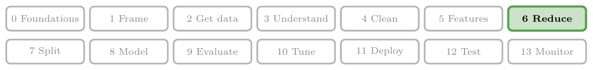
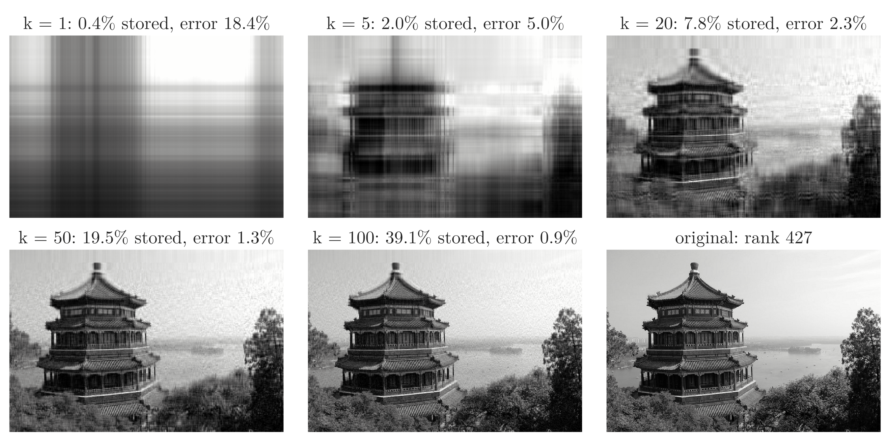
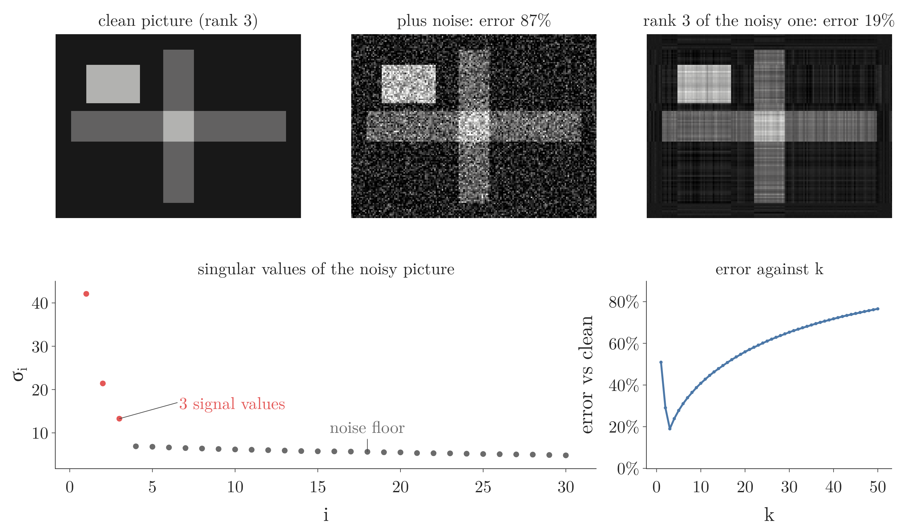

<!-- where-this-fits: generated by course_map/build_map.py; edit concepts.yaml, not this block -->
> **Where this fits:** Pipeline map step 6 (Reduce dimensions). See the [Course map](../01-course-map/note.md).
>
> 
>
> - **Builds on:** Singular value decomposition ([Note 611](../611-computing-the-svd/note.md)).
> - **Compare with:** PCA ([Note 49](../49-pca-mnist/note.md)).
<!-- /where-this-fits -->

## 1. Overview

> **Key point:** The SVD writes any matrix as a sum of rank-1 layers, ordered from most to least important. Keeping only the first $k$ layers gives the best possible rank-$k$ approximation, and its error is the first singular value left out.

This Note follows *Mathematics for Machine Learning* (Deisenroth, Faisal, Ong, 2020), §4.6 Matrix Approximation.



The first SVD Note, the [SVD geometry Note](../610-svd-geometry/note.md), introduced $A = U\Sigma V^{\mathsf T}$, and the [computing the SVD Note](../611-computing-the-svd/note.md) found the factors by hand. Now we use them. Figure 1 shows the payoff: a photo of 273,280 numbers is recognisable from 8% of them, and close to the original from 20%.

This Note covers:

- the SVD as a sum of rank-1 layers (Section 2);
- the rank-$k$ approximation (Section 3);
- why it is the best one possible, the Eckart–Young theorem (Section 4);
- compressing an image (Section 5) and choosing $k$ (Section 6);
- removing noise (Section 7).

## 2. A matrix as a sum of rank-1 layers

> **Key point:** $A = \sigma_1\mathbf{u}_1\mathbf{v}_1^{\mathsf T} + \sigma_2\mathbf{u}_2\mathbf{v}_2^{\mathsf T} + \dots$: each term is a column times a row, scaled by a singular value.

### 2.1 The outer product

> **Key point:** A column vector times a row vector is a whole matrix, and every row of it is a multiple of the same row: a matrix of rank 1.

The dot product multiplies a row by a column and gives one number (see the [dot product and cosine similarity Note](../362-dot-product-and-cosine-similarity/note.md), section 3.1). Multiplying the other way round, a column by a row, gives a matrix.

1. **In words:** the **outer product** $\mathbf{u}\mathbf{v}^{\mathsf T}$ of an $m$-vector $\mathbf{u}$ and an $n$-vector $\mathbf{v}$ is the $m \times n$ matrix whose entry in row $i$, column $j$ is $u_i v_j$.
2. **Formula:**
   $$\mathbf{u}\mathbf{v}^{\mathsf T} = \begin{bmatrix} u_1 \cr  u_2 \end{bmatrix}\begin{bmatrix} v_1 & v_2 \end{bmatrix} = \begin{bmatrix} u_1v_1 & u_1v_2 \cr  u_2v_1 & u_2v_2 \end{bmatrix}$$
3. **Example:**
   $$\begin{bmatrix} 1 \cr  3 \end{bmatrix}\begin{bmatrix} 1 & 1 \end{bmatrix} = \begin{bmatrix} 1 & 1 \cr  3 & 3 \end{bmatrix}$$

Every row is a multiple of $\mathbf{v}^{\mathsf T}$ and every column a multiple of $\mathbf{u}$, so the rank is 1. The outer product needs only $m + n$ numbers to describe, instead of $m \times n$.

### 2.2 Splitting the SVD into layers

> **Key point:** Multiplying out $U\Sigma V^{\mathsf T}$ pairs each $\mathbf{u}_i$ only with its own $\mathbf{v}_i$, because $\Sigma$ is diagonal.

1. **In words:** a matrix of rank $r$ is the sum of $r$ rank-1 layers. Layer $i$ is the outer product of the $i$-th left and right singular vectors, weighted by the $i$-th singular value.
2. **Formula:**
   $$A = U\Sigma V^{\mathsf T} = \sum_{i=1}^{r} \sigma_i\thinspace \mathbf{u}_i\mathbf{v}_i^{\mathsf T}$$
3. **Example:** for $A$ with rows $[3, 0]$ and $[4, 5]$, with $\sigma_1 = 3\sqrt5$, $\mathbf{u}_1 = \frac{1}{\sqrt{10}}[1, 3]$, $\mathbf{v}_1 = \frac{1}{\sqrt2}[1, 1]$, and $\sigma_2 = \sqrt5$, $\mathbf{u}_2 = \frac{1}{\sqrt{10}}[-3, 1]$, $\mathbf{v}_2 = \frac{1}{\sqrt2}[-1, 1]$:
   $$\sigma_1\mathbf{u}_1\mathbf{v}_1^{\mathsf T} = \frac{3\sqrt5}{\sqrt{20}}\begin{bmatrix} 1 & 1 \cr  3 & 3 \end{bmatrix} = \begin{bmatrix} 1.5 & 1.5 \cr  4.5 & 4.5 \end{bmatrix}, \qquad \sigma_2\mathbf{u}_2\mathbf{v}_2^{\mathsf T} = \frac{\sqrt5}{\sqrt{20}}\begin{bmatrix} 3 & -3 \cr  -1 & 1 \end{bmatrix} = \begin{bmatrix} 1.5 & -1.5 \cr  -0.5 & 0.5 \end{bmatrix}$$
   and the two layers add up to $\begin{bmatrix} 3 & 0 \cr  4 & 5 \end{bmatrix} = A$.

Why the cross terms vanish: in $U\Sigma V^{\mathsf T}$, column $i$ of $U$ meets row $j$ of $V^{\mathsf T}$ through the entry $\Sigma_{ij}$, and that is 0 unless $i = j$. Layers with $\sigma_i = 0$ add nothing, so only the first $r$ count.

The first layer is the big one. The first layer already has the right overall size: its entries are close to $A$'s in the bottom row. The second layer is a smaller correction.

Figure 2 shows the first four layers of the photo of Figure 1. Each is a column times a row, so each is a pattern of horizontal and vertical stripes. The first one is a blurred brightness map; later ones add finer corrections, positive (blue) in some places and negative (red) in others.


> **Python:** One layer is `s[i] * np.outer(U[:, i], Vt[i])`.
>
> ```python
> import numpy as np
>
> A = np.array([[3, 0], [4, 5]])
> U, s, Vt = np.linalg.svd(A)
> L1 = s[0] * np.outer(U[:, 0], Vt[0])   # [[1.5, 1.5], [4.5, 4.5]]
> L2 = s[1] * np.outer(U[:, 1], Vt[1])   # [[1.5, -1.5], [-0.5, 0.5]]
> L1 + L2                                # gives back A
> ```
>
> NumPy's signs of $\mathbf{u}_i$ and $\mathbf{v}_i$ may both be flipped; their outer product, and so the layer, is the same.

## 3. The rank-$k$ approximation

> **Key point:** Stop the sum after $k$ layers. The result has rank $k$ and needs only $k(m + n + 1)$ numbers.

1. **In words:** keep the $k$ largest singular values with their vectors and drop the rest. The result $\hat{A}_k$ ("A hat k") is the **rank-$k$ approximation** of $A$, also called the **truncated SVD**.
2. **Formula:**
   $$\hat{A}_k = \sum_{i=1}^{k} \sigma_i\thinspace \mathbf{u}_i\mathbf{v}_i^{\mathsf T} = U_k\Sigma_kV_k^{\mathsf T}$$
   where $U_k$ is the first $k$ columns of $U$, $\Sigma_k$ the top-left $k \times k$ block of $\Sigma$, and $V_k$ the first $k$ columns of $V$.
3. **Example:** for $A$ with rows $[3, 0]$ and $[4, 5]$, the rank-1 approximation is the first layer:
   $$\hat{A}_1 = \begin{bmatrix} 1.5 & 1.5 \cr  4.5 & 4.5 \end{bmatrix}$$

**Storage.** An $m \times n$ matrix has $mn$ numbers. $\hat{A}_k$ is stored as $k$ columns of $U$ ($km$ numbers), $k$ singular values, and $k$ columns of $V$ ($kn$ numbers):

1. **In words:** each kept layer costs one $\mathbf{u}$, one $\sigma$ and one $\mathbf{v}$.
2. **Formula:**
   $$\text{numbers stored} = k(m + n + 1)$$
3. **Example:** the photo of Figure 1 is $427 \times 640$, so it has $273{,}280$ numbers. With $k = 20$ we store $20 \times (427 + 640 + 1) = 21{,}360$ numbers, which is 7.8% of the original.

The layered storage only pays off when $k$ is small: with $k$ near $\min(m, n)$, the layers cost more than the matrix itself.

## 4. The best approximation: Eckart–Young

> **Key point:** No matrix of rank $k$ is closer to $A$ than $\hat{A}_k$. Its error, measured as the largest stretch of $A - \hat{A}_k$, is exactly $\sigma_{k+1}$.

### 4.1 Measuring the size of a matrix

> **Key point:** The spectral norm of a matrix is the most it can stretch a unit vector, which is its largest singular value.

To say which approximation is "closest", we need the size of the difference $A - B$. Vectors have a length (the L2 norm of the [magnitude, distance and scalar operations Note](../361-magnitude-distance-and-scalar-operations/note.md)). For matrices we use the largest stretch.

1. **In words:** the **spectral norm** $\lVert M\rVert_2$ is the longest $M\mathbf{x}$ can be for a unit vector $\mathbf{x}$. By the ellipse picture of the [SVD geometry Note](../610-svd-geometry/note.md) (section 5.2), that is $\sigma_1$.
2. **Formula:**
   $$\lVert M\rVert_2 = \max_{\lVert\mathbf{x}\rVert = 1}\lVert M\mathbf{x}\rVert = \sigma_1(M)$$
3. **Example:** for $A$ with rows $[3, 0]$ and $[4, 5]$, $\lVert A\rVert_2 = \sigma_1 = 6.71$.

### 4.2 The Eckart–Young theorem

> **Key point:** Among all rank-$k$ matrices $B$, the truncated SVD makes $\lVert A - B\rVert_2$ smallest, and the smallest value is $\sigma_{k+1}$.

1. **In words:** the error of the truncated SVD is the sum of the layers we dropped. The biggest of those is layer $k + 1$, so the largest stretch of the error is $\sigma_{k+1}$. The **Eckart–Young theorem** says no other rank-$k$ matrix does better (MML Thm 4.25; Eckart and Young 1936).
2. **Formula:**
   $$A - \hat{A}_k = \sum_{i=k+1}^{r}\sigma_i\thinspace \mathbf{u}_i\mathbf{v}_i^{\mathsf T}, \qquad \lVert A - \hat{A}_k\rVert_2 = \sigma_{k+1} \le \lVert A - B\rVert_2 \ \text{ for every } B \text{ of rank } k$$
3. **Example:** for $A$ and $k = 1$, the error is the second layer, rows $[1.5, -1.5]$ and $[-0.5, 0.5]$, whose largest stretch is $\sigma_2 = \sqrt5 \approx 2.24$. A natural alternative rank-1 guess, keeping the second row of $A$ and zeroing the first, $B$ with rows $[0, 0]$ and $[4, 5]$, leaves the error with rows $[3, 0]$ and $[0, 0]$: its largest stretch is 3, worse than 2.24.

The difference $A - \hat{A}_k$ is itself written in SVD form, with singular values $\sigma_{k+1}, \sigma_{k+2}, \dots$. Its largest one is $\sigma_{k+1}$, and the spectral norm of a matrix is its largest singular value. That reasoning is the whole proof of the error formula; the harder part is that no other $B$ wins.

> **Extra:** Why no other rank-$k$ matrix can win, in outline. A rank-$k$ matrix $B$ sends at least an $(n - k)$-dimensional set of inputs to zero; on those inputs $A - B$ acts exactly like $A$. The first $k + 1$ right singular vectors span a $(k + 1)$-dimensional set on which $A$ stretches every vector by at least $\sigma_{k+1}$. Two subspaces of $\mathbb{R}^n$ with dimensions adding up to more than $n$ must share a non-zero vector $\mathbf{x}$. On that $\mathbf{x}$, $(A - B)\mathbf{x} = A\mathbf{x}$, which is at least $\sigma_{k+1}$ times as long as $\mathbf{x}$, so $\lVert A - B\rVert_2 \ge \sigma_{k+1}$.

> **Extra:** The theorem also holds for a second common size measure (Eckart and Young 1936), the **Frobenius norm** $\lVert M\rVert_F$: the square root of the sum of all squared entries, the L2 norm of the matrix read as one long vector. It equals $\sqrt{\sigma_1^2 + \sigma_2^2 + \dots}$, and the truncated SVD's error is $\sqrt{\sigma_{k+1}^2 + \sigma_{k+2}^2 + \dots}$. For $A$: $\lVert A\rVert_F = \sqrt{9 + 0 + 16 + 25} = \sqrt{50} = \sqrt{45 + 5}$. In NumPy, `np.linalg.norm(M)` is the Frobenius norm and `np.linalg.norm(M, 2)` the spectral norm.

## 5. Compressing an image

> **Key point:** A grayscale image is a matrix of brightness values; its singular values fall fast, so a few layers carry most of the picture.

A grayscale photo is a matrix: one row per pixel row, one column per pixel column, each entry a brightness between 0 (black) and 1 (white). The photo of Figure 1 is scikit-learn's sample image `china.jpg` turned to grayscale: a $427 \times 640$ matrix of rank 427.

Reading Figure 1 in order of $k$:

- **$k = 1$** (0.4% of the numbers): one column times one row. All we see is a brightness map made of stripes, with the dark lower half and the bright sky.
- **$k = 5$** (2.0%): the building appears as a dark block.
- **$k = 20$** (7.8%): the building and the trees are recognisable.
- **$k = 50$** (19.5%) and **$k = 100$** (39.1%): close to the original, with some graininess in the flat sky.

The "error" in each title is $\sigma_{k+1}/\sigma_1$: the spectral error of Section 4, relative to the size of the image. It drops from 18.4% at $k = 1$ to 2.3% at $k = 20$.

> **Extra:** Real image formats such as JPEG do not use the SVD. They use a fixed set of patterns (cosine waves on small $8 \times 8$ blocks), which is faster and needs no $U$ and $V$ to be stored for each picture (Wallace 1991). The SVD example shows the idea of keeping the important directions, not how photos are actually compressed.

## 6. How many singular values to keep

> **Key point:** Plot the singular values: they usually fall steeply and then flatten. Keep the steep part, or keep enough to reach a chosen share of $\sum\sigma_i^2$.

Figure 3 (left) plots all 427 singular values of the photo on a log scale. The first is 326.7, the fifth 18.6, the fiftieth about 4.4, and the last about 0.01. A few directions carry most of the picture.


Two common ways to choose $k$:

- **The elbow.** Keep the singular values before the curve flattens: the steep part is structure, the flat part detail or noise.
- **A share of the total.** The sum of the squared singular values equals the sum of all squared entries of the matrix (the Frobenius norm squared). Figure 3 (right) shows that the first 5 singular values keep 96.5% of it, the first 20 keep 98.1%, the first 50 keep 98.9%.

The share rule is the same rule as choosing the number of principal components by explained variance in the [PCA on MNIST Note](../49-pca-mnist/note.md) (section 7). The match is not a coincidence: the [SVD in machine learning Note](../613-svd-in-machine-learning/note.md) shows that PCA is an SVD.

> **Python:** The rank-$k$ approximation of the photo.
>
> ```python
> from sklearn.datasets import load_sample_image
>
> rgb = load_sample_image("china.jpg")
> img = rgb.astype(float) @ [0.299, 0.587, 0.114] / 255
> U, s, Vt = np.linalg.svd(img, full_matrices=False)
> k = 20
> img_k = (U[:, :k] * s[:k]) @ Vt[:k]
> s[k] / s[0]                             # 0.023
> ```
>
> `U[:, :k] * s[:k]` scales column $i$ of $U_k$ by $\sigma_i$, which is $U_k\Sigma_k$ without building the diagonal matrix. The grayscale weights 0.299, 0.587 and 0.114 are the standard ones for red, green and blue (ITU-R BT.601). The Notebook has a slider that moves through the ranks.

## 7. Removing noise

> **Key point:** Random noise spreads its energy thinly over all singular values, while structure piles up in a few large ones. Keeping only the large ones removes most of the noise.

Figure 4 starts from a simple $120 \times 160$ picture made of a square and two bars. Each shape is a rectangle of constant brightness, which is an outer product (a column of 1s and 0s times a row of 1s and 0s), so the picture has rank 3. We add random noise to every pixel (normal, with standard deviation 0.3).



The singular values of the noisy picture (Figure 4, bottom left) split into two groups:

- three large ones, 42.1, 21.4 and 13.3: the shapes;
- a flat **noise floor** of values near 5 to 7: the noise.

The intuition: noise has no structure, so no direction is special and its contribution spreads over all singular values at a low level. The shapes are concentrated in three directions, so they stand out above the floor. The height of the floor can be predicted: for an $m \times n$ matrix of pure noise with standard deviation $s$, the largest singular value is close to $s(\sqrt m + \sqrt n)$ (Gavish and Donoho 2014). Here that is $0.3 \times (\sqrt{120} + \sqrt{160}) = 7.1$, the top of the observed floor.

1. **In words:** measure the error as the size of (approximation minus clean picture) relative to the size of the clean picture, both in the Frobenius norm. Keep the singular values above the noise floor.
2. **Formula:**
   $$\text{error} = \frac{\lVert \hat{A}_k - A_{\text{clean}}\rVert_F}{\lVert A_{\text{clean}}\rVert_F}$$
3. **Example:** the noisy picture itself has an error of 87%. Its rank-3 approximation has 19%. Keeping more layers makes it worse again: 24% at $k = 4$, 41% at $k = 10$, 77% at $k = 50$ (Figure 4, bottom right), because each extra layer adds back mostly noise.

The same idea, keeping only the singular values above the noise floor, is a standard way to remove noise from a data matrix (Gavish and Donoho 2014). Picking $k$ at the edge of the noise floor is the elbow rule of Section 6.

## 8. Summary

| Idea | Formula | Example |
|---|---|---|
| Outer product | $\mathbf{u}\mathbf{v}^{\mathsf T}$, entry $u_iv_j$; rank 1 | $[1, 3][1, 1]$ has rows $[1, 1]$, $[3, 3]$ |
| Layers | $A = \sum_i \sigma_i\mathbf{u}_i\mathbf{v}_i^{\mathsf T}$ | $A$ = rows $[1.5, 1.5]$, $[4.5, 4.5]$ $+$ rows $[1.5, -1.5]$, $[-0.5, 0.5]$ |
| Rank-$k$ approximation | $\hat{A}_k = U_k\Sigma_kV_k^{\mathsf T}$ | $\hat{A}_1$ has rows $[1.5, 1.5]$, $[4.5, 4.5]$ |
| Storage | $k(m + n + 1)$ | photo, $k = 20$: 21,360 of 273,280 (7.8%) |
| Spectral norm | $\lVert M\rVert_2 = \sigma_1(M)$ | $\lVert A\rVert_2 = 6.71$ |
| Eckart–Young | $\lVert A - \hat{A}_k\rVert_2 = \sigma_{k+1}$, the smallest possible | error of $\hat{A}_1$: 2.24; another rank-1 guess: 3 |
| Noise reduction | keep the $\sigma_i$ above the noise floor | error 87% $\to$ 19% at $k = 3$ |

- Every matrix is a weighted sum of rank-1 layers, largest weight first.
- Dropping the small layers gives the best rank-$k$ approximation, with error $\sigma_{k+1}$.
- Fast-falling singular values mean a matrix can be compressed well.
- Noise forms a flat floor of small singular values; truncating below it removes most of the noise.

## 9. Sources

- Deisenroth, M. P., Faisal, A. A. and Ong, C. S. (2020). *Mathematics for Machine Learning*. Cambridge University Press. Section 4.6 and Theorem 4.25 (MML).
- Eckart, C. and Young, G. (1936). "The approximation of one matrix by another of lower rank". *Psychometrika* 1(3).
- Gavish, M. and Donoho, D. L. (2014). "The Optimal Hard Threshold for Singular Values is $4/\sqrt{3}$". *IEEE Transactions on Information Theory* 60(8).
- ITU-R Recommendation BT.601. *Studio encoding parameters of digital television*. Luma weights 0.299, 0.587, 0.114.
- Wallace, G. K. (1991). "The JPEG Still Picture Compression Standard". *Communications of the ACM* 34(4).

## 10. Key terms

| Term | Meaning |
|---|---|
| Outer product | A column vector times a row vector, $\mathbf{u}\mathbf{v}^{\mathsf T}$: a matrix of rank 1 with entries $u_iv_j$ |
| Rank-1 layer | One term $\sigma_i\mathbf{u}_i\mathbf{v}_i^{\mathsf T}$ of the SVD written as a sum |
| Rank-$k$ approximation (truncated SVD) | The sum of the first $k$ layers, $\hat{A}_k = U_k\Sigma_kV_k^{\mathsf T}$ |
| Spectral norm | The largest stretch of a matrix, $\lVert M\rVert_2 = \sigma_1$ |
| Frobenius norm | The square root of the sum of all squared entries of a matrix, $\sqrt{\sum\sigma_i^2}$ |
| Eckart–Young theorem | The truncated SVD is the closest rank-$k$ matrix to $A$; its spectral error is $\sigma_{k+1}$ |
| Noise floor | The flat run of small singular values that random noise produces |
