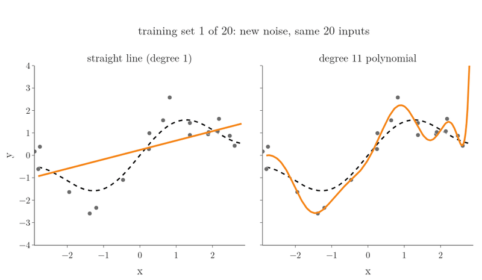
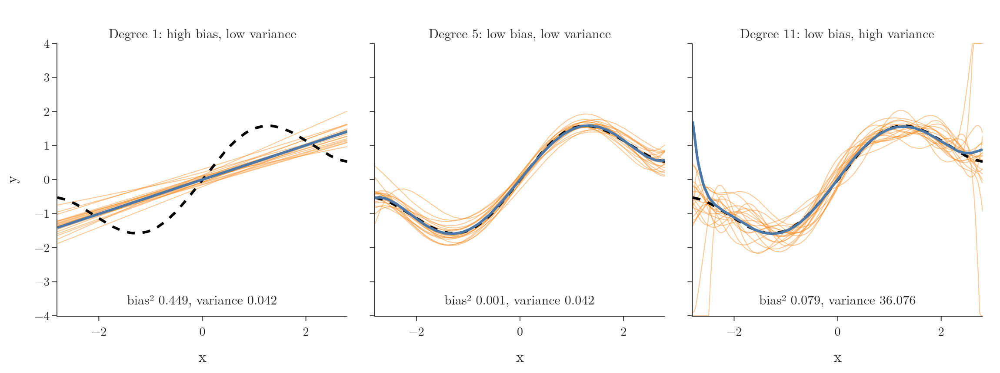
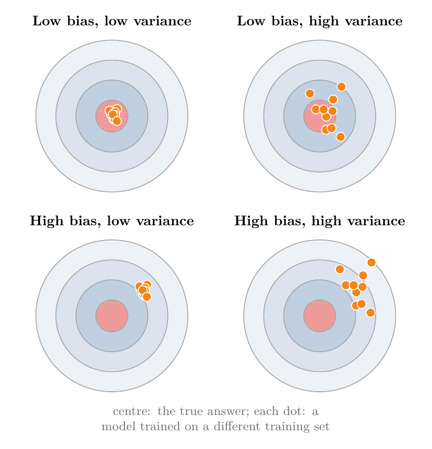
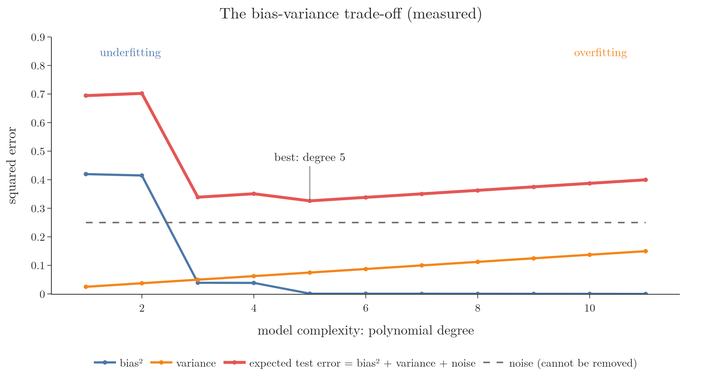

<!-- where-this-fits: generated by course_map/build_map.py; edit concepts.yaml, not this block -->
> **Where this fits:** Pipeline map step 9 (Evaluate). See the [Course map](../01-course-map/note.md).
>
> 
>
> - **Builds on:** Overfitting ([Note 61](../61-polynomial-regression/note.md)); Underfitting ([Note 61](../61-polynomial-regression/note.md)); Polynomial regression ([Note 61](../61-polynomial-regression/note.md)).
> - **Leads to:** Ridge regression ([Note 63](../63-ridge-regression-intuition/note.md)); Boosting ([Note 101](../101-ensemble-learning/note.md)); Ensemble learning ([Note 101](../101-ensemble-learning/note.md)); Bagging ([Note 105](../105-bagging-intuition/note.md)).
> - **Compare with:** K-nearest neighbours ([Note 6](../06-instance-vs-model-based/note.md)).
<!-- /where-this-fits -->

## 1. Overview

> **Key point:** A model's error on new data comes from two sources: bias (it is too simple to capture the pattern) and variance (it changes too much with the training data). Making one smaller usually makes the other larger (ISL §2.2.2).

The polynomial regression Note showed that a degree too low underfits and a degree too high overfits. This Note gives the two problems their standard names, **bias** and **variance**, and explains why reducing one tends to increase the other. The tension between them is the **bias-variance trade-off**, one of the central ideas of ML.

Throughout, a **feature** is an input variable (one column of the data table), the **target** is the output we predict, and an **observation** is one record (one row).

## 2. Bias

> **Key point:** Bias is a model's inability to capture the true relationship. A high-bias model makes the same kind of mistake whatever data it is trained on.

Suppose the true relationship between a feature and the target is a curve, and we fit a straight line. However the line is placed, it cannot bend to follow the curve. The error that comes from the model's shape being too simple is its **bias**.

A high-bias model:

- has a large error on the **training data** itself, because it cannot even fit the points it learns from;
- also has a large error on new data;
- is **underfitting**.

## 3. Variance

> **Key point:** Variance is how much a model changes when trained on a different sample of data. A high-variance model fits the noise of whichever sample it saw.

Now fit a very flexible model, such as a high-degree polynomial. The polynomial can bend through almost every training point, so its training error is tiny. But train it again on a different random sample from the same source, and it bends differently, because it followed the noise of each sample.

How much the model's predictions change from one training set to another is its **variance**. A high-variance model:

- has a small error on the training data;
- has a large error on new data, because it learned noise that does not repeat;
- shows a big gap between training and test performance;
- is **overfitting**.

Model variance has a different meaning from the variance of a feature, the average squared distance of its values from their mean (see the [understanding your data Note](../19-understanding-your-data/note.md), section seven point one, and the [PCA geometric intuition Note](../47-pca-geometric-intuition/note.md), section five). Model variance is the spread of the model's predictions across training sets, not the spread of the data.

## 4. Seeing bias and variance

> **Key point:** Train the same model on many training sets. The spread of the resulting curves is the variance; how far their average is from the truth is the bias.

We use one feature $x$ and the target $y$; each observation is one $(x, y)$ pair. The true relationship is a wave (dashed black).

We build many training sets of 20 observations, as in Figure 1 and Figure 2. Every set uses the same 20 values of $x$ (the grey ticks); only the random noise in $y$ is new each time, the standard setting for measuring bias and variance (ESL §7.3). We train a model on each set and draw 20 of the curves (orange) and their average (blue). The numbers are averaged over 10,000 training sets.

Figure 1 shows the experiment as it happens, for two of the models. Each frame draws a new training set and refits both; the earlier fits stay behind as faint ghosts. Watch the lines stay together but miss the wave, while the degree-11 curves scatter more with every new set.

Figure 2 collects the result for three models, with a middle model added.

| Model | Curves | Bias² | Variance |
|---|---|---|---|
| Degree 1 | all similar, all wrong | 0.4195 | 0.025 |
| Degree 5 | similar and close to the truth | 0.0011 | 0.075 |
| Degree 11 | right on average, very different from each other | 0.0000 | 0.150 |

- **Degree 1** (a straight line) gives nearly the same line every time: low variance. But that line can never follow the wave: high bias.
- **Degree 11** follows the wave on average (its average curve sits on the truth) but every curve swings differently, wildly so between the inputs near the edges: high variance.
- **Degree 5** has both low: the target.

The dartboard in Figure 3 is a common way to picture the four combinations: bias is how far the throws land from the centre on average, variance is how scattered they are.

{height=42%}

## 5. The trade-off

> **Key point:** As a model becomes more complex, bias falls and variance rises. The best model is at the complexity where their sum is smallest.

The expected squared error of a model on new data splits into three parts (ISL §2.2.2, equation 2.7):

$$\text{expected error} = \text{bias}^2 + \text{variance} + \text{noise}$$

- **Bias²:** error from the model being too simple.
- **Variance:** error from the model depending too much on the particular training set.
- **Noise:** randomness in the data itself. No model can remove it.

With numbers, for degree 5: $0.0011 + 0.075 + 0.25 = 0.326$. For degree 1: $0.4195 + 0.025 + 0.25 = 0.695$.

Figure 4 measures all three for degrees 1 to 11. The test error here is the error on a new noisy target at the same 20 inputs.

{height=48%}

- On the left, simple models have high bias and low variance: **underfitting**.
- On the right, complex models have low bias and high variance: **overfitting**.
- Bias² falls as the degree grows and never rises again: 0.42 at degree 1, 0.001 at degree 5, 0.0000 from degree 7 on.
- Variance rises steadily, from 0.025 at degree 1 to 0.150 at degree 11.
- The total error is smallest in between, here at degree 5 (0.326), close to the noise floor of 0.25.

Making a model more flexible buys lower bias at the price of higher variance, and the reverse: like a tailor choosing between one standard size that fits nobody well and a suit cut so tight to one fitting that it fails the next day. This exchange of one error for the other is the trade-off. The goal is not zero bias or zero variance, but the lowest total error.

> **Extra:** The shapes in Figure 4 are exactly what the theory predicts for a least-squares fit with fixed inputs (ESL §7.3, equations 7.11 and 7.12):
>
> - **Bias² never rises with the degree.** Every polynomial of degree 5 is also a polynomial of degree 6 (with a zero last coefficient), so a larger family can always fit the true curve at least as well as a smaller one.
> - **Variance grows in a straight line:** it equals $\sigma^2 p / N$, where $\sigma^2 = 0.25$ is the noise, $p$ is the number of coefficients (degree + 1) and $N = 20$ is the number of observations. For degree 11: $0.25 \times 12 / 20 = 0.150$, the value we measured.
>
> The notebook checks both formulas against the 10,000 fits; they agree to three decimals. We use so many training sets because averaging $K$ curves keeps $1/K$ of their variance; with few sets, that leftover variance would look like bias.

## 6. What to do about it

> **Key point:** Underfitting: make the model more flexible or add better features. Overfitting: get more data, simplify the model, or use regularisation, bagging or boosting.

| Problem | Signs | Remedies |
|---|---|---|
| High bias (underfitting) | high training error, test error about the same | a more complex model, more or better features (feature engineering) |
| High variance (overfitting) | low training error, much higher test error | more training data, a simpler model, regularisation, bagging |

Three standard techniques, all covered later, target this trade-off directly:

- **Regularisation** (Ridge, Lasso, Elastic Net, the next Notes): keeps a flexible model but penalises large coefficients. As the penalty grows, variance falls and bias rises (ISL §6.2.1).
- **Bagging** (for example random forests): averages many high-variance models trained on different bootstrap samples; averaging many results reduces variance (ISL §8.2.1). The Extra in Section 5 uses the same fact.
- **Boosting**: builds a model in sequence from many small, simple models, each fitted to the errors left by the ones before, so the fit improves step by step where it was poor (ISL §8.2.3).

> **Extra:** The terms come from statistics, where the bias of an estimate is the difference between its average value and the true value, which is exactly what Section 4 measured with the average curve. The "bias" here is different from the bias (intercept) term of a model and from social bias in data; it means systematic error of the model's predictions.

## 7. Summary

| | High bias | High variance |
|---|---|---|
| Model | too simple | too flexible |
| Training error | high | low |
| Test error | high | high |
| Name | underfitting | overfitting |
| Fixes | more complex model, better features | more data, simpler model, regularisation, bagging |

- Expected error = bias² + variance + noise; the noise cannot be removed.
- More complexity lowers bias and raises variance; the best model balances them.
- On the wave example, degree 5 gives the lowest total error (0.33), against 0.70 for a line and 0.40 for degree 11.

## 8. Sources

**Built from**

- CampusX, "Bias Variance Trade-off | Overfitting and Underfitting in Machine Learning", YouTube, https://www.youtube.com/watch?v=74DU02Fyrhk

**Other references**

- **ISL**: James, Witten, Hastie, Tibshirani, *An Introduction to Statistical Learning*, 2nd ed., Springer, 2021. §2.2.2 (the bias-variance trade-off, equation 2.7), §6.2.1 (ridge regression), §8.2.1 (bagging), §8.2.3 (boosting).
- **ESL**: Hastie, Tibshirani, Friedman, *The Elements of Statistical Learning*, 2nd ed., Springer, 2009. Section 7.3, "The Bias-Variance Decomposition".

## 9. Key terms

| Term | Meaning |
|---|---|
| Feature | An input variable: one column of the data table |
| Observation | One record: one row of the data table |
| Target | The output we predict |
| Bias | Error from a model being too simple to capture the true relationship |
| Variance | How much a model's predictions change when it is trained on a different sample of data |
| Bias-variance trade-off | Lowering bias by adding complexity tends to raise variance, and the reverse |
| Noise (irreducible error) | Randomness in the data that no model can predict |
| Regularisation | Penalising large coefficients to reduce a model's variance |
| Bagging | Averaging many models trained on different samples of the data to reduce variance |
| Boosting | Combining many simple models in sequence, each fitted to the errors left by the ones before |
