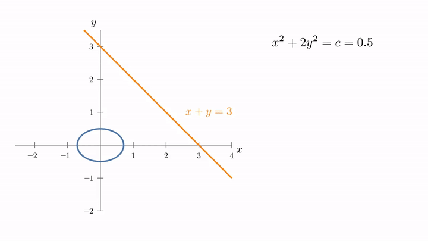

<!-- where-this-fits: generated by course_map/build_map.py; edit concepts.yaml, not this block -->
> **Where this fits:** Pipeline map step 0 (Foundations). See the [Course map](../01-course-map/note.md).
>
> 
>
> - **Builds on:** Partial derivatives and gradients ([Note 601](../601-partial-derivatives-and-gradients/note.md)).
> - **Leads to:** Convex sets and convex optimisation ([Note 621](../621-convex-sets-and-functions/note.md)).
<!-- /where-this-fits -->

## 1. Overview

> **Key point:** To minimise a function while a constraint must hold, we look for the point where a level curve of the function just touches the constraint; there the two gradients are parallel, and the Lagrange multiplier is the factor between them.

This Note follows Chapter 7 (Section 7.2) of *Mathematics for Machine Learning* (Deisenroth, Faisal and Ong, 2020).



Gradient descent (see the [gradient descent Note](../57-gradient-descent/note.md)) searches the whole parameter space. Often the parameters must also obey a rule: weights that stay inside a circle, probabilities that add up to 1, or every training point on the right side of a margin. Figure 1 shows the idea this Note builds on: grow a level curve of the function until it first touches the set of allowed points.

This Note uses the gradient and its key property, that it crosses contour lines at right angles, from the [partial derivatives and gradients Note](../601-partial-derivatives-and-gradients/note.md). The Sections are: the problem, the geometry with one equality constraint, the Lagrangian, inequality constraints, duality, and two ML examples.

## 2. Constrained optimisation problems

> **Key point:** We minimise $f(\mathbf{x})$ over only the points that satisfy every constraint; this set of allowed points is the feasible region.

A **constrained optimisation** problem asks to minimise a function while keeping one or more conditions true (see the [SVM maths Note](../93-svm-maths/note.md)). The function to minimise is the **objective function**. The general form uses two kinds of constraint:

1. **In words:** minimise $f$ over all $\mathbf{x}$ for which every inequality function is at most 0 and every equality function is exactly 0.
2. **Formula:**
   $$\min_{\mathbf{x}} f(\mathbf{x}) \quad \text{subject to} \quad g_i(\mathbf{x}) \le 0 \ \ (i = 1, \dots, m), \qquad h_j(\mathbf{x}) = 0 \ \ (j = 1, \dots, n)$$
3. **Example:** minimise $f(x, y) = x^2 + 2y^2$ subject to $x + y = 3$. Here $n = 1$, with $h(x, y) = 3 - x - y$, and there are no inequalities. The point $(3, 0)$ is allowed and gives $f = 9$; the point $(0, 0)$ gives $f = 0$ but breaks the constraint.

The set of points that satisfy every constraint is the **feasible region**. Any constraint of the form "$\ge$" can be turned around: $x + y \ge 3$ is the same as $3 - x - y \le 0$.

Without the constraint, the minimum of $f$ is at $(0, 0)$ with $f = 0$. The constraint forbids that point, so the answer must lie somewhere on the line $x + y = 3$. The question is where.

## 3. The geometry: a level curve touching the constraint

> **Key point:** At the constrained minimum, the level curve of $f$ through that point is tangent to the constraint, so the gradient of $f$ and the gradient of the constraint point along the same line.

### 3.1 Growing the level curve

> **Key point:** Small level curves miss the constraint; the first one to reach it touches it at the lowest feasible value.

The level curves of $f = x^2 + 2y^2$ are ellipses $x^2 + 2y^2 = c$ around the origin, larger for larger $c$. Figure 1 grows $c$ step by step:

- **$c = 0.5$ and $c = 3$:** the ellipse does not reach the line. No feasible point has a value this low.
- **$c = 6$:** the ellipse first touches the line, at the single point $(2, 1)$. Check: $2 + 1 = 3$, and $2^2 + 2 \times 1^2 = 6$.
- **$c > 6$:** the ellipse crosses the line at two points, but these have higher values.

So the constrained minimum is $(2, 1)$ with $f = 6$. At that point the ellipse and the line are **tangent**: they touch without crossing.

### 3.2 Tangent curves have parallel gradients

> **Key point:** The gradient is perpendicular to its level curve; when two curves are tangent, both gradients are perpendicular to the same direction, so one is a multiple of the other.

The gradient of a function is perpendicular to its contour lines (see the [partial derivatives and gradients Note](../601-partial-derivatives-and-gradients/note.md), Section 4.2). The constraint line $x + y = 3$ is itself a contour line of the function $x + y$. At the touching point both curves share one tangent direction, so both gradients are perpendicular to it.

1. **In words:** at the constrained minimum, the gradient of $f$ is a multiple of the gradient of the constraint function.
2. **Formula:** for a constraint $h(\mathbf{x}) = 0$,
   $$\nabla f(\mathbf{x}^*) = -\lambda\, \nabla h(\mathbf{x}^*) \quad \text{for some number } \lambda$$
   The number $\lambda$ is the **Lagrange multiplier**. The minus sign is a convention that matches Section 4.
3. **Example:** at $(2, 1)$, $\nabla f = [2x,\ 4y] = [4,\ 4]$. With $h = 3 - x - y$, $\nabla h = [-1,\ -1]$. Then $[4, 4] = -4 \times [-1, -1]$, so $\lambda = 4$. Figure 1 (last frame) draws $\nabla f$ and $\nabla(x + y) = [1, 1]$: they point the same way.

Why must they be parallel? If $\nabla f$ had a part along the line, we could slide along the line in the opposite direction and lower $f$ while staying feasible. Only when $\nabla f$ points straight across the line is there no downhill direction left.

## 4. The Lagrangian

> **Key point:** We add the constraints to the objective, each multiplied by its own Lagrange multiplier; setting all partial derivatives of this Lagrangian to zero gives the tangency condition and the constraint together.

### 4.1 One function holds all the conditions

> **Key point:** $\mathcal{L}(\mathbf{x}, \lambda) = f(\mathbf{x}) + \lambda h(\mathbf{x})$; its gradient in $\mathbf{x}$ is the tangency condition, and its derivative in $\lambda$ is the constraint.

The tangency condition and the constraint can be packed into one unconstrained function, the **Lagrangian**.

1. **In words:** the objective plus each constraint times its multiplier.
2. **Formula:**
   $$\mathcal{L}(\mathbf{x}, \boldsymbol{\lambda}) = f(\mathbf{x}) + \sum_{j} \lambda_j\, h_j(\mathbf{x}) = f(\mathbf{x}) + \boldsymbol{\lambda}^{\mathsf T} \mathbf{h}(\mathbf{x})$$
   Setting $\nabla_{\mathbf{x}} \mathcal{L} = \mathbf{0}$ gives $\nabla f = -\sum_j \lambda_j \nabla h_j$, the tangency condition. Setting $\partial \mathcal{L}/\partial \lambda_j = 0$ gives back $h_j(\mathbf{x}) = 0$.
3. **Example:** for our problem, $\mathcal{L}(x, y, \lambda) = x^2 + 2y^2 + \lambda(3 - x - y)$. The three partial derivatives:
   $$\frac{\partial \mathcal{L}}{\partial x} = 2x - \lambda = 0, \qquad \frac{\partial \mathcal{L}}{\partial y} = 4y - \lambda = 0, \qquad \frac{\partial \mathcal{L}}{\partial \lambda} = 3 - x - y = 0$$
   The first two give $x = \lambda/2$ and $y = \lambda/4$. The third becomes $3 - 3\lambda/4 = 0$, so $\lambda = 4$, $x = 2$, $y = 1$: the point of Figure 1.

Three equations in three unknowns replaced a search along a line. With $n$ variables and $m$ constraints, there are $n + m$ equations in $n + m$ unknowns.

### 4.2 What the multiplier measures

> **Key point:** $\lambda$ is the rate at which the best value rises when the constraint is tightened by one unit.

The multiplier is more than a helper variable. It says how much the constraint costs.

1. **In words:** if we move the constraint by a small amount, the best value changes by about $\lambda$ times that amount.
2. **Formula:** for the constraint $x + y = c$, with best value $f^*(c)$,
   $$\frac{d f^*}{d c} = \lambda$$
3. **Example:** solving the same equations with $c$ instead of 3 gives $x = 2c/3$, $y = c/3$ and $f^*(c) = 2c^2/3$. Its derivative at $c = 3$ is $4c/3 = 4 = \lambda$. Moving the line to $x + y = 3.1$ raises the best value from $6$ to $6.41$: about $4 \times 0.1 = 0.4$.

> **Extra:** In economics, $\lambda$ is called the **shadow price** of the constraint (Boyd and Vandenberghe §5.6): how much the best result would improve if one more unit of the limited resource were available. The [linear and quadratic programming Note](../622-linear-and-quadratic-programming/note.md) reads multipliers this way.

## 5. Inequality constraints

> **Key point:** An inequality constraint either holds with equality at the answer (active, $\lambda > 0$) or does not matter there (inactive, $\lambda = 0$); multipliers of inequality constraints are never negative.

Most constraints in ML are inequalities: a margin of at least 1, a weight length of at most $t$. For an inequality $g(\mathbf{x}) \le 0$, two cases can happen (Figure 2).


- **Active:** the unconstrained minimum is not feasible, so the answer lies on the boundary $g = 0$. It behaves like an equality constraint. For $x + y \ge 3$, written $g = 3 - x - y \le 0$, the answer is again $(2, 1)$ with $\lambda = 4$.
- **Inactive:** the unconstrained minimum is already feasible, so the constraint plays no part and $\lambda = 0$. For $x + y \ge -1$, the point $(0, 0)$ satisfies $0 \ge -1$, and it is the answer.

Why must $\lambda \ge 0$ for an inequality? At an active constraint, $\nabla f = -\lambda \nabla g$. The gradient $\nabla g$ points out of the feasible region, towards larger $g$. With $\lambda \ge 0$, $\nabla f$ points into the region: $f$ increases as we move inside, so the boundary point is indeed lowest. A negative $\lambda$ would mean $f$ decreases inside, and the true answer would lie inside.

In both cases the product $\lambda\, g(\mathbf{x}^*)$ is 0: either $\lambda = 0$ (inactive) or $g = 0$ (active). For an equality constraint, the multiplier can have either sign.

> **Extra:** These rules together are the **KKT conditions** (Karush–Kuhn–Tucker), the standard check for a constrained minimum (Boyd and Vandenberghe §5.5.3):
>
> 1. **Stationarity:** $\nabla f + \sum_i \lambda_i \nabla g_i + \sum_j \nu_j \nabla h_j = \mathbf{0}$.
> 2. **Primal feasibility:** $g_i(\mathbf{x}) \le 0$ and $h_j(\mathbf{x}) = 0$.
> 3. **Dual feasibility:** $\lambda_i \ge 0$ (the equality multipliers $\nu_j$ can have any sign).
> 4. **Complementary slackness:** $\lambda_i\, g_i(\mathbf{x}) = 0$ for every $i$.
>
> For the active case of Figure 2: $[4, 4] + 4 \times [-1, -1] = \mathbf{0}$; $g = 3 - 2 - 1 = 0$; $\lambda = 4 \ge 0$; $4 \times 0 = 0$. All four hold.

### 5.1 From a wall to a price

> **Key point:** A hard constraint is an infinite penalty outside the feasible region; the Lagrangian replaces that wall with a straight-line penalty $\lambda g$.

One way to remove a constraint is a penalty that is 0 inside the feasible region and infinite outside:

$$J(\mathbf{x}) = f(\mathbf{x}) + \sum_{i} \mathrm{I}\big(g_i(\mathbf{x})\big), \qquad \mathrm{I}(z) = \begin{cases} 0 & z \le 0 \\ \infty & z > 0 \end{cases}$$

Minimising $J$ gives the same answer as the constrained problem, but a function that jumps to infinity is as hard to minimise as the original. The Lagrangian replaces the infinite wall with the linear term $\lambda_i g_i(\mathbf{x})$: a finite price per unit of violation. For $\lambda \ge 0$ and any feasible point, $\lambda g \le 0$, so $\mathcal{L}$ is never above $J$. This lower bound is the starting point of duality.

## 6. Lagrangian duality

> **Key point:** Minimising the Lagrangian over $\mathbf{x}$ for a fixed $\boldsymbol{\lambda}$ gives the dual function $D(\boldsymbol{\lambda})$; every value of it is a lower bound on the true minimum, and the best lower bound is the dual problem.

### 6.1 The dual function and the dual problem

> **Key point:** For each $\boldsymbol{\lambda} \ge 0$, $D(\boldsymbol{\lambda}) = \min_{\mathbf{x}} \mathcal{L}(\mathbf{x}, \boldsymbol{\lambda})$ is an unconstrained problem; then we maximise $D$ over $\boldsymbol{\lambda} \ge 0$.

The original problem, in the variables $\mathbf{x}$, is the **primal problem**. Fixing the multipliers and minimising over $\mathbf{x}$ turns it into a problem in the multipliers, the **dual problem**.

1. **In words:** for each choice of multipliers, find the lowest value of the Lagrangian; then choose the multipliers that make this lowest value as high as possible.
2. **Formula:**
   $$D(\boldsymbol{\lambda}) = \min_{\mathbf{x}} \mathcal{L}(\mathbf{x}, \boldsymbol{\lambda}), \qquad \text{dual problem:} \ \max_{\boldsymbol{\lambda} \ge \mathbf{0}} D(\boldsymbol{\lambda})$$
3. **Example:** for $\min x^2 + 2y^2$ subject to $3 - x - y \le 0$, the Lagrangian is $x^2 + 2y^2 + \lambda(3 - x - y)$. For a fixed $\lambda$ its minimum over $x, y$ is at $x = \lambda/2$, $y = \lambda/4$ (Section 4.1). Putting these back in:
   $$D(\lambda) = \frac{\lambda^2}{4} + \frac{\lambda^2}{8} + \lambda\Big(3 - \frac{3\lambda}{4}\Big) = 3\lambda - \frac{3\lambda^2}{8}$$
   Its derivative $3 - 3\lambda/4$ is zero at $\lambda = 4$, where $D(4) = 12 - 6 = 6$.

{height=36%}

### 6.2 Weak and strong duality

> **Key point:** The dual value is never above the primal minimum (weak duality); for convex problems the two are equal (strong duality).

Figure 3 shows two facts:

- **Weak duality:** every $D(\lambda)$ is at most the primal minimum. At $\lambda = 2$, $D(2) = 6 - 1.5 = 4.5 \le 6$.
- **Strong duality:** here the best lower bound reaches the minimum: $D(4) = 6$, the primal answer. This holds for convex problems such as this one (see the [convex sets and functions Note](../621-convex-sets-and-functions/note.md)), under a mild extra condition that this problem meets: some point must satisfy every inequality strictly (Slater's condition; Boyd and Vandenberghe §5.2.3). For non-convex problems a gap can remain.

Weak duality always holds. For a feasible $\mathbf{x}$ and $\boldsymbol{\lambda} \ge 0$, each term $\lambda_i g_i(\mathbf{x})$ is at most 0, so $\mathcal{L}(\mathbf{x}, \boldsymbol{\lambda}) \le f(\mathbf{x})$. The minimum over all $\mathbf{x}$ is lower still: $D(\boldsymbol{\lambda}) \le f(\mathbf{x})$ for every feasible $\mathbf{x}$, including the best one.

The same argument in general form is the **minimax inequality**: for any function $\varphi(\mathbf{x}, \mathbf{y})$, $\max_{\mathbf{y}} \min_{\mathbf{x}} \varphi \le \min_{\mathbf{x}} \max_{\mathbf{y}} \varphi$. The primal problem is $\min_{\mathbf{x}} \max_{\boldsymbol{\lambda} \ge 0} \mathcal{L}$, because the inner maximum is $f$ at feasible points and infinite elsewhere ($J$ of Section 5.1). The dual swaps the order.

Two further properties make the dual useful:

- $D$ is always **concave** (an upside-down bowl), even when $f$ and $g_i$ are not convex: it is the lowest of many functions that are linear in $\boldsymbol{\lambda}$ (MML §7.2). Maximising a concave function has no local-maximum trap.
- The dual has one variable per constraint, the primal one per parameter. Whichever is smaller can be the cheaper one to solve.

## 7. Two examples from ML

> **Key point:** Ridge and Lasso are constrained least squares in disguise, with the penalty strength as the multiplier; the SVM dual expresses the solution through one multiplier per training point, nonzero only for the support vectors.

### 7.1 Ridge and Lasso: the constraint view

> **Key point:** Minimising the squared error with $\lVert \mathbf{w} \rVert^2 \le t$ gives the same Lagrangian as Ridge's penalised loss, so each penalty strength matches one constraint size.

The [Ridge key points Note](../66-ridge-key-points/note.md) (Section 5.1) pictured Ridge as the point where the error ellipses first touch a circle around the origin, and called it the constrained view. Section 3 explains that picture: it is a level curve touching a constraint.

As a constrained problem:

$$\min_{\mathbf{w}} \lVert \mathbf{y} - X\mathbf{w} \rVert^2 \quad \text{subject to} \quad \lVert \mathbf{w} \rVert^2 - t \le 0$$

Its Lagrangian is $\lVert \mathbf{y} - X\mathbf{w} \rVert^2 + \lambda \lVert \mathbf{w} \rVert^2 - \lambda t$. For a fixed $\lambda$, the last term is a constant, so minimising over $\mathbf{w}$ is exactly Ridge regression with penalty strength $\lambda$ (see the [Ridge regression maths Note](../64-ridge-regression-maths/note.md)). A small circle (small $t$) needs a large multiplier; once the circle contains the ordinary least-squares answer, the constraint is inactive and $\lambda = 0$.

Lasso is the same with $|w_1| + |w_2| + \dots \le t$: a diamond instead of a circle. Its corners on the axes are why Lasso answers often have coefficients exactly 0 (ESL §3.4.3, Figure 3.11) (see the [Elastic Net Note](../69-elastic-net/note.md)).

### 7.2 The SVM dual

> **Key point:** In the dual of the hard-margin SVM, $\mathbf{w} = \sum_i \alpha_i y_i \mathbf{x}_i$, the data appears only through dot products $\mathbf{x}_i^{\mathsf T}\mathbf{x}_j$, and only the support vectors have $\alpha_i > 0$.

The hard-margin SVM minimises $\tfrac12 \lVert \mathbf{w} \rVert^2$ subject to $y_i(\mathbf{w}^{\mathsf T}\mathbf{x}_i + b) \ge 1$ for every point (see the [SVM soft margin Note](../94-svm-soft-margin/note.md), Section 3). Each point gives one constraint $g_i = 1 - y_i(\mathbf{w}^{\mathsf T}\mathbf{x}_i + b) \le 0$ and one multiplier $\alpha_i \ge 0$.

1. **In words:** set the derivatives of the Lagrangian in $\mathbf{w}$ and $b$ to zero and put the results back; what is left is a problem in the multipliers alone.
2. **Formula:** $\nabla_{\mathbf{w}} \mathcal{L} = \mathbf{0}$ gives $\mathbf{w} = \sum_i \alpha_i y_i \mathbf{x}_i$, and $\partial \mathcal{L}/\partial b = 0$ gives $\sum_i \alpha_i y_i = 0$. The dual problem is (MML §12.3)
   $$\max_{\boldsymbol{\alpha} \ge 0} \ \sum_i \alpha_i - \frac12 \sum_i \sum_j \alpha_i \alpha_j y_i y_j\, \mathbf{x}_i^{\mathsf T}\mathbf{x}_j \quad \text{subject to} \quad \sum_i \alpha_i y_i = 0$$
3. **Example:** two points, $\mathbf{x}_1 = (1, 1)$ with $y_1 = +1$ and $\mathbf{x}_2 = (-1, -1)$ with $y_2 = -1$. The equality forces $\alpha_1 = \alpha_2 = \alpha$. Then $\mathbf{w} = \alpha(1, 1) + \alpha(1, 1) = (2\alpha, 2\alpha)$, and the dual objective is $2\alpha - \tfrac12 \times 8\alpha^2 = 2\alpha - 4\alpha^2$. Its maximum is at $\alpha = 0.25$, giving $\mathbf{w} = (0.5, 0.5)$ and $b = 0$. The margin is $2/\lVert \mathbf{w} \rVert = 2.83$, exactly the distance between the two points.

Two things are new here:

- **Complementary slackness picks the support vectors.** A point strictly outside the margin has an inactive constraint, so $\alpha_i = 0$ and it does not appear in $\mathbf{w}$. Only points on the margin, the support vectors, have $\alpha_i > 0$.
- **Only dot products appear.** The data enters the dual only as $\mathbf{x}_i^{\mathsf T}\mathbf{x}_j$. Replacing each dot product by a kernel function is the [kernel trick](../95-kernel-trick-intuition/note.md).

> **Python:** scipy solves constrained problems with `minimize`. The method `trust-constr` also reports the multipliers. scikit-learn's `SVC` stores $y_i \alpha_i$ of the support vectors in `dual_coef_`.
>
> ```python
> import numpy as np
> from scipy.optimize import minimize, LinearConstraint
> from sklearn.svm import SVC
>
> f = lambda v: v[0] ** 2 + 2 * v[1] ** 2
> # x + y >= 3, written as 3 <= 1*x + 1*y <= infinity
> con = LinearConstraint([[1, 1]], 3, np.inf)
> res = minimize(f, [0, 0], method="trust-constr", constraints=[con])
> res.x, res.fun, res.v       # [2, 1], 6.0, [-4.]
>
> X = np.array([[1, 1], [-1, -1]])
> svm = SVC(kernel="linear", C=1e6).fit(X, [1, -1])
> svm.coef_, svm.dual_coef_   # [[0.5, 0.5]], [[-0.25, 0.25]]
> ```
>
> scipy writes the Lagrangian with the opposite sign, so it reports $-4$ for our $\lambda = 4$.

## 8. Summary

| Idea | What it says | Our example |
|---|---|---|
| Feasible region | the points that satisfy every constraint | the line $x + y = 3$ |
| Tangency | at the answer, a level curve of $f$ touches the constraint | ellipse $f = 6$ touches the line at $(2, 1)$ |
| Lagrangian | $\mathcal{L} = f + \sum_i \lambda_i g_i$; set all its partial derivatives to 0 | $\lambda = 4$, $x = 2$, $y = 1$ |
| Multiplier | rate of change of the best value as the constraint moves | $df^*/dc = 4$ |
| Inequality | active ($\lambda > 0$) or inactive ($\lambda = 0$); $\lambda \ge 0$ | $x + y \ge 3$ active, $x + y \ge -1$ inactive |
| Dual | $D(\boldsymbol{\lambda}) = \min_{\mathbf{x}} \mathcal{L}$, a lower bound; maximise it | $D(\lambda) = 3\lambda - 3\lambda^2/8$, maximum 6 |

- Tangent level curves mean parallel gradients: $\nabla f = -\lambda \nabla h$.
- The Lagrangian turns a constrained problem into equations for $\mathbf{x}$ and $\boldsymbol{\lambda}$ together.
- Weak duality always holds; strong duality holds for convex problems.
- Ridge and Lasso are constrained least squares; the SVM dual has one multiplier per point, nonzero only for support vectors.

## Sources

- Boyd, S. and Vandenberghe, L. (2004). *Convex Optimization*. Cambridge University Press. Sections 5.2.3 (Slater's condition), 5.5.3 (KKT conditions), 5.6 (sensitivity and shadow prices).
- Deisenroth, M. P., Faisal, A. A. and Ong, C. S. (2020). *Mathematics for Machine Learning*. Cambridge University Press. Sections 7.2 and 12.3 (MML).
- Hastie, T., Tibshirani, R. and Friedman, J. (2009). *The Elements of Statistical Learning*, 2nd ed. Springer. Section 3.4.3, Figure 3.11 (ESL).

## 9. Key terms

| Term | Meaning |
|---|---|
| Objective function | The function an optimisation problem minimises (or maximises) |
| Feasible region | The set of points that satisfy every constraint |
| Lagrange multiplier | A number attached to one constraint; at the answer it scales the constraint's gradient to match the objective's, and measures how much the constraint costs |
| Lagrangian | The objective plus each constraint function times its multiplier: $f + \sum_i \lambda_i g_i$ |
| Active constraint | An inequality constraint that holds with equality at the answer; its multiplier can be positive |
| Inactive constraint | An inequality constraint that holds strictly at the answer; its multiplier is 0 |
| Shadow price | The multiplier read as the gain in the best value per extra unit of a limited resource |
| KKT conditions | Stationarity, primal feasibility, dual feasibility and complementary slackness: the checks for a constrained minimum |
| Complementary slackness | For each inequality constraint, the multiplier or the constraint value is 0 |
| Primal problem | The original constrained problem, in the variables $\mathbf{x}$ |
| Dual problem | Maximise the dual function $D(\boldsymbol{\lambda}) = \min_{\mathbf{x}} \mathcal{L}$ over multipliers $\boldsymbol{\lambda} \ge 0$ |
| Weak duality | Every value of the dual function is at most the primal minimum |
| Strong duality | The dual maximum equals the primal minimum; true for convex problems that meet Slater's condition |
| Minimax inequality | For any function of two arguments, the max of the min is at most the min of the max |
