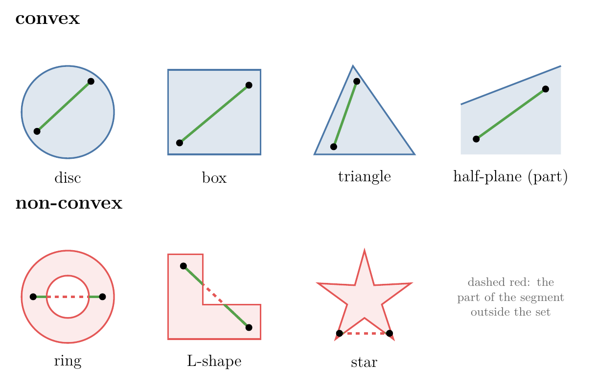
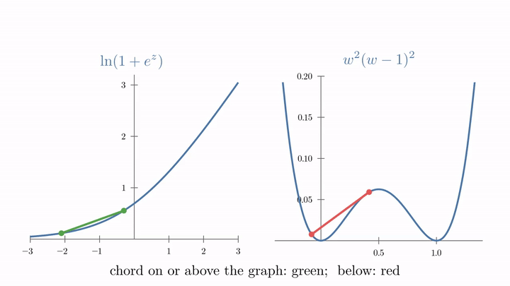

<!-- where-this-fits: generated by course_map/build_map.py; edit concepts.yaml, not this block -->
> **Where this fits:** Pipeline map step 0 (Foundations). See the [Course map](../01-course-map/note.md).
>
> 
>
> - **Builds on:** Convex and non-convex loss ([Note 590](../590-convex-and-non-convex-cost-functions/note.md)); Lagrange multipliers, KKT and duality ([Note 620](../620-lagrange-multipliers/note.md)).
> - **Leads to:** Linear and quadratic programming ([Note 622](../622-linear-and-quadratic-programming/note.md)); Local minima and saddle points ([Note 1032](../1032-optimizers-in-deep-learning/note.md)).
<!-- /where-this-fits -->

## 1. Overview

> **Key point:** A set is convex when the segment between any two of its points stays inside it; a convex optimisation problem minimises a convex function over a convex set, and for such problems every local minimum is global and the dual gives the same answer as the primal.

This Note follows Chapter 7 (Section 7.3, opening part) of *Mathematics for Machine Learning* (Deisenroth, Faisal and Ong, 2020).

{height=42%}

Two Notes prepare this one. The [convex and non-convex cost functions Note](../590-convex-and-non-convex-cost-functions/note.md) defined a convex function by the chord test and showed why gradient descent likes them. The [Lagrange multipliers Note](../620-lagrange-multipliers/note.md) added constraints, which cut the parameter space down to a feasible region.

This Note puts the two together. Figure 1 shows the new ingredient, convex sets. Then come two practical tests for convex functions (tangent lines and the Hessian), rules for building convex functions, and the convex optimisation problem.

## 2. Convex sets

> **Key point:** A set $C$ is convex if, for any two points in it, every point on the segment between them is also in $C$.

### 2.1 The definition

> **Key point:** The segment between $\mathbf{x}$ and $\mathbf{y}$ is all points $\theta\mathbf{x} + (1 - \theta)\mathbf{y}$ with $0 \le \theta \le 1$; all of them must lie in the set.

The points between $\mathbf{x}$ and $\mathbf{y}$ are written the same way as in the chord test of the [convex and non-convex cost functions Note](../590-convex-and-non-convex-cost-functions/note.md): a mix $\theta\mathbf{x} + (1 - \theta)\mathbf{y}$, with $\theta$ from 0 to 1.

1. **In words:** pick any two points of the set; the whole straight segment joining them must stay in the set.
2. **Formula:** $C$ is a **convex set** if for all $\mathbf{x}, \mathbf{y} \in C$ and all $\theta$ with $0 \le \theta \le 1$,
   $$\theta\mathbf{x} + (1 - \theta)\mathbf{y} \in C$$
3. **Example:** the disc of radius 1, all points with length at most 1. Take $\mathbf{x} = (1, 0)$ and $\mathbf{y} = (0, 1)$, both on its edge. The midpoint ($\theta = 0.5$) is $(0.5, 0.5)$, with length $\sqrt{0.25 + 0.25} = 0.71 \le 1$: inside.

   Now the ring of points with length between 1 and 2. Take $\mathbf{x} = (1.5, 0)$ and $\mathbf{y} = (-1.5, 0)$, both in the ring. Their midpoint is $(0, 0)$, with length $0 < 1$: outside. One such pair is enough, so the ring is not convex.

Informally, a convex set has no dents and no holes (Figure 1). Common convex sets in ML:

- **a line, a plane or a hyperplane** (see the [equation of a hyperplane Note](../363-equation-of-a-hyperplane/note.md)), the set where a linear equation holds;
- **a half-space**, one side of a hyperplane, such as $x + y \ge 3$ in the [Lagrange multipliers Note](../620-lagrange-multipliers/note.md);
- **a box**, such as $-1 \le x_i \le 1$ for every coordinate;
- **a ball** $\lVert \mathbf{w} \rVert \le t$, the Ridge constraint, and the diamond $|w_1| + |w_2| \le t$, the Lasso constraint.

### 2.2 Combining convex sets

> **Key point:** The overlap (intersection) of convex sets is convex; their union usually is not.

If $\mathbf{x}$ and $\mathbf{y}$ lie in both $A$ and $B$, the segment between them lies in $A$ (because $A$ is convex) and in $B$ (because $B$ is convex), so it lies in the overlap. The overlap rule is why a feasible region made of many convex constraints is convex: it is the overlap of one convex set per constraint. A box, for example, is the overlap of $2n$ half-spaces.

A union does not keep convexity. Two separate discs together form a set where the segment from one disc to the other crosses empty space.

> **Extra:** The set where a convex function stays at or below a level, $\lbrace\mathbf{x} : g(\mathbf{x}) \le c\rbrace$, is always convex (Boyd and Vandenberghe §3.1.6). The level-set rule is why convex optimisation asks for convex functions $g_i$ in its inequality constraints $g_i(\mathbf{x}) \le 0$ (Section 6): each constraint then cuts out a convex set. The set where a convex function is exactly 0 is not convex in general (the circle $x^2 + y^2 = 1$ is not), which is why equality constraints must be linear.

## 3. Convex functions and their sets

> **Key point:** A function is convex when every chord lies on or above its graph; equivalently, the region above its graph is a convex set.

The [convex and non-convex cost functions Note](../590-convex-and-non-convex-cost-functions/note.md) defined a **convex function**: $f(\theta\mathbf{a} + (1 - \theta)\mathbf{b}) \le \theta f(\mathbf{a}) + (1 - \theta) f(\mathbf{b})$ for all $\mathbf{a}$, $\mathbf{b}$ and $0 \le \theta \le 1$. One condition was left implicit there: the domain of $f$ must itself be a convex set, so that the mixed point $\theta\mathbf{a} + (1 - \theta)\mathbf{b}$ is somewhere $f$ is defined.



Figure 2 runs the definition. Watch for red: one chord below the graph is enough to break convexity, while a convex function never shows red, wherever the two ends are placed.

Two related ideas:

- **Concave function:** the negative of a convex function, an upside-down bowl. Every chord lies on or below the graph. The natural logarithm is concave; so is the dual function $D(\lambda) = 3\lambda - 3\lambda^2/8$ of the [Lagrange multipliers Note](../620-lagrange-multipliers/note.md). Maximising a concave function is the same task as minimising a convex one.
- **Epigraph:** the region on and above the graph of $f$, as if the bowl were filled with water. A function is convex exactly when its epigraph is a convex set (Boyd and Vandenberghe §3.1.7). This links the two halves of this Note: convex functions are convex sets seen from above.

> **Extra:** The defining inequality is the two-point case of **Jensen's inequality**. With more points and weights $\theta_i \ge 0$ that add up to 1, a convex $f$ satisfies $f\big(\sum_i \theta_i \mathbf x_i\big) \le \sum_i \theta_i f(\mathbf x_i)$: the function of an average is at most the average of the function. For $f(x) = x^2$ and the points 0, 1, 2 with equal weights: $f(1) = 1 \le (0 + 1 + 4)/3 = 1.67$. With probabilities as weights, this reads $f(E[X]) \le E[f(X)]$ (see the [expected value and variance Note](../332-expected-value-and-variance/note.md)); for $f(x) = x^2$ it says $E[X^2] - (E[X])^2 \ge 0$, that is, a variance is never negative.

## 4. Testing convexity with derivatives

> **Key point:** For a differentiable function, convexity means every tangent line (or plane) lies on or below the graph; for a twice-differentiable one, it means the Hessian has no negative eigenvalues anywhere.

Checking every chord is impossible in practice. When derivatives exist, two shortcuts replace it.

### 4.1 First-order condition: tangents lie below

> **Key point:** $f$ is convex exactly when $f(\mathbf{y}) \ge f(\mathbf{x}) + \nabla f(\mathbf{x})(\mathbf{y} - \mathbf{x})$ for all $\mathbf{x}$, $\mathbf{y}$: the tangent plane at any point underestimates $f$ everywhere.

The right-hand side is the tangent plane of $f$ at $\mathbf{x}$, the first-order Taylor approximation of the [Hessian and multivariate Taylor Note](../603-hessian-and-multivariate-taylor/note.md) (Section 4).

1. **In words:** the tangent line or plane at any point never rises above the graph.
2. **Formula:** a differentiable $f$ is convex if and only if, for all $\mathbf{x}$ and $\mathbf{y}$ (Boyd and Vandenberghe §3.1.3),
   $$f(\mathbf{y}) \thickspace\ge\thickspace f(\mathbf{x}) + \nabla f(\mathbf{x})\thinspace(\mathbf{y} - \mathbf{x})$$
3. **Example:** the **softplus** function $f(z) = \ln(1 + e^z)$. Its derivative is the [sigmoid](../72-sigmoid-function/note.md) $\sigma(z)$, so at $z = 0$ the slope is $\sigma(0) = 0.5$ and the value is $\ln 2 = 0.693$. At $z = 2$:
   $$f(2) = \ln(1 + e^2) = 2.13, \qquad \text{tangent: } 0.693 + 0.5 \times (2 - 0) = 1.69$$
   $2.13 \ge 1.69$: the curve is above its tangent (Figure 3, left).


Figure 3 (right) shows the test failing. For $q(w) = w^2(w - 1)^2$, the tangent at $w = 0.5$ is flat at height $0.0625$, but $q(0) = 0$ lies below it.

The first-order condition gives the most useful fact about convex functions in one line. If $\nabla f(\mathbf{x}^\ast) = \mathbf{0}$, the condition becomes $f(\mathbf{y}) \ge f(\mathbf{x}^\ast)$ for every $\mathbf{y}$. So for a convex function, any point with zero gradient is a global minimum. Gradient descent stops at zero gradient, so on a convex function it stops at the best answer.

> **Extra:** Softplus is the [log loss](../73-log-loss/note.md) in disguise. For an **observation** (one record, a row of the data table) with label 0 and score $z$, the loss $-\ln(1 - \sigma(z))$ equals $\ln(1 + e^{z})$; for label 1, $-\ln \sigma(z) = \ln(1 + e^{-z})$. Both are convex in $z$, and $z = \mathbf{w}^{\mathsf T}\mathbf{x}$ is linear in the weights. A convex function of a linear function is convex (Boyd and Vandenberghe §3.2.2), so the loss of logistic regression is convex in $\mathbf{w}$: gradient descent on it reaches the global minimum.

### 4.2 Second-order condition: curving up everywhere

> **Key point:** A twice-differentiable $f$ is convex exactly when its Hessian is positive semi-definite (no negative eigenvalues) at every point; in one variable, $f''(x) \ge 0$ everywhere.

The [Hessian and multivariate Taylor Note](../603-hessian-and-multivariate-taylor/note.md) (Section 3.3) showed that the signs of the Hessian's eigenvalues give the local shape: all positive is a bowl, mixed signs a saddle. A symmetric matrix with no negative eigenvalues is positive semi-definite (see the [SVD geometry Note](../610-svd-geometry/note.md)). Convexity asks for this at every point, not just one.

1. **In words:** the function must curve upwards (or stay flat) in every direction, everywhere.
2. **Formula:**
   $$f \text{ is convex} \iff \nabla^2 f(\mathbf{x}) \text{ is positive semi-definite for every } \mathbf{x}$$
   In one variable: $f''(x) \ge 0$ for every $x$.
3. **Example:** for softplus, $f''(z) = \sigma(z)\big(1 - \sigma(z)\big)$, the sigmoid's derivative (see the [sigmoid derivative Note](../74-sigmoid-derivative/note.md)). Both factors lie between 0 and 1, so $f''(z) > 0$ everywhere: convex. At $z = 0$, $f''(0) = 0.5 \times 0.5 = 0.25$.

With two variables, compare two quadratic functions. Their Hessians are constant, so one check covers every point:

| Function | Hessian | Eigenvalues | Convex? |
|---|---|---|---|
| $x^2 + xy + y^2$ | $\begin{bmatrix} 2 & 1 \cr1 & 2 \end{bmatrix}$ | $1$ and $3$ | yes: a bowl |
| $x^2 + 3xy + y^2$ | $\begin{bmatrix} 2 & 3 \cr3 & 2 \end{bmatrix}$ | $5$ and $-1$ | no: a saddle |

The chord test agrees. For $x^2 + 3xy + y^2$, the points $(1, -1)$ and $(-1, 1)$ both give $1 - 3 + 1 = -1$. Their midpoint $(0, 0)$ gives 0, above the chord value $-1$.

> **Python:** the eigenvalue check in NumPy. `eigvalsh` is meant for symmetric matrices such as Hessians and returns the eigenvalues in increasing order.
>
> ```python
> import numpy as np
>
> H1 = np.array([[2, 1], [1, 2]])
> H2 = np.array([[2, 3], [3, 2]])
> np.linalg.eigvalsh(H1)   # [1. 3.]  all >= 0: convex
> np.linalg.eigvalsh(H2)   # [-1. 5.] one < 0: not convex
> ```

## 5. Building convex functions

> **Key point:** Adding convex functions, or scaling them by non-negative numbers, keeps them convex; this is why "convex loss plus convex penalty" is convex.

In practice we rarely test a function from scratch. We build it from pieces known to be convex, using rules that keep convexity.

**Non-negative weighted sums.** If $f_1$ and $f_2$ are convex and $\alpha, \beta \ge 0$, then $\alpha f_1 + \beta f_2$ is convex. The proof is one step: write the chord inequality for $f_1$ and for $f_2$, multiply each by its non-negative weight (which keeps the direction of $\le$), and add them.

Worked with numbers: $f_1(w) = w^2$ and $f_2(w) = |w|$, with $\alpha = 1$, $\beta = 2$, between $a = -1$ and $b = 3$ at the midpoint 1:

$$\text{curve: } 1^2 + 2 \times |1| = 3, \qquad \text{chord: } 0.5 \times (1 + 2) + 0.5 \times (9 + 6) = 9$$

This rule covers the regularised losses of earlier Notes:

- **Ridge:** squared error plus $\alpha\lVert \mathbf{w} \rVert^2$ (see the [Ridge regression maths Note](../64-ridge-regression-maths/note.md)): convex plus convex.
- **Lasso:** squared error plus $\alpha \sum |w_i|$ (see the [Lasso regression Note](../67-lasso-regression/note.md)): convex plus convex, even though $|w|$ has a corner.
- **Regularised logistic regression:** log loss plus a penalty: convex plus convex.

**What does not keep convexity.** A difference or a product of convex functions can fail:

- **Difference:** $w^2$ and $2w^2$ are convex, but $w^2 - 2w^2 = -w^2$ is an upside-down bowl.
- **Product:** $w^2$ and $(w - 1)^2$ are convex, but their product $w^2(w - 1)^2$ has two dips (Figure 3, right). Its chord from 0 to 1 is at height 0, while the curve at 0.5 is $0.0625$.

> **Extra:** One more rule: the pointwise **maximum** of convex functions is convex (Boyd and Vandenberghe §3.2.3). The hinge loss $\max(0,\ 1 - z)$ of the [SVM soft margin Note](../94-svm-soft-margin/note.md) is the maximum of two straight lines, so it is convex, and with the convex penalty $\tfrac12\lVert \mathbf{w} \rVert^2$ the soft-margin SVM is a convex problem.

## 6. Convex optimisation problems

> **Key point:** Minimising a convex function subject to convex inequality constraints and linear equality constraints is a convex optimisation problem: every local minimum is global, and strong duality holds.

### 6.1 The definition

> **Key point:** The objective and every inequality function must be convex, and every equality constraint must be linear (affine).

1. **In words:** a convex objective, minimised over a feasible region built from convex pieces.
2. **Formula:** the problem
   $$\min_{\mathbf{x}} f(\mathbf{x}) \quad \text{subject to} \quad g_i(\mathbf{x}) \le 0, \qquad h_j(\mathbf{x}) = 0$$
   is a **convex optimisation problem** when $f$ and every $g_i$ are convex functions and every $h_j$ is affine, $h_j(\mathbf{x}) = \mathbf a_j^{\mathsf T}\mathbf{x} - b_j$. Then the feasible region is a convex set (Section 2.2).
3. **Example:** the problem of the [Lagrange multipliers Note](../620-lagrange-multipliers/note.md): minimise $x^2 + 2y^2$ (Hessian with eigenvalues 2 and 4, convex) subject to $3 - x - y \le 0$ (linear, so convex). The problem is therefore a convex optimisation problem.

### 6.2 What convexity guarantees

> **Key point:** No local-minimum traps, a zero-gradient (or KKT) point is the answer, and the dual reaches the same value as the primal.

For a convex optimisation problem:

- **Every local minimum is a global minimum.** The argument of the [convex and non-convex cost functions Note](../590-convex-and-non-convex-cost-functions/note.md) (Section 3.2) works inside a convex feasible region too, because the segment towards a lower point stays feasible.
- **The first-order conditions are enough.** Without constraints, a point with zero gradient is the answer (Section 4.1). With constraints, a point that satisfies the KKT conditions of the [Lagrange multipliers Note](../620-lagrange-multipliers/note.md) is the answer.
- **Strong duality.** The maximum of the dual function equals the primal minimum. In the example above, $D(4) = 6$ equals the primal minimum 6.

> **Extra:** Strong duality for a convex problem needs one mild extra condition, **Slater's condition**: at least one point satisfies every inequality constraint strictly. For $3 - x - y \le 0$, the point $(3, 3)$ gives $-3 < 0$, so it holds (Boyd and Vandenberghe §5.2.3).

### 6.3 Which ML problems are convex

> **Key point:** The classical linear models are convex problems; trees, clustering and neural networks are not.

| Problem | Convex? | Why |
|---|---|---|
| [Linear regression](../53-multiple-linear-regression/note.md), squared error | yes | Hessian $2X^{\mathsf T}X$ is positive semi-definite |
| [Ridge](../64-ridge-regression-maths/note.md), [Lasso](../67-lasso-regression/note.md), [Elastic Net](../69-elastic-net/note.md) | yes | convex loss plus convex penalty |
| [Logistic regression](../75-logistic-gradient-descent/note.md) | yes | log loss is softplus of a linear score |
| [SVM](../94-svm-soft-margin/note.md) (hard and soft margin) | yes | convex objective, linear constraints (a quadratic program) |
| [K-means](../128-kmeans-intuition/note.md) | no | the result depends on the starting centroids |
| Neural networks | no | many minima and saddle points (Goodfellow et al. §8.2) |

For the convex ones, the answer does not depend on the starting point or the solver, only on the data and the hyperparameters. The two best-known families of convex problems, linear and quadratic programs, are the topic of the [linear and quadratic programming Note](../622-linear-and-quadratic-programming/note.md).

## 7. Summary

| Idea | Test | Example |
|---|---|---|
| Convex set | every segment between two points stays inside | disc yes, ring no |
| Convex function | chord on or above the graph | $w^2$ yes, $w^2(w - 1)^2$ no |
| First-order test | tangent on or below the graph | softplus: $2.13 \ge 1.69$ |
| Second-order test | Hessian positive semi-definite everywhere | eigenvalues $1, 3$ yes; $5, -1$ no |
| Building rules | non-negative sums and maximums keep convexity | Ridge, Lasso, hinge loss |
| Convex problem | convex $f$ and $g_i$, affine $h_j$ | Lagrange Note example |

- Overlaps of convex sets are convex, so convex constraints give a convex feasible region.
- For a convex function, zero gradient means global minimum.
- Convex problems have no local-minimum traps and satisfy strong duality.

## 8. Sources

**Built from**

- Deisenroth, M. P., Faisal, A. A. and Ong, C. S. (2020). *Mathematics for Machine Learning*. Cambridge University Press. Section 7.3 (MML).

**Other references**

- Boyd, S. and Vandenberghe, L. (2004). *Convex Optimization*. Cambridge University Press. Sections 3.1–3.2 (convex functions and the operations that keep convexity) and 5.2.3 (Slater's condition).
- Goodfellow, I., Bengio, Y. and Courville, A. (2016). *Deep Learning*. MIT Press. Section 8.2, challenges in neural network optimisation.

## 9. Key terms

| Term | Meaning |
|---|---|
| Convex set | A set that contains the whole segment between any two of its points |
| Concave function | The negative of a convex function; every chord lies on or below its graph |
| Epigraph | The region on and above a function's graph; convex exactly when the function is convex |
| Jensen's inequality | For a convex function, the function of a weighted average is at most the weighted average of the function |
| Softplus | The function $\ln(1 + e^z)$, a smooth convex curve whose derivative is the sigmoid |
| First-order condition | A differentiable function is convex exactly when every tangent plane lies on or below its graph |
| Second-order condition | A twice-differentiable function is convex exactly when its Hessian is positive semi-definite everywhere |
| Convex optimisation problem | Minimising a convex function subject to convex inequality constraints and affine equality constraints |
| Slater's condition | Some point satisfies every inequality constraint strictly; together with convexity it guarantees strong duality |
