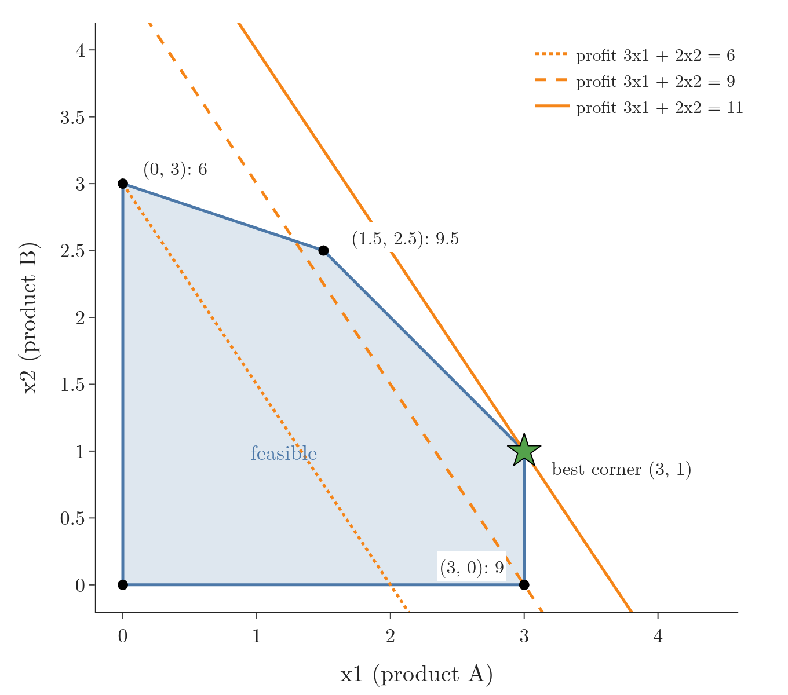

<!-- where-this-fits: generated by course_map/build_map.py; edit concepts.yaml, not this block -->
> **Where this fits:** Pipeline map step 0 (Foundations). See the [Course map](../01-course-map/note.md).
>
> 
>
> - **Builds on:** Convex sets and convex optimisation ([Note 621](../621-convex-sets-and-functions/note.md)).
<!-- /where-this-fits -->

## 1. Overview

> **Key point:** A linear program minimises a linear function over a region cut out by linear inequalities, and its answer sits at a corner; a quadratic program minimises a convex bowl over the same kind of region. Both are convex problems with a dual that is easy to write down.

This Note follows Chapter 7 (Sections 7.3.1 and 7.3.2) of *Mathematics for Machine Learning* (Deisenroth, Faisal and Ong, 2020).

{height=48%}

The [convex sets and functions Note](../621-convex-sets-and-functions/note.md) defined a convex optimisation problem. Two families of them are so common that they have their own names and their own solvers: **linear programs** and **quadratic programs**. Figure 1 shows a linear program.

For each family we write the problem, solve a small example from the picture, derive its dual with the Lagrangian of the [Lagrange multipliers Note](../620-lagrange-multipliers/note.md), and check everything in Python.

## 2. Linear programming

> **Key point:** Minimise $\mathbf{c}^{\mathsf T}\mathbf{x}$ subject to $A\mathbf{x} \le \mathbf{b}$: a linear objective, linear inequality constraints, and an answer at a corner of the feasible polygon.

### 2.1 The problem

> **Key point:** Everything is linear: the objective is a dot product with a fixed vector, and each constraint says a dot product is at most a number.

1. **In words:** choose $d$ numbers to make a weighted sum as small as possible, while $m$ other weighted sums stay below given limits.
2. **Formula:** a **linear program** is
   $$\min_{\mathbf{x} \in \mathbb{R}^d} \ \mathbf{c}^{\mathsf T}\mathbf{x} \quad \text{subject to} \quad A\mathbf{x} \le \mathbf{b}$$
   with $A$ of size $m \times d$ and $\mathbf{b}$ of length $m$; $A\mathbf{x} \le \mathbf{b}$ means every row holds.
3. **Example:** a small workshop makes two products. Product A earns a profit of 3 thousand rupees per batch and product B earns 2. Each batch of either product needs one hour of oven time, and only 4 hours are free. A batch of A needs 1 bag of flour and a batch of B needs 3, with 9 bags in stock. At most 3 batches of A can be sold. To maximise profit $3x_1 + 2x_2$, we minimise its negative:
   $$\min \ -3x_1 - 2x_2 \quad \text{subject to} \quad x_1 + x_2 \le 4, \quad x_1 + 3x_2 \le 9, \quad x_1 \le 3, \quad -x_1 \le 0, \quad -x_2 \le 0$$
   So $\mathbf{c} = [-3, -2]^{\mathsf T}$, $\mathbf{b} = [4, 9, 3, 0, 0]^{\mathsf T}$, and $A$ has the rows $[1, 1]$, $[1, 3]$, $[1, 0]$, $[-1, 0]$, $[0, -1]$.

Each constraint is a half-plane, and the feasible region is their overlap: a convex polygon (in more dimensions, a **polytope**). The objective is linear, so it is convex too, and a linear program is a convex optimisation problem.

### 2.2 The answer is at a corner

> **Key point:** The contour lines of a linear objective are parallel straight lines; sliding them in the improving direction, the last feasible point they touch is a corner of the polygon.

This is the level-curve picture of the [Lagrange multipliers Note](../620-lagrange-multipliers/note.md) with straight lines instead of ellipses. In Figure 1, the lines of equal profit $3x_1 + 2x_2 = p$ are parallel. Raising $p$ slides them up and to the right. The line $p = 11$ is the last one that still touches the region, at the single corner $(3, 1)$.

Because the answer is at a corner, checking the corners is enough for a small problem:

| Corner | Profit $3x_1 + 2x_2$ |
|---|---|
| $(0, 0)$ | 0 |
| $(3, 0)$ | 9 |
| $(3, 1)$ | **11** |
| $(1.5, 2.5)$ | 9.5 |
| $(0, 3)$ | 6 |

The best plan is 3 batches of A and 1 of B, for 11 thousand rupees. If the profit lines were parallel to an edge, every point of that edge would tie, but a corner would still be among the best points. Real solvers (the simplex method, interior-point methods) handle thousands of variables without listing corners.

### 2.3 The dual of a linear program

> **Key point:** The dual of $\min \mathbf{c}^{\mathsf T}\mathbf{x}$ subject to $A\mathbf{x} \le \mathbf{b}$ is $\max -\mathbf{b}^{\mathsf T}\boldsymbol{\lambda}$ subject to $\mathbf{c} + A^{\mathsf T}\boldsymbol{\lambda} = \mathbf{0}$ and $\boldsymbol{\lambda} \ge \mathbf{0}$: another linear program, with one variable per constraint.

We follow the recipe of the [Lagrange multipliers Note](../620-lagrange-multipliers/note.md) (Section 6): build the Lagrangian, minimise over $\mathbf{x}$, and maximise the result over $\boldsymbol{\lambda} \ge \mathbf{0}$.

1. **In words:** the Lagrangian is linear in $\mathbf{x}$. A linear function of $\mathbf{x}$ has a finite minimum only if its slope is zero, so the dual keeps only the multipliers that make the slope vanish.
2. **Formula:** the Lagrangian, with the $\mathbf{x}$ terms gathered, is
   $$\mathcal{L}(\mathbf{x}, \boldsymbol{\lambda}) = \mathbf{c}^{\mathsf T}\mathbf{x} + \boldsymbol{\lambda}^{\mathsf T}(A\mathbf{x} - \mathbf{b}) = (\mathbf{c} + A^{\mathsf T}\boldsymbol{\lambda})^{\mathsf T}\mathbf{x} - \boldsymbol{\lambda}^{\mathsf T}\mathbf{b}$$
   Its gradient in $\mathbf{x}$ is $\mathbf{c} + A^{\mathsf T}\boldsymbol{\lambda}$. If that is not zero, $\mathcal{L}$ falls without limit; if it is zero, $D(\boldsymbol{\lambda}) = -\mathbf{b}^{\mathsf T}\boldsymbol{\lambda}$. The dual problem is
   $$\max_{\boldsymbol{\lambda} \in \mathbb{R}^m} \ -\mathbf{b}^{\mathsf T}\boldsymbol{\lambda} \quad \text{subject to} \quad \mathbf{c} + A^{\mathsf T}\boldsymbol{\lambda} = \mathbf{0}, \quad \boldsymbol{\lambda} \ge \mathbf{0}$$
3. **Example:** for the workshop, $\boldsymbol{\lambda} = [2, 0, 1, 0, 0]^{\mathsf T}$ (one value per constraint, in the order oven, flour, demand, $x_1 \ge 0$, $x_2 \ge 0$). Check the equality:
   $$\mathbf{c} + A^{\mathsf T}\boldsymbol{\lambda} = \begin{bmatrix} -3 \\ -2 \end{bmatrix} + 2\begin{bmatrix} 1 \\ 1 \end{bmatrix} + 1\begin{bmatrix} 1 \\ 0 \end{bmatrix} = \begin{bmatrix} 0 \\ 0 \end{bmatrix}$$
   The dual value is $-\mathbf{b}^{\mathsf T}\boldsymbol{\lambda} = -(4 \times 2 + 3 \times 1) = -11$, the same as the primal minimum $\mathbf{c}^{\mathsf T}\mathbf{x} = -11$. Strong duality holds, as it does for every linear program that has a finite best value.

The primal has $d$ variables and $m$ constraints; the dual has $m$ variables and $d$ equality constraints. We can solve whichever is smaller. By convention the primal is minimised and the dual maximised.

### 2.4 Reading the multipliers

> **Key point:** Each multiplier is the extra profit one more unit of that resource would bring; a resource with spare capacity is worth 0.

The multipliers are the shadow prices of the [Lagrange multipliers Note](../620-lagrange-multipliers/note.md) (Section 4.2). Changing one limit by one unit and solving again confirms each one:

| Constraint | At the answer | Multiplier | Re-solved with one more unit |
|---|---|---|---|
| Oven: $x_1 + x_2 \le 4$ | $4 = 4$, active | 2 | profit 13 (up by 2) |
| Flour: $x_1 + 3x_2 \le 9$ | $6 < 9$, inactive | 0 | profit 11 (no change) |
| Demand: $x_1 \le 3$ | $3 = 3$, active | 1 | profit 12 (up by 1) |

Flour is not the bottleneck: 3 bags are left over, so more flour is worth nothing. An extra oven hour is worth 2 thousand rupees, so the workshop should pay up to that much for one. This is complementary slackness in action: the inactive constraint has multiplier 0.

> **Extra:** Linear programs appear in ML too. Fitting a line by minimising the sum of absolute errors $\sum_i |y_i - \mathbf{w}^{\mathsf T}\mathbf{x}_i|$ (least absolute deviations) becomes a linear program by giving each row an extra variable $t_i \ge |y_i - \mathbf{w}^{\mathsf T}\mathbf{x}_i|$, written as two linear inequalities, and minimising $\sum_i t_i$. scikit-learn's `QuantileRegressor` solves exactly this kind of linear program.

## 3. Quadratic programming

> **Key point:** Minimise $\tfrac12\mathbf{x}^{\mathsf T}Q\mathbf{x} + \mathbf{c}^{\mathsf T}\mathbf{x}$ subject to $A\mathbf{x} \le \mathbf{b}$, with $Q$ positive definite: a convex bowl over a polygon, whose answer can lie inside the region, on an edge, or at a corner.

### 3.1 The problem

> **Key point:** Same linear constraints as a linear program, but the objective is a bowl, so its level curves are ellipses.

1. **In words:** minimise a quadratic bowl over a region cut out by linear inequalities.
2. **Formula:** a **quadratic program** is
   $$\min_{\mathbf{x} \in \mathbb{R}^d} \ \tfrac12 \mathbf{x}^{\mathsf T} Q \mathbf{x} + \mathbf{c}^{\mathsf T}\mathbf{x} \quad \text{subject to} \quad A\mathbf{x} \le \mathbf{b}$$
   with $Q$ symmetric and **positive definite** (all eigenvalues positive), so the objective is a strictly convex bowl (see the [convex sets and functions Note](../621-convex-sets-and-functions/note.md), Section 4.2). The term $\tfrac12\mathbf{x}^{\mathsf T} Q \mathbf{x}$ is a quadratic form (see the [linear algebra roadmap Note](../350-linear-algebra-roadmap/note.md)).
3. **Example:** $Q = \begin{bmatrix} 2 & 1 \\ 1 & 2 \end{bmatrix}$ (eigenvalues 1 and 3) and $\mathbf{c} = [-8, -7]^{\mathsf T}$, so the objective is $x_1^2 + x_1 x_2 + x_2^2 - 8x_1 - 7x_2$. The constraints are $x_1 + x_2 \le 2$, $x_1 \ge 0$ and $x_2 \ge 0$: a triangle.

{height=46%}

Without constraints, the gradient $Q\mathbf{x} + \mathbf{c}$ is zero at $\mathbf{x} = -Q^{-1}\mathbf{c} = (3, 2)$. That point is outside the triangle, since $3 + 2 = 5 > 2$. So the answer lies on the boundary: on the edge $x_1 + x_2 = 2$, where a contour ellipse just touches it (Figure 2). It does not have to be a corner, as it would for a linear program.

### 3.2 Solving it with the KKT conditions

> **Key point:** Guess which constraints are active, solve the resulting equations, then check that every multiplier is non-negative.

Only the edge constraint $x_1 + x_2 \le 2$ is active, with multiplier $\lambda$. The stationarity condition $Q\mathbf{x} + \mathbf{c} + \lambda [1, 1]^{\mathsf T} = \mathbf{0}$ and the active constraint give three equations:

$$2x_1 + x_2 - 8 + \lambda = 0, \qquad x_1 + 2x_2 - 7 + \lambda = 0, \qquad x_1 + x_2 = 2$$

Subtracting the second from the first gives $x_1 - x_2 = 1$; with $x_1 + x_2 = 2$ this means $x_1 = 1.5$, $x_2 = 0.5$. Then $\lambda = 8 - 3 - 0.5 = 4.5$.

The checks of the KKT conditions: both coordinates are positive, so the two sign constraints are inactive with multiplier 0; $\lambda = 4.5 \ge 0$. The objective value is $2.25 + 0.75 + 0.25 - 12 - 3.5 = -12.25$.

### 3.3 The dual of a quadratic program

> **Key point:** Minimising the Lagrangian over $\mathbf{x}$ gives $\mathbf{x} = -Q^{-1}(\mathbf{c} + A^{\mathsf T}\boldsymbol{\lambda})$, and putting it back leaves a concave quadratic in $\boldsymbol{\lambda}$ with only the constraints $\boldsymbol{\lambda} \ge \mathbf{0}$.

1. **In words:** the Lagrangian is a bowl in $\mathbf{x}$; its lowest point has a formula, and substituting that formula leaves a function of the multipliers alone.
2. **Formula:** the Lagrangian is
   $$\mathcal{L}(\mathbf{x}, \boldsymbol{\lambda}) = \tfrac12 \mathbf{x}^{\mathsf T} Q \mathbf{x} + (\mathbf{c} + A^{\mathsf T}\boldsymbol{\lambda})^{\mathsf T}\mathbf{x} - \boldsymbol{\lambda}^{\mathsf T}\mathbf{b}$$
   Setting its gradient $Q\mathbf{x} + \mathbf{c} + A^{\mathsf T}\boldsymbol{\lambda}$ to zero gives $\mathbf{x} = -Q^{-1}(\mathbf{c} + A^{\mathsf T}\boldsymbol{\lambda})$; $Q$ is invertible because it is positive definite. Substituting:
   $$D(\boldsymbol{\lambda}) = -\tfrac12 (\mathbf{c} + A^{\mathsf T}\boldsymbol{\lambda})^{\mathsf T} Q^{-1} (\mathbf{c} + A^{\mathsf T}\boldsymbol{\lambda}) - \boldsymbol{\lambda}^{\mathsf T}\mathbf{b}, \qquad \text{dual: } \max_{\boldsymbol{\lambda} \ge \mathbf{0}} D(\boldsymbol{\lambda})$$
3. **Example:** at $\boldsymbol{\lambda} = [4.5, 0, 0]^{\mathsf T}$ (edge, $x_1 \ge 0$, $x_2 \ge 0$), $\mathbf{c} + A^{\mathsf T}\boldsymbol{\lambda} = [-8 + 4.5,\ -7 + 4.5]^{\mathsf T} = [-3.5, -2.5]^{\mathsf T}$. With $Q^{-1} = \tfrac13 \begin{bmatrix} 2 & -1 \\ -1 & 2 \end{bmatrix}$:
   $$\mathbf{x} = -\tfrac13 \begin{bmatrix} 2(-3.5) - (-2.5) \\ -(-3.5) + 2(-2.5) \end{bmatrix} = \begin{bmatrix} 1.5 \\ 0.5 \end{bmatrix}, \qquad D = -\tfrac12 \times 6.5 - 4.5 \times 2 = -12.25$$
   where $6.5 = \tfrac13(2 \times 12.25 - 2 \times 8.75 + 2 \times 6.25)$. The dual maximum equals the primal minimum $-12.25$.

The dual has only simple sign constraints $\boldsymbol{\lambda} \ge \mathbf{0}$, which many solvers handle more easily than general linear constraints.

### 3.4 Quadratic programs in ML

> **Key point:** Training a support vector machine is a quadratic program, in its primal form and in its dual form.

- **SVM, primal:** minimise $\tfrac12\lVert \mathbf{w} \rVert^2$ subject to $y_i(\mathbf{w}^{\mathsf T}\mathbf{x}_i + b) \ge 1$ (see the [SVM soft margin Note](../94-svm-soft-margin/note.md)). The objective is quadratic and each constraint is linear in $(\mathbf{w}, b)$. Here $Q$ is only positive semi-definite, because $b$ has no squared term, so the dual is derived as in the [Lagrange multipliers Note](../620-lagrange-multipliers/note.md) (Section 7.2) rather than with $Q^{-1}$.
- **SVM, dual:** maximise $\sum_i \alpha_i - \tfrac12 \sum_{i,j} \alpha_i \alpha_j y_i y_j \mathbf{x}_i^{\mathsf T}\mathbf{x}_j$ subject to $\alpha_i \ge 0$ and $\sum_i \alpha_i y_i = 0$: a quadratic program in the multipliers. The soft-margin version only adds the upper bound $\alpha_i \le C$. scikit-learn's `SVC` solves this dual.
- **Lasso, constraint form:** least squares subject to $\sum_i |w_i| \le t$ is a quadratic program once each weight is split into a positive and a negative part.

> **Python:** scipy's `linprog` solves linear programs and reports the multipliers in `ineqlin.marginals` (with scipy's sign, so negative here). `minimize` with `trust-constr` handles the quadratic program.
>
> ```python
> import numpy as np
> from scipy.optimize import linprog, minimize, LinearConstraint
>
> # Linear program: the workshop
> c = [-3, -2]
> A = [[1, 1], [1, 3], [1, 0]]
> b = [4, 9, 3]
> lp = linprog(c, A_ub=A, b_ub=b, bounds=[(0, None)] * 2)
> lp.x, lp.fun                 # [3. 1.], -11.0
> lp.ineqlin.marginals         # [-2. -0. -1.]: oven, flour, demand
>
> # Quadratic program: the triangle
> Q = np.array([[2, 1], [1, 2]])
> q = np.array([-8, -7])
> f = lambda x: 0.5 * x @ Q @ x + q @ x
> edge = LinearConstraint([[1, 1]], -np.inf, 2)
> qp = minimize(f, [0, 0], method="trust-constr",
>               constraints=[edge], bounds=[(0, None)] * 2)
> qp.x.round(3), round(qp.fun, 3)   # [1.5 0.5], -12.25
> ```

## 4. Summary

| | Linear program | Quadratic program |
|---|---|---|
| Objective | $\mathbf{c}^{\mathsf T}\mathbf{x}$ | $\tfrac12\mathbf{x}^{\mathsf T}Q\mathbf{x} + \mathbf{c}^{\mathsf T}\mathbf{x}$, $Q$ positive definite |
| Constraints | $A\mathbf{x} \le \mathbf{b}$ | $A\mathbf{x} \le \mathbf{b}$ |
| Contours | parallel straight lines | ellipses |
| Where the answer is | a corner of the polygon | inside, on an edge or at a corner |
| Dual | $\max -\mathbf{b}^{\mathsf T}\boldsymbol{\lambda}$, $\mathbf{c} + A^{\mathsf T}\boldsymbol{\lambda} = \mathbf{0}$, $\boldsymbol{\lambda} \ge \mathbf{0}$ | $\max D(\boldsymbol{\lambda})$ (concave quadratic), $\boldsymbol{\lambda} \ge \mathbf{0}$ |
| Example | workshop: $(3, 1)$, profit 11 | triangle: $(1.5, 0.5)$, value $-12.25$ |
| In ML | least absolute deviations, quantile regression | SVM (primal and dual), Lasso in constraint form |

- Both are convex problems, so the dual value equals the primal value.
- Multipliers are shadow prices: an inactive constraint has multiplier 0.

## 5. Key terms

| Term | Meaning |
|---|---|
| Linear program | Minimising a linear function subject to linear inequality constraints |
| Polytope | The region where a set of linear inequalities all hold: a polygon in two dimensions |
| Quadratic program | Minimising a convex quadratic function subject to linear inequality constraints |
| Positive definite matrix | A symmetric matrix whose eigenvalues are all positive; its quadratic form is a strictly convex bowl |
