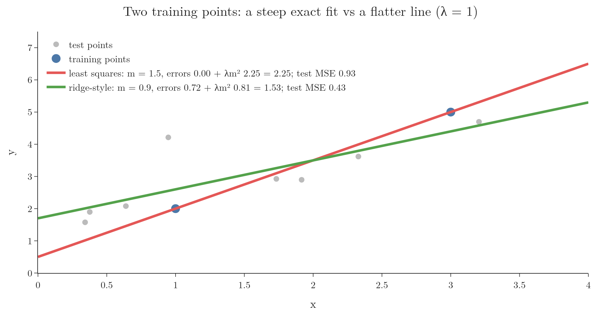
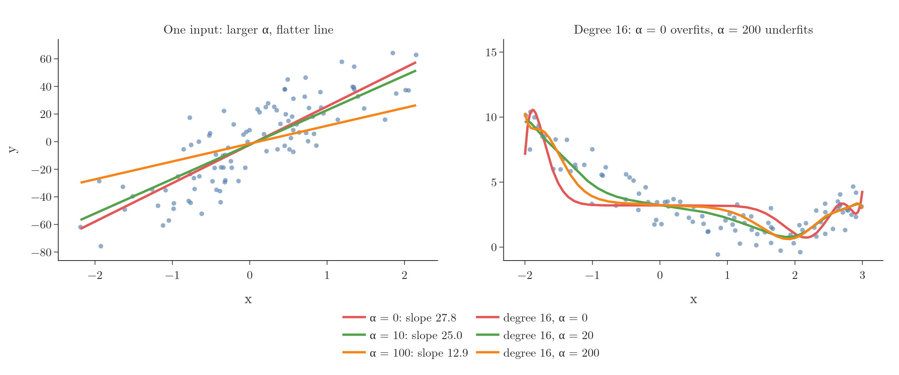
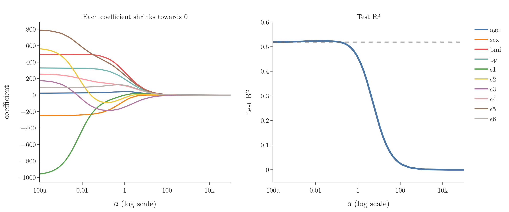

<!-- where-this-fits: generated by course_map/build_map.py; edit concepts.yaml, not this block -->
> **Where this fits:** Pipeline map step 8 (Model). See the [Course map](../01-course-map/note.md).
>
> 
>
> - **Builds on:** Standardization ([Note 24](../24-standardization/note.md)); Multiple linear regression ([Note 55](../55-multiple-lr-code/note.md)); Normal equation ([Note 55](../55-multiple-lr-code/note.md)); Gradient descent ([Note 57](../57-gradient-descent/note.md)); Overfitting ([Note 61](../61-polynomial-regression/note.md)); Bias-variance trade-off ([Note 62](../62-bias-variance/note.md)).
> - **Leads to:** Lasso regression ([Note 67](../67-lasso-regression/note.md)); Elastic Net ([Note 69](../69-elastic-net/note.md)); Support vector machines ([Note 92](../92-svm-intuition/note.md)).
> - **Compare with:** Lasso regression ([Note 67](../67-lasso-regression/note.md)).
<!-- /where-this-fits -->

## 1. Overview

> **Key point:** Regularisation adds a penalty to the loss so the model cannot overfit as easily. Ridge regression penalises the squares of the coefficients, which keeps them small.

**Regularisation** is a technique that adds extra information to a model to reduce overfitting. It sits next to bagging and boosting as one of the main tools against high variance, and it is especially important for linear models: linear regression, logistic regression and others.

There are three standard regularised versions of linear regression:

| Name | Penalty | Also called |
|---|---|---|
| Ridge regression | sum of squared coefficients | L2 regularisation |
| Lasso regression | sum of absolute coefficients | L1 regularisation |
| Elastic Net | a mix of both | |

This Note covers the idea of regularisation and of Ridge. The next three Notes derive Ridge mathematically, train it with gradient descent, and list its key properties; Lasso and Elastic Net follow.

## 2. The problem: overfitting in linear models

> **Key point:** An overfitting linear model has extreme coefficients: a very steep line that chases the training points.

Overfitting means a model performs very well on the training data but poorly on new data, and gives very different results when trained on different samples (the high variance of the previous Note).

For linear regression, overfitting shows up in the coefficients. Take the extreme case of only two training points. The least-squares line passes exactly through both, with zero training error. Its slope is whatever those two points dictate, which may be much steeper than the real pattern. On new points the line can be far off.

So the warning sign of an overfitting linear model is **large coefficients**: the line or plane tilts sharply to fit the training points exactly.

## 3. The idea: penalise large coefficients

> **Key point:** Ridge minimises the usual squared error plus λ times the squared slope. A steep line now costs something, so the model prefers a flatter one unless the data strongly supports the steep one.

Ridge regression changes the loss function. In words: the loss is the usual sum of squared errors, plus a penalty equal to $\lambda$ times the square of the slope.

$$L = \sum_{i=1}^{n} (y_i - \hat{y}_i)^2 + \lambda m^2$$

$\lambda$ (lambda) is a hyperparameter, at least 0, that sets how strong the penalty is. The intercept $b$ is not penalised: it only shifts the line up or down and does not make it steeper.

With numbers, Figure 1 has two training points, $(1, 2)$ and $(3, 5)$, and $\lambda = 1$.

{height=45%}

- **The least-squares line** passes through both points: slope 1.5, errors 0. With the penalty, its loss is $0 + 1 \times 1.5^2 = 2.25$.
- **A flatter line** with slope 0.9 misses both points slightly: errors $0.72$. Its loss is $0.72 + 1 \times 0.9^2 = 1.53$.

With the penalty, the flatter line has the lower loss, so Ridge prefers it. On new data drawn from the same source (grey), the flatter line is indeed better: test mean squared error 0.43 against 0.93.

Ridge gives up a little accuracy on the training data (some bias) in exchange for a model that changes less from sample to sample (less variance): the bias-variance trade-off in action.

## 4. The effect of λ

> **Key point:** λ = 0 is ordinary linear regression. As λ grows, the coefficients shrink towards 0. Too large a λ flattens the model into underfitting.

### 4.1 One input

> **Key point:** With one input, a larger penalty gives a flatter line.

Figure 2 (left) fits 100 points with one input. In scikit-learn the penalty strength is called `alpha` instead of $\lambda$.

{height=45%}

| alpha | Slope |
|---|---|
| 0 (linear regression) | 27.8 |
| 10 | 25.0 |
| 100 | 12.9 |

The slope shrinks as alpha grows, while the intercept changes little.

### 4.2 A flexible model

> **Key point:** On a degree-16 polynomial, α = 0 overfits, α = 20 follows the pattern, α = 200 is too stiff.

Regularisation matters most for flexible models. Figure 2 (right) fits a degree-16 polynomial to curved data:

- **alpha = 0:** the curve bends to chase individual points and swings at the edges: overfitting.
- **alpha = 20:** the penalty keeps the many coefficients small, and the curve follows the overall pattern.
- **alpha = 200:** the coefficients are squeezed so hard that the curve is too flat in places: underfitting.

The best alpha is somewhere in between and is found by trying values on held-out data, like any hyperparameter.

### 4.3 Many inputs: the diabetes data

> **Key point:** As alpha grows, every coefficient is pulled towards 0. A small alpha slightly improved test R²; a huge alpha destroyed the model.

Figure 3 trains Ridge on the 10-input diabetes data with alpha from 0.0001 to 100,000.

{height=45%}

- **Left:** every coefficient moves towards 0 as alpha grows. The large opposite pair s1 ($-971$) and s5 ($+794$), signs of multicollinearity, are the first to be tamed.
- **Right:** test R² is 0.519 for plain linear regression and peaks at 0.523 around alpha 0.02. Beyond about alpha 1 it falls, and with alpha 100,000 every coefficient is about 0.005 and $R^2 = 0.00$: the model just predicts the average.

> **Python:** Ridge in scikit-learn.
>
> ```python
> from sklearn.linear_model import Ridge
>
> ridge = Ridge(alpha=0.1)        # alpha is the λ of the formula
> ridge.fit(X_train, y_train)
> ridge.coef_                      # smaller than LinearRegression's
> ridge.score(X_test, y_test)
> ```

> **Extra:** The penalty depends on the size of each coefficient, and coefficients depend on the scale of their inputs. An input measured in grams gets a much smaller coefficient than the same input in kilograms, so it would be penalised less. That is why inputs are standardised before Ridge (the diabetes inputs already are). In a pipeline: `make_pipeline(StandardScaler(), Ridge(alpha=1))`.

## 5. Summary

| alpha (λ) | Effect |
|---|---|
| 0 | ordinary linear regression |
| small | slightly smaller coefficients, often better on new data |
| large | coefficients near 0, the model underfits |

- Overfitting linear models have extreme coefficients.
- Ridge adds $\lambda \sum \beta_j^2$ to the loss; the intercept is not penalised.
- It trades a little bias for less variance.
- alpha is tuned on held-out data; inputs should be standardised first.

## 6. Key terms

| Term | Meaning |
|---|---|
| Regularisation | Adding a penalty to a model's loss to reduce overfitting |
| Ridge regression | Linear regression with a penalty on the sum of squared coefficients |
| L2 regularisation | Another name for the squared-coefficient penalty used by Ridge |
| Lasso regression | Linear regression with a penalty on the sum of absolute coefficients (L1) |
| Elastic Net | Linear regression with a mix of the L1 and L2 penalties |
| λ (lambda), alpha | The strength of the regularisation penalty; alpha in scikit-learn |
| Shrinkage | The pulling of coefficients towards 0 by a penalty |
