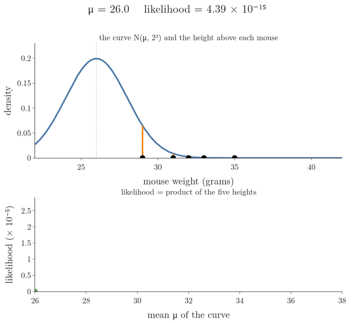
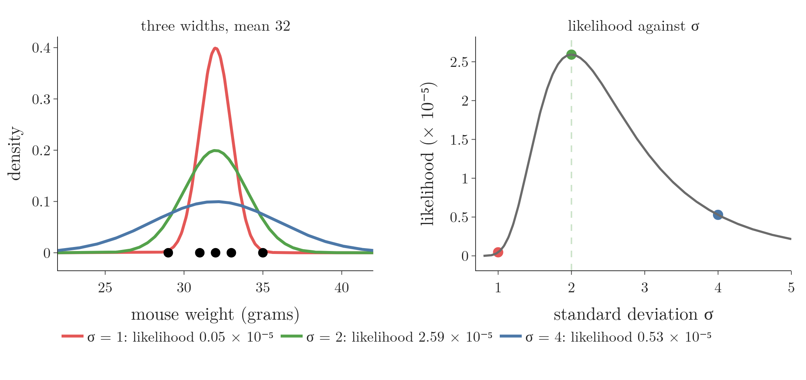
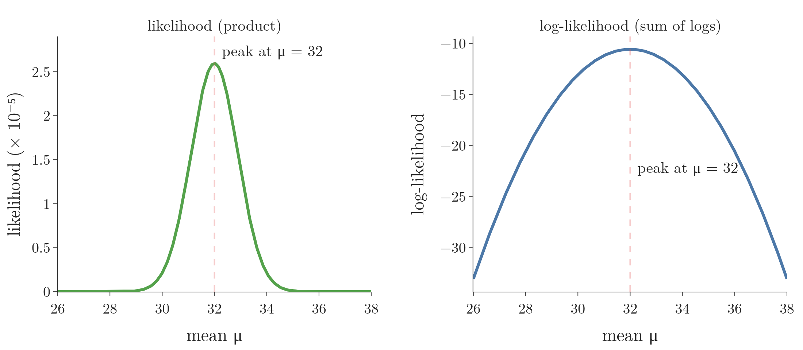
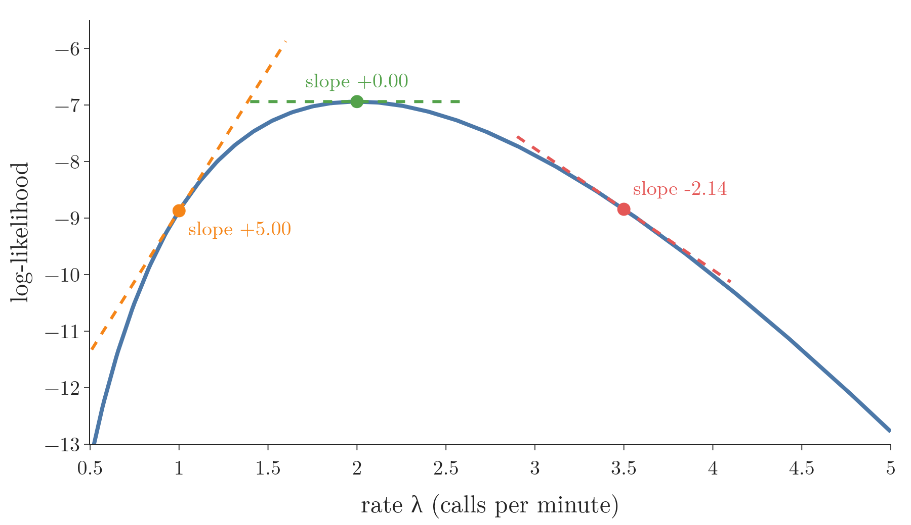

## 1. Overview

> **Key point:** Maximum likelihood estimation picks the parameter values under which the data we actually observed is most likely. We slide the parameters, compute the likelihood of the fixed data, and keep the peak.

This Note follows the StatQuest lesson "Maximum Likelihood, clearly explained" (Josh Starmer) and *Mathematics for Machine Learning* (Deisenroth, Faisal and Ong, 2020; MML below), Section 8.3.1, with the log-transformation remark of Section 9.2.1.



The [probability vs likelihood Note](../630-probability-vs-likelihood/note.md) showed that a likelihood fixes the data and lets the distribution move. Figure 1 does exactly that with five mice. The curve slides, the data stays put, and one position fits best.

This Note turns that picture into a method:

- why we fit a distribution to data at all (Section 2);
- the likelihood of a whole dataset as a product (Section 3);
- searching for the best mean and the best standard deviation (Section 4);
- the likelihood function and the maximum likelihood estimate (Section 5);
- why we take the log (Section 6) and flip the sign (Section 7);
- finding the peak with a derivative (Section 8);
- how good the estimate is (Section 9).

The [MLE for common distributions Note](../632-mle-for-common-distributions/note.md) applies the method to the binomial, exponential and normal distributions.

## 2. Fitting a distribution to data

> **Key point:** We choose the type of distribution by looking at the data; maximum likelihood then chooses its parameters.

We weigh five mice and get 29, 31, 32, 33 and 35 grams. Each weight is one **observation**: one record of the data (one row of the data table). A distribution that describes these weights is easier to work with than five loose numbers. The distribution also covers every future mouse of the same kind, not only these five.

There are many types of distribution: normal, exponential, Poisson and so on (see the [random variables and distributions Note](../240-random-variables-and-distributions/note.md)). Fitting happens in two steps:

1. **Choose the family.** Most weights sit near the middle and the spread is roughly symmetric, so a normal distribution is a sensible guess.
2. **Choose the parameters.** A normal curve can sit anywhere and be narrow or wide. Its mean $\mu$ sets the location and its standard deviation $\sigma$ the width (see the [normal distribution Note](../250-normal-distribution/note.md)).

The [density estimation Note](../243-density-estimation-kde/note.md) did step 2 by plugging in the sample's mean and standard deviation. Maximum likelihood is a general rule for step 2 that works the same way for any family; for the normal family it gives back the mean and the standard deviation (proved in the [MLE for common distributions Note](../632-mle-for-common-distributions/note.md)).

## 3. The likelihood of a whole dataset

> **Key point:** For independent data, the likelihood of the dataset is the product of the likelihoods of the single points.

### 3.1 One point: the height of the curve

> **Key point:** The likelihood of a distribution given one measurement is the height of its curve above that measurement.

Take the normal curve with $\mu = 28$ and $\sigma = 2$. The likelihood of this curve, given the 29-gram mouse, is the curve's height at 29. Using the normal PDF from the [normal distribution Note](../250-normal-distribution/note.md), that height is 0.176.

Each mouse gets its own height under the same curve. For $\mu = 28$, $\sigma = 2$ the five heights are 0.176, 0.065, 0.027, 0.009 and 0.0004. The mouse at 35 grams is far in the tail, so its height is almost 0.

### 3.2 Many points: multiply

> **Key point:** Weighing one mouse does not change another, so the heights multiply.

The mice are **independent and identically distributed** (i.i.d., see the [sampling distribution and CLT Note](../271-sampling-distribution-and-clt/note.md)): each weight comes from the same curve, and none affects another. For independent events, probabilities multiply (see the [independent events Note](../83-independent-events/note.md)). For i.i.d. data the joint density likewise factorises into a product of one density per point (MML §8.3.1, equation 8.16).

1. **In words:** the likelihood of the parameters, given all the data, is the product of the heights of the curve above each observation.
2. **Formula:**
   $$L(\mu, \sigma \mid x_1, \dots, x_n) = \prod_{i=1}^{n} f(x_i \mid \mu, \sigma)$$
   Here $f$ is the normal PDF and $\prod$ (capital pi) means "multiply all the terms", as $\sum$ means "add them".
3. **Example:** for $\mu = 28$, $\sigma = 2$:
   $$L = 0.176 \times 0.065 \times 0.027 \times 0.009 \times 0.0004 = 1.18 \times 10^{-9}$$

A single far-off observation drags the whole product down. The product is how the likelihood punishes a curve sitting in the wrong place.

> **Extra:** The [log loss Note](../73-log-loss/note.md) built the same product for a classifier: there, each point contributed the probability the model gave to its true class. Whatever the model, the likelihood of i.i.d. data is a product of one term per point.

## 4. Searching for the best parameters

> **Key point:** Move one parameter at a time, compute the likelihood at each value, and keep the value at the peak.

### 4.1 The best mean

> **Key point:** With $\sigma$ fixed at 2, the likelihood is largest when the curve's mean is 32, the average of the five weights.

Hold $\sigma = 2$ and slide the curve's mean from left to right (Figure 1). For each position we compute the product of the five heights:

| Mean $\mu$ | 28 | 30 | 32 | 34 |
|---|---|---|---|---|
| Likelihood | $1.2 \times 10^{-9}$ | $2.1 \times 10^{-6}$ | $2.6 \times 10^{-5}$ | $2.1 \times 10^{-6}$ |

Far to the left, most mice sit in the right-hand tail and the likelihood is tiny. As the curve moves under the data, the heights grow; past the middle they shrink again. Plotting the likelihood against $\mu$ gives the bump at the bottom of Figure 1, with its peak at $\mu = 32$.

The value at the peak is the **maximum likelihood estimate** (MLE) of the mean. The estimate is the mean of the distribution, not of the data. For the normal distribution the two agree: the average of 29, 31, 32, 33 and 35 is also 32.

### 4.2 The best standard deviation

> **Key point:** With $\mu$ fixed at 32, a curve that is too narrow misses the outer mice and one that is too wide is too low everywhere. The best width here is $\sigma = 2$.

Now fix $\mu = 32$ and vary $\sigma$ (Figure 2).



- **Too narrow** ($\sigma = 1$): the curve is tall at 32, but the mice at 29 and 35 fall almost outside it. Likelihood $0.05 \times 10^{-5}$.
- **Too wide** ($\sigma = 4$): every mouse is inside the curve, but a wide curve must be low, because the area under a PDF is always 1 (see the [PDF and continuous CDF Note](../242-pdf-and-continuous-cdf/note.md)). Likelihood $0.53 \times 10^{-5}$.
- **Just right** ($\sigma = 2$): likelihood $2.59 \times 10^{-5}$, the peak of the right-hand curve.

So the normal curve fitted by maximum likelihood is $N(32, 2^2)$. The width 2 is the standard deviation of the five weights computed with $n$ in the denominator; the [MLE for common distributions Note](../632-mle-for-common-distributions/note.md) proves this and compares it with the $n - 1$ version.

## 5. The likelihood function and the MLE

> **Key point:** The likelihood function treats the data as fixed and the parameters as the variable. The MLE is the parameter value where this function is highest.

### 5.1 One symbol for all parameters

> **Key point:** We collect all parameters of a model in one symbol, $\theta$.

A normal distribution has two parameters, a Poisson distribution one, a regression model many. To talk about all of them at once, we write $\theta$ (theta) for "all the parameters". For the normal curve, $\theta = (\mu, \sigma)$.

The density of one observation under parameters $\theta$ is written $p(x \mid \theta)$. With fixed $\theta$ it describes how data spreads; with fixed $x$ and moving $\theta$ it is a likelihood (the [probability vs likelihood Note](../630-probability-vs-likelihood/note.md)).

### 5.2 The maximum likelihood estimate

> **Key point:** $\hat\theta = \arg\max_\theta L(\theta)$: the parameter value that makes the likelihood largest.

1. **In words:** the likelihood function multiplies the density of every observation, for a given $\theta$. The maximum likelihood estimate is the $\theta$ that makes this product largest.
2. **Formula:**
   $$L(\theta) = \prod_{i=1}^{n} p(x_i \mid \theta), \qquad \hat\theta_{\text{ML}} = \arg\max_{\theta}\, L(\theta)$$
   The hat on $\hat\theta$ marks an estimate computed from data. $\arg\max$ returns the value of the variable that makes an expression largest, not the largest value itself (as in the [Naive Bayes maths Note](../88-naive-bayes-maths/note.md)).
3. **Example:** for the mice with $\sigma = 2$, $\max_\mu L(\mu) = 2.59 \times 10^{-5}$, but $\arg\max_\mu L(\mu) = 32$. The MLE is 32.

The approach is called **maximum likelihood estimation**. MML (§8.3.4) credits it to Ronald Fisher.

## 6. Why we take the log

> **Key point:** The log keeps the peak in the same place, turns the product into a sum, and makes the derivative easy.

### 6.1 The log does not move the peak

> **Key point:** The log always grows when its input grows, so the largest likelihood also has the largest log.

The [log loss Note](../73-log-loss/note.md) (Section 4) introduced the **log-likelihood**, the log of the likelihood, to avoid products too small for a computer. For maximum likelihood estimation it has a second, more important property.

The log is an **increasing function**: if $a > b$, then $\log a > \log b$. So whichever $\theta$ gives the largest likelihood also gives the largest log-likelihood. Figure 3 shows the two curves for the mice: they have different shapes, but both peak at $\mu = 32$.



Throughout, $\log$ means the natural log, $\ln$, the log to base $e$. Any other base $b$ only multiplies it by a constant, $\log_b a = \ln a / \ln b$, so the peak stays where it is; with base $e$ the derivative of $\ln\theta$ is simply $1/\theta$.

### 6.2 What the log does to the formula

> **Key point:** Products become sums, powers become multipliers, and $\log e^{a} = a$.

Three rules of logs do all the work:

- $\log(ab) = \log a + \log b$: the product over observations becomes a sum;
- $\log a^{k} = k \log a$: an exponent comes down as a multiplier;
- $\log e^{a} = a$: the exponential inside the normal and Poisson formulas disappears.

1. **In words:** the log-likelihood is the sum, over the observations, of the log of each point's density.
2. **Formula:**
   $$\ell(\theta) = \log L(\theta) = \sum_{i=1}^{n} \log p(x_i \mid \theta)$$
3. **Example:** for the 29-gram mouse under $N(32, 2^2)$, the normal PDF and its log are
   $$f(29) = \frac{1}{2\sqrt{2\pi}}\, e^{-(29 - 32)^2/8}, \qquad \log f(29) = \log\frac{1}{2\sqrt{2\pi}} - \frac{(29 - 32)^2}{8} = -1.612 - 1.125 = -2.737$$
   Summing the five such logs gives $\ell = -10.56$, and indeed $\log(2.59 \times 10^{-5}) = -10.56$.

### 6.3 Why this helps the derivative

> **Key point:** The derivative of a sum is the sum of the derivatives; the derivative of a product of $n$ factors is a mess.

To find the peak we will set a derivative to zero (Section 8). MML (§9.2.1, remark on the log-transformation) gives this reason: the derivative of a product of $n$ factors needs the product rule over and over, while the derivative of a sum is just the sum of the derivatives of its terms, one per observation.

In Figure 3 the log-likelihood for the mean is even an exact upside-down parabola, $-\sum(x_i - \mu)^2/8$ plus a constant: in the log of each density (Section 6.2), only the squared-distance term contains $\mu$.

## 7. The negative log-likelihood

> **Key point:** Optimisation tools minimise. Putting a minus sign in front of the log-likelihood turns "find the highest point" into "find the lowest point".

1. **In words:** the negative log-likelihood is minus the log-likelihood. Its lowest point is at the same $\theta$ as the likelihood's highest point.
2. **Formula:**
   $$\text{NLL}(\theta) = -\ell(\theta) = -\sum_{i=1}^{n} \log p(x_i \mid \theta), \qquad \hat\theta_{\text{ML}} = \arg\min_{\theta}\, \text{NLL}(\theta)$$
3. **Example:** for the mice with $\sigma = 2$: $\text{NLL}(30) = 13.06$, $\text{NLL}(32) = 10.56$, $\text{NLL}(34) = 13.06$. The smallest value is at $\mu = 32$.

The minus sign is a convention, not new maths. MML (§8.3.1, remark) calls it a historical artifact: statistics talks about maximising likelihood, while the optimisation literature, including [gradient descent](../57-gradient-descent/note.md), is written for minimising.

The negative log-likelihood is a loss function: one number per parameter setting, lower is better. The [log loss Note](../73-log-loss/note.md) called it the cross entropy for a classifier. The [MLE in machine learning Note](../633-mle-in-machine-learning/note.md) shows that the usual ML losses are negative log-likelihoods of different models.

## 8. Finding the peak with a derivative

> **Key point:** At the top of a smooth hill the slope is zero. So we differentiate the log-likelihood, set the derivative to zero, and solve for the parameter.

### 8.1 The recipe

> **Key point:** Write the likelihood, take the log, differentiate, set to zero, solve, check it is a maximum.

Trying many values on a grid works, but it is slow and only as precise as the grid. At the peak of a smooth curve the tangent line is flat, so the derivative (see the [derivatives Note](../600-derivatives-of-one-variable/note.md)) is zero there. Figure 4 shows this on a log-likelihood: positive slope before the peak, zero at it, negative after.



The recipe:

1. Write the likelihood $L(\theta) = \prod_i p(x_i \mid \theta)$.
2. Take the log: $\ell(\theta) = \sum_i \log p(x_i \mid \theta)$, and simplify with the log rules.
3. Differentiate with respect to the parameter.
4. Set the derivative to 0 and solve for the parameter. The solution is $\hat\theta$.
5. Check it is a maximum and not a minimum: the second derivative (the derivative of the derivative) should be negative there, meaning the slope goes from positive to negative.

With several parameters, step 3 takes one partial derivative per parameter (see the [partial derivatives and gradients Note](../601-partial-derivatives-and-gradients/note.md)), and step 4 sets all of them to 0 at once.

### 8.2 Worked example: the rate of calls

> **Key point:** For a Poisson rate, the recipe gives $\hat\lambda = \bar{x}$: the MLE of the rate is the average count.

A help desk counts calls in five one-minute intervals: 2, 1, 3, 2, 2. Counts of events in a fixed interval follow a Poisson distribution with rate $\lambda$ (see the [Poisson distribution Note](../560-poisson-distribution/note.md)), with PMF $P(X = x) = \lambda^{x} e^{-\lambda} / x!$.

1. **Likelihood:**
   $$L(\lambda) = \prod_{i=1}^{5} \frac{\lambda^{x_i} e^{-\lambda}}{x_i!}$$
2. **Log:** each term becomes $x_i \log\lambda - \lambda - \log x_i!$. Adding the five terms:
   $$\ell(\lambda) = \Big(\sum_i x_i\Big)\log\lambda - n\lambda - \sum_i \log x_i!$$
3. **Derivative:** the last sum does not contain $\lambda$, so its derivative is 0. The derivative of $\log\lambda$ is $1/\lambda$:
   $$\frac{d\ell}{d\lambda} = \frac{\sum_i x_i}{\lambda} - n$$
4. **Set to zero and solve:**
   $$\frac{\sum_i x_i}{\lambda} = n \quad\Longrightarrow\quad \hat\lambda = \frac{1}{n}\sum_{i=1}^{n} x_i = \bar{x}$$
   With numbers: $\sum x_i = 10$, $n = 5$, so $\hat\lambda = 10/5 = 2$ calls per minute.
5. **Check:** the second derivative is $-\sum_i x_i / \lambda^2 = -10/4 = -2.5$ at $\lambda = 2$. The second derivative is negative, so $\lambda = 2$ is a peak.

The slopes in Figure 4 come from step 3: at $\lambda = 1$ the slope is $10/1 - 5 = 5$, at $\lambda = 3.5$ it is $10/3.5 - 5 = -2.14$.

The answer matches intuition: the best guess of the average rate is the average count. The value of the derivation is that it proves it, and that the same steps work where intuition has no answer.

> **Extra:** Step 5 showed that the second derivative, $-\sum_i x_i/\lambda^2$, is negative for every $\lambda > 0$. So the slope only ever falls: it is positive before $\hat\lambda$ and negative after it, and $\hat\lambda = 2$ is the highest point of the whole curve, not just a local peak. Such an upside-down-bowl function is called concave (see the [convex sets and functions Note](../621-convex-sets-and-functions/note.md)). Not every log-likelihood is concave: for Gaussian mixtures, MML (§11.4.5) warns that the search can end at a local maximum; the [Gaussian mixture models Note](../640-gaussian-mixture-models/note.md) meets this.

### 8.3 When there is no formula

> **Key point:** If "derivative = 0" cannot be solved by algebra, we climb the log-likelihood (or descend the NLL) step by step.

For the Poisson rate and for the normal distribution, step 4 can be solved by hand and gives a **closed-form** answer: a formula in the data. For many models it cannot (MML §8.3.1). Logistic regression is one: its parameters sit inside the sigmoid, and the [log loss Note](../73-log-loss/note.md) (Section 7) had to use gradient descent on the NLL instead.

So in practice MLE means one of two things:

- **closed form:** solve derivative = 0 by algebra (this Note, the [MLE for common distributions Note](../632-mle-for-common-distributions/note.md), linear regression);
- **numerical:** minimise the NLL with gradient descent or another optimiser (logistic regression, neural networks), or with a special iterative scheme such as the [expectation maximization Note](../641-expectation-maximization/note.md)'s.

> **Python:** Minimising the NLL numerically gives the same answer as the formula.
>
> ```python
> import numpy as np
> from scipy import stats, optimize
>
> calls = np.array([2, 1, 3, 2, 2])
> # NLL of a Poisson rate lam
> nll = lambda lam: -stats.poisson(lam).logpmf(calls).sum()
> res = optimize.minimize_scalar(nll, bounds=(0.01, 10),
>                                method="bounded")
> res.x            # 2.0000
> calls.mean()     # 2.0
> ```
>
> `logpmf` (and `logpdf` for continuous distributions) returns the log directly, which avoids underflow. The Notebook runs the same search for the mice's $\mu$ and $\sigma$.

## 9. How good is the MLE?

> **Key point:** With a lot of data the MLE homes in on the true value; with little data it can be far off and can overfit.

> **Extra:** Two standard properties (stated, not proved, in MML §8.3.2):
>
> - **Consistency.** As the number of observations $n$ grows, the MLE gets closer and closer to the true parameter value.
> - **Shrinking error.** The variance of the estimate falls like $1/n$: four times as much data halves its typical error. For a normal mean this is the standard error $\sigma/\sqrt n$ of the [sampling distribution and CLT Note](../271-sampling-distribution-and-clt/note.md).
>
> The Notebook checks both by simulation for the Poisson rate: the spread of the MLE halves each time $n$ is multiplied by 4 (0.63, 0.32, 0.16, 0.08 for $n$ = 5, 20, 80, 320). The same remark in the book adds that in the small-data regime maximum likelihood can overfit; the [MLE in machine learning Note](../633-mle-in-machine-learning/note.md) shows this happening and adds a prior against it.

## 10. Summary

| Step | Mice (normal, $\sigma = 2$) | Calls (Poisson) |
|---|---|---|
| Data | 29, 31, 32, 33, 35 | 2, 1, 3, 2, 2 |
| Likelihood $L(\theta) = \prod_i p(x_i \mid \theta)$ | $2.59 \times 10^{-5}$ at $\mu = 32$ | $9.7 \times 10^{-4}$ at $\lambda = 2$ |
| Log-likelihood $\ell = \sum_i \log p(x_i \mid \theta)$ | $-10.56$ | $-6.94$ |
| Negative log-likelihood | 10.56 | 6.94 |
| Derivative = 0 gives | $\hat\mu = \bar{x} = 32$ | $\hat\lambda = \bar{x} = 2$ |

- Choose a family of distributions by looking at the data; maximum likelihood chooses its parameters.
- For i.i.d. data, the likelihood is the product of the densities of the single points.
- The MLE is $\arg\max_\theta L(\theta)$: the parameters under which the observed data is most likely.
- The log keeps the peak, turns products into sums, and simplifies derivatives.
- Minimising the negative log-likelihood is the same as maximising the likelihood; the NLL is a loss function.
- Recipe: log, differentiate, set to 0, solve, check the second derivative. Without a closed form, optimise numerically.
- The MLE becomes accurate with much data; with little data it can overfit.

## 11. Sources

- Starmer, J. "Maximum Likelihood, clearly explained", StatQuest (statquest.org). Sections 2 and 4.
- Deisenroth, M. P., Faisal, A. A. and Ong, C. S. (2020). *Mathematics for Machine Learning*. Cambridge University Press. Free PDF at mml-book.github.io. §8.3.1 (likelihood, i.i.d. product, negative log-likelihood, sign convention), §8.3.2 (remark on consistency and 1/N variance), §8.3.4 (Fisher), §9.2.1 (log-transformation remark), §11.4.5 (local maxima).

## 12. Key terms

| Term | Meaning |
|---|---|
| Fitting a distribution | Choosing a family of distributions for data, then choosing its parameters |
| Likelihood function $L(\theta)$ | The product of the densities (or probabilities) of all observations, as a function of the parameters with the data fixed |
| $\theta$ (theta) | One symbol for all the parameters of a model |
| Maximum likelihood estimation (MLE) | Fitting parameters by making the likelihood of the observed data as large as possible |
| Maximum likelihood estimate $\hat\theta_{\text{ML}}$ | The parameter value where the likelihood function is highest |
| Increasing function | A function whose output grows whenever its input grows, such as the log; it keeps the position of a maximum |
| Negative log-likelihood (NLL) | Minus the log-likelihood; minimised instead of maximising the likelihood |
| Closed-form solution | An answer given by a formula in the data, without iterative search |
| Consistency (of an estimator) | Getting closer to the true parameter value as the amount of data grows |
