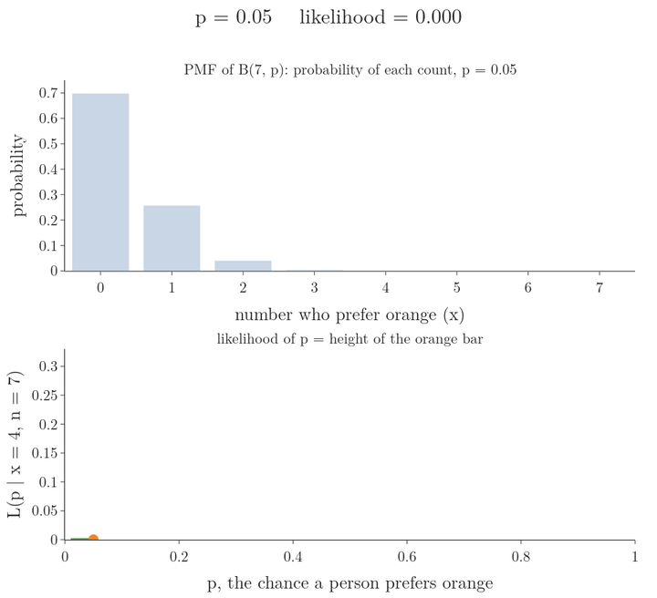

## 1. Overview

> **Key point:** Following the maximum likelihood recipe by hand gives three famous answers: the binomial's $\hat p$ is the share of successes, the exponential's $\hat\lambda$ is one over the average waiting time, and the normal's $\hat\mu$ and $\hat\sigma$ are the mean and standard deviation of the data.

This Note follows three explanations by Starmer (StatQuest, statquest.org): "Maximum Likelihood for the Binomial Distribution", "Maximum Likelihood for the Exponential Distribution" and "Maximum Likelihood For the Normal Distribution".



The [maximum likelihood estimation Note](../631-maximum-likelihood-estimation/note.md) built the recipe: write the likelihood, take the log, differentiate, set the derivative to 0, solve. This Note runs it on three distributions, each in three steps (words, formula, small numbers):

- binomial: a share of yes answers (Section 2, Figure 1);
- exponential: waiting times (Section 3);
- normal: measurements such as weights (Section 4);
- why the normal's MLE variance divides by $n$, and how it differs from the sample variance with $n - 1$ (Section 5).

The Notebook checks every result by a grid search and against SciPy's built-in fitting.

## 2. The binomial distribution

> **Key point:** If $x$ of $n$ trials are successes, the maximum likelihood estimate of the success probability is $\hat p = x/n$.

### 2.1 From probability to likelihood

> **Key point:** The same binomial formula gives a probability when $p$ is fixed and $x$ varies, and a likelihood when $x$ is fixed and $p$ varies.

We ask 7 people whether they prefer orange or grape Fanta, and 4 say orange. Each answer is a Bernoulli trial, and the count of orange answers follows a binomial distribution $B(n, p)$ (see the [Bernoulli and binomial Note](../270-bernoulli-and-binomial/note.md)):

$$P(x \mid n, p) = \binom{n}{x} p^{x} (1 - p)^{n - x}$$

With $p = 0.5$ fixed, this is the probability that 4 of 7 people prefer orange: $35 \times 0.5^4 \times 0.5^3 = 0.273$. Now fix the data, $n = 7$ and $x = 4$, and let $p$ vary. The right-hand side stays the same formula; only the reading changes (the [probability vs likelihood Note](../630-probability-vs-likelihood/note.md)). We write it as $L(p \mid n = 7, x = 4)$.

| $p$ | 0.25 | 0.5 | 0.57 | 0.75 |
|---|---|---|---|---|
| $L(p \mid n = 7, x = 4)$ | 0.058 | 0.273 | 0.294 | 0.173 |

Figure 1 sweeps $p$ from left to right. For each $p$ the top panel shows the whole PMF; the bar at $x = 4$ is the likelihood. Traced against $p$, the bar heights form the curve at the bottom, which peaks a little above 0.57.

### 2.2 The derivation with numbers

> **Key point:** Log, differentiate, set to 0: $4/p - 3/(1 - p) = 0$ gives $p = 4/7$.

1. **In words:** take the log of the likelihood, differentiate with respect to $p$, set the result to 0 and solve for $p$.
2. **Formula:** the log turns the product into a sum and brings the exponents down:
   $$\ell(p) = \log\binom{7}{4} + 4\log p + 3\log(1 - p)$$
   The first term has no $p$ in it, so its derivative is 0. The derivative of $\log p$ is $1/p$. For $\log(1 - p)$ the chain rule (see the [derivatives Note](../600-derivatives-of-one-variable/note.md)) gives $1/(1 - p) \times (-1)$:
   $$\frac{d\ell}{dp} = \frac{4}{p} - \frac{3}{1 - p}$$
3. **Example:** set it to 0 and multiply both sides by $p(1 - p)$:
   $$4(1 - p) - 3p = 0 \quad\Longrightarrow\quad 4 - 7p = 0 \quad\Longrightarrow\quad \hat p = \frac{4}{7} = 0.571$$

The likelihood there is 0.294, higher than at every $p$ in the table.

### 2.3 The general formula

> **Key point:** The same steps with letters give $\hat p = x/n$: successes divided by trials.

1. **In words:** for $x$ successes in $n$ trials, the MLE of $p$ is the observed share of successes.
2. **Formula:** the log-likelihood and its derivative are
   $$\ell(p) = \log\binom{n}{x} + x\log p + (n - x)\log(1 - p), \qquad \frac{d\ell}{dp} = \frac{x}{p} - \frac{n - x}{1 - p}$$
   Setting the derivative to 0 and multiplying by $p(1 - p)$: $x(1 - p) - (n - x)p = 0$. The terms $-xp$ and $+xp$ cancel, leaving $x - np = 0$:
   $$\hat p = \frac{x}{n}$$
3. **Example:** 4 orange answers out of 7 give $4/7 = 0.571$; 40 out of 70 give the same $0.571$.

The second derivative, $-x/p^2 - (n - x)/(1 - p)^2$, is negative for every $p$ between 0 and 1, so this is a maximum.

The answer looks obvious once known: the best guess of a probability is the observed proportion. The derivation turns the intuition into a proof.

> **Extra:** With 40 of 70 the peak sits at the same 0.571, but the likelihood curve is much narrower: more data pins $p$ down more tightly. The Notebook draws both curves.

## 3. The exponential distribution

> **Key point:** For waiting times $x_1, \dots, x_n$, the MLE of the rate is $\hat\lambda = n / \sum x_i = 1/\bar{x}$: one over the average wait.

### 3.1 The distribution of waiting times

> **Key point:** $f(x) = \lambda e^{-\lambda x}$ for $x \ge 0$. The rate $\lambda$ is how many events happen per unit time on average; the average wait is $1/\lambda$.

The **exponential distribution** models the time between random events: the wait for the next text message, the time until the next person opens a web page. The distribution is right-skewed: short waits are common, long waits rare. The [sampling distribution and CLT Note](../271-sampling-distribution-and-clt/note.md) used it as a skewed population.

1. **In words:** the density starts at height $\lambda$ at $x = 0$ and falls off exponentially. The **rate parameter** $\lambda$ is the average number of events per unit of time.
2. **Formula:**
   $$f(x \mid \lambda) = \lambda e^{-\lambda x}, \qquad x \ge 0$$
3. **Example:** with $\lambda = 2$ events per second, on average one event every $1/2$ second; the density at $x = 1$ second is $2e^{-2} = 0.27$. With $\lambda = 0.5$, one event every 2 seconds, and the density at 1 second is $0.5e^{-0.5} = 0.30$.

Figure 2 (left) shows the three curves for $\lambda = 0.5$, 1 and 2. A large rate means a tall start and a fast drop: short waits.


### 3.2 The likelihood of all the waits

> **Key point:** Multiplying the $n$ densities collects the $\lambda$'s into $\lambda^n$ and the exponents into $-\lambda\sum x_i$.

1. **In words:** each waiting time contributes the height of the curve above it. For independent waits the heights multiply, as in the [maximum likelihood estimation Note](../631-maximum-likelihood-estimation/note.md).
2. **Formula:** pull the $n$ factors $\lambda$ out of the product and add the exponents ($e^{a}e^{b} = e^{a + b}$):
   $$L(\lambda) = \prod_{i=1}^{n} \lambda e^{-\lambda x_i} = \lambda^{n} e^{-\lambda(x_1 + \dots + x_n)}$$
3. **Example:** three waits between views of a web page: $x_1 = 2$, $x_2 = 2.5$, $x_3 = 1.5$ seconds, with sum 6. For $\lambda = 1$, $L = 1^3 e^{-6} = 0.0025$; for $\lambda = 0.5$, $L = 0.5^3 e^{-3} = 0.0062$.

### 3.3 The derivation

> **Key point:** $\ell(\lambda) = n\log\lambda - \lambda\sum x_i$; its derivative $n/\lambda - \sum x_i$ is 0 at $\hat\lambda = n/\sum x_i$.

1. **In words:** the log turns $\lambda^n$ into $n\log\lambda$ and the exponential into its exponent. Then differentiate and set to 0.
2. **Formula:**
   $$\ell(\lambda) = n\log\lambda - \lambda\sum_{i=1}^{n} x_i, \qquad \frac{d\ell}{d\lambda} = \frac{n}{\lambda} - \sum_{i=1}^{n} x_i = 0 \quad\Longrightarrow\quad \hat\lambda = \frac{n}{\sum_{i} x_i} = \frac{1}{\bar{x}}$$
3. **Example:** $\hat\lambda = 3 / (2 + 2.5 + 1.5) = 3/6 = 0.5$ events per second. The average wait is 2 seconds, so the rate is one event every 2 seconds.

The second derivative is $-n/\lambda^2 < 0$, so this is the peak of Figure 2 (right). The fitted model is the green curve on the left, $f(x) = 0.5e^{-0.5x}$.

> **Python:** SciPy's `fit` method uses maximum likelihood by default (its documentation says so).
>
> ```python
> import numpy as np
> from scipy import stats
>
> waits = np.array([2, 2.5, 1.5])
> # floc=0 fixes the start of the curve at 0
> loc, scale = stats.expon.fit(waits, floc=0)
> scale          # 2.0: SciPy uses scale = 1 / lambda
> 1 / scale      # 0.5, the same as 3 / 6
> ```
>
> SciPy describes the exponential by its **scale**, the average wait $1/\lambda$, rather than by the rate (`scipy.stats.expon` documentation). SciPy also has a shift parameter `loc`; without `floc=0` SciPy fits the shift too, and the Notebook shows the curve's start then moves to the smallest wait, 1.5.

## 4. The normal distribution

> **Key point:** The MLE of $\mu$ is the mean of the data, and the MLE of $\sigma$ is the standard deviation computed with $n$ in the denominator.

### 4.1 One mouse, then two

> **Key point:** With one observation (one recorded value) the likelihood is the height of the curve above it; with two, the product of two heights.

The normal PDF (see the [normal distribution Note](../250-normal-distribution/note.md)) has two parameters, the mean $\mu$ (location) and the standard deviation $\sigma$ (width):

$$f(x \mid \mu, \sigma) = \frac{1}{\sigma\sqrt{2\pi}}\thinspace e^{-\frac{(x - \mu)^2}{2\sigma^2}}$$

We weigh one mouse: 32 grams. With $\sigma = 2$ fixed, the likelihood of $\mu = 28$ is $f(32 \mid 28, 2) = 0.027$; of $\mu = 30$ it is 0.121; of $\mu = 32$ it is 0.199, the highest. With one point, the best curve is centred on it.

With two mice, 32 and 34 grams, the likelihood of a curve is the product of its two heights, because the weighings are independent. For $\mu = 28$, $\sigma = 2$: $0.027 \times 0.0022 = 6.0 \times 10^{-5}$. With $n$ mice it is a product of $n$ heights.

> **Extra:** One point is not enough to estimate $\sigma$. With $\mu$ on the single point, the likelihood is the height of the curve at its own centre, $f(x \mid x, \sigma) = 1/(\sigma\sqrt{2\pi})$, which grows without limit as $\sigma \to 0$: there is no best $\sigma$. The Notebook prints 0.20, 0.80, 3.99 and 39.89 for $\sigma$ = 2, 0.5, 0.1 and 0.01. The same runaway returns in the [Gaussian mixture models Note](../640-gaussian-mixture-models/note.md).

### 4.2 The log-likelihood

> **Key point:** The log of one normal density is $-\tfrac12\log(2\pi) - \log\sigma - (x - \mu)^2/(2\sigma^2)$; summing over $n$ points gives the log-likelihood.

1. **In words:** the log splits each density into three pieces: a constant, minus $\log\sigma$, and minus the squared distance from the mean divided by $2\sigma^2$.
2. **Formula:** using $\log(1/a) = -\log a$, $\log\sqrt{a} = \tfrac12\log a$ and $\log e^{b} = b$,
   $$\log f(x_i \mid \mu, \sigma) = -\tfrac{1}{2}\log(2\pi) - \log\sigma - \frac{(x_i - \mu)^2}{2\sigma^2}$$
   Adding the $n$ terms, the first two pieces appear $n$ times:
   $$\ell(\mu, \sigma) = -\frac{n}{2}\log(2\pi) - n\log\sigma - \frac{1}{2\sigma^2}\sum_{i=1}^{n}(x_i - \mu)^2$$
3. **Example:** for the five mice of the [maximum likelihood estimation Note](../631-maximum-likelihood-estimation/note.md), 29, 31, 32, 33, 35, at $\mu = 32$, $\sigma = 2$: the squared distances are 9, 1, 0, 1, 9, with sum 20, so
   $$\ell = -2.5 \times 1.838 - 5 \times 0.693 - \frac{20}{8} = -4.595 - 3.466 - 2.5 = -10.56$$

Figure 3 shows $\ell$ over both parameters as a contour map. The map has a single peak. The dashed lines are the two one-parameter searches of the [maximum likelihood estimation Note](../631-maximum-likelihood-estimation/note.md); both cross at the peak.

{height=40%}

### 4.3 The MLE of the mean

> **Key point:** Differentiating with respect to $\mu$ (with $\sigma$ held constant) and setting to 0 gives $\hat\mu = \bar{x}$.

1. **In words:** only the last term of $\ell$ contains $\mu$. Treat $\sigma$ as a constant, take the partial derivative with respect to $\mu$ (see the [partial derivatives and gradients Note](../601-partial-derivatives-and-gradients/note.md)), set it to 0.
2. **Formula:** by the chain rule, the derivative of $(x_i - \mu)^2$ with respect to $\mu$ is $2(x_i - \mu) \times (-1)$, so
   $$\frac{\partial\ell}{\partial\mu} = \frac{1}{\sigma^2}\sum_{i=1}^{n}(x_i - \mu) = \frac{1}{\sigma^2}\Big(\sum_{i} x_i - n\mu\Big) = 0 \quad\Longrightarrow\quad \hat\mu = \frac{1}{n}\sum_{i=1}^{n} x_i = \bar{x}$$
3. **Example:** $\hat\mu = (29 + 31 + 32 + 33 + 35)/5 = 160/5 = 32$ grams.

The answer does not depend on $\sigma$: whatever the width, the best centre is the average.

### 4.4 The MLE of the standard deviation

> **Key point:** Differentiating with respect to $\sigma$ (with $\mu$ held at $\hat\mu$) gives $\hat\sigma^2 = \sum(x_i - \bar{x})^2/n$.

1. **In words:** now treat $\mu$ as a constant. Two terms of $\ell$ contain $\sigma$: $-n\log\sigma$ and the sum divided by $2\sigma^2$.
2. **Formula:** the derivative of $-n\log\sigma$ is $-n/\sigma$. Writing $1/(2\sigma^2)$ as $\tfrac12\sigma^{-2}$, its derivative is $-\sigma^{-3}$, so the minus sign in front makes the second term positive:
   $$\frac{\partial\ell}{\partial\sigma} = -\frac{n}{\sigma} + \frac{1}{\sigma^3}\sum_{i=1}^{n}(x_i - \mu)^2 = 0$$
   Multiply by $\sigma^3$, move $n\sigma^2$ to the other side, divide by $n$, and put in $\mu = \hat\mu$:
   $$\hat\sigma^2 = \frac{1}{n}\sum_{i=1}^{n}(x_i - \bar{x})^2, \qquad \hat\sigma = \sqrt{\hat\sigma^2}$$
3. **Example:** the squared distances from 32 add up to 20, so $\hat\sigma^2 = 20/5 = 4$ and $\hat\sigma = 2$ grams.

So the maximum likelihood normal curve for the mice is $N(32, 2^2)$, exactly where the searches in the [maximum likelihood estimation Note](../631-maximum-likelihood-estimation/note.md) peaked.

> **Python:** `stats.norm.fit` returns the two maximum likelihood estimates.
>
> ```python
> mice = np.array([29, 31, 32, 33, 35])
> stats.norm.fit(mice)    # (32.0, 2.0)
> mice.mean(), mice.std() # (32.0, 2.0): NumPy's std divides by n
> mice.std(ddof=1)        # 2.236: divides by n - 1
> ```

## 5. Dividing by $n$ or by $n - 1$

> **Key point:** The MLE variance divides by $n$ and is slightly too small on average; the sample variance divides by $n - 1$ and is right on average. The gap vanishes as $n$ grows.

### 5.1 Two formulas for one spread

> **Key point:** For the five mice, the MLE variance is 4 and the sample variance is 5.

The [measures of dispersion Note](../222-measures-of-dispersion/note.md) (Section 4.3) defined the sample variance $s^2$ with $n - 1$ in the denominator, Bessel's correction. Maximum likelihood gives $n$ instead.

1. **In words:** both formulas add the squared distances from the sample mean; they divide by different counts.
2. **Formula:**
   $$\hat\sigma^2_{\text{ML}} = \frac{1}{n}\sum_{i=1}^{n}(x_i - \bar{x})^2, \qquad s^2 = \frac{1}{n - 1}\sum_{i=1}^{n}(x_i - \bar{x})^2 = \frac{n}{n - 1}\thinspace\hat\sigma^2_{\text{ML}}$$
3. **Example:** the sum is 20. $\hat\sigma^2_{\text{ML}} = 20/5 = 4$; $s^2 = 20/4 = 5$.

### 5.2 Biased but consistent

> **Key point:** On average the MLE variance equals $(n - 1)/n \times \sigma^2$, so it is biased low; since $(n - 1)/n \to 1$, it is still consistent.

An estimator is **unbiased** if its average over many samples equals the true value, and **biased** if it is systematically off. The intuition: the sample mean $\bar x$ sits in the middle of its own sample, so the observations are always a little closer to $\bar x$ than to the true mean $\mu$, and squared distances measured from $\bar x$ come out a little too small. The identity $\sum_i (x_i - \bar x)^2 = \sum_i (x_i - \mu)^2 - n(\bar x - \mu)^2$ makes the gap exact. The measures of dispersion Note showed by simulation that dividing by $n$ comes out too small on average. The size of the gap is a simple factor:

1. **In words:** averaged over many samples of size $n$, the MLE variance is the true variance times $(n - 1)/n$.
2. **Formula:**
   $$\text{average of } \hat\sigma^2_{\text{ML}} = \frac{n - 1}{n}\thinspace\sigma^2, \qquad \text{average of } s^2 = \sigma^2$$
3. **Example:** for samples of 5 mice from a population with $\sigma^2 = 4$, the MLE variance averages $4/5 \times 4 = 3.2$, while $s^2$ averages 4. With $n = 100$ the factor is 0.99, and the difference hardly matters. The Notebook draws 100,000 samples of 5 and gets 3.21 and 4.01.

> **Extra:** Why the factor is $(n - 1)/n$. Write $x_i - \mu = (x_i - \bar x) + (\bar x - \mu)$, square, and add over $i$. The cross term $2(\bar x - \mu)\sum_i(x_i - \bar x)$ is 0, because the distances from the mean add up to 0. So
>
> $$\sum_{i=1}^{n}(x_i - \bar x)^2 = \sum_{i=1}^{n}(x_i - \mu)^2 - n(\bar x - \mu)^2$$
>
> Averaged over many samples, each $(x_i - \mu)^2$ is $\sigma^2$, and $(\bar x - \mu)^2$ is the variance of the sample mean, $\sigma^2/n$ (the [sampling distribution and CLT Note](../271-sampling-distribution-and-clt/note.md)). The right-hand side averages $n\sigma^2 - \sigma^2 = (n - 1)\sigma^2$; dividing by $n$ gives the factor.

So maximum likelihood does not promise an unbiased estimate. Maximum likelihood promises the parameters that make the observed data most likely, and, as $n$ grows, an estimate that converges to the truth (consistency, from the [maximum likelihood estimation Note](../631-maximum-likelihood-estimation/note.md)). 

## 6. Summary

| Distribution | Parameter | Log-likelihood $\ell$ | MLE | Example |
|---|---|---|---|---|
| Binomial $B(n, p)$ | $p$ | $x\log p + (n - x)\log(1 - p) + \text{const}$ | $\hat p = x/n$ | 4 of 7: $0.571$ |
| Exponential | $\lambda$ | $n\log\lambda - \lambda\sum x_i$ | $\hat\lambda = 1/\bar{x}$ | waits 2, 2.5, 1.5: $0.5$ |
| Normal | $\mu$ | $-n\log\sigma - \sum(x_i - \mu)^2/(2\sigma^2) + \text{const}$ | $\hat\mu = \bar{x}$ | mice: 32 |
| Normal | $\sigma$ | same | $\hat\sigma^2 = \sum(x_i - \bar{x})^2/n$ | mice: $\hat\sigma = 2$ |

- Every derivation follows the same recipe: product of densities, log, derivative, set to 0, solve.
- The binomial MLE is the observed share of successes.
- The exponential distribution $\lambda e^{-\lambda x}$ models waiting times; its MLE rate is one over the average wait.
- The normal MLEs are the sample mean and the standard deviation with $n$ in the denominator.
- The MLE variance is biased low by the factor $(n - 1)/n$; the sample variance with $n - 1$ is unbiased. Both agree for large $n$.
- SciPy's `fit` methods compute maximum likelihood estimates by default.

## 7. Sources

- Starmer, J. "Maximum Likelihood for the Binomial Distribution", StatQuest (statquest.org). Used in Section 2.
- Starmer, J. "Maximum Likelihood for the Exponential Distribution", StatQuest (statquest.org). Used in Section 3.
- Starmer, J. "Maximum Likelihood For the Normal Distribution", StatQuest (statquest.org). Used in Section 4.
- SciPy documentation: `scipy.stats.expon` (scale = 1/λ) and `rv_continuous.fit` (maximum likelihood by default). Used in Section 3.3.

## 8. Key terms

| Term | Meaning |
|---|---|
| Exponential distribution | The distribution of waiting times between random events, $f(x) = \lambda e^{-\lambda x}$ for $x \ge 0$ |
| Rate parameter $\lambda$ | The average number of events per unit time; the average wait is $1/\lambda$ |
| Scale (in SciPy) | SciPy's parameter for the exponential distribution, the average wait $1/\lambda$ |
| MLE of a binomial $p$ | $\hat p = x/n$, the observed share of successes |
| MLE of an exponential rate | $\hat\lambda = n/\sum x_i = 1/\bar{x}$ |
| MLE of a normal distribution | $\hat\mu = \bar{x}$ and $\hat\sigma^2 = \sum(x_i - \bar{x})^2/n$ |
| Unbiased estimator | An estimator whose average over many samples equals the true value |
| Biased estimator | An estimator that is systematically too high or too low on average |
