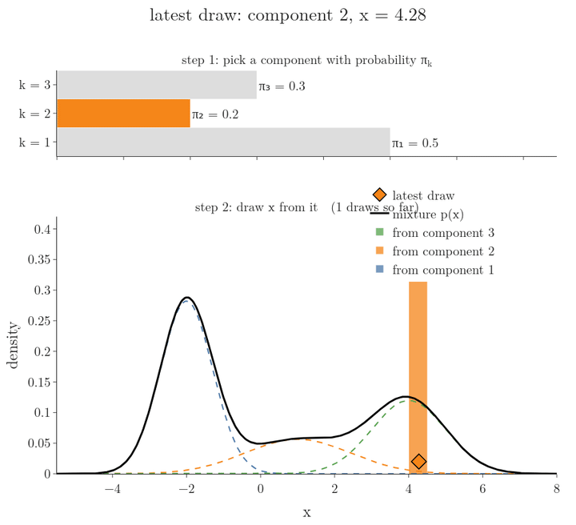
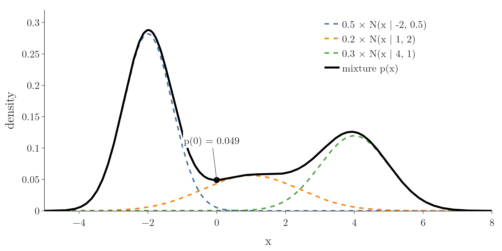
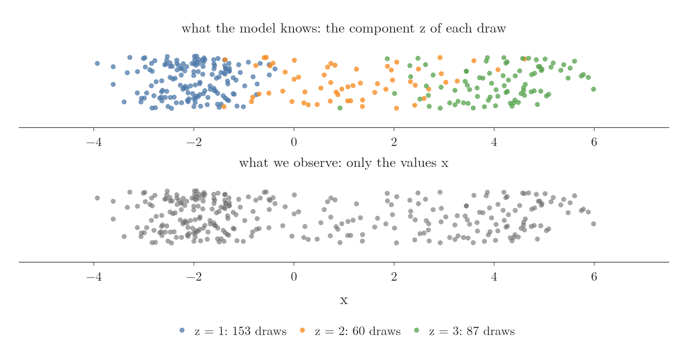
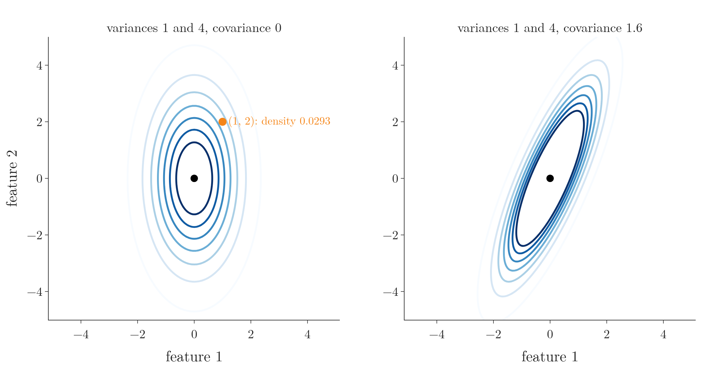
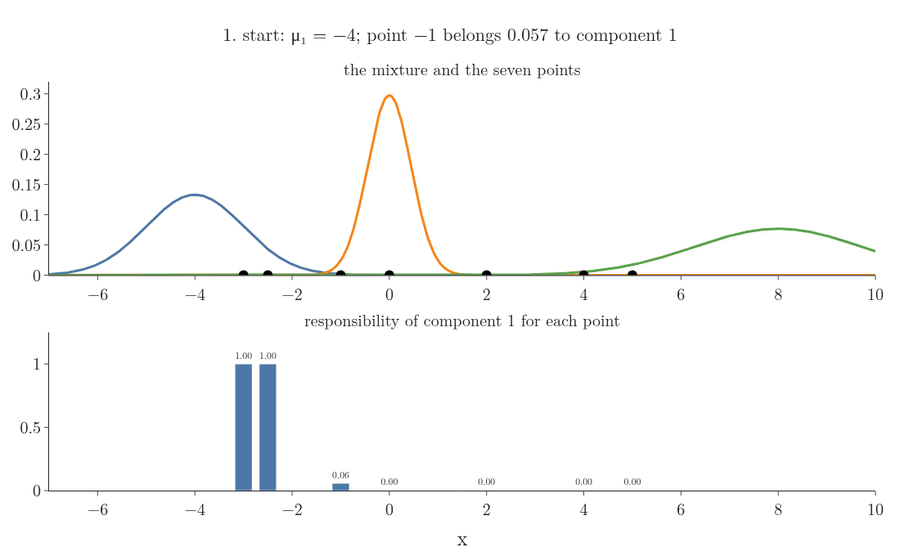
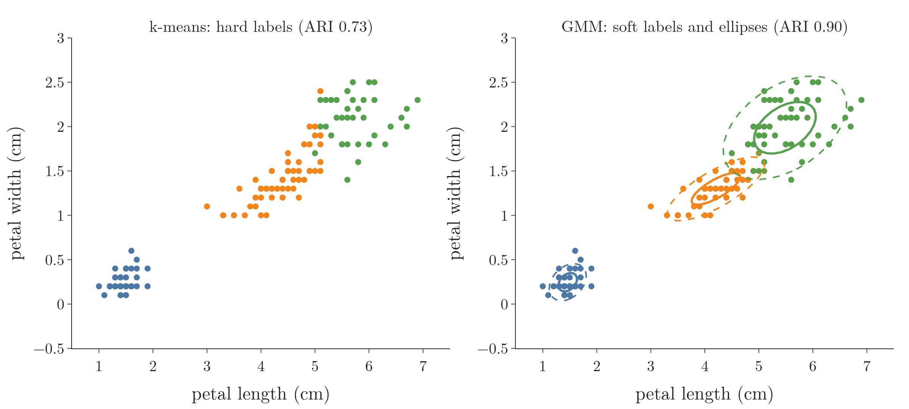

<!-- where-this-fits: generated by course_map/build_map.py; edit concepts.yaml, not this block -->
> **Where this fits:** Pipeline map steps 0 (Foundations), 8 (Model). See the [Course map](../01-course-map/note.md).
>
> 
>
> - **Builds on:** Covariance and covariance matrix ([Note 231](../231-covariance-and-correlation/note.md)); Bayes' theorem ([Note 341](../341-joint-marginal-conditional-probability/note.md)); Normal distribution ([Note 630](../630-probability-vs-likelihood/note.md)); Maximum likelihood estimation (MLE) ([Note 633](../633-mle-in-machine-learning/note.md)).
> - **Compare with:** K-means ([Note 130](../130-kmeans-from-scratch/note.md)); Kernel density estimation (KDE) ([Note 253](../253-pdf-and-cdf-in-practice/note.md)).
<!-- /where-this-fits -->

## 1. Overview

> **Key point:** A Gaussian mixture model describes data with several peaks as a weighted sum of a few normal curves. Each point gets a responsibility for every curve: the probability that this curve produced it. Maximum likelihood for a mixture has no closed-form answer.

This Note follows *Mathematics for Machine Learning* (Deisenroth, Faisal and Ong, 2020; MML below), Chapter 11, Sections 11.1 and 11.2, with the generative view and the responsibilities as posteriors from Sections 11.4.1 to 11.4.3.



The [maximum likelihood estimation Note](../631-maximum-likelihood-estimation/note.md) fitted one distribution to data. Figure 1 shows data that no single named distribution fits: it has three bumps. A mixture builds such a shape from simple parts.

This Note covers:

- why one normal curve is not enough (Section 2);
- the mixture density and its weights (Section 3);
- the two-step story that generates mixture data (Section 4, Figure 1);
- mixtures in two dimensions (Section 5);
- responsibilities, computed with Bayes' theorem (Section 6);
- why maximum likelihood has no closed form here (Section 7), and how it can break (Section 8);
- how a mixture compares with KDE and with k-means (Section 9).

How to fit a mixture, the EM algorithm, is the subject of the [expectation maximization Note](../641-expectation-maximization/note.md).

## 2. One normal curve is not enough

> **Key point:** The Old Faithful geyser waits either about 55 or about 80 minutes between eruptions. The best single normal curve sits in the empty gap between the two; a mixture of two normals follows both bumps and has a much higher likelihood.

Think of two bus routes stopping at the same bus stop: one bus comes every 55 minutes or so, the other every 80. Averaging all the waits gives about 71 minutes, a wait that hardly ever happens. One bell curve makes the same mistake.

Figure 2 shows the real case: 272 **observations** (G-1374; records, one row each of the data table) of the waiting time between eruptions of the Old Faithful geyser in Yellowstone (seaborn's `geyser` dataset, saved in `data/old_faithful.csv`). The histogram has two bumps. The red curve is the single normal fitted by maximum likelihood, with the mean 70.9 and standard deviation 13.6 of the data (the [MLE for common distributions Note](../632-mle-for-common-distributions/note.md)). Its peak sits near 71 minutes, in the valley between the bumps.


The blue curve is a mixture of two normals: weight 0.36 around 54.7 minutes and weight 0.64 around 80.1 minutes, each with a standard deviation of about 6 minutes. The likelihoods measure the difference:

| Model | Log-likelihood of the 272 waiting times |
|---|---|
| one normal (2 parameters) | $-1095$ |
| mixture of two normals (5 parameters) | $-1034$ |

A higher log-likelihood means the model finds the observed data more probable (the [maximum likelihood estimation Note](../631-maximum-likelihood-estimation/note.md)). The gap of 61 means the data is $e^{61}$ times more probable under the mixture.

MML (Chapter 11 introduction) makes the same point: a single Gaussian has limited modelling power, while a mixture can describe data with several clusters (**multimodal** data, G-1275, see the [measures of central tendency Note](../221-measures-of-central-tendency/note.md)).

## 3. The mixture density

> **Key point:** $p(x) = \sum_k \pi_k\thinspace N(x \mid \mu_k, \sigma_k^2)$: a weighted sum of $K$ normal densities, with weights that are non-negative and add up to 1.

### 3.1 The formula

> **Key point:** Each component is a normal curve; each weight says how much of the data it covers.

1. **In words:** a **Gaussian mixture model** (**GMM**, G-829) adds up $K$ normal densities, called **components**, each multiplied by a **mixture weight** $\pi_k$ (G-1238). The weights lie between 0 and 1 and add up to 1, so the total area stays 1.
2. **Formula** (MML equations 11.3 and 11.4):
   $$p(x \mid \theta) = \sum_{k=1}^{K} \pi_k\thinspace N(x \mid \mu_k, \sigma_k^2), \qquad 0 \le \pi_k \le 1, \qquad \sum_{k=1}^{K}\pi_k = 1$$
   The parameters are all the weights, means and variances: $\theta = \lbrace\pi_k, \mu_k, \sigma_k^2 : k = 1, \dots, K\rbrace$. Here $N(x \mid \mu, \sigma^2)$ is the normal PDF of the [normal distribution Note](../250-normal-distribution/note.md), and the second number is the **variance**.
3. **Example:** the mixture of the book's Figure 11.2,
   $$p(x) = 0.5\thinspace N(x \mid -2, 0.5) + 0.2\thinspace N(x \mid 1, 2) + 0.3\thinspace N(x \mid 4, 1)$$
   At $x = 0$ the three weighted components are $0.0052$, $0.0439$ and $0.00004$, so $p(0) = 0.049$.

Figure 3 draws the three weighted components (dashed) and their sum (black). Where components overlap, their heights add. With $K = 1$ the formula is a single normal curve.



### 3.2 Why the weights must add up to 1

> **Key point:** Each component has area 1; weights adding up to 1 make the total area 1.

The area under each normal curve is 1 (the [PDF and continuous CDF Note](../242-pdf-and-continuous-cdf/note.md)). The area under $\pi_k N(x \mid \mu_k, \sigma_k^2)$ is therefore $\pi_k$, and the area under the sum is $\pi_1 + \dots + \pi_K = 1$. In the example, $0.5 + 0.2 + 0.3 = 1$. A sum of this kind, with non-negative weights adding up to 1, is called a **convex combination** (G-475).

## 4. Generating data in two steps

> **Key point:** To draw from a mixture: first pick a component $k$ with probability $\pi_k$, then draw $x$ from that component's normal curve. The picked component is a hidden (latent) variable.

### 4.1 The two steps

> **Key point:** Step 1 is a weighted die roll; step 2 is an ordinary normal draw.

MML (§11.4.1) describes the **generative process** (G-842) of a mixture:

1. **Pick a component.** Roll a weighted die with $K$ faces: face $k$ comes up with probability $\pi_k$.
2. **Draw the value.** Draw $x$ from $N(\mu_k, \sigma_k^2)$, the component that came up.

Repeat for every observation, then forget which component each one came from. Figure 1 runs this for the mixture of Figure 3. The top bar shows the die roll, the diamond the drawn value. After 3,000 draws the histogram matches the mixture density: about half the draws come from the first component, because $\pi_1 = 0.5$ (the Notebook counts 51%).

### 4.2 The latent variable

> **Key point:** The component that produced a point is a random variable we never observe: a latent variable.

For each observation, write $z$ for the number of the component that produced it. Its distribution is the weights: $P(z = k) = \pi_k$ (MML equation 11.60). Given $z = k$, the value is normal: $p(x \mid z = k) = N(x \mid \mu_k, \sigma_k^2)$.

We only ever see $x$, never $z$. A variable that is part of the model but never observed is a **latent variable** (G-1050; Latin *latere*, to lie hidden). Figure 4 shows what is lost. The top row is 300 draws coloured by the component that produced them; the bottom row is the same draws as we receive them. Between the bumps, a grey point could have come from either neighbour, and nothing in the value says which.



Adding up over the possible values of $z$ gives back the mixture density (the book's equations 11.65 and 11.66):

1. **In words:** the density of $x$ is the probability of each component times the density of $x$ under it, added over all components.
2. **Formula:**
   $$p(x) = \sum_{k=1}^{K} P(z = k)\thinspace p(x \mid z = k) = \sum_{k=1}^{K} \pi_k\thinspace N(x \mid \mu_k, \sigma_k^2)$$
3. **Example:** at $x = 0$: $0.5 \times 0.0103 + 0.2 \times 0.2197 + 0.3 \times 0.0001 = 0.049$, the same $p(0)$ as Section 3.1.

The sum is the **law of total probability** (G-1053) of the [Bayes problem Note](../86-bayes-problem/note.md), with machines replaced by components.

## 5. Mixtures in two dimensions

> **Key point:** In two or more dimensions, each component is a multivariate normal with a mean vector and a covariance matrix. Its contour lines are ellipses, which can be stretched and tilted.

### 5.1 The multivariate normal

> **Key point:** The mean vector sets the centre; the covariance matrix sets the width in each direction and the tilt.

For data with $D$ **features** (G-772; input variables, one column each of the data table), a component is a **multivariate normal distribution** (G-1283) $N(\mathbf{x} \mid \boldsymbol\mu, \boldsymbol\Sigma)$. The mean $\boldsymbol\mu$ is a vector with one entry per feature. The **covariance matrix** (G-495) $\boldsymbol\Sigma$ holds the variances on its diagonal and the covariances off it (see the [covariance and correlation Note](../231-covariance-and-correlation/note.md) and the [PCA step by step Note](../48-pca-step-by-step/note.md)).

1. **In words:** the density is highest at the mean and falls off with the squared distance from it, measured in a way that accounts for the spread and tilt that $\boldsymbol\Sigma$ describes.
2. **Formula** (MML §6.5, equation 6.63):
   $$N(\mathbf{x} \mid \boldsymbol\mu, \boldsymbol\Sigma) = (2\pi)^{-D/2}\thinspace\lvert\boldsymbol\Sigma\rvert^{-1/2} \exp\negthinspace\Big(-\tfrac12 (\mathbf{x} - \boldsymbol\mu)^{\mathsf T}\boldsymbol\Sigma^{-1}(\mathbf{x} - \boldsymbol\mu)\Big)$$
   Here $\lvert\boldsymbol\Sigma\rvert$ is the determinant and $\boldsymbol\Sigma^{-1}$ the inverse of the covariance matrix. With $D = 1$ and $\boldsymbol\Sigma = \sigma^2$ the formula is the ordinary normal PDF.
3. **Example:** $D = 2$, mean $(0, 0)$, $\boldsymbol\Sigma$ with diagonal $1, 4$ and zeros elsewhere (variances 1 and 4, no covariance). Then $\lvert\boldsymbol\Sigma\rvert = 4$ and $\boldsymbol\Sigma^{-1}$ has diagonal $1, 1/4$. At $\mathbf{x} = (1, 2)$ the quadratic form is $1^2/1 + 2^2/4 = 2$:
   $$N = \frac{1}{2\pi}\cdot\frac{1}{\sqrt 4}\thinspace e^{-1} = 0.0293$$

Points with the same density lie on an ellipse around the mean (the book's Figure 6.8b). Variances stretch the ellipse along the axes; a non-zero covariance tilts it. Figure 5 draws both cases with the example's variances 1 and 4: without covariance the ellipses stand upright, twice as tall as wide; with a covariance of 1.6 they tilt.



Figure 9 (right, Section 9) shows tilted ellipses fitted to real flowers.

### 5.2 The mixture in $D$ dimensions

> **Key point:** Same formula as in 1D, with vectors and matrices.

The mixture is $p(\mathbf{x}) = \sum_k \pi_k\thinspace N(\mathbf{x} \mid \boldsymbol\mu_k, \boldsymbol\Sigma_k)$, with one mean vector and one covariance matrix per component. Everything in the rest of this Note works the same way in any number of dimensions.

## 6. Responsibilities

> **Key point:** The responsibility $r_{nk}$ is the probability that component $k$ produced observation $x_n$. The responsibility is the posterior of Bayes' theorem: weight times density, divided by the mixture density.

### 6.1 The formula

> **Key point:** $r_{nk} = \pi_k N(x_n \mid \mu_k, \sigma_k^2) \thinspace/\thinspace\sum_j \pi_j N(x_n \mid \mu_j, \sigma_j^2)$.

Having seen a value $x_n$, which component produced it? **Bayes' theorem** (G-269; see the [Bayes' theorem Note](../85-bayes-theorem/note.md)) answers this with the prior $P(z = k) = \pi_k$, the likelihood $N(x_n \mid \mu_k, \sigma_k^2)$ and the evidence $p(x_n)$.

1. **In words:** the **responsibility** (G-1687) of component $k$ for point $n$ is that component's share of the mixture density at $x_n$.
2. **Formula** (MML equations 11.17 and 11.72):
   $$r_{nk} = P(z_n = k \mid x_n) = \frac{\pi_k\thinspace N(x_n \mid \mu_k, \sigma_k^2)}{\sum_{j=1}^{K} \pi_j\thinspace N(x_n \mid \mu_j, \sigma_j^2)}$$
3. **Example:** the book's running example (Section 11.2, Example 11.1) has seven points $-3, -2.5, -1, 0, 2, 4, 5$ and a starting mixture $N(-4, 1)$, $N(0, 0.2)$, $N(8, 3)$ with weights $1/3$ each. For $x_3 = -1$ the weighted densities are
   $$\tfrac13 N(-1 \mid -4, 1) = 0.00148, \qquad \tfrac13 N(-1 \mid 0, 0.2) = 0.02441, \qquad \tfrac13 N(-1 \mid 8, 3) \approx 0$$
   Their sum is 0.02589, so $r_{31} = 0.00148/0.02589 = 0.057$, $r_{32} = 0.943$ and $r_{33} = 0$.

For each point the responsibilities add up to 1, because each numerator is one term of the denominator.

### 6.2 Soft assignment

> **Key point:** A point is not assigned to one component; it is shared among them in proportion to the responsibilities.

All seven points give this table (the book's equation 11.19; the Notebook reproduces it):

| $x_n$ | $-3$ | $-2.5$ | $-1$ | $0$ | $2$ | $4$ | $5$ | total $N_k$ |
|---|---|---|---|---|---|---|---|---|
| $r_{n1}$ | 1.000 | 1.000 | 0.057 | 0.000 | 0.000 | 0.000 | 0.000 | 2.057 |
| $r_{n2}$ | 0.000 | 0.000 | 0.943 | 1.000 | 0.066 | 0.000 | 0.000 | 2.009 |
| $r_{n3}$ | 0.000 | 0.000 | 0.000 | 0.000 | 0.934 | 1.000 | 1.000 | 2.934 |

Each column of numbers is one point's **soft assignment** (G-1826). The last column, $N_k = \sum_n r_{nk}$, is the **total responsibility** (G-1992) of component $k$: about how many points it accounts for. The three totals add up to 7, the number of points.

{height=45%}

Figure 6 (bottom) draws the responsibilities for every $x$. Near a component's centre its responsibility is close to 1; between two components it changes from one to the other, and there a point is shared, as $x = -1$ is shared 0.057 to 0.943.

## 7. Why maximum likelihood has no closed form

> **Key point:** The log of a mixture is the log of a sum, which does not split. Setting the derivatives to 0 gives equations for the parameters that contain the responsibilities, and the responsibilities depend on the parameters.

### 7.1 The log-likelihood

> **Key point:** $\ell(\theta) = \sum_n \log \sum_k \pi_k N(x_n \mid \mu_k, \sigma_k^2)$: a sum of logs of sums.

For **i.i.d.** (G-933) data the likelihood is a product over the points (the [maximum likelihood estimation Note](../631-maximum-likelihood-estimation/note.md)), and each factor is now a mixture density.

1. **In words:** for each point, add up its weighted component densities, take the log, then add the logs over all points.
2. **Formula** (MML equation 11.10):
   $$\ell(\theta) = \sum_{n=1}^{N} \log p(x_n \mid \theta) = \sum_{n=1}^{N} \log \sum_{k=1}^{K} \pi_k\thinspace N(x_n \mid \mu_k, \sigma_k^2)$$
3. **Example:** for the seven points and the starting mixture, $\ell = -28.3$ (the book's Example 11.5; the Notebook gets $-28.33$).

For one normal curve, the log went straight onto the exponential and left a simple sum of squares (the [MLE for common distributions Note](../632-mle-for-common-distributions/note.md), Section 4.2). Here the log sits on a sum over $k$, and $\log(a + b)$ cannot be split into $\log a + \log b$. The book (Section 11.2, remark after equation 11.10) names this as the reason no closed-form solution exists.

### 7.2 Setting the derivative for a mean to 0

> **Key point:** The condition "slope = 0" for $\mu_k$ says that $\mu_k$ is the responsibility-weighted average of the data.

We follow the book's proof of Theorem 11.1 in one dimension.

1. **In words:** differentiate $\ell$ with respect to one mean, $\mu_k$, set the result to 0, and solve for $\mu_k$.
2. **Formula:** by the chain rule, the derivative of $\log p(x_n)$ is $1/p(x_n)$ times the derivative of $p(x_n)$. Only the $k$-th term of the sum contains $\mu_k$, and the derivative of a normal density with respect to its mean is the density times $(x_n - \mu_k)/\sigma_k^2$. So
   $$\frac{\partial\ell}{\partial\mu_k} = \sum_{n=1}^{N} \underbrace{\frac{\pi_k N(x_n \mid \mu_k, \sigma_k^2)}{\sum_j \pi_j N(x_n \mid \mu_j, \sigma_j^2)}} _{r_{nk}} \cdot \frac{x_n - \mu_k}{\sigma_k^2} = \frac{1}{\sigma_k^2}\sum_{n=1}^{N} r_{nk}(x_n - \mu_k)$$
   The fraction is exactly the responsibility. Setting the sum to 0 and solving:
   $$\mu_k = \frac{\sum_n r_{nk}\thinspace x_n}{\sum_n r_{nk}} = \frac{1}{N_k}\sum_{n=1}^{N} r_{nk}\thinspace x_n$$
3. **Example:** with the responsibilities of Section 6.2, component 1 gets
   $$\mu_1 = \frac{1.000 \times (-3) + 1.000 \times (-2.5) + 0.057 \times (-1) + 0.0002 \times 0}{2.057} = -2.70$$
   The book's Example 11.3 also moves $\mu_1$ from $-4$ to $-2.7$.

In the same way (the book's Theorems 11.2 and 11.3) the other two conditions are:

- **variance:** $\sigma_k^2 = \sum_n r_{nk}(x_n - \mu_k)^2 / N_k$, the responsibility-weighted variance (the book's equation 11.30);
- **weight:** $\pi_k = N_k / N$, the share of the total responsibility. The weights must add up to 1, so the book derives this with a Lagrange multiplier (equations 11.43 to 11.49; see the [Lagrange multipliers Note](../620-lagrange-multipliers/note.md)).

With all $r_{nk}$ equal to 1 for one component, these are the mean, the MLE variance and the share of points of that component's data, as for one normal curve.

### 7.3 The circular dependence

> **Key point:** To compute $\mu_k$ we need the responsibilities; to compute the responsibilities we need $\mu_k$. The equations do not give the answer in one step.

The formula for $\mu_k$ looks like a solution, but the $r_{nk}$ on its right-hand side are computed from all the means, variances and weights (the book's remark after Theorem 11.1). Once $\mu_1$ moves from $-4$ to $-2.70$, the responsibilities change: point $-1$ now belongs 0.56 to component 1 instead of 0.057. The weighted average with these new responsibilities is $-2.34$, not $-2.70$, so the new $\mu_1$ no longer satisfies its own equation (Notebook, Section 4).

Figure 7 runs these steps. Watch the bar of point $-1$ in the bottom panel: it is small while $\mu_1 = -4$, grows to 0.56 once $\mu_1$ moves to $-2.70$, and with that bigger share pulls the next weighted mean to $-2.34$.



So the three conditions form a set of equations that depend on each other, and MML (§11.2) states that they cannot be solved in closed form. They can be used in turns instead: compute responsibilities, update the parameters, recompute the responsibilities, and so on. Taking turns in this way is the EM algorithm of the [expectation maximization Note](../641-expectation-maximization/note.md).

## 8. When maximum likelihood breaks

> **Key point:** If one component sits exactly on one observation and its variance shrinks to 0, the likelihood grows without limit. Maximum likelihood then prefers a useless spike.

MML (§11.5) warns that maximum likelihood for a mixture can overfit badly in exactly this way. The derivation is the one-point case of the [MLE for common distributions Note](../632-mle-for-common-distributions/note.md) (Section 4.1, Extra):

1. **In words:** put the mean of component 1 on an observation $x_1$. The density of $x_1$ then contains the term $\pi_1/(\sigma_1\sqrt{2\pi})$, which grows without limit as $\sigma_1 \to 0$. Every other point keeps a positive density from the remaining components, so the whole likelihood grows without limit.
2. **Formula:**
   $$p(x_1 \mid \theta) \ge \frac{\pi_1}{\sigma_1\sqrt{2\pi}} \to \infty \quad\text{as}\quad \sigma_1 \to 0$$
3. **Example:** the seven points, with component 1 placed at $-3$, components 2 and 3 fixed at $N(0, 1)$ and $N(4, 1)$, and equal weights. The Notebook (Section 5) gives $\ell = -17.25$ for $\sigma_1 = 0.1$, $-14.95$ for $\sigma_1 = 0.01$ and $-12.65$ for $\sigma_1 = 0.001$. Each tenfold shrink adds $\log 10 = 2.30$, the growth of $\log(1/\sigma_1)$ in the formula, and it never stops.

Figure 8 shows the collapse. With $\sigma_1 = 0.1$ the mixture already has a tall, narrow spike on the point $-3$, and every tenfold shrink of $\sigma_1$ raises the log-likelihood by the same 2.30.


Such a spike describes one point, not a cluster. In practice libraries keep the variances away from 0: scikit-learn's `GaussianMixture` adds a small `reg_covar` (default $10^{-6}$) to the diagonal of every covariance matrix, which its documentation says keeps the covariance matrices positive.

## 9. Mixtures, KDE and k-means

> **Key point:** A GMM is a density estimate with a few learned bumps (KDE has one bump per point), and a soft clustering with elliptical clusters (k-means is hard and uses distance to the centre).

### 9.1 Compared with KDE

> **Key point:** KDE places one kernel on every observation with a fixed width; a GMM places $K$ components and learns their centres, widths and weights.

The [density estimation Note](../243-density-estimation-kde/note.md) built a **kernel density estimate** (KDE, G-1005) by placing one small normal curve on every observation and averaging. A GMM also adds normal curves, but only $K$ of them, with every centre, width and weight fitted to the data. The density estimation Note already placed it between parametric and non-parametric methods.

| | KDE | GMM |
|---|---|---|
| Number of bumps | one per observation ($n$) | $K$, chosen by us |
| Bump centres | the observations | learned ($\mu_k$) |
| Bump widths | one bandwidth for all | learned per component ($\sigma_k^2$ or $\boldsymbol\Sigma_k$) |
| Bump weights | all equal, $1/n$ | learned ($\pi_k$) |
| Also gives clusters | no | yes, via the responsibilities |

### 9.2 Compared with k-means

> **Key point:** k-means gives each point to its nearest centre; a GMM shares each point by responsibilities and models each cluster's shape with a covariance matrix.

**k-means** (G-996; the [k-means intuition Note](../128-kmeans-intuition/note.md)) assigns each point to its nearest centroid and moves each centroid to the mean of its points. MML (§11.5) relates the two: treat the GMM means as cluster centres and ignore the covariances (set them to the identity), and the result is k-means; k-means makes a hard assignment, a GMM a soft one through the responsibilities.

Figure 9 compares the two on the Iris dataset (scikit-learn's `load_iris`): 150 flowers, each with four features (sepal length, sepal width, petal length, petal width) and a known species. Both methods see only the four features; the species is used afterwards to score them. The **adjusted Rand index** (ARI; G-175) measures how well a clustering matches the true groups: 1 for a perfect match, about 0 for random labels (scikit-learn's `adjusted_rand_score` documentation).



| Method (all four features) | ARI |
|---|---|
| k-means | 0.73 |
| GMM, full covariance matrices | 0.90 |
| GMM, round components (one variance per component, no tilt) | 0.73 |

The two species on the upper right overlap, and their clouds are tilted ellipses: longer petals come with wider petals. k-means draws its boundary by distance to the centres, as if every cluster were a circle.

To test whether the covariance matrices make the difference, the Notebook (Section 6) refits the GMM with only that changed: round components, each with a single variance and no tilt. The ARI drops to 0.73, exactly k-means's score. So on Iris the advantage comes from modelling each cluster's stretched, tilted shape.

> **Python:** scikit-learn fits a GMM with the EM algorithm.
>
> ```python
> from sklearn.mixture import GaussianMixture
>
> gmm = GaussianMixture(n_components=3,
>                       covariance_type="full",
>                       random_state=0).fit(X)
> gmm.weights_       # the mixture weights pi_k
> gmm.means_         # one mean vector per component
> gmm.covariances_   # one covariance matrix per component
> gmm.predict_proba(X)   # responsibilities, one row per observation
> gmm.predict(X)         # hard labels: the largest responsibility
> gmm.score(X)       # average log-likelihood per point
> ```
>
> `covariance_type` sets the shape of the components: `"full"` (any ellipse), `"diag"` (ellipses along the axes), `"spherical"` (circles) or `"tied"` (one shared ellipse).

## 10. Summary

| Idea | Formula | Seven-point example |
|---|---|---|
| Mixture density | $p(x) = \sum_k \pi_k N(x \mid \mu_k, \sigma_k^2)$ | start: $N(-4, 1)$, $N(0, 0.2)$, $N(8, 3)$, weights $1/3$ |
| Weights | $\pi_k \ge 0$, $\sum_k \pi_k = 1$ | $1/3 + 1/3 + 1/3 = 1$ |
| Responsibility | $r_{nk} = \pi_k N(x_n \mid \mu_k, \sigma_k^2) / p(x_n)$ | $r_{31} = 0.057$, $r_{32} = 0.943$ |
| Total responsibility | $N_k = \sum_n r_{nk}$ | $2.057$, $2.009$, $2.934$ |
| Log-likelihood | $\sum_n \log \sum_k \pi_k N(x_n \mid \mu_k, \sigma_k^2)$ | $-28.3$ |
| Slope = 0 for $\mu_k$ | $\mu_k = \sum_n r_{nk} x_n / N_k$ | $\mu_1 = -2.70$ |

- A GMM is a weighted sum of normal curves; it can describe data with several peaks that one normal cannot.
- Data from a mixture is generated in two steps: pick a component with probability $\pi_k$, then draw from it. The component is a latent variable.
- In $D$ dimensions each component is a multivariate normal with a mean vector and a covariance matrix; its contours are ellipses.
- Responsibilities are Bayes posteriors: each point is shared among the components.
- The log of a sum does not split; the slope-zero conditions contain responsibilities that depend on the parameters, so there is no closed form.
- A component collapsing onto one point sends the likelihood to infinity; libraries add a small `reg_covar`.
- Compared with KDE, a GMM uses few learned bumps; compared with k-means, it assigns softly and fits elliptical clusters (on Iris, ARI 0.90 against 0.73).

## 11. Sources

**Built from**

- Deisenroth, M. P., Faisal, A. A. and Ong, C. S. (2020). *Mathematics for Machine Learning*. Cambridge University Press. Free PDF at mml-book.github.io. §6.5 (multivariate Gaussian, eq. 6.63), Ch. 11 intro, §11.1 (GMM, eqs. 11.3–11.5), §11.2 (likelihood eq. 11.10, responsibilities eqs. 11.17 and 11.19, Theorems 11.1–11.3, Examples 11.1–11.5), §11.4.1–11.4.3 (generative process, latent variable, responsibilities as posteriors), §11.5 (collapse of maximum likelihood; relation to k-means).

**Other references**

- scikit-learn documentation: `GaussianMixture` (`reg_covar`, `covariance_type`) and `adjusted_rand_score`.
- Old Faithful waiting times: seaborn's `geyser` dataset (272 eruptions), saved in `data/old_faithful.csv`.
- Iris: Fisher's Iris dataset as shipped with scikit-learn (`sklearn.datasets.load_iris`).

## 12. Key terms

| Term | Meaning |
|---|---|
| Gaussian mixture model (GMM) | A density built as a weighted sum of $K$ normal densities, $\sum_k \pi_k N(x \mid \mu_k, \sigma_k^2)$ |
| Component | One of the normal densities in a mixture |
| Mixture weight $\pi_k$ | The share of the mixture given to component $k$; weights are non-negative and add up to 1 |
| Convex combination | A weighted sum with non-negative weights that add up to 1 |
| Generative process | A step-by-step recipe that produces data from a model |
| Latent variable | A variable in a model that is never observed, such as the component that produced a point |
| Multivariate normal distribution | The normal distribution of a vector, set by a mean vector and a covariance matrix |
| Responsibility $r_{nk}$ | The posterior probability that component $k$ produced point $n$ |
| Soft assignment | Sharing a point among clusters by probabilities instead of giving it to one |
| Total responsibility $N_k$ | The sum of the responsibilities of component $k$ over all points |
| Adjusted Rand index (ARI) | A score for how well a clustering matches the true groups: 1 for identical, about 0 for random |
| `reg_covar` | scikit-learn's small number added to the covariance diagonals so no component collapses |
