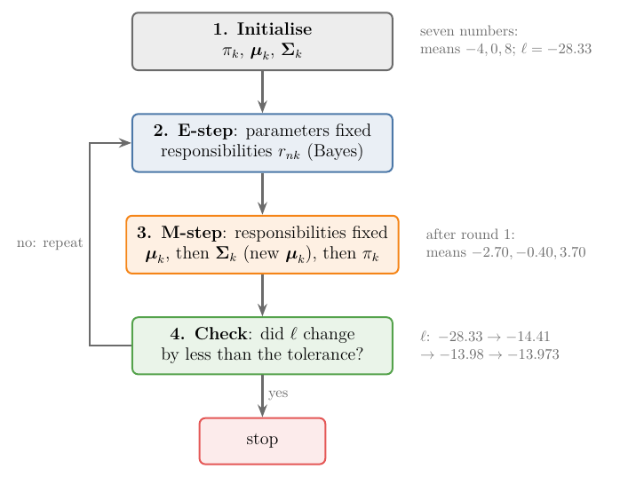
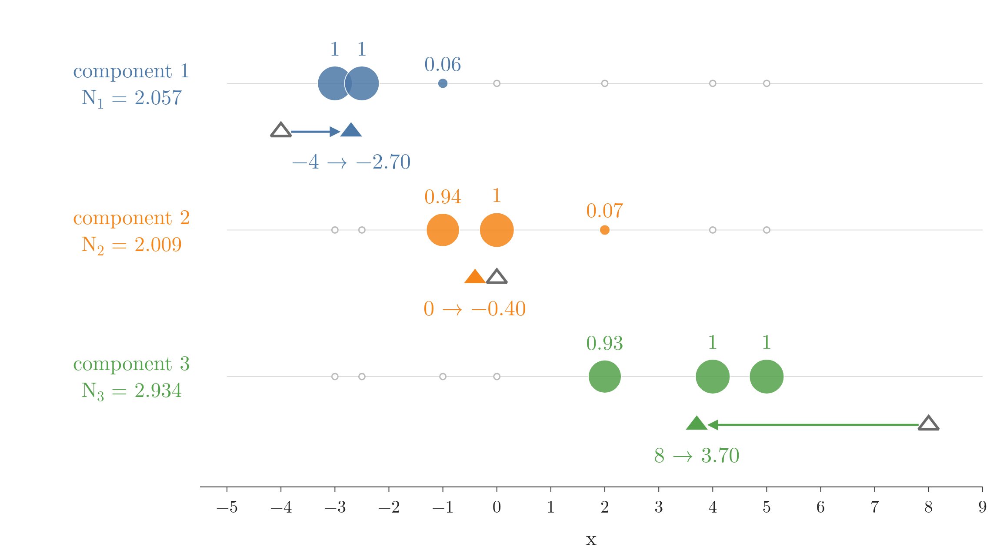
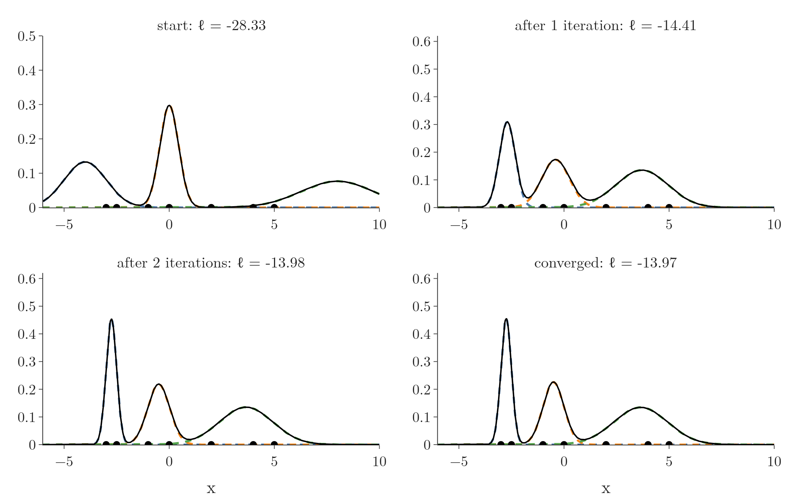
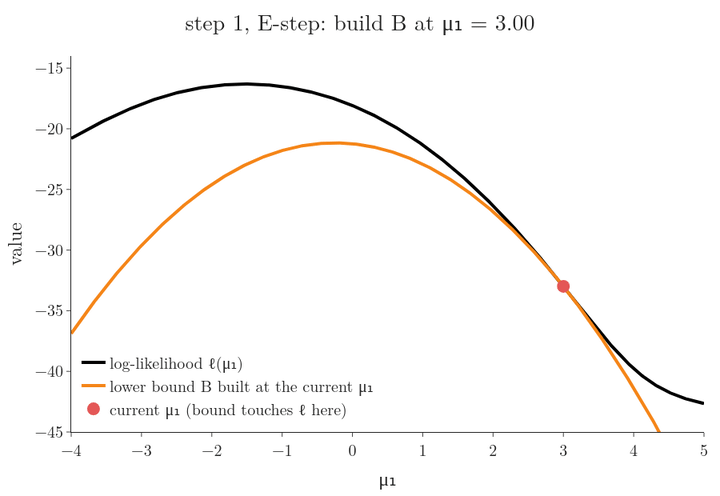
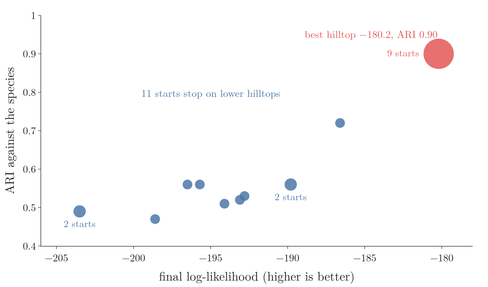

<!-- where-this-fits: generated by course_map/build_map.py; edit concepts.yaml, not this block -->
> **Where this fits:** Pipeline map step 8 (Model). See the [Course map](../01-course-map/note.md).
>
> 
>
> - **Builds on:** Feature scaling ([Note 24](../24-standardization/note.md)); Elbow method and WCSS ([Note 129](../129-kmeans-code/note.md)); Clustering ([Note 132](../132-dbscan/note.md)); Bayes' theorem ([Note 341](../341-joint-marginal-conditional-probability/note.md)); Maximum likelihood estimation (MLE) ([Note 633](../633-mle-in-machine-learning/note.md)); Multivariate normal distribution ([Note 640](../640-gaussian-mixture-models/note.md)).
> - **Compare with:** Hierarchical clustering ([Note 131](../131-hierarchical-clustering/note.md)); DBSCAN ([Note 132](../132-dbscan/note.md)); Kernel density estimation (KDE) ([Note 253](../253-pdf-and-cdf-in-practice/note.md)).
<!-- /where-this-fits -->

## 1. Overview

> **Key point:** EM fits a Gaussian mixture by taking turns. The E-step computes every observation's responsibilities from the current parameters. The M-step recomputes the parameters as responsibility-weighted averages. Each round can only raise the log-likelihood.

This Note follows *Mathematics for Machine Learning* (Deisenroth, Faisal and Ong, 2020; MML below), Sections 11.3 and 11.4, with the MM view of Hunter and Lange (2004) and Nguyen (2016).

The [Gaussian mixture models Note](../640-gaussian-mixture-models/note.md) ended with a circular problem. The best means, variances and weights are responsibility-weighted averages, and the responsibilities depend on those same parameters. The **EM algorithm** (G-675), short for expectation maximization, breaks the circle by alternating: fix one side, compute the other, repeat. Figure 1 shows the result on real data: 272 **observations** (records, one row each of the data table) of eruptions of the Old Faithful geyser. The two ellipses start in the wrong places and settle on the short and the long eruptions within about 10 iterations.

This Note covers:

- the two steps and the full algorithm (Sections 2 and 3);
- one iteration by hand on seven numbers, then to convergence (Section 4);
- EM in two dimensions, on Old Faithful (Section 5);
- why the log-likelihood never decreases (Section 6);
- local maxima and starting points (Section 7);
- k-means as a "hard" version of EM (Section 8);
- EM as one member of the MM family (Section 9, Extra).

## 2. The two steps

> **Key point:** E-step: with the parameters fixed, compute responsibilities. M-step: with the responsibilities fixed, compute the parameters. Each step is easy when the other side is held still.

The two halves of the circle are each easy on their own:

- **If we knew the parameters**, the responsibilities are one application of Bayes' theorem per observation (the [Gaussian mixture models Note](../640-gaussian-mixture-models/note.md), Section 6).
- **If we knew the responsibilities**, the parameters are weighted averages (the same Note, Section 7.2).

So we guess the parameters, compute responsibilities, recompute the parameters from them, and repeat. MML (§11.3) names the two steps:

- **E-step** (G-654) (expectation): evaluate the responsibilities $r_{nk}$, the posterior probability that observation $n$ belongs to component $k$.
- **M-step** (G-1139) (maximization): use these responsibilities to re-estimate the means, covariances and weights.

An intuition: the E-step asks each observation "how much do you belong to each component?", and the M-step lets each component move to the centre of the observations that claimed it, in proportion to the claims.

## 3. The algorithm

> **Key point:** Initialise; then repeat E-step, M-step until the log-likelihood stops changing.

1. **Initialise** the weights $\pi_k$, means $\boldsymbol\mu_k$ and covariances $\boldsymbol\Sigma_k$.
2. **E-step:** for every observation $n$ and component $k$,
   $$r_{nk} = \frac{\pi_k\thinspace N(\mathbf x_n \mid \boldsymbol\mu_k, \boldsymbol\Sigma_k)}{\sum_j \pi_j\thinspace N(\mathbf x_n \mid \boldsymbol\mu_j, \boldsymbol\Sigma_j)}, \qquad N_k = \sum_{n=1}^{N} r_{nk}$$
3. **M-step:** in this order (MML §11.3, eqs. 11.54 to 11.56):
   $$\boldsymbol\mu_k = \frac{1}{N_k}\sum_{n=1}^{N} r_{nk}\thinspace\mathbf x_n, \qquad \boldsymbol\Sigma_k = \frac{1}{N_k}\sum_{n=1}^{N} r_{nk}(\mathbf x_n - \boldsymbol\mu_k)(\mathbf x_n - \boldsymbol\mu_k)^{\mathsf T}, \qquad \pi_k = \frac{N_k}{N}$$
   The covariance update uses the **new** means.
4. **Check:** compute the log-likelihood $\ell = \sum_n \log \sum_k \pi_k N(\mathbf x_n \mid \boldsymbol\mu_k, \boldsymbol\Sigma_k)$. If it changed by less than a small tolerance, stop; otherwise go back to step 2.

{height=45%}

Figure 2 draws the four steps as a loop. Watch the arrow back from the check: EM never stops after one round unless the log-likelihood has settled.

In one dimension, $\boldsymbol\Sigma_k$ is just the variance $\sigma_k^2$, and $(\mathbf x_n - \boldsymbol\mu_k)(\mathbf x_n - \boldsymbol\mu_k)^{\mathsf T}$ is just $(x_n - \mu_k)^2$.

The algorithm was proposed by Dempster, Laird and Rubin in 1977 (MML §11.3). scikit-learn's `GaussianMixture` runs this loop and stops when the gain of a lower bound on the average log-likelihood falls below `tol` (default $10^{-3}$, from its documentation; Section 6 explains the lower bound).

## 4. One iteration by hand

> **Key point:** On seven numbers, one EM iteration moves the means from $-4, 0, 8$ to $-2.70, -0.40, 3.70$ and raises the log-likelihood from $-28.3$ to $-14.4$.

### 4.1 The start and the E-step

> **Key point:** The E-step at the start gives the responsibility table of the Gaussian mixture models Note.

We use the running example of MML §11.2: seven observations $-3, -2.5, -1, 0, 2, 4, 5$, three components starting at $N(-4, 1)$, $N(0, 0.2)$ and $N(8, 3)$ (the second number is the variance), weights $1/3$ each, and log-likelihood $\ell = -28.33$.

The E-step at this start is exactly the responsibility table already worked out in the [Gaussian mixture models Note](../640-gaussian-mixture-models/note.md) (Section 6.2):

| $x_n$ | $-3$ | $-2.5$ | $-1$ | $0$ | $2$ | $4$ | $5$ | $N_k$ |
|---|---|---|---|---|---|---|---|---|
| $r_{n1}$ | 1.000 | 1.000 | 0.057 | 0.000 | 0.000 | 0.000 | 0.000 | 2.057 |
| $r_{n2}$ | 0.000 | 0.000 | 0.943 | 1.000 | 0.066 | 0.000 | 0.000 | 2.009 |
| $r_{n3}$ | 0.000 | 0.000 | 0.000 | 0.000 | 0.934 | 1.000 | 1.000 | 2.934 |

### 4.2 The M-step: means

> **Key point:** Each new mean is the responsibility-weighted average of the observations.

1. **In words:** multiply each observation by its responsibility, add up, and divide by the total responsibility $N_k$.
2. **Formula:**
   $$\mu_k = \frac{1}{N_k}\sum_{n} r_{nk}\thinspace x_n$$
3. **Example:** $\mu_1 = -2.70$ was computed in the Gaussian mixture models Note (Section 7.2). The other two:
   $$\mu_2 = \frac{0.943 \times (-1) + 1.000 \times 0 + 0.066 \times 2}{2.009} = \frac{-0.811}{2.009} = -0.40$$
   $$\mu_3 = \frac{0.934 \times 2 + 1 \times 4 + 1 \times 5}{2.934} = \frac{10.868}{2.934} = 3.70$$

In Figure 3, watch the third row: the mean jumps from 8 to 3.70 because the only observations that claim component 3 sit at 2, 4 and 5; the empty start at 8 has no pull at all.

### 4.3 The M-step: variances and weights

> **Key point:** Each new variance is the responsibility-weighted average squared distance from the new mean; each new weight is $N_k / N$.

1. **In words:** for the variance, take each observation's squared distance from the **new** mean, weight it by the responsibility, add up and divide by $N_k$. For the weight, divide $N_k$ by the number of observations.
2. **Formula:**
   $$\sigma_k^2 = \frac{1}{N_k}\sum_{n} r_{nk}(x_n - \mu_k)^2, \qquad \pi_k = \frac{N_k}{N}$$
3. **Example:** for component 1, with $\mu_1 = -2.701$:
   $$\sigma_1^2 = \frac{1 \times 0.299^2 + 1 \times 0.201^2 + 0.057 \times 1.701^2 + 0.0002 \times 2.701^2}{2.057} = \frac{0.296}{2.057} = 0.14$$
   The weights are $2.057/7 = 0.29$, $2.009/7 = 0.29$ and $2.934/7 = 0.42$.

After this one iteration (the same numbers as MML Examples 11.3 to 11.5):

| | Start | After 1 iteration |
|---|---|---|
| Means | $-4$, $0$, $8$ | $-2.70$, $-0.40$, $3.70$ |
| Variances | 1, 0.2, 3 | 0.14, 0.44, 1.53 |
| Weights | 0.33, 0.33, 0.33 | 0.29, 0.29, 0.42 |
| Log-likelihood | $-28.33$ | $-14.41$ |

### 4.4 Running to convergence

> **Key point:** Repeating the two steps, the log-likelihood rises to $-13.97$ and stops changing after a few iterations.

| Iteration | 0 | 1 | 2 | 3 | 4 and later |
|---|---|---|---|---|---|
| Log-likelihood | $-28.33$ | $-14.41$ | $-13.98$ | $-13.973$ | $-13.973$ |

{height=45%}

The fitted mixture (Notebook, Section 1) is

$$p(x) = 0.29\thinspace N(x \mid -2.75, 0.06) + 0.28\thinspace N(x \mid -0.50, 0.25) + 0.43\thinspace N(x \mid 3.64, 1.63)$$

the result MML reports after five iterations (eq. 11.57). Figure 4 shows the most change happening in the first iteration: the components jump from where we guessed them to where the observations are.

## 5. EM in two dimensions

> **Key point:** The same two steps fit means, full covariance matrices and weights; on Old Faithful the two ellipses find the short and the long eruptions.

Each Old Faithful eruption has two **features** (input variables, one column each of the data table): how long the eruption lasted and how long the geyser had waited since the previous one, both in minutes (seaborn's `geyser` dataset, saved in `data/old_faithful.csv`). Short eruptions tend to follow short waits; long eruptions follow long waits.

Figure 1 starts EM deliberately badly: two round-ish components centred at (2 minutes, 90 minutes) and (4.5, 50), where there are no eruptions at all.

| Iteration | 0 | 1 | 5 | 10 and later |
|---|---|---|---|---|
| Log-likelihood | $-2111$ | $-1270$ | $-1182$ | $-1130$ |

- **Iteration 1:** the first M-step pulls both means into the data, but both ellipses are long and cover parts of both groups.
- **Iterations 2 to 9:** the components trade eruptions. Orange shrinks onto the short eruptions, blue onto the long ones.
- **From iteration 10:** the parameters stop changing. The final components have weights 0.36 and 0.64 and means (2.04 minutes, 54.5 minutes) and (4.29, 80.0): short eruptions after a wait of about 55 minutes, long eruptions after about 80. The waiting times match the two bumps of the [Gaussian mixture models Note](../640-gaussian-mixture-models/note.md) (Section 2). scikit-learn's `GaussianMixture` reaches the same log-likelihood, $-1130.3$ (Notebook, Section 2).

## 6. Why the log-likelihood never decreases

> **Key point:** The E-step builds a lower bound on the log-likelihood that touches the log-likelihood at the current parameters. The M-step climbs to the top of that bound. The log-likelihood, always above the bound, must go up at least as much.

### 6.1 What we see

> **Key point:** In both examples, every iteration raised the log-likelihood or left it unchanged.

The log-likelihoods in the tables of Sections 4.4 and 5 only ever go up. The Notebook (Section 3) checks every one of 60 iterations on Old Faithful: no change is negative (allowing $10^{-9}$ for computer rounding). MML (§11.3) states that every EM step increases the log-likelihood. The rest of this section proves it.

### 6.2 Jensen's inequality for the log

> **Key point:** The log of an average is at least the average of the logs.

The log is a concave function: every chord lies below its curve (the [convex sets and functions Note](../621-convex-sets-and-functions/note.md)). A weighted average of points on the curve is a point on a chord, so it lies below the curve at the averaged position. The resulting rule is **Jensen's inequality** (G-981) (named in MML §7.3, remark after Definition 7.3).

1. **In words:** for weights $q_k \ge 0$ that add up to 1 and positive numbers $a_k$, the log of the weighted average is at least the weighted average of the logs. The two are equal when all the $a_k$ are the same.
2. **Formula:**
   $$\log \sum_k q_k a_k \thickspace\ge\thickspace\sum_k q_k \log a_k$$
3. **Example:** $q = (0.5, 0.5)$, $a = (1, 4)$: $\log 2.5 = 0.916$ on the left, $0.5 \log 1 + 0.5 \log 4 = 0.693$ on the right. With $a = (3, 3)$ both sides are $\log 3$.

### 6.3 The lower bound

> **Key point:** Writing each observation's mixture density as an average over the responsibilities and applying Jensen gives a lower bound $B$ that equals $\ell$ when the responsibilities are the current ones.

The plain idea first. The log-likelihood is hard to maximise directly, because each observation's term is the log of a **sum** over components. Jensen's inequality lets us swap "log of a sum" for "sum of logs", which is easy to maximise, at the price of getting a number that is never above the true log-likelihood: a floor under it. The trick is to build the floor so that it touches the log-likelihood at the current parameters.

For one observation, multiply and divide each term of the mixture by any numbers $q_{nk} > 0$ with $\sum_k q_{nk} = 1$. Then Jensen applies:

$$\log \sum_k \pi_k N_k(x_n) = \log \sum_k q_{nk}\thinspace\frac{\pi_k N_k(x_n)}{q_{nk}} \thickspace\ge\thickspace\sum_k q_{nk} \log\frac{\pi_k N_k(x_n)}{q_{nk}}$$

Here $N_k(x_n)$ is short for $N(x_n \mid \mu_k, \sigma_k^2)$. Adding over the observations gives a **lower bound** (G-1134) on the whole log-likelihood, a function that is never above it:

$$\ell(\theta) \thickspace\ge\thickspace B(\theta; q) = \sum_{n}\sum_{k} q_{nk} \log\frac{\pi_k N_k(x_n)}{q_{nk}}$$

**The bound touches when $q$ is the responsibilities.** Choose $q_{nk} = r_{nk}$, the responsibilities computed from the same $\theta$. Then every ratio $\pi_k N_k(x_n)/r_{nk}$ equals $\sum_j \pi_j N_j(x_n) = p(x_n)$, the same number for every $k$, and Jensen holds with equality. So

$$B(\theta; r(\theta)) = \sum_n \sum_k r_{nk} \log p(x_n) = \sum_n \log p(x_n) = \ell(\theta)$$

For the seven observations at the start, the Notebook (Section 3) computes $B = -28.33 = \ell$. With other weights, say $q_{nk} = 1/3$ for every $n$ and $k$, the bound is far lower: $-116.0$.

### 6.4 The ascent argument

> **Key point:** E-step: make the bound touch at $\theta_t$. M-step: maximise the bound. Then $\ell(\theta_{t+1}) \ge B(\theta_{t+1}) \ge B(\theta_t) = \ell(\theta_t)$.

1. **E-step:** set $q = r(\theta_t)$. Now $B(\theta_t; q) = \ell(\theta_t)$ (Section 6.3).
2. **M-step:** choose $\theta_{t+1}$ to maximise $B(\theta; q)$ with $q$ held fixed. Then $B(\theta_{t+1}; q) \ge B(\theta_t; q)$, because $\theta_t$ was one of the options.
3. **Chain:** the bound holds for every $\theta$, so
   $$\ell(\theta_{t+1}) \thickspace\ge\thickspace B(\theta_{t+1}; q) \thickspace\ge\thickspace B(\theta_t; q) \thickspace=\thickspace\ell(\theta_t)$$

The update formulas of Section 3 are exactly the maximiser in step 2. With $q$ fixed, the term $-\sum q_{nk}\log q_{nk}$ of $B$ is a constant, and the rest is $\sum_n\sum_k r_{nk}\log(\pi_k N_k(x_n))$: a responsibility-weighted version of the one-normal log-likelihood. Setting its derivative with respect to $\mu_k$ to 0 gives $\sum_n r_{nk}(x_n - \mu_k) = 0$, the weighted mean. The variance and the weights (with a Lagrange multiplier for $\sum\pi_k = 1$, see the [Lagrange multipliers Note](../620-lagrange-multipliers/note.md)) work the same way.

The part being maximised, $\sum_n\sum_k r_{nk}\log(\pi_k N_k(x_n))$, is the **expected complete-data log-likelihood** (G-722), written $Q(\theta \mid \theta_t)$ in MML (§11.4.5, eq. 11.73). "Complete data" means the observations together with their component labels $z$; the E-step averages over the unknown labels with the responsibilities as probabilities. The expectation in $Q$ gives the E-step its name.

Figure 5 shows the argument for one parameter: a mixture $0.5\thinspace N(\mu_1, 1.5^2) + 0.5\thinspace N(4, 1.5^2)$ on the seven observations, fitting only $\mu_1$ from a start at 3.

| Step | 0 | 1 | 2 | 3 | 4 |
|---|---|---|---|---|---|
| $\mu_1$ | 3.00 | $-0.25$ | $-1.25$ | $-1.47$ | $-1.52$ |
| $\ell(\mu_1)$ | $-32.99$ | $-17.54$ | $-16.37$ | $-16.31$ | $-16.31$ |

Each orange bound is a parabola that lies under the black curve and touches it at the red point. Its top is never above the black curve, so each jump lands on a higher point of the log-likelihood.

## 7. Local maxima and starting points

> **Key point:** EM always climbs, but it can stop on a lower hilltop. Running it from several starts and keeping the best result guards against this.

"Never decreases" does not mean "finds the highest point". MML (§11.4.5) notes that EM can converge to a **local maximum** (G-1109) of the log-likelihood, a point higher than everything near it but not the highest overall, and suggests several runs from different starting points.

Old Faithful is too easy to show this: from 20 random starts, EM found the same answer every time (Notebook, Section 4). The Iris flowers are harder: 150 observations with four features each and three overlapping species, the data of the [Gaussian mixture models Note](../640-gaussian-mixture-models/note.md) (Section 9.2). The Notebook runs EM 20 times with three components, each run starting its means at three randomly chosen observations. The ARI (adjusted Rand index) scores how well the result matches the species: 1 for a perfect match.

| Final log-likelihood | ARI against the species | Number of starts |
|---|---|---|
| $-180.2$ (the best) | 0.90 | 9 |
| $-186.6$ to $-203.5$ (nine different lower hilltops) | 0.47 to 0.72 | 11 |

{height=40%}

In Figure 6, watch the blue dots: every one is a hilltop EM cannot leave, and the lower the hilltop, the worse the clusters match the species.

An analogy: a hiker who always walks uphill in fog reaches a summit, but which summit depends on where the hiker started.

Each of the eleven lower runs stopped on a hilltop and stayed there. Keeping the best of the 20 runs recovers the top answer, the fit with ARI 0.90. The same problem appeared for k-means in the [k-means from scratch Note](../130-kmeans-from-scratch/note.md) (Section 9, bad random starts), with the same fix. scikit-learn's `GaussianMixture` starts from a k-means solution by default (`init_params="kmeans"`) and keeps the best of `n_init` starts (default 1), per its documentation.

## 8. K-means as "hard" EM

> **Key point:** Give every component the same weight and the same small round variance. As the variance shrinks, each responsibility becomes 0 or 1, the E-step becomes "assign to the nearest centre" and the M-step becomes "move the centre to the mean": k-means.

First, a one-paragraph recap of **k-means** (G-996) from the [k-means intuition Note](../128-kmeans-intuition/note.md). Choose the number of clusters $k$ and pick $k$ observations at random as the starting **centroids** (G-367), the cluster centres. Then repeat two steps until nothing changes: assign each observation to its nearest centroid, measured by straight-line (Euclidean) distance; then move each centroid to the mean of the observations assigned to it. Because a bad start can give a poor answer, k-means is usually run from several random starts, keeping the result with the smallest total spread within the clusters (the same fix as Section 7).

Those two repeated steps look like an E-step and an M-step. MML (§11.5) relates the two: ignore the covariances (set them to the identity), treat the means as cluster centres, and the result is k-means, which makes a **hard assignment** (G-877) where the GMM makes a soft one. The derivation below shows how the hard assignment arises.

1. **In words:** with equal weights $1/K$ and the same round covariance $\sigma^2\mathbf{I}$ for every component, the responsibilities depend only on the distances $d_{nk} = \lVert\mathbf x_n - \boldsymbol\mu_k\rVert$ from the observation to each centre.
2. **Formula:** the factors $1/K$ and $(2\pi\sigma^2)^{-D/2}$ are the same in every term, so they cancel:
   $$r_{nk} = \frac{e^{-d_{nk}^2/(2\sigma^2)}}{\sum_j e^{-d_{nj}^2/(2\sigma^2)}}$$
   Divide top and bottom by the term of the nearest centre. Every other term becomes $e^{-(d_{nj}^2 - d_{\min}^2)/(2\sigma^2)}$, which goes to 0 as $\sigma \to 0$. So $r_{nk} \to 1$ for the nearest centre and $\to 0$ for the others.
3. **Example:** centres at 0 and 4, observation at $x = 1$: distances 1 and 3. With $\sigma = 1$, $r_{n1} = 1/(1 + e^{-(9 - 1)/2}) = 1/(1 + e^{-4}) = 0.982$. With $\sigma = 0.1$, $r_{n1} = 1/(1 + e^{-400})$, which is 1 to more than a hundred decimal places.

In Figure 7, watch the red dot: as $\sigma$ shrinks it climbs to 1, and the green curve turns into a step at the midpoint 2. Every observation left of 2 then belongs wholly to the component at 0, every observation right of 2 to the component at 4.

With these 0/1 responsibilities the two EM steps become the two steps of the [k-means intuition Note](../128-kmeans-intuition/note.md):

| EM step | With hard responsibilities | k-means step |
|---|---|---|
| E-step: compute $r_{nk}$ | $r_{nk} = 1$ for the nearest centre, 0 otherwise | assign each observation to its nearest centroid |
| M-step: $\mu_k = \sum_n r_{nk}\mathbf x_n / N_k$ | the plain mean of the observations assigned to $k$ | move each centroid to the mean of its cluster |

A GMM keeps the soft curve and also learns each cluster's shape and size; the [Gaussian mixture models Note](../640-gaussian-mixture-models/note.md) (Section 9.2) showed on the Iris flowers that modelling the shape is what lifts the GMM above k-means (ARI 0.90 against 0.73).

## 9. EM is a minorize–maximize (MM) algorithm

> **Key point:** EM is one case of a general recipe: replace a hard function by a simpler one that lies below it and touches it at the current point, maximise the simpler one, repeat.

> **Extra:** The steps of Section 6.4 never used anything special about mixtures except the lower bound. Any method built the same way is an **MM algorithm** (G-1247): *minorize–maximize* when the goal is to maximise, *majorize–minimize* when the goal is to minimise. Hunter and Lange (2004, abstract) state that every EM algorithm is a special case of the MM class, which usually builds its surrogates from convexity rather than from missing data. Nguyen (2016, Section 3) gives the two conditions in the minimising form:
>
> - the **majorizer** $M(\theta; \upsilon)$ lies on or above the objective $O(\theta)$ for every $\theta$;
> - it touches the objective at the current point: $M(\upsilon; \upsilon) = O(\upsilon)$.
>
> Minimising $M$ then cannot raise $O$ (Nguyen's Proposition 1): $O(\theta_{t+1}) \le M(\theta_{t+1}; \theta_t) \le M(\theta_t; \theta_t) = O(\theta_t)$. The inequality chain is the chain of Section 6.4 turned upside down.
>
> For EM the two names describe the same steps. Maximising the log-likelihood $\ell$ with the bound $B$ below it (a **minorizer**, G-1230) is minorize–maximize. Minimising the negative log-likelihood $-\ell$ with $-B$ above it (a majorizer) is majorize–minimize. "Expectation maximization" is the name of this particular way of building the bound, through the expected complete-data log-likelihood.

## 10. Summary

| Step | What it does | Seven-observation example, iteration 1 |
|---|---|---|
| Initialise | guess $\pi_k$, $\mu_k$, $\sigma_k^2$ | means $-4, 0, 8$; $\ell = -28.33$ |
| E-step | responsibilities $r_{nk}$ by Bayes' theorem | $r_{31} = 0.057$, $r_{32} = 0.943$ |
| M-step: means | $\mu_k = \sum_n r_{nk}x_n / N_k$ | $-2.70, -0.40, 3.70$ |
| M-step: variances | $\sigma_k^2 = \sum_n r_{nk}(x_n - \mu_k)^2 / N_k$ | $0.14, 0.44, 1.53$ |
| M-step: weights | $\pi_k = N_k / N$ | $0.29, 0.29, 0.42$ |
| Check | log-likelihood | $-14.41$; converges to $-13.97$ |

- EM alternates two easy steps: responsibilities from parameters, parameters from responsibilities.
- The E-step builds a lower bound that touches the log-likelihood; the M-step maximises the bound; so the log-likelihood never decreases.
- EM can stop at a local maximum; several starting points and keeping the best guard against this.
- With equal weights and a shrinking round variance, responsibilities become 0 or 1 and EM becomes k-means.
- EM is a special case of MM (minorize–maximize / majorize–minimize) algorithms.

## 11. Sources

**Built from**

- Deisenroth, M. P., Faisal, A. A. and Ong, C. S. (2020). *Mathematics for Machine Learning*. Cambridge University Press. Free PDF at mml-book.github.io. §7.3 (Jensen's inequality, remark after Definition 7.3), §11.2 (running example), §11.3 (EM algorithm, update order, eqs. 11.53–11.57, Dempster et al. 1977, every step increases the log-likelihood), §11.4.5 (expected complete-data log-likelihood eq. 11.73; local maxima and several starts), §11.5 (k-means as hard assignment).
- Hunter, D. R. and Lange, K. (2004). A Tutorial on MM Algorithms. *The American Statistician*, 58(1), 30–37. Abstract: every EM algorithm is a special case of MM.
- Nguyen, H. D. (2016). An Introduction to MM Algorithms for Machine Learning and Statistical Estimation. arXiv:1611.03969. Section 1 (MM generalises EM), Section 3, Definitions 1–2 and Proposition 1 (majorizer, monotone decrease).
- Starmer, J. (StatQuest), "StatQuest: K-means clustering", YouTube, https://www.youtube.com/watch?v=4b5d3muPQmA. The k-means steps recapped in Section 8.
- CampusX, "K-Means Clustering Algorithm | Geometric Intuition | Clustering | Unsupervised Learning", YouTube, https://www.youtube.com/watch?v=5shTLzwAdEc. The same steps, as taught in the k-means intuition Note.

**Other references**

- Old Faithful eruptions: seaborn's `geyser` dataset (272 eruptions), saved in `data/old_faithful.csv`.
- scikit-learn documentation: `GaussianMixture` (`tol`, `init_params`, `n_init`).

## 12. Key terms

| Term | Meaning |
|---|---|
| EM algorithm (expectation maximization) | An iterative method for maximum likelihood with latent variables: alternate an E-step and an M-step |
| E-step | Compute the responsibilities (posterior probabilities of the latent labels) from the current parameters |
| M-step | Re-estimate the parameters as responsibility-weighted averages, with the responsibilities held fixed |
| Jensen's inequality (for the log) | The log of a weighted average is at least the weighted average of the logs |
| Lower bound $B(\theta; q)$ | A function below the log-likelihood everywhere, equal to it when $q$ are the current responsibilities |
| Expected complete-data log-likelihood $Q$ | The log-likelihood of observations and labels together, averaged over the labels with the responsibilities |
| Local maximum | A point higher than everything near it but not the highest overall |
| Hard assignment | Giving each observation wholly to one cluster (responsibility 0 or 1) |
| MM algorithm | Minorize–maximize (or majorize–minimize): repeatedly optimise a simpler surrogate that bounds the objective and touches it at the current point |
| Minorizer / majorizer | A surrogate that lies below (minorizer) or above (majorizer) the objective and touches it at the current point |
