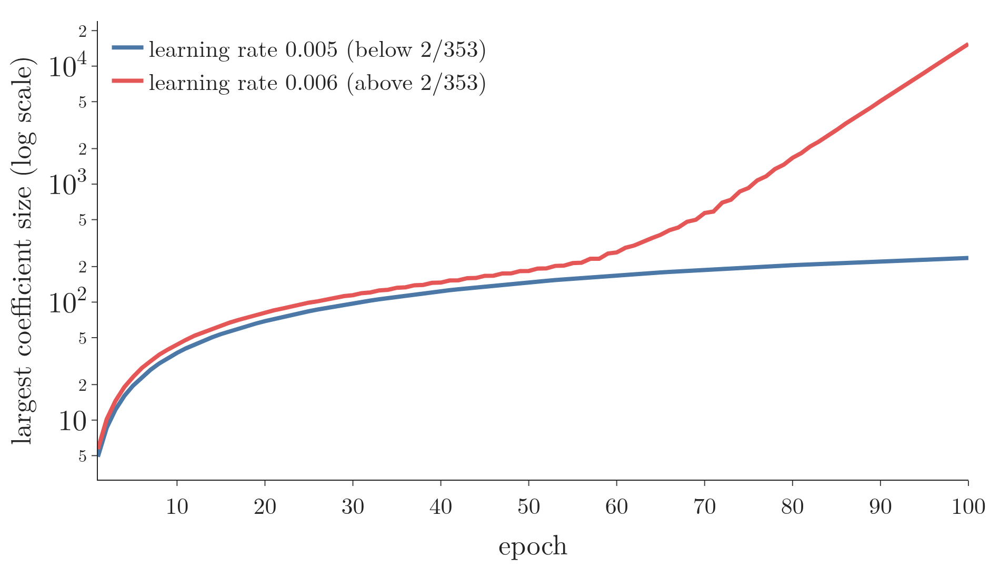

<!-- where-this-fits: generated by course_map/build_map.py; edit concepts.yaml, not this block -->
> **Where this fits:** Pipeline map step 8 (Model). See the [Course map](../01-course-map/note.md).
>
> 
>
> - **Builds on:** Standardization ([Note 24](../24-standardization/note.md)); Multiple linear regression ([Note 55](../55-multiple-lr-code/note.md)); Normal equation ([Note 55](../55-multiple-lr-code/note.md)); Gradient descent ([Note 57](../57-gradient-descent/note.md)); Bias-variance trade-off ([Note 62](../62-bias-variance/note.md)); Regularisation ([Note 63](../63-ridge-regression-intuition/note.md)).
> - **Leads to:** Elastic Net ([Note 69](../69-elastic-net/note.md)).
> - **Compare with:** Lasso regression ([Note 67](../67-lasso-regression/note.md)); L1 and L2 regularisation in neural networks ([Note 1026](../1026-regularization-in-dl/note.md)).
<!-- /where-this-fits -->

## 1. Overview

> **Key point:** Ridge can also be trained with gradient descent. The gradient is the linear regression gradient plus λw, so each step also pulls the coefficients a little towards 0.

The previous Note found the Ridge coefficients in one step with a formula. Like plain linear regression, **Ridge regression** (G-1691) can instead be trained with **gradient descent** (G-862): start somewhere, and repeatedly step downhill on the loss.

Here a **feature** (G-772) is an input variable (one column of the data table), an **observation** (G-1374) is one record (one row), and the **target** (G-1949) $y$ is the value we predict. Gradient descent is useful when there are many features, because the formula needs the inverse of a large matrix (the gradient descent Notes). This Note derives the Ridge gradient, codes it from scratch, and shows the scikit-learn options.

## 2. The gradient

> **Key point:** With a factor of ½ in the loss, the gradient is XᵀXw − Xᵀy + λw.

### 2.1 The loss with a factor of ½

> **Key point:** Multiplying the loss by ½ does not move its minimum; it only removes a 2 from the derivative.

The Ridge loss from the previous Note, multiplied by $\frac{1}{2}$:

$$L = \frac{1}{2}(Xw - y)^{\mathsf T}(Xw - y) + \frac{1}{2}\lambda\thinspace w^{\mathsf T}w$$

Halving every value of the loss leaves the lowest point at the same $w$. The ½ just makes the derivative tidier, as the 2 from differentiating a square cancels the $\frac{1}{2}$.

### 2.2 Expanding and differentiating

> **Key point:** The same expansion as the previous Note, then the same derivative rules.

Expanding the product as in the normal equation Note:

$$L = \frac{1}{2}\left(w^{\mathsf T}X^{\mathsf T}Xw - 2w^{\mathsf T}X^{\mathsf T}y + y^{\mathsf T}y\right) + \frac{1}{2}\lambda\thinspace w^{\mathsf T}w$$

Differentiating with respect to $w$:

$$\frac{\partial L}{\partial w} = X^{\mathsf T}Xw - X^{\mathsf T}y + \lambda w$$

The first two terms are the linear regression gradient. The Ridge penalty adds only $\lambda w$.

> **Extra:** Setting this gradient to zero gives $(X^{\mathsf T}X + \lambda I)w = X^{\mathsf T}y$, the formula of the previous Note. Gradient descent walks towards the same answer step by step instead of jumping to it.

### 2.3 The update rule

> **Key point:** New w = old w minus the learning rate times the gradient.

As in every gradient descent Note, all coefficients are updated together:

$$w_{\text{new}} = w_{\text{old}} - \eta\left(X^{\mathsf T}Xw_{\text{old}} - X^{\mathsf T}y + \lambda w_{\text{old}}\right)$$

where $\eta$ is the **learning rate** (G-1068). The first entry of $w$ is the intercept, which is not penalised. So, as before, the $\lambda w$ term uses $\lambda I w$ with the top-left entry of $I$ set to 0.

> **Extra:** Rearranging the update gives $w_{\text{new}} = (1 - \eta\lambda)\thinspace w_{\text{old}} - \eta\left(X^{\mathsf T}Xw_{\text{old}} - X^{\mathsf T}y\right)$. So every step first shrinks the coefficients by the factor $1 - \eta\lambda$, then takes the ordinary linear regression step. The per-step shrinking is why the L2 penalty is also called **weight decay** (G-2108), the name used for neural networks (ESL §3.4.1).

Figure 1 splits the first step of the one-feature example of Section 3 ($\lambda = 100$, $\eta = 0.005$) into its two parts. Watch the red arrow: the shrink halves the slope before the ordinary step is taken.

{height=38%}

## 3. Seeing the paths

> **Key point:** Gradient descent finds the bottom of whichever loss it is given. With λ = 100, the bottom sits at a smaller slope.

Figure 2 runs gradient descent on the one-feature example of the previous Notes for three values of λ, from the same start point ($m = -5$, $b = 20$, learning rate 0.005). The contours belong to the plain squared error, so only λ = 0 heads for their centre. Watch where each path stops: the larger λ, the closer to $m = 0$, and the flatter its line on the data (right).


With λ = 250 the path zig-zags across the valley: the penalty makes the bowl so steep in the $m$ direction that a step of 0.005 overshoots, and each overshoot is smaller than the last (the Extra in Section 4 gives the limit). Figure 3 draws the bowls themselves for λ = 0 and λ = 100 over 60 steps.

{height=52%}

- **λ = 0:** the path ends at $m = 27.8$, $b = -2.3$, the linear regression answer.
- **λ = 100:** the penalty moves the bottom of the bowl to $m = 12.9$, $b = -1.4$. These values are exactly the Ridge values from the formula in the previous Note.

The penalty makes the bowl steeper in the $m$ direction only: its curvature there, $\partial^2 L / \partial m^2 = \sum x_i^2 + \lambda$, grows from 87 to 187, while the $b$ direction is unchanged.

## 4. Code from scratch

> **Key point:** The loop computes the gradient with matrix products and updates all coefficients at once.

> **Python:** Ridge with batch gradient descent.
>
> ```python
> class MyRidgeGD:
>     def __init__(self, epochs, learning_rate, alpha):
>         self.epochs, self.lr, self.alpha = (epochs,
>             learning_rate, alpha)
>
>     def fit(self, X, y):
>         X = np.insert(X, 0, 1, axis=1)           # column of 1s
>         w = np.insert(np.ones(X.shape[1] - 1), 0, 0.0)
>         I = np.identity(X.shape[1])
>         I[0, 0] = 0                    # no penalty on intercept
>         for _ in range(self.epochs):
>             grad = X.T @ X @ w - X.T @ y + self.alpha * I @ w
>             w = w - self.lr * grad
>         self.intercept_, self.coef_ = w[0], w[1:]
>         return self
>
>     def predict(self, X):
>         return X @ self.coef_ + self.intercept_
> ```

On the diabetes data (test size 0.2, random state 4) with alpha 0.001, learning rate 0.005 and 500 epochs, test R² is 0.474 and the intercept 150.87.

> **Extra:** This gradient adds up the errors of all observations instead of averaging them, so its size grows with the number of observations. The summed gradient is why the learning rate must be tiny here. The maths: write $H = X^{\mathsf T}X + \lambda I$ and $w^\ast$ for the exact answer. One update turns the error $w - w^\ast$ into $(I - \eta H)(w - w^\ast)$. Along each eigenvector of $H$ with eigenvalue $h$, the error is multiplied by $1 - \eta h$ every step, so it shrinks only if $\eta < 2/h$ for the largest $h$. On this training set (353 observations) the largest eigenvalue is 353, so the limit is $\eta < 2/353 = 0.0057$. 0.005 is just below it; 0.006 is just above it, and the steps overshoot and grow: after 100 epochs the largest coefficient is about 15,000.

Figure 4 runs the code above at both learning rates. For about 50 epochs the two runs look alike; then the run with 0.006 bends upwards, because the overshoot along the steepest direction is multiplied by $\lvert 1 - 0.006 \times 353 \rvert = 1.12$ every step and finally dominates.



## 5. Gradient descent stops early

> **Key point:** Stopping gradient descent early keeps the coefficients small, so **early stopping** (G-656) is a regulariser of its own, much like the ridge penalty.

Think of pouring water into an ice-cube tray: stop pouring early and every cube is only partly full. Gradient descent starts with small coefficients and fills them up step by step; stopping early leaves the slow ones small.

### 5.1 Early stopping rescues an overfitting model

> **Key point:** On data where linear regression overfits badly, stopping early helps about as much as the ridge penalty.

We give the model 65 features (the 10 diabetes measurements plus their squares and pairwise products) and train on 200 patients, as in the [batch gradient descent Note](../58-batch-gradient-descent/note.md) (section five). With so many features for so few observations, plain least squares has high variance, the case where shrinkage helps (ISL §6.2.1). Averaged over 50 random splits, test R² is:

| Model | Test R² |
|---|---|
| Linear regression (no regularisation) | 0.06 |
| Ridge, alpha chosen by cross-validation on the training data | 0.44 |
| Gradient descent without a penalty, stopped early | 0.40 |

Both regularisers rescue the badly overfitting linear regression, and by a similar amount. For a linear model, stopping early and adding the ridge penalty are close cousins (Goodfellow et al. §7.8).

> **Extra:** In the 65-feature experiment both models use standardised features. The stopping epoch is chosen on a validation part of the training data, and ridge's alpha by cross-validation on the training data, so the test data is used only once. Early stopping is one of the most common regularisers in deep learning (Goodfellow et al. §7.8).

### 5.2 Why the slow directions stay small

> **Key point:** Gradient descent creeps along flat directions of the loss bowl, so after a few hundred steps the coefficients in those directions are still small.

Back on the 10 diabetes features (353 training observations), the exact Ridge answer from the previous Note scores test R² 0.463. Figure 5 tracks gradient descent for up to a million epochs.

{height=42%}

| Epochs | Test R² | Largest gap from the exact coefficients |
|---|---|---|
| 100 | 0.390 | 897 |
| 500 | 0.474 | 823 |
| 50,000 | 0.464 | 104 |
| 1,000,000 | 0.463 | 0.0 |

- **Left:** test R² rises, peaks around 500 epochs, then settles at the exact answer's 0.463.
- **Right:** the coefficients need about a million epochs to reach the exact values.

The slow direction comes from s1 and s2, which are strongly correlated (the [first Ridge Note](../63-ridge-regression-intuition/note.md)). The bowl is almost flat along "raise s2, lower s1", so gradient descent creeps along it, and stopping early leaves the coefficients in that direction smaller (Goodfellow et al. §7.8). With 353 observations least squares barely overfits (the first Ridge Note), so on this data the size of the test-R² change says little; the 65-feature experiment above is the real test.

> **Extra:** The numbers behind this. Along an eigenvector of $H = X^{\mathsf T}X + \lambda I$ with eigenvalue $h$, the error shrinks by $1 - \eta h$ per step, so it needs about $1/(\eta h)$ steps. The smallest eigenvalue here is 0.0083, giving about $1/(0.005 \times 0.0083) \approx 24{,}000$ steps, and its eigenvector is mostly s1 ($-0.71$) and s2 ($+0.55$). After 500 epochs, almost the whole gap from the exact answer (1,146 of it) lies along this one direction, and the coefficient vector is about half as long as the exact one (774 against 1,455).

## 6. Ridge with gradient descent in scikit-learn

> **Key point:** Use SGDRegressor with penalty="l2", or Ridge with an iterative solver.

> **Python:** Two scikit-learn options.
>
> ```python
> from sklearn.linear_model import SGDRegressor, Ridge
>
> sgd = SGDRegressor(penalty="l2", alpha=0.001, max_iter=500,
>                    eta0=0.1, learning_rate="constant",
>                    random_state=0)
> sgd.fit(X_train, y_train)
> sgd.score(X_test, y_test)          # R² 0.450
>
> ridge = Ridge(alpha=0.001, max_iter=500, solver="sparse_cg")
> ridge.fit(X_train, y_train)
> ridge.score(X_test, y_test)        # R² 0.463
> ```

- **SGDRegressor** (G-1783; the stochastic gradient descent Note) adds the Ridge penalty with `penalty="l2"`. Its `alpha` is the penalty strength.
- **Ridge** has a `solver` (G-1836) setting. `"cholesky"` and `"svd"` use the formula directly. `"sparse_cg"`, `"lsqr"`, `"sag"` and `"saga"` reach the answer step by step, and `max_iter` limits the steps.

`Ridge` has no learning-rate setting at all, even with an iterative solver (scikit-learn docs, `Ridge`). Here `sparse_cg` reaches the exact answer, 0.463.

> **Extra:** `SGDRegressor` averages the loss over the observations, while `Ridge` adds it up. The `SGDRegressor` objective is (scikit-learn user guide §1.5.8) $\frac{1}{n}\sum \frac{1}{2}(y_i - \hat y_i)^2 + \alpha \cdot \frac{1}{2}\lVert w \rVert^2$. Multiplying by $2n$ gives $\sum (y_i - \hat y_i)^2 + n\alpha \lVert w \rVert^2$, the `Ridge` loss with alpha $n\alpha$. So the same `alpha` means a stronger penalty in `SGDRegressor`: its `alpha` equals `Ridge`'s `alpha` divided by the number of observations. With 353 training observations, `SGDRegressor(alpha=0.001)` matches `Ridge(alpha=0.353)`: run long, its coefficients land within 3 of that model's, but up to 840 away from `Ridge(alpha=0.001)`.

Figure 6 shows the three sets of coefficients side by side. The orange bars of `SGDRegressor(alpha=0.001)` sit on the blue bars of `Ridge(alpha=0.353)`, not on the grey bars of `Ridge(alpha=0.001)`; the biggest gap is in s1.


## 7. Summary

| Method | How it finds w | Test R² here |
|---|---|---|
| Formula (`Ridge`, cholesky) | one step, $(X^{\mathsf T}X + \lambda I)^{-1}X^{\mathsf T}y$ | 0.463 |
| `Ridge`, sparse_cg | iterative solver | 0.463 |
| MyRidgeGD, 500 epochs | batch gradient descent, stopped early | 0.474 |
| `SGDRegressor`, l2 | stochastic gradient descent | 0.450 |

- The Ridge gradient is $X^{\mathsf T}Xw - X^{\mathsf T}y + \lambda w$: the linear regression gradient plus $\lambda w$.
- Each update shrinks the coefficients by $1 - \eta\lambda$ first, hence the name weight decay.
- The intercept is left out of the penalty.
- Stopping gradient descent early also regularises: with many features for few observations it rescues an overfitting fit about as well as ridge.
- In scikit-learn: `SGDRegressor(penalty="l2")` or `Ridge` with an iterative solver.

## 8. Sources

**Built from**

- CampusX, "Ridge Regression Part 3 | Gradient Descent | Regularized Linear Models", YouTube, https://www.youtube.com/watch?v=Fci_wwMp8G8

**Other references**

- **ESL:** Hastie, T., Tibshirani, R. and Friedman, J. *The Elements of Statistical Learning*, 2nd ed. Springer, 2009. Section 3.4.1, p. 63.
- **Goodfellow et al.:** Goodfellow, I., Bengio, Y. and Courville, A. *Deep Learning*. MIT Press, 2016. Section 7.8, "Early Stopping".
- **scikit-learn docs:** `sklearn.linear_model.Ridge`; user guide Section 1.5.8, "Mathematical formulation" (SGD), scikit-learn 1.9.
- **ISL:** James, G., Witten, D., Hastie, T. and Tibshirani, R. *An Introduction to Statistical Learning*, 2nd ed. Springer, 2021. Section 6.2.1, p. 241.

## 9. Key terms

| Term | Meaning |
|---|---|
| Weight decay | Another name for the L2 penalty: each gradient step shrinks the coefficients by a fixed factor |
| Solver | The method a scikit-learn model uses to find its coefficients |
| penalty | SGDRegressor setting that adds a regularisation penalty, such as "l2" for Ridge |
