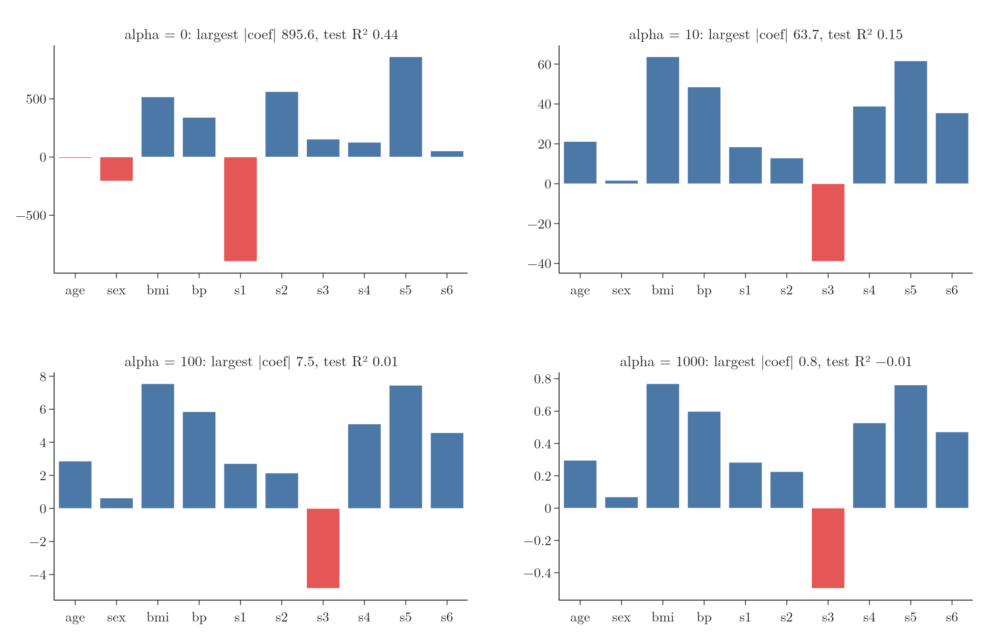
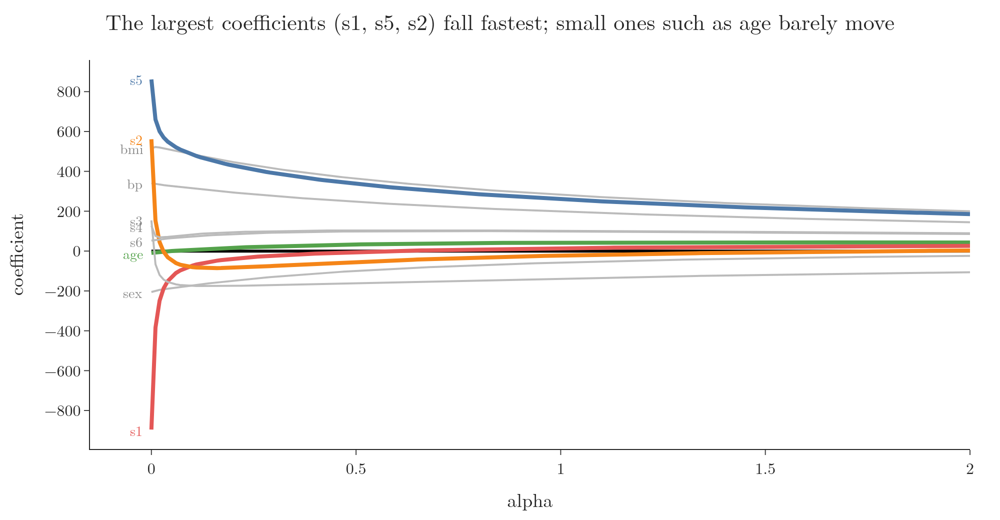
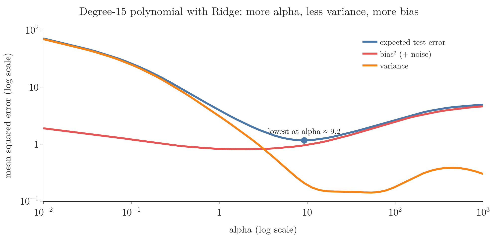
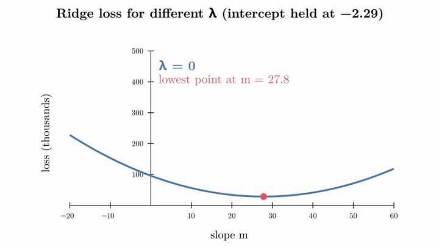
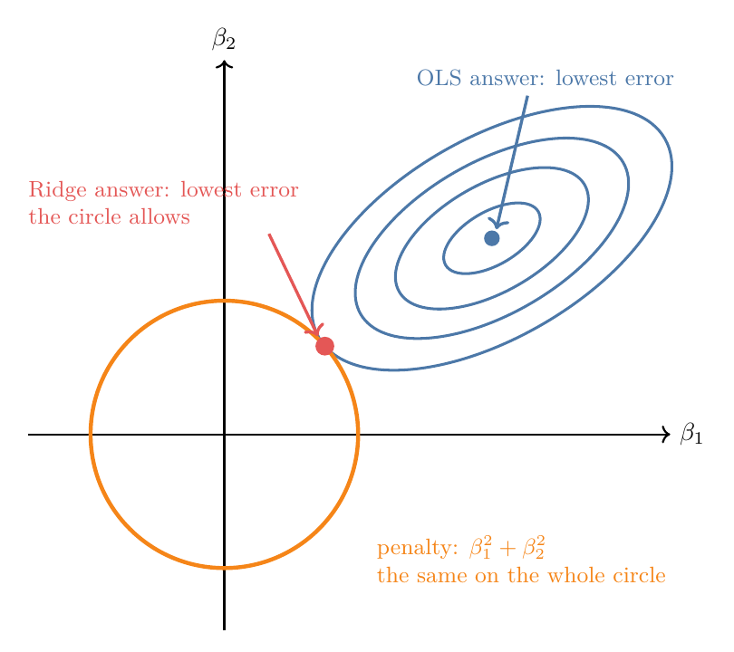
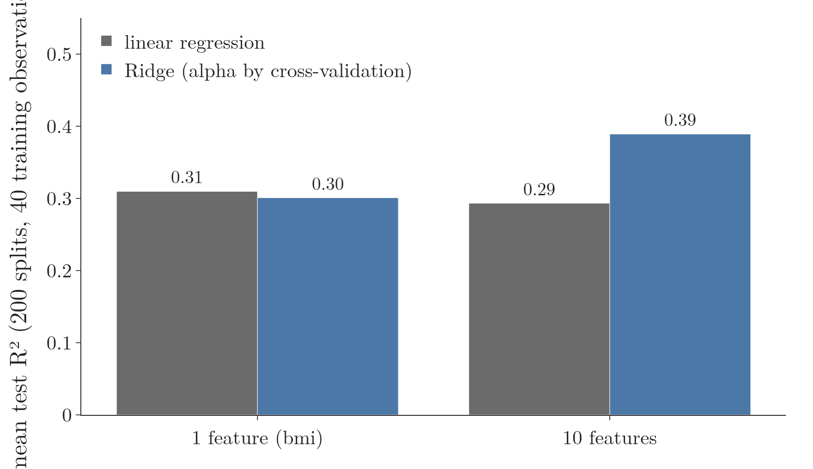

<!-- where-this-fits: generated by course_map/build_map.py; edit concepts.yaml, not this block -->
> **Where this fits:** Pipeline map step 8 (Model). See the [Course map](../01-course-map/note.md).
>
> 
>
> - **Builds on:** Standardization ([Note 9](../09-mldlc/note.md)); Multiple linear regression ([Note 53](../53-multiple-linear-regression/note.md)); Normal equation ([Note 54](../54-multiple-lr-maths/note.md)); Gradient descent ([Note 57](../57-gradient-descent/note.md)); Bias-variance trade-off ([Note 62](../62-bias-variance/note.md)); Regularisation ([Note 63](../63-ridge-regression-intuition/note.md)).
> - **Leads to:** Elastic Net ([Note 69](../69-elastic-net/note.md)).
> - **Compare with:** Lasso regression ([Note 67](../67-lasso-regression/note.md)); L1 and L2 regularisation in neural networks ([Note 1026](../1026-regularization-in-dl/note.md)).
<!-- /where-this-fits -->

## 1. Overview

> **Key point:** Five facts sum up Ridge. Coefficients shrink but never reach 0. The largest shrink most. Bias rises and variance falls with λ. The loss curve's lowest point slides towards 0. Ridge helps most with many or correlated features, or with few observations.

The last three Notes built **Ridge regression** (G-1691): the idea, the formulas, and gradient descent. This Note collects the five points that are easiest to mix up afterwards. The five points are also common interview questions.

| # | Question | Short answer |
|---|---|---|
| 1 | What happens to the coefficients as λ grows? | they shrink towards 0, but never reach it |
| 2 | Which coefficients are affected most? | the largest ones |
| 3 | What happens to bias and variance? | bias rises, variance falls |
| 4 | What happens to the loss function? | its lowest point moves towards 0 |
| 5 | When should Ridge be used? | when least squares is unstable: many or correlated features, or few observations |

A **feature** (G-772) is an input variable (one column of the data table), an **observation** (G-1374) is one record (one row), and the **target** (G-1949) is the value we predict. All diabetes examples below use test size 0.2 and random state 2.

## 2. Point 1: coefficients shrink but never reach 0

> **Key point:** As λ grows from 0 towards infinity, the coefficients end up close to 0. Ridge does not set any of them to exactly 0.

$\lambda$ can be any number from 0 upwards. At $\lambda = 0$ there is no penalty, so Ridge is plain linear regression. Figure 1 trains Ridge on the diabetes data for four values of alpha (scikit-learn's name for $\lambda$).

{height=50%}

| alpha | Largest coefficient (size) | Test R² |
|---|---|---|
| 0 | 895.6 | 0.44 |
| 0.1 | 485.5 | 0.45 |
| 10 | 63.7 | 0.15 |
| 100 | 7.5 | 0.01 |
| 1000 | 0.8 | $-0.01$ |
| 10,000 | 0.08 | $-0.01$ |

A small alpha (0.1) shrinks the coefficients and nudges test R² up; the larger alphas in the table are there to show shrinkage, and they underfit (Point 3). From alpha 10 on, each tenfold increase makes the coefficients about ten times smaller. Once $\lambda$ is much bigger than the numbers in $X^{\mathsf T}X$ (its largest eigenvalue is about 3 here), the Ridge answer $(X^{\mathsf T}X + \lambda I)^{-1}X^{\mathsf T}y$ is almost $X^{\mathsf T}y / \lambda$: ten times the $\lambda$, a tenth of the coefficients. But even at alpha 10,000, every coefficient is still a small non-zero number. Ridge shrinks coefficients towards 0 but does not set any of them exactly to 0 (ISL §6.2.2). On the way, a coefficient can cross 0 when it changes sign, as s1 and s2 do in the next table, but it does not stay there.

The reason is the slope formula from the Ridge maths Note: $m = \frac{\text{top}}{\text{bottom} + \lambda}$. Adding $\lambda$ to the bottom makes the fraction smaller, but a fraction with a non-zero top never becomes 0.

> **Extra:** Never reaching 0 is the key difference from **Lasso** (G-1047; the next Note), which can set coefficients exactly to 0 and so removes features from the model.

## 3. Point 2: the largest coefficients shrink most

> **Key point:** A large coefficient falls quickly as λ grows; a small one hardly changes.

Figure 2 follows each diabetes coefficient as alpha goes from 0 to 2: its **coefficient path** (G-409).

{height=45%}

| Feature | alpha 0 | alpha 0.01 | alpha 0.1 | alpha 1 |
|---|---|---|---|---|
| s1 | $-895.6$ | $-383.7$ | $-72.9$ | 14.4 |
| s5 | 861.1 | 659.9 | 484.4 | 260.1 |
| s2 | 561.2 | 152.7 | $-80.6$ | $-22.6$ |
| age | $-9.2$ | $-6.4$ | 6.6 | 42.2 |

- **s1, s5 and s2**, the largest, drop steeply even for alpha 0.01.
- **age**, the smallest, barely moves at first.

The penalty is $\lambda\sum\beta_j^2$, and the square grows fast: a coefficient of 900 adds $810{,}000\lambda$ to the loss, while one of 9 adds only $81\lambda$. So reducing the big coefficients lowers the loss far more, and that is where Ridge cuts first.

> **Extra:** A small coefficient can even grow for a while, as age does here (from $-9$ to 42 at alpha 1). The intuition: s1, s2 and s5 had huge opposing coefficients, and as Ridge cuts them back, part of their effect moves to other features that are mildly correlated with them, age among them ($r$ about 0.3). A quick check agrees: dropping s1, s2 and s5 altogether moves the plain linear regression coefficient of age from $-9$ to $+34$. Once alpha is large enough, all coefficients head to 0 together.

## 4. Point 3: bias rises, variance falls

> **Key point:** A small λ gives low bias and high variance (overfitting); a large λ gives high bias and low variance (underfitting). The best λ is in between.

Recall the bias-variance Note: **bias** (G-287) is error from a model too simple to follow the pattern, and **variance** is how much the model changes from one training sample to another. Think of a dartboard: bias is how far the average throw lands from the bullseye, variance is how scattered the throws are.

Measuring bias needs the true curve, so here we use made-up data where we know it: $y = 0.7x^2 - 2x + 3$ plus noise (standard deviation 2). We fit a degree-15 polynomial with Ridge to 15 training observations, then repeat with fresh noise 300 times. Bias² compares the average fitted curve with the true curve; variance measures how much the 300 fits spread around their average. Both are measured at 14 test points between the training ones.

{height=45%}

| alpha | Bias² | Variance | Expected test error |
|---|---|---|---|
| 0.0001 | 0.004 | 2.91 | 6.91 |
| 0.01 | 0.004 | 1.58 | 5.58 |
| 1 | 0.09 | 0.82 | 4.91 |
| 10 | 1.43 | 0.48 | 5.90 |
| 100 | 4.17 | 0.31 | 8.48 |
| 1000 | 5.05 | 0.26 | 9.31 |

- **Small alpha:** the flexible curve bends with each noisy sample, so the variance is high: **overfitting** (G-1429).
- **Large alpha:** the coefficients are squeezed so hard that the curve is too stiff, and bias takes over: **underfitting** (G-2035).
- **In between** (here about alpha 1): the total error is smallest.

So, as in the bias-variance Note, λ moves a model along the **bias-variance trade-off** (G-288; ISL §6.2.1). Choose λ where variance has fallen a lot but bias has not yet risen much.

> **Extra:** Expected test error = bias² + variance + noise (ISL §2.2.2, eq. 2.7), and the noise part is $2^2 = 4$ here, the floor no model can beat. The `mlxtend` library's `bias_variance_decomp` function does this repeated-fit calculation for any scikit-learn model. The features are standardised after `PolynomialFeatures`, as the Ridge intuition Note advises. The training $x$ values are fixed and only the noise is redrawn, so every fit covers the same range; test points sit between training points, so no fit has to extrapolate.

## 5. Point 4: the loss curve rises and its lowest point moves to 0

> **Key point:** Adding λm² lifts the loss most where m is large, so the bottom of the curve slides towards m = 0.

To see this in one picture, take the one-feature example and hold the intercept at $-2.29$, its linear regression value. Then the loss depends only on the slope $m$:

$$L(m) = \sum_{i=1}^{n}(y_i - m x_i + 2.29)^2 + \lambda m^2$$

Build the curve one point at a time for $\lambda = 50$. For each slope, compute the squared error, add the penalty $50m^2$, and plot the sum:

| Slope $m$ | Squared error | Penalty $50m^2$ | Loss (sum) |
|---|---|---|---|
| 10 | 56,053 | 5,000 | 61,053 |
| 17.7 | 37,285 | 15,664 | **52,950** |
| 27.8 | 28,342 | 38,642 | 66,984 |

The squared error alone is lowest at 27.8, the linear regression slope. But there the penalty is large, 38,642. At 17.7 the squared error is higher, yet the penalty is so much smaller that the sum is the lowest of all. The penalty has moved the lowest point from 27.8 to 17.7 (StatQuest, "Ridge vs Lasso Regression, Visualized!!!", builds the curve the same way).

Figure 4 draws this curve while $\lambda$ grows from 0 to 100.

{height=50%}

| λ | Slope at the lowest point |
|---|---|
| 0 | 27.8 |
| 10 | 25.0 |
| 50 | 17.7 |
| 100 | 13.0 |

The added term $\lambda m^2$ is 0 at $m = 0$ and grows fast away from it. So the curve rises and narrows, more on the far side from 0, and its lowest point moves towards $m = 0$. Whatever method finds that lowest point (the formula or gradient descent) therefore returns a smaller slope.

### 5.1 With two coefficients: why "Ridge"?

> **Key point:** With two coefficients, the answer lies where the error contours first touch a circle around the origin.

With two coefficients $\beta_1$ and $\beta_2$, the loss has two parts: the squared error and the penalty $\lambda(\beta_1^2 + \beta_2^2)$. The squared error alone is lowest at the OLS answer; its contours are ellipses around it (Figure 5).

{height=42%}

The penalty is the same at every point of a circle around the origin. Ridge looks for the point with the lowest squared error for a given penalty: the point where the ellipses first touch the circle. The touching point is always closer to the origin than the OLS answer, so both coefficients are smaller.

A larger λ means a smaller circle. Seeing Ridge as a hard limit on the coefficients is the **constrained form** (G-454) of the problem; the details come in a later Note.

> **Extra:** The answer to "why is it called Ridge?" is often given with this picture: the solution always lies on the edge of the circle. Historically, the name comes from older work: Hoerl had used *ridge analysis* to study curved response surfaces, and the Ridge formula looked mathematically similar, so the method was labelled "ridge regression" (Hoerl and Kennard 1970, §2).

## 6. Point 5: use Ridge where least squares is unstable

> **Key point:** Ridge helps when the least-squares coefficients change a lot from sample to sample. That happens with many features, with correlated features, and with very few observations. With one feature and plenty of data there is little to gain.

Regularisation fights overfitting, and Ridge works best where the least-squares coefficients have high variance (ISL §6.2.1). Three situations cause it:

- **Many features for the number of observations.** Each extra coefficient is one more thing to estimate from the same data.
- **Correlated features.** A large positive coefficient on one can cancel a large negative one on its partner, like the s1 ($-896$) and s2 ($+561$) pair above; Ridge's size limit stops this (ESL §3.4.1).
- **Very few observations,** even with one feature. The two-point line of the [Ridge intuition Note](../63-ridge-regression-intuition/note.md) is this case: its slope swings widely from sample to sample.

A common rule of thumb is "use Ridge with 2 or more features". The rule covers the first two situations, which are the usual ones in practice.

Figure 6 tests the point on the diabetes data with only 40 training observations, averaged over 200 random splits, with alpha chosen by cross-validation on the training part. With bmi as the only feature, Ridge scores 0.30 against 0.31 for linear regression: nothing to gain, because 40 observations pin down one slope well. With all 10 features, linear regression drops to 0.29 and Ridge lifts it to 0.39.

The third situation shows up when the same one-feature test is run with only 3 training observations. Both models are then poor, but linear regression is far worse: its mean test R² is $-3.44$ against $-1.79$ for Ridge (script `one_vs_many.py`). From about 6 observations on, the gain is gone.

## 7. Summary

| # | Point |
|---|---|
| 1 | As λ grows, the coefficients end up near 0, but Ridge does not set any to exactly 0 |
| 2 | The largest coefficients shrink fastest; small ones barely change at first |
| 3 | Larger λ: higher bias, lower variance. Pick λ in between |
| 4 | The loss curve rises and its lowest point slides towards 0 |
| 5 | Use Ridge where least squares is unstable: many or correlated features, or very few observations |

Ridge never sets a coefficient to exactly 0. Lasso, the [next Note](../67-lasso-regression/note.md), does: its penalty puts a sharp corner in the loss curve at 0.

## 8. Sources

**Built from**

- CampusX, "5 Key Points - Ridge Regression | Part 4 | Regularized Linear Models", YouTube, https://www.youtube.com/watch?v=8osKeShYVRQ
- StatQuest with Josh Starmer, "Ridge vs Lasso Regression, Visualized!!!", YouTube, https://www.youtube.com/watch?v=Xm2C_gTAl8c. Building the penalised loss curve point by point (Section 5).

**Other references**

- **ISL:** James, G., Witten, D., Hastie, T. and Tibshirani, R. *An Introduction to Statistical Learning*, 2nd ed. Springer, 2021. Section 2.2.2, p. 34; Sections 6.2.1–6.2.2, pp. 240–241.
- **ESL:** Hastie, T., Tibshirani, R. and Friedman, J. *The Elements of Statistical Learning*, 2nd ed. Springer, 2009. Section 3.4.1, p. 63.
- **Hoerl and Kennard 1970:** Hoerl, A. E. and Kennard, R. W. "Ridge Regression: Biased Estimation for Nonorthogonal Problems." *Technometrics* 12(1), 55–67, 1970. Section 2.

## 9. Key terms

| Term | Meaning |
|---|---|
| Coefficient path | How each coefficient changes as the regularisation strength grows |
| Constrained form | Writing regularisation as a hard limit on the size of the coefficients |
