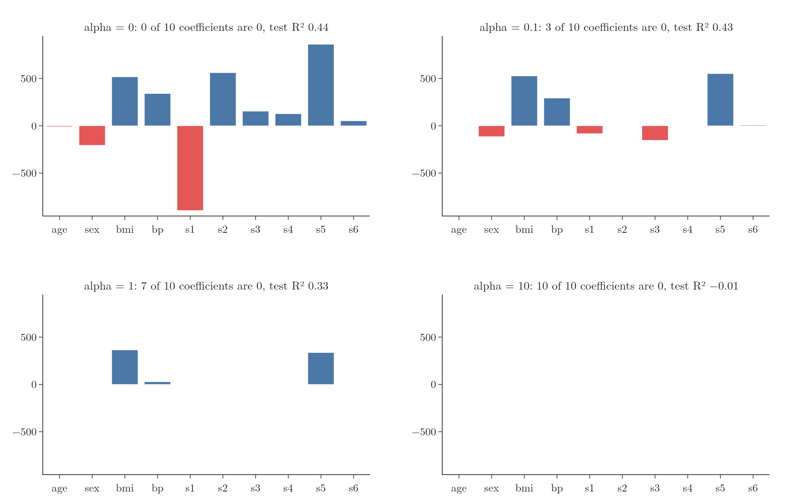
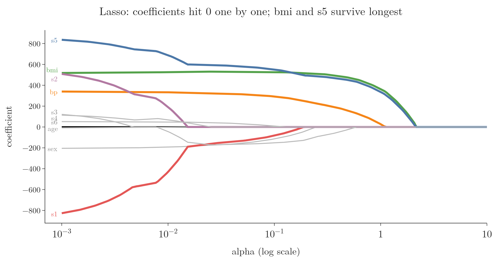
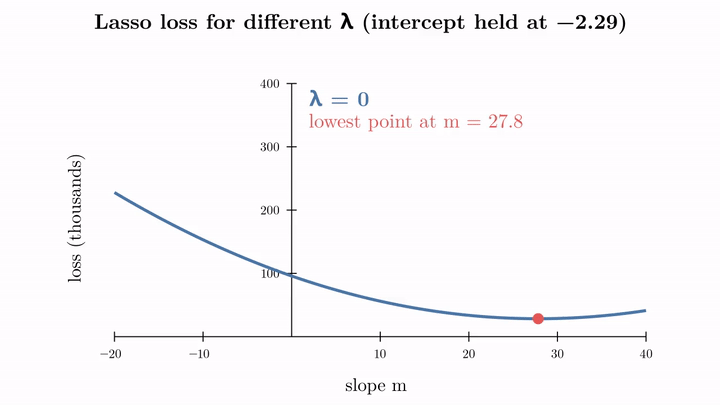

<!-- where-this-fits: generated by course_map/build_map.py; edit concepts.yaml, not this block -->
> **Where this fits:** Pipeline map step 8 (Model). See the [Course map](../01-course-map/note.md).
>
> 
>
> - **Builds on:** Regularisation ([Note 63](../63-ridge-regression-intuition/note.md)).
> - **Leads to:** Elastic Net ([Note 69](../69-elastic-net/note.md)).
> - **Compare with:** Ridge regression ([Note 66](../66-ridge-key-points/note.md)).
<!-- /where-this-fits -->

## 1. Overview

> **Key point:** Lasso is Ridge with the squares in the penalty replaced by absolute values. That one change lets it push coefficients to exactly 0, so it also removes useless inputs: automatic feature selection.

**Lasso regression** is the second regularised version of linear regression. It is also called **L1 regularisation**. Like Ridge, it adds a penalty to the usual squared error, but the penalty uses the absolute size of each coefficient:

$$L = \sum_{i=1}^{n}(y_i - \hat{y}_i)^2 + \lambda\sum_{j=1}^{m}|\beta_j|$$

| | Ridge | Lasso |
|---|---|---|
| Penalty | $\lambda \sum \beta_j^2$ | $\lambda \sum |\beta_j|$ |
| Also called | L2 regularisation | L1 regularisation |
| Coefficients for large λ | close to 0, never exactly 0 | exactly 0 |

LASSO stands for "least absolute shrinkage and selection operator". As with Ridge, $\lambda \geq 0$: with $\lambda = 0$ Lasso is plain linear regression, a small $\lambda$ may overfit, and a large one underfits. The intercept is not penalised.

This Note shows what Lasso does with one input, with a flexible polynomial, and with the 10-input diabetes data, and why its coefficients can reach exactly 0.

## 2. One input: the slope reaches exactly 0

> **Key point:** As alpha grows, the Lasso slope falls in a straight line and stops at exactly 0.

Figure 1 fits Lasso to the 100-point example of the Ridge Notes. scikit-learn calls the penalty strength `alpha`.

{height=45%}

| alpha | Slope | Intercept |
|---|---|---|
| 0 (linear regression) | 27.83 | $-2.29$ |
| 5 | 22.07 | $-1.96$ |
| 10 | 16.31 | $-1.62$ |
| 20 | 4.80 | $-0.95$ |
| 25 and above | 0 | $-0.67$ |

From alpha 24.17 on, the slope is exactly 0. The line is then flat at the average of $y$ ($-0.67$): the input no longer plays any part. With Ridge, the slope only approached 0 (the Ridge maths Note).

> **Extra:** scikit-learn's `Lasso` minimises $\frac{1}{2n}\sum(y_i - \hat{y}_i)^2 + \alpha\sum|\beta_j|$: it averages the squared error and halves it. So its `alpha` is on a different scale from the $\lambda$ of the formula above, and from `Ridge`'s `alpha`. The values of alpha for Ridge and Lasso cannot be compared directly.

## 3. A flexible model: Lasso picks the right terms

> **Key point:** On a degree-16 polynomial, a moderate alpha set 14 of the 16 coefficients to 0 and kept exactly x and x², the true shape of the data.

Figure 2 fits a degree-16 polynomial to 100 points made from $y = 0.7x^2 - 2x + 3$ plus noise. The 16 power columns ($x$ to $x^{16}$) are standardised first.

{height=45%}

- **alpha 0** (red): all 16 coefficients are used, and the curve wiggles to follow the noise, swinging up at the right edge: overfitting.
- **alpha 0.1** (green): only 2 coefficients are non-zero, those of $x$ and $x^2$. The curve is a smooth parabola, the true shape.
- **alpha 2** (blue): every coefficient is 0, and the model predicts the average everywhere: underfitting.

| alpha | Non-zero coefficients |
|---|---|
| 0.01 | $x$, $x^2$, $x^3$, $x^{16}$ |
| 0.1 | $x$, $x^2$ |
| 1 | $x$ |

Lasso found which of the 16 columns matter without being told.

## 4. Feature selection

> **Key point:** Coefficients that reach 0 remove their inputs from the model. So Lasso selects features while it trains.

A coefficient of exactly 0 means that input has no effect on the predictions, so the column can be dropped. This makes Lasso a tool for feature selection (see the [feature engineering Note](../23-what-is-feature-engineering/note.md)), useful when there are many columns and some of them do not matter.

Figure 3 trains Lasso on the 10-input diabetes data (test size 0.2, random state 2).

{height=50%}

| alpha | Coefficients at 0 | Inputs kept | Test R² |
|---|---|---|---|
| 0 | 0 | all 10 | 0.44 |
| 0.1 | 3 | 7 (age, s2, s4 dropped) | 0.43 |
| 1 | 7 | bmi, bp, s5 | 0.33 |
| 10 | 10 | none | $-0.01$ |

At alpha 0.1, Lasso drops three inputs and loses almost no accuracy (0.43 against 0.44). At alpha 1, it keeps only bmi, bp and s5, the three most useful inputs here. At alpha 10, it removes everything: underfitting.

Ridge cannot do this. It shrinks an unhelpful coefficient to, say, 0.2, but the column stays in the model.

> **Extra:** This is why Lasso is often preferred when the data has many columns, some of which are probably irrelevant. Fewer columns also means a simpler model that is faster to use and easier to explain.

## 5. How the coefficients change

> **Key point:** The coefficients hit 0 one at a time. Small ones go first; the strongest inputs survive longest.

Figure 4 follows each coefficient as alpha grows on a log scale.

{height=45%}

| Input | Coefficient at alpha 0 | Exactly 0 from alpha about |
|---|---|---|
| age | $-9$ | 0.012 |
| s2 | 561 | 0.015 |
| s4 | 127 | 0.026 |
| s1 | $-896$ | 0.20 |
| bp | 341 | 1.1 |
| bmi, s5 | 517, 861 | 2.2 |

- As with Ridge, the very large coefficients (s1, s2, s5) are cut back hard at first, which removes most of the overfitting.
- Then the coefficients drop to 0 one after another. bmi and s5 are the last to go.
- s1 and s2 had huge coefficients only because they are correlated with other inputs. Lasso drops them early anyway: size alone does not protect a coefficient.

## 6. Bias and variance

> **Key point:** As with Ridge, a larger alpha raises bias and lowers variance. The best alpha is in between.

Using the same bootstrap method as the Ridge key points Note on the degree-16 polynomial (80 training points, 20 test points, 200 resamples):

| alpha | Bias² (+ noise) | Variance | Expected test error |
|---|---|---|---|
| 0.001 | 1.45 | 37.34 | 38.79 |
| 0.01 | 0.74 | 1.24 | 1.98 |
| 0.1 | 0.80 | 0.06 | 0.86 |
| 1 | 2.77 | 0.07 | 2.84 |
| 3 | 5.38 | 0.07 | 5.45 |

Small alpha: huge variance (overfitting). Large alpha: high bias (underfitting). Here alpha 0.1, the value that kept only $x$ and $x^2$, has the lowest total error.

## 7. Why coefficients reach exactly 0

> **Key point:** The penalty λ|m| makes a sharp corner in the loss at m = 0. Once λ is large enough, that corner is the lowest point, and it stays there however large λ gets.

Take the one-input example again and hold the intercept at $-2.29$, so the loss depends only on the slope:

$$L(m) = \sum_{i=1}^{n}(y_i - m x_i + 2.29)^2 + \lambda|m|$$

Figure 5 draws this curve while $\lambda$ grows from 0 to 8,000.

{height=50%}

| λ | Slope at the lowest point |
|---|---|
| 0 | 27.8 |
| 2,000 | 16.4 |
| 5,000 | 0 |
| 8,000 | 0 |

- The penalty $\lambda|m|$ is a V shape: it is 0 at $m = 0$ and grows at the same rate on both sides. Added to the smooth bowl, it gives the curve a sharp corner at $m = 0$.
- As $\lambda$ grows, the lowest point moves left towards 0, as with Ridge.
- Once $\lambda$ passes about 4,850 here, the corner itself is the lowest point. From then on the answer is exactly $m = 0$, and a larger $\lambda$ only makes the corner steeper.

The Ridge penalty $\lambda m^2$ is smooth and flat at $m = 0$, with no corner, so its lowest point only approaches 0 (the Ridge key points Note). The next Note derives this precisely.

> **Extra:** Why do the two penalties behave so differently near 0? For a coefficient of 0.1, the Ridge penalty is $\lambda \times 0.01$, almost nothing, so Ridge has little reason to push it further. The Lasso penalty is $\lambda \times 0.1$, and it keeps pushing with the same force all the way to 0.

## 8. Ridge or Lasso?

> **Key point:** Many inputs, some probably useless: Lasso. Most inputs useful, especially correlated ones: Ridge.

| | Ridge | Lasso |
|---|---|---|
| Penalty | squares, $\lambda\sum\beta_j^2$ | absolute values, $\lambda\sum|\beta_j|$ |
| Coefficients | shrink, never exactly 0 | shrink, many become exactly 0 |
| Feature selection | no | yes |
| Best when | most inputs matter | only some inputs matter |
| Closed-form formula | yes | no (solved step by step) |

Both shrink the largest coefficients, raise bias, lower variance and are tuned through $\lambda$. The difference that matters in practice is that Lasso can remove inputs. Elastic Net (a later Note) combines both penalties.

> **Python:** Lasso in scikit-learn.
>
> ```python
> from sklearn.linear_model import Lasso
>
> lasso = Lasso(alpha=0.1)
> lasso.fit(X_train, y_train)
> lasso.coef_                     # several exactly 0
> lasso.score(X_test, y_test)     # R² 0.43 on the diabetes split
> ```
>
> As with Ridge, inputs should be on the same scale first, for example with `make_pipeline(StandardScaler(), Lasso(alpha=0.1))`.

## 9. Summary

- Lasso adds $\lambda\sum|\beta_j|$ to the squared error: L1 regularisation.
- As λ grows, coefficients shrink and then become exactly 0, one by one.
- Zero coefficients remove inputs: Lasso performs feature selection (diabetes: alpha 1 keeps bmi, bp and s5; the polynomial: alpha 0.1 keeps $x$ and $x^2$).
- A larger λ means more bias and less variance; too large removes every input.
- The absolute value makes a corner at 0 in the loss, which is why the answer can sit exactly at 0.

## 10. Key terms

| Term | Meaning |
|---|---|
| Lasso regression | Linear regression with a penalty on the sum of absolute coefficients |
| L1 regularisation | Another name for the absolute-value penalty used by Lasso |
| Sparse model | A model in which many coefficients are exactly 0 |
