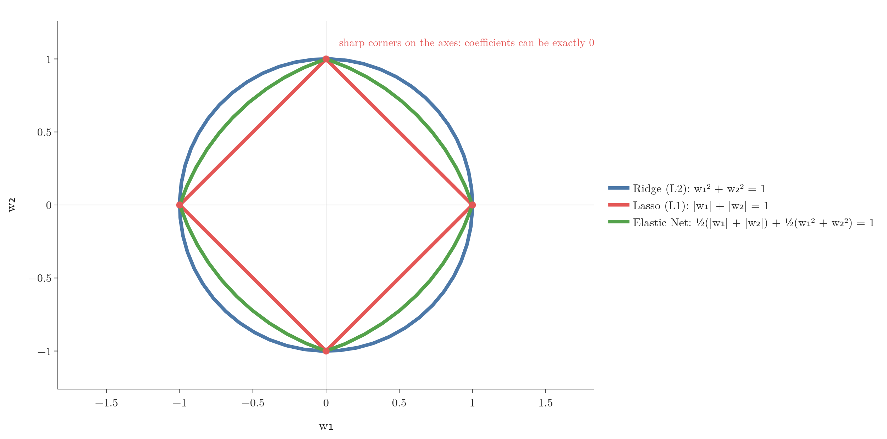
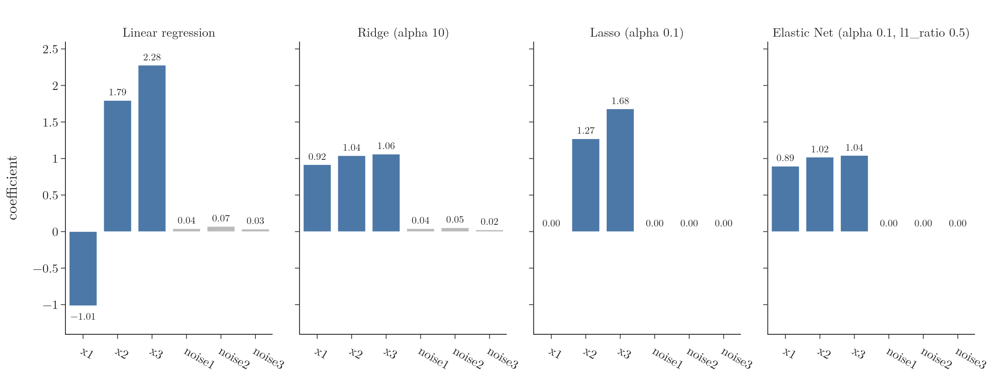

<!-- where-this-fits: generated by course_map/build_map.py; edit concepts.yaml, not this block -->
> **Where this fits:** Pipeline map step 8 (Model). See the [Course map](../01-course-map/note.md).
>
> 
>
> - **Builds on:** Multicollinearity ([Note 27](../27-one-hot-encoding/note.md)); Regularisation ([Note 63](../63-ridge-regression-intuition/note.md)); Ridge regression ([Note 66](../66-ridge-key-points/note.md)); Lasso regression ([Note 68](../68-lasso-sparsity/note.md)).
<!-- /where-this-fits -->

## 1. Overview

> **Key point:** Elastic Net adds both the Ridge penalty and the Lasso penalty to the loss. One setting controls the overall strength, another the mix between the two.

The last Notes covered two regularised versions of linear regression:

- **Ridge** (L2): shrinks all coefficients, never to exactly 0. Suited to data where every **feature** (an input variable, one column of the data table) matters.
- **Lasso** (L1): can set coefficients to exactly 0, removing features. Suited to data where only some features matter.

With a large dataset of many features, it is often impossible to know in advance which of the two fits better. **Elastic Net regression** uses both penalties at once and lets their mix be tuned like any other hyperparameter.

## 2. The loss function

> **Key point:** Loss = squared error + a × (sum of squared coefficients) + b × (sum of absolute coefficients).

The Elastic Net loss is the squared error with both penalties added:

$$L = \sum_{i=1}^{n}(y_i - \hat y_i)^2 + a\sum_{j=1}^{m}\beta_j^2 + b\sum_{j=1}^{m}|\beta_j|$$

$a$ sets the strength of the Ridge part and $b$ the strength of the Lasso part. They are separate numbers, so the two parts can be weighted differently.

- With $b = 0$, it is Ridge.
- With $a = 0$, it is Lasso.
- With $a = b = 0$, it is plain linear regression.

## 3. alpha and l1_ratio

> **Key point:** scikit-learn uses alpha for the total strength and l1_ratio for the share of the Lasso (L1) part.

Instead of $a$ and $b$, scikit-learn's `ElasticNet` takes two other hyperparameters:

$$\text{alpha} = a + b \qquad r = \frac{b}{a + b}$$

Here $r$ is the `l1_ratio` hyperparameter.

In words: `alpha` is the total penalty, and `l1_ratio` is the fraction of it that goes to the L1 (Lasso) part. The rest, $1 - r$, goes to the L2 (Ridge) part.

| l1_ratio | Mix | Behaves like |
|---|---|---|
| 0 | all L2 | Ridge |
| 0.5 (default) | half and half | an even mix |
| 0.9 | 90% L1, 10% L2 | mostly Lasso |
| 1 | all L1 | Lasso |

With numbers: alpha 1 and l1_ratio 0.5 give $a = 0.5$ and $b = 0.5$. Going back is easy too: $b = \text{alpha} \times r$ and $a = \text{alpha} - b$.

> **Extra:** A common slip is to read l1_ratio 0.9 as "90% Ridge". The name says what it measures: the L1 share. So 0.9 means 90% Lasso (scikit-learn docs, `ElasticNet`).

> **Extra:** As with `Lasso`, scikit-learn scales the terms a little differently: it minimises $\frac{1}{2n}\sum(y_i - \hat y_i)^2 + \text{alpha} \cdot r\sum|\beta_j| + \frac{1}{2}\text{alpha}(1 - r)\sum\beta_j^2$, with $r$ the `l1_ratio`. The idea is the same; only the scale of alpha differs (scikit-learn docs, `ElasticNet`).

## 4. The shape of the penalty

> **Key point:** The Elastic Net penalty is between Ridge's circle and Lasso's diamond: rounded, but still with corners on the axes, so it can still set coefficients to 0.

For two coefficients, Figure 1 draws all the points where each penalty equals 1.

{height=45%}

- **Ridge** gives a circle: smooth everywhere.
- **Lasso** gives a diamond with sharp corners on the axes, where one coefficient is 0. Those corners are why Lasso answers often land exactly on 0 (the Lasso sparsity Note).
- **Elastic Net** is between the two. Its sides bulge outwards like the circle, but it keeps the corners, so it can still produce exact zeros (Zou and Hastie 2005, Fig. 1).

## 5. Correlated features: the grouping effect

> **Key point:** When features are strongly correlated, Lasso keeps one or two and drops the rest, with little regard for which. Elastic Net shares the weight among them and still drops the useless features.

Elastic Net is especially recommended when features are strongly correlated with each other: **multicollinearity** (the regression assumptions Note). Height and weight are a typical pair: when one rises, the other usually does too.

Figure 2 uses 200 **observations** (records, one row of the data table each) with six features. $x_1$, $x_2$ and $x_3$ are three almost identical copies of one signal, and the **target** (the output we predict) is 3 times that signal plus noise. The other three features are pure noise.

{height=50%}

| Model | $x_1$ | $x_2$ | $x_3$ | Noise features |
|---|---|---|---|---|
| Linear regression | $-1.01$ | 1.79 | 2.28 | about 0.05 |
| Ridge (alpha 10) | 0.92 | 1.04 | 1.06 | about 0.04 |
| Lasso (alpha 0.1) | 0 | 1.27 | 1.68 | 0 |
| Elastic Net (alpha 0.1, l1_ratio 0.5) | 0.89 | 1.02 | 1.04 | 0 |

- **Linear regression** gives the three copies wild, unstable values; $x_1$ even gets a negative sign. Only their sum, about 3, is meaningful. With correlated features, a large coefficient on one copy can be cancelled by an opposite one on another (ESL §3.4.1).
- **Ridge** shares the weight evenly, about 1 each, but keeps small coefficients on the noise features.
- **Lasso** drops the noise, but also drops $x_1$, which is just as useful as the others. Which copy it drops is close to arbitrary: from a group of highly correlated features, Lasso tends to keep one and does not care which (Zou and Hastie 2005, §1). Here it kept two of the three.
- **Elastic Net** does both: it shares the weight evenly among the three copies, like Ridge, and sets the noise features to 0, like Lasso.

This sharing of weight among correlated features is called the **grouping effect**. For identical features, the Elastic Net penalty provably gives identical coefficients, while the Lasso penalty does not (Zou and Hastie 2005, §2.3).

## 6. Elastic Net on the diabetes data

> **Key point:** When the training set is small, all three penalties beat plain linear regression. Elastic Net, tuned by cross-validation, lands between Ridge and Lasso, and close to the better of the two.

A penalty is like a seatbelt. On a smooth road (plenty of data) it changes little. On a bumpy road (few observations, correlated features) it keeps the coefficients from flying around. The diabetes data has bumps of the second kind: the features s1 and s2 have a correlation of 0.90.

We give each model only 80 training observations of the diabetes data and test on the remaining 362. Every penalty strength (and, for Elastic Net, the l1_ratio) is chosen by 5-fold cross-validation on the training part only, never on the test set. The table averages 40 random splits:

| Model | Mean test R² |
|---|---|
| Linear regression | 0.412 |
| Ridge (`RidgeCV`) | 0.440 |
| Lasso (`LassoCV`) | 0.431 |
| Elastic Net (`ElasticNetCV`) | 0.437 |

- All three penalties beat plain linear regression. With few observations and correlated features, the least squares coefficients vary a lot from sample to sample, and shrinking them trades a small increase in bias for a large drop in variance (ISL §6.2.1).
- Elastic Net beats Lasso. Lasso tends to keep one feature of a correlated group (Zou and Hastie 2005, §1): averaged over the splits, it sets 1.35 of the two correlated features s1 and s2 to zero, against 0.75 for Elastic Net, which shares the weight (the grouping effect of Section 5).
- Ridge edges out Elastic Net slightly. Ridge does best when most features carry some signal (ISL §6.2.2), and most diabetes features do: even Lasso keeps about 7 of the 10 (it sets 3.3 to zero on average). Elastic Net does not know that in advance, but cross-validation steers it close.

> **Python:** Tuning alpha and l1_ratio with cross-validation.
>
> ```python
> from sklearn.linear_model import ElasticNetCV
>
> cv = ElasticNetCV(l1_ratio=[0.1, 0.5, 0.7, 0.9, 0.95, 0.99, 1],
>                   alphas=np.logspace(-4, 1, 40), cv=5)
> cv.fit(X_train, y_train)
> cv.alpha_, cv.l1_ratio_            # the chosen settings
> cv.score(X_test, y_test)           # R² on unseen data
> ```

Grid search and randomised search (later Notes) do the same tuning job for any model.

> **Extra:** The condition matters. With the full training set (353 observations, test size 0.2), the four models tie: mean test R² 0.455, 0.455, 0.456 and 0.457 over 40 splits. With enough observations, the least squares coefficients are already stable, so a penalty has little variance to remove (ISL ch. 6 introduction). Tuning the penalty against the test set itself would also flatter the scores; cross-validation on the training part avoids that.

> **Extra:** `SGDRegressor(penalty="elasticnet", alpha=..., l1_ratio=...)` trains the same kind of model with stochastic gradient descent (the SGD Note). scikit-learn recommends `SGDRegressor` for large datasets (more than 10,000 observations) and `ElasticNet` otherwise (scikit-learn user guide §1.5.2).

## 7. When to use which

> **Key point:** Ridge when all features matter, Lasso when only some do, Elastic Net when unsure or when features are strongly correlated.

| Situation | Choice |
|---|---|
| Most features are useful | Ridge |
| Only some features are useful; want feature selection | Lasso |
| Many features, unclear which kind | Elastic Net |
| Strongly correlated features | Elastic Net (or Ridge) |

The first two rows follow ISL §6.2.2; the last follows the grouping effect above (Zou and Hastie 2005).

In practice, Elastic Net with l1_ratio tuned by cross-validation covers all three cases: the search can land on Ridge-like or Lasso-like settings if those fit best.

## 8. Summary

- Elastic Net loss = squared error + L2 penalty + L1 penalty.
- `alpha` sets the total strength; `l1_ratio` sets the L1 (Lasso) share: 0 is Ridge, 1 is Lasso.
- Elastic Net can still set coefficients to 0, but shares weight among correlated features (the grouping effect).
- Tune alpha and l1_ratio with cross-validation, for example with `ElasticNetCV`.

## 9. Sources

- **Zou and Hastie 2005:** Zou, H. and Hastie, T. "Regularization and Variable Selection via the Elastic Net." *Journal of the Royal Statistical Society B* 67(2), 301–320, 2005. Sections 1, 2.1 (Fig. 1) and 2.3.
- **ESL:** Hastie, T., Tibshirani, R. and Friedman, J. *The Elements of Statistical Learning*, 2nd ed. Springer, 2009. Section 3.4.1, p. 63.
- **ISL:** James, G., Witten, D., Hastie, T. and Tibshirani, R. *An Introduction to Statistical Learning*, 2nd ed. Springer, 2021. Chapter 6 introduction, pp. 225–226; Section 6.2.1, p. 241; Section 6.2.2, pp. 246–247.
- **scikit-learn docs:** `sklearn.linear_model.ElasticNet`; user guide Section 1.5.2 (SGD regression), scikit-learn 1.9.

## 10. Key terms

| Term | Meaning |
|---|---|
| Elastic Net regression | Linear regression with both the L1 and the L2 penalty |
| l1_ratio | The share of the total penalty given to the L1 (Lasso) part |
| Grouping effect | Elastic Net's tendency to give correlated features similar coefficients instead of keeping only one |
| ElasticNetCV | scikit-learn's Elastic Net that picks alpha and l1_ratio by cross-validation |
