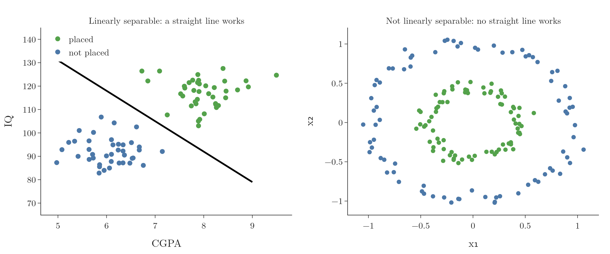
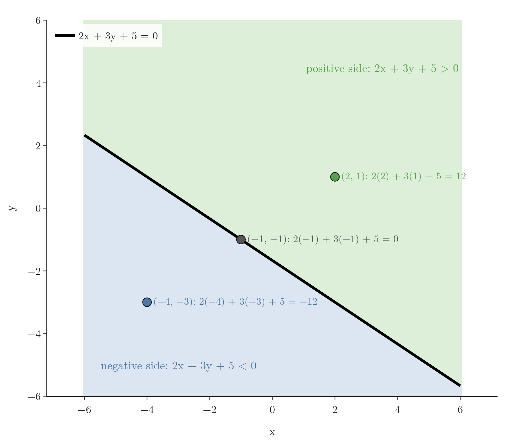
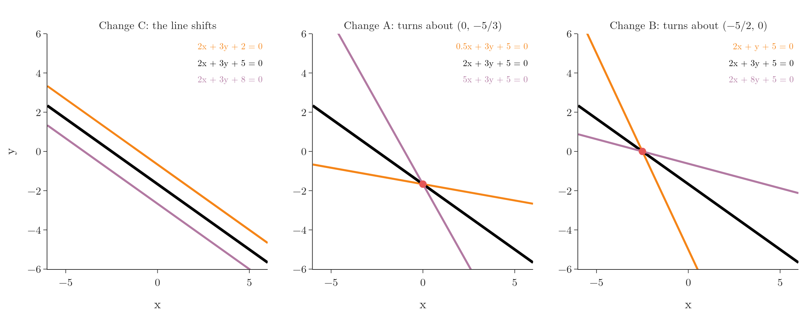
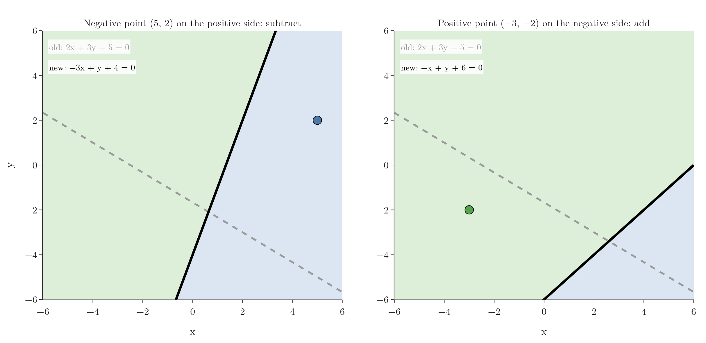

<!-- where-this-fits: generated by course_map/build_map.py; edit concepts.yaml, not this block -->
> **Where this fits:** Pipeline map steps 0 (Foundations), 8 (Model). See the [Course map](../01-course-map/note.md).
>
> 
>
> - **Builds on:** Classification problems ([Note 3](../03-types-of-ml/note.md)); Model-based learning ([Note 6](../06-instance-vs-model-based/note.md)); Dot product ([Note 48](../48-pca-step-by-step/note.md)); Gradient descent ([Note 57](../57-gradient-descent/note.md)); Polynomial features ([Note 61](../61-polynomial-regression/note.md)).
> - **Leads to:** Softmax regression ([Note 79](../79-softmax-regression/note.md)); Support vector machines ([Note 92](../92-svm-intuition/note.md)); Perceptron ([Note 1004](../1004-perceptron/note.md)); Perceptron loss ([Note 1006](../1006-perceptron-loss/note.md)).
> - **Compare with:** Support vector machines ([Note 92](../92-svm-intuition/note.md)).
<!-- /where-this-fits -->

## 1. Overview

> **Key point:** Logistic regression separates two classes with a straight line. The perceptron trick is a simple way to find such a line: pick a random point, and if it is on the wrong side, move the line towards it.

**Logistic regression** is one of the most widely used classification algorithms. Logistic regression is also the basic building block of neural networks: a single neuron (the **perceptron**) is very close to it. Understanding it well is a good foundation for deep learning.

Logistic regression can be explained in two ways:

- **Geometric:** find a line that separates the classes.
- **Probabilistic:** predict the probability that a point belongs to a class.

These Notes build it step by step. This Note starts with the **perceptron trick**, a very simple geometric method. The perceptron trick does not give the best possible line (Bishop §4.1.7), but it explains the idea that the later Notes improve on: the sigmoid function, the loss function and gradient descent.

## 2. When logistic regression works

> **Key point:** The two classes must be (almost) linearly separable: a straight line, plane or hyperplane can split them.

Take a dataset of students. Each student is one **observation** (one record, one row of the data table). There are two **features** (input variables, one column each), CGPA and IQ, and one **target** (the output we predict): placed or not placed. We want a model that takes a new student's CGPA and IQ and predicts whether they will be placed.

{height=42%}

Data is **linearly separable** when a straight line can split the two classes (Figure 1, left). With 3 features the divider is a plane, and with more features a **hyperplane**. A few points on the wrong side are fine: the data only needs to be almost separable.

Logistic regression draws a straight divider, just as linear regression fits a straight line. So on data like Figure 1 (right), where one class surrounds the other, it cannot do well.

## 3. The line and its two sides

> **Key point:** In classification, the line is written Ax + By + C = 0. Putting a point into Ax + By + C tells which side it is on.

### 3.1 The general form of a line

> **Key point:** Ax + By + C = 0, or with more features, w₀ + w₁x₁ + w₂x₂ + ... = 0.

Linear regression wrote a line as $y = mx + b$. In classification, both axes are features, so the line is written in its general form:

$$Ax + By + C = 0$$

With CGPA as $x_1$ and IQ as $x_2$, this becomes $A x_1 + B x_2 + C = 0$. A third feature adds one more term: $A x_1 + B x_2 + C x_3 + D = 0$, a plane. Finding the separating line means finding good values of $A$, $B$ and $C$.

### 3.2 Positive and negative sides

> **Key point:** Ax + By + C > 0 on one side, < 0 on the other, = 0 on the line.

Every line splits the plane into a **positive side** and a **negative side**. To find which side a point $(x_1, y_1)$ is on, put it into the left-hand side:

- $A x_1 + B y_1 + C > 0$: positive side.
- $A x_1 + B y_1 + C < 0$: negative side.
- $A x_1 + B y_1 + C = 0$: on the line.

{height=48%}

With numbers, for the line $2x + 3y + 5 = 0$ (Figure 2): the point $(2, 1)$ gives $4 + 3 + 5 = 12$, so it is on the positive side. The point $(-4, -3)$ gives $-8 - 9 + 5 = -12$: negative side.

## 4. How A, B and C move the line

> **Key point:** Changing C shifts the line without turning it. Changing A or B turns it.

The perceptron trick moves the line by changing $A$, $B$ and $C$. Each one has its own effect (Figure 3):

{height=50%}

- **C:** the line moves parallel to itself. Increasing C moves $2x + 3y + C = 0$ down, decreasing it moves it up.
- **A:** the line turns about the point where it crosses the y-axis, here $(0, -5/3)$, because there $x = 0$ and $A$ has no effect.
- **B:** the line turns about the point where it crosses the x-axis, here $(-5/2, 0)$.

Changing all three at once combines these moves, so the line can reach any position.

## 5. The perceptron trick

> **Key point:** Start with any line. Repeatedly pick a random point. If it is on the correct side, do nothing; if not, move the line towards it.

The algorithm:

1. Start with random values of $A$, $B$ and $C$: any line.
2. Repeat many times (for example 1,000):
   - pick one training point at random;
   - if it is on the correct side of the line, do nothing;
   - if it is on the wrong side, change $A$, $B$ and $C$ so that the line moves towards it.
3. Stop after the chosen number of loops, or as soon as no point is misclassified (**convergence**).

Each misclassified point "pulls" the line towards itself until it is on the correct side. After enough pulls, the line settles between the classes.

An everyday picture: a farmer builds a fence between sheep and goats. Each time a goat is found on the sheep side, the farmer nudges the fence a little towards that goat; repeated nudges carry the fence past it. Animals already on the right side cause no change. After enough nudges, every animal is on its own side.

## 6. Moving the line towards a point

> **Key point:** Add a 1 to the point's coordinates. For a negative point on the positive side, subtract them from (A, B, C). For a positive point on the negative side, add them.

### 6.1 A negative point on the positive side

> **Key point:** Subtract (x, y, 1) from (A, B, C).

Take the line $2x + 3y + 5 = 0$ and the point $(5, 2)$, which belongs to the negative class. The point gives $10 + 6 + 5 = 21 > 0$, so it is on the positive side: misclassified.

Append a 1 to the point, $(5, 2, 1)$, and subtract it from the coefficients $(2, 3, 5)$:

$$(2 - 5,\ 3 - 2,\ 5 - 1) = (-3,\ 1,\ 4) \quad\Rightarrow\quad -3x + y + 4 = 0$$

Now the point gives $-15 + 2 + 4 = -9 < 0$: it is on the negative side, as it should be (Figure 4, left).

### 6.2 A positive point on the negative side

> **Key point:** Add (x, y, 1) to (A, B, C).

The point $(-3, -2)$ belongs to the positive class, but gives $-6 - 6 + 5 = -7 < 0$. Add $(-3, -2, 1)$ instead:

$$(2 - 3,\ 3 - 2,\ 5 + 1) = (-1,\ 1,\ 6) \quad\Rightarrow\quad -x + y + 6 = 0$$

Now it gives $3 - 2 + 6 = 7 > 0$: positive side (Figure 4, right).

{height=55%}

### 6.3 Small steps: the learning rate

> **Key point:** Multiply the point by a learning rate such as 0.1 before adding or subtracting, so the line moves a little at a time.

The full update above jumps the line a long way, which can undo what other points taught it. As in gradient descent, the step is scaled by a small **learning rate** $\eta$, usually around 0.1 or 0.01:

$$\text{new coefficients} = \text{old coefficients} - \eta \times (x, y, 1)$$

With $\eta = 0.1$, the first example gives $(2 - 0.5,\ 3 - 0.2,\ 5 - 0.1) = (1.5,\ 2.8,\ 4.9)$. The point's value drops from 21 to 18: the line has moved a little towards it. Repeated small steps get it to the correct side.

{width=100%}

In Figure 5, watch the line swing a little towards the ringed point at every step while the value at the point counts down to 0 and changes sign. Each step changes the value by the same amount, because, writing the point as $p = (x, y, 1)$, $(w - \eta p) \cdot p = w \cdot p - \eta(x^2 + y^2 + 1)$: the change is $0.1 \times (25 + 4 + 1) = 3$ for $(5, 2)$ and $0.1 \times (9 + 4 + 1) = 1.4$ for $(-3, -2)$.

## 7. Writing the algorithm compactly

> **Key point:** With a column of 1s and weights w, the line is Σ wᵢxᵢ = 0, and all four cases fit in one update rule.

### 7.1 Notation

> **Key point:** Rename C, A, B as w₀, w₁, w₂ and add a column x₀ = 1.

Write the line as $w_0 + w_1 x_1 + w_2 x_2 = 0$, so $w_0 = C$, $w_1 = A$ and $w_2 = B$. Then add an extra feature $x_0$ that is always 1 (a column of 1s in the data table), as in multiple linear regression:

$$\sum_{i=0}^{2} w_i x_i = w_0 x_0 + w_1 x_1 + w_2 x_2 = 0$$

The same sum works for any number of features, just with more terms. In vectors it is the dot product $w \cdot x$.

### 7.2 Predicting

> **Key point:** Compute w · x for the student. If it is positive, predict 1 (placed); otherwise predict 0.

For a student with CGPA 7.5 and IQ 110, the observation is $x = (1,\ 7.5,\ 110)$. The model computes $w_0 \times 1 + w_1 \times 7.5 + w_2 \times 110$. If the result is above 0, it predicts placed (1); otherwise not placed (0). The rule "1 if positive, else 0" is a **step function** of $w \cdot x$.

### 7.3 One update rule

> **Key point:** w_new = w_old + η (y − ŷ) x. The factor (y − ŷ) is 0, +1 or −1 and picks the right action automatically.

The algorithm so far needs two checks: a negative point on the positive side, and a positive point on the negative side. Both fit into a single rule, where $y$ is the true class and $\hat{y}$ the predicted one:

$$w_{\text{new}} = w_{\text{old}} + \eta\thinspace(y - \hat{y})\thinspace x$$

| True $y$ | Predicted $\hat{y}$ | $y - \hat{y}$ | Update |
|---|---|---|---|
| 1 | 1 | 0 | none: correct |
| 0 | 0 | 0 | none: correct |
| 1 | 0 | $+1$ | $w + \eta x$: add (positive point on the negative side) |
| 0 | 1 | $-1$ | $w - \eta x$: subtract (negative point on the positive side) |

So the loop needs no if-statements: for each random point, compute $\hat{y}$ and apply the rule.

> **Python:** The perceptron trick.
>
> ```python
> def step(z):
>     return 1 if z > 0 else 0
>
> def perceptron(X, y, lr=0.1, loops=1000):
>     X = np.insert(X, 0, 1, axis=1)      # column of 1s
>     w = np.ones(X.shape[1])
>     for _ in range(loops):
>         j = np.random.randint(0, X.shape[0])
>         y_hat = step(X[j] @ w)
>         w = w + lr * (y[j] - y_hat) * X[j]
>     return w
> ```
>
> The next Note runs this on data and watches the line move.

## 8. Summary

- Logistic regression needs (almost) linearly separable classes.
- A line $Ax + By + C = 0$ has a positive and a negative side; plug a point in to find which.
- Perceptron trick: pick random points; move the line towards each misclassified one.
- Update: $w \leftarrow w + \eta(y - \hat{y})x$, with a column of 1s in $x$.
- The perceptron trick finds a separating line, but not necessarily the best one; which line it finds depends on the starting line and the order of the points (Bishop §4.1.7). The next Notes fix this.

## 9. Sources

**Built from**

- CampusX, "Logistic Regression Part 1 | Perceptron Trick", YouTube, https://www.youtube.com/watch?v=XNXzVfItWGY

**Other references**

- **Bishop:** Bishop, C. M. *Pattern Recognition and Machine Learning*. Springer, 2006. Section 4.1.7, pp. 192–196 (the perceptron algorithm; p. 194 on many solutions).

## 10. Key terms

| Term | Meaning |
|---|---|
| Logistic regression | A classification algorithm that separates classes with a line, plane or hyperplane |
| Perceptron | A single artificial neuron: a weighted sum of the features followed by a step |
| Perceptron trick | Moving a line towards each misclassified point until the classes are separated |
| Linearly separable | Data whose classes a straight line, plane or hyperplane can split |
| Hyperplane | The flat divider in more than three dimensions |
| Feature, target, observation | An input variable (one column), the output we predict, and one record (one row) |
| Positive and negative side | The two halves of the plane where Ax + By + C is above or below 0 |
| Step function | A function that outputs 1 for positive inputs and 0 otherwise |
| Convergence | The point where training stops changing, here when no point is misclassified |
