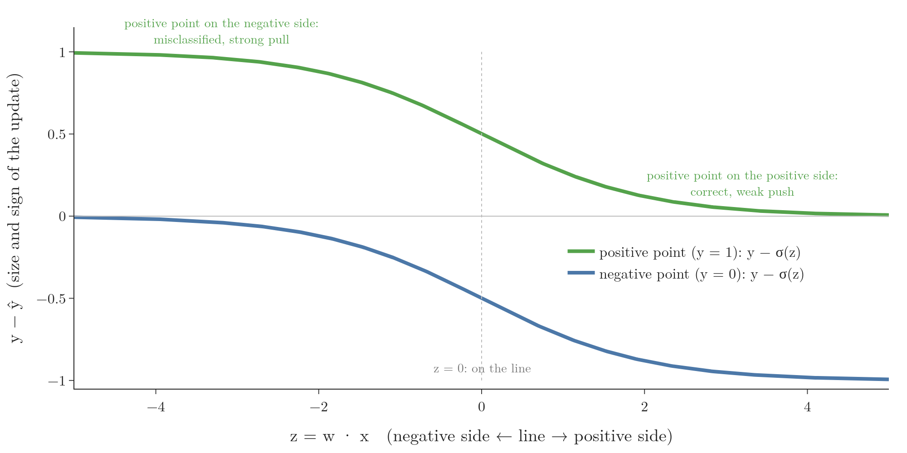

<!-- where-this-fits: generated by course_map/build_map.py; edit concepts.yaml, not this block -->
> **Where this fits:** Pipeline map step 8 (Model). See the [Course map](../01-course-map/note.md).
>
> 
>
> - **Builds on:** Classification problems ([Note 3](../03-types-of-ml/note.md)); Model-based learning ([Note 6](../06-instance-vs-model-based/note.md)); Gradient descent ([Note 57](../57-gradient-descent/note.md)); Polynomial features ([Note 61](../61-polynomial-regression/note.md)); Perceptron trick ([Note 71](../71-perceptron-code/note.md)).
> - **Leads to:** Softmax regression (Video 79, coming).
> - **Compare with:** Decision trees (Video 97, coming).
<!-- /where-this-fits -->

## 1. Overview

> **Key point:** The perceptron trick stops as soon as every point is correct. The fix: let every point act on the line, with strength depending on its distance. Replacing the step function with the sigmoid function does exactly this, and also turns the model's output into a probability.

The previous Note found the weakness of the perceptron trick: once no point is misclassified, the line stops moving, wherever it happens to be. Logistic regression keeps improving the line after that.

This Note changes the perceptron's rule so that correctly classified points also take part. The change needs one new ingredient, the **sigmoid function**, one of the most important functions in machine learning and deep learning.

## 2. The new idea: every point pushes or pulls

> **Key point:** Misclassified points pull the line towards themselves; correctly classified points push it away. The strength depends on how far the point is from the line.

### 2.1 Push and pull

> **Key point:** Old rule: only misclassified points act. New rule: all points act.

So far, only misclassified points acted: each one **pulled** the line towards itself. Correct points did nothing.

The new rule: correctly classified points **push** the line away from themselves. Then, even when every point is correct, the line keeps moving: points on both sides push it, and it settles where the pushes balance, in the middle of the gap.

### 2.2 How strongly

> **Key point:** Near correct points push hard, far ones gently. Near misclassified points pull gently, far ones hard.

The strength of each push or pull depends on the point's distance from the line:

| Point | Near the line | Far from the line |
|---|---|---|
| Correctly classified | strong push | weak push |
| Misclassified | weak pull | strong pull |

This makes sense. A correct point right next to the line is at risk, so it should push hard. A correct point far away is safe, so it hardly needs to act. A badly misclassified point, far on the wrong side, is a big error, so it should pull hard.

## 3. Why the step function cannot do this

> **Key point:** With the step function, ŷ is 0 or 1, so for every correct point y − ŷ = 0 and the update vanishes.

The update rule from the perceptron Notes is

$$w_{\text{new}} = w_{\text{old}} + \eta\,(y - \hat{y})\,x$$

For a correctly classified point, $y$ and $\hat{y}$ are equal (both 0 or both 1), so $y - \hat{y} = 0$ and nothing changes. To let correct points act, $y - \hat{y}$ must not be 0.

$y$ is the true class from the data, so it cannot change. What can change is how the model produces $\hat{y}$. So far it computed $z = w \cdot x$ and passed it through a **step function**: 1 if $z > 0$, otherwise 0. As long as $\hat{y}$ is only ever 0 or 1, the problem remains. We need a function whose output can be anything between 0 and 1.

## 4. The sigmoid function

> **Key point:** σ(z) = 1 / (1 + e^(−z)). It squeezes any number into the range 0 to 1, with σ(0) = 0.5.

The **sigmoid function** is

$$\sigma(z) = \frac{1}{1 + e^{-z}}$$

{height=38%}

Its key properties (Figure 1, right):

- For a very large $z$, $e^{-z}$ is almost 0, so $\sigma(z)$ is almost 1.
- For a very negative $z$, $e^{-z}$ is huge, so $\sigma(z)$ is almost 0.
- At $z = 0$, $\sigma(0) = 1/(1 + 1) = 0.5$.

| $z$ | $-4$ | $-2$ | 0 | 2 | 4 |
|---|---|---|---|---|---|
| $\sigma(z)$ | 0.018 | 0.119 | 0.5 | 0.881 | 0.982 |

However large or small the input, the output always stays strictly between 0 and 1. It never actually reaches 0 or 1. The S shape gives the function its name (sigma is the Greek letter for "s").

## 5. Sigmoid as a probability

> **Key point:** σ(w · x) can be read as the probability that the point belongs to the positive class. It is 0.5 on the line and rises towards 1 further onto the positive side.

### 5.1 The new prediction

> **Key point:** Compute z = w · x as before, but pass it to the sigmoid instead of the step.

For a student with CGPA 7.5 and IQ 110, the model still computes $z = w_0 + w_1 \times 7.5 + w_2 \times 110$. But now $\hat{y} = \sigma(z)$:

- $z > 0$ (positive side): $\hat{y} > 0.5$;
- $z < 0$ (negative side): $\hat{y} < 0.5$;
- $z = 0$ (on the line): $\hat{y} = 0.5$.

To make a yes-or-no prediction, we predict "placed" when $\hat{y} \geq 0.5$, which is the same decision as before.

### 5.2 A map of probabilities

> **Key point:** Lines parallel to the boundary have equal probability; the probability changes gradually across the plane.

Figure 2 colours the plane by $\sigma(x_1 + x_2)$, for the line $x_1 + x_2 = 0$.

{height=50%}

- On the line itself, $\sigma = 0.5$: a 50% chance of being placed.
- Moving onto the positive side, the value rises through 0.6, 0.7, 0.8 and 0.9, along lines parallel to the boundary. Far away it approaches 1.
- On the negative side it falls towards 0.

So instead of a hard yes or no, every student now gets a **probability of being placed**: the further onto the positive side, the higher the chance. The probability of **not** being placed is $1 - \hat{y}$. A student with $\hat{y} = 0.7$ has a 70% chance of being placed and a 30% chance of not.

This probabilistic reading is the second view of logistic regression mentioned in the perceptron Note, and the next Note builds on it.

## 6. The new update in action

> **Key point:** With ŷ = σ(z), y − ŷ is never exactly 0, so every point moves the line, by an amount that depends on its distance.

### 6.1 Four points

> **Key point:** Correct points give small values of y − ŷ that push; misclassified points give large values that pull.

Take four points and suppose the model gives these probabilities:

| Point | True $y$ | Side of the line | $\hat{y} = \sigma(z)$ | $y - \hat{y}$ | Effect |
|---|---|---|---|---|---|
| A | 1 | positive (correct) | 0.80 | $+0.20$ | small push |
| B | 0 | negative (correct) | 0.30 | $-0.30$ | push |
| C | 1 | negative (wrong) | 0.30 | $+0.70$ | strong pull |
| D | 0 | positive (wrong) | 0.65 | $-0.65$ | strong pull |

None of the values is 0, so every point updates the weights.

- **A**: $w$ grows by $0.2\,\eta\,x$. As in the perceptron Note, adding $x$ moves a positive point further onto the positive side: the line moves away from it, a push.
- **C**: $w$ grows by $0.7\,\eta\,x$: the same direction but much larger, enough to bring the line towards and past C, a pull.
- **B** and **D** work the same way with subtraction.

### 6.2 Strength and distance

> **Key point:** y − σ(z) is large for points deep on the wrong side and small for points deep on the correct side.

Figure 3 draws $y - \sigma(z)$ against $z$, the point's signed position relative to the line.

{height=42%}

For a positive point (green, $y = 1$):

- deep on the wrong side ($z = -4$): $1 - 0.018 = 0.98$, a strong pull;
- on the line ($z = 0$): $0.5$;
- deep on the correct side ($z = 4$): $1 - 0.982 = 0.018$, a very weak push.

For a correct point, the push is strongest when it is just on the correct side, near the line, and fades as it gets further away. The negative points (blue) mirror this. That is exactly the behaviour planned in the table of Section 2.2.

## 7. Does it help?

> **Key point:** The sigmoid version places the line better than the step version, but still not as evenly as logistic regression.

> **Python:** The perceptron with a sigmoid.
>
> ```python
> def sigmoid(z):
>     return 1 / (1 + np.exp(-z))
>
> def perceptron(X, y, lr=0.1, loops=1000, seed=0):
>     rng = np.random.default_rng(seed)
>     X = np.insert(X, 0, 1, axis=1)
>     w = np.ones(X.shape[1])
>     for _ in range(loops):
>         j = rng.integers(0, X.shape[0])
>         y_hat = sigmoid(X[j] @ w)            # was: step(X[j] @ w)
>         w = w + lr * (y[j] - y_hat) * X[j]
>     return w
> ```

Figure 4 compares three lines on data with a wide gap between the classes (`make_classification` with `class_sep=30`):

{height=50%}

| Model | Gap to the blue class | Gap to the green class |
|---|---|---|
| Perceptron with step | 2.41 | 0.25 |
| Perceptron with sigmoid | 3.07 | 1.21 |
| Logistic regression (scikit-learn) | 2.20 | 1.97 |

The step version stops right next to the green class. The sigmoid version moves well away from it, a clear improvement. But it is still not centred, while scikit-learn's logistic regression keeps a nearly equal gap on both sides.

So the change was in the right direction, but something is still missing. The missing piece is a proper **loss function**: a single number that measures how good the line is, which can then be minimised with gradient descent. That is the subject of the next Note.

## 8. Summary

- Fix for the perceptron: every point acts; correct points push, misclassified points pull, with strength depending on distance.
- With the step function, $y - \hat{y} = 0$ for correct points, so they cannot act.
- The sigmoid $\sigma(z) = 1/(1 + e^{-z})$ maps any $z$ into $(0, 1)$, with $\sigma(0) = 0.5$.
- $\sigma(w \cdot x)$ is the probability of the positive class: 0.5 on the line, near 1 deep on the positive side.
- Using $\hat{y} = \sigma(z)$ in the update lets every point act and improves the line, but not yet to logistic regression's quality.

## 9. Key terms

| Term | Meaning |
|---|---|
| Sigmoid function | $\sigma(z) = 1/(1 + e^{-z})$; an S-shaped curve that maps any number into the range 0 to 1 |
| Logistic function | Another name for the sigmoid function |
| Probabilistic interpretation | Reading the model's output as the probability of the positive class |
| Push and pull | Moving the line away from a correctly classified point, or towards a misclassified one |
