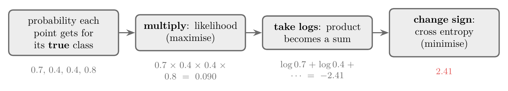
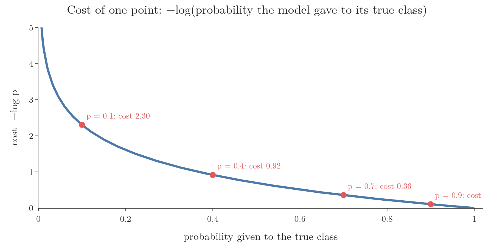

<!-- where-this-fits: generated by course_map/build_map.py; edit concepts.yaml, not this block -->
> **Where this fits:** Pipeline map step 8 (Model). See the [Course map](../01-course-map/note.md).
>
> 
>
> - **Builds on:** Classification problems ([Note 3](../03-types-of-ml/note.md)); Model-based learning ([Note 6](../06-instance-vs-model-based/note.md)); Gradient descent ([Note 57](../57-gradient-descent/note.md)); Polynomial features ([Note 61](../61-polynomial-regression/note.md)); Perceptron trick ([Note 71](../71-perceptron-code/note.md)); Sigmoid function ([Note 72](../72-sigmoid-function/note.md)).
> - **Leads to:** Softmax regression ([Note 79](../79-softmax-regression/note.md)); Gradient boosting ([Note 120](../120-gradient-boosting-intuition/note.md)).
> - **Compare with:** Support vector machines ([Note 92](../92-svm-intuition/note.md)); Hinge loss and soft margin ([Note 94](../94-svm-soft-margin/note.md)); Entropy, information gain and Gini ([Note 97](../97-decision-trees-intuition/note.md)).
<!-- /where-this-fits -->

## 1. Overview

> **Key point:** To find the best line, we need a loss function: one number that says how good a line is. For logistic regression it comes from maximum likelihood, and it is called binary cross entropy or log loss.

The sigmoid perceptron of the previous Note improved the line, but still did not match scikit-learn's logistic regression. The reason is deeper than the choice of function. Both perceptron versions pick random points and nudge the line; nothing in that procedure says which line is **best**, so there is no guarantee it ends up there.

Machine learning normally works differently, as in linear regression:

1. Define a **loss function**: a formula that measures how wrong a model is.
2. Find the coefficients where the loss is smallest, with a formula or with gradient descent.

This Note builds the loss function for logistic regression. The next Notes minimise it with gradient descent.

## 2. Comparing two models

> **Key point:** When one model misclassifies points and the other does not, the better one is obvious. When both are perfect, or both make mistakes, we need a number.

Imagine four points, two green and two red, and two candidate lines. If model 1 misclassifies points and model 2 separates them perfectly, model 2 is clearly better.

But when two models both classify everything correctly, or both make one mistake, it is not obvious which is better. A loss function settles this: it gives each model a number, and the model with the better number wins.

## 3. Maximum likelihood

> **Key point:** For each point, take the probability the model gave to its true class. Multiply these over all points. The model with the larger product is better.

### 3.1 The probability of the true class

> **Key point:** For a green point use P(green) = ŷ; for a red point use P(red) = 1 − ŷ.

The sigmoid turns every point's position into a probability: $\hat{y} = \sigma(w \cdot x)$ is the probability of green (the positive class), and $1 - \hat{y}$ is the probability of red.

For each point we take the probability the model gives to the colour the point **really** has. Suppose the two models give these values:

| Point | True colour | Model 1: P(true colour) | Model 2: P(true colour) |
|---|---|---|---|
| 1 | green | 0.7 | 0.7 |
| 2 | red | 0.4 | 0.6 |
| 3 | green | 0.4 | 0.7 |
| 4 | red | 0.8 | 0.6 |

A value above 0.5 means the point is on its correct side; below 0.5, on the wrong side. Model 1 misclassifies points 2 and 3.

### 3.2 Multiply

> **Key point:** The product is the likelihood: how probable the model finds the data we actually see.

Treating the points as independent, the probability that the model produces exactly these colours is the product of the four values. This product is the **likelihood**:

- Model 1: $0.7 \times 0.4 \times 0.4 \times 0.8 = 0.090$
- Model 2: $0.7 \times 0.6 \times 0.7 \times 0.6 = 0.176$

Model 2 has the higher likelihood, so it is the better model. **Maximum likelihood** means choosing the coefficients that make this product as large as possible.

{height=52%}

## 4. From products to sums: the log

> **Key point:** Multiplying thousands of numbers below 1 gives a number too small for a computer. Taking logs turns the product into a sum, which is safe.

### 4.1 The problem with products

> **Key point:** 10,000 probabilities of 0.7 multiply to about 10⁻¹⁵⁴⁹.

With 4 points the product is already only 0.09. A real dataset may have 10,000 rows. If each point got probability 0.7, the product would be $0.7^{10{,}000}$, about $10^{-1549}$. That is far below the smallest number a standard float can store (about $10^{-308}$), so the computer cannot tell two models apart.

### 4.2 Taking logs

> **Key point:** log(a × b) = log a + log b, so the log of the product is the sum of the logs.

The logarithm turns multiplication into addition:

$$\log(a \times b) = \log a + \log b$$

So instead of the likelihood, we compute its log, the **log-likelihood**:

$$\log(0.7 \times 0.4 \times 0.4 \times 0.8) = \log 0.7 + \log 0.4 + \log 0.4 + \log 0.8 = -2.41$$

For 10,000 points of 0.7 the sum is simply $10{,}000 \times \log 0.7 = -3{,}567$, an ordinary number. Since log grows whenever its input grows, the model with the larger likelihood also has the larger log-likelihood: the comparison is unchanged.

### 4.3 Changing the sign

> **Key point:** Logs of numbers below 1 are negative. Putting a minus sign in front gives a positive number to minimise: the cross entropy.

Every probability is between 0 and 1, and the log of such a number is negative. So the log-likelihood is always negative. Putting a minus sign in front makes it positive:

| Model | Likelihood | Log-likelihood | Cross entropy |
|---|---|---|---|
| 1 | 0.090 | $-2.41$ | 2.41 |
| 2 | 0.176 | $-1.74$ | 1.74 |

This negative log-likelihood is the **cross entropy**. Because of the sign change, the direction flips too: we **maximise** the likelihood but **minimise** the cross entropy. The better model, model 2, has the smaller cross entropy.

{width=100%}

## 5. The cost of one point

> **Key point:** Each point costs −log p. A confident correct prediction costs almost nothing; a confident wrong one costs a lot.

The cross entropy is a sum of one cost per point, $-\log p$, where $p$ is the probability given to the true class. Figure 3 shows how this cost behaves.

{height=40%}

- $p = 0.9$ (confident and correct): cost 0.11.
- $p = 0.7$: cost 0.36.
- $p = 0.4$ (on the wrong side): cost 0.92.
- $p = 0.1$ (confident and wrong): cost 2.30, and it grows without limit as $p$ approaches 0.

So the loss punishes confident mistakes very heavily, and keeps rewarding the model a little for making correct points even more certain. That second effect is what keeps pushing the line into the middle of the gap, as the push-and-pull idea of the previous Note wanted.

## 6. One formula for both classes

> **Key point:** L = −(1/n) Σ [ y log ŷ + (1 − y) log(1 − ŷ) ]. For each point, the y factors switch on the correct term.

### 6.1 Choosing the right probability automatically

> **Key point:** −[y log ŷ + (1 − y) log(1 − ŷ)] equals −log ŷ for green points and −log(1 − ŷ) for red points.

The cost of a point uses $\hat{y}$ if the point is green and $1 - \hat{y}$ if it is red. Writing it as $-\log \hat{y}$ for every point would be wrong for the red ones. One expression handles both cases:

$$\text{cost}_i = -\left[y_i \log \hat{y}_i + (1 - y_i)\log(1 - \hat{y}_i)\right]$$

- **Green point** ($y_i = 1$): the second term is multiplied by 0 and vanishes, leaving $-\log \hat{y}_i$.
- **Red point** ($y_i = 0$): the first term vanishes, leaving $-\log(1 - \hat{y}_i)$.

With numbers, for model 1: point 2 is red with $\hat{y} = 0.6$, so its cost is $-\log(1 - 0.6) = -\log 0.4 = 0.92$. Point 3 is green with $\hat{y} = 0.4$, so its cost is $-\log 0.4 = 0.92$.

### 6.2 The loss function

> **Key point:** Average the costs over all n points.

Summing over all points and dividing by $n$ to get an average gives the loss function of logistic regression:

$$L = -\frac{1}{n}\sum_{i=1}^{n}\left[y_i \log \hat{y}_i + (1 - y_i)\log(1 - \hat{y}_i)\right], \qquad \hat{y}_i = \sigma(w \cdot x_i)$$

It is called **binary cross entropy** or **log loss**. For model 1 it is $2.41 / 4 = 0.603$.

> **Python:** Log loss by hand and in scikit-learn.
>
> ```python
> from sklearn.metrics import log_loss
>
> y = np.array([1, 0, 1, 0])                # green = 1, red = 0
> y_hat = np.array([0.7, 0.6, 0.4, 0.2])    # model 1's P(green)
>
> -np.mean(y * np.log(y_hat) + (1 - y) * np.log(1 - y_hat))   # 0.6031
> log_loss(y, y_hat)                                           # 0.6031
> ```

## 7. Minimising the loss

> **Key point:** There is no formula for the best w, so logistic regression is trained with gradient descent.

The task is now precise: find the coefficients $w$ that make $L$ as small as possible. For linear regression's squared error, setting the derivative to zero gave a formula (OLS). For log loss there is no such closed-form solution, because $w$ sits inside the sigmoid and the logs.

So we use gradient descent: compute the derivative of $L$ with respect to $w$ and step downhill repeatedly. The next Note works out the derivative of the sigmoid, and the one after derives the gradient and codes logistic regression from scratch.

## 8. Summary

| Step | Result for model 1 |
|---|---|
| Probability of each point's true class | 0.7, 0.4, 0.4, 0.8 |
| Multiply: likelihood (maximise) | 0.090 |
| Take logs: log-likelihood | $-2.41$ |
| Change sign: cross entropy (minimise) | 2.41 |
| Divide by n: log loss | 0.603 |

- The perceptron versions had no measure of "best"; a loss function provides one.
- Maximum likelihood: choose the model that gives the observed classes the highest probability.
- Logs avoid tiny products; the minus sign gives a positive loss to minimise.
- Log loss: $L = -\frac{1}{n}\sum[y\log\hat{y} + (1 - y)\log(1 - \hat{y})]$; it has no closed-form minimum.

## 9. Key terms

| Term | Meaning |
|---|---|
| Loss function | A formula that measures how wrong a model's predictions are |
| Likelihood | The product, over all points, of the probabilities the model gives to their true classes |
| Maximum likelihood | Choosing the parameters that make the likelihood as large as possible |
| Log-likelihood | The log of the likelihood: the sum of the log probabilities |
| Cross entropy | The negative log-likelihood; smaller is better |
| Binary cross entropy (log loss) | The average cross entropy for two classes, the loss function of logistic regression |
| Underflow | A number too close to 0 for the computer to store, which then becomes 0 or loses precision |
