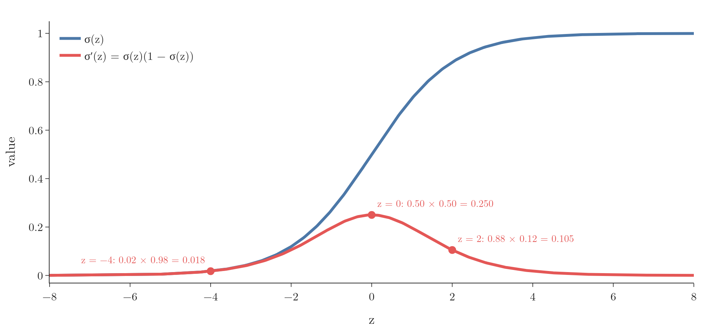

<!-- where-this-fits: generated by course_map/build_map.py; edit concepts.yaml, not this block -->
> **Where this fits:** Pipeline map step 8 (Model). See the [Course map](../01-course-map/note.md).
>
> 
>
> - **Leads to:** Logistic regression ([Note 75](../75-logistic-gradient-descent/note.md)); Gradient boosting ([Note 120](../120-gradient-boosting-intuition/note.md)); Multi-layer perceptron (MLP) ([Note 1003](../1003-nn-types-history-applications/note.md)); Backpropagation ([Note 1015](../1015-backpropagation-what/note.md)); Vanishing gradient ([Note 1018](../1018-vanishing-exploding-gradients/note.md)).
<!-- /where-this-fits -->

## 1. Overview

> **Key point:** The derivative of the sigmoid can be written using the sigmoid itself: σ′(z) = σ(z)(1 − σ(z)).

Gradient descent on the log loss (the next Note) needs the derivative of the sigmoid function. The same derivative appears again in neural networks, where the sigmoid is used inside every neuron. This short Note derives it once.

As a reminder, the sigmoid is

$$\sigma(z) = \frac{1}{1 + e^{-z}}$$

It squeezes any number into the range 0 to 1 (the sigmoid Note).

## 2. Two rules we need

> **Key point:** The chain rule, and the derivative of e^(−z), which is −e^(−z).

**Chain rule:** to differentiate a function of a function, differentiate the outer one, keep the inside, and multiply by the derivative of the inside. For a reciprocal:

$$\frac{d}{dz}\left(\frac{1}{u}\right) = -\frac{1}{u^2}\cdot\frac{du}{dz}$$

**Exponential:** the derivative of $e^{z}$ is $e^{z}$ itself. By the chain rule, the derivative of $e^{-z}$ is $e^{-z}$ times the derivative of $-z$, which is $-1$:

$$\frac{d}{dz}e^{-z} = -e^{-z}$$

## 3. The derivation

> **Key point:** Differentiate, then split the fraction into σ(z) times (1 − σ(z)).

### 3.1 Differentiate

> **Key point:** Treat σ(z) as 1/u with u = 1 + e^(−z).

Write $u = 1 + e^{-z}$, so $\sigma(z) = 1/u$. The derivative of $u$ is $0 + (-e^{-z}) = -e^{-z}$. Using the reciprocal rule:

$$\sigma'(z) = -\frac{1}{(1 + e^{-z})^2}\cdot\left(-e^{-z}\right) = \frac{e^{-z}}{(1 + e^{-z})^2}$$

The two minus signs cancel.

### 3.2 Split into two fractions

> **Key point:** One fraction is σ(z) itself; the other turns out to be 1 − σ(z).

Split the result into a product of two fractions:

$$\sigma'(z) = \frac{1}{1 + e^{-z}}\cdot\frac{e^{-z}}{1 + e^{-z}}$$

The first fraction is $\sigma(z)$. For the second, add and subtract 1 in the numerator:

$$\frac{e^{-z}}{1 + e^{-z}} = \frac{(1 + e^{-z}) - 1}{1 + e^{-z}} = 1 - \frac{1}{1 + e^{-z}} = 1 - \sigma(z)$$

### 3.3 The result

> **Key point:** σ′(z) = σ(z)(1 − σ(z)).

Putting the two pieces together:

$$\boxed{\sigma'(z) = \sigma(z)\,\bigl(1 - \sigma(z)\bigr)}$$

With numbers: at $z = 2$, $\sigma(2) = 0.88$, so $\sigma'(2) = 0.88 \times 0.12 = 0.105$.

This form is very convenient. When a model has already computed $\sigma(z)$ for its prediction, the derivative costs just one subtraction and one multiplication.

## 4. The shape of the derivative

> **Key point:** The derivative is largest, 0.25, at z = 0 and falls towards 0 on both sides.

{height=42%}

| $z$ | $-4$ | $-2$ | 0 | 2 | 4 |
|---|---|---|---|---|---|
| $\sigma(z)$ | 0.018 | 0.119 | 0.5 | 0.881 | 0.982 |
| $\sigma'(z)$ | 0.018 | 0.105 | 0.25 | 0.105 | 0.018 |

- At $z = 0$ the sigmoid is steepest: $0.5 \times 0.5 = 0.25$. This is the largest value the derivative can take.
- Far from 0, the sigmoid is almost flat, near 0 or 1, so its slope is almost 0.
- The curve is symmetric: $\sigma'(-z) = \sigma'(z)$.

> **Python:** The derivative, checked numerically.
>
> ```python
> def sigmoid(z):
>     return 1 / (1 + np.exp(-z))
>
> def sigmoid_derivative(z):
>     return sigmoid(z) * (1 - sigmoid(z))
>
> h = 1e-5
> (sigmoid(2 + h) - sigmoid(2 - h)) / (2 * h)   # 0.104994
> sigmoid_derivative(2)                          # 0.104994
> ```
>
> The numerical slope (rise over a tiny run) matches the formula to six decimals.

> **Extra:** Because the derivative is at most 0.25, and almost 0 for large or small $z$, stacking many sigmoid layers in a deep neural network multiplies many small numbers together. The gradients become tiny and learning stalls: the **vanishing gradient problem**. It is one reason deep networks mostly use other functions, such as ReLU, inside their hidden layers.

## 5. Summary

- $\sigma(z) = 1/(1 + e^{-z})$.
- $\sigma'(z) = \sigma(z)(1 - \sigma(z))$, found with the chain rule and one algebra step.
- The derivative peaks at 0.25 when $z = 0$ and approaches 0 far from it.
- The next Note uses it to derive the gradient of the log loss.

## 6. Key terms

| Term | Meaning |
|---|---|
| Derivative | The rate of change, or slope, of a function at a point |
| Chain rule | To differentiate a function of a function, multiply the outer derivative by the inner derivative |
| Vanishing gradient | Gradients shrinking towards 0 as they pass through many layers, which slows learning |
