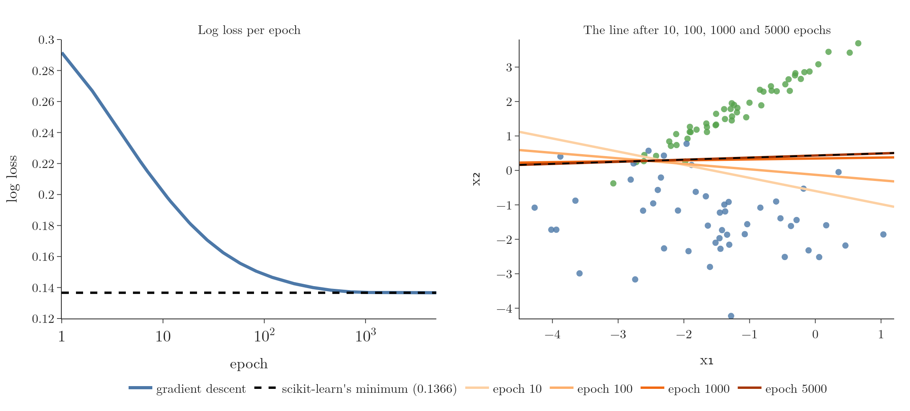

<!-- where-this-fits: generated by course_map/build_map.py; edit concepts.yaml, not this block -->
> **Where this fits:** Pipeline map step 8 (Model). See the [Course map](../01-course-map/note.md).
>
> 
>
> - **Builds on:** Classification problems ([Note 3](../03-types-of-ml/note.md)); Model-based learning ([Note 6](../06-instance-vs-model-based/note.md)); Gradient descent ([Note 57](../57-gradient-descent/note.md)); Polynomial features ([Note 61](../61-polynomial-regression/note.md)); Perceptron trick ([Note 71](../71-perceptron-code/note.md)); Log loss (binary cross entropy) ([Note 73](../73-log-loss/note.md)).
> - **Leads to:** Softmax regression (Video 79, coming).
> - **Compare with:** Decision trees (Video 97, coming).
<!-- /where-this-fits -->

## 1. Overview

> **Key point:** The gradient of the log loss is −(1/m) Xᵀ(y − ŷ). Gradient descent repeats w ← w + η (1/m) Xᵀ(y − ŷ), and reaches the same answer as scikit-learn.

The log loss Note gave logistic regression its loss function and noted that it has no closed-form minimum. This Note finishes the journey:

1. write the predictions and the loss in matrix form;
2. differentiate the loss with respect to the weights;
3. code gradient descent and check it against scikit-learn.

## 2. Predictions in matrix form

> **Key point:** All m predictions at once: ŷ = σ(Xw), where X has a first column of 1s.

### 2.1 One prediction

> **Key point:** For one row, ŷ = σ(w₀ + w₁x₁ + ... + wₙxₙ).

Take a dataset with $m$ rows and $n$ input columns. The model has $n + 1$ weights: $w_0$ (the intercept) and $w_1$ to $w_n$. The prediction for row $i$ is

$$\hat{y}_i = \sigma(w_0 + w_1 x_{i1} + w_2 x_{i2} + \dots + w_n x_{in})$$

### 2.2 All predictions together

> **Key point:** Stack the rows: the inner sums are the matrix product Xw.

Writing out all $m$ predictions, each inner sum is one row of $X$ (with a 1 added in front) times the weight vector $w$. So all of them together are a single matrix product:

$$\hat{y} = \sigma(Xw)$$

where $\sigma$ is applied to each entry. This is the same trick as in multiple linear regression.

{height=42%}

## 3. The loss in matrix form

> **Key point:** L = −(1/m)[yᵀ log ŷ + (1 − y)ᵀ log(1 − ŷ)].

The log loss from the previous Notes is

$$L = -\frac{1}{m}\sum_{i=1}^{m}\left[y_i \log \hat{y}_i + (1 - y_i)\log(1 - \hat{y}_i)\right]$$

The sum $\sum_i y_i \log \hat{y}_i$ multiplies matching entries of two vectors and adds them up, which is the dot product $y^{\mathsf T}\log \hat{y}$. So

$$L = -\frac{1}{m}\left[y^{\mathsf T}\log \hat{y} + (1 - y)^{\mathsf T}\log(1 - \hat{y})\right], \qquad \hat{y} = \sigma(Xw)$$

## 4. The gradient

> **Key point:** Differentiate each part with the chain rule; the sigmoid derivative cancels the logs, leaving −(1/m) Xᵀ(y − ŷ).

### 4.1 The first part

> **Key point:** The derivative of y log ŷ with respect to w is y(1 − ŷ) x.

For a single row, differentiate $y \log \hat{y}$ step by step with the chain rule:

- the derivative of $\log \hat{y}$ with respect to $\hat{y}$ is $1/\hat{y}$;
- the derivative of $\hat{y} = \sigma(z)$ with respect to $z$ is $\hat{y}(1 - \hat{y})$ (the sigmoid derivative Note);
- the derivative of $z = w \cdot x$ with respect to $w$ is $x$.

Multiplying: $y \cdot \frac{1}{\hat{y}} \cdot \hat{y}(1 - \hat{y}) \cdot x = y(1 - \hat{y})\,x$. The $\hat{y}$ cancels.

### 4.2 The second part

> **Key point:** The derivative of (1 − y) log(1 − ŷ) is −(1 − y) ŷ x.

In the same way, for $(1 - y)\log(1 - \hat{y})$:

- the derivative of $\log(1 - \hat{y})$ with respect to $\hat{y}$ is $-1/(1 - \hat{y})$;
- the rest of the chain is the same: $\hat{y}(1 - \hat{y})\,x$.

Multiplying: $(1 - y) \cdot \frac{-1}{1 - \hat{y}} \cdot \hat{y}(1 - \hat{y}) \cdot x = -(1 - y)\hat{y}\,x$.

### 4.3 Putting them together

> **Key point:** y(1 − ŷ) − (1 − y)ŷ simplifies to y − ŷ.

Adding the two parts:

$$y(1 - \hat{y}) - (1 - y)\hat{y} = y - y\hat{y} - \hat{y} + y\hat{y} = y - \hat{y}$$

So for one row, the derivative of the bracket is $(y - \hat{y})\,x$. Summing over all rows, with the $-\frac{1}{m}$ in front, and writing the sum as a matrix product:

$$\frac{\partial L}{\partial w} = -\frac{1}{m}\,X^{\mathsf T}(y - \hat{y})$$

$X^{\mathsf T}$ has shape $(n + 1) \times m$ and $(y - \hat{y})$ has shape $m \times 1$, so the gradient has shape $(n + 1) \times 1$: one slope per weight, the same shape as $w$ (Figure 1).

> **Extra:** This gradient has exactly the same form as the one for linear regression with mean squared error: $X^{\mathsf T}(\text{actual} - \text{predicted})$, scaled. The only difference is that the predictions now pass through the sigmoid.

## 5. The update rule

> **Key point:** w_new = w_old + η (1/m) Xᵀ(y − ŷ).

Gradient descent steps against the gradient:

$$w_{\text{new}} = w_{\text{old}} - \eta\,\frac{\partial L}{\partial w} = w_{\text{old}} + \frac{\eta}{m}\,X^{\mathsf T}(y - \hat{y})$$

Compare it with the sigmoid perceptron of the sigmoid Note: $w \leftarrow w + \eta(y - \hat{y})x$ for one random point. The new rule is the same idea, averaged over **all** points in each step. The perceptron was one-point stochastic gradient descent on this very loss, run for a fixed number of steps; batch gradient descent, run to the end, reaches the true minimum.

## 6. The code

> **Key point:** Add a column of 1s, then repeat: predict with the sigmoid, and update with Xᵀ(y − ŷ) / m.

> **Python:** Logistic regression with batch gradient descent.
>
> ```python
> def sigmoid(z):
>     return 1 / (1 + np.exp(-z))
>
> def gd(X, y, lr=0.5, epochs=5000):
>     X = np.insert(X, 0, 1, axis=1)          # column of 1s
>     w = np.ones(X.shape[1])
>     for _ in range(epochs):
>         y_hat = sigmoid(X @ w)              # all predictions
>         w = w + lr * (X.T @ (y - y_hat)) / X.shape[0]
>     return w[1:], w[0]                      # coef_, intercept_
> ```

## 7. Checking against scikit-learn

> **Key point:** After 5,000 epochs, the weights match scikit-learn's to three decimals.

The test data has 100 points with two inputs whose classes overlap a little (`make_classification`, `class_sep=1.5`, random state 4). scikit-learn's `LogisticRegression(penalty=None)` fits the same model without regularisation, so the two should agree.

{height=56%}

| | Intercept | $w_1$ | $w_2$ | Log loss |
|---|---|---|---|---|
| Start | 1 | 1 | 1 | |
| After 100 epochs | 0.360 | 0.454 | 2.850 | 0.1484 |
| After 1,000 epochs | $-1.227$ | $-0.094$ | 3.542 | 0.1368 |
| After 5,000 epochs | $-1.568$ | $-0.220$ | 3.623 | 0.1366 |
| scikit-learn | $-1.569$ | $-0.220$ | 3.623 | 0.1366 |

The loss falls quickly at first and then levels off at scikit-learn's minimum (Figure 2, left). The line turns into place and ends on top of scikit-learn's (right). The model classifies 92% of the points correctly; the rest lie in the overlap, where no straight line can be perfect.

> **Python:** The scikit-learn equivalent.
>
> ```python
> from sklearn.linear_model import LogisticRegression
>
> lor = LogisticRegression(penalty=None)   # no regularisation
> lor.fit(X, y)
> lor.intercept_, lor.coef_                # -1.569, [-0.220, 3.623]
> ```

> **Extra:** By default, `LogisticRegression` adds an L2 (Ridge) penalty with `C=1`, so its weights are slightly smaller than these. `penalty=None` switches it off to match our code; the hyperparameters Note covers the options.

## 8. Perfectly separable data

> **Key point:** If a line separates the classes perfectly, the loss can always be made smaller by making the weights larger, so the weights never settle.

On the data of the perceptron Notes, where the classes are perfectly separated (`class_sep=20`), something different happens:

| Epochs | Weights $(w_0, w_1, w_2)$ | Log loss |
|---|---|---|
| 500 | (3.63, 3.35, 0.11) | 0.0052 |
| 5,000 | (5.83, 4.84, 0.21) | 0.00063 |
| 50,000 | (8.20, 6.52, 0.37) | 0.00007 |

The weights keep growing, and the loss keeps shrinking towards 0 without ever reaching it.

The reason: once every point is on its correct side, multiplying all the weights by 2 keeps the same line but makes every $z$ twice as large, so every $\hat{y}$ moves closer to its correct 0 or 1. The loss always decreases, so there is no finite minimum. The line's **position** settles while its weights grow.

In practice this is handled by stopping after a fixed number of epochs, or by adding regularisation, which is one reason scikit-learn uses a penalty by default.

## 9. Summary

- Predictions: $\hat{y} = \sigma(Xw)$.
- Loss: $L = -\frac{1}{m}[y^{\mathsf T}\log\hat{y} + (1 - y)^{\mathsf T}\log(1 - \hat{y})]$.
- Gradient: $\frac{\partial L}{\partial w} = -\frac{1}{m}X^{\mathsf T}(y - \hat{y})$, thanks to $\sigma' = \sigma(1 - \sigma)$.
- Update: $w \leftarrow w + \frac{\eta}{m}X^{\mathsf T}(y - \hat{y})$; the code matches `LogisticRegression(penalty=None)`.
- On perfectly separable data the weights grow without limit; regularisation or early stopping keeps them finite.

## 10. Key terms

| Term | Meaning |
|---|---|
| Gradient | The vector of slopes of the loss, one for each weight |
| Batch gradient descent | Gradient descent that uses all rows for every update |
| penalty=None | LogisticRegression setting that switches regularisation off |
| Perfect separation | When a line splits the training classes with no mistakes; unregularised weights then grow without limit |
