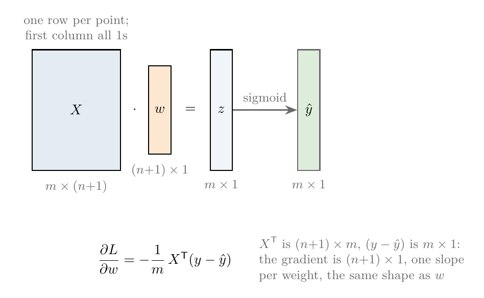
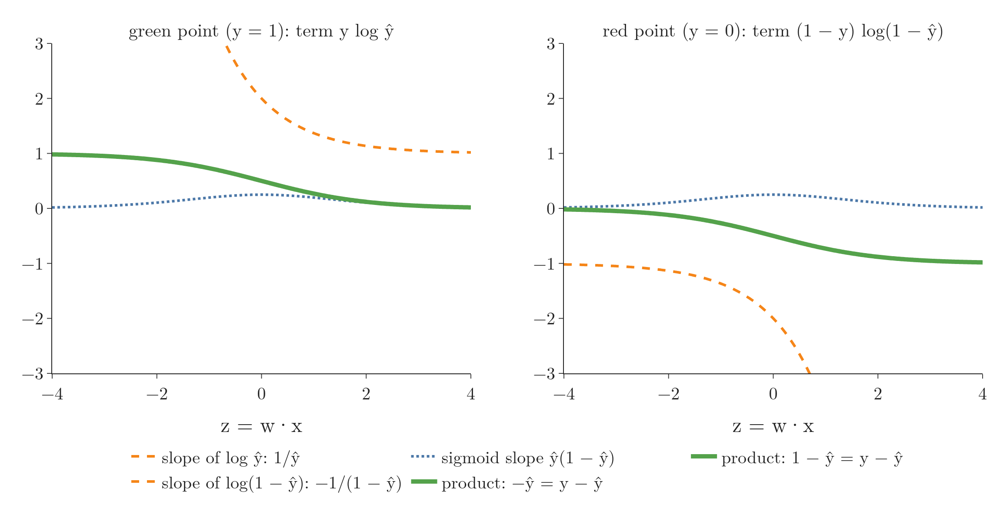
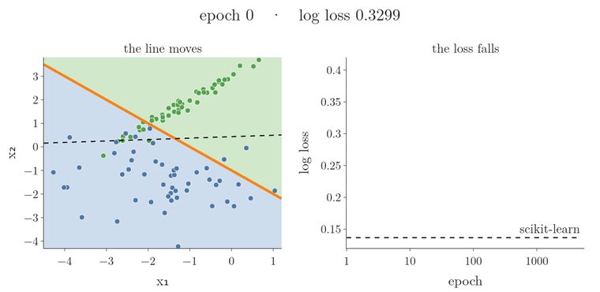
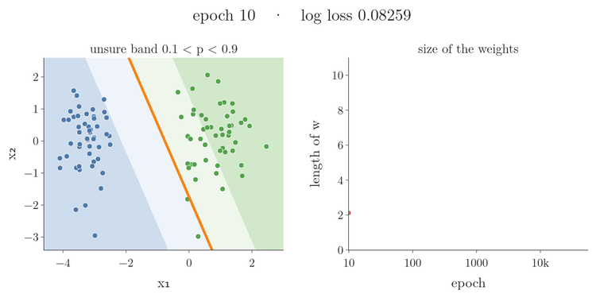

<!-- where-this-fits: generated by course_map/build_map.py; edit concepts.yaml, not this block -->
> **Where this fits:** Pipeline map step 8 (Model). See the [Course map](../01-course-map/note.md).
>
> 
>
> - **Builds on:** Classification problems ([Note 3](../03-types-of-ml/note.md)); Model-based learning ([Note 6](../06-instance-vs-model-based/note.md)); Gradient descent ([Note 57](../57-gradient-descent/note.md)); Polynomial features ([Note 61](../61-polynomial-regression/note.md)); Perceptron trick ([Note 70](../70-perceptron-trick/note.md)); Sigmoid function ([Note 72](../72-sigmoid-function/note.md)).
> - **Leads to:** Softmax regression ([Note 79](../79-softmax-regression/note.md)).
> - **Compare with:** Support vector machines ([Note 92](../92-svm-intuition/note.md)).
<!-- /where-this-fits -->

## 1. Overview

> **Key point:** The gradient of the log loss is −(1/m) Xᵀ(y − ŷ). Gradient descent repeats w ← w + η (1/m) Xᵀ(y − ŷ), and reaches the same answer as scikit-learn.

The log loss Note gave logistic regression its loss function and noted that it has no closed-form minimum. This Note finishes the journey:

1. watch gradient descent work on a model with a single weight;
2. write the predictions and the loss in matrix form;
3. differentiate the loss with respect to the **weights** (G-407; the coefficients, the numbers the model learns);
4. code gradient descent and check it against scikit-learn.

## 2. The idea on one weight

> **Key point:** Start with any weight. Measure the slope of the loss there. Step downhill by learning rate × slope. Far from the minimum the slope is large and the steps are big; close to it the slope is small and the steps are tiny.

**Gradient descent** (G-862) was built step by step in the [gradient descent Note](../57-gradient-descent/note.md). The recap in one line: the slope of the loss curve tells which way is downhill and how far away the bottom is, and each step moves the weight by the **learning rate** (G-1068) times that slope.

### 2.1 A model with one weight

To see the steps, take the smallest possible logistic regression: one **feature** (G-772) (an input variable), one weight $w$, no intercept. The data is 30 students; the feature is $x = \text{CGPA} - 6$ and the **target** (G-1949) (the output we predict) is $y = 1$ for placed and 0 for not placed. The model is $\hat y = \sigma(wx)$.

Figure 1 runs gradient descent on this model with learning rate 4, starting from $w = 0$. Watch the red ball on the left: its jumps shrink as the curve flattens. On the right, the S-curve of the current $w$ steepens until it fits the students.

![Gradient descent on one weight. Left: the log loss against w, with the ball at the current weight; each step is the learning rate (4) times the slope under the ball. Right: the curve σ(wx) for the current w over the 30 students (green: placed, blue: not placed). The steps shrink from 1.640 to 0.020 over 60 steps while the log loss falls from 0.693 to 0.152. The picture of a ball taking big steps far from the minimum and small steps near it follows StatQuest, "Gradient Descent, Step-by-Step"; the data and model are our own](images/one_weight.gif)

| Step | $w$ before | Log loss | Slope of the loss | Step = $-4 \times$ slope | $w$ after |
|---|---|---|---|---|---|
| 1 | 0 | 0.693 | $-0.410$ | 1.640 | 1.640 |
| 2 | 1.640 | 0.300 | $-0.119$ | 0.476 | 2.116 |
| 3 | 2.116 | 0.253 | $-0.082$ | 0.328 | 2.445 |
| 4 | 2.445 | 0.229 | $-0.064$ | 0.254 | 2.699 |

The slope is negative, so the loss falls as $w$ grows, and every step moves $w$ to the right. After 60 steps the slope is $-0.005$ and the step is down to 0.020.

### 2.2 Where the slope comes from: one student

The slope in the table is an average over the 30 students. One student shows what goes into it. Take a student with CGPA 6.8 who was placed: $x = 0.8$, $y = 1$. At $w = 0$:

1. **Predict.** $\hat y = \sigma(0 \times 0.8) = \sigma(0) = 0.5$.
2. **Error.** $y - \hat y = 1 - 0.5 = 0.5$. The prediction is too low.
3. **This student's slope.** $-(y - \hat y)\thinspace x = -0.5 \times 0.8 = -0.4$.
4. **This student's vote for the step.** $-4 \times (-0.4) = +1.6$: raise $w$, which raises $\hat y$ for this student.

Every student gives such a slope, $-(y_i - \hat y_i)x_i$. Their average at $w = 0$ is the $-0.410$ of the table. Sections 3 to 5 show where the expression $-(y - \hat y)x$ comes from and write it for any number of features at once.

## 3. Predictions in matrix form

> **Key point:** All m predictions at once: ŷ = σ(Xw), where X has a first column of 1s.

### 3.1 One prediction

> **Key point:** For one observation, ŷ = σ(w₀ + w₁x₁ + ... + wₙxₙ).

Take a dataset with $m$ **observations** (G-1374) (records, one row of the data table each) and $n$ features (one column each). The target $y$ is the class, 0 or 1. The model has $n + 1$ weights: $w_0$ (the **intercept** (G-960), the part of the prediction that does not depend on any feature) and $w_1$ to $w_n$. The prediction for observation $i$ is

$$\hat y_i = \sigma(w_0 + w_1 x_{i1} + w_2 x_{i2} + \dots + w_n x_{in})$$

### 3.2 All predictions together

> **Key point:** Stack the rows: the inner sums are the matrix product Xw.

Writing out all $m$ predictions, each inner sum is one row of $X$ (with a 1 added in front) times the weight vector $w$. So all of them together are a single matrix product:

$$\hat{y} = \sigma(Xw)$$

where $\sigma$ is applied to each entry. Stacking the predictions as $Xw$ is the same trick as in multiple linear regression.

{height=42%}

In Figure 2, read the top row left to right: the $m$ rows of $X$ times the one column $w$ give one $z$ per observation, and the sigmoid turns each $z$ into a prediction.

## 4. The loss in matrix form

> **Key point:** L = −(1/m)[yᵀ log ŷ + (1 − y)ᵀ log(1 − ŷ)].

The log loss from the previous Notes is

$$L = -\frac{1}{m}\sum_{i=1}^{m}\left[y_i \log \hat y_i + (1 - y_i)\log(1 - \hat y_i)\right]$$

The sum $\sum_i y_i \log \hat y_i$ multiplies matching entries of two vectors and adds them up, which is the **dot product** (G-634) $y^{\mathsf T}\log \hat{y}$. So

$$L = -\frac{1}{m}\left[y^{\mathsf T}\log \hat{y} + (1 - y)^{\mathsf T}\log(1 - \hat{y})\right], \qquad \hat{y} = \sigma(Xw)$$

## 5. The gradient

> **Key point:** Differentiate each part with the chain rule; the sigmoid derivative cancels the logs, leaving −(1/m) Xᵀ(y − ŷ).

### 5.1 The first part

> **Key point:** The derivative of y log ŷ with respect to w is y(1 − ŷ) x.

For a single observation, differentiate $y \log \hat{y}$ step by step with the **chain rule** (G-371) (multiply the derivatives of the nested steps):

- the derivative of $\log \hat{y}$ with respect to $\hat{y}$ is $1/\hat{y}$;
- the derivative of $\hat{y} = \sigma(z)$ with respect to $z$ is $\hat{y}(1 - \hat{y})$ (the sigmoid derivative Note);
- the derivative of $z = w \cdot x$ with respect to $w$ is $x$.

Multiplying: $y \cdot \frac{1}{\hat{y}} \cdot \hat{y}(1 - \hat{y}) \cdot x = y(1 - \hat{y})\thinspace x$. The $\hat{y}$ cancels.

### 5.2 The second part

> **Key point:** The derivative of (1 − y) log(1 − ŷ) is −(1 − y) ŷ x.

In the same way, for $(1 - y)\log(1 - \hat{y})$:

- the derivative of $\log(1 - \hat{y})$ with respect to $\hat{y}$ is $-1/(1 - \hat{y})$;
- the rest of the chain is the same: $\hat{y}(1 - \hat{y})\thinspace x$.

Multiplying: $(1 - y) \cdot \frac{-1}{1 - \hat{y}} \cdot \hat{y}(1 - \hat{y}) \cdot x = -(1 - y)\hat{y}\thinspace x$.

### 5.3 Putting them together

> **Key point:** y(1 − ŷ) − (1 − y)ŷ simplifies to y − ŷ.

Adding the two parts:

$$y(1 - \hat{y}) - (1 - y)\hat{y} = y - y\hat{y} - \hat{y} + y\hat{y} = y - \hat{y}$$

{height=45%}

In Figure 3, watch the green product stay between −1 and 1 even where the orange slope shoots off the chart: the two chain-rule factors cancel exactly.

So for one observation, the derivative of the bracket is $(y - \hat{y})\thinspace x$. Summing over all observations, with the $-\frac{1}{m}$ in front, and writing the sum as a matrix product:

$$\frac{\partial L}{\partial w} = -\frac{1}{m}\thinspace X^{\mathsf T}(y - \hat{y})$$

$X^{\mathsf T}$ has shape $(n + 1) \times m$ and $(y - \hat{y})$ has shape $m \times 1$, so the **gradient** (G-863) has shape $(n + 1) \times 1$: one slope per weight, the same shape as $w$ (Figure 2).

> **Extra:** This gradient has exactly the same form as the one for linear regression with mean squared error: $X^{\mathsf T}(\text{actual} - \text{predicted})$, scaled. The only difference is that the predictions now pass through the sigmoid (Bishop §4.3.2).

## 6. The update rule

> **Key point:** w_new = w_old + η (1/m) Xᵀ(y − ŷ).

Gradient descent steps against the gradient, as in section 2. The step size $\eta$ is the learning rate:

$$w_{\text{new}} = w_{\text{old}} - \eta\thinspace\frac{\partial L}{\partial w} = w_{\text{old}} + \frac{\eta}{m}\thinspace X^{\mathsf T}(y - \hat{y})$$

Compare it with the sigmoid perceptron of the sigmoid Note: $w \leftarrow w + \eta(y - \hat{y})x$ for one random point. The new rule is the same idea, averaged over **all** points in each step. The perceptron was one-point **stochastic gradient descent** (G-1892) on this very loss, run for a fixed number of steps. **Batch gradient descent** (G-264) uses all points in every step and, run to the end, reaches the true minimum.

| | Sigmoid perceptron | Batch gradient descent |
|---|---|---|
| Update | $w \leftarrow w + \eta\thinspace(y_i - \hat y_i)\thinspace x_i$ | $w \leftarrow w + \eta\thinspace\frac{1}{m}\sum_{i}(y_i - \hat y_i)\thinspace x_i$ |
| Points used per update | one, picked at random | all $m$, averaged |

Each point pulls the weights with a strength equal to its error $y_i - \hat y_i$. Figure 4 draws that strength as the size of each point on the data of section 8.


1. **Epoch 0:** many circles are large (average error size 0.23). Their average pull is strong, so the boundary moves quickly.
2. **Epoch 20:** points far from the boundary on their correct side have shrunk to dots: a small error means a weak pull.
3. **Epoch 5,000:** the large circles left are the points in the overlap, on the wrong side or close to the boundary (average error size 0.09). The pulls from the two classes cancel in the average, so the update is close to zero.

{height=45%}

In Figure 5, watch the orange curve jitter above the dashed minimum (0.1383 after 5,000 updates) while the blue curve settles onto it (0.1366): each one-point step pulls towards a single point, the batch step towards all of them.

## 7. The code

> **Key point:** Add a column of 1s, then repeat: predict with the sigmoid, and update with Xᵀ(y − ŷ) / m.

> **Python:** Logistic regression with batch gradient descent.
>
> ```python
> def sigmoid(z):
>     return 1 / (1 + np.exp(-z))
>
> def gd(X, y, lr=0.5, epochs=5000):
>     X = np.insert(X, 0, 1, axis=1)          # column of 1s
>     w = np.ones(X.shape[1])
>     for _ in range(epochs):
>         y_hat = sigmoid(X @ w)              # all predictions
>         w = w + lr * (X.T @ (y - y_hat)) / X.shape[0]
>     return w[1:], w[0]                      # coef_, intercept_
> ```

## 8. Checking against scikit-learn

> **Key point:** After 5,000 epochs, the weights match scikit-learn's to three decimals.

One **epoch** (G-696) is one pass over all the training points; batch gradient descent makes one update per epoch.

The test data has 100 points with two features whose classes overlap a little (`make_classification`, `class_sep=1.5`, random state 4). scikit-learn's `LogisticRegression(penalty=None)` fits the same model without regularisation, so the two should agree.

{height=56%}

In Figure 6, watch the orange line, the **decision boundary** (G-555) where $p = 0.5$, swing from its start at w = (1, 1, 1) onto scikit-learn's dashed decision boundary while the loss curve flattens onto the dashed minimum.

| | Intercept | $w_1$ | $w_2$ | Log loss |
|---|---|---|---|---|
| Start | 1 | 1 | 1 | |
| After 100 epochs | 0.360 | 0.454 | 2.850 | 0.1484 |
| After 1,000 epochs | $-1.227$ | $-0.094$ | 3.542 | 0.1368 |
| After 5,000 epochs | $-1.568$ | $-0.220$ | 3.623 | 0.1366 |
| scikit-learn | $-1.569$ | $-0.220$ | 3.623 | 0.1366 |

The loss falls quickly at first and then levels off at scikit-learn's minimum (Figure 6, right). The decision boundary turns into place and ends on top of scikit-learn's (left). The model classifies 92% of the points correctly; the rest lie in the overlap, where no straight decision boundary can be perfect.

> **Python:** The scikit-learn equivalent.
>
> ```python
> from sklearn.linear_model import LogisticRegression
>
> lor = LogisticRegression(penalty=None)   # no regularisation
> lor.fit(X, y)
> lor.intercept_, lor.coef_                # -1.569, [-0.220, 3.623]
> ```

> **Extra:** By default, `LogisticRegression` adds an L2 (Ridge) penalty with `C=1`, so its weights are slightly smaller than these. `penalty=None` switches it off to match our code; the hyperparameters Note covers the options.

## 9. Perfectly separable data

> **Key point:** If a straight decision boundary separates the classes perfectly, the loss can always be made smaller by making the weights larger, so the weights never settle.

On the data of the perceptron Notes, where the classes are perfectly separated (`class_sep=20`), something different happens. This case is called **perfect separation** (G-1487):

| Epochs | Weights $(w_0, w_1, w_2)$ | Log loss |
|---|---|---|
| 500 | (3.63, 3.35, 0.11) | 0.0052 |
| 5,000 | (5.83, 4.84, 0.21) | 0.00063 |
| 50,000 | (8.20, 6.52, 0.37) | 0.00007 |

The weights keep growing, and the loss keeps shrinking towards 0 without ever reaching it.

{height=56%}

In Figure 7, the decision boundary turns only slowly, yet the weights keep growing and the unsure band keeps narrowing: the model grows ever more confident instead of settling.

The reason: once every point is on its correct side, multiplying all the weights by 2 keeps the same decision boundary but makes every $z$ twice as large, so every $\hat{y}$ moves closer to its correct 0 or 1. The loss always decreases, so there is no finite minimum (Bishop §4.3.2). The decision boundary itself still turns slowly: its slope $-w_1/w_2$ goes from $-30$ to $-23$ to $-18$ in the table. Gradient descent turns it towards the decision boundary with the widest gap, but only very slowly (Soudry et al. 2018).

In practice this is handled by stopping after a fixed number of epochs, or by adding **regularisation** (G-1659), a penalty on large weights in the loss, the standard fix (Bishop §4.3.2). scikit-learn uses a penalty by default.

## 10. Summary

- Each step moves the weights by the learning rate times the slope of the loss: big steps far from the minimum, tiny steps near it.
- Predictions: $\hat{y} = \sigma(Xw)$.
- Loss: $L = -\frac{1}{m}[y^{\mathsf T}\log\hat{y} + (1 - y)^{\mathsf T}\log(1 - \hat{y})]$.
- Gradient: $\frac{\partial L}{\partial w} = -\frac{1}{m}X^{\mathsf T}(y - \hat{y})$, thanks to $\sigma' = \sigma(1 - \sigma)$.
- Update: $w \leftarrow w + \frac{\eta}{m}X^{\mathsf T}(y - \hat{y})$; the code matches `LogisticRegression(penalty=None)`.
- On perfectly separable data the weights grow without limit; regularisation or early stopping keeps them finite.

## 11. Sources

**Built from**

- CampusX, "Logistic Regression Part 5 | Gradient Descent & Code From Scratch", YouTube, https://www.youtube.com/watch?v=ABrrSwMYWSg
- StatQuest with Josh Starmer, "Gradient Descent, Step-by-Step", YouTube, https://www.youtube.com/watch?v=sDv4f4s2SB8

**Other references**

- **Bishop:** Bishop, C. M. *Pattern Recognition and Machine Learning*. Springer, 2006. Section 4.3.2, pp. 205–207.
- **Soudry et al. 2018:** Soudry, D., Hoffer, E., Nacson, M. S., Gunasekar, S. and Srebro, N. "The Implicit Bias of Gradient Descent on Separable Data." *Journal of Machine Learning Research* 19(70), 1–57, 2018.

## 12. Key terms

| Term | Meaning |
|---|---|
| Decision boundary | The line where the model's probability is exactly 0.5; one class is predicted on each side |
| Learning rate ($\eta$) | The step size $\eta$ that scales each gradient descent update |
| Epoch | One pass over all the training points |
| Gradient (G-863) | The vector of slopes of the loss, one for each weight |
| Batch gradient descent | Gradient descent that uses all observations for every update |
| penalty=None | LogisticRegression setting that switches regularisation off |
| Perfect separation | When a straight decision boundary splits the training classes with no mistakes; unregularised weights then grow without limit |
