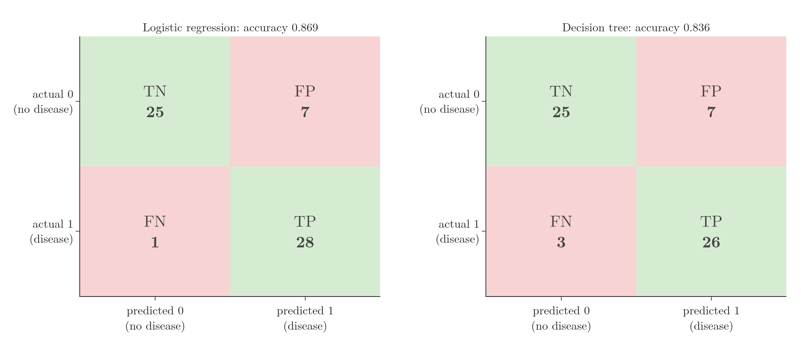

<!-- where-this-fits: generated by course_map/build_map.py; edit concepts.yaml, not this block -->
> **Where this fits:** Pipeline map step 9 (Evaluate). See the [Course map](../01-course-map/note.md).
>
> 
>
> - **Builds on:** Imbalanced data ([Note 9](../09-mldlc/note.md)); Train-test split ([Note 13](../13-toy-project/note.md)).
> - **Leads to:** Precision, recall and F1 ([Note 77](../77-precision-recall-f1/note.md)); ROC curve and AUC ([Note 78](../78-roc-auc/note.md)); ANN for classification ([Note 1011](../1011-customer-churn-ann/note.md)).
> - **Compare with:** Type I and II errors, power, tails ([Note 292](../292-errors-power-and-tails/note.md)).
<!-- /where-this-fits -->

## 1. Overview

> **Key point:** Accuracy is the fraction of correct predictions. The confusion matrix splits the predictions into four counts, which also show what kind of mistakes a model makes.

Regression models were judged with regression metrics such as R² (the regression metrics Note). Classification models need their own **classification metrics**. There are several: accuracy, the confusion matrix, precision, recall, F1 score, ROC-AUC and more.

This Note covers the first two. The following Notes build on the confusion matrix.

## 2. Accuracy

> **Key point:** Accuracy = number of correct predictions / total number of predictions.

### 2.1 The idea

> **Key point:** Compare each prediction with the true label and count how many match.

Suppose we train two models on the student placement data, for example logistic regression and a decision tree (a later Note), and predict the test students. For each test student we know the true result, so we can tick each prediction as right or wrong.

$$\text{accuracy} = \frac{\text{number of correct predictions}}{\text{total number of predictions}}$$

With numbers: if a model gets 8 of 10 test students right, its accuracy is $8/10 = 0.8$, or 80%. A model with 9 of 10 right (90%) is better on this test set.

### 2.2 A real example

> **Key point:** On the heart-disease data, logistic regression reaches 0.869 and a decision tree 0.836.

The heart-disease dataset has 303 patients, 13 medical measurements each (age, blood pressure, cholesterol and so on), and a target: 1 if the patient has heart disease, 0 if not. We split off 20% as the test set (random state 2) and train both models.

> **Python:** Accuracy in scikit-learn.
>
> ```python
> from sklearn.metrics import accuracy_score
>
> lr = make_pipeline(StandardScaler(), LogisticRegression())
> lr.fit(X_train, y_train)
> accuracy_score(y_test, lr.predict(X_test))     # 0.869
> ```

| Model | Test accuracy |
|---|---|
| Logistic regression (inputs standardised) | 0.869 |
| Decision tree | 0.836 |

So, on this test set, logistic regression is the better model.

### 2.3 More than two classes

> **Key point:** Accuracy is computed the same way for any number of classes.

Nothing changes with more classes, for example the three iris species: count the correct predictions and divide by the total. Logistic regression on the iris test set (30 flowers) gets 29 right: accuracy 0.967.

## 3. How much accuracy is good enough?

> **Key point:** It depends on the problem. 99% can be far too low for cancer detection and plenty for predicting food orders.

A common interview question is "what accuracy should a model have?". There is no single number; it depends on the cost of a mistake.

- **Cancer detection from X-rays:** 99% accuracy means one patient in a hundred gets a wrong answer. That is not acceptable.
- **Self-driving car decisions:** 99% means an error every hundred decisions. Also not acceptable.
- **Predicting whether a customer orders food this weekend:** 80% may be perfectly useful, because a wrong guess costs little.

## 4. The confusion matrix

> **Key point:** A table of actual classes against predicted classes. For two classes it has four counts: TN, FP, FN and TP.

### 4.1 What accuracy hides

> **Key point:** Accuracy says how many mistakes there are, not which kind.

A model with 90% accuracy makes mistakes 10% of the time. But in a two-class problem there are two kinds of mistake:

- a patient **has** heart disease, but the model says no;
- a patient does **not** have heart disease, but the model says yes.

These have very different consequences, and accuracy cannot tell them apart. The **confusion matrix** can.

### 4.2 Reading it

> **Key point:** Rows are the actual classes, columns the predicted ones. The diagonal holds the correct predictions.

Figure 1 shows the confusion matrices of both models on the heart-disease test set (61 patients).

{height=50%}

In scikit-learn's layout, each **row** is an actual class and each **column** a predicted class. For logistic regression:

| | Predicted 0 (no disease) | Predicted 1 (disease) |
|---|---|---|
| **Actual 0 (no disease)** | 25: true negatives (TN) | 7: false positives (FP) |
| **Actual 1 (disease)** | 1: false negatives (FN) | 28: true positives (TP) |

- **True positives (28):** patients with heart disease that the model correctly flagged.
- **True negatives (25):** healthy patients correctly cleared.
- **False positives (7):** healthy patients wrongly flagged as ill.
- **False negatives (1):** an ill patient the model missed.

The decision tree makes the same 7 false positives but 3 false negatives. So most of its extra errors are of the more dangerous kind: missed patients.

> **Extra:** Some books and websites draw the matrix the other way round, with predictions as rows. Always check the axis labels before reading one.

### 4.3 The names

> **Key point:** The second word is what the model predicted; the first word says whether that was right.

{width=85%}

- **Positive / Negative** is the model's prediction: 1 or 0.
- **True / False** says whether that prediction was correct.

So a "false positive" is a prediction of 1 that was wrong (the truth was 0). A "true negative" is a prediction of 0 that was right.

### 4.4 Type I and Type II errors

> **Key point:** A false positive is a Type I error; a false negative is a Type II error.

These two error types also have names from statistics:

| Error | Meaning | Heart example |
|---|---|---|
| **Type I error** = false positive | predicted 1, truly 0 | a healthy patient told they have heart disease |
| **Type II error** = false negative | predicted 0, truly 1 | an ill patient told they are healthy |

### 4.5 Accuracy from the confusion matrix

> **Key point:** Accuracy = (TP + TN) / (TP + TN + FP + FN): the diagonal over the total.

The correct predictions are on the diagonal, so

$$\text{accuracy} = \frac{TP + TN}{TP + TN + FP + FN} = \frac{28 + 25}{28 + 25 + 7 + 1} = \frac{53}{61} = 0.869$$

The confusion matrix gives the accuracy, but the accuracy cannot give back the confusion matrix: it carries less information.

> **Python:** The confusion matrix in scikit-learn.
>
> ```python
> from sklearn.metrics import confusion_matrix
>
> confusion_matrix(y_test, lr.predict(X_test))
> # [[25  7]
> #  [ 1 28]]
> tn, fp, fn, tp = confusion_matrix(y_test, y_pred).ravel()
> ```

## 5. More than two classes

> **Key point:** With k classes the confusion matrix is k × k. The diagonal is still the correct predictions; every other cell is a specific confusion.

{height=45%}

- **Iris** (left): 3 × 3. The one mistake is a versicolor flower predicted as virginica (row versicolor, column virginica).
- **Digits** (right): 10 × 10, from scikit-learn's 8 × 8 pixel images of handwritten digits. Logistic regression gets 97.2% right. The off-diagonal cells show exactly which digits get confused: for example, two 8s were read as 5s.

Accuracy is again the diagonal total divided by the grand total.

## 6. When accuracy misleads: imbalanced data

> **Key point:** If one class is very rare, a model that always predicts the common class gets very high accuracy while being useless.

Data is **imbalanced** when one class is much rarer than the other.

Imagine a model that screens airline passengers for security threats. Out of 100,000 passengers, perhaps 10 are real threats. A "model" that simply says "not a threat" for everyone gets

| | Predicted 0 | Predicted 1 |
|---|---|---|
| **Actual 0** | 99,990 | 0 |
| **Actual 1** | 10 | 0 |

$$\text{accuracy} = \frac{99{,}990}{100{,}000} = 0.9999$$

An accuracy of 99.99%, for a model that catches none of the 10 threats. The confusion matrix shows the problem at once: all 10 positives are false negatives.

So on imbalanced data, accuracy alone is the wrong metric. The next Note introduces **precision** and **recall**, which focus on the rare class.

## 7. Summary

| Term | Meaning | Heart, logistic regression |
|---|---|---|
| TP | predicted 1, truly 1 | 28 |
| TN | predicted 0, truly 0 | 25 |
| FP (Type I) | predicted 1, truly 0 | 7 |
| FN (Type II) | predicted 0, truly 1 | 1 |
| Accuracy | $(TP + TN)$ / total | 0.869 |

- Accuracy is simple and works for any number of classes, but "good enough" depends on the problem.
- The confusion matrix shows the kind of each mistake; rows are actual, columns predicted in scikit-learn.
- On imbalanced data, accuracy can be near 100% for a useless model.

## 8. Key terms

| Term | Meaning |
|---|---|
| Classification metric | A number that measures how well a classification model performs |
| Accuracy | The fraction of predictions that are correct |
| Confusion matrix | A table counting predictions for every pair of actual and predicted class |
| True positive (TP) | Predicted positive, and actually positive |
| True negative (TN) | Predicted negative, and actually negative |
| False positive (FP) | Predicted positive, but actually negative; a Type I error |
| False negative (FN) | Predicted negative, but actually positive; a Type II error |
| Imbalanced data | Data in which one class is much rarer than another |
