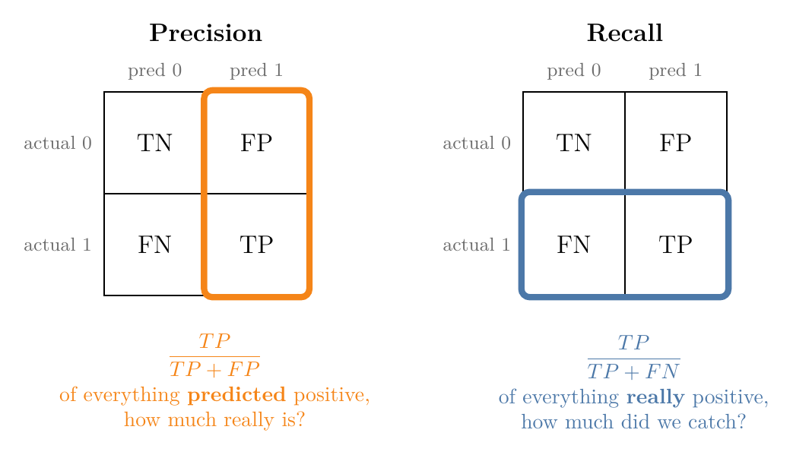
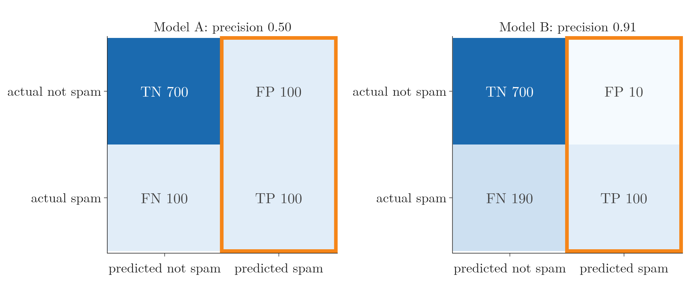
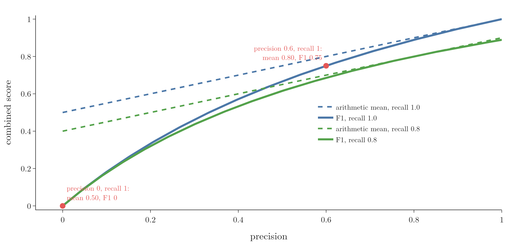
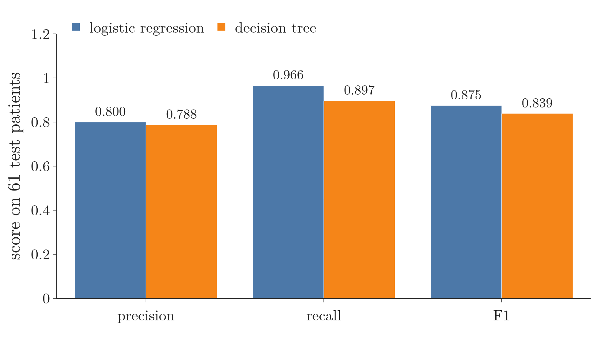
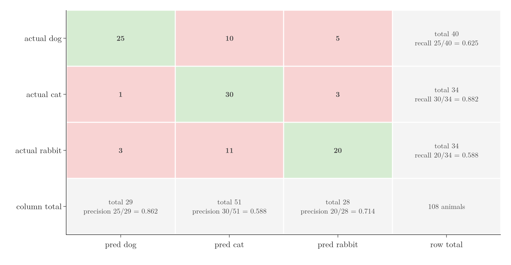

<!-- where-this-fits: generated by course_map/build_map.py; edit concepts.yaml, not this block -->
> **Where this fits:** Pipeline map step 9 (Evaluate). See the [Course map](../01-course-map/note.md).
>
> 
>
> - **Builds on:** Imbalanced data ([Note 9](../09-mldlc/note.md)); Confusion matrix ([Note 76](../76-accuracy-confusion-matrix/note.md)).
> - **Leads to:** ROC curve and AUC ([Note 78](../78-roc-auc/note.md)).
<!-- /where-this-fits -->

## 1. Overview

> **Key point:** Precision asks "of everything predicted positive, how much really is?". Recall asks "of everything really positive, how much did we catch?". F1 combines them into one number.

The previous Note showed that accuracy can be misleading, especially on imbalanced data, and that it hides which kind of mistake a model makes. This Note introduces three metrics built from the **confusion matrix** (G-449) that fix this: **precision** (G-1547), **recall** (G-1641) and the **F1 score** (G-743).

{height=42%}

## 2. Precision

> **Key point:** Precision = TP / (TP + FP). Use it when false positives are the expensive mistake.

### 2.1 A spam filter

> **Key point:** Two spam filters with the same accuracy can differ a lot in false positives.

Two team members each build a spam filter, tested on 1,000 emails. Spam is the positive class.

| | TP | FP | FN | TN | Accuracy |
|---|---|---|---|---|---|
| Model A | 100 | 100 | 100 | 700 | 0.80 |
| Model B | 100 | 10 | 190 | 700 | 0.80 |

Both have accuracy 0.80, so accuracy cannot choose between them. They differ in the kind of mistake:

- **False positive:** a normal email sent to the spam folder.
- **False negative:** a spam email left in the inbox.

A missed job offer in the spam folder is far worse than an extra advert in the inbox. So here false positives are the expensive mistake, and we want the model with fewer of them: model B.

### 2.2 The formula

> **Key point:** Of all the emails the model called spam, the fraction that really were spam.

$$\text{precision} = \frac{TP}{TP + FP}$$

In words: of everything the model **predicted** positive, how much really was positive? Precision uses the "predicted 1" column of the confusion matrix (Figure 1, left).

- Model A: $100 / (100 + 100) = 0.50$. Half of what it calls spam is not spam.
- Model B: $100 / (100 + 10) = 0.91$.

Model B has the higher precision, matching the choice above. Figure 2 shows where the two numbers come from: precision reads only the outlined "predicted spam" column, and model B's column holds far fewer false positives.



## 3. Recall

> **Key point:** Recall = TP / (TP + FN). Use it when false negatives are the expensive mistake.

### 3.1 A cancer detector

> **Key point:** In medical screening, missing a sick patient is the expensive mistake.

Two models screen 1,000 chest X-rays for cancer (cancer is the positive class):

| | TP | FP | FN | TN | Accuracy |
|---|---|---|---|---|---|
| Model A | 150 | 90 | 10 | 750 | 0.90 |
| Model B | 100 | 40 | 60 | 800 | 0.90 |

Again the accuracies are equal. Now:

- **False positive:** a healthy patient is told they may have cancer. Further tests will clear them.
- **False negative:** a patient with cancer is told they are fine, and goes untreated.

The false negative is far more dangerous, so we want the model with fewer of them: model A.

### 3.2 The formula

> **Key point:** Of all the patients who really have cancer, the fraction the model found.

$$\text{recall} = \frac{TP}{TP + FN}$$

In words: of everything that **really** is positive, how much did the model catch? Recall uses the "actual 1" row of the confusion matrix (Figure 1, right).

- Model A: $150 / (150 + 10) = 0.94$.
- Model B: $100 / (100 + 60) = 0.63$.

Model A has the higher recall, matching the choice above.

> **Extra:** Recall is also called **sensitivity** or the **true positive rate** (G-2022) (Fawcett 2006, §2). "Sensitivity" is the name used for medical diagnostic tests (Altman and Bland 1994).

### 3.3 Choosing between them

> **Key point:** Decide which mistake costs more. False positives worse: precision. False negatives worse: recall.

| Problem | Worse mistake | Metric to watch |
|---|---|---|
| Spam filter | FP: losing a real email | precision |
| Cancer screening | FN: missing a patient | recall |
| Fraud alerts that block cards | FP: blocking honest customers | precision |
| Airport threat screening | FN: missing a threat | recall |

Precision and recall usually pull against each other: making a model flag more cases catches more true positives (higher recall) but also more false alarms (lower precision). A later Note looks at this trade-off (scikit-learn docs, "Precision-Recall" example).

Figure 3 shows the pull on the heart-disease test set of section 5 (61 patients). The logistic regression gives every patient a probability of disease, and a patient is flagged when that probability passes the threshold; scikit-learn uses 0.5. Watch the threshold slide: moving it left catches every patient (recall 1.00) but turns healthy people into false alarms (precision 0.56 at 0.05); moving it right clears the false alarms (precision 1.00 at 0.95) but misses most patients (recall 0.38).


## 4. F1 score

> **Key point:** F1 = 2PR / (P + R), the harmonic mean of precision and recall. F1 is high only if both are high.

### 4.1 When neither mistake clearly matters more

> **Key point:** Sometimes both errors matter equally, and one number is needed.

For a model that tells cats from dogs, calling a cat a dog is no worse than the reverse. Both precision and recall matter, and comparing two numbers for every model is awkward. The **F1 score** combines them.

### 4.2 Why the harmonic mean

> **Key point:** The harmonic mean is pulled towards the smaller value, so a model cannot hide a bad precision behind a good recall.

$$F_1 = \frac{2 \times \text{precision} \times \text{recall}}{\text{precision} + \text{recall}}$$

This formula is the **harmonic mean** (G-880) of the two, not the ordinary (arithmetic) average.

An everyday picture: a chain is only as strong as its weakest link. F1 behaves the same way: one weak score drags the whole number down, however good the other score is.

| Precision | Recall | Arithmetic mean | F1 |
|---|---|---|---|
| 0.8 | 0.8 | 0.80 | 0.80 |
| 0.6 | 1.0 | 0.80 | 0.75 |
| 0.0 | 1.0 | 0.50 | 0.00 |

- When both are equal, the two means agree.
- When they differ, F1 stays closer to the smaller one. The second model has the same average as the first but a weak precision, and F1 penalises it.
- A model that flags everything as positive has recall 1 but may have precision near 0. The average would still give it 0.5; F1 gives 0.

{height=50%}

## 5. In scikit-learn

> **Key point:** precision_score, recall_score and f1_score; by default they report the positive class (1).

> **Python:** Precision, recall and F1.
>
> ```python
> from sklearn.metrics import precision_score, recall_score, f1_score
>
> precision_score(y_test, y_pred)   # 0.800
> recall_score(y_test, y_pred)      # 0.966
> f1_score(y_test, y_pred)          # 0.875
> ```

On the heart-disease test set of the previous Note:

| Model | Precision | Recall | F1 |
|---|---|---|---|
| Logistic regression (standardised) | 0.800 | 0.966 | 0.875 |
| Decision tree | 0.788 | 0.897 | 0.839 |

Logistic regression misses fewer patients (higher recall), which matters most for a disease. Figure 5 draws the table: the two models are close on precision, and the gap in recall carries over into F1.



> **Extra:** In a two-class problem, scikit-learn reports the scores of class 1. With `average=None` it shows both classes: for logistic regression, precision is 0.962 for class 0 and 0.800 for class 1. The default comes from the setting `pos_label=1` (scikit-learn docs, `precision_score`).

## 6. More than two classes

> **Key point:** Compute precision, recall and F1 for each class, then combine them with a macro average (plain mean) or a weighted average (by class size).

### 6.1 Per class

> **Key point:** Each class in turn is treated as "positive" and all the others as "negative".

A model sorts 108 animals into dog, cat and rabbit (Figure 6).

{height=48%}

- **Precision of a class:** its diagonal count divided by its **column** total (everything predicted as that class). For cat: $30 / 51 = 0.588$; many dogs and rabbits were called cats.
- **Recall of a class:** its diagonal count divided by its **row** total (everything really in that class). For cat: $30 / 34 = 0.882$.

| Class | Precision | Recall | F1 | Support |
|---|---|---|---|---|
| dog | 0.862 | 0.625 | 0.725 | 40 |
| cat | 0.588 | 0.882 | 0.706 | 34 |
| rabbit | 0.714 | 0.588 | 0.645 | 34 |

The **support** (G-1924) is the number of items really in each class.

### 6.2 Combining the classes

> **Key point:** Macro: the plain mean of the class scores. Weighted: each class counts in proportion to its support.

- **Macro average** (G-1143): $(0.862 + 0.588 + 0.714) / 3 = 0.722$ for precision. Every class counts equally.
- **Weighted average** (G-2113): $(0.862 \times 40 + 0.588 \times 34 + 0.714 \times 34) / 108 = 0.729$. Bigger classes count more.

When the classes are about the same size, the two agree closely. When they are very imbalanced, the choice matters: macro gives rare classes a full say, while weighted reflects performance on a typical item.

> **Python:** Everything at once.
>
> ```python
> from sklearn.metrics import classification_report
>
> precision_score(y_test, y_pred, average=None)        # per class
> precision_score(y_test, y_pred, average="macro")     # 0.722
> precision_score(y_test, y_pred, average="weighted")  # 0.729
> print(classification_report(y_test, y_pred))
> ```
>
> `classification_report` (G-396) prints precision, recall, F1 and support for every class, plus the accuracy and both averages.

On scikit-learn's handwritten digits (10 classes), logistic regression reaches a macro F1 of 0.971; its weakest class is the digit 5, with precision 0.875.

## 7. Summary

| Metric | Formula | Question it answers | Use when |
|---|---|---|---|
| Precision | $TP / (TP + FP)$ | of the predicted positives, how many are right? | false positives are costly |
| Recall | $TP / (TP + FN)$ | of the real positives, how many were found? | false negatives are costly |
| F1 | $2PR / (P + R)$ | one number that needs both to be high | both mistakes matter |

- Equal accuracy can hide very different mistakes; precision and recall separate them.
- F1 is the harmonic mean, so it stays near the weaker of the two.
- With several classes, compute per class and combine with a macro or weighted average.

## 8. Sources

**Built from**

- CampusX, "Precision, Recall and F1 Score | Classification Metrics Part 2", YouTube, https://www.youtube.com/watch?v=iK-kdhJ-7yI

**Other references**

- **Altman and Bland 1994:** Altman, D. G. and Bland, J. M. "Diagnostic tests 1: sensitivity and specificity." *BMJ* 308(6943), 1552, 1994.
- **Fawcett 2006:** Fawcett, T. "An Introduction to ROC Analysis." *Pattern Recognition Letters* 27(8), 861–874, 2006. Section 2 and Figure 1.
- **scikit-learn docs:** `sklearn.metrics.precision_score` (pos_label); example "Precision-Recall", scikit-learn 1.9.

## 9. Key terms

| Term | Meaning |
|---|---|
| Precision | Of all items predicted positive, the fraction that really are positive |
| Recall (sensitivity) | Of all items that really are positive, the fraction the model found |
| F1 score | The harmonic mean of precision and recall |
| Harmonic mean | An average that stays close to the smaller of the values: $2ab/(a + b)$ for two values |
| Support | The number of items that really belong to a class |
| Macro average | The plain mean of a metric over all classes |
| Weighted average | The mean of a metric over classes, weighted by each class's support |
| classification_report | scikit-learn function that prints precision, recall, F1 and support for every class |
