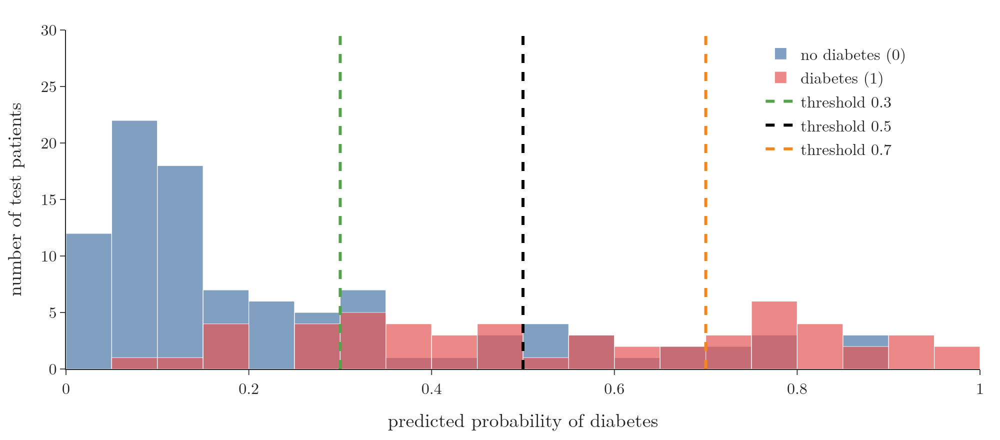

<!-- where-this-fits: generated by course_map/build_map.py; edit concepts.yaml, not this block -->
> **Where this fits:** Pipeline map step 9 (Evaluate). See the [Course map](../01-course-map/note.md).
>
> 
>
> - **Builds on:** Confusion matrix ([Note 76](../76-accuracy-confusion-matrix/note.md)); Precision, recall and F1 ([Note 77](../77-precision-recall-f1/note.md)).
> - **Leads to:** Imbalanced data ([Note 133](../133-imbalanced-data/note.md)).
<!-- /where-this-fits -->

## 1. Overview

> **Key point:** A classifier outputs a probability, and a threshold turns it into 0 or 1. The ROC curve shows the true positive rate against the false positive rate for every threshold. It helps pick the threshold, and the area under it (AUC) compares models.

The ROC curve (receiver operating characteristic curve) is one of the most widely used tools for **binary** classification. It has two uses:

1. **Choosing a threshold**: the cut-off that turns probabilities into yes or no.
2. **Comparing models**: through the area under the curve, AUC.

## 2. Probabilities and thresholds

> **Key point:** Models such as logistic regression predict a probability. A threshold, 0.5 by default, decides which probabilities count as "yes".

### 2.1 From probability to prediction

> **Key point:** Probability at or above the threshold: predict 1. Below: predict 0.

Logistic regression (and most classifiers, such as decision trees or neural networks) does not directly output 0 or 1. It outputs a probability, for example "this patient has a 45% chance of diabetes" (the sigmoid Note).

A **threshold** turns this into a decision. With the usual threshold of 0.5, a probability of 0.45 becomes 0 (no diabetes) and 0.62 becomes 1.

### 2.2 Why change it

> **Key point:** Raising or lowering the threshold trades one kind of mistake for the other.

A spam filter that wrongly binned a job offer is worse than one that lets an advert through (the precision Note). Raising its threshold to 0.75 means an email is called spam only when the model is quite sure. This cuts the dangerous mistakes (false positives), at the cost of more spam getting through.

So the threshold is a dial between the two kinds of mistake. The difficulty is knowing where to set it: 0.3? 0.5? 0.75? The ROC curve shows the consequences of every setting at once.

{height=40%}

Figure 1 shows the example used in this Note: logistic regression on the Pima diabetes data (768 women, 8 medical measurements, 268 with diabetes), trained on 80% and tested on 154 patients. Patients with diabetes (red) tend to get higher probabilities, but the two groups overlap. Each threshold line cuts the overlap in a different place.

## 3. Two rates: benefit and cost

> **Key point:** True positive rate (benefit): the share of real positives caught. False positive rate (cost): the share of real negatives wrongly flagged.

### 3.1 True positive rate

> **Key point:** TPR = TP / (TP + FN). It is the same as recall.

$$\text{TPR} = \frac{TP}{TP + FN}$$

Of all the patients who really have diabetes, the fraction the model flags. It is exactly **recall** (the precision Note). Think of it as the **benefit**: the model exists to find these patients. Higher is better; 1 means every one was found.

### 3.2 False positive rate

> **Key point:** FPR = FP / (FP + TN): the share of healthy patients wrongly flagged.

$$\text{FPR} = \frac{FP}{FP + TN}$$

Of all the patients who really do **not** have diabetes, the fraction the model wrongly flags. Think of it as the **cost**: each one means needless worry and extra tests. Lower is better; 0 means no healthy patient was flagged.

### 3.3 How the threshold moves them

> **Key point:** A low threshold flags almost everyone: both rates high. A high threshold flags almost no one: both rates low.

| Threshold | TP | FN | FP | TN | TPR (benefit) | FPR (cost) |
|---|---|---|---|---|---|---|
| 0.1 | 53 | 1 | 66 | 34 | 0.981 | 0.660 |
| 0.3 | 44 | 10 | 30 | 70 | 0.815 | 0.300 |
| 0.5 | 28 | 26 | 18 | 82 | 0.519 | 0.180 |
| 0.7 | 20 | 34 | 8 | 92 | 0.370 | 0.080 |
| 0.9 | 5 | 49 | 0 | 100 | 0.093 | 0.000 |

- **Threshold 0.1:** almost everyone is flagged. Nearly all diabetic patients are caught (TPR 0.98), but two thirds of the healthy ones are flagged too (FPR 0.66).
- **Threshold 0.9:** almost no one is flagged. No false alarms, but 49 of the 54 diabetic patients are missed.

The ideal would be TPR 1 and FPR 0: every patient caught and no false alarms.

## 4. The ROC curve

> **Key point:** Plot FPR on the x-axis and TPR on the y-axis for every threshold. The curve runs from (0, 0) to (1, 1); the closer it bends towards the top-left corner, the better.

### 4.1 Building it

> **Key point:** Sweep the threshold from 1 down to 0 and mark (FPR, TPR) each time.

For each threshold, compute the confusion matrix, then the two rates, and plot the point (FPR, TPR). Figure 2 animates this sweep.

{height=55%}

- At threshold 1, nothing is flagged: the point is (0, 0).
- As the threshold falls, more patients are flagged and the point moves up and to the right.
- At threshold 0, everyone is flagged: the point is (1, 1).

### 4.2 Its shape

> **Key point:** The curve rises steeply at first, because the first patients flagged are mostly real positives.

The curve is not a straight line. Just below a high threshold, the newly flagged patients are those with very high probabilities, and these are mostly real positives: TPR jumps while FPR barely moves, so the curve climbs steeply.

Near a low threshold, the newly flagged patients have low probabilities and are mostly healthy: FPR rises quickly while TPR hardly changes, so the curve flattens along the top. A good model has a curve that bulges towards the top-left corner.

### 4.3 Choosing the threshold

> **Key point:** A common choice is the point closest to the ideal corner (0, 1). Here that is threshold 0.30.

{height=58%}

The ideal point is (0, 1): all benefit, no cost (the cross in Figure 3, left). A simple rule is to pick the threshold whose point lies closest to it. Here that is threshold 0.30, with TPR 0.83 and FPR 0.30: most diabetic patients are found while 70% of healthy ones are correctly cleared.

The default 0.5 would find only 52% of the diabetic patients. For a screening test, where missing a patient is the worse mistake, the lower threshold is the better choice. If false alarms were the expensive mistake instead, a point further down-left would be chosen.

> **Python:** The ROC curve in scikit-learn.
>
> ```python
> from sklearn.metrics import roc_curve
>
> p = lr.predict_proba(X_test)[:, 1]          # probabilities of class 1
> fpr, tpr, thresholds = roc_curve(y_test, p)
> best = np.argmin(np.hypot(fpr, 1 - tpr))    # closest to (0, 1)
> thresholds[best]                             # 0.297
> ```
>
> `roc_curve` tries every distinct probability as a threshold (154 here). By default it then drops the thresholds that add nothing to the shape of the curve (`drop_intermediate=True`), so it returns 54 here (scikit-learn docs, `roc_curve`).

> **Extra:** Another common rule picks the threshold with the largest $\text{TPR} - \text{FPR}$ (**Youden's J**, Youden 1950; $J$ = sensitivity + specificity − 1 = TPR − FPR). Here it gives a similar threshold, 0.29.

## 5. AUC: the area under the curve

> **Key point:** AUC measures the whole curve with one number: 1 is perfect, 0.5 is random guessing. The model with the higher AUC separates the classes better.

The **area under the ROC curve (AUC)** summarises performance over all thresholds at once.

| AUC | Meaning |
|---|---|
| 1 | perfect: some threshold separates the classes with no mistakes |
| above 0.5 | better than chance; closer to 1 is better |
| 0.5 | no better than random guessing (the diagonal line) |
| below 0.5 | worse than random: the model has the classes the wrong way round |

Random guessing gives the diagonal from (0, 0) to (1, 1), whose area is 0.5, and a curve below the diagonal can be flipped above it by swapping the model's answers (Fawcett 2006, §3 and §7).

On the diabetes test set (Figure 3, right):

| Model | AUC |
|---|---|
| Logistic regression | 0.823 |
| Decision tree (depth 3) | 0.788 |

Logistic regression's curve lies above the tree's for most thresholds, so it separates diabetic from healthy patients better overall.

> **Extra:** AUC has a neat interpretation: it is the probability that a randomly chosen positive patient gets a higher predicted probability than a randomly chosen negative one. An AUC of 0.823 means that happens 82.3% of the time (Fawcett 2006, §7). A direct count over all 54 × 100 pairs of a diabetic and a healthy test patient gives the same 0.823.

> **Python:** AUC in scikit-learn.
>
> ```python
> from sklearn.metrics import roc_auc_score
>
> roc_auc_score(y_test, p)    # 0.823
> ```
>
> Pass probabilities, not 0/1 predictions: with hard predictions, the curve has only one point.

## 6. Summary

| Term | Formula | Meaning |
|---|---|---|
| Threshold | | probability above which the model predicts 1 |
| TPR (recall) | $TP / (TP + FN)$ | benefit: share of real positives caught |
| FPR | $FP / (FP + TN)$ | cost: share of real negatives wrongly flagged |
| ROC curve | TPR against FPR | one point per threshold |
| AUC | area under the curve | 1 perfect, 0.5 random |

- Lowering the threshold raises both TPR and FPR; raising it lowers both.
- Choose the threshold from the ROC curve, for example the point closest to (0, 1), or according to which mistake costs more.
- Compare models by AUC: higher is better.

## 7. Sources

- **Fawcett 2006:** Fawcett, T. "An Introduction to ROC Analysis." *Pattern Recognition Letters* 27(8), 861–874, 2006. Sections 3 and 7.
- **Youden 1950:** Youden, W. J. "Index for Rating Diagnostic Tests." *Cancer* 3(1), 32–35, 1950.
- **scikit-learn docs:** `sklearn.metrics.roc_curve` (drop_intermediate), scikit-learn 1.9.

## 8. Key terms

| Term | Meaning |
|---|---|
| Threshold | The probability cut-off that turns a predicted probability into a class |
| True positive rate (TPR) | The fraction of real positives the model flags; the same as recall |
| False positive rate (FPR) | The fraction of real negatives the model wrongly flags |
| ROC curve | A plot of TPR against FPR for every threshold |
| AUC | The area under the ROC curve; a single score from 0.5 (random) to 1 (perfect) |
| predict_proba | scikit-learn method that returns predicted probabilities instead of classes |
