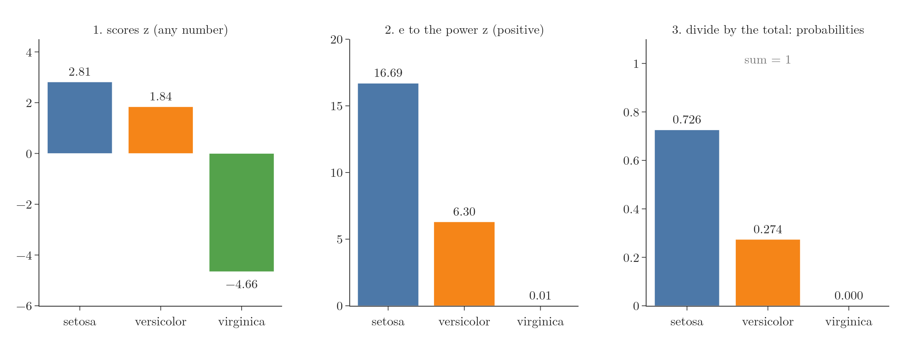

<!-- where-this-fits: generated by course_map/build_map.py; edit concepts.yaml, not this block -->
> **Where this fits:** Pipeline map step 8 (Model). See the [Course map](../01-course-map/note.md).
>
> 
>
> - **Builds on:** One-hot encoding ([Note 27](../27-one-hot-encoding/note.md)); Logistic regression ([Note 75](../75-logistic-gradient-descent/note.md)).
<!-- /where-this-fits -->

## 1. Overview

> **Key point:** Softmax regression extends logistic regression to more than two classes. It computes one score per class and turns the scores into probabilities that add up to 1, using the softmax function.

The logistic regression of the previous Notes handles **binary** classification: placed or not, spam or not. Many problems have more classes. A student might be placed, not placed, or opt out of placements altogether; an iris flower can be one of three species.

**Softmax regression**, also called **multinomial logistic regression**, handles any number of classes. It is also the standard output layer of neural networks that classify, so it matters for deep learning too. With two classes it reduces exactly to ordinary logistic regression.

## 2. The softmax function

> **Key point:** softmax(z)ₖ = e^(zₖ) / Σⱼ e^(zⱼ). Each output is between 0 and 1, and the outputs add up to 1.

### 2.1 The formula

> **Key point:** Raise e to each score, then divide by the total.

Suppose a model gives a flower one score per class, $z_1$, $z_2$ and $z_3$. The scores can be any numbers, positive or negative. The **softmax function** turns them into probabilities:

$$\text{softmax}(z)_k = \frac{e^{z_k}}{e^{z_1} + e^{z_2} + e^{z_3}}$$

In general, with $K$ classes, the denominator sums $e^{z_j}$ over all $K$ classes.

{height=48%}

With numbers (Figure 1), a flower with scores $(2.81,\ 1.84,\ -4.66)$:

1. $e^{z}$: $(16.69,\ 6.30,\ 0.01)$. Every value is now positive, and a larger score gives a much larger value.
2. Divide by the total, 23.00: $(0.726,\ 0.274,\ 0.0004)$.

The flower is most likely setosa (73%), possibly versicolor (27%), and almost certainly not virginica.

### 2.2 Its properties

> **Key point:** All outputs are in (0, 1), they add up to 1, and the order of the scores is kept.

- Each output is between 0 and 1, because $e^{z}$ is always positive and the denominator includes it.
- The outputs always add up to 1: the classes share out all the probability. A flower must be one of the three species.
- The class with the largest score always gets the largest probability.

### 2.3 Two classes give the sigmoid

> **Key point:** With two classes, softmax is the sigmoid of the difference of the two scores.

With two classes, divide the top and bottom by $e^{z_1}$:

$$\frac{e^{z_1}}{e^{z_1} + e^{z_2}} = \frac{1}{1 + e^{-(z_1 - z_2)}} = \sigma(z_1 - z_2)$$

This is the sigmoid of the sigmoid Note. So binary logistic regression is the special case of softmax regression with two classes.

## 3. How the model predicts

> **Key point:** One weight vector per class gives one score per class; softmax turns the scores into probabilities; the largest probability wins.

{width=100%}

With $K$ classes, the model has $K$ weight vectors, one per class (Figure 2). To predict a flower $x$ (with a 1 in front for the intercept):

1. compute a score for every class: $z_k = w^{(k)} \cdot x$;
2. apply softmax to get $K$ probabilities;
3. predict the class with the largest probability.

On the iris data with two inputs (sepal length and petal length), the trained model has three weight vectors:

| Class | Intercept | Sepal length | Petal length |
|---|---|---|---|
| setosa | 11.423 | $-0.210$ | $-2.924$ |
| versicolor | 1.605 | 0.347 | $-0.350$ |
| virginica | $-13.028$ | $-0.137$ | 3.274 |

For a flower with sepal length 3.4 and petal length 2.7, the setosa score is $11.423 - 0.210 \times 3.4 - 2.924 \times 2.7 = 2.81$. The other two come out at 1.84 and $-4.66$. Softmax then gives the probabilities of Figure 1, and the prediction is setosa.

## 4. How the model is trained

> **Key point:** One-hot encode the classes, then minimise the categorical cross entropy, the multi-class version of log loss, with gradient descent.

### 4.1 An intuition: one model per class

> **Key point:** Turn the K-class problem into K yes-or-no problems, one per class.

A simple way to picture training is to **one-hot encode** the output (the one-hot encoding Note). A column with values 0, 1, 2 becomes three columns: "is it class 0?", "is it class 1?", "is it class 2?". Each column is a binary problem, so one logistic regression could be trained per column, giving three weight vectors.

This is close to how the method is often explained, and it works (scikit-learn calls it **one-vs-rest**). But training K separate models is slow on large data, and their probabilities are not designed to add up to 1.

### 4.2 The real approach: one loss for all classes

> **Key point:** L = −(1/m) Σᵢ Σₖ yᵢₖ log ŷᵢₖ. For each row, only the log probability of its true class counts.

Softmax regression instead trains all $K$ weight vectors together, by minimising one loss function, the **categorical cross entropy**:

$$L = -\frac{1}{m}\sum_{i=1}^{m}\sum_{k=1}^{K} y_{ik}\log \hat{y}_{ik}$$

Here $y_{ik}$ is the one-hot value (1 if row $i$ is class $k$, else 0) and $\hat{y}_{ik}$ the softmax probability of class $k$. For each row, every term is multiplied by 0 except the true class. So the loss is simply the average of $-\log$(probability given to the true class): exactly the log loss of the earlier Note, extended to $K$ classes. With $K = 2$ it is the binary cross entropy.

With 2 inputs and 3 classes there are $3 \times 3 = 9$ weights. Gradient descent computes the derivative of $L$ with respect to all nine and updates them together, just as in the gradient descent Note for logistic regression.

## 5. In scikit-learn

> **Key point:** LogisticRegression uses softmax automatically when there are more than two classes. predict_proba returns the softmax probabilities.

> **Python:** Softmax regression on iris.
>
> ```python
> from sklearn.linear_model import LogisticRegression
>
> X = iris.data[:, [0, 2]]               # sepal length, petal length
> clf = LogisticRegression()             # multinomial for 3+ classes
> clf.fit(X_train, y_train)
> clf.score(X_test, y_test)              # 0.967
> clf.predict_proba([[3.4, 2.7]])        # [0.726, 0.274, 0.0004]
> clf.predict([[3.4, 2.7]])              # [0]  (setosa)
> ```

> **Extra:** Older versions of scikit-learn needed `LogisticRegression(multi_class="multinomial")`. Recent versions removed that setting: with the default solver, multi-class problems always use softmax. One-vs-rest is still available as `OneVsRestClassifier(LogisticRegression())`.

On 30 test flowers, the model gets 29 right (accuracy 0.967); the one mistake is a versicolor predicted as virginica.

{height=50%}

Figure 3 shows the **decision regions**: each point of the plane is coloured by the class the model would predict. The boundaries between regions are straight lines, because each score is a linear function of the inputs, so softmax regression is still a linear classifier. The query flower (star) sits in the setosa region, close to the versicolor boundary, which matches its 73%/27% split.

## 6. Summary

- Softmax regression = logistic regression for $K \geq 2$ classes; also called multinomial logistic regression.
- Softmax: $\hat{y}_k = e^{z_k} / \sum_j e^{z_j}$; outputs are probabilities that add up to 1.
- One weight vector per class; predict the class with the largest probability.
- Training minimises the categorical cross entropy with gradient descent; with two classes, everything reduces to the sigmoid and the binary log loss.
- Decision boundaries are straight lines.

## 7. Key terms

| Term | Meaning |
|---|---|
| Softmax regression | Logistic regression extended to any number of classes using the softmax function |
| Multinomial logistic regression | Another name for softmax regression |
| Softmax function | Turns a list of scores into probabilities: $e^{z_k} / \sum_j e^{z_j}$ |
| Categorical cross entropy | The loss of softmax regression: the average of −log(probability of the true class) |
| One-vs-rest | Training one binary classifier per class, each separating that class from all others |
| Decision region | The part of the input space in which a model predicts a given class |
