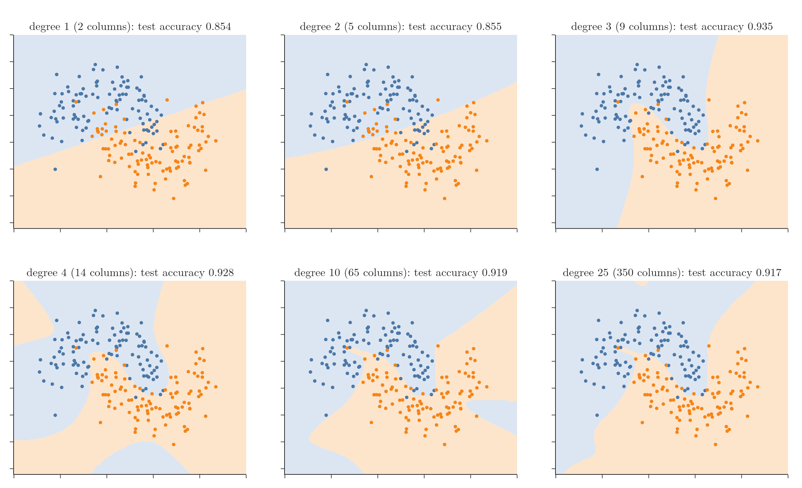

<!-- where-this-fits: generated by course_map/build_map.py; edit concepts.yaml, not this block -->
> **Where this fits:** Pipeline map step 8 (Model). See the [Course map](../01-course-map/note.md).
>
> 
>
> - **Compare with:** Kernel trick ([Note 95](../95-kernel-trick-intuition/note.md)).
<!-- /where-this-fits -->

## 1. Overview

> **Key point:** Logistic regression draws a straight boundary. Adding powers and products of the features as new features lets the same algorithm draw curved boundaries, just as polynomial regression did for linear regression.

The perceptron Note stated a limitation: logistic regression works well only when the classes are (almost) linearly separable. On data where the boundary between the classes is curved, a straight line misclassifies many points.

In this Note each point is one **observation** (one record, a row of the data table). Its two coordinates $x_1$ and $x_2$ are its **features** (input variables, one column each), and its class $y$ is the **target** (the output we predict).

Other algorithms handle such data naturally (decision trees, random forests, SVMs, covered later). But a simple trick also lets logistic regression handle it: **polynomial features**, the same idea as the polynomial regression Note.

## 2. The idea

> **Key point:** Create new features x₁², x₁x₂, x₂², ... and fit ordinary logistic regression on them. A straight boundary in the new features is a curve in the original ones.

With two features $x_1$ and $x_2$, degree 2 creates five feature columns:

$$x_1,\quad x_2,\quad x_1^2,\quad x_1 x_2,\quad x_2^2$$

Logistic regression then learns a weight for each feature, so its boundary is

$$w_0 + w_1 x_1 + w_2 x_2 + w_3 x_1^2 + w_4 x_1 x_2 + w_5 x_2^2 = 0$$

The boundary equation describes a curve (an ellipse, parabola or hyperbola) in the $(x_1, x_2)$ plane. Higher degrees add more terms ($x_1^3$, $x_1^2 x_2$, ...) and allow more complicated curves. The target $y$ is unchanged.

An everyday picture: a straight ruler cannot trace a circle on flat paper. Lift the paper into a bowl shape (the new squared features), and a flat cut through the bowl traces exactly that circle.

The number of features grows quickly with the degree: 2 at degree 1, 5 at degree 2, 9 at degree 3, 65 at degree 10 and 350 at degree 25.

> **Python:** Logistic regression on polynomial features.
>
> ```python
> from sklearn.pipeline import make_pipeline
> from sklearn.preprocessing import PolynomialFeatures, StandardScaler
> from sklearn.linear_model import LogisticRegression
>
> model = make_pipeline(
>     PolynomialFeatures(degree=3, include_bias=False),
>     StandardScaler(),
>     LogisticRegression())
> model.fit(X, y)
> ```
>
> The scaler puts the power features on similar scales; without it, high powers such as $x^{10}$ dominate and the solver needs more steps (at degree 10 on the data below: 279 steps instead of 182).

## 3. An example: two half-moons

> **Key point:** On moon-shaped data, test accuracy rises from 0.854 with a straight line to 0.935 with degree 3, then falls at higher degrees while training accuracy keeps rising: overfitting.

The data has 200 points in two interlocking half-moon shapes (`make_moons` with noise 0.25). No straight line can separate them. Each model is scored on a large fresh test set of 5,000 points from the same generator. Regularisation is kept weak (`C=10000`) so that the effect of the degree is visible. The figure shows one training set; the table averages 20 training sets, so that one lucky or unlucky sample cannot decide the result.

{height=58%}

| Degree | Features | Training accuracy | Test accuracy | Gap |
|---|---|---|---|---|
| 1 | 2 | 0.855 | 0.854 | 0.001 |
| 2 | 5 | 0.859 | 0.855 | 0.005 |
| 3 | 9 | 0.947 | **0.935** | 0.012 |
| 4 | 14 | 0.947 | 0.928 | 0.020 |
| 10 | 65 | 0.962 | 0.919 | 0.043 |
| 25 | 350 | 0.962 | 0.917 | 0.045 |

- **Degree 1:** plain logistic regression, a straight line. The line misclassifies the tips of both moons.
- **Degree 2:** a gentle curve, little better.
- **Degrees 3 and 4:** the boundary bends around the moons. Test accuracy jumps to 0.93.
- **Degrees 10 and 25:** the boundary develops odd loops and islands far from the data. Training accuracy keeps rising, but test accuracy falls to about 0.92, and the gap between the two grows from 0.012 to 0.045.

As with polynomial regression, the degree controls flexibility: too low underfits, too high overfits. The degree is a hyperparameter, chosen by comparing scores on data not used for training. Here degree 3 is best.

> **Extra:** A penalty keeps the many weights small (the Ridge Notes), so it fights the overfitting of high degrees. Same 20 training sets and test set:
>
> | C | Degree 3 test | Degree 10 test | Degree 25 test |
> |---|---|---|---|
> | 10,000 (weak) | 0.935 | 0.919 | 0.917 |
> | 10 (moderate) | 0.932 | **0.933** | 0.931 |
> | 1 (default, strong) | 0.899 | 0.915 | 0.914 |
>
> A moderate penalty lifts degree 10 from 0.919 to 0.933, and its train-test gap shrinks from 0.043 to 0.012. The default `C=1` is too strong for this data: even degree 3 underfits (0.899). So `C` is a second hyperparameter to tune alongside the degree.

## 4. When to use it

> **Key point:** Useful when only a linear model is available or interpretability matters. For strongly non-linear data, tree-based models or SVMs usually do better.

Polynomial features are a quick way to give logistic regression curved boundaries, and they work well for mildly non-linear data like this example. They have costs:

- the number of features explodes with many original features or high degrees, which slows training and invites overfitting;
- the degree must be tuned.

On real data with strongly non-linear patterns, decision trees, random forests or SVMs (later Notes) usually reach better results with less effort.

## 5. Summary

- Logistic regression's boundary is straight; polynomial features make it curved.
- Degree $d$ adds all powers and products of the features up to total power $d$.
- On the moons data: test accuracy 0.854 (straight line) rises to 0.935 (degree 3), then falls at higher degrees while training accuracy keeps rising.
- Choose the degree on data not used for training; standardise the new features; regularisation limits overfitting.

## 6. Key terms

| Term | Meaning |
|---|---|
| Polynomial features | New features made from powers and products of the original features |
| Decision boundary | The line or curve where the model switches from predicting one class to the other |
| make_moons | scikit-learn function that creates two interlocking half-moon classes |
| Test accuracy | Accuracy on data not used for training, an estimate of performance on new data |
