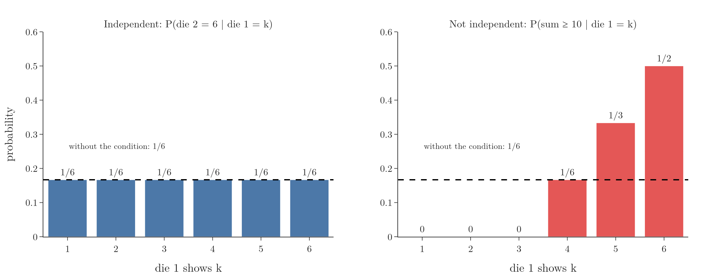

<!-- where-this-fits: generated by course_map/build_map.py; edit concepts.yaml, not this block -->
> **Where this fits:** Pipeline map step 0 (Foundations). See the [Course map](../01-course-map/note.md).
>
> 
>
> - **Leads to:** Naive Bayes ([Note 87](../87-naive-bayes-intuition/note.md)); Voting ensembles ([Note 102](../102-voting-ensemble/note.md)).
<!-- /where-this-fits -->

## 1. Overview

> **Key point:** Two events are independent when knowing one happened does not change the probability of the other: P(A | B) = P(A). Equivalently, P(A ∩ B) = P(A) × P(B).

This Note and the next cover two ideas that are often confused: **independent events** and **mutually exclusive events**. Naive Bayes relies on the first: its "naive" assumption is that the **features** (the input variables, one column each of the data table) are independent of each other. Knowing exactly what independence means makes that assumption easy to understand.

## 2. The definition

> **Key point:** A and B are independent if P(A ∩ B) = P(A) × P(B).

Two events $A$ and $B$ are **independent** if

$$P(A \cap B) = P(A) \times P(B)$$

In words: the probability that both happen is the product of their separate probabilities.

Independent events **can** happen together. What makes them independent is that one happening makes no difference to the chance of the other.

## 3. Examples

> **Key point:** A coin has no memory; two dice do not influence each other.

- **Coin tosses.** A fair coin has come up heads three times in a row. The probability of heads on the next toss is still $1/2$: the coin has no memory of earlier tosses. In a simulation of a million sequences of four tosses, the fourth toss was heads in 49.9% of the cases that started with three heads.
- **Two dice.** Die 1 shows 3. The probability that die 2 shows 6 is still $1/6$: what one die shows does not affect the other.

Check the definition with the dice. Let $A$ be "die 2 shows 6" and $B$ be "die 1 shows 3". Of the 36 equally likely outcomes, only (3, 6) is in both, so

$$P(A \cap B) = \frac{1}{36} = \frac{1}{6} \times \frac{1}{6} = P(A) \times P(B)$$

The two events are independent.

## 4. Why this means "no difference"

> **Key point:** Substituting P(A ∩ B) = P(A) P(B) into the conditional probability formula gives P(A | B) = P(A).

From the conditional probability Note, $P(A \mid B) = P(A \cap B) / P(B)$. If $A$ and $B$ are independent, the top is $P(A) \times P(B)$, so

$$P(A \mid B) = \frac{P(A) \times P(B)}{P(B)} = P(A)$$

Knowing $B$ happened leaves the probability of $A$ exactly as it was. The same argument gives $P(B \mid A) = P(B)$. An unchanged probability is the intuition behind the definition: independence means information about one event tells us nothing about the other.

> **Extra:** The same result can be seen by counting. For independent events, the share of $B$'s outcomes that also belong to $A$ (that is, $n(A \cap B) / n(B)$, the conditional probability) equals the share of the whole sample space that belongs to $A$ ($n(A) / n$). In the dice example, 1 of die 1's six "3" outcomes has die 2 = 6, and 6 of all 36 outcomes do: both $1/6$.

## 5. Independent or not?

> **Key point:** If the conditional probability changes with the condition, the events are not independent.

{height=50%}

Figure 1 conditions two different events on what die 1 shows:

- **Left:** "die 2 shows 6" has probability $1/6$ whatever die 1 shows. Independent.
- **Right:** "the sum is at least 10" has probability $1/6$ overall, but given die 1 it ranges from 0 (die 1 shows 1, 2 or 3) to $1/2$ (die 1 shows 6). Knowing die 1 changes it a lot, so these events are **not** independent.

Checking with the definition for $C$ = "sum at least 10" and $D$ = "die 1 shows 6": $P(C \cap D) = 3/36 = 1/12$, while $P(C) \times P(D) = 1/6 \times 1/6 = 1/36$. The product rule fails.

## 6. Why Naive Bayes cares

> **Key point:** Naive Bayes assumes the features are independent given the class, so that their probabilities can simply be multiplied.

With independent events, the probability of several things happening together is just a product of separate probabilities. Naive Bayes uses the product rule to combine evidence. The **target** (the output we predict) is the class, such as spam or not spam; the features are the words. For an email, the probabilities of the words "free", "offer" and "winner" given "spam" are multiplied together. Real words are not truly independent, which is why the method is called "naive", but the simplification often works well in practice: the assumption introduces some bias but reduces variance (ISL §4.4.4; the Naive Bayes intuition Note).

## 7. Summary

- Independent: $P(A \cap B) = P(A) \times P(B)$, equivalently $P(A \mid B) = P(A)$.
- Independent events can happen together; one just does not affect the other.
- Coins and separate dice are independent; "die 1 = 6" and "sum ≥ 10" are not.

## 8. Sources

- **ISL:** James, G., Witten, D., Hastie, T. and Tibshirani, R. *An Introduction to Statistical Learning*, 2nd ed. Springer, 2021. Section 4.4.4, p. 155.

## 9. Key terms

| Term | Meaning |
|---|---|
| Independent events | Events where one happening does not change the probability of the other |
| Product rule for independent events | $P(A \cap B) = P(A) \times P(B)$ |
| Dependent events | Events that are not independent: knowing one changes the probability of the other |
