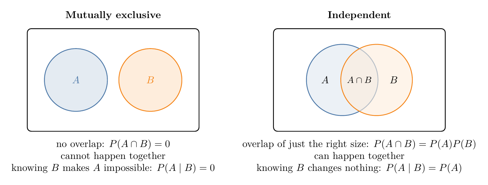

<!-- where-this-fits: generated by course_map/build_map.py; edit concepts.yaml, not this block -->
> **Where this fits:** Pipeline map step 0 (Foundations). See the [Course map](../01-course-map/note.md).
>
> 
>
> - **Leads to:** Naive Bayes ([Note 87](../87-naive-bayes-intuition/note.md)).
<!-- /where-this-fits -->

## 1. Overview

> **Key point:** Two events are mutually exclusive when they cannot happen together: P(A ∩ B) = 0. This is a different idea from independence, and the two are easily confused.

The previous Note defined **independent** events: they can happen together, but one does not affect the other. **Mutually exclusive** events are different: they can never happen together. The two ideas are easy to mix up, so this Note puts them side by side.

## 2. The definition

> **Key point:** Mutually exclusive: P(A ∩ B) = 0, so P(A | B) = 0.

Two events $A$ and $B$ are **mutually exclusive** if

$$P(A \cap B) = 0$$

They have no outcome in common, so at most one of them can happen.

Examples:

- A single coin toss cannot land both heads and tails.
- At a junction, a driver turns either left or right, not both.
- One die cannot show both 3 and 6 on the same roll.

## 3. Conditional probability for mutually exclusive events

> **Key point:** If B happened, A cannot have happened: P(A | B) = 0.

Putting $P(A \cap B) = 0$ into the conditional probability formula:

$$P(A \mid B) = \frac{P(A \cap B)}{P(B)} = \frac{0}{P(B)} = 0$$

With numbers: die 1 has shown 3. The probability that the same die shows 6 on that roll is 0. A driver has turned left; the probability that they turned right is 0.

## 4. Mutually exclusive is not independent

> **Key point:** Knowing B happened tells us A did not, which is a lot of information. So mutually exclusive events (each with a positive probability) are always dependent.

{width=100%}

| | Mutually exclusive | Independent |
|---|---|---|
| Can happen together? | no | yes |
| $P(A \cap B)$ | 0 | $P(A) \times P(B)$ |
| $P(A \mid B)$ | 0 | $P(A)$ |
| Does B tell us about A? | yes: A did not happen | no |

For "die 1 shows 3" ($A$) and "die 1 shows 6" ($B$), each has probability $1/6$:

- $P(A \cap B) = 0$, so they are mutually exclusive.
- $P(A) \times P(B) = 1/36 \neq 0$, so they are **not** independent.

In fact this always happens: if both events have a probability above 0, being mutually exclusive rules out being independent. Learning that one happened tells us for certain that the other did not.

> **Extra:** For mutually exclusive events, the probability that one **or** the other happens is a simple sum: $P(A \cup B) = P(A) + P(B)$. Here $1/6 + 1/6 = 1/3$. This "addition rule" is used in the Bayes' theorem Notes to split a probability into separate cases.

## 5. Summary

- Mutually exclusive: $P(A \cap B) = 0$; the events cannot happen together, and $P(A \mid B) = 0$.
- Independent: $P(A \cap B) = P(A)P(B)$; they can happen together, and $P(A \mid B) = P(A)$.
- Mutually exclusive events with positive probabilities are never independent.

## 6. Key terms

| Term | Meaning |
|---|---|
| Mutually exclusive events | Events that cannot happen at the same time; their intersection has probability 0 |
| Union (A ∪ B) | The event that A or B (or both) happens |
| Addition rule | For mutually exclusive events, $P(A \cup B) = P(A) + P(B)$ |
